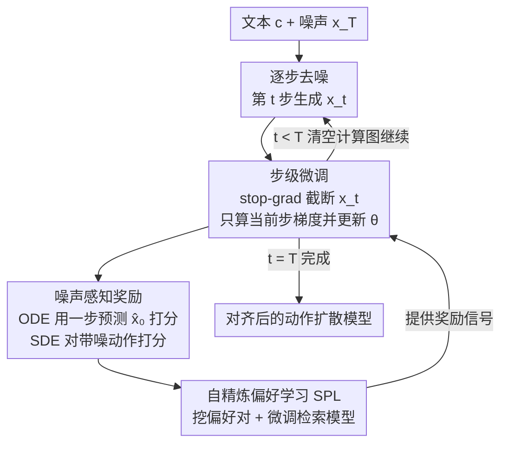

# EasyTune: Efficient Step-Aware Fine-Tuning for Diffusion-Based Motion Generation

**会议**: ICLR2026  
**OpenReview**: [https://openreview.net/forum?id=Fy1EoIaAzQ](https://openreview.net/forum?id=Fy1EoIaAzQ)  
**代码**: 项目页（论文 abstract 中给出，具体地址待确认）  
**领域**: 人体动作生成 / 扩散模型 / RLHF 对齐  
**关键词**: 文本到动作生成、可微奖励、步级微调、偏好学习、显存优化

## 一句话总结
EasyTune 把扩散模型「跑完整条去噪轨迹再算一次奖励梯度」的微调方式，改成**每一步去噪都独立优化一次**，从而打断了梯度在去噪步之间的递归依赖，让显存从 $O(T)$ 降到 $O(1)$、优化更密集；再配一个无需人工标注的自精炼偏好学习（SPL）把检索模型改造成动作奖励模型，最终在 HumanML3D 上比 DRaFT-50 的对齐指标（MM-Dist）好 7.7%，显存只占其额外开销的 31.16%，训练提速 7.3×。

## 研究背景与动机

**领域现状**：文本到动作生成（text-to-motion）目前主流是扩散模型，从一段自然语言描述里采样出连贯的人体动作序列，用于动画、人机交互、VR 等。但扩散模型是用 likelihood-based 目标预训练的，和下游真正关心的目标（语义是否对齐、动作是否合理、是否符合用户偏好）并不一致。为了弥合这个 gap，社区把 RLHF 的思路搬了过来，其中**可微奖励微调**（differentiable reward，如 DRaFT、AlignProp、DRTune）最直接：把一个可微的奖励模型 $R_\phi(x_\theta)$ 的梯度直接反传回扩散参数 $\theta$ 去最大化奖励。

**现有痛点**：可微奖励这类方法有两个硬伤。其一是**优化稀疏且粗粒度**——大多只在跑完整条 $T$ 步去噪轨迹、生成出干净动作 $x_0^\theta$ 之后，才对 $\theta$ 更新一次，优化信号稀疏、收敛慢。其二是**显存爆炸**——要对最终奖励 $\nabla_\theta R(x_\theta)$ 反传，就必须把整条轨迹 $\{x_t^\theta\}_{t=1}^T$ 的计算图和雅可比都存下来，显存随步数线性增长。为了缓解，现有方法还得堆 early stopping、部分梯度阻断之类的工程 trick，复杂又不通用。此外动作领域几乎没有专门的奖励模型，大家只能拿通用检索模型凑合，抓不准动作偏好。

**核心矛盾**：作者从理论（Corollary 1）和实验（Fig. 6）两面定位到根因——优化和**多步去噪轨迹递归耦合**。去噪过程本身是递归的：$x_t^\theta$ 由 $x_{t+1}^\theta$ 生成，所以要算 $\partial x_0^\theta/\partial\theta$ 就得一路解开 $\partial x_1^\theta/\partial\theta, \partial x_2^\theta/\partial\theta, \dots, \partial x_T^\theta/\partial\theta$，这条链既撑爆显存，又带来一个更隐蔽的问题：链式系数 $\prod_{s=1}^{t-1}\partial\pi_\theta(x_s^\theta)/\partial x_s^\theta$ 在优化中趋近于 0（梯度消失），导致**早期高噪声步几乎得不到优化**——而恰恰是这些早期步对最终动作影响最大。

**本文目标**：在不存整条计算图、不依赖复杂 trick 的前提下，做到对每一步去噪都能密集、细粒度地优化；同时解决「动作领域没有奖励模型、也没有人工偏好对」这个配套难题。

**切入角度**：作者的关键观察是——图像生成里奖励大多是 output-level 的（带噪中间态语义太复杂、看不懂），所以没法做步级奖励；但**动作表示的语义更简单、更可解释**（Fig. 4 显示动作在带噪状态下和干净状态的相似度仍很高），这让「对带噪中间动作直接打分」变得可行。既然能给中间步打分，就能在每一步当场优化。

**核心 idea**：用「每步独立优化」替代「整条轨迹优化」，靠 stop-gradient 切断去噪步之间的递归依赖，把梯度从 $O(T)$ 的链拆成 $O(1)$ 的单步项；并用自精炼偏好学习把现成检索模型免标注地改造成动作奖励模型。

## 方法详解

### 整体框架

EasyTune 的输入是一个预训练的扩散动作生成模型 $\epsilon_\theta$（如 MLD、MLD++、MotionLCM、MDM）和文本条件 $c$，输出是一个被奖励对齐过、能生成更符合语义/偏好动作的微调后模型。整套方法分两条线协同：一条是**奖励模型的获得**（SPL，把检索模型变成会打偏好分的动作奖励模型），另一条是**扩散模型的微调**（step-aware 优化，用这个奖励模型逐步对齐扩散模型）。

对比一下旧范式就看得很清楚：旧方法（图左）从噪声采样出完整轨迹，把整条轨迹的计算图全留着，跑到 $x_0^\theta$ 才反传一次 $\nabla_\theta R_\phi(x_0^\theta,c)$；EasyTune（图右）在去噪进行到第 $t$ 步时，就用 stop-gradient 把 $x_t^\theta$ 截断，只对**当前这一步**的 $\partial\pi_\theta/\partial\theta$ 算梯度、当场更新，然后清空计算图再走下一步。奖励侧则区分 ODE / SDE 两类采样器：ODE 用一步预测出的粗糙干净动作 $\hat x_0$ 打分，SDE 用 noise-aware 奖励直接对带噪动作打分。

### 关键设计

**1. 步级解耦优化：用 stop-gradient 打断去噪步之间的递归梯度链**

这是全文的核心，直接针对「显存爆炸 + 早期步梯度消失」两个痛点。旧方法的损失是对最终动作打奖励 $L(\theta)=-\mathbb{E}[R_\phi(x_0^\theta,c)]$，展开其梯度（Eq. 5）会出现一个链式系数 $\prod_{s=1}^{t-1}\partial\pi_\theta(x_s^\theta)/\partial x_s^\theta$，它既要求保存整条轨迹的计算图（显存 $O(T)$），又在 $t$ 大时趋于 0 让早期步学不动。EasyTune 把目标改成对**每一步带噪动作**打奖励，并对时间步做均匀采样：

$$L_{\text{EasyTune}}(\theta) = -\mathbb{E}_{c\sim D_T,\, x_t^\theta\sim\pi_\theta(\cdot|c),\, t\sim U(0,T)}\big[R_\phi(x_t^\theta, t, c)\big]$$

关键动作是在反向步里对上一状态加 stop-gradient $\mathrm{sg}(\cdot)$：

$$x_{t-1}^\theta = \pi_\theta(\mathrm{sg}(x_t^\theta), t, c) = \frac{1}{\sqrt{\alpha_t}}\Big(\mathrm{sg}(x_t^\theta) - \frac{\beta_t}{\sqrt{1-\bar\alpha_t}}\,\epsilon_\theta(\mathrm{sg}(x_t^\theta), t, c)\Big)$$

这样一来梯度（Corollary 2）就退化成只剩当前步的直接项 $\partial x_{t-1}^\theta/\partial\theta = \partial\pi_\theta(\mathrm{sg}(x_t^\theta),t,c)/\partial\theta$，那条递归的链彻底断掉。结果是：每步只需当前步的计算图、算完即清，显存从 $O(T)$ 压到常数 $O(1)$（Fig. 6 验证旧方法显存随步数线性增长、EasyTune 持平）；而且每步独立优化、不再被趋零的链式系数压制，早期高噪声步也能得到充分更新——这正是它对齐效果更好的来源。注意它和最接近的 DRTune 的区别：DRTune 虽然也用了 $\mathrm{sg}(\cdot)$，但它的更新式（Eq. 10）里仍保留了 $\partial x_t^\theta/\partial\theta$ 这一项，递归没断干净，显存依旧 $O(T)$。

**2. 噪声感知奖励：让奖励模型能直接给「带噪中间动作」打分**

步级优化能成立的前提是——奖励模型必须能评价**带噪声的中间动作**，而不是只会评价干净动作。这一步利用了动作领域的特殊性：动作语义在带噪态下仍相对可解释（Fig. 4）。具体按采样器分两路（Eq. 12）：对 ODE-based 模型（如 MLD、MLD++、MotionLCM），靠确定性采样可以用一步预测 $\hat x_0 = \pi'_\theta(x_t,t,c)$ 还原出粗糙干净动作，再对 $\hat x_0$ 打分作为该步奖励 $R_\phi(\hat x_0, 0, c)$；对 SDE-based（以及 ODE）模型，直接用噪声感知奖励 $R_\phi(x_t,t,c)$ 对带噪动作评分。奖励本身定义为动作特征与文本特征的对齐相似度（Eq. 11）：

$$R_\phi(x,c) = E_M(x)\cdot E_T(c)\cdot \tau$$

其中 $E_M, E_T$ 是动作/文本编码器，$\tau$ 是可学习温度。这一设计把「每步可打分」这件事真正落地，是步级优化能跑通的桥梁。

**3. 自精炼偏好学习 SPL：免人工标注地把检索模型改造成偏好奖励模型**

动作领域几乎没有大规模高质量偏好对，直接训奖励模型不现实；而现成的检索模型只学了「把正确文本-动作配对拉近」，并不会区分「更好 vs 更差」的动作，拿来当奖励是次优的。SPL 用一个检索辅助任务自动造偏好对来微调它，两步走。**偏好对挖掘**：给定文本 $c$ 和真值动作 $x_{gt}$，按奖励分检索 top-$k$ 动作集合 $D_R$（Eq. 13）；如果真值 $x_{gt}\notin D_R$（说明当前模型没把它排进前列，这是有信息量的负样本信号），就令偏好动作 $x_w=x_{gt}$、非偏好动作 $x_l$ 取检索集中得分最高的那个；否则模型本来就排得对，没有有信息量的负样本，置 $x_l=x_{gt}$ 并让目标分布 $Q=(0.5,0.5)$，从而 KL 梯度为零、自动跳过这个样本（Eq. 14、16）。**偏好微调**：把 $(x_w, x_l)$ 的奖励分过 softmax 得 $P$（Eq. 15），用目标分布 $Q$（偏好时 $(1.0,0.0)$）监督，最小化 KL 散度（Eq. 17）：

$$L_{\text{SPL}}(\phi) = D_{KL}(Q\,\|\,P) = \sum_{x\in\{x_w,x_l\}} Q(x,c)\log\frac{Q(x,c)}{P(x,c)}$$

「自精炼」体现在：负样本是动态地、专门针对当前模型的薄弱处（误检索结果）挖出来的，不靠任何人工标注就能把检索模型逼成会区分偏好的奖励模型。训练好后奖励模型冻结，给扩散微调提供监督。

### 损失函数 / 训练策略

整体两阶段：先用 SPL（最小化 $L_{\text{SPL}}$，top-$K=10$，奖励模型用 ReAlign 初始化）训出冻结的动作奖励模型；再用步级目标 $L_{\text{EasyTune}}$ 微调扩散模型（学习率 $1\times10^{-5}$、batch 256，单卡 RTX A6000 48GB）。论文还给了一个 Chain Optimization 变体作对照（保留链式但用步级思想），主推的是 Step Optimization。

## 实验关键数据

### 主实验

在 HumanML3D 上对比各类可微奖励微调方法（base 为 MLD），EasyTune 在对齐、保真和显存上都拿到最好或次好：

| 方法 | R-P@1 ↑ | FID ↓ | MM-Dist ↓ | 显存(GB) ↓ |
|------|---------|-------|-----------|-----------|
| MLD (Base) | 0.504 | 0.450 | 3.052 | 15.21 |
| w/ DRaFT-50 | 0.528 | 0.197 | 2.872 | 37.32 |
| w/ AlignProp | 0.560 | 0.266 | 2.739 | 30.40 |
| w/ DRTune | 0.549 | 0.313 | 2.795 | 27.01 |
| **w/ EasyTune (Step)** | **0.581** | **0.132** | **2.637** | **22.10** |

相对 base，FID 改善 70.7%、MM-Dist 改善 13.6%；对齐（MM-Dist）比 DRaFT-50 好 7.7%，显存只占其额外开销的 31.16%，训练提速 7.3×。把 EasyTune 接到 SOTA 文本-动作生成模型上也能稳定涨点：MLD 的 R-P@1 从 0.504→0.581，MLD++ 从 0.548→0.591，超过 ParCo（0.515）、ReMoDiffuse（0.510）等。

### 消融实验

| 配置 | 关键指标 | 说明 |
|------|---------|------|
| EasyTune (Step Optimization) | FID 0.132 / 显存 22.10GB | 完整方法：每步独立优化 |
| EasyTune (Chain Optimization) | FID 0.172 / 显存 24.21GB | 保留链式，验证步级思想本身有效但仍偏贵 |
| 一步预测奖励 (ODE) | R-P@1 0.568 (MLD) | Eq. 12 第一项，ODE 用 $\hat x_0$ 打分 |
| 噪声感知奖励 (SDE+ODE) | R-P@1 0.581 (MLD) | Eq. 12 第二项，直接对带噪动作打分 |

### 关键发现
- **显存随步数恒定是最直接的证据**：Fig. 6 显示 DRaFT/AlignProp/DRTune 的显存随去噪步数线性上升，EasyTune 持平 $O(1)$——直接印证递归依赖确实被 stop-gradient 切断。
- **步级优化解决早期步梯度消失**：Fig. 3 中链式系数随 $t$ 增大趋零，正是早期高噪声步学不动的原因；EasyTune 让每步独立更新后收敛更快、reward 更高。
- **泛化性强**：跨 6 个预训练扩散 backbone（MLD、MLD++、MotionLCM、MDM 等）都能涨点，说明方法和具体架构解耦。

## 亮点与洞察
- **一个 stop-gradient 解决两个问题**：既把显存从 $O(T)$ 砍到 $O(1)$，又顺手治好了早期步梯度消失——同一个机制同时解决「贵」和「学不好」，干净利落，比堆 early-stopping / 梯度阻断的工程 trick 优雅得多。
- **抓住了「动作 vs 图像」的本质差异**：图像中间态语义难解释、只能 output-level 打分，而动作带噪态仍可解释（Fig. 4），所以步级奖励在动作上才成立。这个 domain insight 是方法能落地的真正前提，迁移到其他「中间态可解释」的模态（如轨迹、骨架序列）也成立。
- **SPL 免标注造偏好对的思路可复用**：把「真值没被检索模型排进 top-k」当作天然的偏好信号，自动挖负样本，不依赖人工标注——这套自精炼范式可迁移到任何「有检索模型但缺偏好数据」的对齐场景。

## 局限与展望
- 步级奖励能成立依赖「中间态语义可解释」这一动作领域特性（Fig. 4），换到图像等中间态语义复杂的模态，该框架未必直接可用，作者自己也点明这是动作领域的特殊优势。
- 奖励模型质量天花板受限于初始检索模型（ReAlign）与 SPL 挖出的偏好对质量；当真值已在 top-k 内时样本被直接跳过，可能浪费部分本可利用的弱信号。
- 评测集中在 HumanML3D / KIT-ML 两个标准动作数据集，对更长、更复杂或多人交互动作的对齐效果仍待验证。
- 可改进方向：把「跳过样本」的判定从硬阈值改成软加权，或引入更强的步级奖励（如显式建模物理合理性）进一步提升对齐。

## 相关工作与启发
- **vs DRaFT / AlignProp / ReFL**：它们都对完整轨迹反传一次奖励梯度，显存 $O(T)$、优化稀疏；EasyTune 改成每步优化、显存 $O(1)$，对齐更好且省 60%+ 显存。
- **vs DRTune**：DRTune 同样用 stop-gradient，但更新式里仍保留 $\partial x_t^\theta/\partial\theta$，递归没断净、显存仍线性增长；EasyTune 把递归项彻底去掉（Corollary 2），这是显存常数化的关键区别。
- **vs DPO/SoPo 类偏好优化**：DPO 路线显式依赖大规模人工偏好对，获取成本高；SPL 用检索辅助任务自动造对、无需人工标注，绕开了偏好数据稀缺这个瓶颈。
- **vs DDPO/DPOK 策略梯度**：策略梯度依赖可精确计算的 likelihood，对扩散模型不友好；EasyTune 走可微奖励直接最大化，规避了这个问题。

## 评分
- 新颖性: ⭐⭐⭐⭐⭐ 用 stop-gradient 把可微奖励微调从轨迹级降到步级，理论（Corollary 1/2）+ 实证定位根因，是首个对扩散文本-动作做可微奖励微调的工作。
- 实验充分度: ⭐⭐⭐⭐ 跨 6 个 backbone、两个数据集，显存/收敛/对齐多维验证充分；但偏好数据质量、长动作等场景的分析略少。
- 写作质量: ⭐⭐⭐⭐ 动机推导（递归依赖→梯度消失→步级解耦）逻辑链清晰，配图到位；公式密集，部分符号偏多。
- 价值: ⭐⭐⭐⭐⭐ 显存降 60%+、提速 7.3×、对齐更好，对动作生成的 RLHF 落地极具实用价值，思路可迁移到其他可解释中间态模态。

<!-- RELATED:START -->

## 相关论文

- [\[AAAI 2026\] ReAlign: Text-to-Motion Generation via Step-Aware Reward-Guided Alignment](../../AAAI2026/human_understanding/realign_text-to-motion_generation_via_step-aware_reward-guided_alignment.md)
- [\[ICLR 2026\] Pose-RFT: Aligning MLLMs for 3D Pose Generation via Hybrid Action Reinforcement Fine-Tuning](pose-rft_aligning_mllms_for_3d_pose_generation_via_hybrid_action_reinforcement_f.md)
- [\[ICLR 2026\] PulpMotion: Framing-Aware Multimodal Camera and Human Motion Generation](pulp_motion_framing-aware_multimodal_camera_and_human_motion_generation.md)
- [\[CVPR 2026\] Causal Motion Diffusion Models for Autoregressive Motion Generation](../../CVPR2026/human_understanding/causal_motion_diffusion_models_for_autoregressive_motion_generation.md)
- [\[ICLR 2026\] Motion-Aligned Word Embeddings for Text-to-Motion Generation](motion-aligned_word_embeddings_for_text-to-motion_generation.md)

<!-- RELATED:END -->
