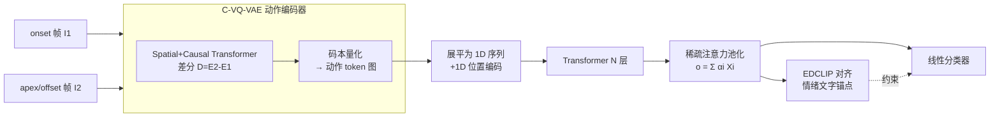

# From Pixels to Semantics: Unified Facial Action Representation Learning for Micro-Expression Analysis

**会议**: ICLR 2026  
**OpenReview**: [https://openreview.net/forum?id=yJFVKlratr](https://openreview.net/forum?id=yJFVKlratr)  
**代码**: 已开源（GitHub，论文未给出具体链接）  
**领域**: 微表情识别 / 面部动作表示学习 / 情感计算  
**关键词**: 微表情识别(MER)、离散面部动作编码、VQ-VAE、动作 token、CLIP 对齐、稀疏注意力  

## 一句话总结
本文提出 D-FACE，用在大规模人脸视频上预训练的条件 VQ-VAE 把两帧之间的面部肌肉运动离散成「身份与域无关」的语义级动作 token，再用带稀疏注意力池化的 Transformer + 情感描述引导的 CLIP 对齐做微表情识别，首次把 MER 从依赖像素级运动描述子（光流/帧差）转向语义级 token，并顺带实现了跨身份/跨域的微表情生成。

## 研究背景与动机
**领域现状**：微表情（ME）是不到 0.5 秒、局部、微弱的非自主面部运动，能泄露被刻意隐藏的真实情绪，在测谎、医疗、安防中价值很高。主流微表情识别（MER）方法依赖手工像素级运动描述子——光流（OFF-ApexNet、STSTNet、SLSTT）和帧差（MMNet），近年也有用自编码器估计光流的端到端方案，但手工光流仍是主流。

**现有痛点**：像素级运动描述子有两个根本缺陷——其一，**对身份高度敏感**，同一个动作在不同人脸上的位移场差别很大，导致跨主体迁移性差；其二，它描述的是**位移场而非肌肉运动的语义含义**，而后者才真正与情绪解读相关。叠加微表情标注数据极度稀缺，深度模型的鲁棒性和泛化进一步受限。

**核心矛盾**：我们想要的是「两帧之间发生了什么面部动作」这种高层语义，且这种语义应当能在不同身份、数据集甚至域之间共享；但现有表示停留在像素位移层面，既不语义也不通用。

**本文目标**：学到一套紧凑、身份与域无关、可跨数据集共享的**语义级面部动作表示**，既能提升 MER 精度，又能用于生成新的微表情数据。

**核心 idea**：**[范式转移]** 把面部运动当作「离散词汇」——借鉴机器人潜动作量化的条件 VQ-VAE，在百万级人脸图像对上预训练一个面部动作 tokenizer，将帧间肌肉运动离散成一组共享码本里的 token，作为表示面部动作的「统一词表」；**[序列建模]** 经验分析发现这些 token 具有「顺序依赖语义」（同一 token 在序列不同位置激活不同肌肉），故把 token 图展平成 1D 序列、像句子一样用 Transformer 建模；**[语义锚定]** 用情感文字描述作 CLIP 锚点把动作 token 对齐到人类可理解的情绪。

## 方法详解

### 整体框架
给定一段微表情的 onset 与 offset（或 apex）两帧，D-FACE 先用条件 VQ-VAE（C-VQ-VAE）把两帧的面部肌肉运动**离散成语义动作 token 图**；再把 token 图展平成 1D 序列、加 1D 位置编码、送入 Transformer，用**稀疏注意力池化**聚合出判别性强的动作线索；最后用**情感描述引导的 CLIP（EDCLIP）** 把动作特征对齐到情绪文字锚点完成识别。整个动作 tokenizer 在 VoxCeleb 上无监督预训练，下游 MER 时再微调。

### 关键设计

**1. 条件 VQ-VAE 离散面部动作编码：用信息瓶颈逼出身份/域无关 token。** 编码器对两帧 $I_1,I_2$ 分别做 patch embedding，经 spatial Transformer 提局部空间依赖、再经 causal Transformer 建模 $I_1\!\to\!I_2$ 的有向时间转移，最后 CNN 得到嵌入图 $E_1,E_2$，运动嵌入取差分 $D=E_2-E_1$。把 $D$ 的每个向量映射到码本 $Z=\{z_1,...,z_K\}$ 中最近的码字得到 token 索引图 $(M)_{i,j}=\arg\min_k\|(D)_{i,j}-z_k\|_2^2$。训练时用 NSVQ 平滑量化梯度 $\tilde D = D + \frac{\|D-\tilde Z\|}{\|V\|}V$（$V\!\sim\!\mathcal N(0,1)$），再上投影解码重建第二帧，损失为像素重建 $L_{rec}=\|I_2-\hat I_2\|_2^2$。关键在于：由于预训练数据（VoxCeleb 7000+ 身份、姿态外观差异巨大）极其多样，**有限码本无法编码个体特异的形态差异**（比如某人「张嘴」的具体嘴型），优化目标自然逼着量化只保留跨身份共享的稳定运动模式、滤掉身份/外观相关变化——这正是身份与域无关性的来源。本文相对机器人原版的适配在于：重新设计码本大小与序列长度、并通过大量 token-运动可视化分析揭示 token 如何编码面部动态，是数据与分析驱动的整条管线重设计，而非加 adapter。

**2. 顺序依赖语义 → 1D 序列 Transformer 建模。** 作者通过「单 token 篡改」实验（输入两张相同人脸得到「无动作」索引图，再单独改一个索引并重新生成人脸）发现两个反直觉现象：其一，**同一动作 token 放在序列不同位置会激活不同的肌肉运动**，token 语义取决于序列位置而非全局固定；其二，**上方区域的 token 也能驱动下方嘴部动作、下方 token 能影响上方眉毛**，即 2D 位置与激活的面部区域并不对应，而是由相对顺序和上下文交互决定——这与 CNN 靠局部几何邻接组织语义截然不同。基于此，把动作 token 嵌入展平为 1D 序列 $\hat Z=(\hat z_1,...,\hat z_L)$、加可学习位置编码 $g_i=T(\hat z_i)+p_i$，用 $N$ 层标准 Transformer 做上下文交互。消融证实 1D PE 优于 2D PE 和 CNN backbone，印证了「token 该当作句子建模」这一观察。

**3. 稀疏注意力池化：只聚焦真正激活肌肉的少数 token。** 微表情天然局部，序列中只有部分动作 token 真正对应肌肉运动，其余 token 几乎无效。用全局查询向量 $q$ 算注意力 $\alpha=\mathrm{softmax}(Xq/\sqrt d)$，池化为 $o=\sum_i \alpha_i (X)_{i,:}$；为鼓励稀疏、聚焦信息性局部线索，对 $\alpha$ 加熵惩罚 $L_{sparse}=-\frac1L\sum_i \alpha_i\log\alpha_i$。消融显示稀疏注意力池化优于平均池化和 class token，说明应「强调少数信息 token」而非均匀分配注意力。

**4. EDCLIP：用情感文字描述作锚点，并把「others」推远。** 为把动作 token 桥接到人类可理解情绪，给每个情绪类设计文字动作描述（如「surprise: 扬眉+张嘴」），用冻结的 CLIP 文本编码器得类级嵌入 $\{t_c\}$；把池化动作特征 $o$ 经可学习函数 $f(\cdot)$ 投到同一空间，做对比损失 $L_{CLIP}=-\log\frac{\exp(\mathrm{sim}(f(o),t_y)/\tau)}{\sum_c \exp(\mathrm{sim}(f(o),t_c)/\tau)}$。难点在于 MER 特有的「others」类是语义模糊、无法用语言精确描述的——本文不给它分配文字锚点，而是用 margin 约束 $L_{oth}=\max(0,\max_{c\neq c_{oth}}\mathrm{sim}(f(o),t_c)-\delta)$ 把它推离所有具体情绪锚点，保留其内在模糊性。总损失 $L=L_{cls}+\lambda_{rec}L_{rec}+\lambda_{sparse}L_{sparse}+\lambda_{EDCLIP}L_{EDCLIP}$。

## 实验关键数据

预训练：VoxCeleb 上随机采样间隔 8–15 帧（约 0.25–0.5 秒，匹配微表情时长）的图像对，约 100 万对、7000+ 身份，训练 80 万步、码本大小 32、特征维 32。下游用 LOSO 协议在 CASME-II / SMIC-HS / SAMM / CAS(ME)³ 上评测。

### 主实验表格

CDE（复合数据集，三分类，MEGC2019）：

| 方法 | Full UF1 | Full UAR | CASME-II UF1 | SMIC-HS UF1 | SAMM UF1 |
|------|----------|----------|--------------|-------------|----------|
| SLSTT (2022) | 0.8160 | 0.7900 | 0.9010 | 0.7400 | 0.7150 |
| SRMCL (2024) | 0.8630 | 0.8830 | 0.9635 | 0.7946 | 0.8470 |
| HTNet (2024) | 0.8603 | 0.8475 | 0.9532 | 0.8049 | 0.8131 |
| LTR3O (2025) | 0.8931 | 0.8819 | 0.9578 | 0.8336 | **0.8912** |
| **Ours** | **0.8943** | **0.8967** | **0.9738** | **0.8422** | 0.8716 |

CAS(ME)³（四分类，最大基准之一）：

| 方法 | UF1 | UAR |
|------|-----|-----|
| µ-bert (2023) | 0.4718 | 0.4913 |
| MER-CLIP (2025，额外用 AU 标注) | 0.6544 | 0.6242 |
| **Ours** | **0.6807** | **0.6469** |

D-FACE 在 CDE 复合集 Full UF1/UAR 双第一；在 CAS(ME)³ 上比第二名 MER-CLIP（还多用了 AU 标注）UF1 高 4.02%、UAR 高 3.64%。SAMM 上仅次优，原因是 SAMM 是灰度图而模型在 RGB 上预训练。

### 消融实验表格

C-VQ-VAE 容量（CAS(ME)³）与组件消融（CASME-II 五分类）：

| 维度 | 设置 | ACC/UF1 |
|------|------|---------|
| 码本×序列 | 32×16（最优） | UF1 0.6807 |
| 码本×序列 | 16×9（过小） | UF1 0.5210 |
| 码本×序列 | 64×16（过大冗余） | UF1 0.6227 |
| 识别网络 | CNN backbone | UF1 0.8120 |
| 识别网络 | Transformer 2D PE | UF1 0.8164 |
| 识别网络 | **Transformer 1D PE** | **UF1 0.8571** |
| 聚合 | Average Pooling | UF1 0.8345 |
| 聚合 | Class Token | UF1 0.8294 |
| 聚合 | **Sparse Attention Pooling** | **UF1 0.8571** |
| EDCLIP | w/o | UF1 0.8286 |
| EDCLIP | **w/** | **UF1 0.8571** |

### 关键发现
- **码本要「紧凑而富表达」**：32×16 最优，过小丢细节、过大引入冗余且训练不稳定（大量码字罕用、捕捉无用细节）。
- **1D 序列建模 > 2D 空间结构**：验证了 token 顺序依赖语义的经验观察。
- **三个组件各自有效**：稀疏注意力池化、1D Transformer、EDCLIP 逐一叠加都带来提升。
- **泛化外溢到生成**：稀疏注意力选出的显著 token 可迁移到跨身份/跨域人脸，生成保留同一微表情的新图像，说明 token 确实是身份无关的语义动作表示。

## 亮点与洞察
- **范式级贡献**：首次把 MER 从像素级运动描述子（光流/帧差）切换到语义级离散动作 token，给出「面部动作 = 离散词汇」的统一视角。
- **跨领域迁移巧思**：把机器人潜动作量化的 C-VQ-VAE 迁到人脸域，并通过信息瓶颈 + 多样化大规模预训练「自动」逼出身份/域无关性，无需显式解耦设计。
- **可解释的经验分析**：单 token 篡改实验揭示 token 的顺序依赖语义与「位置≠区域」现象，既是 1D 建模的依据，也提供了难得的可解释性。
- **「others」类的优雅处理**：用 margin 推远而非强行对齐到模糊描述，契合 MER 任务特性。
- **识别 + 生成双能力**：同一套 token 既提升识别又支持跨身份/跨域微表情生成，扩展了数据增广的想象空间。

## 局限与展望
- **RGB 预训练对灰度域不友好**：SAMM 为灰度图，预训练在 RGB 上，导致 SAMM 上仅次优，提示需要跨色彩域的预训练或适配。
- **依赖 onset/apex 关键帧**：方法以两帧（onset–offset/apex）为输入，SMIC-HS 缺 apex 标注需用中间帧伪 apex，关键帧定位误差会传导到 token 质量。
- **码本规模手工搜索**：最优码本/序列长度靠容量研究人工选定，缺乏自适应机制。
- **情绪文字描述需人工设计**：EDCLIP 的类描述由人工撰写，迁移到新情绪体系或更细粒度 AU 时需重新设计 prompt。
- **生成质量未定量评估**：跨域生成多为定性可视化，缺乏统一的生成保真度/身份保持度指标。

## 相关工作与启发
- **像素级运动描述子**：LBP-TOP、OFF-ApexNet、STSTNet、SLSTT、MMNet、LTR3O 等是被本文「取代」的主流路线；本文论证它们身份敏感、仅描述位移场而非语义。
- **VQ-VAE / 潜动作量化**：借鉴 Genie 与机器人潜动作模型（Ye et al. 2025），把离散控制 token 思想迁到面部动作，是「离散表示学习跨任务复用」的好例子。
- **CLIP 对齐**：延续 MER-CLIP 等用文本桥接情绪语义的思路，但创新性地处理了「others」模糊类。
- **启发**：(1) 「用有限码本 + 多样数据的信息瓶颈自动逼出不变性」是一条通用的解耦替代路径，可推广到表情/手势/步态等其他人体动作表示；(2) token 的顺序依赖语义提示，离散动作表示未必要对齐到 2D 空间布局，序列化建模可能更契合；(3) 离散动作 token 天然支持「识别 + 生成」一体化，可作低资源场景的数据增广引擎。

## 评分
- **新颖性**: ⭐⭐⭐⭐⭐ 首次把 MER 从像素级运动转到语义级离散动作 token，范式级转移，且对 token 语义的经验分析提供了新视角。
- **实验充分度**: ⭐⭐⭐⭐ 四个标准数据集 + CDE 协议 + 多组消融/容量研究，覆盖识别与生成；但生成质量缺定量评估、灰度域短板未解。
- **写作质量**: ⭐⭐⭐⭐ 动机—观察—方法逻辑清晰，图示（动机图、框架图、token 篡改、注意力可视化）到位，公式完整。
- **价值**: ⭐⭐⭐⭐⭐ 不仅刷新 SOTA，更重要是为情感计算/面部动作分析提供了一套可迁移、可解释、识别生成一体的语义表示范式，影响面超出 MER 本身。

<!-- RELATED:START -->

## 相关论文

- [\[CVPR 2026\] Region-Aware Instance Consistency Learning for Micro-Expression Recognition](../../CVPR2026/human_understanding/region-aware_instance_consistency_learning_for_micro-expression_recognition.md)
- [\[CVPR 2026\] PRISM: Learning a Shared Primitive Space for Transferable Skeleton Action Representation](../../CVPR2026/human_understanding/prism_learning_a_shared_primitive_space_for_transferable_skeleton_action_represe.md)
- [\[CVPR 2026\] CLEX: Complementary Label Exchange Learning for Noisy Facial Expression Recognition](../../CVPR2026/human_understanding/clex_complementary_label_exchange_learning_for_noisy_facial_expression_recogniti.md)
- [\[AAAI 2026\] Facial-R1: Aligning Reasoning and Recognition for Facial Emotion Analysis](../../AAAI2026/human_understanding/facial-r1_aligning_reasoning_and_recognition_for_facial_emotion_analysis.md)
- [\[ICLR 2026\] EMBridge: Enhancing Gesture Generalization from EMG Signals Through Cross-modal Representation Learning](embridge_enhancing_gesture_generalization_from_emg_signals_through_cross-modal_r.md)

<!-- RELATED:END -->
