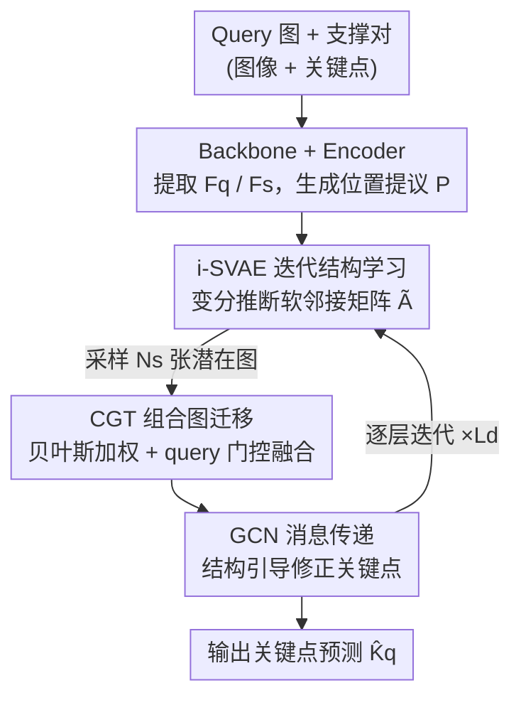

# GenCape: Structure-Inductive Generative Modeling for Category-Agnostic Pose Estimation

**会议**: ICLR 2026  
**OpenReview**: [https://openreview.net/forum?id=IVjs6vNDhV](https://openreview.net/forum?id=IVjs6vNDhV)  
**代码**: 无  
**领域**: 人体理解 / 类别无关姿态估计  
**关键词**: 类别无关姿态估计, 变分图自编码器, 潜在骨架结构, 贝叶斯融合, 少样本

## 一句话总结
GenCape 把类别无关姿态估计（CAPE）里的关键点骨架结构当作**潜在变量**来生成：用一个迭代式结构感知变分自编码器（i-SVAE）从支撑图像里推断实例特定的软邻接矩阵，再用组合图迁移（CGT）模块把多张采样图按不确定性与 query 相关性贝叶斯融合成一张 query 感知的图，从而**完全摆脱预定义骨架和文本先验**，在 MP-100 上 1-shot/5-shot 均刷出新 SOTA（mPCK 比 FMMP +1.59%）。

## 研究背景与动机

**领域现状**：类别无关姿态估计（CAPE）的目标是只给几张带标注的支撑图（support），就能在任意新类别的 query 图上定位语义关键点。主流做法分两派：一派把关键点当成彼此孤立的实体（POMNet、CapeFormer），靠 metric learning 在支撑与 query 特征间做匹配；另一派引入结构先验做图推理（GraphCape、SCAPE），但先验来自**人工预定义的骨架连接**或**额外的文本描述**。

**现有痛点**：人工骨架和文本先验都有两个硬伤。其一是**标注昂贵且僵化**——每个类别都要手画骨架/写描述，且固定骨架无法适应大幅姿态变化、非刚性形变、拓扑结构差异巨大的新实例。其二是**对低质量支撑集脆弱**——少样本设定下支撑集是随机采的，一旦支撑图出现遮挡、标注不全、或与 query 结构不一致，固定的结构推断就会被带偏，预测精度骤降。

**核心矛盾**：CAPE 需要的是「跨类别灵活、又能抵抗支撑噪声」的结构建模，但现有方法用**确定性的、类别固定的骨架**去逼近**实例千变万化的拓扑**，本质上是用静态先验硬套动态结构。最接近本文的 SDPNet 虽然改成从支撑特征**判别式地预测**一张固定邻接矩阵，但它给不出结构的不确定性，支撑-query 错配时照样不稳。

**本文目标**：（1）不依赖任何外部骨架/文本，纯从图像支撑集里数据驱动地推断关键点关系；（2）让结构建模显式地表达不确定性，并能对噪声支撑集做鲁棒的 query 自适应。

**切入角度**：作者把「学骨架」重新表述成**生成式的潜在结构学习**——关键点是图节点，关系编码进一个潜在邻接矩阵，用变分推断学一个关于实例图结构的**分布**而非一个点估计。这样既能从稀疏模糊的支撑信号里捕获认知不确定性（epistemic uncertainty），又能在解码各层逐步精炼。

**核心 idea**：用「变分生成一族软邻接矩阵 + 贝叶斯融合成 query 感知图」代替「固定骨架先验」，把结构当潜变量来推断与自适应。

## 方法详解

### 整体框架
GenCape 建立在无骨架先验版的 GraphCape 之上，整体是一条「特征提取 → 提议生成 → 图 Transformer 解码（每层内嵌结构推断）」的流水线。给定 query 图 $I_q$ 和 $N$ 张支撑对 $\{(I^s_i, K^s_i)\}_{i=1}^N$，共享 backbone $\phi$ 抽出 query 特征 $F_q$ 与支撑特征，并把支撑特征和其关键点目标聚合成关键点感知嵌入 $F_s \in \mathbb{R}^{M\times D}$；相似度感知的提议生成器算出初始位置提议 $P\in\mathbb{R}^{M\times2}$。

关键在解码端：在 Graph Transformer Decoder 的**每一层**，都嵌入一个 **i-SVAE** 从当前支撑节点嵌入 $F_s^{(l)}$ 推断一族潜在软邻接矩阵 $\{\tilde{A}^{(l)}_n\}$；这些采样图交给 **CGT** 模块，按各自不确定性和与 query 的相关性贝叶斯融合成一张 query 感知图 $\tilde{A}^{(l)}_{\text{final}}$；该图驱动一层 GCN 做关键点间消息传递，并逐层迭代式地精炼关键点预测，最后一层输出即最终关键点。整条链路是「逐层重新推断结构 → 融合 → 传播 → 修正位置」的渐进式回环。

### 关键设计

**1. i-SVAE：把骨架结构当潜在变量逐层生成、逐层精炼**

针对「固定骨架僵化、捕获不了实例特定拓扑」这个痛点，作者用变分图自编码器（VGAE）的框架，把邻接矩阵当成潜变量。在解码第 $l$ 层，编码器从支撑节点嵌入 $F_s^{(l)}$ 产生近似后验 $q_\phi(z^{(l)}|F_s^{(l)}) = \mathcal{N}(z^{(l)}; \mu^{(l)}, \mathrm{diag}(\sigma^{(l)}))$，用重参数化技巧采样 $z^{(l)} = \mu^{(l)} + \sigma^{(l)}\odot\epsilon,\ \epsilon\sim\mathcal{N}(0,I)$，再经全连接解码器构造邻接矩阵 $\hat{A}=\mathrm{Dec}(z)$。为保证无向性和可解释性，对它做对称化与行归一化 $\tilde{A}^{(l)}=\mathrm{norm}(\frac{1}{2}(\hat{A}^{(l)}+\hat{A}^{(l)\top}))$。

它的精髓是「迭代」二字：i-SVAE 被嵌进**每个解码层**而非只跑一次，于是潜在姿态图会随着视觉语义和定位线索的演化被逐层更新，能编码高阶关键点依赖、捕获多样的结构模式。和确定性的 SDPNet 相比，这种生成式建模显式地把支撑信号的认知不确定性建进分布里，使图 Transformer 内部的消息传递更具表达力、更鲁棒。学到的结构 $\tilde{A}^{(l)}_{\text{final}}$ 通过一层条件 GCN 完成传播：$F_s^{(l+1)} = \sigma(W_{adj}F_s^{(l)}\tilde{A}^{(l)}_{\text{final}} + W_{self}F_s^{(l)})$，第一项聚合语义/空间相连邻居，第二项保留节点自身语义。

**2. CGT：用贝叶斯置信加权 + query 门控把一族采样图融成抗噪结构**

i-SVAE 的随机采样会在多张潜在图之间引入方差，针对「支撑集随机、低质量支撑会误导结构」这个痛点，CGT 负责把第 $l$ 层采到的 $N_s$ 张图 $\{\tilde{A}^{(l)}_n\}$ 聚合成一张稳健的 query 感知图。做法分两步：先按**不确定性置信加权**——把每张采样图的置信度定义为总方差的倒数 $w_n = 1/(\sum_{i=1}^{D_z}\sigma^{(l)}_{n,i}+\epsilon)$，归一化后得 $\tilde{w}_n$，方差越小（越确定）权重越高，融合图 $\tilde{A}^{(l)}_{\text{fused}}=\sum_n \tilde{w}_n\cdot\tilde{A}^{(l)}_n$。

再做**query 引导的门控**对齐 query 证据：用全局池化后的 query 描述子和各层均值 $\mu^{(l)}$ 算余弦相似度得到注意力门控分数 $\alpha^{(l)} = \mathrm{sim}(\mathrm{Pool}(F_q),\mu^{(l)}) / \sum_l \mathrm{sim}(\mathrm{Pool}(F_q),\mu^{(l)})$，最终图为各层加权 $\tilde{A}^{(l)}_{\text{final}}=\sum_l \alpha^{(l)}\cdot\tilde{A}^{(l)}_{\text{fused}}$。这套机制让结构推断既不被某一张噪声采样图绑架（贝叶斯平均削弱高方差样本），又锚定在 query 的视觉上下文里（门控偏向与 query 最对齐的支撑信息），从而显式地处理支撑-query 不一致，缓解遮挡/形变/姿态变化带来的误导。

**3. 双正则约束：KL 散度 + ℓ2 稀疏让潜结构既有意义又可解释**

为了让潜在表示有意义、并约束结构不确定性，i-SVAE 在每个解码层加两条正则。一是**先验正则**：最小化近似后验 $q_\phi(z|X)$ 与高斯先验 $p(z)=\mathcal{N}(0,I)$ 的 KL 散度，把后验拉向标准正态，起稳定作用。二是**稀疏约束**：对学到的邻接矩阵施加 $\ell_2$ 稀疏惩罚 $\frac{\beta}{M^2}\lambda\|\tilde{A}^{(l)}_{\text{final}}\|_F^2$，鼓励最小且可解释的连接，避免学出稠密无意义的图。层级 VAE 损失为 $\mathcal{L}^{(l)}_{\text{VAE}} = \mathcal{L}^{(l)}_{\text{KL}} + \beta\cdot\mathcal{L}^{(l)}_{\text{sparse}}$（$\beta=0.1$）。消融显示这两项有协同效应：单加 KL 只 +0.24%，两项一起到 +0.56%，说明「约束后验 + 强制稀疏」共同逼出了信息量足且可读的结构线索。

### 损失函数 / 训练策略
预测损失沿用 CAPE 通用配方 $\mathcal{L}_{\text{pred}} = \lambda_{\text{heatmap}}\cdot\mathcal{L}_{\text{heatmap}} + \mathcal{L}_{\text{offset}}$，其中 heatmap 损失对相似度热图与 GT 热图取 L1，offset 损失对各解码层输出关键点与 GT 取 L1（带中间监督）。总目标 $\mathcal{L} = \mathcal{L}_{\text{pred}} + \gamma\cdot\mathcal{L}_{\text{VAE}}$（$\gamma=10^{-3}$）。位置逐层用 $P^{(l+1)}_q = \sigma(\sigma^{-1}(P^{(l)}_q) + \mathrm{MLP}(F^{(l+1)}_s))$ 残差式精炼。**推理时**把潜码 $z$ 直接置为后验均值 $\mu$，坍缩掉随机采样，得到稳定一致的结构先验、消除推理期不确定性。训练用 SwinV2 backbone、256×256 输入、Adam、batch 16、200 epoch（160/180 epoch 各降 10×），在 MMPose 框架实现。

## 实验关键数据

### 主实验
MP-100 数据集（100 子类、8 超类、18K 图、关键点数 8~68，5 折划分），PCK 为指标。

| 设定 | 方法 | 支撑类型 | 平均 PCK | 对比 |
|--------|------|------|------|------|
| 1-shot | GraphCape-S（baseline） | Image+Graph | 90.68 | — |
| 1-shot | CapeX-S（文本+骨架） | Image+Text+Graph | 90.37 | — |
| 1-shot | **GenCape-S（Ours）** | Image（生成图） | **91.01** | 超 baseline +0.33，超 CapeX-S（用文本）+0.64 |
| 1-shot | GenCape-T（Ours, tiny） | Image（生成图） | 88.09 | 超 GraphCape-T 87.23 的 +0.86 |
| 5-shot | GraphCape | Image+Graph | 92.83 | — |
| 5-shot | **GenCape（Ours）** | Image（生成图） | **93.53** | 超所有方法，含 PPM+CPT 92.58、SCAPE 92.01 |

严格阈值下（Split-1，ResNet-50 backbone）的细粒度优势更明显：GenCape-R50 在 PCK@0.2 超 FMMP +0.92%，到 PCK@0.05 差距拉大到 +1.61%，mPCK 总体 +1.59%——说明粗阈值会掩盖细粒度判别力，本文在严格阈值下更强。

### 消融实验
组件消融（Split-1，SwinV2-Tiny，1-shot）：

| 配置 | PCK | Δ | 说明 |
|------|---------|------|------|
| baseline（无任何组件） | 91.19 | — | 纯生成图无正则无 CGT |
| + $\mathcal{L}_{\text{KL}}$ | 91.43 | +0.24 | KL 约束后验稳定 |
| + $\mathcal{L}_{\text{KL}}$ + $\mathcal{L}_{\text{sparse}}$ | 91.75 | +0.56 | 稀疏与 KL 协同 |
| Full（+ CGT） | 92.05 | +0.86 | CGT 融合不确定性假设、增强 query 鲁棒性 |

### 关键发现
- **CGT 贡献最大**：在已有两条正则之上再加 CGT 还能从 91.75 提到 92.05（约 +0.30），印证「把多张采样图按不确定性+query 相关性融合」是稳健结构推断的关键一环。
- **超参偏好「小而精」的潜在结构**：潜在维度 $D_z=32$ 最优（增到 64/128 反降，说明容量过大引入冗余、削弱结构紧致性）；采样数 $N_s=3$ 最优（2 太少、5 又方差过平滑）；$\beta=0.1$、$\gamma=10^{-3}$ 为最佳权重——整体对超参不敏感、较鲁棒。
- **跨超类泛化强**：在 Person↔Felidae、Felidae↔Ursidae、Person↔AnimalFace 三组跨超类（含直立↔四足、全身↔人脸的巨大拓扑/外观差异）上，GenCape 全面超 GraphCape，最大领先 +11.8 个点，说明生成式潜结构确实比固定骨架更能跨拓扑迁移。

## 亮点与洞察
- **把「学骨架」从点估计升级成分布估计**：用 VGAE 生成一族软邻接矩阵而非预测一张固定图，认知不确定性被显式建进 $\sigma$ 里，下游还能据此做置信加权——这是处理「稀疏模糊支撑」的优雅范式，可迁移到任何少样本结构推断任务。
- **不确定性倒数当融合权重很巧**：CGT 用 $1/\sum\sigma$ 当置信度，让方差大的（不靠谱的）采样图自动被压低权重，无需额外学一个 gating 网络，省参数又直觉。
- **逐层重推结构是免费的迭代精炼**：把 i-SVAE 嵌进每个解码层，让结构随视觉语义演化逐层更新，相当于结构推断和位置回归互相喂信息，这种「结构↔位置」的渐进式回环思路可借鉴到 3D 姿态、人体网格恢复等任务。
- **无文本却打平文本方法**：GenCape-S 在 1-shot 超过同时用文本+骨架的 CapeX-S，暗示数据驱动的结构表示能充当外部语义线索的有效替代。

## 局限与展望
- 只在 MP-100 上验证（CAPE 目前唯一公开数据集），跨数据集/真实开放世界的泛化未知。
- 推理时把潜码坍缩成均值 $\mu$，丢掉了训练时辛苦建模的随机性——这虽换来稳定，但也意味着推理期无法利用不确定性做置信输出或多假设，略显可惜。
- 5-shot Split 3 是唯一未涨的划分，作者未深入分析其结构特性，对「什么拓扑场景会失效」缺乏刻画。
- 改进思路：把推理期的均值坍缩换成蒙特卡洛多采样集成，或让 CGT 的 query 门控直接输出每个关键点的置信度，做不确定性感知的姿态输出。

## 相关工作与启发
- **vs SDPNet**：SDPNet 判别式地从支撑特征预测一张**固定**邻接矩阵，给不出结构不确定性、支撑-query 错配时不稳；GenCape 改成生成式推断**实例特定的图分布**，并配 CGT 做 query 自适应融合，更灵活更抗噪。
- **vs GraphCape（baseline）**：GraphCape 靠**人工预定义骨架**做图推理，受限于固定拓扑、难适应新类别的拓扑变化；GenCape 完全无骨架先验，纯从图像支撑里学结构，1-shot/5-shot 全面反超。
- **vs CapeX / X-Pose 等文本方法**：它们引入文本描述/关键点标识符增强泛化，但依赖额外语言先验、标注昂贵；GenCape 不用任何文本，仅凭生成式结构表示就打平甚至超过这些多模态方法。

## 评分
- 新颖性: ⭐⭐⭐⭐ 首次把 CAPE 的骨架结构形式化为可逐层迭代生成的潜变量分布，并配贝叶斯置信融合，角度新颖。
- 实验充分度: ⭐⭐⭐⭐ 1/5-shot、严格阈值、组件/超参/跨超类消融齐全，但只有 MP-100 一个数据集。
- 写作质量: ⭐⭐⭐⭐ 动机-方法-实验逻辑清晰，公式完整；个别记号（$L$ 既指层又指上限）稍有歧义。
- 价值: ⭐⭐⭐⭐ 摆脱骨架/文本先验、刷新 CAPE SOTA，生成式潜结构 + 不确定性融合的范式对少样本结构推断有借鉴价值。

<!-- RELATED:START -->

## 相关论文

- [\[CVPR 2025\] Recurrent Feature Mining and Keypoint Mixup Padding for Category-Agnostic Pose Estimation](../../CVPR2025/human_understanding/recurrent_feature_mining_and_keypoint_mixup_padding_for_category-agnostic_pose_e.md)
- [\[ECCV 2024\] SCAPE: A Simple and Strong Category-Agnostic Pose Estimator](../../ECCV2024/human_understanding/scape_a_simple_and_strong_category-agnostic_pose_estimator.md)
- [\[CVPR 2026\] Decoupled Generative Modeling for Human-Object Interaction Synthesis](../../CVPR2026/human_understanding/decoupled_generative_modeling_for_human-object_interaction_synthesis.md)
- [\[ECCV 2024\] LaPose: Laplacian Mixture Shape Modeling for RGB-Based Category-Level Object Pose Estimation](../../ECCV2024/human_understanding/lapose_laplacian_mixture_shape_modeling_for_rgb-based_category-level_object_pose.md)
- [\[ICLR 2026\] Pose Prior Learner: Unsupervised Categorical Prior Learning for Pose Estimation](pose_prior_learner_unsupervised_categorical_prior_learning_for_pose_estimation.md)

<!-- RELATED:END -->
