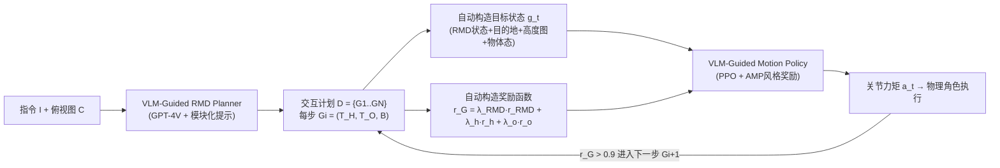

# Human-Object Interaction via Automatically Designed VLM-Guided Motion Policy

**会议**: ICLR 2026  
**OpenReview**: [https://openreview.net/forum?id=LfkPlFTfe0](https://openreview.net/forum?id=LfkPlFTfe0)  
**代码**: [https://vlm-rmd.github.io/](https://vlm-rmd.github.io/)  
**领域**: 人体理解 / 物理仿真人物动作合成 (Physics-based HOI)  
**关键词**: 人物-物体交互, VLM 引导, 相对运动动力学, 自动奖励设计, 强化学习, 长程交互  

## 一句话总结
用 VLM 把高层指令翻译成一种「相对运动动力学 (RMD)」的人-物部件级二部图，自动构造强化学习的目标状态和奖励函数，让物理仿真角色无需动捕数据、无需手工调奖励就能完成对静态/动态/铰接物体的长程交互。

## 研究背景与动机
- **领域现状**：物理仿真的人-物交互 (HOI) 合成是动画、仿真、机器人的核心能力。现有路线分两类：一类是**动作跟踪策略**（模仿动捕参考轨迹），另一类是**任务中心策略**（为「坐下」「搬运」等单一交互各写一套专用奖励）。
- **现有痛点**：跟踪类严重依赖昂贵的高质量动捕数据，且死守参考轨迹、无法泛化出新交互；任务中心类则需要领域专家**手工设计奖励**，工作量大、只能覆盖单一目标，训出的策略常常「完成任务但动作违反人体力学」。后来 Eureka、Grove 等用 LLM 自动生成奖励代码，但依赖迭代搜索、采样低效又昂贵。
- **核心矛盾**：最接近的 UniHSI 用「接触链 (chain-of-contacts)」把交互抽象成一串离散接触事件，概念优雅但**只施加瞬时点接触约束、满足即丢弃**，忽略了交互过程中演化的时空关系，无法建模全身协调和动态物体，连静态交互也常抖动。
- **本文目标**：构建首个**统一**的物理 HOI 框架，借 VLM 的世界知识自动构造目标状态和奖励，支持对静态、动态、铰接物体的长程交互。
- **核心 idea**：**用「相对运动」这一经典力学概念作桥梁**——把交互抽象成人体部件集合与物体部件集合之间随时间演化的相对运动，编码成细粒度时空二部图 RMD，从而让 VLM 不止做符号规划，还能「想象」运动级动力学并落地为可执行的 RL 目标。

## 方法详解

### 整体框架
框架由两个紧耦合模块构成：**VLM-Guided RMD Planner** 把指令 $I$ 和环境俯视图 $C$ 翻译成一串 RMD 形式的多步交互计划；**VLM-Guided Motion Policy** 把每一步 RMD 计划**自动**转成目标状态 $g_t$ 和奖励函数，由 PPO 训练的物理人形角色逐步执行。

### 关键设计

**1. 相对运动动力学 RMD：把交互抽象成人-物部件的二部图。** 这是全文的地基。作者的洞察是，人-物交互本质是两组刚体（人体部件 $P_H$ 与物体部件 $P_O$）随时间演化的相对运动，于是形式化为二部图 $B=(V,E,w)$，其中 $V=P_H \cup P_O$，边 $E \subseteq P_H \times P_O$，每条边 $e_{ij}=(p_{hi}, p_{oj})$ 带一个权重 $w_{ij} \in \{0,1,2,3\}$ 刻画相对运动模式：$0$ 表示**静止接触**、$1$ 表示**接近**、$2$ 表示**分离**、$3$ 表示**无一致趋势**。相比 UniHSI 的接触链只能表达「碰一下」，RMD 同时编码了离散交互目标（如接触）和连续动力学（如协调移动），例如举箱子时「手与箱子保持稳定相对构型」就是一条 $w=0$ 的约束。这种结构让 VLM 能把高层语义推理「接地」到运动级模式上。

**2. VLM 作为 RMD Planner：模块化提示触发分步推理。** 作者用 GPT-4V 作规划器，输入是指令 $I$、环境俯视图 $C$ 和一组模块化提示，每段提示专门触发一种推理能力（环境解析、物体部件理解、运动动力学推断、符号表示生成）。VLM 输出 RMD 图 $B$ 以及两个空间锚点：人体根目标 $\mathcal{T}_H$ 与物体根目标 $\mathcal{T}_O$。最终计划是 $N$ 步三元组序列 $D=\{G_1,\dots,G_N\}$，每步 $G_i=\{\mathcal{T}_H, \mathcal{T}_O, B\}$。用俯视图而非纯文本是关键——消融显示换成 LLM 纯文本规划后性能明显下滑，因为 VLM 的视觉+文本融合带来了更强的空间感知和运动想象力。

**3. 自动目标状态构造：把 RMD 编码成 RL 可读的状态。** 对每条边 $e_{ij}$，从仿真器取人体关节与物体最近表面点的位置-速度对，算出 agent 中心坐标系下的相对量 $\tilde p_{ij}=p^p_{oj}-p^p_{hi}$、$\tilde v_{ij}=p^v_{oj}-p^v_{hi}$，再把权重 $w_{ij}$ 编成 one-hot $w'_{ij}$，三者拼成边特征。堆叠所有边得到 RMD 状态 $s^{RMD}_t = \mathrm{concat}_{(i,j)\in E}(\tilde p_{ij}, \tilde v_{ij}, w'_{ij}) \in \mathbb{R}^{|E|\times(3+3+4)}$。空间锚点 $\mathcal{T}_H,\mathcal{T}_O$ 以 `object(spatial-relationship)` 形式给出（如 `armchair(front)`），用物体轴对齐包围盒近似几何，把关系词 $\delta$ 映射成局部位移 $\Delta q(\delta)$（如 `front`$\mapsto(0.7 l_x,0,0)$），得到绝对目标 $p^h_{tar}=c_{obj}+\Delta q(\delta_h)$。再叠加 $9\times9$ 高度图 $h_t$（局部避障感知）和物体状态 $o_t=(V^{box}_t,\theta_t,v_t,\omega_t)$，拼成完整目标 $g_t=(s^{RMD}_t, d_t, h_t, o_t)$。

**4. 自动奖励设计：三项奖励落实计划意图。** 奖励要同时驱动人体根趋向 $\mathcal{T}_H$、物体根趋向 $\mathcal{T}_O$、并满足 RMD 规定的相对运动模式。前两项用高斯型距离奖励 $r^h_d=\exp(-\|x^h_t-d^h_t\|^2)$、$r^o_d=\exp(-\|x^o_t-d^o_t\|^2)$；RMD 项把每条边的对齐奖励按系数加权求和 $r_{RMD}=\sum_{(i,j)\in E}\lambda_{ij}\cdot r_{rmd}(\tilde p_{ij},\tilde v_{ij},w_{ij})$，衡量每个人-物部件对是否遵循其权重指定的运动模式。总任务奖励 $r_G=\lambda_{RMD} r_{RMD}+\lambda_h r^h_d+\lambda_o r^o_d$，被归一化到 $[0,1]$；一旦 $r_G>0.9$ 就在下一时刻切换到计划的下一步 $G_{i+1}$，并借鉴 UniHSI 的自适应权重动态调整 $\lambda$ 以平衡各项、精确判断切换时机。最终再叠加 AMP 风格的判别器奖励 $r_S$（基于 10 帧窗口）保证动作自然：$r_t=\alpha_{task} r_G + \alpha_{style} r_S$。

## 实验关键数据

环境：Isaac Gym 并行仿真，15 刚体 28 关节的 PD 控制人形，PPO 训练于单张 RTX 3090；自建 **Interplay** 数据集（数千条长程静态+动态交互计划，资产来自 PartNet/3D-FRONT/SAMP/CIRCLE/PartNet-Mobility）。

### 主实验：长程多任务场景（Table 2）

| 方法 | 完成率% (静态/动态/混合) ↑ | 子步完成率% (静态/动态/混合) ↑ | 子步精度cm (静态/动态/混合) ↓ |
|------|------|------|------|
| InterPhys* | 21.3 / 47.8 / 27.5 | 37.3 / 61.9 / 54.1 | 13.8 / 18.7 / 16.9 |
| TokenHSI* | 25.2 / 52.5 / 36.0 | 48.1 / 65.7 / 60.1 | 13.1 / 16.6 / 14.4 |
| UniHSI | 37.2 / - / - | 61.3 / - / - | 10.2 / - / - |
| **Ours** | **75.1 / 71.2 / 53.8** | **86.2 / 84.3 / 71.8** | **7.7 / 13.0 / 11.2** |
| Ours w/ LLM | 62.8 / 53.1 / 39.9 | 81.7 / 78.3 / 67.2 | 8.9 / 15.2 / 13.8 |

静态完成率 75.1% 对 UniHSI 37.2% 几乎翻倍；用 LLM（纯文本）替换 VLM 后全面下滑，印证视觉输入的必要性。

### 单任务场景（Table 3，节选完成率%）

| 方法 | Carry | Push | Open | Sit | Lie | Reach |
|------|------|------|------|------|------|------|
| AMP* | 53.2 | 40.4 | 63.2 | 7.4 | 0.9 | 93.2 |
| InterPhys* | 67.8 | 47.1 | 83.2 | 23.2 | 2.7 | 95.3 |
| TokenHSI* | 71.2 | 49.3 | 81.1 | 27.8 | 8.9 | 95.7 |
| UniHSI | - | - | - | 58.9 | 23.2 | 97.1 |
| **Ours** | **88.3** | **84.1** | **91.2** | **92.6** | **62.0** | **97.5** |

在「起身离开」这类需要时序协调的恢复动作上优势最大（Sit 92.6% vs UniHSI 58.9%，因为 RMD 显式引导各部件「分离」物体）。

### 消融实验

| 设置 | 含义 | 影响 |
|------|------|------|
| multi-one | 物体不分部件、当单一实体 | 丢失细粒度几何，小幅下降 |
| one-one | 每步只建模单个人体部件×单物体部件 | 破坏全身协调、陷局部最优，明显下降 |
| w.o. $\tilde p_{ij}$ | 去掉相对位置 | 完成率显著降（如 Carry 88.3→71.7） |
| w.o. $\tilde v_{ij}$ | 去掉相对速度 | 中等下降 |
| w.o. $w'_{ij}$ | 去掉运动模式权重 | 降幅最大（Carry 88.3→69.1） |

### 关键发现
- **统一表示带来长程鲁棒性**：所有任务共享 RMD 表示，任务切换无缝；InterPhys/TokenHSI 这类朴素拼接多技能的方法在切换时易失败。
- **运动模式权重 $w'_{ij}$ 是 RMD 最关键的成分**，去掉后掉得最狠，说明「接近/分离/静止」的时序语义比纯几何位置更重要。
- **VLM > LLM**：俯视图提供的空间接地能力是生成连贯长程行为的前提。

## 亮点与洞察
- **「相对运动」这一古典力学概念被重新发掘**为连接 VLM 高层推理与 RL 低层执行的桥梁，把「想象运动」变成可计算的二部图，思路优雅且通用。
- **彻底摆脱手工奖励工程与动捕依赖**：目标状态和奖励全部由 VLM 输出自动构造，是首个统一支持静/动/铰接物体的物理 HOI 框架。
- **重新定义任务完成标准**：引入「离开/起身」步骤，逼迫策略学会交互后恢复中性姿态，更贴近真实长程多任务需求，也暴露了旧方法「坐下就算完」的盲区。
- RMD 的 4 种权重语义简洁却足以覆盖接触、协调移动、脱离等核心交互动力学。

## 局限与展望
- **依赖 GPT-4V 的规划质量**：RMD 图和空间锚点全靠 VLM 一次性输出，若 VLM 对物体部件或空间关系理解错误，会直接传导到奖励，缺少在线纠错/反馈闭环。
- **物体几何用轴对齐包围盒近似**，对复杂或非凸物体的精细交互可能不够；空间关系词到位移的映射也是手工设定的离散字典。
- **奖励切换阈值 $r_G>0.9$ 等是硬编码超参**，自适应权重沿用 UniHSI，泛化到差异极大的新任务时是否稳定未充分验证。
- 实验集中在室内家居场景与单张 3090，规模与多样性、真实机器人迁移仍待扩展。

## 相关工作与启发
- **对比 UniHSI（接触链）**：本文最直接的竞品，核心进步是把「离散瞬时接触」升级为「连续时空相对运动」，从而能处理动态物体和起身等时序协调动作。
- **对比 Eureka/Grove（LLM 自动奖励）**：那条线靠迭代搜索奖励代码、采样低效；本文用结构化 RMD 表示一次性接地，避开搜索循环。
- **承接 AMP/InterPhys/TokenHSI（物理动作先验）**：复用 AMP 的判别器风格奖励保证自然度，但把任务奖励从手工设计换成 VLM 自动构造。
- **启发**：用「部件级二部图 + 边权语义」作为 VLM 与 RL 之间的中间表示，是一种很有迁移潜力的范式，可能推广到机器人操作、双手协调、多智能体协作等更广的接触密集型任务。

## 评分
- **新颖性**: ⭐⭐⭐⭐⭐ —「相对运动动力学」二部图作为 VLM↔RL 中间表示是真正原创的抽象，首个统一支持静/动/铰接物体的物理 HOI 框架。
- **实验充分度**: ⭐⭐⭐⭐ — 长程多任务+单任务双场景、与 4 个强 baseline 对比、含 LLM/部件/位置/速度/权重多组消融；但只在室内仿真、单 GPU，缺真机与更大规模验证。
- **写作质量**: ⭐⭐⭐⭐ — 动机层层递进、RMD 概念讲得清楚，公式与架构图配合到位；个别实现细节（如 $r_{rmd}$ 具体形式）下放附录。
- **价值**: ⭐⭐⭐⭐⭐ — 同时解决了动捕依赖和手工奖励两大痛点，并配套发布 Interplay 数据集，对动画/仿真/具身智能社区有较强实用与推动价值。

<!-- RELATED:START -->

## 相关论文

- [\[ICLR 2026\] Unleashing Guidance Without Classifiers for Human-Object Interaction Animation](unleashing_guidance_without_classifiers_for_human-object_interaction_animation.md)
- [\[ICLR 2026\] InfBaGel: Human-Object-Scene Interaction Generation with Dynamic Perception and Iterative Refinement](infbagel_human-object-scene_interaction_generation_with_dynamic_perception_and_i.md)
- [\[ICLR 2026\] LINK: Learning Instance-level Knowledge from Vision-Language Models for Human-Object Interaction Detection](link_learning_instance-level_knowledge_from_vision-language_models_for_human-obj.md)
- [\[CVPR 2026\] Decoupled Generative Modeling for Human-Object Interaction Synthesis](../../CVPR2026/human_understanding/decoupled_generative_modeling_for_human-object_interaction_synthesis.md)
- [\[ICLR 2026\] Cross-Domain Policy Optimization via Bellman Consistency and Hybrid Critics](cross-domain_policy_optimization_via_bellman_consistency_and_hybrid_critics.md)

<!-- RELATED:END -->
