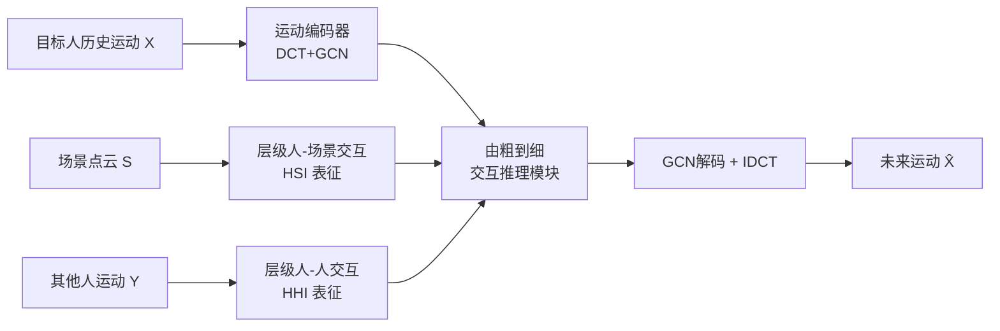

# HUMOF: Human Motion Forecasting in Interactive Social Scenes

**会议**: ICLR 2026  
**OpenReview**: [https://openreview.net/forum?id=INy8guZqrm](https://openreview.net/forum?id=INy8guZqrm)  
**代码**: [https://github.com/scy639/HUMOF](https://github.com/scy639/HUMOF)  
**领域**: 人体理解 / 人体运动预测  
**关键词**: 人体运动预测, 人-人交互, 人-场景交互, 层级表征, 由粗到细, DCT  

## 一句话总结
HUMOF 把动态社交场景里的"人-人交互"和"人-场景交互"统一编码成层级特征（高层语义+低层几何），再用一个由粗到细的 Transformer 推理模块逐层注入这些特征，在四个公开数据集上把人体运动预测刷到 SOTA。

## 研究背景与动机
**领域现状**：人体运动预测是监控、医疗、自动驾驶、人机交互的基础能力。早期方法只用目标人自身的历史动作做单人预测；后来出现"场景感知"方法把静态场景一次性塞进网络，以及"社交感知"方法用注意力隐式建模多人之间的交互。

**现有痛点**：真实世界的场景是动态且交互密集的——人会接近他人交谈、避让碰撞，也会坐楼梯、躺床（人-场景交互）。但场景感知方法只管静态场景、忽略多人社交；社交感知方法只管多人、忽略场景信息。唯一同时考虑两者的工作 SAST（Mueller et al., 2024）用扩散模型，却把人和场景的特征**解耦**提取、无法充分捕捉交互，而且依赖预定义的场景语义分割标签，难以落地到原始传感器数据。

**核心矛盾**：要在一个框架里统一建模所有"人相关交互"，得回答两个问题——(1) 面对人与环境、人与人之间多层级、多样化的交互，**怎么设计有效的表征**去刻画它们？(2) 即便有了好的交互表征，**怎么有效利用**它来提升预测精度？

**本文目标**：在动态社交场景下做精准的人体运动预测，同时处理人-人和人-场景交互，且不依赖场景语义标注。

**核心 idea**：**层级化建模交互 + 由粗到细推理**。用"交互距离"显式刻画交互，构造高层语义 / 低层几何的层级表征；推理时先用高层特征建立全局理解，再逐层引入低层特征精修细节，并在频域上同步抑制高频更新。

## 方法详解

### 整体框架
HUMOF 接收三路输入：目标人的历史运动序列、场景的 3D 点云、邻近其他人的历史运动序列。运动先经"DCT+GCN"运动编码器映到频域；交互被两条分支分别编码成层级 token——人-人交互（HHI）和人-场景交互（HSI）；最后由"由粗到细交互推理模块"逐层注入 HHI/HSI token 解码出未来运动。

### 关键设计
**1. 运动编码器：把运动搬到频域再抽空间依赖**。延续主流做法，先把长度 $H$ 的历史序列用最后一帧补到 $H+T$，再用离散余弦变换（DCT）处理时序、用图卷积（GCN）挖关节间空间依赖，并给每个关节加可学习位置嵌入，得到频域编码 $\tilde{X} = \mathrm{GCN}(\mathrm{DCT}(X)) + P$。这里每个关节用 $C=20$ 个 DCT 系数 × 3 个方向描述，把整段运动浓缩成频域表征，后续所有交互也都在频域里对齐，便于和 DCT rescaling 配合。

**2. 层级人-人交互（HHI）表征：自编码刻画"独立动作"、关系编码刻画"相互依赖"**。一个人在社交里同时有独立运动（走路）和交互运动（靠近交谈、避让）。自编码分支把每个交互人的运动单独过运动编码器和两层 Transformer，得到关节级 token 和一个聚合全身信息的可学习"体级" token。关系编码分支抓住一个关键观察——不同交互总会产生不同的距离模式，于是直接用"交互距离"显式建模：对第 $k$ 个交互人的第 $j$ 个关节，逐帧算它到目标人最近关节的距离，$D^{(k)t}_j = \phi(\min_{i}\|y^{(k)t}_j - x^t_i\|^2_2)$，其中 $\phi(\cdot)$ 让越近的关节值越大；再把这条时间序列 DCT 到频域得关节级关系编码，并 MLP 聚合成体级关系编码。自编码与关系编码在各自层级拼接，就得到体级和关节级两套 HHI token。

**3. 层级人-场景交互（HSI）表征：用点云抽象层级近似 + 交互距离，摆脱语义标注**。场景点云动辄上万点，逐点枚举交互不现实。HUMOF 借 PointNet++ 的 set abstraction 层 + 最远点采样，迭代地用中心点近似邻域，构造点数逐级递减、空间尺度逐级变粗的层级近似 $\tilde{F}^{(b)} = G^{(b-1)}(\tilde{F}^{(b-1)})$。最底层每个点 $s_n$ 的输入特征不是颜色/语义，而是它和目标人各关节逐帧的交互距离 $m_j = \{\phi(\|s_n - x^t_j\|^2_2)\}$ 经 DCT 到频域后、再拼上点坐标得到的频域交互特征。这样既保留了不同尺度的丰富交互信息，又**完全不依赖**像 SAST 那样的实例分割标签，能直接吃原始点云。

**4. 由粗到细注入 + 自适应 DCT rescaling：先看全局语义，再抠局部几何**。推理模块由 6 层"交互感知 Transformer"组成，每层先对目标人关节 token 做自注意力，再以关节 token 为 query、交互 token 为 key/value 做交叉注意力。注入策略是**由粗到细**的：第 1 层注入最高层的 HSI token $\tilde{F}^{(3)}$ 和体级 HHI token $\tilde{O}_{body}$，最后一层才注入最低层的 $\tilde{F}^{(1)}$ 和关节级 $\tilde{O}_{joint}$，让模型从全局语义起步、逐步聚焦局部几何。与此呼应，每层在 SA/CA/FFN 后对关节 token 做自适应 DCT rescaling：$\tilde{x}^{(l)}_j \leftarrow \tilde{x}^{(l)}_j \odot v'(\tilde{X})^{(l)}$，其中 $v'(\tilde{X})^{(l)} = v^{(l)} \odot \alpha(\tilde{X})$。预定义向量 $v^{(l)}$ 在浅层把高频系数压到接近 0、低频保持 1.0，并随层加深逐渐放开（第 6 层全为 1.0），从频域抑制早期的高频噪声；样本自适应向量 $\alpha(\tilde{X})$ 由所有关节 token 均值池化后过 MLP 得到，让不同动作类型有各自的最优频率缩放。

## 实验关键数据

### 主实验表格
在 HIK 与 HOI-M3（含人-人+人-场景交互的动态社交场景）上对比三类方法（场景感知 / 社交感知 / 社交-场景感知），报告路径误差与姿态误差（mm，越低越好）：

| 数据集 | 方法 | Path mean | Pose mean |
|--------|------|-----------|-----------|
| HIK | STAG | 239.7 | 100.6 |
| HIK | IAFormer | 200.1 | 95.0 |
| HIK | SAST | 189.0 | 93.2 |
| HIK | **HUMOF (Ours)** | **180.7** | **90.2** |
| HOI-M3 | SAST | 184.8 | 122.3 |
| HOI-M3 | **HUMOF (Ours)** | **174.6** | **117.9** |

在仅含人-场景交互的静态场景数据集上同样领先：HUMANISE（unseen scenes）路径误差 mean 从 MutualDistance 的 50.1 降到 43.4；GTA-IM 路径误差 mean 从 72.0 降到 62.9、姿态误差 mean 从 41.5 降到 38.7。HUMOF 全程不用 GT 分割，而 SAST 需要。

### 消融实验表格
HOI-M3 上验证各模块（Path/Pose mean，mm）：

| 变体 | Path mean | Pose mean |
|------|-----------|-----------|
| 无 HSI/HHI（baseline） | 187.6 | 123.2 |
| 只 HHI（自+关系） | 183.7 | 120.9 |
| 只 HSI | 182.9 | 121.4 |
| HSI + HHI关系（无自编码） | 178.4 | 120.0 |
| HSI + HHI自编码（无关系） | 177.0 | 119.9 |
| **全部** | **174.6** | **117.9** |

此外消融显示：由粗到细注入优于仅粗 / 仅细的单层级注入；自适应 DCT rescaling 中，共享静态向量 $v^{(l)}$ 已能提升精度，再叠加样本自适应 $\alpha(\tilde{X})$ 进一步增益。

### 关键发现
- 人-场景和人-人交互两类表征互补，缺一掉点；HHI 内部的自编码与关系编码也各有贡献。
- 由粗到细地利用多层级特征，比一次性粗暴注入所有层级更有效。
- 模型仅 9.6M 参数，HOI-M3 上推理 43ms，速度与基线相当或更快；可天然扩展到多人联合推理（batch=1+K）和动态场景元素。

## 亮点与洞察
- **用"距离"显式建模交互**是全文最巧的一笔：不论交谈、接近还是避让，交互总对应特定的距离模式，于是把复杂交互简化成可计算、可 DCT 的距离时间序列，既高效又可解释。
- **空间注入与频域抑制双线对齐"由粗到细"**：浅层注入高层 token + 频域压高频，深层注入低层 token + 放开高频，两条机制在同一哲学下协同，让"先全局后局部"落到实处。
- **摆脱语义标注**：HSI 用纯几何交互距离 + PointNet++ 抽象，绕过了 SAST 对实例分割的依赖，真正能吃原始点云，落地性更强。

## 局限与展望
- 现有数据集很少含大量动态场景元素，论文只在附录给了动态家具的初步验证；框架虽声称能天然处理 $p_s \to p_s(t)$ 的动态点，但缺乏大规模动态场景的实证。
- 交互距离用"最近关节"近似，可能丢失多关节同时交互的精细结构；$\phi(\cdot)$ 映射函数的选择对结果影响未充分探讨。
- 作者指出框架可经预训练编码器（如 ViT）接入视频/音频等模态扩展为更通用的运动世界模型，但本文未实现，属未来方向。

## 相关工作与启发
- **单人/场景感知/社交感知三条线**：HUMOF 站在三者交叉点，把场景感知（ContactAware、STAG、MutualDistance）和社交感知（T2P、IAFormer）统一进一个框架。
- **对 SAST 的针对性改进**：同样做"社交+场景"，但用显式交互距离替代隐式编码、用层级点云抽象替代语义标签，是对前作两大短板的直接回应。
- **DCT+GCN 频域运动建模**沿用 Mao et al. 一脉，启发在于把频域 rescaling 和层级注入耦合，给"频率即粒度"提供了一个可操作的范式，可迁移到轨迹预测、动作生成等需要多尺度时序控制的任务。

## 评分
- 新颖性: ⭐⭐⭐⭐ 把人-人/人-场景交互统一成层级表征、用交互距离显式建模、空间+频域双线由粗到细，组合新颖且针对 SAST 短板精准发力。
- 实验充分度: ⭐⭐⭐⭐ 覆盖动态+静态共四个数据集、三类基线，消融拆到每个子模块，含参数量/推理时延与多人/动态场景讨论。
- 写作质量: ⭐⭐⭐⭐ 动机—挑战—设计逻辑清晰，公式与图示对应到位，关键设计解释有画面感。
- 价值: ⭐⭐⭐⭐ 不依赖语义标注、轻量高效、可扩展到多模态，对人机交互/自动驾驶等真实动态场景的运动预测有实用潜力。

<!-- RELATED:START -->

## 相关论文

- [\[ICLR 2026\] SpeakerVid-5M: A Large-Scale High-Quality Dataset for Audio-Visual Dyadic Interactive Human Generation](speakervid-5m_a_large-scale_high-quality_dataset_for_audio-visual_dyadic_interac.md)
- [\[ECCV 2024\] Human Motion Forecasting in Dynamic Domain Shifts: A Homeostatic Continual Test-Time Adaptation Framework](../../ECCV2024/human_understanding/human_motion_forecasting_in_dynamic_domain_shifts_a_homeostatic_continual_test-t.md)
- [\[ICLR 2026\] KinemaDiff: Towards Diffusion for Coherent and Physically Plausible Human Motion Prediction](kinemadiff_towards_diffusion_for_coherent_and_physically_plausible_human_motion_.md)
- [\[CVPR 2025\] MotionMap: Representing Multimodality in Human Pose Forecasting](../../CVPR2025/human_understanding/motionmap_representing_multimodality_in_human_pose_forecasting.md)
- [\[CVPR 2026\] Beyond Scanpaths: Graph-Based Gaze Simulation in Dynamic Scenes](../../CVPR2026/human_understanding/beyond_scanpaths_graph-based_gaze_simulation_in_dynamic_scenes.md)

<!-- RELATED:END -->
