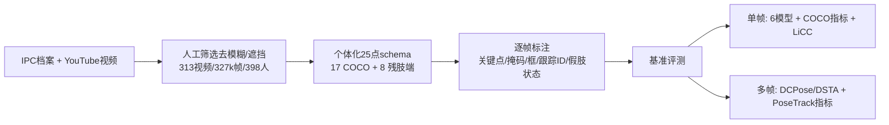

# InclusiveVidPose: Bridging the Pose Estimation Gap for Individuals with Limb Deficiencies in Videos

**会议**: ICLR 2026  
**OpenReview**: [https://openreview.net/forum?id=SyQqXAdWUq](https://openreview.net/forum?id=SyQqXAdWUq)  
**代码/数据**: 项目主页 InclusiveVidPose（数据集 CC BY-NC-SA 4.0）  
**领域**: 人体理解 / 姿态估计 / 数据集与基准  
**关键词**: 人体姿态估计, 肢体缺陷, 残肢端关键点, 视频数据集, 公平性, 置信度校准  

## 一句话总结
本文构建了首个面向**肢体缺陷人群**（截肢、先天肢体差异、假肢使用者）的大规模视频人体姿态估计数据集 InclusiveVidPose，在 COCO 17 点基础上新增 8 个残肢端关键点，并提出 LiCC 指标量化模型区分"真实残肢/缺失肢体"与"完整肢体"的能力，揭示现有 SOTA 模型在这一人群上系统性失效。

## 研究背景与动机
- **领域现状**：人体姿态估计（HPE）的主流数据集（MS COCO、MPII、PoseTrack 等）与方法，全部默认人体具备完整的上下肢和固定的关键点骨架。全球约 4.45 亿人有创伤性截肢、约 3164 万 0–14 岁儿童有先天肢体差异，却在 HPE 研究中几乎完全缺席。
- **现有痛点**：在固定骨架假设下，模型会对**不存在的关节**强行预测高置信度。论文 Figure 2 展示了 COCO 训练的 ViTPose 的典型失败——把假肢错认成自然脚踝、把缺失手腕的关键点贴到躯干上、因大腿长度不对称把膝盖放在髋与踝的几何中点这种解剖学上不可能的位置。
- **核心矛盾**：HPE 的关键点 schema 是**固定且假设解剖完整**的，而肢体缺陷人群的解剖结构高度**个体化且可变**（残肢长度/位置/外观各异、假肢几何形态各异）。一套固定骨架根本无法表达"哪些关节缺失、残肢端在哪"。单张图像里被遮挡的肢体和真正缺失的肢体看起来一模一样，标注本身就有歧义。
- **本文目标**：补齐这一空白，构建专门面向肢体缺陷人群的视频姿态数据集与基准，并提供一个能衡量"模型是否会对不可能的关节误判"的评测指标。
- **核心 idea**：**用视频替代单图消歧义** + **个体化扩展关键点 schema** + **置信度一致性新指标**。利用视频的时序连续性与视角变化把"被遮挡"和"真缺失"区分开；在 COCO 17 点上加 8 个残肢端关键点（只标解剖残肢端、显式排除假肢）；提出 **LiCC（Limb-specific Confidence Consistency）**衡量预测置信度是否遵守解剖互斥规则。

## 方法详解

### 整体框架
本文不是提出新模型，而是构建一个数据集 + 评测协议 + 新指标。整体管线为：从 IPC 档案和 YouTube 采集视频 → 人工筛选去除运动模糊/重遮挡片段 → 在 COCO 17 点上为每位个体定制 25 点（17 标准 + 8 残肢端）的个体化 schema → 逐帧标注关键点/分割掩码/边界框/跟踪 ID/假肢状态 → 在单帧与多帧两种协议下用 6+2 个代表性模型建立基准，并用 LiCC 暴露置信度失配问题。

### 关键设计

**1. 残肢端扩展关键点 schema：用解剖锚点而非设备几何对齐个体差异。** 现有固定骨架的根本缺陷在于缺乏"残肢端"这一概念，模型只能去定位本不存在的关节。本文在 COCO 的 17 点上新增 8 个残肢端关键点（左右肘上/肘下、左右膝上/膝下各一个，索引 17–24），共构成 25 点协议。关键在于这些点只标注**人体真实残肢的解剖端点**，显式排除假肢与辅助器械——假肢的形状和与环境的接触改由像素级分割掩码和每肢假肢状态标签表达。这样模型得到的是**语义明确、可区分完整结构与残肢结构**的目标，而不是被假肢几何带偏。由于每位个体的缺陷部位不同，标注时由两名训练标注员加一名国际认证的残奥分级师为全部 398 人逐一商定个体化 schema，用一个 25 维 presence mask 标记该个体哪些关键点适用。

**2. 视频时序消歧义：把"遮挡"和"缺失"分开。** 这是选择视频而非精选图像的核心动因。单张图像中，被衣物或姿态遮挡的肢体与真正缺失的肢体在外观上无法区分，导致残肢端标注本质上有歧义。视频序列提供时序连续性和视角变化，标注者通过观察运动和视角偏移就能判断某肢体是"只是被挡住"还是"真的不存在"，从而精确标注残肢端并跨帧保持一致。标注流程借助 X-AnyLabeling + SAM2 可提示分割生成初始掩码（SAM2 对未见残肢形状的零样本泛化把掩码绘制时间砍掉 50%+），并执行 80% 准确率阈值的双标注交叉检查——任一批次超过 20% 掩码/点位有明显错误就退回重标。

**3. LiCC 指标：量化解剖互斥一致性。** 现有 OKS 类指标只看可见点的定位精度，完全不评估模型"会不会对不可能存在的关节给高置信度"。本文定义关键点 $i$ 的互斥集合 $M(i)$——例如残肢手腕可见时，残肢肘和正常手腕都不可能同时存在。设 $s_i$ 为关键点 $i$ 的预测置信度，LiCC 定义为置信度严格高于其所有互斥伙伴最高置信度的关键点占比：

$$\text{LiCC} = \frac{1}{|V|} \sum_{i \in V} \mathbb{1}\!\left( s_i > \max_{j \in M(i)} s_j \right)$$

其中 $V$ 是所有可见性 $v \ge 1$ 的真值关键点集合，$\mathbb{1}(\cdot)$ 为指示函数。LiCC 越高，说明可见关键点被赋予的置信度越能压过解剖学上不可能的替代点，即模型的置信度校准越"懂解剖"。该指标把现有模型在肢体缺陷人群上的失败模式变成了可量化、可优化的目标。

## 实验关键数据

数据集按视频级 7:1:2 划分训练/验证/测试，确保同一个体不跨 split（杜绝数据泄漏），每 60 帧采一帧。所有模型从官方 COCO 预训练权重初始化。同时在 COCO 和 InclusiveVidPose 上评测，强调"好的姿态估计器应服务所有人群"。

### 主实验（单帧，部分 InclusiveVidPose→InclusiveVidPose 结果）

| 方法 | Backbone | AP | AR | **LiCC** |
|------|----------|----|----|------|
| YOLOX-Pose-S | YoloxPose-S | 65.4 | 77.5 | **72.7** |
| DEKR | HRNet-w32 | 77.7 | 83.2 | 55.2 |
| ViPNAS | MobileNetV3 | 78.6 | 80.3 | 53.8 |
| Swin | Swin-L/384 | 80.7 | 82.0 | 72.1 |
| RTMPose-M | — | 82.2 | 83.3 | 69.5 |
| ViTPose | ViT-H | **86.3** | **87.6** | 73.6 |

关键反差：**AP 很高（ViT-H 达 86.3）但 LiCC 普遍只在 60–74% 之间**——即便大模型在可见点上定位很准，仍频繁对解剖学上不可能的点给出更高置信度。DEKR、ViPNAS 的 COCO AP 不低，但 LiCC 仅 53–55%，几乎分不清完整关节与残肢端；而采用置信度学习的 YOLOX-Pose 的 LiCC 反而更高。

### 多帧实验（PoseTrack-style AP，残肢分组）

| 方法 | Shoulder | Wrist | Knee | ArmUp | ArmLow | LegUp | LegLow | Mean |
|------|----------|-------|------|-------|--------|-------|--------|------|
| DCPose | 72.0 | 79.3 | 72.4 | 1.6 | 0.2 | 12.2 | 16.0 | 43.2 |
| DSTA | 72.2 | 81.9 | 71.9 | 0.6 | 0.0 | 14.3 | 17.3 | 43.7 |

标准关节 AP 都在 70+，但**四个残肢端分组几乎全军覆没**：上肢残肢端（ArmUp/ArmLow）AP 接近 0，下肢残肢端也只有十几分。时序聚合带来的微小增益（43.2→43.7）完全无法弥合残肢区域的巨大差距。

### 关键发现
- 现有 SOTA 在残肢端上系统性失效，标准关节上的高分掩盖了对肢体缺陷人群的根本无能。
- LiCC 揭示的"高 AP 低 LiCC"现象证明：定位准 ≠ 置信度校准对，模型对缺失/假肢肢体的判断不可靠。
- COCO→InclusiveVidPose 与 COCO→COCO 对比显示二者存在真实分布漂移；把 COCO 加入训练能帮大模型却会损害小模型（YOLOX-Pose-T、RTMPose-T）在肢体缺陷人群上的表现。

## 亮点与洞察
- **填补真实社会缺口**：首个面向肢体缺陷人群的视频 HPE 数据集，覆盖近 400 人、327k 帧、多种截肢/先天/假肢类型，性别（51%/49%）与假肢使用（48%/52%）分布均衡，可直接服务康复监测、健康评估等下游应用。
- **"用视频消歧义"的洞见**：把单图标注中无法解决的"遮挡 vs 缺失"歧义，转化为时序观测下可判定的问题，是数据集设计层面的关键 insight。
- **LiCC 切中要害**：传统指标无法捕捉"对不存在的关节高置信度"这一失败模式，LiCC 用解剖互斥规则把它量化，给后续方法提供了明确优化靶子。
- **专家在环标注**：由国际认证残奥分级师指导个体化 25 点 schema，加上 SAM2 加速掩码与 80% 双盲交叉检查，保证了高质量标注。

## 局限与展望
- **只建数据集与基准、未提新方法**：论文聚焦"暴露问题"，没有给出能显著改善残肢端预测或提升 LiCC 的新模型，残肢端 AP 接近 0 的难题留给后续工作。
- **数据来源受限**：依赖 IPC 档案与 YouTube，场景偏向体育/康复，日常多样性和某些罕见缺陷类型可能覆盖不足；YouTube 视频只发布链接不再分发，存在长期可复现性风险。
- **评测以单帧为主**：多帧基准只测了 DCPose/DSTA 两个模型，时序信息如何真正帮助残肢端定位仍是开放问题。
- **LiCC 依赖互斥集合定义**：互斥规则需人工指定，迁移到更复杂解剖变异或多假肢场景时规则的完备性有待验证。

## 相关工作与启发
- **通用 HPE 数据集**：MS COCO、MPII、CrowdPose、OCHuman、PoseTrack 等均默认解剖完整，本文首次把"肢体缺陷"作为一等公民纳入。
- **HPE 模型**：ViTPose、AlphaPose、OpenPose、DWPose（精度向）与 RTMPose、YOLOPose、DEKR（效率向）、SAPIENs（合成数据）构成基准对象。
- **面向弱势群体的姿态估计**：WheelPose（合成数据轮椅）、WheelPoser（IMU）、ProGait（2025，仅经股假肢步态）是最相关的前驱；本文覆盖的缺陷类型更广、含全身+残肢端个体化 schema、并加入帧级假肢状态/分割/框/跟踪。
- **启发**：对任何"长尾/弱势人群"的视觉任务，与其堆模型，不如先审视数据与评测协议里隐含的"标准人体/标准类别"假设——固定 schema 与只看定位精度的指标，本身就是公平性缺口的来源。LiCC 这种"用领域互斥约束做置信度一致性检验"的思路，可迁移到其他存在结构性互斥的预测任务。

## 评分
- **新颖性**: ⭐⭐⭐⭐⭐ 首个肢体缺陷人群视频姿态数据集 + 残肢端关键点 schema + LiCC 指标，问题定义与切入角度都很新。
- **实验充分度**: ⭐⭐⭐⭐ 单帧 6 模型多设置 + 多帧 2 模型，覆盖 COCO/InclusiveVidPose 交叉评测，但缺少改进方法的对照实验。
- **写作质量**: ⭐⭐⭐⭐ 动机清晰、图表（失败案例、schema、统计分布）有力，分布漂移的讨论严谨。
- **价值**: ⭐⭐⭐⭐⭐ 兼具真实社会意义与科研价值，为公平、包容的姿态估计研究开辟了新方向与可量化靶子。

<!-- RELATED:START -->

## 相关论文

- [\[ECCV 2024\] Bridging the Gap Between Human Motion and Action Semantics via Kinematic Phrases](../../ECCV2024/human_understanding/bridging_the_gap_between_human_motion_and_action_semantics_via_kinematic_phrases.md)
- [\[ICLR 2026\] Inverse Virtual Try-On: Generating Multi-Category Product-Style Images from Clothed Individuals](inverse_virtual_try-on_generating_multi-category_product-style_images_from_cloth.md)
- [\[CVPR 2025\] Analyzing the Synthetic-to-Real Domain Gap in 3D Hand Pose Estimation](../../CVPR2025/human_understanding/analyzing_the_synthetic-to-real_domain_gap_in_3d_hand_pose_estimation.md)
- [\[ICLR 2026\] Pose Prior Learner: Unsupervised Categorical Prior Learning for Pose Estimation](pose_prior_learner_unsupervised_categorical_prior_learning_for_pose_estimation.md)
- [\[ICLR 2026\] BAH Dataset for Ambivalence/Hesitancy Recognition in Videos for Digital Behaviour Analysis](bah_dataset_for_ambivalencehesitancy_recognition_in_videos_for_digital_behaviour.md)

<!-- RELATED:END -->
