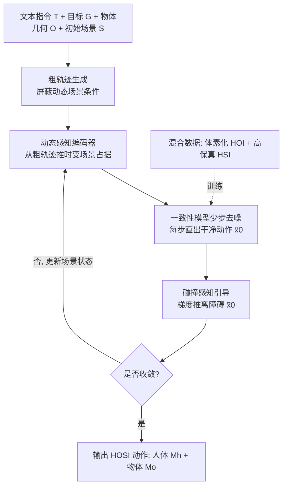

# InfBaGel: Human-Object-Scene Interaction Generation with Dynamic Perception and Iterative Refinement

**会议**: ICLR 2026  
**OpenReview**: [https://openreview.net/forum?id=TeyHNq4WlI](https://openreview.net/forum?id=TeyHNq4WlI)  
**代码/主页**: [yudezou.github.io/InfBaGel-page](https://yudezou.github.io/InfBaGel-page)  
**领域**: 人体理解 / 人物交互动作生成  
**关键词**: HOSI 生成, 一致性模型, 动态感知, 碰撞避免, 混合数据训练, SMPL-X  

## 一句话总结
InfBaGel 把"人-物-场景交互（HOSI）"动作生成对齐到一致性模型的少步去噪过程，用**动态感知**逐步更新场景占据状态、用**碰撞感知引导**抑制穿模、用**混合数据训练**绕开 HOSI 标注稀缺，从而在无 HOSI 标注的前提下实时生成既能搬运大物体又能避障落座的长程交互。

## 研究背景与动机

**领域现状**：人体动作生成已分别在"人-物交互（HOI）"与"人-场景交互（HSI）"上各有突破——前者能让全身抓取、搬运大物体，后者能在静态场景里行走、坐下。但真实生活里这两者是耦合的：一个人会**搬着椅子穿过杂乱房间、避开障碍、放下椅子再坐上去**，这就是人-物-场景交互（HOSI）生成。

**现有痛点**：HOSI 比 HOI/HSI 难在两点。其一是**动态的物体-场景变化**——人一边走可通行空间一边变，搬动大物体又会重塑场景布局，主流方案（如 TRUMANS、LINGO）却用一次性的静态场景编码，生成时不更新被人/物运动改变的场景状态；分阶段方法把移动和交互拆开，破坏时间一致性；依赖规划器的方法既贵又受规划器质量牵制。其二是**标注数据稀缺**——物体类型、场景配置、任务指令的组合爆炸，使得同时带场景标注的高质量 HOSI 数据极难采集，模型难以泛化。

**核心矛盾**：要么有真实场景几何但缺物体多样性（HSI 数据），要么有丰富物体交互但完全没有场景标注（HOI 数据），没有一份"既有多样场景、又有多样可操作物体、还带文本指令"的 HOSI 数据集。

**本文目标**：在不依赖完整 HOSI 标注的前提下，生成物理合理、场景感知、且能实时运行的长程 HOSI 动作。

**核心 idea**：**（1）把交互生成对齐到一致性模型的少步迭代去噪**——每一步直接输出干净动作，据此更新时变场景状态再细化下一步，做到"边生成边感知";**（2）混合数据训练**——把 HOI 数据体素化合成伪场景、与高保真 HSI 数据联合训练，用宏观场景知识 + 微观物体操作知识拼出 HOSI 能力。

## 方法详解

### 整体框架

InfBaGel 是一个自回归框架，从文本指令 $T$ 与目标位置 $G$ 出发，生成人体动作 $M_h$（SMPL-X 根平移 + 22 关节 6D 旋转）与物体动作 $M_o$（质心平移 + 相对旋转）耦合的序列。它采用 coarse-to-fine 策略：先在初始场景下生成一条粗轨迹，由此推导出**逐帧时变的场景占据状态**，再用这些状态作为条件、配合碰撞感知引导对动作做迭代细化。底层先训一个场景条件扩散模型（支持有/无动态场景条件两种生成），再蒸馏成一致性模型，让"少步出干净动作 → 更新精确时变场景 → 再细化"的循环可实时跑通。

### 关键设计

**1. 动态感知编码：让场景条件随生成结果迭代刷新。** HOSI 的可通行空间会随人/物移动而变化，一次性静态编码不够用。InfBaGel 在每个生成窗口内用五个体素占据栅格表示局部场景——两个**静态**栅格分别锁定起点区和目标区，三个**动态**栅格以从时间窗内均匀采样的中间帧骨盆位置为中心。每个栅格是 $\{0,1,2\}^{N\times N\times N}$ 的 3D 数组（0 可通行、1 不可通行、2 被交互物体占据），用一个 ViT 各自编码成 512 维嵌入。生成粗轨迹时动态栅格被屏蔽（只看静态场景），随着细化逐步把动态体素填进来作为条件——这样"先有运动 → 推出场景怎么变 → 再据变化的场景修正运动"形成闭环，自然产出前后一致的交互。

**2. 扩散蒸馏成一致性模型：把"少步出干净动作"变成可靠的场景感知锚点。** 扩散模型要几十上百步才出干净样本，效率低且中间态带噪、无法可靠更新场景。作者将扩散模型蒸馏为一致性模型 $f_\theta:(x_{\tau_n},\tau_n,C_{\tau_n},\omega)\mapsto \hat x_0$，**每一步直接把任意带噪样本映射回干净起点** $\hat x_0$，于是每步都能拿到清晰动作去更新精确的时变场景。蒸馏用一致性蒸馏（CD）强制相邻 PF-ODE 步输出一致：$\mathcal{L}_{CD}=\mathbb{E}\big[d\big(f_\theta(x_{\tau_n},\tau_n,C_{\tau_n},\omega),\, f_{\theta'}(\hat x^{\Psi,\omega}_{\tau_{n-1}},\tau_{n-1},C_{\tau_{n-1}},\omega)\big)\big]$，其中目标网络 $\theta'$ 用在线网络 $\theta$ 的 EMA 更新，teacher 用 DDIM 在 classifier-free guidance 强度 $\omega$ 下采样。配合对手脚/物体顶点的前向运动学辅助监督 $\mathcal{L}=\mathcal{L}_{CD}+\lambda_h\mathcal{L}_{joints}+\lambda_o\mathcal{L}_{obj}$，并以自回归方式分段生成长序列，使实时迭代刷新场景成为可能。

**3. 碰撞感知引导（Bump-aware Guidance）：不靠高精度网格也能避穿模。** 即便有动态感知迭代，严格无碰撞仍难保证。作者在每步采样时让一致性模型预测的干净动作 $\hat x_0$ 重建出人体关节与物体点，与体素化场景 $S$ 比对：当人/物点落进被占据体素就判为"碰撞"，用该点到最近自由体素的距离计算梯度把样本推离障碍：$\tilde x_0=\hat x_0+\gamma_{\tau_n}\nabla_{x_{\tau_n}}\mathcal{L}_{bump}(\hat x_0)$，其中 $\mathcal{L}_{bump}=\sum_{p\in\{\hat M_h,\hat M_o\}} D(V(p))$，$D(\cdot)$ 返回体素中心到最近自由体素中心的距离（自由则为 0）。关键是**体素的规则结构允许预计算距离图**，免去高精度网格那种昂贵的在线最近点搜索，引导能无缝嵌进一致性采样循环，逐步减少穿模。

**4. 混合数据训练：用体素化伪场景把 HOI 数据"升级"成 HOSI。** 为绕开 HOSI 标注稀缺，作者联合两类现成数据并统一到 $(S,O,T,G)$ 接口。一类是高保真 HSI 数据（如 LINGO），提供真实场景网格、多样环境与文本指令，教会模型长程导航与静态物体交互的"宏观"知识；另一类是大规模 HOI 数据（如 OMOMO），本身没有场景，于是沿用 Liu et al. 的做法**识别人与被操作物体在整段运动中占据的空间体积，再把周围自由空间体素化**成合理的占据上下文，无需任何手工场景标注或高保真网格采集就把标准 HOI 数据转成人-物-场景三元组，提供物体操作的"微观"知识。两者联合训练让模型解耦人/物/场景三个因素，在 67 个未见场景上取得强零样本泛化。

## 实验关键数据

测试基准为自建 HOSI benchmark：469 条序列，取 OMOMO 的 7 类大型可操作物体，放进 TRUMANS 的 67 个未见室内场景。指标分三类：任务完成（人/物到目标距离 $T_h/T_o$、双距离均 < 10cm 记成功 S%）、动作与交互质量（脚滑 FS、接触率 C%、人物穿模 $P_{body}$）、场景感知（人-场景/物-场景穿模均值/最大/穿模帧占比 $P_{mean}/P_{max}/P_f\%$）、以及速度（AITS、FPS）。

### 主实验：HOSI benchmark 对比

| 方法 | S% ↑ | FS ↓ | C% ↑ | $P_{body}$ ↓ | 人-场景 $P_f\%$ ↓ |
|------|------|------|------|------|------|
| TRUMANS | 1.92 | — | 70.49 | — | 高（严重穿模） |
| LINGO | 53.09 | 5.72 | 96.15 | 0.57 | 38.07 |
| **InfBaGel** | **83.16** | **3.96** | — | **0.13** | **16.62** |
| InfBaGel（混合数据） | 81.45 | 5.05 | — | 0.15 | 12.45 |

成功率从 LINGO 的 53.09% / TRUMANS 的 1.92% 跃升到 **83.16%**，同时取得最低脚滑、最低人-物穿模与显著更低的场景穿模，定性上 TRUMANS/LINGO 都有严重物-场景穿模而 InfBaGel 近乎无碰撞。

### 速度对比

| 指标 | TRUMANS | LINGO | InfBaGel-DM（扩散版） | InfBaGel w/o G | **InfBaGel** |
|------|---------|-------|------|------|------|
| AITS ↓ | 5.84 | 6.46 | 57.17 | 1.30 | **6.75** |
| FPS ↑ | 31.57 | 28.86 | 3.38 | 148.54 | **28.75** |

扩散版（DM）每句要 57s、仅 3.38 FPS，蒸馏成一致性模型后回到 ~28.75 FPS、6.75s/句的实时区间——印证"少步一致性 + 预计算距离图引导"对效率的关键作用。

### 消融实验（关键组件）

| DP（动态感知） | G（引导） | S% ↑ | C% ↑ | $P_{body}$ ↓ | 物-场景 $P_f\%$ ↓ | FPS |
|------|------|------|------|------|------|------|
| ✗ | ✗ | 71.22 | 65.99 | 0.19 | 146.10 | 23.01 |
| ✓ | ✗ | **86.35** | 68.09 | 0.14 | 138.12 | 23.01 |
| ✓ | C（接触引导） | 85.50 | **79.34** | 0.13 | 139.93 | 23.25 |
| ✓ | C+B（碰撞感知） | 83.16 | 78.18 | 0.13 | **109.61** | 22.72 |

### 关键发现
- **动态感知是成功率主引擎**：加上 DP 后成功率从 71.22% → 86.35%，证明"边生成边更新场景"对目标可达性至关重要。
- **碰撞感知引导专治穿模**：在接触引导基础上加 Bump-aware（C+B）把物-场景穿模指标 $P_f\%$ 从 ~140 降到 109.61，且几乎不掉 FPS。
- **一致性蒸馏不牺牲质量**：扩散版与一致性版成功率（84.22% vs 83.16%）相近，但速度有量级差距，说明蒸馏几乎"白赚"了实时性。
- **强零样本泛化**：在 67 个未见场景上验证，混合数据训练让模型迁移到陌生场景仍保持高成功率与低穿模。

## 亮点与洞察
- **把"感知"嵌进去噪循环**是核心巧思：一致性模型每步直出干净动作，恰好提供可靠的"当前世界状态"快照，让动态感知不再是事后规划而是生成内环的一部分。
- **数据合成的务实路线**：不去硬采 HOSI 数据，而是"HOI 体素化补场景 + HSI 提供真实几何"，用两类便宜数据拼出昂贵能力，这种数据工程思路对动作生成领域很有借鉴价值。
- **体素 + 预计算距离图**让碰撞引导既物理合理又便宜，规避了高精度网格在线最近点搜索的开销，是把"物理合理"和"实时"同时拿下的关键工程取舍。

## 局限与展望
- 场景用体素占据栅格表示，分辨率 $N$ 受限于显存，对精细几何（薄壁、细杆）的碰撞判断可能不够准。
- 合成 HOI 伪场景只在人/物运动轨迹周围填充自由空间，缺乏真实环境的语义结构与多样障碍，泛化到结构复杂的真实场景仍依赖 HSI 数据补足。
- 仅做运动学生成，作为高层运动规划器输出，落地到真实机器人/仿真还需低层物理控制器跟踪与具身约束。
- 目标由用户给定 3D 坐标 + 文本指令，尚未涉及自主任务规划（如多步任务分解）。

## 相关工作与启发
- **HOI 生成**：从手部抓取小物体（Taheri, Wu）到全身搬运大物体（CHOIS / Li et al. 2024b），常依赖序列点或物体轨迹，限制了自主多样性；InfBaGel 用指令 + 目标驱动，摆脱对物体轨迹的依赖。
- **HSI 生成**：早期分别建模移动和静态交互导致不一致（Hassan, Wang），或依赖路径规划器（Zhao DIMOS, Yi）、多阶段框架（Cen）带来开销；InfBaGel 用统一 coarse-to-fine 框架 + 动态感知替代外部规划器。
- **动态物体场景交互**：物理仿真 RL 方法（Hassan 2023, Pan 2025）需复杂奖励工程且多样性差；运动学方法 TRUMANS/LINGO 用静态场景编码、把物体直接附到手上简化；Yao/Geng 受限于小 HOSI 数据集或把未匹配场景当空场景。InfBaGel 的混合数据训练 + 时变场景感知正是针对这些不足。
- **启发**：把生成模型的"去噪迭代"重新诠释为"感知-行动"闭环，对任何"环境随智能体行为改变"的具身生成任务（机器人操作、长程导航）都可能是通用范式。

## 评分
- **新颖性** ⭐⭐⭐⭐：把一致性模型的少步去噪与动态场景感知对齐、体素化预计算距离图做碰撞引导、HOI→HOSI 数据合成，三者组合在 HOSI 这一新设定下相当原创；单个组件多借鉴已有工作（一致性蒸馏、classifier-guidance、Liu et al. 体素化），属高质量集成创新。
- **实验充分度** ⭐⭐⭐⭐：自建 469 序列 / 67 未见场景 benchmark，对比两个强基线、做组件消融 + 参数消融 + 速度对比 + 高维与零样本泛化分析，覆盖任务完成/物理合理/场景感知/效率四个维度；缺真实用户研究与真机验证。
- **写作质量** ⭐⭐⭐⭐：动机层层递进（两大挑战 → 三类已有不足 → 三点设计），方法与图 1 对应清晰，公式与指标定义完整。
- **价值** ⭐⭐⭐⭐：HOSI 是具身 AI、动画、仿真的高价值场景，"无 HOSI 标注也能实时生成可避障的人-物-场景交互"对机器人学习与虚拟角色动画有直接落地潜力。

<!-- RELATED:START -->

## 相关论文

- [\[CVPR 2026\] HSI-GPT2: A Dual-Granularity Large Motion Reasoning Model with Diffusion Refinement for Human-Scene Interaction](../../CVPR2026/human_understanding/hsi-gpt2_a_dual-granularity_large_motion_reasoning_model_with_diffusion_refineme.md)
- [\[ICLR 2026\] Unleashing Guidance Without Classifiers for Human-Object Interaction Animation](unleashing_guidance_without_classifiers_for_human-object_interaction_animation.md)
- [\[ICLR 2026\] Disentangled Hierarchical VAE for 3D Human-Human Interaction Generation](disentangled_hierarchical_vae_for_3d_human-human_interaction_generation.md)
- [\[ICLR 2026\] Human-Object Interaction via Automatically Designed VLM-Guided Motion Policy](human-object_interaction_via_automatically_designed_vlm-guided_motion_policy.md)
- [\[CVPR 2026\] InterPhys: Physics-aware Human Motion Synthesis in a Dynamic Scene](../../CVPR2026/human_understanding/interphys_physics-aware_human_motion_synthesis_in_a_dynamic_scene.md)

<!-- RELATED:END -->
