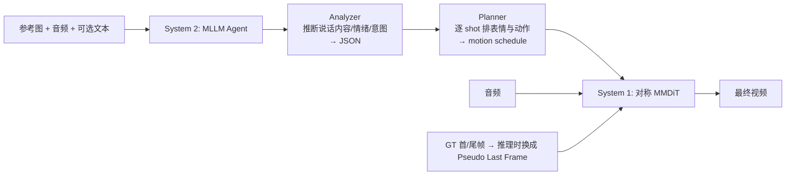

# Instilling an Active Mind in Avatars via Cognitive Simulation

**会议**: ICLR 2026  
**OpenReview**: [https://openreview.net/forum?id=80JylHgQn1](https://openreview.net/forum?id=80JylHgQn1)  
**代码**: 项目主页（论文中以链接形式给出，待确认仓库）  
**领域**: 数字人 / 音频驱动视频生成 / 多模态扩散  
**关键词**: Video Avatar, Audio-Driven Animation, MLLM Agent, System 1/System 2, MMDiT, Pseudo Last Frame  

## 一句话总结
本文把视频数字人的"只会对口型、动作单调"归因为只模拟了人类认知的"系统 1（快思考）"，提出用 MLLM agent 充当"系统 2（慢思考）"生成高层语义计划，并设计带 Pseudo Last Frame 的对称 MMDiT 把文本/音频/图像三模态无冲突地融合，让数字人不仅嘴型准还能做出符合语境、有情绪的表演。

## 研究背景与动机
**领域现状**：音频驱动的视频数字人近年从早期 lip-sync、肖像动画发展到半身、全身生成，基于 Diffusion Transformer（DiT）的端到端方法能把人物动作和音频节奏对齐，嘴型精度已经很高。

**现有痛点**：这些模型本质上学的是 audio→motion 的低层反应式映射，结果就是嘴动得很准，但手势重复、单调、缺乏语境感——能做出"动作"却理解不了"该做什么动作"。它们捕捉不到人物真实的个性、情绪和意图。

**核心矛盾**：作者借 Kahneman 的双过程理论点题——现有模型停留在快速、直觉的"系统 1"，擅长 audio-to-lip 这类反应式映射，但做不到目标导向、依赖语境推理的"系统 2"。要让数字人"活"起来，必须同时模拟两个系统。但直接把 MLLM 产出的文本指导塞进来并不容易：文本是一个新模态，会和音频（管节奏）、参考图（管身份）冲突——音频可能压住文本想要的语义动作，参考图条件又会改变动作幅度。**核心矛盾**就是如何既引入高层推理又不让多模态互相干扰。

**本文目标**：生成既物理可信、又语义丰富、有表现力的角色动画，同时保持嘴型精度。

**核心 idea**：**双系统模拟（System 1 + System 2）**——用 MLLM agent 显式推理出高层"行为日程"作为系统 2 的慎思指导，再用一个经过专门设计的 MMDiT（系统 1）把这份指导与音频等反应式信号鲁棒融合，并用 Pseudo Last Frame 化解参考图带来的运动僵化问题。

## 方法详解

### 整体框架
模型以一个在通用视频任务上预训练好的 DiT 为骨干，工作在 3D VAE 的隐空间、用 flow matching 训练，并可自回归地拼接长视频。在此之上叠两层认知：**系统 2** 用 MLLM agent 对参考图、音频、可选文本提示做多步推理，吐出结构化的高层语义"日程"；**系统 1** 是一个带专用音频分支的对称 MMDiT，把这份文本日程和音频反应式信号融合成最终视频。中间靠 Pseudo Last Frame 和 MM-Branch Warm-up 两个设计来消除模态冲突。

### 关键设计

**1. 双 Agent 慎思推理：把"该演什么"想清楚再生成。** 系统 2 的核心是一个两阶段 MLLM 流水线。第一阶段 **Analyzer** 接收参考图及其 caption、音频和用户提示，在精心设计的"逐步追问（step-by-step probing）"提示引导下，推断出人物的说话内容、情绪状态和意图，并把这些洞察固化成一个结构化 JSON。第二阶段 **Planner** 拿着这份上下文制定详细行动计划，计划被组织成一串 shot，每个 shot 定义某次生成 pass 里人物的表情与动作。这条协作流水线产出一份贯穿全片的 motion schedule，保证人物 persona 在整段视频里连贯一致。框架还有可扩展性：Planner 可加入反思式重规划纠正长视频里的语义漂移，也可探索"推理注入音频隐变量"等替代条件方式，但主实验用最稳健的 reasoning text 路线。

**2. Pseudo Last Frame：用"诱饵"维持身份，不绑死动作。** 作者重新审视了参考图条件这个老做法。参考图本来有两个用途——提供初始帧前缀、维持身份一致性；前者必要，但后者（用静态参考图强行锁身份）有害。以往方法从训练视频里采参考图来条件化，会教会模型一个虚假相关：参考图必须原封不动出现在生成序列里，这严重限制了运动动态，还与其他信号冲突。根因在于参考图是人为构造、并非视频数据原生的条件，由此陷入"采样语义距离"的两难——采太近（同 clip）造成静态伪影，采太远又教模型做出改变身份的过度变化。解法是训练时**彻底丢掉参考图**，改为以 0.1 的 dropout 概率条件化在视频原生的 GT 首帧和尾帧上；推理时把用户参考图放到"尾帧"位置形成 pseudo-last-frame，并关键地把它的 RoPE 位置编码移到比最后生成帧更远一个固定时间距离的位置。这个伪帧像"挂在棍子上的胡萝卜"：把模型往目标身份引导，却从不强迫它复制静态图（合成后即丢弃），从而消除训练伪影、缓解自回归误差，在运动动态与身份稳定之间取得更优权衡。

**3. 对称融合 + 模态 Warm-up：让三模态共注意又不互相压制。** 在数据原生条件之上，作者用 MMDiT 骨干但额外加一个与视频、文本分支架构对称的**专用音频分支**。三模态不用 cross-attention，而是在每个 transformer block 内把 token 拼接后做单一共享的多头自注意力，实现真正的联合建模——所有模态 token 互相 attend、迭代精炼、深度语义对齐。但朴素联合训练有个致命问题：模型会过度依赖稠密的音频信号，把文本指导冲掉、还破坏预训练视频分支的模式，整体合成质量下降。为此提出两阶段 **MM-Branch Warm-up**：阶段一三分支联合训练，逼模型学会分工——音频分支专精 lip-sync、说话习惯等核心能力；阶段二把文本和视频分支用原始权重、音频分支用阶段一专精权重初始化，再整体微调。这样每个分支都有强先验，既缓解模态冲突又保住各输入独立的条件能力，最终让系统 1 能忠实执行系统 2 的慎思计划。

## 实验关键数据

训练分三阶段：音频分支 warm-up → 15,000 小时视频主训 → 100 小时高质量子集微调；生成 120 帧 @24fps，消融多在 480p、对比时上采到 720p。评测用自建单主体（150 例）、多主体（57 例）两个挑战集，外加 CelebV-HQ、CyberHost 公开测试集；指标含 FID/IQA/FVD/Sync-C/HKC/HKV 及 40 人主观研究（GSB、LSI、MU、ID）。

### 主实验表格

CelebV-HQ 肖像动画 / CyberHost 全身动画对比（节选）：

| 数据集 | 方法 | IQA ↑ | Sync-C ↑ | FID ↓ | FVD ↓ |
|---|---|---|---|---|---|
| CelebV-HQ | OmniHuman-1 | 3.875 | **5.199** | 31.435 | 46.393 |
| CelebV-HQ | **Ours** | 3.817 | 5.053 | **31.320** | **45.771** |
| CyberHost | OmniHuman-1 | 4.142 | **7.443** | 31.641 | 27.031 |
| CyberHost | **Ours** | **4.144** | 7.243 | **31.160** | 27.642 |

多人动画对比（自建多主体集）：

| 方法 | DA↑ | LSI↓ | MU↓ | GSB↑ | Sync-D↓ | HKV↑ |
|---|---|---|---|---|---|---|
| InterActHuman | - | - | - | - | 8.163 | 103.91 |
| Ours w/o Reasoning | 0.88 | 0.13 | 0.63 | -0.26 | 7.541 | 138.43 |
| **Ours (Full)** | **0.94** | **0.04** | **0.12** | **+0.26** | **6.904** | **158.36** |

客观指标上与 SOTA（OmniHuman-1）基本持平、互有胜负，但在身份/质量指标和动态性上更优。

### 消融实验表格

Agentic Reasoning 与条件模块消融（Table 1，节选）：

| 方法 | Sync-C ↑ | HKV ↑ |
|---|---|---|
| Ours w/o Reasoning (System 1 Only) | 3.507 | 122.376 |
| Ours w/o Multi-Step Reasoning | 3.853 | 157.638 |
| Ours w/ Cross-Attention | 3.263 | 116.317 |
| Ours w/o MM-Warmup | 3.993 | 164.080 |
| Ours w/ Ref. Image | 3.982 | 160.889 |
| **Ours (Full Model)** | 4.087 | **168.912** |

主观推理消融（Table 2a）：去掉推理 GSB 为 −0.29、MU=0.58；全模型 GSB=+0.29、MU=0.37、ID 从 0.11 降到 0.04。条件方式对比（Table 2b）：相比 OmniHuman-1，本文 LSI 从 0.21 降到 0.03、ID 从 0.17 降到 0.07。

### 关键发现
- **推理的价值藏在动态性里**：去掉推理时 IQA、Sync-C 这类低层指标几乎不变（已饱和、对高层语义不敏感），但 HKV（手部关键点方差）随推理被移除而递减，说明动作变得僵硬单调——证明系统 2 主要提升的是表现力与语境合理性，而非嘴型精度。
- **Cross-Attention 明显劣于对称拼接自注意力**（Sync-C 3.263 vs 4.087，HKV 116 vs 169），印证对称融合对联合建模的必要性。
- **主观偏好压倒性**：全模型在 GSB 上从负转正，MU 大幅下降，且这些质量是标准客观指标捕捉不到的，凸显用户研究的必要。
- **强泛化**：成功扩展到多人、非人类主体等复杂场景。

## 亮点与洞察
- **认知科学视角切入生成问题**：第一个用 System 1/System 2 双过程理论重构视频数字人问题，把"动作单调"诊断为"缺系统 2 慎思"，框架清晰、解释力强，这种"先想后演"的范式对其他条件生成任务也有启发。
- **Pseudo Last Frame 很巧**：精准戳破"用静态参考图锁身份"的虚假相关，用视频原生的首尾帧 + 移位 RoPE 的"诱饵"机制，把身份维持和运动自由解耦，是个可迁移的小设计。
- **指标观察有洞见**：明确指出低层指标（Sync-C/IQA）已饱和、对高层语义不敏感，必须靠 HKV 和主观研究才能衡量"表演质量"，对整个数字人评测方法论是有用提醒。

## 局限与展望
- **重度依赖闭源 MLLM 与海量数据**：15,000 小时训练 + MLLM agent 推理，复现成本极高，且系统 2 的质量上限受 MLLM 推理能力限制。
- **客观指标未显著超越 SOTA**：与 OmniHuman-1 在 Sync-C 等指标上互有胜负，主要优势体现在主观偏好和动态性，说服力部分依赖用户研究。
- **推理与合成两阶段解耦**：MLLM 规划与扩散合成分离，长视频里仍可能语义漂移（作者也只是把反思式重规划留作 future work）。
- **代码与数据未明确开放**，自建 benchmark 也限制了横向可比性。

## 相关工作与启发
- **Video Avatar / 音频驱动动画**（OmniHuman-1、Loopy、CyberHost、MultiTalk 等）：本文与之的根本区别是引入了显式的"规划-推理"认知阶段，而非纯反应式映射。
- **MMDiT / DiT 视频生成**（Stable Diffusion 3 的 MMDiT、Seawead 等）：本文在其上加对称音频分支并提出 warm-up 训练法。
- **LLM 作为通用规划器驱动生成**（用 LLM steer 可控图像/视频合成）：本文把这一思路落到细粒度数字人行为生成这一尚未充分探索的方向。
- **启发**：把"用 agent 产出结构化中间表示再条件化生成模型"这一范式，配合"消除人为构造条件带来的虚假相关"的思路，可推广到其他需要高层语义控制的多模态生成任务。

## 评分
- **新颖性**: ⭐⭐⭐⭐⭐ 用双过程认知理论重构数字人问题是真正新的视角，Pseudo Last Frame 和对称融合 warm-up 都是有想法的设计。
- **实验充分度**: ⭐⭐⭐⭐ 消融细致、主客观结合、覆盖多人/非人泛化，但客观指标未压过 SOTA，且依赖自建 benchmark。
- **写作质量**: ⭐⭐⭐⭐⭐ 动机叙事清晰，认知科学类比贯穿全文，问题诊断（如参考图两难）讲得透。
- **价值**: ⭐⭐⭐⭐ 为"会表演而不只是对口型"的数字人提供了可行范式，对工业级数字人和生成式控制都有参考价值，但复现门槛高。

<!-- RELATED:START -->

## 相关论文

- [\[CVPR 2026\] Beyond Scanpaths: Graph-Based Gaze Simulation in Dynamic Scenes](../../CVPR2026/human_understanding/beyond_scanpaths_graph-based_gaze_simulation_in_dynamic_scenes.md)
- [\[ICML 2026\] WaveVerse: Scalable RF Simulation in Generative 4D Worlds](../../ICML2026/human_understanding/scalable_rf_simulation_in_generative_4d_worlds.md)
- [\[CVPR 2026\] Push-and-Step: From RL-Based Balance Recovery to Physical Simulation of Dense Crowds](../../CVPR2026/human_understanding/push-and-step_from_rl-based_balance_recovery_to_physical_simulation_of_dense_cro.md)
- [\[CVPR 2025\] Quaffure: Real-Time Quasi-Static Neural Hair Simulation](../../CVPR2025/human_understanding/quaffure_real-time_quasi-static_neural_hair_simulation.md)
- [\[CVPR 2026\] AudioAvatar: Personalized Audio-driven Whole-body Talking Avatars](../../CVPR2026/human_understanding/audioavatar_personalized_audio-driven_whole-body_talking_avatars.md)

<!-- RELATED:END -->
