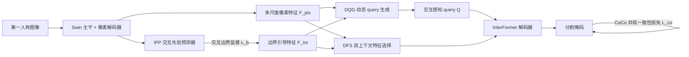

# Interaction-aware Representation Modeling With Co-Occurrence Consistency for Egocentric Hand-Object Parsing

**会议**: ICLR 2026  
**OpenReview**: [https://openreview.net/forum?id=RYwQ0xQcAh](https://openreview.net/forum?id=RYwQ0xQcAh)  
**代码**: [https://github.com/yuggiehk/InterFormer](https://github.com/yuggiehk/InterFormer)  
**领域**: 第一人称视觉 / 手-物交互分割 (EgoHOS)  
**关键词**: egocentric vision, hand-object segmentation, interaction-aware query, transformer decoder, physical consistency  

## 一句话总结
针对第一人称图像中手与活动物体的像素级分割，本文提出 InterFormer，用交互边界先验来动态生成"交互感知 query"、净化解码特征，并用一条"条件共现损失"把"没检测到手就不该出现该手的物体"这一物理常识写进训练，在 EgoHOS 与跨域 mini-HOI4D 上取得 SOTA。

## 研究背景与动机
- **领域现状**：第一人称（egocentric/FPV）视觉是具身智能、AR/VR、辅助机器人的基础能力，其中一个核心任务是 EgoHOS（Egocentric Hand-Object Segmentation）——把左右手、以及"正在被手操作的物体"（左手物 / 右手物 / 双手物）逐像素分割出来。Transformer 架构（DETR、Mask2Former、Care-Ego 等）因兼顾长程依赖与参数效率，成为该任务主流。
- **现有痛点**：作者指出三个一直没解决的结构性缺陷。其一，**query 初始化僵化**——现有方法要么用可学习参数（训练后是一组静态 query），要么直接采样图像特征（引入背景噪声），都没把"手-物交互关系"显式编码进去，对场景里千变万化的活动物体适应性差。其二，**解码特征"语义偏置"**——逐像素语义特征只回答"这是什么物体"，回答不了"它是否正在被交互"，于是大量与交互无关的内容被卷进最终 embedding，拉低精度。其三，**交互幻觉（interaction illusion）**——模型会做出违反物理因果的预测，比如右手根本没被检测到，却把某物体判成"双手操作物"。
- **核心矛盾**：通用语义表示擅长"识别物体"，但 EgoHOS 真正需要的是"识别交互关系"；二者目标错位，导致 query、特征、预测逻辑三层都偏离交互本质。
- **本文目标**：让模型从"以物体类别为中心"转向"以手-物交互为中心"，并把物理常识硬约束进预测。
- **核心 idea**：**先用一个轻量辅助分支预测"交互边界"作为粗定位先验，再以这份先验贯穿 query 生成、特征净化与一致性损失三处**，端到端地把交互关系塞进表示学习的每个环节。

## 方法详解

### 整体框架
InterFormer 在 Swin 主干 + deformable DETR 像素解码器之上，加了一个交互先验预测器（IPP）旁路，用交互边界真值监督，输出粗定位手-物接触区的"边界引导特征"。这份特征驱动两个核心模块：动态 query 生成器（DQG）用它来生成交互感知 query，双上下文特征选择器（DFS）用它在每层解码器里净化语义特征；最后再叠加条件共现（CoCo）损失约束输出的物理一致性。

### 关键设计
**1. 交互先验预测器（IPP）：把"接触在哪"先粗定位出来。** 大多数方法把像素特征直接丢进解码器，但"哪个物体是活动物"不能只看语义、必须看它跟手的关系。IPP 接收全局特征 $F_g$，用级联 U-Net 解码器加卷积头预测交互边界图 $M_b$，监督信号是手掩码与物体掩码膨胀后相交得到的边界真值 $G_b$，用二值交叉熵 $L_b=L_{bce}(M_b,G_b)$ 训练。它输出的边界引导特征 $F_{int}$ 不求精确分割，只提供"手-物接触区"的空间约束，是后两个模块共享的先验底座。

**2. 动态 query 生成器（DQG）：让 query 跟着交互区域走，而非跟着物体类别走。** 核心是两步：先"选"再"融"。把末层像素特征 $F^L_{pix}$ 划成 $n\times n$ 个不重叠子区域，与对齐后的边界引导特征算余弦相似度得到稠密相似图 $S=\frac{\langle F_{int},F^L_{pix}(i,j)\rangle}{\|F_{int}\|\cdot\|F^L_{pix}(i,j)\|}$，挑出相似度最高的 $N$ 个区域、取其特征向量拼成中间 query $Q_v\in\mathbb{R}^{N\times C}$——这一步保证选中的是真正参与接触的区域而非泛语义区域。再把 $Q_v$ 与一组可学习参数逐元素相加，得到最终 query $Q$。这样既保留了对场景内活动物体的动态适应（选的部分随交互区变），又靠可学习参数兜住稳定性，破解了"静态 query vs 噪声采样"的二选一困境。

**3. 双上下文特征选择器（DFS）：在每层解码器里把语义特征"提纯"成交互特征。** 针对语义偏置，DFS 在每个解码层同时吃像素特征 $F^l_{pix}$ 和边界引导特征 $F^l_{int}$，做一次"交互引导的交叉注意力"——query $\tilde Q$ 由边界引导特征算出，而 key/value $\tilde K,\tilde V$ 由像素特征算出（并加可学习位置参数 $T$ 增强鲁棒性），即 $F^l_{cos}=\text{softmax}(\tilde Q\tilde K^\top/\sqrt{dim})\tilde V$。让交互先验当"提问者"去检索语义特征，等于用交互信号去筛语义内容、压住交互无关噪声。随后再过一层交互增强自注意力 $F^l_{isa}=\phi_{sa}(\cdot)$ 建模长程依赖，经残差与归一化得到 $F^l_{inf}=\hat F^l_{pix}+\phi_{norm}(F^l_{isa}+\phi_{norm}(\phi_{drop}(F^l_{cos})))$，作为该层解码器的 key/value 逐层迭代精修。

**4. 条件共现损失（CoCo loss）：把"手在先"的物理常识写成可微约束。** 作者把交互幻觉看成宏观逻辑错误——更适合用"掩码像素数（物体是否存在）"而非"逐像素平均置信度"来度量。CoCo 的规则是：若某只手的预测掩码像素数低于阈值 $\tau$（视为该手缺席），就惩罚与之关联的物体预测；手确实在场（像素数超 $\tau$）时惩罚关闭、允许正常学交互。左/右手物形式化为 $L^{left}_{co}=(1-\mathbb{I}_{\{N_{lh}>\tau\}})\cdot N_{lo}$、$L^{right}_{co}=(1-\mathbb{I}_{\{N_{rh}>\tau\}})\cdot N_{ro}$；双手物要求两手同时在场 $L^{two}_{co}=(1-\mathbb{I}_{\{N_{rh}>\tau\wedge N_{lh}>\tau\}})\cdot N_{to}$。总损失为 $L=\lambda_b L_b+\lambda_{co}L_{co}+\lambda_{cls}L_{cls}+\lambda_{dic}L_{dic}+\lambda_{ce}L_{ce}$，端到端联合优化。

## 实验关键数据

### 主实验（IoU ↑，节选 Overall/mIoU）

| 数据集 | 设置 | 次优方法 | InterFormer | 提升 |
|---|---|---|---|---|
| EgoHOS | 域内测试 | Care-Ego 71.49 | **73.22** | +1.73（双手物 +7.76）|
| EgoHOS | 跨域测试 | ANNEXE 65.36 | **72.82** | +7.46 |
| mini-HOI4D | OOD | ANNEXE 62.87 | **66.07** | +3.20 |

域内最显著的增益来自最难的"双手物"类别（51.13→64.17 IoU），印证交互建模对复杂接触关系的价值；跨域与 OOD 的大幅领先说明交互感知表示比纯语义表示泛化性更强。

### 消融实验（EgoHOS 域内，mIoU / mAcc）

| 配置 | IPP | DQG | DFS | CoCo | mIoU | mAcc |
|---|---|---|---|---|---|---|
| 基线 | – | – | – | – | 70.72 | 77.48 |
| +CoCo | – | – | – | ✓ | 70.95 | 79.02 |
| +IPP | ✓ | – | – | – | 71.23 | 79.97 |
| +IPP+DQG+DFS | ✓ | ✓ | ✓ | – | 72.35 | 80.13 |
| 完整 | ✓ | ✓ | ✓ | ✓ | **73.22** | **80.68** |

四个组件逐项叠加均带来增益；IPP 作为先验底座对 DQG/DFS 是前提。

### 关键发现
- **阈值 $\tau$ 的甜点**：CoCo 损失里 $\tau=100$ 时最优（mIoU 73.22）；过小（50）模型过敏产生虚假手检测，过大（≥150）会漏掉部分可见的手，呈现明显的单峰权衡。
- **模型大小-精度权衡**：InterFormer 在参数量适中区间拿到最高 mIoU，优于更重的 MLLM 类方法（如 ANNEXE），在"更好-更轻"的帕累托前沿上占优。
- **跨域增益大于域内**：域内仅 +1.73 mIoU，但跨域 +7.46、OOD +3.20，说明交互感知表示的真正价值体现在分布偏移场景——纯语义模型一旦换域就因背景/物体类别变化而崩，而以交互关系为锚的表示更稳。

### 实现细节
4×RTX 4090、总 batch 8、图像裁剪到 448×448、训练 180k 迭代；query 数量设为目标类别数（5）；损失权重 $\lambda_b=\lambda_{co}=\lambda_{cls}=1$、$\lambda_{ce}=\lambda_{dic}=5$；AdamW + 10k 步线性 warmup 到 1e-4。

## 亮点与洞察
- **一份先验贯穿三处**：交互边界先验不是孤立的辅助任务，而是被复用到 query 生成（DQG）、特征净化（DFS）、损失约束（CoCo）三个层面，体现"以交互为中心"的统一设计哲学。
- **把物理常识写成损失而非后处理**：CoCo loss 用像素计数这一极简代理度量"手是否在场"，直接把"手在先"的因果约束端到端可微化，而非依赖规则后处理，这种思路可迁移到其他需要物理一致性的结构化预测任务。
- **DQG 调和了 query 初始化的老矛盾**：用"先选交互区、再融可学习参数"同时拿到动态适应性与训练稳定性。

## 局限与展望
- **依赖交互边界标注**：IPP 需要由手/物掩码膨胀相交得到的边界监督，对无此类标注的数据集迁移成本较高。
- **CoCo 用像素计数近似"手是否在场"较粗糙**：对手被严重遮挡、只露出极小区域的场景，固定阈值 $\tau$ 可能误判（论文也承认 $\tau$ 过大会漏检部分可见手）。
- **只做单帧分割**：方法面向静态图像，未利用第一人称视频的时序连续性，扩展到视频级时序一致的手-物交互解析是自然方向。
- **双手/多物体复杂场景**：双手物虽提升最大，但绝对 IoU（64%）相比手部（92%+）仍有差距，复杂接触关系仍有空间。

## 相关工作与启发
- **EgoHOS 谱系**：从 Para/Seq（Zhang 2022）到 Care-Ego（Su 2025a）等 transformer 方法，本文的差异在于显式引入交互先验而非依赖纯语义特征；与 MLLM 类的 ANNEXE 相比则在精度-参数权衡上更优。
- **query 初始化**：相对 Mask2Former 的可学习 query 与基于采样特征的 query，DQG 提供了"交互引导选择 + 可学习融合"的第三条路，对其他需要内容自适应 query 的 DETR 类任务有借鉴意义。
- **物理/逻辑一致性约束**：CoCo loss 的"条件共现"思路与场景图、HOI 检测里强调因果/共现先验的工作一脉相承，启发把领域常识编码为可微监督。
- **跨视角与多模态 egocentric**：作者在相关工作中梳理了缓解 FPV 数据稀缺的两条路线——跨视角表示迁移（需精确对齐的多视角录制）与多模态补充（gaze/音频/文本）；InterFormer 选择不依赖额外模态，仅靠交互边界先验在单模态内挖掘交互结构，工程落地门槛更低。
- **对具身/AR 的启发**：手-物交互的物理一致性是下游抓取规划、动作预测的基础，本文把"手在先"约束前置到分割阶段，提示在感知层就注入物理先验、而非留给下游纠错，可能是更稳健的系统设计。

## 评分
- **新颖性**: ⭐⭐⭐⭐ — "交互边界先验贯穿 query/特征/损失三处"的统一设计有想法，CoCo loss 用像素计数显式约束物理一致性的角度新颖。
- **实验充分度**: ⭐⭐⭐⭐ — 域内 + 跨域 + OOD 三套 benchmark、逐组件消融、阈值超参分析齐全，对比方法覆盖 C/T/L 三类。
- **写作质量**: ⭐⭐⭐⭐ — 三个痛点对应三个模块的叙事清晰，图表完整；公式中部分符号（DFS 内 $\phi$ 算子）略密。
- **价值**: ⭐⭐⭐⭐ — EgoHOS 是具身/AR 的基础能力，方法 SOTA 且开源，交互先验与一致性损失的思路对相关结构化预测任务有迁移价值。

<!-- RELATED:START -->

## 相关论文

- [\[ICCV 2025\] Dynamic Reconstruction of Hand-Object Interaction with Distributed Force-aware Contact Representation](../../ICCV2025/human_understanding/dynamic_reconstruction_of_hand-object_interaction_with_distributed_force-aware_c.md)
- [\[CVPR 2026\] Decoupled Generative Modeling for Human-Object Interaction Synthesis](../../CVPR2026/human_understanding/decoupled_generative_modeling_for_human-object_interaction_synthesis.md)
- [\[ICLR 2026\] Unleashing Guidance Without Classifiers for Human-Object Interaction Animation](unleashing_guidance_without_classifiers_for_human-object_interaction_animation.md)
- [\[ICLR 2026\] Human-Object Interaction via Automatically Designed VLM-Guided Motion Policy](human-object_interaction_via_automatically_designed_vlm-guided_motion_policy.md)
- [\[ICLR 2026\] InfBaGel: Human-Object-Scene Interaction Generation with Dynamic Perception and Iterative Refinement](infbagel_human-object-scene_interaction_generation_with_dynamic_perception_and_i.md)

<!-- RELATED:END -->
