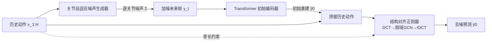

# KinemaDiff: Towards Diffusion for Coherent and Physically Plausible Human Motion Prediction

**会议**: ICLR 2026  
**OpenReview**: [https://openreview.net/forum?id=uxTQeKAUh5](https://openreview.net/forum?id=uxTQeKAUh5)  
**代码**: 待确认  
**领域**: 人体理解 / 随机人体运动预测  
**关键词**: 人体运动预测, 扩散模型, 关节自适应噪声, 骨骼结构约束, 物理合理性  

## 一句话总结
KinemaDiff 把人体骨骼拓扑和关节级动力学**直接嵌进扩散过程本身**，用关节自适应噪声生成器和结构对齐正则器替代"靠网络结构隐式编码先验"的常规做法，让随机人体运动预测在保持多样性的同时显著提升物理合理性与精度。

## 研究背景与动机
- **领域现状**：随机人体运动预测（Stochastic Human Motion Prediction, HMP）要从一段历史动作预测未来多种可能的人体轨迹，近年扩散模型已成主流——靠逐步去噪把随机噪声细化成连贯的人体姿态，在多样性和保真度上都强于早期的 VAE / GAN。
- **现有痛点**：当前扩散方法有两个结构性缺陷。其一，**对所有关节用同一套噪声 schedule**，但手腕、脚踝和躯干根节点的自由度与动态行为差异巨大，统一噪声忽略了这种异质性，容易产生紊乱或物理无效的预测；其二，**骨骼解剖结构只被隐式学习或后处理修正**，没有真正进入扩散过程，导致生成姿态出现骨头被拉长/压缩等违反人体生物力学的现象。
- **核心矛盾**：把结构先验编码进网络架构虽能促进合理运动学，但这只是对生成过程的**间接控制**，无法严格保证物理约束被满足——多样性和物理真实性之间缺一个直接可控的旋钮。
- **本文目标**：在不牺牲多样性的前提下，给扩散过程一个对物理真实性的**直接、显式控制**，让每个去噪步都遵守人体骨骼约束。
- **核心idea**：**结构对齐 + 关节感知的扩散过程改造**——不改去噪网络架构而改造去噪过程本身，把骨骼拓扑与关节动力学直接注入前向加噪和反向去噪两端。

## 方法详解

### 整体框架
KinemaDiff 在标准条件扩散（直接预测 $y_0$、以历史动作 $x$ 为条件）的骨架上接入三个部件：先由**关节自适应噪声生成器**为每个关节、每个样本生成异质噪声并加到待预测的未来动作上；噪声化的未来帧过一个 Transformer 编码器得到**无条件的初始重建** $\tilde{y}_0$；再把初始重建与历史动作拼接，送入**结构对齐正则器**在频域用 GCN 处理后变回时域，输出最终去噪预测 $\hat{y}_0$。整个采样只用 10 步 DDPM。

### 关键设计

**1. 关节自适应噪声生成器：让每个关节有自己的噪声强度。** 常规扩散对所有关节施加同一标量噪声率，本文把前向过程改成多元噪声 schedule，用对角协方差 $\Sigma=\mathrm{diag}(s_1^2,s_2^2,\dots,s_J^2)$ 取代各向同性噪声：$q(y_t\mid y_{t-1})=\mathcal{N}\big(y_t;\,\alpha_t y_{t-1},\,(1-\alpha_t)\Sigma\big)$。每个关节的缩放因子 $s_j=f_\theta(j,\,x_j^{(1:H)})$ 由两部分决定——关节索引（不同关节天生动态特性不同）和该关节的历史运动轨迹（让噪声随实例自适应），$f_\theta$ 只是几层线性层。这样自由度大的末端关节可以分到更强噪声以撑起多样性，而根节点等稳定关节噪声更小，避免统一噪声带来的"机器人式"僵硬。反向去噪同样在 $(1-\alpha_t)\Sigma$ 下进行，保证加噪与去噪两端一致。

**2. 结构对齐正则器：把骨长一致性写进每一步去噪。** 关键观察是历史动作无噪声、可直接抽出可靠的骨骼结构。对一批加噪样本 $y_t=\sqrt{\bar\alpha_t}\,y_0+\sqrt{1-\bar\alpha_t}\,\epsilon$，由于 $\epsilon$ 零均值，按 batch 取均值即可近似去掉噪声 $\bar y_t=\frac1B\sum_b y_t^{(b)}\approx\sqrt{\bar\alpha_t}\,y_0$，从而对每条骨连接 $(i,j)\in E$ 算出骨长 $\ell_{i,j}=\lVert y_i-y_j\rVert_2$。正则器把观测历史的平均骨长 $\bar b_{obs}$ 同时对齐到最终预测 $\bar b_{pred}$ 和初始重建 $\bar b_{ref}$：$L_{align}=\frac1{|E|}\sum(\bar b_{obs}-\bar b_{pred})^2+\frac1{|E|}\sum(\bar b_{obs}-\bar b_{ref})^2$。这解决了"$t$ 较大时直接预测 $y_0$ 不准、骨长会漂"的问题，让整条去噪轨迹的骨骼比例都保持稳定。

**3. 频率特定图结构的去噪网络：在频域分带建模运动动态。** 结构对齐正则器不是简单的损失项，它通过 DCT/IDCT 把整段运动序列搬到频域，再用 GCN 处理。不同于以往用一个固定邻接矩阵，本文给**每个频带配一套专属的邻接连接**，因为低频（整体平移）和高频（末端抖动）对应的关节耦合模式不同，分带建模能更精细地刻画各频段的运动模式。

**4. 全程监督的直接 $y_0$ 预测目标。** 去噪器在每个时间步都直接输出姿态预测 $\hat y_0$（而非预测噪声），因此重建损失和对齐损失可以**施加在每一个扩散步**而非只在最后一步。重建损失 $L_{rec}=\frac1J\sum_j(\lVert(x_j-\hat x_j)\lambda_j\rVert_1\gamma+\lVert(y_0^j-\hat y_0^j)\lambda_j\rVert_1)$ 对不同关节加不同权重 $\lambda_j$，总损失 $L_{total}=\alpha L_{rec}+\beta L_{align}$。逐步监督让去噪轨迹始终贴着解剖学上合理的人体运动走。

## 实验关键数据

### 主实验表格（Human3.6M，除 APD 外越低越好）

| 方法 | 类型 | ADE↓ | FDE↓ | APD↑ | CMD↓ | FID↓ |
|------|------|------|------|------|------|------|
| DLow | VAE | 0.425 | 0.518 | 11.741 | 4.927 | 1.255 |
| DivSamp | VAE | 0.370 | 0.485 | 15.310 | 11.692 | 2.083 |
| HumanMAC | DM | 0.369 | 0.480 | 6.301 | – | – |
| BeLFusion | DM | 0.372 | 0.474 | 7.602 | 5.988 | 0.209 |
| CoMusion | DM | 0.350 | 0.458 | 7.632 | 3.202 | 0.102 |
| SkeletonDiff | DM | 0.344 | 0.450 | 7.249 | 4.178 | 0.123 |
| **KinemaDiff** | DM | **0.331** | **0.449** | 6.912 | 4.60 | **0.083** |

精度（ADE/FDE）与真实性（FID）双双刷新 SOTA，FID 较前最优 CoMusion 相对提升约 19%。APD（原始多样性）不是最高，作者强调本文优先保证每个样本的物理保真度而非盲目堆多样性。

跨数据集泛化（AMASS）上 ADE 0.478 / FDE 0.540 / MMADE 0.456 / MMFDE 0.457 / CMD 9.448 多数指标领先，说明模型学到的是运动的基本规律而非数据集特定 artifact。

### 消融实验表格（Human3.6M）

| Encoder | J-Noise | Align | APD↑ | ADE↓ | FDE↓ | FID↓ |
|---------|---------|-------|------|------|------|------|
| - | - | - | 19.601 | 0.852 | 0.775 | 2.393 |
| ✓ | - | - | 9.600 | 0.653 | 0.574 | 0.932 |
| ✓ | - | ✓ | 7.243 | 0.339 | 0.454 | 0.088 |
| ✓ | ✓ | - | 7.014 | 0.336 | 0.453 | 0.089 |
| ✓ | ✓ | ✓ | 6.912 | **0.331** | **0.449** | **0.083** |

噪声 scheduler 对比：Variance（本文）FID 0.083 优于 Sqrt（0.108）和 Cosine（0.178）。

### 关键发现
- 结构对齐正则器是 ADE/FDE 精度的主要贡献者：它在每一步阻止运动学误差累积，保护长程预测不崩。
- 关节自适应噪声与结构对齐是**协同**关系：前者塑造自然异质的关节运动避免僵硬，后者剔除解剖学上不可能的姿态，两者叠加才拿到最低 FID。
- 仅 10 步扩散即可达到上述效果，采样高效。

## 亮点与洞察
- **改"过程"而非改"架构"**：绝大多数扩散运动方法在卷去噪网络结构，本文转而改造扩散过程的加噪/去噪两端，提供对物理真实性的直接控制，思路上区别于 SkeletonDiffusion 那类只用静态骨架先验的各向异性噪声。
- **batch 均值去噪是个巧妙小技巧**：利用高斯噪声零均值，按 batch 求平均就能从加噪样本里近似还原干净骨长，使骨长约束可以无成本地施加在任意时间步。
- **多样性与真实性的取舍被显式化**：作者不追求最高 APD，而是用关节级噪声把多样性"长在物理合理的流形上"，这种价值取向对下游应用（自动驾驶、辅助机器人、虚拟化身）更实用。

## 局限与展望
- 原始多样性指标 APD 不及部分 VAE/扩散基线，对需要极大动作多样性的场景可能偏保守。
- 结构对齐依赖"骨长在历史与未来间近似恒定"的假设，对于服饰形变、非刚体或多人交互等骨长不稳定场景的适用性未充分验证。
- 频率特定邻接矩阵的频带划分与关节连接设计偏经验，缺少对该设计敏感性的系统分析。
- 只在 Human3.6M / AMASS 这类 mocap 数据上验证，面向真实噪声 2D/单目重建输入的鲁棒性留待考察。

## 相关工作与启发
- **与 SkeletonDiffusion（CVPR2025）的对比最关键**：后者也引入各向异性噪声，但协方差来自骨架**静态**运动学树、固定不变；KinemaDiff 的噪声是**可学习且随实例自适应**的，启发是"先验该随数据动态调整而非写死"。
- **CoMusion / HumanMAC** 代表的是"在 DCT 频域用 GCN 卷架构"的路线，本文复用频域 GCN 但叠加了频带特定连接和过程级约束，说明架构与过程改造可以正交叠加。
- 对任务特定噪声设计（如分子/图像扩散里的 tailored noise）的借鉴，提示一个通用方向：**把领域结构知识注入噪声协方差**往往比堆网络更高效。

## 评分
- 新颖性: ⭐⭐⭐⭐ — "改造扩散过程而非去噪网络"+关节自适应噪声+逐步骨长约束的组合在 HMP 里是清晰的新点，但与 SkeletonDiffusion 的思路有延续性。
- 实验充分度: ⭐⭐⭐⭐ — Human3.6M + AMASS 跨数据集、完整消融、scheduler/步数分析齐备；缺多人/真实输入场景与更多数据集。
- 写作质量: ⭐⭐⭐⭐ — 动机—方法—实验逻辑顺畅，图示清晰，公式推导（batch 均值去噪）讲得明白。
- 价值: ⭐⭐⭐⭐ — 物理合理性对自动驾驶/机器人/虚拟人等下游很实用，方法可迁移到其他结构化序列生成。

<!-- RELATED:START -->

## 相关论文

- [\[CVPR 2025\] PhysMoDPO: Physically-Plausible Humanoid Motion with Preference Optimization](../../CVPR2025/human_understanding/physmodpo_physically-plausible_humanoid_motion_with_preference_optimization.md)
- [\[AAAI 2026\] mmPred: Radar-based Human Motion Prediction in the Dark](../../AAAI2026/human_understanding/mmpred_radar-based_human_motion_prediction_in_the_dark.md)
- [\[ICLR 2026\] ReactDance: Hierarchical Representation for High-Fidelity and Coherent Long-Form Reactive Dance Generation](reactdance_hierarchical_representation_for_high-fidelity_and_coherent_long-form_.md)
- [\[ICLR 2026\] HUMOF: Human Motion Forecasting in Interactive Social Scenes](humof_human_motion_forecasting_in_interactive_social_scenes.md)
- [\[ICLR 2026\] TriC-Motion: 三域因果建模驱动的文本到动作生成](tric-motion_tri-domain_causal_modeling_grounded_text-to-motion_generation.md)

<!-- RELATED:END -->
