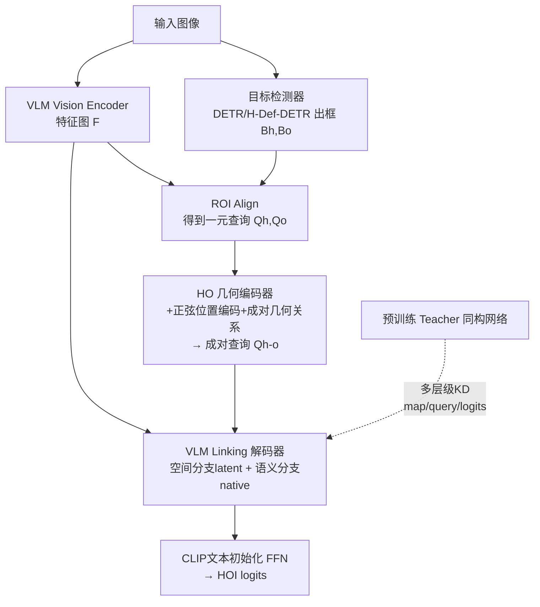

# LINK: Learning Instance-level Knowledge from Vision-Language Models for Human-Object Interaction Detection

**会议**: ICLR 2026  
**OpenReview**: [https://openreview.net/forum?id=CTdweIFocz](https://openreview.net/forum?id=CTdweIFocz)  
**代码**: 待确认  
**领域**: 人体理解 / Human-Object Interaction Detection  
**关键词**: HOI 检测, 视觉-语言模型, 知识蒸馏, 零样本, 开放词表, 几何编码  

## 一句话总结
LINK 用一个"几何编码器 + VLM 链接解码器"的即插即用两阶段 HOI 检测框架，再叠加一套师生范式的渐进式学习策略，把稀疏的 HOI 标注补成覆盖所有人-物对的稠密监督，从而在全监督、零样本、开放词表三种设定上同时拿到 SOTA。

## 研究背景与动机
**领域现状**：人-物交互（HOI）检测要把图像解析成 `<human, action, object>` 三元组，是机器人、异常行为分析等的基础任务。近年大量工作把预训练 CLIP 等视觉-语言模型（VLM）接入 HOI，借其强大的图文对齐能力提升对罕见/未见交互的识别，推动了零样本、少样本 HOI 检测。

**现有痛点**：作者指出两个长期未解的矛盾。其一是**专精与泛化的二律背反**——专用架构在全监督 benchmark 上很强，但换到零样本/跨域就崩；而零样本导向的方法多是在 CLIP 上做轻量改造，认新类很行但全监督下又打不过专用模型，二者像跷跷板，提了一头掉另一头。其二是**监督稀疏**——一张图里人和物构成稠密的交互图结构，但 GT 只标注了其中极少数边（红色正样本对），大量"有效但未标注的正样本对"和"信息丰富的负样本"都被忽略浪费了。

**核心矛盾**：VLM 是在图像级图文对上预训练的、给的是全局语义表征，而 HOI 需要的是实例级、细粒度的空间+语义判别；在稀疏监督下把前者迁移成后者，是适配 VLM 到 HOI 的根本难点。

**本文目标**：造一个**统一**的两阶段 HOI 检测器，既能在三大标准 benchmark 上专精，又能在零样本/开放词表上泛化，而不牺牲任何一端。

**核心 idea**：**[架构解耦]** 让交互查询只依赖 VLM 特征 + 检测框、与具体检测器解耦，从而即插即用任意目标检测器；**[稠密监督]** 用师生蒸馏把监督从"匹配上的少数对"扩展到"所有候选人-物对"，让模型通过对比正负实例间细微的空间与语义差异学到鲁棒、可迁移的 HOI 表征。

## 方法详解

### 整体框架
LINK 是两阶段流程：先用现成检测器（DETR / H-Deformable-DETR）出框，再对每个人-物对做交互推理。架构上由 **Human-Object 几何编码器**（注入空间感知、构造成对查询）和 **VLM Linking 解码器**（空间分支 + 语义分支双路交叉注意力聚合 VLM 特征图）组成；训练上由 **渐进式学习策略**（先训出 teacher，再用 teacher 给 student 提供覆盖全部人-物对的多层级稠密蒸馏）驱动。关键在于：查询特征只来自 ROI Align 的 VLM 特征图 + 框，不用检测器专属 query，因而与检测器无关、可任意替换。

### 关键设计

**1. Human-Object 几何编码器：给"只懂全局语义"的 VLM 补上空间感**。CLIP 类 VLM 用图像级对比目标预训练，强在全局语义、弱在区域级空间判别，所以作者先给每个框补位置信息：把框 $B=(x_1,y_1,x_2,y_2)$ 按图像尺寸归一化后算中心 $C$ 与尺寸 $S$，做 2D 正弦位置编码 $PE(B)=PE(C)\oplus PE(S)$ 加到一元查询上并经自注意力细化 $Q=\text{Self-Attn}(Q+PE(B))$。随后枚举所有人-物组合拼成成对查询 $Q_{h\text{-}o}=\text{Linear}(\mathcal{C}[Q_i,Q_j]),\ i\in H,\ j\in O\cup H$（其中允许 $j\in H$ 以建模人-人交互）。再仿照 UPT 编码每对的成对空间关系向量 $R_{i,j}$（IoU、方向向量、绝对/相对尺寸），通过多模态融合模块 $z=\text{MLP}(\text{ReLU}(\text{Concat}[x,y]))$ 把语义查询与几何编码融合成最终成对查询。这一步的关键意图是**与检测器特征解耦**——查询只来自 VLM 特征 + 框，规避了检测器引入的偏置，同时显式注入了 HOI 最看重的空间依赖。

**2. VLM Linking 解码器：空间/语义双分支，分别管细粒度与可迁移**。标准做法是成对查询直接对 VLM 特征图做交叉注意力，作者把它拆成互补两路。**空间分支**先用 connector 把特征图降维成一个 latent 瓶颈 $F^l=\text{MLP}(F)$，让查询在压缩空间里聚焦几何关系，并借鉴 PViC 用框位置编码去约束注意力图（box-encoding-guided 注意力 $CA_{be}$），专攻细粒度空间推理；**语义分支**则把查询升维到 VLM 原生高维空间 $Q^n_{h\text{-}o}=\text{Linear}(Q_{h\text{-}o})$ 做标准交叉注意力 $CA$，聚合高层全局语义、负责可迁移性。两路输出拼接后过 FFN 融合：$Q_{out}=\text{MLP}\big(CA_{be}(Q_{h\text{-}o},F^l)\,\copyright\,CA(Q^n_{h\text{-}o},F)\big)$。最后 $Q_{out}$ 送入一个**用 CLIP 文本嵌入初始化的 FFN** 出 HOI logits——既保留了空间精度又继承了 VLM 的开放语义。

**3. 渐进式师生学习：把稀疏 GT 监督补成覆盖全部人-物对的稠密监督**。第一阶段只用原始 GT 训出一个 teacher（把 VLM 冻结的图像级表征转成 HOI 实例级表征）；第二阶段 student 从头训，既受 GT 监督，又被 teacher 在**所有候选人-物对**上稠密指导。由于师生**同输入、同架构**，可一一对齐每个人-物实例，从而把知识迁移扩展到匹配子集之外的全部对（包括未标注正样本与信息负样本）。蒸馏用 KL 散度 $KD_{KL}(f_{stu},f_t)=\text{KL}(\sigma(f_t/\tau)\,\|\,\sigma(f_{stu}/\tau))$，并在三个层级同时对齐：**特征图级**（先双线性插值对齐空间分辨率、再三线性插值对齐通道，$L^{feat}_{KD}=KD(F_{stu},F''_t)$）、**查询级**（编码器/解码器每层查询逐 token 对齐，$L^{query}_{KD}=\frac{1}{L_e}\sum_\ell KD(Q^{(\ell)}_{e,stu},Q^{(\ell)}_{e,t})+\frac{1}{L_d}\sum_\ell KD(Q^{(\ell)}_{d,stu},Q^{(\ell)}_{d,t})$）、**logits 级**（把 HOI logit 与检测置信度结合成 $\Psi_s=\log\frac{P}{1+\exp(-O_s)-P}$ 后蒸馏）。总目标在原匹配查询分类损失外，叠加多层级 $G$ 的蒸馏：$\theta^*=\arg\min_\theta \mathbb{E}_{I\sim X}[L_M(\Phi_\theta(I,B),GT)+\sum_{g\in G}KD_g(\Phi_\theta(I,B),\Phi_t(I,B))]$。本质是用对比正负实例间细微的空间/语义差异，逼模型解决歧义、学出更具判别力的表征。

## 实验关键数据

### 主实验表格（HICO-DET / V-COCO，全监督）

| 方法 | Backbone / VLM | HICO-DET Full | Rare | V-COCO AP_role |
|------|----------------|---------------|------|----------------|
| LAIN | R50 / CLIP-B | 36.02 | 35.70 | 65.1 |
| **LINK** | R50 / CLIP-B | **37.43** | **37.18** | **66.5** |
| HOLa | R50 / CLIP-L | 39.05 | 38.66 | 66.0 |
| **LINK** | R50 / CLIP-L | **42.92** | **45.03** | **68.1** |
| BC-HOI | R50 / BLIP-2 | 43.01 | 45.76 | 70.6 |
| **LINK** | R50 / BLIP-2 | **43.72** | **45.82** | 68.5 |
| HORP | Swin-L / CLIP-L | 47.53 | 46.81 | 68.3 |
| **LINK** | Swin-L / CLIP-L | **49.06** | **53.63** | **69.2** |

R50+CLIP-L 下 Full/Rare 比前最佳高 +3.87 / +6.37 mAP（相对 +9.9% / +16.5%）；Swin-L 进一步到 49.06 / 53.63。

### 消融实验表格（HICO-DET 全监督，Table 6）

| # | 编码器 | 解码器 + 蒸馏 | Full | Rare | N-Rare |
|---|--------|----------------|------|------|--------|
| A1 | Self-Attn | Cross-Attn（baseline） | 36.10 | 33.67 | 36.97 |
| A2 | Self-Attn | VLM-Link | 39.23 | 39.76 | 39.02 |
| A3 | Geometrical | Cross-Attn | 38.30 | 35.46 | 39.31 |
| A4 | Geometrical | VLM-Link | 41.20 | 41.43 | 41.13 |
| A5 | A4 + Logit-level KD | | 41.89 | 43.82 | 41.27 |
| A6 | A5 + Query-level KD | | 42.34 | 43.62 | 41.84 |
| A7 | A6 + Map-level KD | | 42.92 | 45.03 | 42.20 |
| A8 | A7 + multi-teacher (CLIP+SigLIP) | | 43.54 | 45.58 | 42.93 |

几何编码器（A3）与 VLM-Link 解码器（A2）各自有效、组合（A4）最佳；三级蒸馏逐级叠加（A5→A7）持续涨点，Rare 子集尤其受益（33.67→45.03）。

### 关键发现
- **零样本四设定**（RF-UC / NF-UC / UO / UV）取得两项最佳、两项次佳；RF-UC unseen 32.25 超前最佳 +1.64，ViT-L 版进一步大涨。
- **开放词表 SWiG-HOI** 全集 17.97 mAP，比前最佳 +2.71（相对 +17.8%），Rare 子集相对提升达 +22.1%，novel HOI 也有 12.15。
- **跨基础模型普适**：在 CLIP/BLIP（对比）、DINOv2/DINO@448（自监督）、SigLIP2/Florence2（多任务多模态）上 +LINK 一致涨点，长尾 HOI（≤10 样本）增益最大。
- 少样本 1→32-shot 在 HICO-DET 与 V-COCO 上均最佳，且不像 PViC/ADA-CM 那样在两数据集间此消彼长。

## 亮点与洞察
- **"解耦检测器"是泛化的关键开关**：不用 DETR 专属 query、只靠 VLM 特征图 + 框出查询，既换来即插即用任意检测器，又顺手去掉了检测器偏置——这正是它能同时打全监督和零样本的结构性原因。
- **稀疏监督问题用"师生同构对齐"破解得很优雅**：师生共享输入与架构 ⇒ 人-物实例可一一对齐 ⇒ 蒸馏能合法地覆盖所有候选对，而不是简单加伪标签，避免了引入噪声。
- **空间/语义双分支的分工解释了"专精×泛化"为何不再二选一**：空间分支保细粒度（专精），语义分支保 VLM 全局语义（泛化），各管一摊再融合。
- 多 teacher（CLIP+SigLIP）在全监督下进一步涨到 43.54，说明该蒸馏框架可作为聚合异构基础模型知识的通用容器。

## 局限与展望
- 师生两阶段 + 多层级蒸馏 + 对全部人-物对（含负样本）的稠密监督，训练成本与显存开销不低，论文也坦言细节放在补充材料，实际部署的训练代价值得关注。
- 推理仍是两阶段，最终性能受上游目标检测器质量约束；开放词表 novel 子集（12.15）相对 rare/non-rare 仍偏低，未见类的语义对齐还有空间。
- 几何关系编码沿用 UPT/PViC 的成熟设计，空间建模本身的创新有限，主要红利来自"解耦 + 稠密蒸馏"的组合。
- 多 teacher 仅验证了 CLIP+SigLIP 两个，更大规模异构 teacher 集成的收益与冲突尚未充分探索。

## 相关工作与启发
- **两阶段 vs 一阶段 HOI**：本文走两阶段（检测+分类解耦）路线，看中其灵活、可解释、模块化，适合做通用可扩展检测器；与 PPDM/UnionDet 等一阶段、以及 GEN-VLKT 等 query-based 一阶段形成对比。
- **VLM 适配 HOI**：与 HOICLIP（query 式利用 CLIP 检索）、BCOM（遮挡感知上下文挖掘）、ADA-CM（概念引导记忆）、CMMP（条件多模态 prompt）同属"把 CLIP 接进 HOI"潮流，但 LINK 的差异在于不做 prompt/记忆改造，而是从架构解耦 + 稠密蒸馏入手。
- **启发**：师生同构 ⇒ 实例级一一对齐 ⇒ 稠密蒸馏，这套"用同架构 teacher 把稀疏标注扩成稠密监督"的思路，可迁移到其他存在标注稀疏/图结构的实例级任务（如场景图生成、关系检测）。

## 评分
- 新颖性: ⭐⭐⭐⭐ — 单个组件（几何编码、双分支注意力、KD）多有前作，但"检测器解耦 + 师生同构稠密蒸馏"的组合恰好同时破解专精/泛化二律背反与监督稀疏两大痛点，立意清晰。
- 实验充分度: ⭐⭐⭐⭐⭐ — 覆盖全监督/零样本/少样本/开放词表四类设定 + 三大 benchmark + 六种基础模型 + 多级消融，是首个跨多基础模型的系统 HOI 评测，非常扎实。
- 写作质量: ⭐⭐⭐⭐ — 动机图（trade-off + 稀疏监督）直观，方法分节清晰、公式完整；个别符号（如双分支融合）需对照图细读。
- 价值: ⭐⭐⭐⭐ — 即插即用、可换任意检测器/基础模型，并在长尾/未见类上增益最大，对实际 HOI 应用有较强落地价值。

<!-- RELATED:START -->

## 相关论文

- [\[ICCV 2025\] CleanPose: Category-Level Object Pose Estimation via Causal Learning and Knowledge Distillation](../../ICCV2025/human_understanding/cleanpose_category-level_object_pose_estimation_via_causal_learning_and_knowledg.md)
- [\[ICLR 2026\] Unleashing Guidance Without Classifiers for Human-Object Interaction Animation](unleashing_guidance_without_classifiers_for_human-object_interaction_animation.md)
- [\[ICLR 2026\] EmoPrefer: Can Large Language Models Understand Human Emotion Preferences?](emoprefer_can_large_language_models_understand_human_emotion_preferences.md)
- [\[CVPR 2026\] Unleashing Vision-Language Semantics for Deepfake Video Detection](../../CVPR2026/human_understanding/unleashing_vision-language_semantics_for_deepfake_video_detection.md)
- [\[ICLR 2026\] Human-Object Interaction via Automatically Designed VLM-Guided Motion Policy](human-object_interaction_via_automatically_designed_vlm-guided_motion_policy.md)

<!-- RELATED:END -->
