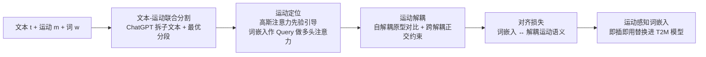

# Motion-Aligned Word Embeddings for Text-to-Motion Generation

**会议**: ICLR 2026  
**OpenReview**: [https://openreview.net/forum?id=zbHpRwzrq5](https://openreview.net/forum?id=zbHpRwzrq5)  
**代码**: [https://github.com/ke-han-aca/MATE.git](https://github.com/ke-han-aca/MATE.git)  
**领域**: 人体理解 / 文本到动作生成  
**关键词**: 文本到动作生成、词嵌入对齐、运动语义解耦、对比学习、原型表示  

## 一句话总结
MATE 把"运动语义对齐"下沉到 LLM 文本编码器的**词嵌入层**——只微调这一薄层（3.2M 参数），通过运动定位 + 词级解耦把"clockwise"这类动作相关词与人体骨骼运动真正绑定，产出即插即用的运动感知文本编码器，几乎不改架构就让 MoMask/MDM 等主流 T2M 模型全面刷新 SOTA。

## 研究背景与动机
- **领域现状**：文本到动作（T2M）生成普遍采用两阶段流水线——先用预训练 LLM（CLIP、DistilBERT）编码文本，再由运动生成器（diffusion 或量化 VAE）解码成骨骼序列。绝大多数工作冻结文本编码器、专注打磨运动生成模块。
- **现有痛点**：CLIP/DistilBERT 在通用文本语料（或图文对）上训练，缺乏动作相关词与人体运动之间的细粒度对齐。模型能对齐句子级语义（"a person walks in a clockwise circle"生成对了），但碰到稍复杂的"jogs in a clockwise motion and falls to their knees"就崩——对"clockwise"这种词的鲁棒理解不足。
- **核心矛盾**：问题的根源在**词嵌入层**。"clockwise"和"anti-clockwise"在语言学上形态结构、语法功能高度相似，但在运动学上是**完全相反、互不兼容**的旋转方向。这种跨模态的词级语义鸿沟，先前对句子级对齐做文章的方法（LaMP、MotionGPT、TMR 等）无法触及。
- **本文目标**：在不抛弃 LLM 强大上下文建模能力的前提下，把词级运动语义注入 LLM，产出能直接替换进现有 T2M 模型的运动感知文本编码器。
- **核心 idea**（**词嵌入即对齐瓶颈**）：只优化词嵌入层、冻结后续所有层。假设是语言与运动共享结构属性（都由组合元素按时序排列），因此高层的上下文建模能力可泛化到运动语义，只需把最底层的"词义查找表"校准到运动学语境即可。难点在于运动序列里的语义**天然纠缠**——数据集只有句子级标注，且相邻词的运动语义互相缠绕，难以归因到单个词。

## 方法详解

### 整体框架
给定三元组 $\{t, m, w\}$（文本描述、对应运动序列、从文本中采样的词），MATE 的目标是通过优化词 $w$ 的嵌入，把它的文本语义与运动序列 $m$ 中对应的运动语义对齐。框架含可训练词嵌入的文本编码器、运动编码器、运动解码器三部分，靠两步走解决"词级语义从哪来、怎么纯化"的问题：先做**运动定位**找出词在序列中大致对应的时间段，再做**运动解耦**把这段里真正属于该词的语义剥离出来，最后对齐进词嵌入。

### 关键设计

**1. 文本-运动联合分割：给没有词级标注的数据造软标签。** 数据集只给整句标注，缺词级监督，MATE 先用 ChatGPT 把描述 $t$ 拆成 $N$ 个子文本 $t_1,\dots,t_N$（每个描述一个时序连贯的子动作），再把运动序列切成 $N$ 段非重叠片段去匹配。分段边界通过求解一个最优划分问题确定：$\min_{\{s_n,e_n\}}\sum_{n=1}^{N}\big(1-\cos(E_t(t_n), E_m(m[s_n{:}e_n]))\big)$，其中 $E_t,E_m$ 是预训练 T2M 检索模型里冻结的文本/运动编码器，约束 $s_{n+1}=e_n$（首尾相接），穷举所有合法划分取最优。这个分段不当硬标签用，而是作为下一步定位的软先验。

**2. 文本引导的运动定位：用高斯注意力先验把词软性锚到时间段。** 拿到分段后，运动编码器同时抽序列级表示 $f^m$ 和帧级特征 $F^m\in\mathbb{R}^{T\times D}$。核心是让**词嵌入充当 Query** 去注意相关运动特征：$f^m_{word}=\text{MultiHead}(Q,K,V)$，其中 $Q=\text{Proj}(\text{WE}(w))$，$K=(1+\omega\cdot\text{AttentionPrior}(t))\odot F^m$，$V=F^m$。注意力先验是高斯形状 $\text{AttentionPrior}(t)=\exp\!\big(-\frac{(t-c_n)^2}{2\sigma_n^2}\big)$，中心 $c_n=\frac{s_n+e_n}{2}$、宽度 $\sigma_n=\frac{e_n-s_n}{2}$。它在定位段中心附近的帧高亮、向两侧平滑衰减——相比硬二值 mask，这种软先验对分段误差更鲁棒（消融里 Gaussian 全序列版本最优）。

**3. 词引导的运动解耦：三准则下用原型对比剥离词专属语义。** 定位只解决了"在哪段"，但"turn"和"clockwise"在同一段里仍纠缠。MATE 提出三条解耦准则——稳定性（同一词在不同运动里应注意到相似特征）、可区分性（不同词应得到语义不同的特征）、合理性（运动里没有该词语义时不应产出有意义特征）。为满足前两条，引入**自解耦**：预定义 $K$ 个可学习的运动-词原型 $\{f^p_{w_k}\}$，用原型级对比损失 $\mathcal{L}_{self}=\frac{1}{|V|}\sum_{i\in V}-\log\frac{\exp(\cos(f^{m_i}_{w_i},f^p_{w_i})/\tau)}{\sum_k \exp(\cos(f^{m_i}_{w_i},f^p_{w_k})/\tau)}$ 把解耦特征拉向自己的原型、推开其他原型。原型让对比从 batch 级升到**数据集级**词语义，稳定性和可区分性都更强。为满足合理性，再加**跨解耦**：用第 $j$ 个样本的词 $w_j$ 去 query 运动 $m_i$，若 $m_i$ 不含 $w_j$ 语义则强制产出与 $f^{m_i}_{w_i}$ 正交的特征，$\mathcal{L}_{cross}=\frac{1}{|N|}\sum_{(i,j)\in N}\big(|\cos(f^{m_i}_{w_i},f^{m_i}_{w_j})|+|\cos(f^{m_i}_{w_i},f^{m_j}_{w_i})|\big)$。

**4. 运动对齐的词嵌入与总目标：对称 InfoNCE 把语义焊进词嵌入。** 最后用对称 InfoNCE 对齐损失 $\mathcal{L}_{align}$ 把投影后的词嵌入 $f^e_{w_i}=\text{Proj}(\text{WE}(w_i))$ 与其解耦运动语义 $f^{m_i}_{w_i}$ 拉近、把错配对推远（双向归一化）。词级目标汇总为 $\mathcal{L}_{word}=\mathcal{L}_{self}+\mathcal{L}_{cross}+\mathcal{L}_{align}$。但纯词级会忽略上下文依赖，于是再加句子级 InfoNCE $\mathcal{L}_{sent}$（对齐句特征 $f^t$ 与运动特征 $f^m$）和运动重建损失 $\mathcal{L}_{rec}$（$f^m$ 过解码器重建 $m$ 保细节），总目标 $\mathcal{L}_{all}=\mathcal{L}_{rec}+\omega_1\mathcal{L}_{word}+\omega_2\mathcal{L}_{sent}$。训练完只把 MATE 增强的词嵌入接回原 T2M 模型、从头重训，流程不改。

## 实验关键数据

### 主实验表格
在 HumanML3D 上把四个主流 T2M 模型的 CLIP 编码器替换为 MATE 增强版（仅更新词嵌入），全面提升：

| 方法 | R-Prec Top-1 ↑ | FID ↓ | MM-Dist ↓ |
|---|---|---|---|
| 真实动作 | 0.511 | 0.002 | 2.974 |
| MDM | 0.320 | 0.544 | 5.566 |
| MDM +MATE | **0.509** | **0.332** | **3.057** |
| MotionDiffuse | 0.491 | 0.630 | 3.113 |
| MotionDiffuse +MATE | **0.536** | **0.234** | **2.907** |
| MMM | 0.515 | 0.089 | 2.926 |
| MMM +MATE | **0.541** | **0.069** | **2.887** |
| MoMask（SOTA 基线） | 0.521 | 0.045 | 2.958 |
| MoMask +MATE | **0.550** | **0.040** | **2.811** |

KIT 上同样全面提升（如 MoMask Top-1 0.433→0.443、FID 0.204→0.197），但因数据集更小，增益相对温和。

### 消融实验表格
**优化哪些层最关键**（HumanML3D，CLIP 编码器）：

| 可训练层 | 参数量 | Top-1 ↑ | FID ↓ |
|---|---|---|---|
| 不训练 | 0M | 0.521 | 0.045 |
| **仅词嵌入层** | **3.2M** | **0.550** | **0.040** |
| 后续层 | 37M | 0.022 | 7.611 |
| 全部层 | 40.2M | 0.014 | 9.468 |
| LoRA Adapter | 0.4M | 0.525 | 0.051 |

损失消融（HumanML3D）：去 $\mathcal{L}_{self}$ 掉到 Top-1 0.498/FID 0.339（最伤），去 $\mathcal{L}_{sent}$ 掉到 0.324（句级对齐崩），去 $\mathcal{L}_{align}$ 0.519、去 $\mathcal{L}_{cross}$ 0.533、去 $\mathcal{L}_{rec}$ 0.547，完整模型 0.550。注意力先验消融（KIT）：No prior 0.428 → Binary 0.431 → Gaussian 段内 0.439 → **Gaussian 全序列 0.443**。

### 关键发现
- **微调全部/后续层灾难性过拟合**：37M~40M 参数在小规模运动数据上把 FID 推到 7.6~9.5，验证了"只校准词嵌入、保留高层上下文能力"的核心假设。LoRA 在此设定下几乎无提升，说明它对齐能力有限。
- **跨语言模型通用**：CLIP 和 DistilBERT 接 MATE 都大幅提升（如 DistilBERT+MATE 让 MDM 的 FID 从 0.615 降到 0.244），证明即插即用的强兼容性。
- **反义词测试**：把 prompt 里的词换成反义词（"turn right→left"、"slowly→quickly"），MATE 能生成正确对应的动作，直接证明词级语义被真正绑定。

## 亮点与洞察
- **定位准、改动小**：把 T2M 长期忽视的对齐瓶颈精确定位到词嵌入层，仅 3.2M 参数、不改下游架构就刷 SOTA，是"找对位置比堆模块更重要"的范例。
- **无需词级标注**：通过 ChatGPT 联合分割 + 高斯软先验，从只有句子级标注的数据里自举出词级监督信号，绕开了昂贵的人工词级标注。
- **原型把对比升到数据集级**：用可学习词原型替代 batch 级对比，让"clockwise"的语义在整个数据集尺度上稳定收敛，自解耦/跨解耦三准则设计严谨。
- **即插即用的工程价值**：产出的是编码器而非新框架，任何两阶段 T2M 模型都能无痛接入。

## 局限与展望
- **依赖 ChatGPT 分割**：联合分割质量受 ChatGPT 拆句和检索模型匹配精度影响，长复杂句的分段误差虽被高斯先验缓解但未根除。
- **小数据集增益受限**：KIT 上提升明显小于 HumanML3D，词嵌入优化在小数据上受限，对低资源语言/罕见动作词的泛化仍是问题。
- **词级假设的边界**：方法把运动语义归因到单词，对短语级、需多词组合才成立的复杂语义（如"踉跄前行"的微妙姿态）建模能力未充分检验。
- **原型数量随词表线性增长**（HumanML3D 5161、KIT 1191 个原型），词表更大或开放词表场景下的可扩展性待考。

## 相关工作与启发
- **vs. 句子级对齐（LaMP / MotionGPT / TMR / MotionCLIP）**：这些方法在句子级做对比或从头训练运动语言模型，受限于小规模运动数据的语言建模能力；MATE 下沉到词级、且只微调预训练 LLM 的词嵌入，保留大语料知识。
- **vs. LLM 全量微调（LMM / AvatarGPT / Motion-Agent）**：它们扩词表 + 指令微调整个 LLM，计算昂贵且易过拟合；MATE 只动词嵌入，资源高效且即插即用。
- **启发**：跨模态对齐不必在高层堆模块或重训编码器——定位到"语义查找表"这一最底层、做有针对性的轻量校准，往往是更优雅且参数高效的解法。这一思路可迁移到其他"通用 LLM 编码 + 领域专用解码"的跨模态任务（文本到音频、文本到 3D）。

## 评分
- **新颖性**: ⭐⭐⭐⭐ 把对齐瓶颈精确归因到词嵌入层、用原型级对比 + 联合分割自举词级监督，是该问题首个工作，视角新颖。
- **实验充分度**: ⭐⭐⭐⭐ 两个标准基准、四个主流 T2M 模型、层级/损失/注意力先验/跨 LLM 多维消融 + 反义词定性验证，相当扎实；唯小数据集泛化和开放词表未深挖。
- **写作质量**: ⭐⭐⭐⭐ 动机层层递进、三准则解耦设计逻辑清晰、图表配合到位。
- **价值**: ⭐⭐⭐⭐ 即插即用、参数高效、全面刷 SOTA，对 T2M 社区有直接落地价值，方法范式可迁移到其他跨模态生成任务。

<!-- RELATED:START -->

## 相关论文

- [\[ICLR 2026\] Event-T2M: Event-level Conditioning for Complex Text-to-Motion Synthesis](event-t2m_event-level_conditioning_for_complex_text-to-motion_synthesis.md)
- [\[ICLR 2026\] Motion-R1: Enhancing Motion Generation with Decomposed Chain-of-Thought and RL Binding](motion-r1_enhancing_motion_generation_with_decomposed_chain-of-thought_and_rl_bi.md)
- [\[CVPR 2026\] Next-Scale Autoregressive Models for Text-to-Motion Generation](../../CVPR2026/human_understanding/next-scale_autoregressive_models_for_text-to-motion_generation.md)
- [\[CVPR 2025\] PersonaBooth: Personalized Text-to-Motion Generation](../../CVPR2025/human_understanding/personabooth_personalized_text-to-motion_generation.md)
- [\[CVPR 2026\] MoLingo: Motion-Language Alignment for Text-to-Human Motion Generation](../../CVPR2026/human_understanding/molingo_motion-language_alignment_for_text-to-motion_generation.md)

<!-- RELATED:END -->
