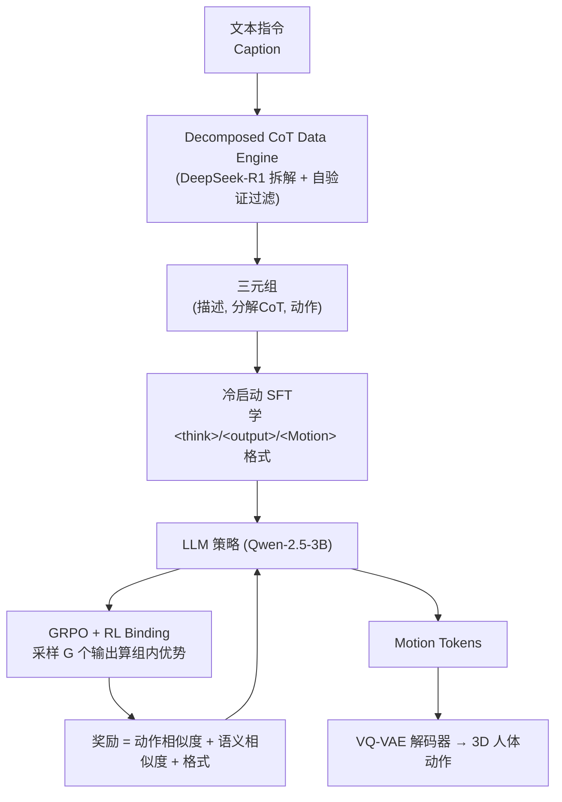

# Motion-R1: Enhancing Motion Generation with Decomposed Chain-of-Thought and RL Binding

**会议**: ICLR 2026  
**OpenReview**: [https://openreview.net/forum?id=eXXsUer975](https://openreview.net/forum?id=eXXsUer975)  
**项目主页**: [https://motion-r1.github.io/](https://motion-r1.github.io/)  
**领域**: 人体理解 / 文本到动作生成（Text-to-Motion）  
**关键词**: 文本到动作生成, 分解式思维链, 强化学习, GRPO, 多模态对齐, LLM  

## 一句话总结
Motion-R1 把"分解式思维链（Decomposed CoT）数据引擎"和"RL Binding"两件事拼在一起：前者用 LLM 把一句高层指令拆成有时序/因果关系的子动作链条，喂给 LLM 做冷启动 SFT；后者用 GRPO 把"动作相似度 + 语义相似度 + 格式"直接做成奖励，不再依赖昂贵的人工偏好标注，从而生成既符合语义又流畅真实的 3D 人体动作。

## 研究背景与动机
**领域现状**：文本到动作（Text-to-Motion, T2M）是人机交互的基础任务，把自然语言描述合成为逼真的人体动作。近年主流路线是把动作离散成 token（VQ-VAE）再接 LLM/扩散模型生成（如 T2M-GPT、MotionGPT、MoMask、MotionLLM），也有工作引入 RL（MotionRL、MotionCritic）来对齐人类偏好、提升动作质量。

**现有痛点**：作者点出两个具体矛盾。其一，绝大多数方法是**端到端监督学习**，直接把文本映射成动作序列，捕捉不到语言里更深的时序和因果关系——例如"泡一杯咖啡"其实隐含了"伸手→抓握→倾倒→搅拌→放下"一连串有先后顺序的子动作，端到端模型往往把它压扁成过度简化或不连贯的动作。其二，**现有 RL 方法过度复杂、过度工程化**：它们普遍要先用人工标注训练一个偏好/奖励模型，成本高、难以扩展和部署到多样化的动作任务上。

**核心矛盾**：语言天然带有层级化的时序与因果结构，而动作生成模型既缺乏显式的中间推理来对齐这种结构，又被昂贵的奖励工程拖累了可扩展性。

**本文目标**：用一个统一框架同时解决"推理缺失"和"奖励昂贵"两件事，在不增加人工标注的前提下提升动作的质量、可解释性和泛化能力。

**核心 idea**：**【显式推理 + 廉价对齐】** 用分解式 CoT 把指令拆成可解释的动作规划路径做冷启动，再用把多模态对齐直接塞进奖励函数的 RL Binding（基于 GRPO）做精炼，绕开偏好模型这个昂贵中间件。

## 方法详解

### 整体框架
Motion-R1 由两个核心组件构成——一个预训练的**动作分词器**（VQ-VAE，把连续动作序列离散成 motion token 并能解码回平滑轨迹）和一个具备**动作导向推理能力的 LLM**（backbone 用 Qwen-2.5-3B-Instruct）。训练分两阶段：第一阶段用 Decomposed CoT Data Engine 合成 `(描述, 分解CoT, 动作)` 三元组，对 LLM 做冷启动 SFT，让它学会输出 `<think>/<output>/<Motion>` 格式的推理增强结果；第二阶段用 RL Binding（GRPO）把多模态对齐嵌入奖励，进一步精炼策略。

### 关键设计

**1. 动作分词器（Motion Tokenizer）：把动作变成 LLM 能吞的离散符号** 由于动作数据在结构和模态上和自然语言差异巨大，作者沿用 VQ-VAE 把连续动作搬进 LLM 的符号空间。编码器 $E$ 把输入动作序列 $m_{1:T}\in\mathbb{R}^{T\times D}$ 映射成隐表示 $z_{1:(T/l)}$（$l$ 是时间下采样率），再用可学习码本 $C=\{c_n\}_{n=1}^{N}$ 做最近邻量化 $\hat{z}_i=\arg\min_{c_n\in C}\lVert z_i-c_n\rVert_2$，解码器 $D$ 重建出 $\hat{m}_{1:T}$。训练用重建损失、码本承诺损失、嵌入损失的复合目标 $L_{vq}=L_{reconstruct}+L_{commit}+L_{embed}$，其中重建项带速度正则的平滑 L1 以提升流畅度，并用 EMA 码本更新和码本 reset 稳定训练。这一步是后续"用 LLM 生成动作"的前提。

**2. 分解式 CoT 数据引擎：用 LLM 自动造出可解释的推理监督** 这是解决"推理缺失"的核心。引擎用精心设计的 prompt（含明确指令、输出格式约束、in-context 示例）让 LLM 把自由形式的动作描述拆成**遵守时序依赖和动作语义、逻辑有序的子动作链**。例如"一个人打太极"会被识别出主动作，再拆成"站立→手臂动作→重心转移→手部定位"等子动作，并对每个子动作补上运动方向、涉及身体部位等细节。生成的 CoT 轨迹还要过一道**自验证质量控制**：用 DeepSeek-R1 逐条评估相关性、逻辑一致性、简洁度，凡是冗余、过度思考、啰嗦的轨迹一律被过滤并重新生成，直到达标。每条合格 CoT 和其原始描述、对应动作序列配成三元组，作为冷启动监督。这样既蒸馏出结构化的动作规划能力，又大幅减少人工标注。

**3. 冷启动训练：为什么不能纯 RL 直接练** 作者先尝试了 DeepSeek-R1-Zero 那种纯靠奖励信号端到端 RL 来诱导推理+生成，结果训练极不稳定——模型经常产不出连贯推理或合法 motion token。原因有二：动作生成需要的是**长而结构化的序列**而非短符号输出；motion token 是新引入的符号，嵌入训练不充分、跨不过模态鸿沟。因此先用上一步的三元组做 SFT 冷启动，把模型 bootstrap 到"能产结构化推理 + 合法动作"的状态，给后续 RL 一个稳定起点。这个设计动机直接来自失败实验，很有说服力。

**4. RL Binding：把多模态对齐直接做成奖励，绕开偏好模型** 这是解决"奖励昂贵"的核心。它基于 GRPO：对每个 prompt $q$ 从旧策略采样一组 $G$ 个输出，各自打一个标量奖励 $r=\{r_1,\dots,r_G\}$，用组内归一化优势 $\hat{A}_i=\frac{r_i-\text{mean}(r)}{\text{std}(r)}$ 做裁剪目标加 KL 正则的策略更新：

$$J_{GRPO}(\theta)=\mathbb{E}\left[\frac{1}{G}\sum_{i=1}^{G}\min\left(\frac{\pi_\theta(o_i|q)}{\pi_{old}(o_i|q)}\hat{A}_i,\ \text{clip}\left(\frac{\pi_\theta(o_i|q)}{\pi_{old}(o_i|q)},1-\varepsilon,1+\varepsilon\right)\hat{A}_i\right)-\beta\, D_{KL}(\pi_\theta\Vert\pi_{ref})\right]$$

奖励由三部分组成，全部无需人工标注：**格式奖励** $r_{format}$ 用正则检查输出是否严格符合 `<think>{CoT}</think><Motion>{tokens}</Motion>`，符合给 1 否则 0；**动作相似度奖励** $r_{motion}=\frac{f_{motion}(\hat{m})\cdot f_{motion}(m)}{\lVert f_{motion}(\hat{m})\rVert_2\,\lVert f_{motion}(m)\rVert_2}$，用预训练动作编码器算生成动作和 GT 动作的余弦相似度，保证时空一致；**语义相似度奖励** $r_{semantic}=\frac{f_{motion}(\hat{m})\cdot f_{text}(T)}{\lVert f_{motion}(\hat{m})\rVert_2\,\lVert f_{text}(T)\rVert_2}$，在共享隐空间里算动作嵌入和文本嵌入的对齐，保证语义忠实。三个奖励经组内偏好排序注入 GRPO，让模型同时被约束往"真实"和"忠实"两个方向走，整套优化流程简洁、可扩展。

## 实验关键数据

### 主实验表格
在 HumanML3D 与 KIT-ML 上对比 VAE 系与扩散系 SOTA（节选关键指标）：

| 数据集 | 方法 | R-Prec@3 ↑ | FID ↓ | MM-Dist ↓ | Diversity ↑ |
|---|---|---|---|---|---|
| HumanML3D | MoMask | 0.807 | **0.045** | 2.958 | 9.620 |
| HumanML3D | MotionLLM | 0.801 | 0.230 | 2.967 | 9.908 |
| HumanML3D | MotionGPT-2 | 0.782 | 0.191 | 3.080 | 9.860 |
| HumanML3D | **Motion-R1** | **0.818** | 0.201 | **2.854** | **10.026** |
| KIT-ML | MotionDiffuse | 0.739 | 1.954 | **2.958** | 11.100 |
| KIT-ML | T2M-GPT | 0.745 | 0.514 | 3.007 | 10.920 |
| KIT-ML | MotionLLM | 0.750 | 0.781 | 2.982 | 11.407 |
| KIT-ML | **Motion-R1** | **0.761** | **0.287** | 3.196 | 10.875 |

- HumanML3D 上 MM-Dist 取得最低 2.854（约 3.5% 提升），R-Prec@2/3 与 Diversity 均为表内最优；FID 0.201 与最强基线持平（MoMask 的 0.045 仍是 FID 第一，但其他维度被 Motion-R1 反超）。
- KIT-ML 上 R-Prec@1/2/3 与 FID **全部第一**，泛化到分布不同的数据集依然稳。
- 论文称在 BABEL 上 R-Prec、FID、MM-Dist、Diversity 全部 SOTA（详见附录）。

### 消融实验表格
在 HumanML3D 上逐组件消融（CoT / 语义奖励 $R_{sem}$ / 动作奖励 $R_{motion}$ / 自验证 / CoT 用哪个 LLM）：

| 配置 | R-Prec@1 ↑ | FID ↓ | MM-Dist ↓ |
|---|---|---|---|
| 仅 CoT | 0.340 | 0.530 | 4.216 |
| CoT + $R_{sem}$ | 0.482 | 0.297 | 2.963 |
| CoT + $R_{motion}$ | 0.483 | 0.281 | 2.947 |
| CoT + 两奖励（无自验证） | 0.489 | 0.234 | 3.127 |
| 全组件 + GPT-4o 造 CoT | 0.520 | 0.213 | 2.895 |
| **全组件 + DeepSeek-R1（完整）** | 0.515 | **0.201** | **2.854** |

### 关键发现
- **只用分解式 CoT 远不够**：仅 CoT 时 R-Prec@1 只有 0.340、FID 高达 0.530，加任意一个相似度奖励就能把 Top-1 拉到 0.48、FID 砍到 0.28 左右，说明 RL Binding 的对齐奖励是质量主力。
- **两个奖励互补**：语义奖励主攻文本对齐、动作奖励主攻时空真实，二者合一时整体最优。
- **自验证有效**：去掉自验证机制各项指标都退化，说明 CoT 数据质量控制不是摆设。
- **对 CoT 的 LLM 不挑食**：换成 GPT-4o 造 CoT 在部分指标（R-Prec@1=0.520）甚至更好，说明框架对 CoT 来源鲁棒。

## 亮点与洞察
- **把"推理"显式引入动作生成**：用 CoT 把语言里隐含的时序/因果结构外化成可解释的子动作链，直击端到端方法"压扁语言结构"的老问题，OOD 复杂/抽象指令（如"听到巨响后转身后退再靠近""打羽毛球发球"）上能清晰分离子动作。
- **奖励即对齐，省掉偏好模型**：把动作相似度 + 语义相似度 + 格式直接做成可计算奖励，绕开了 MotionRL/MotionCritic 那套要人工标注训偏好模型的昂贵流程，简洁且可扩展。
- **冷启动来自失败实验的诚实记录**：作者先试纯 RL 发现不稳定，再解释为什么（长序列 + 新符号嵌入不足），最后用 SFT 冷启动救场——这个动机链条比凭空设计更可信。

## 局限与展望
- **依赖外部强 LLM 造 CoT**：数据引擎靠 DeepSeek-R1/GPT-4o 生成并自验证推理轨迹，CoT 质量和成本受限于这些黑盒大模型，蒸馏链路长。
- **奖励依赖预训练编码器**：动作/语义相似度都用 Guo et al. (2022a) 的预训练编码器算余弦相似度，奖励上限和偏差被这些编码器的表征质量绑定。
- **FID 非全面第一**：HumanML3D 上 FID（0.201）仍不及 MoMask（0.045），纯分布保真度上还有差距，作者靠语义对齐与多样性维度扳回。
- **评测仍是标准 benchmark 指标**：长时序、多人交互、物理合理性等更难的场景未充分验证，OOD 优势主要靠可视化和用户研究佐证。

## 相关工作与启发
- **承接 LLM+动作 token 路线**：建立在 T2M-GPT、MotionGPT、MoMask、MotionLLM 等"VQ-VAE 离散化 + LLM 生成"的脉络上，把其中缺失的"显式推理"补上。
- **对照 RL-for-motion 工作**：MotionRL（PPO + 人类偏好）、MotionCritic（critic 偏好优化）、AToM（VLM 奖励）、ReinDiffuse、RLPF（物理反馈）等都需要额外标注或仿真，Motion-R1 用纯嵌入相似度奖励做了更轻量的替代。
- **方法论借鉴 DeepSeek-R1/GRPO**：冷启动 + GRPO 的范式直接从 LLM 推理领域迁移到动作生成，是"R1 范式跨模态外溢"的一个具体案例，对其他生成任务（音频、视频、机器人动作）引入廉价多模态奖励有借鉴意义。

## 评分
- **新颖性**: ⭐⭐⭐⭐ 把分解式 CoT + GRPO 的 R1 范式系统迁移到文本到动作生成，并用嵌入相似度奖励替掉偏好模型，组合新颖、动机清晰；单个组件（CoT、GRPO、VQ-VAE）均非首创。
- **实验充分度**: ⭐⭐⭐⭐ 三个 benchmark（HumanML3D/KIT-ML/BABEL）+ 细粒度消融（含自验证、CoT LLM 选择）+ OOD 可视化 + 用户研究，覆盖较全；但 BABEL 与用户研究放附录、物理合理性等难场景未深入。
- **写作质量**: ⭐⭐⭐⭐ 两大痛点—两大设计的对应关系清楚，冷启动动机来自失败实验讲得诚实，图 1/图 2 对比直观。
- **价值**: ⭐⭐⭐⭐ 给动作生成提供了一条"显式推理 + 廉价对齐"的可扩展路线，省掉偏好标注对落地友好，对把 R1 范式迁到其他多模态生成有参考价值。

<!-- RELATED:START -->

## 相关论文

- [\[ICLR 2026\] Motion-Aligned Word Embeddings for Text-to-Motion Generation](motion-aligned_word_embeddings_for_text-to-motion_generation.md)
- [\[CVPR 2026\] FaceCoT: Chain-of-Thought Reasoning in MLLMs for Face Anti-Spoofing](../../CVPR2026/human_understanding/facecot_cot_reasoning_face_anti_spoofing.md)
- [\[ICLR 2026\] SesaHand: Enhancing 3D Hand Reconstruction via Controllable Generation with Semantic and Structural Alignment](sesahand_enhancing_3d_hand_reconstruction_via_controllable_generation_with_seman.md)
- [\[AAAI 2026\] Facial-R1: Aligning Reasoning and Recognition for Facial Emotion Analysis](../../AAAI2026/human_understanding/facial-r1_aligning_reasoning_and_recognition_for_facial_emotion_analysis.md)
- [\[CVPR 2026\] MoBind: Motion Binding for Fine-Grained IMU-Video Pose Alignment](../../CVPR2026/human_understanding/mobind_motion_binding_for_fine-grained_imu-video_pose_alignment.md)

<!-- RELATED:END -->
