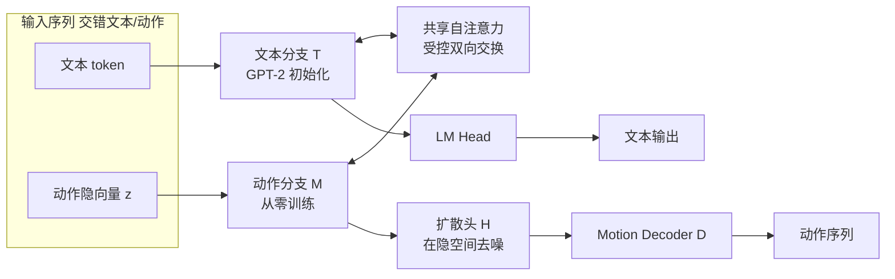

# MotionGPT3: Human Motion as a Second Modality

**会议**: ICLR 2026  
**arXiv**: 待确认（OpenReview: https://openreview.net/forum?id=Ha075JDMZR）  
**代码**: https://github.com/OpenMotionLab/MotionGPT3  
**领域**: 人体理解 / 动作-语言统一建模  
**关键词**: 人体动作生成, 动作-文本理解, 连续 VAE 隐空间, 双流 Transformer, 隐空间扩散, 多模态 LLM  

## 一句话总结
把人体动作当作"第二种模态"，用连续 VAE 隐空间替代离散 VQ token、用对称的动作分支 + 共享注意力替代单流骨干，再配一个挂在自回归 backbone 上的轻量扩散头，让一个统一模型同时做文本→动作生成和动作→文本理解，并且训练收敛快 2–4×。

## 研究背景与动机
- **领域现状**：多模态 LLM 想把"理解+生成"统一进一个 backbone，已经在图像/音频/视频上跑通。动作领域的主流做法是先用 VQ-VAE 把动作离散成 token，再塞进 Transformer，借 next-token prediction 复用文本那套训练/推理流水线。
- **现有痛点**：(1) **量化误差封顶**——把连续轨迹离散成码本索引会丢掉高频微动力学，破坏语义-物理一致性，RVQ、后训练 tokenization 都只能缓解、无法根除这种"数值-语义不连续"。(2) **单流串扰**——把离散文本和连续动作硬塞进同一条通路，多目标联合优化会产生梯度干扰、loss 尺度失配，超参敏感、训练不稳，甚至侵蚀语言能力（负迁移）。
- **核心矛盾**：动作的统计特性（连续、低维、强运动学先验）和语言模型的离散符号假设根本不兼容；既要尊重动作的连续本质，又要保住 LLM 的推理红利，二者在"单一共享表示"里很难两全。
- **本文目标**：造一个既避开量化瓶颈、又显式平衡多模态多目标训练的双模态动作-语言模型，统一支撑动作理解与生成。
- **核心 idea**：**【动作即第二模态】**——借鉴 Mixture-of-Transformers，给语言 backbone 配一条对称的动作分支，两条分支保留各自的 embedding/FFN/归一化，只在共享自注意力层里做受控的双向信息交换；**【连续隐空间 + 隐空间扩散】**——动作直接用预训练 VAE 编成连续隐向量，再用挂在 LLM hidden states 上的轻量扩散头在隐空间里去噪还原，把连续动作"接"进自回归框架。

## 方法详解

### 整体框架
MotionGPT3 由三块拼成：一个把动作压成连续隐向量的 **Motion VAE**、一个文本/动作各走一条道、只在共享注意力处交汇的 **双流 backbone**、以及一个把 LLM hidden states 翻译回动作隐向量的 **轻量扩散头**。文本分支用预训练 GPT-2 初始化，动作分支从零学起，靠三阶段"先生成再对齐"的训练把动作分支逐步对齐到语言分支。

### 关键设计

**1. 连续 VAE 隐表示替代离散 VQ token：题点在于"用平滑流形换掉码本"**。给定 N 帧动作序列 $m_{1:N}$，编码器 $\mathcal{E}$ 把它映成一个紧凑的连续隐向量 $z \in \mathbb{R}^d$，解码器 $\mathcal{D}$ 负责重建 $m = \mathcal{D}(\mathcal{E}(m))$。VAE 一次性用重建损失（可含 pose/velocity 的运动学项）加 KL 正则训好，KL 项压低隐向量方差、催出一个平滑流形，相邻隐点对应渐变的动作。这样隐空间里全是实值向量而非码本索引，既感知上贴合原轨迹、又数值上紧凑，从根上躲开了量化伪影、保住了高频微动力学——这正是 VQ 路线封顶的地方。

**2. 双流 backbone + 共享注意力做受控交互：题点在于"分而治之地路由两种模态"**。输入序列 $S = s_{1:k}$ 的每个元素要么是文本 embedding $\tau_i$、要么是动作隐向量 $z_i$，由路由指示 $\vartheta_i \in \{0,1\}$ 分派到文本分支 $\mathcal{T}$ 或动作分支 $\mathcal{M}$。两条分支各算各的 hidden states $h_t, h_m$，再按原始顺序重新拼回去喂进共享自注意力层，让信息只在注意力处交汇而不坍缩成单一 embedding 空间。因为连续隐向量没有词表/码本，文本那套 index-to-embedding 查表和 softmax 解码用不了，所以额外配了三组接口：往词表里加 `<som>/<eom>/<motion_in>/<motion_out>` 这类边界/占位 token 标出动作片段，用 Motion Understanding Head 把动作隐向量线性映进 Transformer 输入空间（供 captioning/预测），用 Motion Generation Head 经扩散把 hidden states 投回 VAE 隐空间。这种结构让动作分支能学自己的运动学归纳偏置，把单流里的梯度干扰摁下去。

**3. 自回归 backbone 里的隐空间扩散头：题点在于"用扩散补上连续与离散的缝"**。LLM 的自回归 + 交叉熵天生假设离散 token 目标，对连续动作隐向量水土不服。于是挂一个轻量扩散模块 $\mathcal{H}$ 直接从 backbone 的 hidden states 预测动作隐向量。训练时对真值隐向量 $z_0 = \mathcal{E}(x)$ 做固定前向加噪 $z_t = \sqrt{\bar\alpha_t}\, z_0 + \sqrt{1-\bar\alpha_t}\,\epsilon$，时序去噪器 $\mathcal{H}$ 以动作流 hidden states $h_m$ 为条件，按标准 DDPM 目标 $L_{\text{diff}} = \mathbb{E}_{z_0,t,\epsilon}\big[\|\epsilon - \mathcal{H}(z_t, t, h_m)\|_2^2\big]$ 学反向过程。推理时文本分支自回归生成到吐出 `<som>`，随即插入 $K$ 个 `<motion_out>` 占位 token，一次前向取出对齐的 hidden states，扩散头条件采样出干净隐向量 $\hat z_0$，再由 VAE 解码成动作，最后拼上 `<eom>` 回到文本流续写。因为只在低维隐空间里跑一个小专家，扩散头训练/推理几乎不加开销。

**4. "先生成再对齐"的三阶段训练：题点在于"分阶段把从零的动作分支拽进语言空间"**。Stage I（Uni-task 预训练）冻住文本分支，只在文本→动作上用扩散监督动作分支，给它一个稳定的语言条件和动作专属初始化；Stage II（跨模态对齐）仍冻文本分支，引入 T2M / M2T / 动作预测等多任务（以指令式 prompt 覆盖生成、captioning、预测、inbetweening），在不强行共享表示的前提下做双向对齐；Stage III（联合微调）解冻全部参数，在配对文本-动作数据（可选混入纯文本 prompt）上做指令微调，进一步稳住语言能力。消融显示这个"generate-then-align"次序很关键——去掉 Stage I 会让 M2T 基本不变但 T2M 明显塌掉。

## 实验关键数据

数据集为 HumanML3D 与 KIT-ML，采用 263 维 pose 表示。模型规模约 238M（文本分支 124M GPT-2 + 动作分支从零），仅用 2 张 RTX 3090 训练。

### 主实验表格

文本→动作生成（HumanML3D，→ 表示越接近 Real 越好）：

| 类型 | 方法 | R@3↑ | FID↓ | MMDist↓ | Diversity→ |
|------|------|------|------|---------|-----------|
| Real | - | 0.797 | 0.002 | 2.974 | 9.503 |
| 仅生成 | MoMask | 0.807 | **0.045** | 2.958 | 9.620 |
| 仅生成 | **MotionGPT3†** | **0.826** | 0.239 | **2.797** | 9.688 |
| 生成+理解 | MoTe | 0.825 | 0.075 | 2.867 | - |
| 生成+理解 | **MotionGPT3**（统一） | **0.837** | 0.208 | **2.725** | 9.700 |

动作→文本理解（HumanML3D captioning）：

| 方法 | R@3↑ | MMDist↓ | Bleu@4↑ | Rouge↑ | Cider↑ | BertScore↑ |
|------|------|---------|---------|--------|--------|-----------|
| MoTe | **0.871** | 2.649 | 11.15 | 37.4 | **31.5** | 30.3 |
| MotionGPT3† | 0.853 | 2.524 | 17.661 | 44.997 | 30.980 | **35.850** |
| **MotionGPT3**（统一） | 0.864 | **2.426** | **19.412** | **46.173** | 28.721 | 35.231 |

理解侧的语言指标（Bleu/Rouge）大幅领先，MMDist 也最低，说明双流对齐在动作-语言语义层贴得更紧。

### 消融实验表格

组件消融（HumanML3D，交叉"架构 × 表示"四个变体）：

| 配置 | T2M R@3↑ | T2M FID↓ | M2T R@3↑ | M2T BertScore↑ |
|------|----------|----------|----------|----------------|
| Unified+VQ | 0.435 | 0.403 | - | - |
| Unified+VAE | 0.792 | 0.489 | 0.426 | 16.197 |
| Bimodal+VQ | 0.532 | 0.454 | 0.702 | 18.085 |
| **Bimodal+VAE**（本文） | **0.826** | **0.239** | **0.853** | **35.850** |

任务依赖的敏感性很有意思：换成 Bimodal 主要利好 M2T（缓解串扰、对齐语义），换成 VAE 主要利好 T2M（去量化损失、提升合成保真）。

训练阶段消融（HumanML3D）：

| Stage I | Stage II | Stage III | T2M R@3↑ | T2M FID↓ | M2T R@1↑ |
|:---:|:---:|:---:|------|------|------|
| ✔ | | | 0.826 | 0.239 | - |
| ✔ | ✔ | | 0.831 | 0.215 | 0.571 |
| ✔ | ✔ | ✔ | **0.837** | **0.208** | 0.573 |
| | ✔ | ✔ | 0.772 | 0.325 | 0.573 |

### 关键发现
- **VQ 路线质量封顶**：VQ 基线 R@3 早早冲到 ≈0.5 就饱和，明显逊于 VAE 变体——量化信息损失是硬天花板。
- **双流加速优化**：相比单流，双流让扩散 loss 收敛快约 2×；在同等 loss（≈0.22）下双流仍有更高 R@3、更低 MMDist，即"同样训练状态、质量更好"。整体训练 loss 快 2×、验证收敛快达 4×，训练时间省约 2–3×。
- **CMA 层数非单调**：跨模态注意力放在最后 L 层，L 从 2 加到 5 持续变好，L=6 时 R-Precision 略降——"靠后但非全程"的 CMA 更优。
- **Stage I 不可省**：去掉文本→动作预训练，M2T 基本不变但 T2M 显著退化，说明动作专属初始化是 T2M 的关键。

## 亮点与洞察
- **把"动作即语言"的隐喻拆穿**：作者点出离散化把动作当符号处理，掩盖了符号序列与连续轨迹的鸿沟；用连续 VAE 隐空间直接对接 LLM，是对这一思路的清晰反拨。
- **"分而治之"反直觉但有效**：常识觉得共享空间能让模态"更近"，实验却显示单流耦合反而纠缠模态结构、产生负迁移；保留模态专属通路 + 只在注意力处交互，效率-保真权衡更好。
- **小成本可复现**：238M 参数、2 张 3090 就拿到 SOTA，对动作-语言研究的算力门槛友好。
- **扩散头当"翻译器"**：在低维隐空间跑小扩散专家，把连续生成接进 next-token 框架，几乎零额外开销，是连接两套范式的轻巧黏合剂。

## 局限与展望
- **细粒度控制会失手**：方向类线索（如左/右）容易出错。
- **单隐向量限制组合性**：当前 VAE 每条序列只产一个隐向量，长动作的片段级组合、局部语义对齐没有显式支持。
- **域外泛化受数据覆盖约束**：对 out-of-domain 描述的泛化有限。
- **展望**：在最后对齐阶段混入更多纯文本语料、换更强语言 backbone、探索层级/分段隐表示以支持组合控制和长时程生成，以及扩到更大更多样的数据上验证效率与鲁棒性。

## 相关工作与启发
- **Mixture-of-Transformers (MoT)**：本文双流架构的直接来源——模态专属 Transformer 专家 + 共享注意力耦合，既模块化训练又减少新模态引入时的干扰。
- **MLD / MotionGPT**：连续 VAE 隐空间扩散（MLD）与"动作即语言"的离散 token 统一模型（MotionGPT）分别是表示侧和架构侧的前作，本文把二者的优点重新组合。
- **Chameleon / Transfusion / Show-o / Janus / NExT-GPT**：视觉-语言统一模型的各种单流/适配器方案，作者借它们论证单流串扰的普遍性，反衬多流路由的价值。
- **启发**：当一种新模态的统计特性与文本差异很大时，"保留模态专属通路 + 只在注意力处受控交互 + 用小扩散头接回连续生成"是个可迁移的统一范式，对音频、点云等连续模态接入 LLM 都有参考意义。

## 评分
- **新颖性**: ⭐⭐⭐⭐ 把连续 VAE 隐空间、MoT 双流、隐空间扩散头三者组合进统一动作-语言模型，单个组件多有前作，但"动作即第二模态"的整体框架与三阶段训练有清晰创新。
- **实验充分度**: ⭐⭐⭐⭐ 在 HumanML3D/KIT-ML 上 T2M 与 M2T 双任务对比 + 架构×表示四象限消融 + CMA 层数 + 训练阶段消融，训练动态曲线也做了，较全面；但仅两个数据集、规模偏小。
- **写作质量**: ⭐⭐⭐⭐ 动机推导清晰、图示到位，论点（量化封顶/单流串扰）有曲线和消融支撑；个别表述与拼写略粗糙。
- **价值**: ⭐⭐⭐⭐ 给动作-语言统一建模提供了一条避开量化、低算力、训练高效的实用路线，开源代码 + 2 卡可复现，落地与后续研究价值都不错。

<!-- RELATED:START -->

## 相关论文

- [\[ICLR 2026\] HUMOF: Human Motion Forecasting in Interactive Social Scenes](humof_human_motion_forecasting_in_interactive_social_scenes.md)
- [\[ICLR 2026\] KinemaDiff: Towards Diffusion for Coherent and Physically Plausible Human Motion Prediction](kinemadiff_towards_diffusion_for_coherent_and_physically_plausible_human_motion_.md)
- [\[ICLR 2026\] PulpMotion: Framing-Aware Multimodal Camera and Human Motion Generation](pulp_motion_framing-aware_multimodal_camera_and_human_motion_generation.md)
- [\[ICLR 2026\] Human-Object Interaction via Automatically Designed VLM-Guided Motion Policy](human-object_interaction_via_automatically_designed_vlm-guided_motion_policy.md)
- [\[ECCV 2024\] Towards Unified Representation of Invariant-Specific Features in Missing Modality Face Anti-Spoofing](../../ECCV2024/human_understanding/towards_unified_representation_of_invariant-specific_features_in_missing_modalit.md)

<!-- RELATED:END -->
