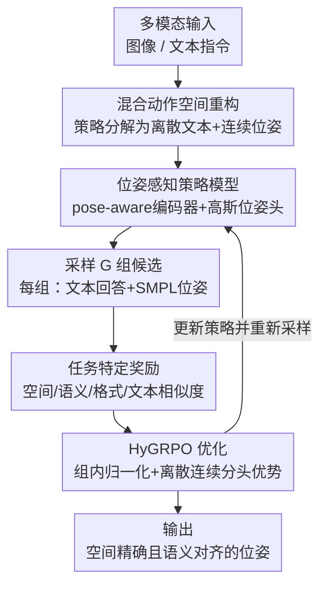

# Pose-RFT: Aligning MLLMs for 3D Pose Generation via Hybrid Action Reinforcement Fine-Tuning

**会议**: ICLR 2026  
**OpenReview**: [https://openreview.net/forum?id=ea1U1MgbdT](https://openreview.net/forum?id=ea1U1MgbdT)  
**代码**: 待确认  
**领域**: 多模态VLM / 3D人体姿态 / 强化微调  
**关键词**: 3D人体姿态生成, MLLM, 强化微调, 混合动作空间, SMPL

## 一句话总结
针对位姿专用 MLLM 在监督微调下被一对多歧义逼成"平均解"的对齐缺口，本文提出 Pose-RFT，把 3D 人体姿态生成重新表述为「离散文本 + 连续位姿」的混合动作强化学习问题，用 HyGRPO 算法分头优化两类输出、再配 4 个任务特定奖励，在多个姿态基准上显著超过现有位姿 MLLM。

## 研究背景与动机
**领域现状**：把 3D 人体姿态（通常用 SMPL 参数表示）从图像或文本生成出来，是近年的活跃方向。位姿专用的多模态大模型（pose-specific MLLM，如 ChatPose、UniPose）通过给通用 LLM 接一个位姿解码头，让模型能联合推理语言、视觉和 3D 姿态，展现了不错的潜力。这类模型的标准训练范式是监督微调（SFT）。

**现有痛点**：3D 姿态生成天生是「一对多」的。文本到姿态里，一句"跳舞、单腿站立"可以对应一大片合理姿态；图像到姿态里，同一张 2D 图像在透视歧义下也对应多个合理的 3D 姿态——这是经典的病态（ill-posed）问题。而 SFT 用回归 loss 去拟合每个样本唯一的 ground truth，本质上是在学一个确定性映射，与这种一对多分布根本不匹配。

**核心矛盾**：为了在整个数据集上最小化期望误差，SFT 模型会被逼着去预测一个「平均化」的、往往次优的输出。这就在模型预测与真正想要的目标（语义一致性、空间精度）之间，撕开了一道**对齐缺口（alignment gap）**：模型不是不会，而是被训练目标按到了分布的中心。

**本文目标**：把学习范式从"监督模仿"换成"奖励驱动优化"，让模型直接朝着语义/空间对齐的高奖励输出走，从而闭合这道缺口。

**切入角度**：强化学习（RL）天然适合用奖励信号去逼近任务目标。但现有的强化微调（RFT）算法几乎都是为语言的离散 token 空间设计的，根本处理不了 3D 姿态这种细粒度连续参数。

**核心 idea**：把姿态生成显式建成一个**混合动作空间**——策略要同时产出离散动作（文本 token）和连续动作（3D 位姿参数）——并设计一个能在这个混合空间里稳定优化的 RL 算法（HyGRPO），配上任务特定奖励来驱动对齐。

## 方法详解

### 整体框架
Pose-RFT 的目标是把一个位姿专用 MLLM 从"被监督模仿出来的平均解"推进到"被奖励驱动出来的高奖励解"。整条流程是一个在线 RL 循环：给定多模态输入（图像或文本指令），模型作为**混合策略**采样出 $G$ 组候选输出，每组都是「一段文本回答 + 一个 3D 位姿」；这些候选被一组任务特定奖励函数打分，再由 HyGRPO 算法把组内奖励归一化成优势、分头更新离散与连续两个策略头，最终让模型偏向生成空间精确、语义对齐的姿态。

为了在采样前就有一个足够强的策略底座，模型在架构上做了两处增强：接入一个在姿态估计上预训练的 pose-aware ViT 编码器来抽取位姿相关视觉特征，并把连续位姿头建成一个可微的多元高斯分布头（输出均值和协方差），让随机采样和梯度优化都能进行。

### 关键设计

**1. 混合动作空间重构：把姿态生成建成「离散文本 + 连续位姿」的联合策略**

这一步直面前面的核心矛盾——位姿是连续的，而 RL/RFT 工具都是为离散 token 准备的。作者把整体策略写成联合分布并因式分解：

$$\pi_\theta(a, p \mid q) = \pi_\theta(a \mid q) \cdot \pi_\theta(p \mid q, a),$$

其中 $q$ 是多模态输入，$a$ 是离散文本回答，$p$ 是连续 3D 位姿参数。离散子策略 $\pi_\theta(a\mid q)$ 管文本，连续子策略 $\pi_\theta(p\mid q,a)$ 在给定输入和已生成文本的条件下管位姿。关键在于连续部分不再回归一个点估计，而是建成多元高斯：

$$\pi_\theta(p \mid q, a) = \mathcal{N}\big(p;\, \mu_\theta(q,a),\, \Sigma_\theta(q,a)\big),$$

均值 $\mu_\theta$ 和协方差 $\Sigma_\theta$ 都由位姿头预测。这么做的意义有两层：一是用协方差显式建模姿态的偶然不确定性（aleatoric uncertainty），正好对应一对多分布；二是可微高斯既能在训练时做随机采样（RL 探索的前提），又能做基于梯度的优化。这把"无法对连续姿态做 RL"这个拦路虎拆掉了。

**2. 位姿感知策略模型：给共享多模态嵌入空间补上位姿相关视觉特征**

光有混合策略还不够强，作者借助 MLLM 预训练建立的跨模态对齐，把离散和连续两个策略都搭在同一个「语言对齐的多模态嵌入空间」上。但通用 CLIP 编码器对细粒度姿态线索不敏感，于是额外引入一个**位姿感知编码器**——一个在姿态估计任务上预训练的 ViT（取自 HMR2.0），把它抽出的位姿相关特征与语言对齐嵌入融合，得到对 RL 更有信息量的状态空间。这一架构增强加上高斯概率建模，先把一个强 SFT 基线立起来，RFT 再在它之上提升。消融显示该编码器在图像到姿态任务上显著抬高空间奖励，但对文本到姿态的语义奖励帮助有限——这符合预期，因为它是视觉中心的模块，与文本输入对齐度低。

**3. HyGRPO：在混合动作空间里做组相对策略优化**

这是本文的核心算法，解决"怎么在同一个目标里同时、稳定地优化离散头和连续头"。对每个样本 $q$，先采样 $G$ 组候选 $\{a_i, p_i\}_{i=1}^{G}$，重要性权重按当前策略与参考策略之比计算，并自然地拆成离散、连续两段：

$$r_i(\theta) = \frac{\pi_\theta(a_i\mid q)}{\pi_{\text{ref}}(a_i\mid q)} \cdot \frac{\pi_\theta(p_i\mid q,a_i)}{\pi_{\text{ref}}(p_i\mid q,a_i)} = r_d(a_i\mid q)\cdot r_c(p_i\mid q,a_i).$$

另一处关键设计是把归一化优势 $\hat{A}$ 拆成离散优势 $\hat{F}(q,a)$（衡量文本回答质量）和连续优势 $\hat{\Delta}(q,a,p)$（衡量位姿质量）两块相加。最终目标沿用 PPO 的 clip 来保证稳定，对两部分分别做裁剪：

$$J_{\text{HyGRPO}} = \mathbb{E}\Big[\tfrac{1}{G}\sum_{i=1}^{G}\min(r_d\hat{F}_i, \text{clip}(r_d,1{-}\epsilon,1{+}\epsilon)\hat{F}_i) + \tfrac{1}{V}\sum_{i=1}^{V}\min(r_c\hat{\Delta}_i, \text{clip}(r_c,1{-}\epsilon,1{+}\epsilon)\hat{\Delta}_i) - \beta D_{\text{KL}}(\pi_\theta\|\pi_{\text{ref}})\Big].$$

注意离散部分对全部 $G$ 个候选归一化，连续部分只对**含有效位姿输出的子集 $V$** 归一化——因为不是每条采样都会吐出合法的 `<POSE>`。这种"分头给优势信号"的做法让文本头和位姿头各拿各的梯度，避免了把连续姿态硬塞进离散 RL 框架时的不稳定。消融里直接对比 GRPO（只支持离散动作）与 HyGRPO：GRPO 完全无法提升连续位姿质量，HyGRPO 则在空间/语义奖励上都持续上涨，证明混合动作设计是 RFT 在此任务成功的关键。

**4. 任务特定奖励：给混合输出的每个分量配一把"标尺"**

HyGRPO 靠奖励来导航，作者按"每个奖励只负责输出的一个分量"的原则设计了 4 个奖励，既管连续位姿（空间+语义），也管离散文本（格式+正确性），从而在学新位姿能力的同时保住原有对话能力。① **空间定位奖励**（图像到姿态）取关节误差的倒数 $R_{\text{joint}} = 1/\lVert J_{\text{pred}} - J_{\text{gt}}\rVert_2$，奖励预测关节与真值越近越好；② **语义对齐奖励**（文本到姿态）用预训练的文本-位姿检索模型把两者映到共享空间，取余弦相似度 $R_{\text{semantic}} = \cos(\phi_t(q), \phi_p(p))$，强调高层语义匹配而非关节级精度；③ **格式奖励** $R_{\text{format}}$ 用正则匹配检查输出是否符合"The SMPL pose of this person is `<POSE>`."这类模板，符合给 1 否则 0；④ **文本嵌入相似度奖励** $R_{\text{text}} = \cos(E(a_{\text{pred}}), E(a_{\text{gt}}))$ 用 BGE-M3 编码器算生成答案与真值答案的余弦相似度，在做姿态微调时把通用 VQA 能力拽住。四个奖励分别对接图像/文本两条任务线与格式/对话两条约束，构成对混合输出的全面监督。

### 损失函数 / 训练策略
骨干用 LLaVA-1.5V-7B，位姿感知编码器用 HMR2.0 的预训练 ViT。训练参考 Visual-RFT 与 VLM-R1 的设置：预训练和微调阶段 CLIP 编码器与位姿感知编码器都冻结，只更新投影层（projector）和任务头，LLM 用 LoRA 微调。训练数据混合四类来源：文本-位姿（PoseScript）、图像-位姿（Human3.6M / MPI-INF-3DHP / COCO / MPII）、图像-文本（BEDLAM-Script）、以及 VQA（LLaVA-Instruct-150k）。

## 实验关键数据

### 主实验
图像到姿态（人体姿态估计，重建误差越低越好），在 3DPW / Human3.6M / RPE 上对比 MLLM 类方法：

| 方法 | 3DPW MPJPE↓ | 3DPW PA-MPJPE↓ | H3.6M MPJPE↓ | RPE MPJPE↓ | RPE PA-MPJPE↓ |
|------|------|------|------|------|------|
| ChatPose | 163.6 | 81.9 | 126.0 | 275.0 | 101.8 |
| UniPose | 94.7 | 59.1 | 69.2 | 213.4 | 94.1 |
| **Pose-RFT (Ours)** | **85.9** | **51.6** | **63.0** | **198.6** | **87.0** |

Pose-RFT 在所有 MLLM 类对比里领先；在需要视觉-语言推理的 RPE（Reasoning Pose Estimation）任务上刷新 SOTA——这正是专用判别模型做不到的场景。（注：传统专用模型如 HMR2.0 在标准重建上仍更低，作者承认这一差距。）

文本到姿态（PoseScript 检索 Recall@K，越高越好，取 K=5/10/20 概览）：

| 方法 | Full Retrieval R@5/10/20 (T2P) | Random Sampling R@5/10/20 (T2P) |
|------|------|------|
| ChatPose | 17.6 / 25.3 / 35.8 | 39.9 / 50.6 / 58.7 |
| UniPose | — | 73.7 / 82.4 / 89.6 |
| **Pose-RFT (Ours)** | **42.2 / 53.0 / 65.5** | 71.8 / 82.6 / 88.7 |

Pose-RFT 在多数指标上最佳，尤其 pose-to-text 方向（$R_{P2T}$）提升明显，作者归因于语义对齐奖励增强了细粒度文本-位姿对应。

### 消融实验
分布式建模 + RFT 的协同（3DPW + PoseScript-H2）：

| 配置 | Dist. | RFT | MPJPE↓ | PA-MPJPE↓ | mRecall T2P↑ | mRecall P2T↑ |
|------|------|------|------|------|------|------|
| Baseline | ✗ | ✗ | 90.4 | 57.1 | 36.2 | 41.5 |
| Baseline + Dist. | ✓ | ✗ | 91.4 | 59.2 | 37.4 | 42.0 |
| Baseline + Dist. + RFT | ✓ | ✓ | **85.9** | **51.6** | **53.6** | **57.6** |

### 关键发现
- **分布式头单独加几乎没用，必须配 RFT 才发威**：只加高斯分布头（Baseline + Dist.）相比确定性基线几乎没变化甚至略退，但一旦叠上 RFT，性能大幅跃升——说明概率建模的真正价值是给 RL 的奖励驱动探索铺路，二者是协同关系。
- **RFT 是涨点主力**：无论图 3 还是表 3，加上 RFT 在所有任务/指标上带来最大增益，验证了"从监督范式切到奖励驱动范式"对闭合对齐缺口的有效性。
- **HyGRPO 不可被 GRPO 替代**：把 HyGRPO 换成只支持离散动作的 GRPO，连续位姿质量完全不涨；HyGRPO 在空间/语义奖励曲线上都持续上升，证明混合动作算法才是成功的技术关键。
- **位姿感知编码器是视觉中心的**：它在图像到姿态上显著抬高空间奖励，但对文本到姿态的语义奖励帮助甚微——因为其特征与文本输入对齐度低。

## 亮点与洞察
- **把"病态/一对多"从缺陷重新框成可被 RL 利用的资源**：SFT 把一对多当噪声去平均，本文反过来用高斯协方差显式建不确定性、再用奖励去挑高质量解，视角转换很漂亮。
- **优势分解 + 分头归一化**很实用：离散对全 $G$ 归一化、连续只对有效位姿子集 $V$ 归一化，干净地处理了"采样不一定吐出合法位姿"这一现实问题，这个 trick 可迁移到任何"文本+结构化输出"的混合 RFT 场景。
- **四奖励的模块化分工**给了一个保住通用能力的范本：用 BGE-M3 文本相似度奖励当"锚"，让模型在专化姿态时不忘 VQA，这种"专化奖励 + 通用保持奖励"组合可复用到其他领域微调。

## 局限与展望
- 作者承认在标准重建基准上仍落后于传统专用模型（如 HMR2.0），MLLM 的优势主要体现在需要推理的 RPE 任务上——纯精度场景下尚无替代专用模型的理由。
- 位姿感知编码器对文本到姿态几乎无增益，视觉与文本两条线的特征融合还不够统一；语义奖励依赖外部预训练的文本-位姿检索模型，其质量会成为上限。
- HyGRPO 需要每样本采样 $G$ 组候选并跑奖励，训练成本与采样规模强相关；论文未充分讨论奖励超参（如各奖励权重、$\epsilon$、$\beta$）的敏感性。
- 改进方向：让位姿感知特征也参与文本对齐、用可学习/可验证的语义奖励替代固定检索模型、把混合动作 RFT 推广到手部/全身网格等更高维连续输出。

## 相关工作与启发
- **vs ChatPose / UniPose（SFT 类位姿 MLLM）**：它们靠 SFT + SMPL 参数回归，被一对多歧义逼向平均解；本文换成奖励驱动 RFT，直接优化空间/语义对齐，在 MLLM 类对比中全面领先。
- **vs GRPO（离散 RFT）**：GRPO 只能优化离散 token，对连续位姿无能为力；HyGRPO 通过策略因式分解 + 优势分解把连续头纳入同一目标，是本文相对通用 RFT 的核心增量。
- **vs 传统专用姿态估计（HMR2.0、TokenHMR 等）**：专用模型在标准重建精度上更强但不能做视觉-语言推理；Pose-RFT 牺牲一点纯精度，换来在推理型姿态估计（RPE）上的 SOTA 与统一的图像/文本双任务能力。

## 评分
- 新颖性: ⭐⭐⭐⭐⭐ 首个为 3D 人体姿态生成设计的混合动作 RFT 框架，把连续位姿纳入 GRPO 式优化的思路扎实
- 实验充分度: ⭐⭐⭐⭐ 图像/文本双任务 + 多基准 + 分布/RFT/HyGRPO 三组关键消融，但缺奖励超参敏感性分析
- 写作质量: ⭐⭐⭐⭐ 动机—矛盾—方法链条清晰，公式与消融对得上
- 价值: ⭐⭐⭐⭐ 为"文本+结构化连续输出"的混合 RFT 提供了可复用范式，对位姿/动作生成方向有启发

<!-- RELATED:START -->

## 相关论文

- [\[ICLR 2026\] EasyTune: Efficient Step-Aware Fine-Tuning for Diffusion-Based Motion Generation](easytune_efficient_step-aware_fine-tuning_for_diffusion-based_motion_generation.md)
- [\[ICLR 2026\] Pose Prior Learner: Unsupervised Categorical Prior Learning for Pose Estimation](pose_prior_learner_unsupervised_categorical_prior_learning_for_pose_estimation.md)
- [\[ICLR 2026\] From Sparse to Dense: Spatio-Temporal Fusion for Multi-View 3D Human Pose Estimation with DenseWarper](from_sparse_to_dense_spatio-temporal_fusion_for_multi-view_3d_human_pose_estimat.md)
- [\[CVPR 2026\] MoBind: Motion Binding for Fine-Grained IMU-Video Pose Alignment](../../CVPR2026/human_understanding/mobind_motion_binding_for_fine-grained_imu-video_pose_alignment.md)
- [\[ICLR 2026\] Cross-Domain Policy Optimization via Bellman Consistency and Hybrid Critics](cross-domain_policy_optimization_via_bellman_consistency_and_hybrid_critics.md)

<!-- RELATED:END -->
