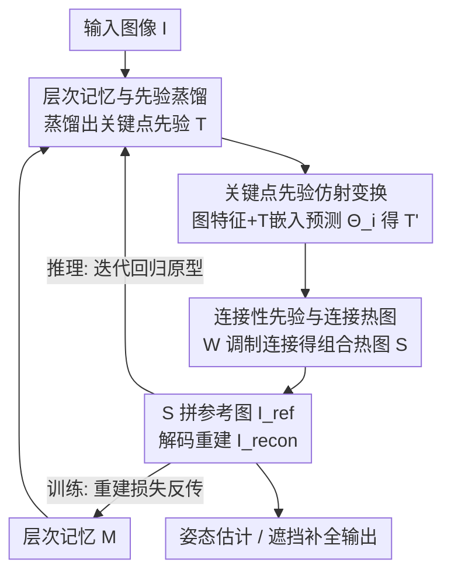

# Pose Prior Learner: Unsupervised Categorical Prior Learning for Pose Estimation

**会议**: ICLR 2026  
**OpenReview**: [https://openreview.net/forum?id=hPY2jwJzZ4](https://openreview.net/forum?id=hPY2jwJzZ4)  
**代码**: 有（论文称已公开，见 OpenReview 页 link）  
**领域**: 姿态估计 / 自监督学习 / 人体理解  
**关键词**: 类别级先验、无监督姿态估计、层次记忆、模板变换、迭代推理

## 一句话总结
本文提出 Pose Prior Learner（PPL），用一个层次记忆模块以纯自监督（图像重建）的方式，为某个物体类别"凭空"学出一套显式、可视化的姿态先验（关键点先验 + 连接性先验），再用它约束并迭代修正单张图像的姿态估计；在人体/动物多个数据集上超过手工先验和无先验的基线，且在重度遮挡下仍能补全成合理的全身姿态。

## 研究背景与动机

**领域现状**：无监督姿态估计想从大量无标注图像里学出关键点结构，主流靠"预测关键点 → 拼成物体结构 → 图像重建做监督"这条自监督路线。按是否用先验可分两派：一派完全不用先验（如 AutoLink、BKind），一派引入人工定义的类别姿态先验（如 STT 用预定义模板做仿射变换对齐）。

**现有痛点**：无先验的方法没有对关键点配置和连接关系的任何约束，容易把关键点落到背景的复杂纹理上，遮挡时还会预测出拓扑不合理的姿态；有先验的方法虽然能用类别级"标准姿态"做正则，但这个先验需要昂贵的人工标注（尤其新类别），而且人工标注会带进隐性偏见，未必最优——已有工作（HPE）就发现调整先验形状反而能涨点。

**核心矛盾**：先验对姿态估计确实有用，但"先验从哪来"本身没被很好回答——要么花大代价人工标，要么干脆不用、被背景带偏。把先验埋在网络权重里的隐式做法又不可解释、看不见、没法分析。

**本文目标**：把"无监督类别先验学习"正式定义成一个独立问题——能不能完全不靠人工标注，仅从图像里自监督地学出一个类别的通用姿态先验？并把姿态估计当作验证先验质量的试验台。具体拆成三问：先验怎么获得？能否从数据自监督地学？能否进一步提升先验质量？

**切入角度**：松散地受人类启发——人通过观察一类物体的多个个体形成对该类别的通用先验印象，再用它推断新个体的姿态。于是用一个层次记忆存一组"原型姿态"，从中蒸馏出通用先验，整个过程只用图像重建做监督。

**核心 idea**：用一个层次记忆把关键点配置的组合性部件存下来，从中蒸馏出**显式、符号化**的姿态先验（关键点先验 $T$ + 连接性先验 $W$），再以该先验为约束、通过仿射变换 + 图像重建估计个体姿态，并在推理时迭代地把估计姿态回归到记忆中的原型姿态，从而连遮挡场景都能补全。

## 方法详解

### 整体框架
PPL 把姿态建模成一张连接关键点的图：类别的通用姿态先验定义为 $V=(T,W)$，其中关键点先验 $T=[P_1,\dots,P_N]$ 是 $N$ 个归一化 2D 坐标（$P_i\in[-1,1]\times[-1,1]$），连接性先验 $W$ 是 $N\times N$ 矩阵，$w_{ij}$ 表示关键点 $i,j$ 之间物理相连的概率。$T$、$W$ 和层次记忆 $M$ 一开始都是随机初始化的可学习参数。

训练时整条管线是这样转的：先从层次记忆 $M$ 蒸馏出当前的关键点先验 $T$；把输入图像 $I$ 的特征和 $T$ 的嵌入拼在一起，预测每个关键点的仿射变换参数 $\Theta_i$，把 $T$ 变换成这张图专属的关键点 $T'$；再用连接性先验 $W$ 调制任意两点间的连接热图，max-pool 成组合连接热图 $S$；最后把 $S$ 和提供背景的参考图 $I_{ref}$ 拼起来送进解码器重建图像 $I_{recon}$，用重建质量反向监督整套姿态估计。推理时则额外跑一个迭代策略，反复用记忆把估计姿态回归到原型姿态、补全遮挡。

### 关键设计

**1. 层次记忆与关键点先验蒸馏：把"原型姿态"存成可拆解的组合部件，再凝练成通用先验**

这一步针对"先验从哪来、还要可解释"这个根本痛点。PPL 把记忆 $M$ 组织成 $m$ 个记忆库 $\{b_1,\dots,b_m\}$，每个库含 $k$ 个 $d$ 维可学习向量（实现里 $m{=}34$、$k{=}16$、$d{=}512$）。给定估计关键点 $T'$，先用若干 MLP-Mixer 块 $\mathrm{MIX}_{enc}$ 把它编码成 $m$ 个 token $G=[g_1,\dots,g_m]$，每个 token $g_i$ 落到对应记忆库 $b_i$ 的独立嵌入空间；检索时按 L2 距离从 $b_i$ 取最相似向量 $g'_i$，组成 $G'$，再由 $\mathrm{MIX}_{dec}$ 解回 $N$ 个关键点 $T'_{recon}$。蒸馏先验时则对每个库做均值池化 $\mathrm{MP}(b_i)$ 得到 $m$ 个池化向量，解码成关键点先验：$T=\mathrm{MIX}_{dec}([\mathrm{MP}(b_1),\dots,\mathrm{MP}(b_m)])$。

层次化（多库、各库独立空间）带来三点好处：容量随层数指数增长；把信息按库切开后在遮挡等不确定场景能更稳健地检索原型、用存下来的姿态对缺失部分给出合理假设；多级检索能逐步缩小搜索空间，每个库捕获更精细的子结构。和 PCT 把所有向量放在单一空间不同，PPL 让每个库捕获不同的姿态部件，才使"从记忆蒸馏出一个通用先验"成为可能。论文消融（单一大记忆库 vs 层次记忆）验证了层次设计的优势。

**2. 关键点先验的仿射变换：把"类别标准姿态"对齐到单张图像的个体姿态**

个体姿态可看作类别先验的几何变换，所以本设计要把通用的 $T$ 变成图像 $I$ 专属的 $T'$。先用一个从头训练的 2D-CNN 特征提取器 $\phi_{enc}$ 抽图像嵌入 $h_I=\phi_{enc}(I)$，再把 $T$ 经全连接层编码成 $h_T$；两者一起喂进两层全连接网络 $\mathrm{FC}(\cdot)$，为每个关键点预测一个仿射矩阵 $\Theta_i$：$[\Theta_1,\dots,\Theta_N]=\mathrm{FC}(h_I,h_T)$。$\Theta_i$ 含平移 $t_x^{(i)},t_y^{(i)}$ 和决定旋转/缩放/剪切的系数 $a^{(i)},b^{(i)},c^{(i)},d^{(i)}$，每个点按 $[P'_i,1]^\top=\Theta_i[P_i,1]^\top$ 变换得到 $T'$。把先验当"模板"、只学逐点仿射，等于用类别先验的形状/结构去约束和正则化每张图的姿态估计，而不是让网络在像素空间里自由乱猜关键点。

**3. 连接性先验与可微连接热图：用"哪两点该相连"的刚性约束抑制背景干扰**

物体的连接是相对固定刚性的（手经手臂连躯干、绝不直接连脚），这种刚性正好能正则化姿态。沿用 AutoLink 的思路，PPL 为任意两点 $P'_i,P'_j$ 生成可微连接热图 $S_{i,j}\in\mathbb{R}^{H\times W}$（连线上像素值高、其余近零），再用连接性先验 $W$ 的 $w_{i,j}$ 去调制每条连接，最后对全部 $N\times N$ 条热图做 max-pool 得到组合热图：$S=\max_{i,j}^{N\times N}(w_{i,j}S_{i,j})$。$w_{i,j}$ 决定两点是否物理相连——只有真正相连的点对才会在 $S$ 上激活对应连线。这样 $S$ 提供前景结构信息、$I_{ref}$ 提供背景，拼接后送 2D-CNN 解码器重建 $I_{recon}=\phi_{dec}(I_{ref},S)$，重建好坏反过来逼模型把姿态估准。消融发现：冻结随机连接性先验会让模型不收敛，而冻结随机关键点先验仍能勉强工作——说明连接性先验在引导姿态估计上比关键点先验更关键。

**4. 迭代推理：用记忆里的原型姿态把遮挡下的错误估计逐步"修回去"**

普通前馈在遮挡时会因视觉通路被破坏而崩，本设计利用记忆存的原型姿态做自回归式修正。推理时第 0 步用原图 $I$，之后每一步都把上一步重建出的 $I_{recon}$ 当输入，推出当前关键点 $T'$，再经层次记忆编码-检索-解码得到 $T'_{recon}$，配合**始终固定为原始（遮挡）图像**的参考图重建出下一步的 $I_{recon}$，每个实验跑 4 轮。论文给出三点直觉：单步修正抓不住复杂依赖、还可能引入新错误，而自回归逐步精修更准更一致；初始预测常含糊，迭代让模型每步吸收上下文线索消解不确定；迭代还促使模型在空间/时间上做结构化依赖推理，对遮挡和背景噪声更鲁棒。效果上，它能把部分遮挡的姿态恢复成合理的完整全身姿态，L2 误差逼近无遮挡水平（遮挡面积越小越明显）。

### 损失函数 / 训练策略
PPL 联合优化四项损失：
- **图像重建损失 $L_{ir}$**：用 ImageNet 预训练、冻结的 VGG19 抽特征做感知损失（语义一致而非逐像素），$L_{ir}=\lVert\psi(I_{recon})-\psi(I)\rVert_1$；消融显示像素级 MSE 不如感知损失。
- **边界损失 $L_b$**：惩罚变换后落到图像边界外的关键点（$|P'_{i,*}|>1$ 才计），能让姿态更准、收敛更快。
- **连接正则损失 $L_l$**：肢体长度近似刚性，鼓励变换前后连线长度不变，$L_l=\sum_{i,j}w_{i,j}\lVert l(P_i,P_j)-l(P'_i,P'_j)\rVert_1$（2D 近似 3D 刚性，主要为加速并稳定训练）。
- **关键点配置重建损失 $L_{kr}$**：因记忆检索 $G\to G'$ 不可微，约束检索向量和解码姿态都贴近原值，$L_{kr}=\lVert T'_{recon}-T'\rVert_2+\lVert G-G'\rVert_2$。

实现：Adam，学习率 $10^{-3}$，训 50 epoch；连接权重学习率放大 512 倍（应对 SoftPlus 近零处的小梯度）；连接粗细 $\sigma^2=5\times10^{-4}$；34 个记忆库 × 16 向量 × 512 维；batch size 64，单张 RTX A6000，结果 3 次平均。另用三种训练技巧稳定收敛（细节在附录 A2）。

## 实验关键数据

### 主实验
在视频数据集 Human3.6m、Taichi 和图像数据集 CUB-200-2011 上比较关键点检测（误差越低越好；Human3.6m/CUB 报归一化 L2，Taichi 报求和 L2）：

| 数据集 / 子集 | 指标 | PPL（本文） | 最强基线 | 说明 |
|--------|------|------|----------|------|
| Human3.6m (Res.128) | 归一化 L2 ↓ | **1.92** | AutoLink 2.76 | 大幅领先 |
| Human3.6m (Res.256) | 归一化 L2 ↓ | **2.56** | Jakab 2.73 | 全分辨率最优 |
| Taichi | 求和 L2 ↓ | **293.35** | AutoLink 316.10 | 最优 |
| CUB-Aligned | 归一化 L2 ↓ | **3.19** | GANSeg 3.23 | 最优 |
| CUB-All | 归一化 L2 ↓ | **10.5** | AutoLink 11.3 | 最优 |

PPL 在所有数据集、所有分辨率上都超过基线：用手工先验的 STT 反而不如 PPL（印证"预定义先验非最优"）；同样带可学连接先验的 AutoLink 因缺少层次记忆而落后。另外把视频帧当独立图像、用随机遮挡图当 $I_{ref}$ 训出的 PPL\* 仍超过 AutoLink，说明优势主要来自学到的先验而非跨帧时序一致性；PPL 还与依赖预训练文生图 Stable Diffusion 先验的 Hedlin et al. 打平，但模型小得多、仅用视觉模态。

### 消融实验
关键点/连接性先验的初始化（预定义 Pre / 随机 Rand / 从记忆 From Mem）与是否可学（✓/✗）在 Human3.6m（Res.256 归一化 L2）上的对比（节选）：

| 配置 | 关键点先验 | 连接性先验 | L2 ↓ | 说明 |
|------|------|------|------|------|
| Col 1 | Pre + 可学 | Pre + 可学 | **2.51** | 在人工先验上再精修，最优 |
| Col 4 | Pre + 冻结 | Pre + 冻结 | 2.70 | 纯冻结人工先验，最差之一 |
| Col 11（默认 PPL） | From Mem + 冻结 | Rand + 可学 | 2.56 | 不用任何人工先验也很强 |
| Col 7 | Rand + 可学 | Pre + 可学 | 2.68 | 随机初始化精修≈人工先验 |
| Col 9 | Rand + 可学 | Rand + 可学 | 2.75 | 全随机精修仍可用 |

### 关键发现
- **连接性先验比关键点先验更重要**：冻结随机关键点先验模型仍能跑出合理精度，但冻结随机连接性先验会直接不收敛。
- **人工先验非必需、且可被超越**：从记忆学出的默认 PPL（2.56）优于冻结人工先验（2.70）；而在人工先验上继续精修（2.51）又优于默认 PPL，说明 PPL 这套精修机制对人工先验也是增益。
- **记忆容量鲁棒**：每库向量数和维度变化时性能稳定，向量更多/维度更高略有提升，最终定为 16 向量 × 512 维。
- **关键点数量**：从 4 增到 16 持续涨点，32 个相比 16 个提升有限。
- **遮挡补全靠迭代**：iteration 0 时遮挡越大性能越差，但 3-4 轮迭代后能把遮挡姿态恢复成接近无遮挡的误差，遮挡面积越小效果越显著。

## 亮点与洞察
- **把"先验从哪来"做成显式可学问题**：先验不再埋在权重里，而是被蒸馏成符号化的关键点 + 连接矩阵，可视化、可分析——训练到 epoch 5 关键点先验就收敛成人形，连接先验随训练逐渐学出骨架、无关连线自动消退。
- **层次记忆 = 组合性 + 鲁棒检索**：多库独立空间既让容量指数增长，又天然支持"用原型补全遮挡"，是迭代推理能work的根基；这套"按库分管子结构"的思路可迁移到其他需要原型记忆的结构化预测任务。
- **"预定义先验不一定最优"被进一步坐实**：随机初始化 + 精修就能逼平人工先验，对依赖昂贵标注的姿态/结构任务是个解放性的结论。
- **先验可迁移**：附录显示学到的姿态先验还能用于图像识别等下游任务，暗示这类显式结构先验有更广用途。

## 局限与展望
- **动物等高变异类别更难**：作者承认狗的姿态质量明显低于人，因为品种/体型/毛发/姿态变异大；方法对高自由度、强外观变化类别还吃力。
- **2D 近似 3D 刚性**：连接正则只是在 2D 里近似肢体的 3D 刚性约束，主要为稳训练，未必精确刻画真实物理。
- **超参与固定迭代步数**：记忆库数、关键点数、固定 4 轮迭代等都是经验设定，未做自适应；遮挡较大时迭代收益也会衰减。
- **先验可解释但非"单原型对应单姿态"**：层次记忆是多库分布式表示，没有单个 prototype ↔ 完整姿态的一一对应，记忆内容本身不便直接可视化解读。
- **改进方向**：把刚性约束扩到 3D、对高变异类别引入更强外观解耦、让迭代步数/记忆容量随难度自适应，都是自然的下一步。

## 相关工作与启发
- **vs AutoLink**：两者都用可学连接性先验 + 连接热图重建，但 AutoLink 直接从图像预测关键点、易落到背景，缺少层次记忆与显式类别先验；PPL 多了从记忆蒸馏的姿态先验做约束，遮挡和复杂背景下更稳，主结果全面领先。
- **vs STT（Schmidtke et al.）**：STT 对**人工预定义**先验做仿射变换对齐，需要昂贵标注且先验未必最优；PPL 把先验本身从无标注图像里学出来，还反超手工先验。
- **vs BKind**：BKind 用两帧差分重建做监督，但对关键点配置和连接性无约束，可靠性受限；PPL 用学到的先验充当约束。
- **vs Hedlin et al.（Stable Diffusion 先验）**：对方借大预训练文生图模型当先验，PPL 仅用视觉模态、模型小得多却精度相当，说明类别先验不必依赖大模型外部知识。
- **vs 隐式结构先验方法（如 canonical-pose 类别级方法）**：它们把先验埋在权重里、不可解释，PPL 把先验显式抽出、可视化可examine，并能直接用于遮挡推理。

## 评分
- 新颖性: ⭐⭐⭐⭐⭐ 把"无监督类别先验学习"立成独立问题，并给出显式、可视化、可迁移的姿态先验，角度新。
- 实验充分度: ⭐⭐⭐⭐ 覆盖人/动物/花/手多类别 + 先验初始化与遮挡的细致消融，但部分对比放在附录、3D 与更大规模验证有限。
- 写作质量: ⭐⭐⭐⭐ 动机层层推进、图示清晰，符号偏多但基本自洽。
- 价值: ⭐⭐⭐⭐⭐ "先验可自监督学且超越人工先验"的结论对依赖标注的结构化估计任务很有启发。

<!-- RELATED:START -->

## 相关论文

- [\[CVPR 2026\] MGDHand: Multi-Granularity Prior-to-Inertial Distillation Framework for Sequential 3D Hand Pose Estimation from Sparse IMUs](../../CVPR2026/human_understanding/mgdhand_multi-granularity_prior-to-inertial_distillation_framework_for_sequentia.md)
- [\[CVPR 2026\] HamiPose: Hamiltonian Optimization for Unsupervised Domain Adaptive Pose Estimation](../../CVPR2026/human_understanding/hamipose_hamiltonian_optimization_for_unsupervised_domain_adaptive_pose_estimati.md)
- [\[NeurIPS 2025\] PandaPose: 3D Human Pose Lifting from a Single Image via Propagating 2D Pose Prior to 3D Anchor Space](../../NeurIPS2025/human_understanding/pandapose_3d_human_pose_lifting_from_a_single_image_via_propagating_2d_pose_prio.md)
- [\[ICLR 2026\] Zero-Shot Human Pose Estimation Using Diffusion-Based Inverse Solvers](zero-shot_human_pose_estimation_using_diffusion-based_inverse_solvers.md)
- [\[CVPR 2026\] Occluded Human Body Capture with Frequency Domain Denoising Prior](../../CVPR2026/human_understanding/occluded_human_body_capture_with_frequency_domain_denoising_prior.md)

<!-- RELATED:END -->
