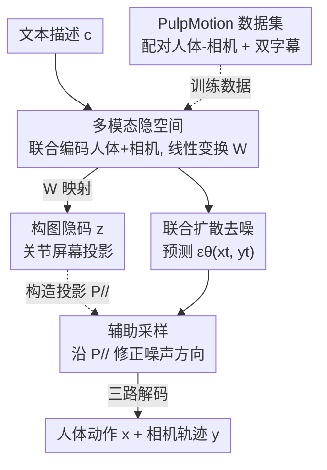

# PulpMotion: Framing-Aware Multimodal Camera and Human Motion Generation

**会议**: ICLR 2026  
**OpenReview**: [https://openreview.net/forum?id=RRbnVt9c8t](https://openreview.net/forum?id=RRbnVt9c8t)  
**代码**: 项目页（论文称 Code/models/data 已开源，具体地址见项目页）  
**领域**: 多模态生成 / 人体动作生成 / 相机轨迹生成 / 扩散模型  
**关键词**: 联合生成, 屏幕构图, 辅助采样, 多模态一致性, 电影摄影

## 一句话总结
本文首次把"人体动作 + 相机轨迹"做成文本条件下的**联合生成**任务，用一个模型无关的框架，引入"屏幕构图（人体关节投影到相机视野）"作为辅助模态作桥梁，在采样阶段把生成结果朝构图一致的方向推，从而让人物始终在画面里、构图更具电影感，并在 DiT 和 MAR 两种架构上都拿到了该任务的新 SOTA。

## 研究背景与动机
**领域现状**：人体动作生成和相机轨迹生成是两个各自繁荣的方向——前者用扩散模型从文本生成 SMPL 动作（MDM、MotionDiffuse、MAR 等），后者用学习方法从文本/示例视频生成相机运动（E.T.、DataDoP 等）。但这两条线几乎都是各做各的：要么只生成人体，要么只生成相机，最多把相机参数当成给定动作的约束/条件。

**现有痛点**：电影摄影的本质是演员表演和镜头调度在**屏幕空间**里的紧密配合——导演的镜头要追着演员构图，演员也要"等机位到了再动"。把两者拆开生成，就丢掉了这层耦合：动作和相机一旦不匹配，就会出现构图糟糕、人物站位别扭、甚至**人直接走出画面**（空镜）的情况。

**核心矛盾**：这本质是一个**多模态生成**问题——既要每个模态自身质量高，又要两个模态之间一致（coherent）。但人体动作（高维、几何结构复杂）和相机轨迹（低维、含内参）是两种异质模态，直接联合建模很难逼近真实联合分布；现有多模态生成方法要么只靠配对数据隐式学相关性（数据需求大、模式覆盖不全），要么靠精心设计的架构/算法显式强加相关性（不通用），要么要额外训练的判别器或外部预训练大模型（ImageBind、DINOv2）来引导（成本高、依赖外部数据）。

**本文目标**：在不改架构、不额外训练判别器、不依赖外部预训练模型的前提下，让联合生成的人体与相机在屏幕上"构图一致"。

**切入角度**：作者观察到，人体和相机之间存在一个天然的中间量——**屏幕构图 $z$**，即人体关节在相机视野中的 2D 投影。它由人体和相机共同决定，维度比两者拼起来低（$N_z < N_x + N_y$），却恰好刻画了"人在画面里怎么摆"这件电影里最关心的事。

**核心 idea**：用屏幕构图作为**辅助模态**搭桥，在采样阶段把生成朝"构图一致"的区域推——具体做法是学一个从人体/相机隐码到构图隐码的**线性变换**，再用这个线性关系在采样时加一个正交投影引导项，无需在训练或推理时显式条件化 $z$。

## 方法详解

### 整体框架
方法分两阶段。**阶段一（训练隐空间）**：一个联合自编码器把人体动作 $x_{raw}$ 和相机轨迹 $y_{raw}$ 编码进**共享隐空间**，得到隐码 $x,y$；再用一个轻量可学习的线性变换 $W$ 把它们映成构图隐码 $z=W[x,y]^\top$；三个独立解码器分别重建出人体、相机、构图三种原始模态。注意构图 $z$ 从不被直接编码，只通过 $W$ 和它的重建损失被间接学到。**阶段二（联合扩散 + 辅助采样）**：在这个隐空间里训练一个标准 DDPM 联合扩散模型，从文本 $c$ 生成 $(x,y)$；推理时，利用线性变换 $W$ 导出的正交投影 $P_{//}$，给模型预测的噪声加一个朝构图一致方向修正的辅助项，把采样从"不完美的联合分布"推向"有电影构图的联合分布"。整个方案模型无关——在 DiT 和 MAR 两种主干上都能即插即用。

### 关键设计

**1. 多模态隐空间与线性变换 W：让"屏幕构图"成为可计算的桥**

痛点是人体和相机异质、直接在原始空间联合生成既贵又不稳，且缺一个能联系两者的量。作者用一个联合自编码器把两个模态编进**同一个共享隐空间**（而不是各编各的），再加一个**可学习线性变换** $W\in\mathbb{R}^{(N_x+N_y)\times N_z}$，把人体、相机隐码线性地映成构图隐码：

$$z = W[x,y]^\top$$

三个解码器 $D_{\psi_x},D_{\psi_y},D_{\psi_z}$ 各自重建原始模态，端到端训练损失为：

$$\mathcal{L}_{AE} = \|D_{\psi_x}(E_\phi(x_{raw},y_{raw})) - x_{raw}\|^2 + \|D_{\psi_y}(\cdot) - y_{raw}\|^2 + \|D_{\psi_z}(W E_\phi(\cdot)) - z_{raw}\|^2$$

关键在于"线性"二字：因为 $z$ 是 $[x,y]$ 的线性函数，后面采样阶段才能用一个干净的**正交投影**把噪声分解、做引导。这一步把"屏幕构图"从一个抽象概念变成了隐空间里可直接计算、可监督的量，是整个辅助采样能成立的前提。

**2. 辅助采样：用正交投影把采样推向构图一致的区域**

有了 $z=W u$（记 $u=[x,y]^\top$）这个线性关系，作者在推理时不显式条件化 $z$，而是借鉴 CFG 的拆分思想给采样加一个引导项。由于 $z$ 是 $u$ 的压缩表示（$N_z<N_x+N_y$），无法包含 $u$ 的全部信息，于是把 $u$ 正交分解为"由 $z$ 决定的分量 $u_{//}$"和"互补正交分量 $u_\perp$"：$u=u_\perp+u_{//}$，其中 $u_{//}=P_{//}u$，$P_{//}$ 是到 $\ker(W)$ 正交补空间的投影。论文证明密度可分解为 $p(u)=p(u_\perp)\,p(u_{//})$，并给出 $P_{//}=W(W^\top W)^{-1}W^\top$（$W^\top W$ 在本设定下可逆）。

利用 $\varepsilon(x)\propto\nabla_x\log p(x)$，最终的采样按下式做预测噪声的线性组合：

$$\varepsilon_\theta(x_t,y_t,c,t)=\varepsilon_\theta(x_t,y_t,\varnothing,t)+w_z P_{//}\,\varepsilon_\theta(x_t,y_t,\varnothing,t)+w_c\big(\varepsilon_\theta(x_t,y_t,c,t)-\varepsilon_\theta(x_t,y_t,\varnothing,t)\big)$$

其中 $w_z$ 控制构图引导强度、$w_c$ 是文本 CFG 权重。这里的巧妙之处：把构图引导写成对"无条件噪声"做 $P_{//}$ 投影并按 $w_z$ 加权，等价于把生成沿"与构图模态平行"的方向 $u_{//}$ 推强，从而提升多模态一致性。**因为最终采样并不显式以 $z_t$ 为条件，训练时根本不需要引入构图模态**，省训练成本、也让方法更通用、模型无关。

**3. PulpMotion 数据集：为联合任务补上"人+相机都好"的配对数据**

训练联合模型需要人体动作和相机轨迹的配对数据，但现有数据集大多只覆盖一侧（HumanML3D 只有人体、RealEstate10k 只有相机），唯一的配对集 E.T. 偏重相机、人体动作质量低且缺动作字幕，不适合训人体模型。作者据此构建 **PulpMotion**：用 TRAM 从 CondensedMovies 视频估计 3D 人体-相机姿态（比 E.T. 用的 SLAHMR 快得多，$\sim$1 fps vs <0.1 fps，质量也更高），保留 E.T. 流水线曾过滤掉的轨迹；人体字幕用 Qwen2.5-VL 按 HumanML3D 风格从视频+人物框生成，相机字幕沿用 E.T. 的标签→LLM 方法。针对 TRAM 常因局部观测（如只拍上半身的特写）产生的低质动作，作者加了一步**精修**：通过相机重投影检测出画面外的肢体，用 RePaint 编辑 + HumanML3D 预训练扩散模型把这些区域补全。最终 PulpMotion 同时具备相机轨迹/字幕、人体动作/字幕四类模态，193K 样本、314 小时，是同类里最大、序列也更长（中位 107 帧）。

### 损失函数 / 训练策略
自编码器用三模态重建损失 $\mathcal{L}_{AE}$ 端到端训练（人体 + 相机 + 构图，见上式）。联合扩散用标准 DDPM 噪声预测损失 $\mathcal{L}_{noise}(\theta)=\mathbb{E}_{t,\varepsilon_{xy}}\big[\|\varepsilon_{xy}-\varepsilon_\theta(x_t,y_t,c)\|^2\big]$。辅助采样只发生在推理阶段，训练时不引入构图模态 $z$。数据表示上：构图特征 $z_{raw}$ 用 9 个关键关节的 2D NDC 坐标（$\mathbb{R}^{F\times18}$）；人体特征 $\mathbb{R}^{F\times199}$、相机特征 $\mathbb{R}^{F\times14}$（含旋转 6D 表示、线速度、人-相机相对距离、视场角内参）。

## 实验关键数据

### 主实验
在 PulpMotion 的 mixed 子集上，对比 5 个基线：人体条件相机生成 (x)+DIRECTOR、独立生成 (x)(y)、双模态 (x,y)、三模态 (x,y,z)、ReDi，并在 DiT 与 MAR 两架构上评测。核心指标 FDframing（构图与参考分布的 Fréchet 距离，越低越好）和 Out-rate（9 个关节全部出画的帧占比，越低越好）。

| 架构 | 配置 | FDframing ↓ | Out-rate ↓ | TMR-Score ↑(人体) | CLaTr-Score ↑(相机) |
|------|------|------|------|------|------|
| DiT | (x)+DIRECTOR | 22.21 | 60.56 | - | 24.44 |
| DiT | (x)(y) | 11.21 | 48.02 | 23.50* | 46.74 |
| DiT | (x)(y)+Aux | **8.24** | **41.24** | - | 50.69 |
| DiT | (x,y) | 4.90 | 25.98 | 23.50 | 30.75 |
| DiT | (x,y)+Aux | **3.37** | **16.76** | **25.05** | **32.81** |
| DiT | ReDi | 5.57 | 28.99 | 22.48 | 22.73 |
| MAR | (x,y) | 8.51 | 40.75 | 21.68 | 42.84 |
| MAR | (x,y)+Aux | **6.42** | **33.65** | **24.46** | **45.96** |

（*独立基线人体分数对应其各自模型；标注仅示意趋势，以原文表格为准。）辅助采样在所有基线和两种架构上都系统性降低了 FDframing 和 Out-rate，且同时提升了人体（TMR-Score）和相机（CLaTr-Score）的文本对齐。仅靠人体条件化相机（(x)+DIRECTOR）远不够：DiT 下其 FDframing 22.21、Out-rate 60.56%，远差于 (x,y)+Aux 的 3.37 / 16.76%，说明联合建模 + 辅助采样的必要性。

### 消融实验
表 5 调辅助引导权重 $w_z$（DiT，mixed 子集）：

| $w_z$ | FDframing ↓ | Out-rate ↓ | TMR-Score ↑ | FDTMR ↓ |
|------|------|------|------|------|
| 0.00 | 4.90 | 25.98 | 23.50 | 372.61 |
| 0.25 | 3.37 | 16.76 | 25.05 | 431.54 |
| 0.50 | **3.09** | 11.99 | **25.30** | 493.53 |
| 0.75 | 3.37 | **9.66** | 24.99 | 548.60 |

数据精修也单独验证：Table 3 显示精修把人体动作 FDTMR 从 595.39 降到 447.69；Table 2 显示 VLM 字幕比 m2t 字幕的 TMR-Score 更高（8.06 vs 4.08）。

### 关键发现
- $w_z$ 越大，构图越好（FDframing/Out-rate 持续下降到 $w_z=0.5\!\sim\!0.75$），但单模态生成质量指标（FDTMR/FDCLaTr）会略升——存在"构图一致 ↔ 单模态保真"的权衡，作者认为对齐与构图的收益足以盖过这点轻微代价，$w_z\approx0.25\!\sim\!0.5$ 是较好折中。
- 辅助采样是**架构无关**的：DiT、MAR 上趋势一致，证明它是采样层面的通用技巧而非某主干专属。
- 数据侧两步（TRAM 替换 SLAHMR + RePaint 精修）显著提升人体动作质量，是联合任务能训起来的基础。

## 亮点与洞察
- **用"屏幕构图"当辅助模态**是最漂亮的一笔：它不是凭空造的桥，而是人-相机关系里本就存在、且电影里最被关心的量，低维又信息浓缩，天然适合做引导信号。
- **线性变换 + 正交投影**让引导项有闭式表达 $P_{//}=W(W^\top W)^{-1}W^\top$，把"多模态一致性"这种抽象目标变成采样时一行噪声修正，且训练完全不碰 $z$——省成本又通用。
- "不显式条件化辅助模态、却能用它引导"这套思路可迁移到其他多模态生成（视频-音频、图文等）：只要能找到一个由目标模态线性决定的中间量，就能复用这套正交投影辅助采样。

## 局限与展望
- 辅助采样会让单模态保真指标（FDTMR/FDCLaTr）轻微变差，说明"推构图一致"和"保各模态质量"之间仍有张力，$w_z$ 需要人工调。
- 桥模态 $z$ 必须是目标模态的**线性**函数才能用正交投影闭式分解；若真实关系高度非线性，这套近似可能失效。
- 数据来自电影片段（CondensedMovies）+ TRAM 估计 + RePaint 精修，人体动作质量受上游姿态估计上限制约，未达 mocap 级别。
- 评测全在 PulpMotion 自建集与自提构图指标（FDframing/Out-rate）上做，跨数据集泛化与指标外部效度有待验证。

## 相关工作与启发
- **vs (x)+DIRECTOR（两阶段人体条件相机）**: 它先生成人体再条件生成相机，本文联合生成两模态。区别在于前者只把生成的人体动作当条件，信息不足以保证好构图（FDframing 22.21 vs 本文 3.37），本文在采样时双向地把构图一致性注入两个模态。
- **vs ReDi / MMDisco / ImageBind 引导**: 这些靠额外训练判别器或外部预训练大模型（DINOv2、ImageBind）构造引导项，本文不依赖任何外部模型与训练适配，只用自身隐空间里学到的线性变换导出投影，更轻、更通用。
- **vs UniDiffuser / MMDiffusion 等架构派**: 它们靠改架构/注意力显式强加多模态相关性，本文只动采样、模型无关，可在 DiT 和 MAR 上即插即用。

## 评分
- 新颖性: ⭐⭐⭐⭐⭐ 首次把人体动作+相机做成文本条件联合生成，并用屏幕构图辅助模态 + 正交投影采样，角度新颖且自洽。
- 实验充分度: ⭐⭐⭐⭐ 跨 DiT/MAR、五基线、构图/人体/相机多维指标 + 数据消融，较完整；但仅在自建集与自提指标上评测。
- 写作质量: ⭐⭐⭐⭐ 动机—方法—公式推导链条清晰，图 1/2/3 帮助理解。
- 价值: ⭐⭐⭐⭐⭐ 既给出可迁移的辅助采样范式，又开源了同类最大的人-相机配对数据集，对电影 AI/虚拍方向价值高。

<!-- RELATED:START -->

## 相关论文

- [\[ICLR 2026\] EasyTune: Efficient Step-Aware Fine-Tuning for Diffusion-Based Motion Generation](easytune_efficient_step-aware_fine-tuning_for_diffusion-based_motion_generation.md)
- [\[ICCV 2025\] KinMo: Kinematic-Aware Human Motion Understanding and Generation](../../ICCV2025/human_understanding/kinmo_kinematic-aware_human_motion_understanding_and_generation.md)
- [\[ICLR 2026\] Motion-Aligned Word Embeddings for Text-to-Motion Generation](motion-aligned_word_embeddings_for_text-to-motion_generation.md)
- [\[CVPR 2026\] LAMP: Localization Aware Multi-camera People Tracking in Metric 3D World](../../CVPR2026/human_understanding/lamp_localization_aware_multi-camera_people_tracking_in_metric_3d_world.md)
- [\[AAAI 2026\] SOSControl: Enhancing Human Motion Generation through Saliency-Aware Symbolic Orientation and Timing Control](../../AAAI2026/human_understanding/soscontrol_enhancing_human_motion_generation_through_saliency-aware_symbolic_ori.md)

<!-- RELATED:END -->
