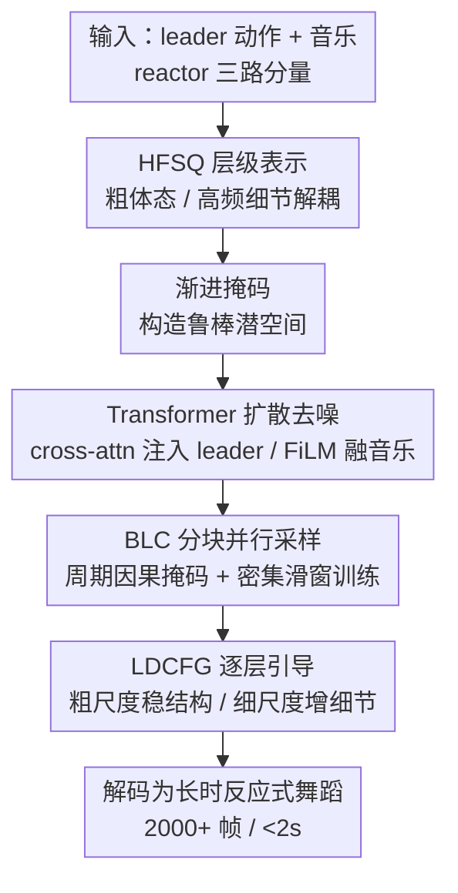

# ReactDance: Hierarchical Representation for High-Fidelity and Coherent Long-Form Reactive Dance Generation

**会议**: ICLR 2026  
**OpenReview**: [https://openreview.net/forum?id=FvMyAMbbX0](https://openreview.net/forum?id=FvMyAMbbX0)  
**论文**: [Project Page](https://ripemangobox.github.io/ReactDance)  
**代码**: 待确认  
**领域**: 人体动作生成 / 舞蹈生成  
**关键词**: 反应式舞蹈生成, 层级量化, 扩散模型, 长序列并行采样, 分类器自由引导

## 一句话总结
ReactDance 用一个层级有限标量量化（HFSQ）的多尺度运动表示，把"粗糙体态"与"高频细节"解耦，再配合非自回归的分块局部上下文（BLC）并行采样，能在 2 秒内生成超过 2000 帧（60 秒+）、高保真且长时连贯的"跟随者"反应式舞蹈。

## 研究背景与动机
**领域现状**：反应式舞蹈生成（Reactive Dance Generation, RDG）的目标是：给定一个领舞者（leader）的动作和背景音乐，自动合成一个跟舞者（reactor）的舞蹈，让两人既同步又有艺术张力。这在社交机器人、虚拟人、人机交互里都有应用。近年的双人舞方法已经在"双人同步"和"动作-音乐对齐"上有所进展，借助定制网络结构、物理约束或强化学习来做。

**现有痛点**：这些方法依赖的是整体性、高层次的约束，结果就是动作"同步但艺术上枯燥"——它们忽略了那些细微却决定性的局部动作（比如探戈里鞭子般甩出的 boleo）。同时，模型几乎都在短片段上训练（受限于学习长程依赖的算法复杂度和算力），这导致训练与推理之间存在固有的长度鸿沟，推理时误差不断累积，表现为时间漂移和同步崩溃。

**核心矛盾**：RDG 有两个互相纠缠的硬骨头——**细粒度空间交互**和**长时时间连贯性**。前者要求模型能同时把控全身大姿态和局部高频细节，而单一尺度的表示天然做不到独立控制；后者要求在远超训练窗口的长度上保持稳定，而自回归生成既慢又会累积误差。

**切入角度**：作者从舞蹈理论的两条结构原则出发：(1) **层级运动组合**——舞蹈表演天然是分层的，全身节奏提供粗结构，细粒度动态补充语义细节；(2) **模块化时间连贯**——长篇编舞靠把短而连贯的动作短语拼接、并保证平滑过渡来达成一致性。

**核心 idea**：用一个"粗到细"的层级潜空间替代扁平表示来解决空间细节问题，用"分块并行 + 训练时密集滑窗"替代自回归来解决长时连贯问题。

## 方法详解

### 整体框架
ReactDance 是一个两阶段的扩散框架。**第一阶段**：训练一个带 HFSQ 瓶颈的自编码器，把舞蹈动作编码成一个层级（多尺度、粗到细）的连续潜表示 $V$。**第二阶段**：训练一个 Transformer 扩散模型，在 leader 动作和音乐的条件下，去噪生成这个层级潜表示，再解码回最终动作。

具体地，reactor 的动作被拆成三路独立分量——上半身、下半身、以及与 leader 的相对根距离，每路走一条结构相同的 HFSQ 流；leader 动作通过 cross-attention 注入，音乐特征通过 FiLM 层融合。生成阶段用 **BLC** 把长时间线切成可并行的块，每一步去噪里再用 **LDCFG** 对不同尺度施加独立的引导强度。

### 关键设计

**1. HFSQ：层级有限标量量化，把粗体态和高频细节解耦**

针对"单尺度表示无法独立控制大姿态与局部细节"的痛点，作者设计了 HFSQ。它结合了 FSQ（有限标量量化）的稳定性与层级残差结构，避开了 VQ-VAE 常见的 codebook collapse。机制上分两步：先把编码器输出的特征 $v \in \mathbb{R}^{n \times d}$ 切成 $G$ 个并行组 $v=[v_1,\dots,v_G]$；每组再做 $R$ 级级联残差量化，令初始残差 $e_{g,1}=v_g$，逐级计算 $z_{g,r}=\mathrm{FSQ}_r(e_{g,r})$、$\hat{v}_{g,r}=\mathrm{Dequantize}(z_{g,r})$、$e_{g,r+1}=e_{g,r}-s_r\cdot\hat{v}_{g,r}$。所有层级的连续重建汇成层级表示 $V=\{\hat{v}_{g,r}\}_{g=1,r=1}^{G,R}$。

这个残差层级有个关键性质：它**按信号能量天然解耦语义**——基础层（$r=1$）最小化主重建误差，捕获粗运动（全局姿态、朝向、低频轨迹）；后续层（$r\ge 2$）编码残差，捕获细运动（高频局部动态、细微关节articulation）。相比 RVQ-VAE 的离散码本（相邻索引语义不连续，给扩散制造崎岖的优化地形），HFSQ 把动作投到固定标量网格上、保留序关系，提供一个更平滑的"扩散友好"流形——这正是消融里它生成 FIDg 远胜 RVQ-VAE（7.63 vs 26.98）的原因。作者发现只用两层残差（$R=2$）就够了。

**2. 渐进掩码：让层级表示真正解耦、解码器更鲁棒**

层级表示要想"各层独立"，光靠结构还不够。作者在训练时用两套互补的扰动来正则化潜空间 $V$。一是**残差掩码**：随机遮挡较高层的 FSQ 层、同时给基础层加缩放高斯噪声，逼着各层之间相互独立、不互相依赖；二是**码掩码**：随机遮掉单个 FSQ 码内部的维度，提升解码器对不完美输入的容忍度。消融显示，去掉渐进掩码虽然能换来 MPJPE 的微小改善，但真实感会大跌（FIDg 从 7.63 升到 10.46），说明它对高保真合成是关键的。

**3. BLC：分块局部上下文，非自回归并行生成长序列**

推理长度 $K$ 往往远超训练窗口 $T$，自回归既慢又累积误差。BLC 用两条互补原则解决：**块内一致性**靠采样协议——用块对角的**周期因果掩码**把注意力严格限制在大小为 $T$ 的非重叠块内，阻断块间信息泄漏与误差传播；再用**相位对齐位置编码** $P_i=\sin(\frac{\pi(i \bmod T)}{T})\oplus\cos(\frac{\pi(i \bmod T)}{T})$ 给每个块重置时间相位，使每个推理块都等价于一个与训练分布一致的独立良构窗口。

**块间连续性**则靠训练动力学——**密集滑窗（DSW）**：用远小于窗口的步长训练（$m\ll T$，如 $m=4, T=240$）。这让模型在每一个可能的相位偏移上都见过同一帧（作为开头/中间/结尾），从而学到一个"相位无关的过渡函数"；推理时即便并行块在潜空间边界有轻微不连续，被成千上万重叠相位窗口训练过的 HFSQ 解码器会把边界潜变量投回有效的连续运动流形上，**像运动学平滑器一样**隐式缝合相邻块。一句话：掩码带来并行效率，DSW 带来连贯。消融里把训练步长从 4 增到 16、64，FIDcd 与 BED 都明显恶化，证实密集步长对连贯至关重要。

**4. LDCFG：逐层解耦的分类器自由引导，做"精度控制"**

多路输入已经处理了"空间控制"（划定哪些身体区域交互），但还缺一个"精度控制"——让用户调节生成对条件信号在不同语义尺度上的遵循强度。标准 CFG 对整个表示用单一标量权重，会把"全局姿态稳定"和"细粒度交互细节"耦合成一个 trade-off。LDCFG 利用 HFSQ 的层级性做正交控制：训练时用**独立条件 dropout**——对第 $r$ 层的条件 $(c, M_L)$ 以独立概率 $p=0.2$ 替换为空嵌入 $\varnothing$，逼模型边缘地学每层的条件分布；推理时对每个尺度赋独立引导强度 $s_r$：$\hat{x}^r_0=(1+s_r)G_\theta(x^r_t,t,c,M_L)-s_r G_\theta(x^r_t,t,\varnothing,\varnothing)$。其中基础引导 $s_1$ 调粗运动（增大可锚定全局姿态与朝向、保运动学稳定），残差引导 $s_{r\ge 2}$ 调细运动（增大可在不动宏观结构的前提下强化局部细节）。这让模型按需当"细节专家"或"结构专家"。

### 损失函数 / 训练策略
HFSQ 自编码器的目标是 $L_{\text{HFSQ}}=\lambda_{\text{kin}}L_{\text{kinematic}}+\lambda_{\text{lat}}L_{\text{latent}}$，其中运动学损失对位置/速度/加速度三阶导都做 L1 约束 $L_{\text{kinematic}}=\sum_{k\in\{pos,vel,acc\}}\lambda_{Pk}\|M_R^{(k)}-\hat{M}_R^{(k)}\|_1$，潜损失 $L_{\text{latent}}=\|v-\mathrm{sg}(\hat{v})\|_2^2+\beta\|\mathrm{sg}(v)-\hat{v}\|_2^2$。扩散阶段在层级潜上对每个残差尺度施加独立权重 $L_{\text{simple}}=\sum_{r=1}^R \lambda_r\mathbb{E}\|V_r-G_\theta(x_t,t,c,M_L)_r\|_2^2$，并额外加运动学损失、足部接触损失 $L_{fc}$、leader-reactor 相对朝向损失 $L_{ro}$ 以保证物理合理与交互连贯，总损失 $L_{\text{diffusion}}=L_{\text{simple}}+\lambda_{\text{kin}}L_{\text{kinematic}}+\lambda_{fc}L_{fc}+\lambda_{ro}L_{ro}$。

## 实验关键数据

### 主实验
在 DD100 数据集（1.95 小时配对舞蹈-音乐，10 种曲风，8 秒切片 30fps，滑窗步长 4）上评测；测试集平均序列长达 2066 帧。所有 baseline 都被适配到 RDG 任务并用 SMPL 重训。

| 指标 | 含义 | ReactDance | 次优 | Ground Truth |
|------|------|-----------|------|------|
| FIDk ↓ | 运动质量(kinematic) | **5.57** | 14.65 (GestureLSM) | - |
| FIDg ↓ | 运动质量(graphical) | **7.63** | 34.23 (GestureLSM) | - |
| MPJPE ↓ | 关节位置误差 | **132.99** | 171.37 (GestureLSM) | - |
| PFC ↓ | 足部滑步伪影 | **0.6039** | 0.6226 (EDGE) | - |
| FIDcd ↓ | 交互连贯 | **14.17** | 17.49 (Duolando) | - |
| BED → | 双人节奏一致 | **0.3863** | 0.3285 (Duolando) | 0.5308 |
| IPR ↓ | 互穿率 | **7.84%** | 7.58 (TCDiff) | - |
| AITS ↓ | 单序列推理时间(s) | **1.75** | 2.91 (EDGE) | - |

ReactDance 在绝大多数指标上领先：FIDk/FIDg 大幅领先源于 HFSQ 的层级建模；最低 PFC 说明足部滑步最少；FIDcd/BED 显示双人连贯性最好；IPR 仅 7.84% 远低于自回归的 Duolando（17.42%），且 AITS 1.75s 得益于 BLC 并行。20 人用户研究（>60 秒长序列、15 组对比、5 点 Likert）在自然度、音乐对齐、交互协调三项上均优于所有 baseline。

### 消融实验

| 配置 | FIDg ↓(生成) | MPJPE ↓ | 说明 |
|------|------|------|------|
| VAE | 18.99 | 230.21 | 后验崩溃，过平滑 |
| RVQ-VAE (w PM) | 26.98 | 138.28 | 离散码本流形崎岖 |
| HFSQ (w/o PM) | 10.46 | 132.19 | 缺渐进掩码、真实感下降 |
| **HFSQ (w PM, Ours)** | **7.63** | 132.99 | 完整模型 |

| BLC 配置 | FIDcd ↓ | BED → | AITS ↓ |
|------|------|------|------|
| s=64 | 39.50 | 0.2840 | - |
| s=16 | 22.69 | 0.3065 | - |
| w/o PPE+PCAM (latent stitching) | 18.59 | 0.3218 | 2.03 |
| **ReactDance (s=4)** | **14.17** | **0.3863** | **1.75** |

### 关键发现
- HFSQ 的固定标量网格相比 RVQ-VAE 离散码本，给扩散提供了"更平滑"的流形，是生成质量飞跃的根因（FIDg 7.63 vs 26.98）。
- 渐进掩码是"真实感 vs 微小 MPJPE"的权衡：去掉它 FIDg 从 7.63 升到 10.46，作者选择保真。
- 密集滑窗步长越小越连贯：步长从 4 增到 16、64，FIDcd 与 BED 持续恶化；周期位置编码 + 周期因果掩码同时改善质量与效率（替换为 latent stitching 后 AITS 2.03→1.75 反向、FIDcd 14.17→18.59 变差）。

## 亮点与洞察
- **用"扩散友好流形"的视角解释为什么 FSQ 胜过 VQ**：把生成质量差异归因于潜空间拓扑（标量网格保序 vs 码本索引语义不连续），而非单纯网络容量，这个洞察可迁移到其他离散/连续表示选型。
- **解码器当"运动学平滑器"**：不靠显式后处理拼接长序列，而是让密集滑窗训练把"相位无关过渡"的先验烤进解码器，推理时自动缝合并行块——把"训练时多看"换成"推理时免缝"，思路漂亮且可迁移到其他长序列并行生成任务。
- **层级 + 逐层 CFG 的组合拳**：HFSQ 解耦尺度，LDCFG 再对每个尺度独立给引导，使"稳结构"和"增细节"可正交调节，给了用户一个真正的"艺术旋钮"。

## 局限与展望
- 作者承认 HFSQ 各尺度缺乏显式语义含义，降低了控制的可解释性（用户不一定知道调哪层对应什么具体效果）。
- 受 DD100 手部数据噪声影响，方法省略了手指动作，而手指对细腻手势至关重要。
- 仅在单一数据集 DD100 上验证；跨数据集/跨曲风的泛化未充分展示。展望上，作者希望从"物理连贯"上升到"高层语义建模"，探索叙事驱动的编舞与情感表达。

## 相关工作与启发
- **vs Duolando**: 同为 RDG，但 Duolando 用 VQ-VAE 单尺度 + 自回归，细粒度重建弱、推理慢且误差累积（IPR 17.42%、AITS 4.41s）；本文用 HFSQ 多尺度 + BLC 并行，IPR 降到 7.84%、AITS 1.75s。
- **vs GestureLSM**: 它用单尺度潜空间，solo 质量尚可但难捕获层级交互（FIDcd 高达 40.09）；本文层级表示直接针对这点。
- **vs DuetGen**: 它用耦合表示建模联合分布，限制了"给定 leader 时 reactor 响应"的条件多样性；本文用非对称表示分别建模 leader/reactor。
- **vs Lodge / EDGE（长序列）**: Lodge 用原始的基元化时间层级、不灵活，EDGE 用迭代 inpainting、低效；本文靠重叠窗口训练把时间上下文嵌进表示，实现高效并行。

## 评分
- 新颖性: ⭐⭐⭐⭐⭐ HFSQ + BLC + LDCFG 三件套针对 RDG 两大痛点对症下药，FSQ 用于运动表示、密集滑窗换免缝拼接都很巧。
- 实验充分度: ⭐⭐⭐⭐ 指标维度全（质量/交互/对齐/效率）、消融到位、有用户研究；但仅 DD100 单数据集。
- 写作质量: ⭐⭐⭐⭐⭐ 动机扣舞蹈理论、方法层层递进、图文对照清晰。
- 价值: ⭐⭐⭐⭐⭐ 长时高保真反应式舞蹈生成对虚拟人、人机交互有直接价值，且把序列并行生成的思路推进了一步。

<!-- RELATED:START -->

## 相关论文

- [\[CVPR 2026\] Mobile-VTON: High-Fidelity On-Device Virtual Try-On](../../CVPR2026/human_understanding/mobile_vton_ondevice_virtual_tryon.md)
- [\[ICLR 2026\] KinemaDiff: Towards Diffusion for Coherent and Physically Plausible Human Motion Prediction](kinemadiff_towards_diffusion_for_coherent_and_physically_plausible_human_motion_.md)
- [\[CVPR 2026\] 4DSurf: High-Fidelity Dynamic Scene Surface Reconstruction](../../CVPR2026/human_understanding/textit4dsurf_high-fidelity_dynamic_scene_surface_reconstruction.md)
- [\[ICLR 2026\] Disentangled Hierarchical VAE for 3D Human-Human Interaction Generation](disentangled_hierarchical_vae_for_3d_human-human_interaction_generation.md)
- [\[CVPR 2025\] VTON 360: High-Fidelity Virtual Try-On from Any Viewing Direction](../../CVPR2025/human_understanding/vton_360_high-fidelity_virtual_try-on_from_any_viewing_direction.md)

<!-- RELATED:END -->
