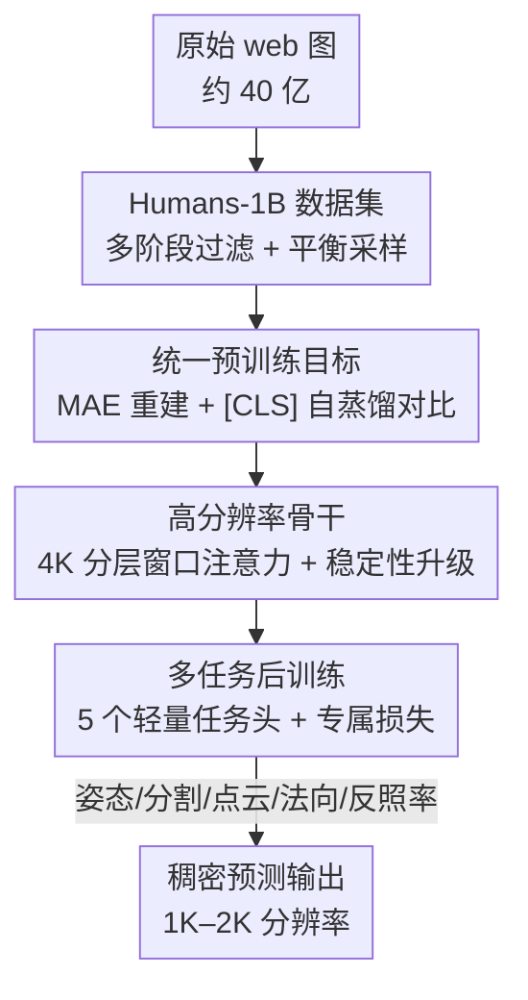

# Sapiens2：面向人体视觉的高分辨率基础模型

**会议**: ICLR 2026  
**OpenReview**: [https://openreview.net/forum?id=IVAlYCqdvW](https://openreview.net/forum?id=IVAlYCqdvW)  
**代码**: https://github.com/facebookresearch/sapiens2 (有)  
**领域**: 人体理解 / 自监督表示学习 / 视觉基础模型  
**关键词**: 人体中心视觉, 掩码重建, 对比学习, 高分辨率, 稠密预测

## 一句话总结
Sapiens2 用「掩码重建 + 自蒸馏对比」的统一预训练目标，在 10 亿张精选人像上训练 0.4B–5B 的高分辨率 Transformer，并支持 4K 分层骨干，在姿态、人体部件分割、法向、点云、反照率等多项人体稠密任务上全面刷新 SOTA。

## 研究背景与动机
**领域现状**：上一代 Sapiens 把「人体中心视觉基础模型」这条路走通了——只在人像上做大规模预训练、再用轻量任务头微调，就能在姿态、分割、深度、法向等任务上超过同规模通用模型。它的预训练主力是 MAE 这类掩码图像建模（MIM）。

**现有痛点**：MIM 本质是一种「压缩」——靠重建被遮挡像素来保留低层细节和空间结构，因此非常擅长稠密预测里要的纹理、边界、颜色，但学到的语义偏弱，往往需要中到高强度的监督才能可靠表达语义（零样本/少标注场景吃亏）。反过来，对比学习（CL）靠实例级不变性注入语义，零样本检索强，但全局不变性目标在稠密预测上表现差，而且激进的外观增广会让 teacher/student 与真实观测「脱钩」，侵蚀颜色这类对真实感 avatar 至关重要的线索。iBOT/DINOv2/v-JEPA 这类 MIM+CL 混合体缩小了差距，但它们在隐空间做匹配，存在「表征漂移」：特征不再锚定到像素，高分辨率下表现参差。

**核心矛盾**：稠密保真度（要像素级颜色/细节，MIM 强）与语义泛化（要零样本判别，CL 强）之间存在结构性 trade-off，而隐空间混合方法因为不锚定像素，丢掉了人体稠密任务最需要的低层线索。

**本文目标**：造一个同时具备「高保真稠密预测」与「强语义泛化」的人体视觉基础模型，并把分辨率从 1K 推到 4K、参数从 2B 推到 5B，覆盖更多人体任务（新增点云、反照率）。

**切入角度**：与其在隐空间做对比匹配，不如把对比目标叠加在一个**仍然重建像素**的 MAE 之上——让特征牢牢锚定在像素空间（保住颜色/细节），同时用 [CLS] 上的全局对比把它们按语义组织起来。

**核心 idea**：用「像素锚定的 MAE 重建 + [CLS] 全局自蒸馏对比」的联合目标，配合 10 亿人像数据与 4K 分层骨干，做一个通用、保真、可零样本迁移的人体表征。

## 方法详解

### 整体框架
Sapiens2 是一个「数据 → 预训练 → 骨干架构 → 后训练 → 多任务」的人体视觉基础模型流水线。预训练阶段，一张人像被生成多个增广视图，分别送进共享编码器：一路走 MAE 分支（遮挡—重建像素，学低层细节），一路走对比分支（[CLS] 经 student/teacher 跨视图匹配，学高层语义），两个损失 $L = L_{MAE} + \lambda L_{CL}$ 联合优化。骨干本身是为「稳定 scale 到 5B + 输入到 4K + 兼容稀疏掩码预训练」重新设计的高分辨率 Transformer，4K 变体用分层窗口注意力先局部后全局。预训练完成后冻结/微调骨干，外挂五个轻量任务头分别做姿态、人体部件分割、点云、法向、反照率。

### 关键设计

**1. 统一预训练目标：像素锚定的 MAE 重建 + [CLS] 全局对比**

这一设计直接针对「保真 vs 语义」的核心矛盾。对每张图采 $V$ 个增广视图，编码器 $\Phi_{enc}$ 只处理可见 token，再把可见特征 scatter 回原位、在被遮位置插入可学习的 mask token，由 patch 解码器 $\Phi_{dec}$ 重建全部 patch，目标是归一化像素上的 MSE：$L_{MAE} = \frac{1}{V}\sum_i \frac{1}{|M_i|}\sum_{p\in M_i}(\tilde{x}^p_i - \hat{x}^p_i)^2$，其中 $M_i$ 是被遮 token 集合。与此并行，对比分支采用 DINOv3 式的 student–teacher 方案：teacher 与 student 同架构、不可学习、参数是 student 的 EMA；取两路 [CLS] 嵌入经 $\Phi_{cls}$ 映射成 $K$ 维 logits，softmax 后得 $p_i,q_i$，在所有跨视图 global↔global、global↔local 正样本对集合 $S$ 上做 teacher→student 交叉熵 $L_{CL}=\frac{1}{|S|}\sum_{(i,j)\in S}H(q_j,p_i)$。最终联合目标 $L = L_{MAE} + \lambda L_{CL}$。

关键在于它和 iBOT/DINOv2 这类「隐空间匹配」不同：MAE 分支仍然**重建真实像素**，把特征锚定在像素空间、避免表征漂移，保住了颜色/纹理这些人体稠密任务的命根；对比分支只负责在 [CLS] 上把特征按语义组织，让模型获得零样本判别力。两者互补——dense probing 显示 MAE-only 的初代 Sapiens 语义弱、对比型 DINOv3 几何强但颜色线索差，而联合目标在同规模下两头都赢。

**2. Humans-1B：多阶段过滤 + 平衡采样的十亿级人像语料**

泛化随数据与容量增长，但「只有当分布多样、均衡、高质量时 scale 才有用」。作者从约 40 亿张 web 图出发，用多阶段过滤管线隔离人体内容：边界框检测、头部姿态估计、美学与真实感打分、CLIP 特征、文字叠加检测，剔除不真实/低质/含文字水印的图，只保留短边至少有一个人 ≥384 像素的实例（允许多人）。再用感知哈希 + 深度特征最近邻去重，并对视觉嵌入做聚类后选择性采样，按姿态、视角、遮挡、服装、场景、光照做内容平衡，阈值与配额用小规模人工审核校准。最终得到约 10 亿张高质量人像。

要强调的是 Sapiens2 在预训练阶段**不注入任何人体先验、不用任务标签**，唯一约束就是「图里至少有一个显著的人」。这种「纯归纳无先验」的做法（区别于 HAP 用关键点引导掩码、SOLIDER 加语义分类损失等）使其能干净地 scale 到百万级图像与十亿级参数，而不引入手工人体偏置。

**3. 4K 分层窗口注意力骨干 + 长训稳定性升级**

预测保真度随模型处理的视觉 token 数增长，而 token 数随分辨率增长——所以要把分辨率推到 4K。但 4K 下 token 数巨大、全局注意力不可行，作者采用分层设计：给定 $H\times W$ 图、patch 大小 $p$ 得 $N=(H/p)(W/p)$ 个 token，前 $K$ 层做**窗口自注意力**捕捉局部纹理与边界，随后用 [CLS] 引导的池化以空间步长 $\sqrt{\omega}$ 把 token 网格降到 $N/\omega$，再用后 $L$ 层在精简序列上做全局注意力融合长程上下文。这个布局天然兼容 MAE：局部阶段之后再做 token 掩码，信息不会跨被遮区域流动，避免了卷积骨干需要 masked-conv 才能防的泄漏。

为稳定地 scale 到 5B 并支持长训练日程，骨干还做了一组针对性升级：中层用分组查询注意力（GQA）提吞吐、首尾层用标准多头注意力，FFN 换成门控 SwiGLU，注意力前对 Q/K 做 QK-Norm 提高高分辨率训练鲁棒性，用参数高效的 RMSNorm 替代 LayerNorm，解码端用 PixelShuffle 做无伪影亚像素上采样。此外有一段在 2K 输出下的短重建阶段，专门锐化稠密任务的亚像素保真度而不损语义。

**4. 多任务后训练：冻结骨干 + 五个轻量任务头与专属损失**

后训练在不动骨干的前提下，给五个人体任务各挂一个轻量头，并把监督量较初代放大约 10×（每任务约 100 万标注）。**姿态**用 top-down 估 308 关键点热图（脸 243、手 40，其余躯干下肢），除 capture-studio 标注外新标了 10 万张 in-the-wild 高清图，用带 OHEM 的热图 MSE $L_{pose}=\sum_u\|\hat H(u)-H(u)\|^2$。**部件分割**用 29 类（比上一代加了 eyeglasses），用逐像素加权交叉熵 + Dice 损失锐化边界。**点云（深度）**不回归相对深度而是回归相机系下每像素 3D 点 $\hat P(u)$，因内参未知尺度有歧义，预测焦距归一化点云 $\tilde P(u)$ 与标量头 $s$ 合成 $\hat P(u)=s\tilde P(u)$，损失含值项与 XY 梯度项。**法向**预测单位法向并用多层 PixelShuffle 上采样，损失含余弦项、L2 项与梯度项。**反照率**预测每像素漫反射 albedo，损失含 L2、梯度项与空间 RGB 均值对齐项 $\|\mu(\hat A)-\mu(A)\|^2$，鼓励光照不变地恢复肤色与衣物色。这些任务共享同一骨干、只换头，验证了统一表征的通用性，并把能力扩展到初代没有的点云与反照率。

## 实验关键数据

### 主实验
在为各任务专门构建的、标注质量更高的 in-the-wild 测试集上对比任务专属 SOTA：

| 任务 / 测试集 | 指标 | 最强基线 | Sapiens2-5B | 相对初代 |
|--------|------|------|----------|------|
| 姿态 (11K, 308 kpt) | mAP ↑ | Sapiens-2B 78.3 | **82.3** (+4.0) | 初代 +4 mAP |
| 部件分割 (5K, 29 类) | mIoU ↑ | Sapiens-2B 58.2 | **82.5** (+24.3) | +24.3 mIoU |
| 点云 (10K) | L2 (e-1) ↓ | MoGe 0.202 | **0.167** | — |
| 法向 (10K, 4K GT) | 平均角误差° ↓ | DAViD-L 10.73 | **6.73** | 角误差降约 45.6% |
| 反照率 (10K) | MAE ↓ / PSNR ↑ | — | **0.012 / 32.6dB** | 新任务 |

值得注意的是分割提升极大：同为 1K 输入，Sapiens2-1B 比 Sapiens-1B 高 27.9% mIoU、16.9% mAcc，主要来自 in-the-wild 监督与输出分辨率从 0.5K 提到 1K。

### 预训练泛化分析（dense probing）
冻结骨干、在所有方法上用相同超参轻量训练任务解码器，直接衡量预训练特征的零样本泛化能力——这也是「统一目标 vs 单一目标」的关键对照：

| 骨干 | 参数 | Pose mAP↑ | Seg mIoU%↑ | Normal MAE°↓ | Albedo MAE↓ |
|------|------|------|------|------|------|
| Sapiens-1B (MAE-only) | 1.17B | 58.2 | 61.4 | 15.3 | 3.85 |
| DINOv3-7B (对比型) | 6.71B | 68.2 | 67.6 | 14.2 | 3.48 |
| Sapiens2-1B (联合) | 1.46B | 68.3 | 65.2 | 14.5 | 3.64 |
| Sapiens2-5B (联合) | 5.07B | **74.7** | **69.6** | **13.5** | **3.12** |

### 关键发现
- **联合目标两头通吃**：MAE-only 的初代 Sapiens 语义弱（pose 偏低）但保留外观线索（albedo 不差）；对比型 DINOv3 几何/语义强但颜色线索差。Sapiens2 同规模下两类任务都不掉队，5B 在每个任务上都超过所有基线（含 6.71B 的 DINOv3-7B）。
- **可预测的 scaling**：0.4B→5B 在姿态等任务上呈现稳定可预测的增益，符合 scaling law；甚至 0.8B 凭架构与监督改进就能超过更大的初代模型。
- **4K 分层骨干进一步加分**：1B-4K 变体在分割（81.9 mIoU）、法向（6.98°）上优于同参 1K 版，说明更高分辨率确实带来更细的边界与几何。
- **纯合成训练也能泛化**：点云/法向/反照率全用合成资产监督，却能恢复真实肤色、迁移到 in-the-wild 图，且相比扩散类方法是前馈、推理高效得多。

## 亮点与洞察
- **「锚定像素」是这篇最核心的洞察**：同样是 MIM+CL 混合，把对比叠在「重建像素」的 MAE 上（而非隐空间匹配），既保住颜色/纹理又获得语义，绕开了 DINOv2 系的表征漂移——这个思路可迁移到任何既要稠密保真又要语义泛化的领域（医学、遥感）。
- **分层窗口注意力 + 局部后掩码**的组合很巧：先局部窗口再池化到全局，使 4K 可行；把 token 掩码放在局部阶段之后，天然防止信息跨被遮区泄漏，省掉了卷积骨干的 masked-conv。
- **无人体先验却专精人体**：只靠「图里有人」这一条数据约束 + 大规模 scale，就胜过显式注入关键点/骨架先验的方法，再次印证「数据规模 > 手工先验」。
- **一套骨干打五个任务**（含新增点云、反照率），冻结骨干只换轻量头，是基础模型「通用性」最直接的证据。

## 局限与展望
- 预训练算力极高：5B 模型在 1K 下达 15 TFLOPs，是已报道 FLOPs 最大的 ViT，复现门槛很高；数据管线（约 40 亿→10 亿）也依赖大量内部资源。
- 几何任务（点云/法向/反照率）的监督**完全来自合成资产**，真实 in-the-wild 几何的定量评测仍受限于缺少真值；论文主要靠定性图与合成测试集说明泛化。
- 仅做人体中心视觉，未验证该统一目标在通用（非人体）稠密任务上的优势；λ、掩码比、视图数等关键超参的敏感性未在正文充分展开。
- 反照率等任务承认对极端光照/材质仍有挑战，扩展到视频/多视角一致性是自然的下一步。

## 相关工作与启发
- **vs DINOv2 / DINOv3（隐空间 MIM+CL）**：它们在隐空间做 student–teacher 匹配，语义强但不锚定像素、有表征漂移、丢颜色线索；Sapiens2 保留像素重建分支，稠密保真更强，同规模在人体任务上反超甚至超过更大的 DINOv3-7B。
- **vs 初代 Sapiens（MAE-only）**：初代靠纯掩码重建，语义偏弱、零样本吃亏；Sapiens2 叠加对比目标补语义，并把数据 300M→1B、分辨率 1K→4K、参数 2B→5B，多任务全面提升。
- **vs CMAE（MAE+CL 组合）**：CMAE 也探索了二者结合但主要在分类上评测；Sapiens2 把统一目标推到十亿规模、跨多个人体稠密任务系统验证。
- **vs HAP / SOLIDER / LiftedCL（显式人体先验）**：它们注入关键点掩码、语义分类损失或 3D 骨架先验；Sapiens2 反其道而行，预训练零先验、靠数据规模取胜，换来更干净的可扩展性。

## 评分
- 新颖性: ⭐⭐⭐⭐ 「像素锚定的 MAE+CL 联合目标」对症人体稠密任务的矛盾，组合清晰有效，但单看组件多为已有技术的精心整合。
- 实验充分度: ⭐⭐⭐⭐⭐ 五任务 × 多规模 × dense probing + SOTA 对比，自建高质量测试集，证据扎实。
- 写作质量: ⭐⭐⭐⭐ 动机推导清楚、图表丰富；部分超参敏感性与合成监督的真实泛化论证略欠。
- 价值: ⭐⭐⭐⭐⭐ 人体视觉基础模型新 SOTA、开源、一骨干多任务，对下游 avatar/重光照等应用价值大。

<!-- RELATED:START -->

## 相关论文

- [\[ICLR 2026\] Motion-Aligned Word Embeddings for Text-to-Motion Generation](motion-aligned_word_embeddings_for_text-to-motion_generation.md)
- [\[ICLR 2026\] Disentangled Hierarchical VAE for 3D Human-Human Interaction Generation](disentangled_hierarchical_vae_for_3d_human-human_interaction_generation.md)
- [\[ICLR 2026\] EdgeCAPE：边权预测用于类别无关姿态估计](edgecape_edge_weight_prediction_for_category-agnostic_pose_estimation.md)
- [\[ICLR 2026\] Zero-Shot Human Pose Estimation Using Diffusion-Based Inverse Solvers](zero-shot_human_pose_estimation_using_diffusion-based_inverse_solvers.md)
- [\[ICLR 2026\] QuaMo: Quaternion Motions for Vision-based 3D Human Kinematics Capture](quamo_quaternion_motion_kinematics.md)

<!-- RELATED:END -->
