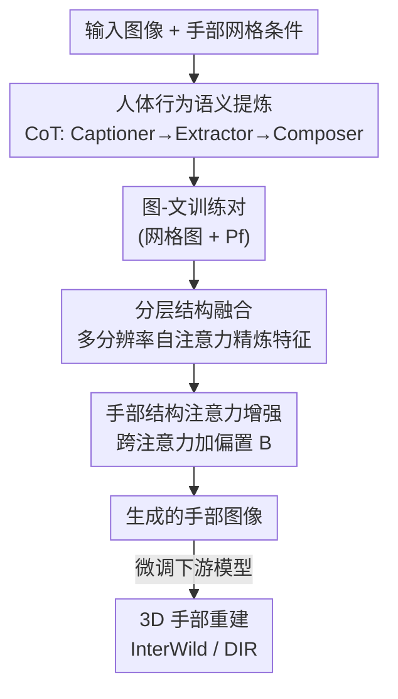

# SesaHand: Enhancing 3D Hand Reconstruction via Controllable Generation with Semantic and Structural Alignment

**会议**: ICLR 2026  
**OpenReview**: [https://openreview.net/forum?id=sKMgGQQy7g](https://openreview.net/forum?id=sKMgGQQy7g)  
**领域**: 人体理解 / 3D手部重建 / 可控生成  
**关键词**: 3D手部重建, 可控图像生成, 思维链, 自注意力结构, 合成数据

## 一句话总结
SesaHand 用一个"语义对齐 + 结构对齐"双管齐下的可控扩散框架来合成带手部网格标注的真实手部图像：语义侧用思维链（CoT）从 VLM 描述里提炼"人体行为语义"压掉无关细节，结构侧用分层自注意力融合让手与人体对齐、再用一个偏置项高效增强手部跨注意力；生成的图像反过来把野外 3D 手部重建（MPVPE 等）显著刷上去。

## 研究背景与动机
**领域现状**：单图 3D 手部重建依赖大量精确标注，而标注昂贵耗时，于是社区转向合成数据。主流做法是用游戏引擎渲染手部图像，能批量生产各种手势姿态。

**现有痛点**：游戏引擎合成的手部图像纹理和背景库有限、多样性差，手常常被放在与上下文语义不兼容的环境里；更糟的是这些图大多只有"漂浮的手"，没有手臂、几乎没有手物交互（见原文 Fig.1a），违背真实人体结构和人类行为。扩散模型能生成多样真实的图像，是有希望的替代，但直接拿来用又会出现"对不齐"的问题。

**核心矛盾**：可控扩散生成手部图像时存在两层错位。一是**语义错位**——之前工作（AttentionHand）直接用大 VLM 给图像写描述，而 VLM 有"过度思考（overthinking）"毛病，会把画面里每个无关元素（如餐具）都事无巨细描述出来，这些冗余在后期去噪步骤把模型注意力带偏，生成出不合理的手或多余遮挡；二是**结构错位**——手是人体的关键部位，忽略手与人体的结构关联会产生漂浮手、不合理人体姿态。

**本文目标**：把可控手部图像生成同时从语义和结构两个角度对齐，使生成的"图像-标注"对既真实又可用于训练下游 3D 手部重建。

**切入角度**：作者发现图像描述里真正有用的是"以人为中心的上下文"，它可被分解为人体姿态、动作、手部动作、环境四个成分，作者把它定义为**人体行为语义（human behavior semantics）**；并发现扩散模型自注意力图天然保留几何/结构信息、跨注意力图揭示图文语义对应——这两点分别是治语义病和结构病的抓手。

**核心 idea**：用 CoT 提炼人体行为语义替代啰嗦的 VLM caption 来做语义对齐，用分层自注意力融合 + 手部跨注意力偏置增强来做结构对齐，两者合成高质量配对数据反哺 3D 手部重建。

## 方法详解

### 整体框架
SesaHand 建立在 ControlNet（锁住 Stable Diffusion、训练一份编码块副本，用零卷积接入）之上，条件是 2D 手部网格图像 $c_i$，目标是生成与该网格对齐、且人体合理的真实手部图像。整条管线分成两条对齐支线：**语义支线**先离线把训练图像的文本描述换成干净的人体行为语义，用来构建更好的"图-文"训练对；**结构支线**在生成网络内部改造特征，让手与人体在结构上对齐、并突出手部区域。

具体地，输入图像先走语义提炼管线（Captioner→Extractor→Composer 的 CoT 三步）产出最终文本 $P_f$，与手部网格图一起构成训练对；训练/生成时，噪声潜变量 $z_t$ 与网格条件 $c_f$ 进入 ControlNet，从其编码块和中间块抽多分辨率自注意力图做**分层结构融合**精炼特征，并在跨注意力层对"手部相关 token"加偏置做**手部结构注意力增强**，最终经 UNet 解码出手部图像。生成的图像再用于微调下游 3D 手部重建模型（InterWild / DIR）。

### 关键设计

**1. 人体行为语义提炼：用 CoT 治 VLM 的过度思考**

针对语义错位痛点：VLM 写 caption 会把无关元素都描述进去，污染生成、导致手部遮挡和不合理。作者先做了一个验证——在 100 张样本上分别用 VLM caption 和人体行为语义当文本提示生成手图，用手部检测器算平均置信度，人体行为语义得 97%、VLM caption 只有 86%，并通过注意力分析发现 caption 的过度思考会让模型注意力在后期去噪步骤偏向无关物体。基于此，作者把"以人为中心上下文"分解为人体姿态、动作、手部动作、环境四成分，用三步 CoT 把它从原始描述里抠出来：Captioner 先生成初始描述 $X_t = \text{Captioner}(X)$；Extractor 配少样本示例 $P_e$ 抽取并分解关键实体与属性 $P = \text{Extractor}(X_t, P_e)$，输出限定为 JSON 以便解析；Composer 再把各成分拼成最终文本 $P_f = \text{Composer}(P_{pose}, P_{action}, P_{hand\,action}, P_{env})$。这样得到的描述既保留充分的人体行为信息，又剔除了会带偏 T2I 的无关细节，从源头改善"图-文"训练对的语义质量。

**2. 分层结构融合：用多分辨率自注意力对齐手与人体**

针对结构错位中的"手-身对齐"问题。扩散模型自注意力图保留图像几何与结构信息，且不同分辨率各有侧重——高分辨率（如 64）捕获细粒度局部人体结构，低分辨率（如 8）聚焦全局人体结构。作者从 ControlNet 编码块和中间块抽出多分辨率自注意力图 $\psi_r$（$r\in\{8,16,32,64\}$），先用最大池化 $M$ 统一到同一分辨率再求和聚合：

$$\psi' = \sum_{r=8,16,32,64} M(\psi_r)$$

然后把聚合后的注意力图作用到控制模块输出的原始特征 $f_c$ 上得到精炼特征：$f'_c = f_c \otimes \psi'$（$\otimes$ 为矩阵乘）；最后经零卷积 $Z$ 融回 Stable Diffusion 主干特征：$f' = Z(f'_c) + f$。如此精炼后的特征携带更丰富的人体结构信息，让解码器生成的手与人体在结构上更协调，缓解漂浮手和不合理姿态。

**3. 手部结构注意力增强：用一个偏置项高效突出手部区域**

针对手部区域小、易被忽略且优化代价高的问题。AttentionHand 走的是对噪声嵌入 $z_t$ 做耗时优化的两阶段路线（27.25 s/iter），作者改成在跨注意力图上直接加偏置这种极轻量做法。先用 NLTK 词性标注对文本提示做"手部相关"标注，取出属于"动词"类且含"hand"的 token 索引集合 $I$；跨注意力图计算时给这些列加偏置矩阵 $B$：

$$M_{cross} = \text{softmax}\!\left(\frac{Q_i K_i^{T}}{\sqrt{d_i}} + B\right),\quad B_{q,k} = \begin{cases}\alpha, & k \in I\\ 0, & \text{otherwise}\end{cases}$$

其中 $\alpha$ 为正的超参（实验取 2.0 最佳）。这样手部相关注意力在加权组合中贡献更大，输出 $\phi'_i(z_t, c_f) = M_{cross}V_i$ 更聚焦手部区域。它几乎不增加耗时（0.44 vs ControlNet 0.41 s/iter），却用最简单的方式实现了对手部局部特征的强调。

### 损失函数 / 训练策略
沿用 ControlNet 的去噪目标：$\mathcal{L}(\theta) = \mathbb{E}_{z_0,\epsilon,t,c_t,c_f}\big[\,\|\epsilon - \epsilon_\theta(z_t, t, c_t, c_f)\|_2^2\,\big]$，其中 $c_f = \text{En}(c_i)$ 是手部网格图像编码后的潜条件。语义提炼管线为离线数据构建，不进入梯度；结构对齐的两个模块在 ControlNet 框架内端到端训练。

## 实验关键数据

### 主实验
T2I 生成在 MSCOCO（按 AttentionHand 的协议预处理出 RGB 手图与手部网格图）上评测，指标含 FID/KID、手部裁剪上的 FID-H/KID-H、手部置信度、2D/3D 关键点 MSE 与用户偏好。

| 方法 | FID ↓ | FID-H ↓ | KID-H ↓ | Hand Conf. ↑ | MSE-3D ↓ | User Pref. ↑ |
|------|-------|---------|---------|--------------|----------|--------------|
| Stable Diffusion | 40.52 | 50.78 | 0.02554 | 0.651 | 4.591 | 1.50 |
| ControlNet | 21.67 | 40.32 | 0.02098 | 0.810 | 2.182 | 3.21 |
| AttentionHand | 20.71 | 27.09 | 0.01287 | 0.965 | 1.986 | 4.05 |
| **Ours** | **18.63** | **17.77** | **0.00718** | **0.966** | **1.537** | **4.55** |

相比 AttentionHand，FID-H 提升约 34%、KID-H 提升约 44%，说明语义+结构信息确实改善了手部图像质量。

下游 3D 手部重建在两个野外数据集 HIC、Re:InterHand（ReIH）上微调 InterWild 与 DIR，指标为 MPVPE / RRVE / MRRPE（mm，越低越好）：

| 模型 | 数据集 | MPVPE ↓ | 对比 +AttentionHand |
|------|--------|---------|---------------------|
| DIR* + Ours | HIC | 20.48 (−6.7%) | −5.6% |
| DIR* + Ours | ReIH | 19.21 (−13.2%) | −8.8% |
| InterWild* + Ours | HIC | 14.70 (−3.9%) | −3.7% |
| InterWild* + Ours | ReIH | 13.01 (−7.0%) | −0.3% |

用本文生成图像微调，几乎在所有设置上比用 AttentionHand 生成图像降误差更多，尤其 ReIH 上 InterWild 的 MPVPE 从基本不降（−0.3%）拉到 −7.0%。

### 消融实验
SE/SF/AE 分别为语义提炼、结构融合、注意力增强；逐项累加（MSCOCO）：

| 配置 | FID ↓ | FID-H ↓ | KID-H ↓ | HC ↑ |
|------|-------|---------|---------|------|
| w/o all | 21.04 | 21.90 | 0.00982 | 0.942 |
| + SE | 19.83 | 18.90 | 0.00807 | 0.944 |
| + SE + SF | 19.05 | 18.17 | 0.00722 | 0.960 |
| + SE + SF + AE | **18.63** | **17.77** | **0.00718** | **0.966** |

三个模块逐个加上都带来持续提升：SE 把 FID 从 21.04 降到 19.83，SF 进一步对齐手-身，AE 主要把手部置信度从 0.960 提到 0.966。

### 关键发现
- **训练效率是最大亮点之一**：本文 0.44 s/iter，几乎和 ControlNet（0.41）持平，而 AttentionHand 需要 27.25 s/iter——用偏置项替代耗时的嵌入优化，约 60 倍提速却不牺牲质量。
- **偏置 $\alpha$ 存在甜点**：$\alpha=2.0$ 时 FID(18.63)/FID-H(17.77) 最优；偏小（1.0）不足以突出手部、偏大（2.5）引入噪声反而变差。
- **下游收益在更难的合成野外集 ReIH 上更明显**，说明高质量、语义/结构对齐的生成数据对遮挡、截断等困难样本的鲁棒性帮助更大。

## 亮点与洞察
- **把"过度思考"当成可量化的问题来治**：用手部置信度（97% vs 86%）和注意力偏移分析把 VLM caption 的危害说清楚，再用 CoT 分解四成分对症下药，动机非常具体而非泛泛。
- **复用扩散模型内部注意力的两种信息**：自注意力管结构（手-身对齐）、跨注意力管语义（手部 token 加偏置），一个模型内两类注意力图各司其职，思路干净且可迁移到其他"小目标/局部对齐"生成任务。
- **"生成是手段、下游重建才是目的"的闭环**：不止刷生成指标，还证明生成图能反哺 3D 手部重建，给"用生成式合成数据训练下游任务"提供了一个可复用的范式。

## 局限与展望
- 语义提炼依赖 VLM/LLM（Captioner/Extractor/Composer），其质量与少样本示例设计强相关，作者未充分讨论提炼失败时的级联影响。
- 结构条件仍是 2D 手部网格图，受网格质量影响；自注意力聚合用简单的最大池化+求和，是否最优缺乏更细的对比。
- 评测主要在 MSCOCO 生成 + HIC/ReIH 重建，野外多样性、复杂手物交互场景的覆盖仍可扩展；下游只验证了两个重建模型。
- 改进思路：让结构条件支持手物交互的联合网格、把语义提炼的四成分与结构注意力联动（如按动作类型自适应调 $\alpha$）。

## 相关工作与启发
- **vs AttentionHand**：同样做野外手部图像可控生成（手部网格条件 + 文本），但 AttentionHand 直接用 VLM 描述（受过度思考拖累）且靠两阶段耗时优化精炼手部特征；本文用 CoT 提炼干净语义、用偏置项极轻量增强手部注意力，质量更好且约 60 倍更快。
- **vs FoundHand**：FoundHand 从 2D 关键点做可控生成，忽略手形（shape）因素；本文以手部网格为条件，保留手形信息。
- **vs HandBooster**：HandBooster 支持多条件但局限于实验室环境；本文面向野外场景，并验证了对野外 3D 重建的增益。
- **vs HanDiffuser / Hand1000**：它们直接从文本生成手图但没有可靠对应标注、无法训练重建模型；本文生成的是带网格标注的配对数据，可直接用于下游训练。

## 评分
- 新颖性: ⭐⭐⭐⭐ 把语义对齐（CoT 治过度思考）与结构对齐（自注意力融合+跨注意力偏置）统一进可控手部生成，切入点新且具体。
- 实验充分度: ⭐⭐⭐⭐ 生成与下游重建双线评测、含速度/超参/逐项消融，但下游仅两模型、数据集面可再扩。
- 写作质量: ⭐⭐⭐⭐ 动机用量化分析支撑，方法图文对照清晰。
- 价值: ⭐⭐⭐⭐ 给"生成式合成数据反哺 3D 手部重建"提供了高效可复用范式。

<!-- RELATED:START -->

## 相关论文

- [\[CVPR 2025\] WiLoR: End-to-end 3D Hand Localization and Reconstruction in-the-wild](../../CVPR2025/human_understanding/wilor_end-to-end_3d_hand_localization_and_reconstruction_in-the-wild.md)
- [\[ICLR 2026\] Motion-R1: Enhancing Motion Generation with Decomposed Chain-of-Thought and RL Binding](motion-r1_enhancing_motion_generation_with_decomposed_chain-of-thought_and_rl_bi.md)
- [\[CVPR 2026\] OpenDance: Multimodal Controllable 3D Dance Generation with Large-scale Internet Data](../../CVPR2026/human_understanding/opendance_multimodal_controllable_3d_dance_generation_with_large-scale_internet_.md)
- [\[CVPR 2026\] View-Aware Semantic Alignment for Aerial-Ground Person Re-Identification](../../CVPR2026/human_understanding/view-aware_semantic_alignment_for_aerial-ground_person_re-identification.md)
- [\[ICLR 2026\] Disentangled Hierarchical VAE for 3D Human-Human Interaction Generation](disentangled_hierarchical_vae_for_3d_human-human_interaction_generation.md)

<!-- RELATED:END -->
