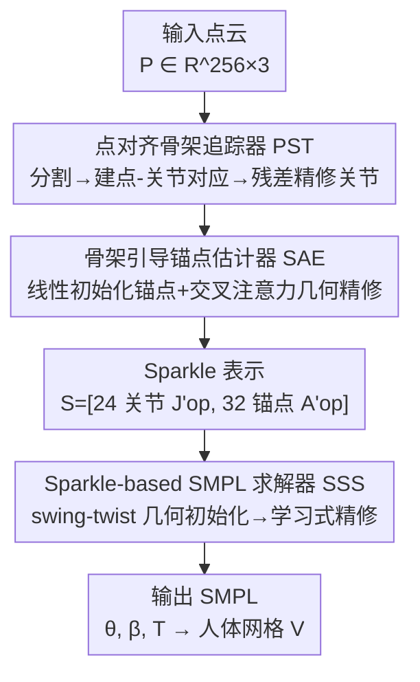

# Sparkle: A Robust and Versatile Representation for Point Cloud-based Human Motion Capture

**会议**: ICLR 2026  
**OpenReview**: [https://openreview.net/forum?id=0blfYtdJES](https://openreview.net/forum?id=0blfYtdJES)  
**代码**: 无  
**领域**: 3D视觉 / 人体理解 / 点云动作捕捉  
**关键词**: 点云动作捕捉, 人体表示, 骨架-表面解耦, SMPL求解, 鲁棒泛化

## 一句话总结
针对点云动作捕捉中"点云方法细节丰富但怕噪声、骨架方法鲁棒但丢细节"的两难，本文提出 Sparkle 表示——把 24 个骨架关节（内部运动学）和 32 个表面锚点（外部几何）显式解耦再统一，并配套 SparkleMotion 框架（点对齐骨架追踪器 + 骨架引导锚点估计器 + Sparkle-based SMPL 求解器），在 11 个数据集上跨传感器、跨遮挡噪声全面刷新 SOTA。

## 研究背景与动机
**领域现状**：人体动作捕捉（MoCap）支撑体育分析、医疗、VR、人机交互等众多应用。在各种模态里，基于点云（LiDAR / 深度相机）的方案因为能精确感知深度、且天然保护隐私（不拍可辨识人脸），相比可穿戴传感器和 RGB 相机方案有独特优势。但点云本身是无结构、稀疏、含噪、常有缺失的，从中学到一个"既表达力强又鲁棒"的中间表示一直是核心难题。

**现有痛点**：现有方法在两条路线上各有硬伤。一类是**直接点级表示**（PointNet 类），保留了几何细节但缺乏结构先验，对噪声和遮挡极其敏感；另一类是**骨架抽象表示**（LiveHPS 类），有很强的运动学结构先验、抗噪鲁棒，但把表面细节全丢了——而表面细节恰恰是解决关节旋转歧义（尤其是绕骨轴的 twist 扭转）、还原精细形状所必需的。两类方法都无法同时做到表达力和鲁棒性。

**核心矛盾**：表达力（geometry detail）和鲁棒性（structural prior）之间存在 trade-off。而且作者强调，**简单把骨架表示和表面表示拼在一起并不够**：骨架部分本身缺少表面约束、点级部分本身在稀疏/含噪下不稳定，拼起来只是把两边的缺陷都带进来。

**本文目标**：构造一个能同时平衡表达力与鲁棒性的人体中间表示，并基于它做出在精度、鲁棒性、跨域泛化上都领先的实际 MoCap 系统。

**切入角度**：内部骨架关节提供"抗噪但不完整"的结构描述，外部表面点提供"细节丰富但脆弱"的几何描述，二者性质互补。关键不在简单求并，而在**重新设计每个组成部分**：骨架侧改用"点对齐估计"显式建模点云与关节的空间对应（而非直接回归），表面侧改用"语义一致、可被骨架引导动态精修的锚点"（而非杂乱原始点）。

**核心 idea**：提出 **Sparkle** —— 用显式的"运动学-几何解耦"把骨架关节和表面锚点统一进一个结构化表示 $S=[J'_{op}, A'_{op}]$，让骨架保证鲁棒、锚点保证表达，再用这套解耦结构高效求解 SMPL。

## 方法详解

### 整体框架
SparkleMotion 输入是每帧经最远点采样、归一化后的点云 $P_t \in \mathbb{R}^{256\times3}$（时间序列），输出是 SMPL 参数：形状 $\beta\in\mathbb{R}^{10}$、姿态 $\theta\in\mathbb{R}^{72}$（轴角）、全局平移 $T\in\mathbb{R}^3$，进而得到 6890 点的人体网格 $V$。整套流程的灵魂是先把人体编码成 Sparkle 表示——24 个优化后的骨架关节 $J'_{op}$ 和 32 个优化后的表面锚点 $A'_{op}$——再用它求解最终人体。

整体分三个串行模块：**点对齐骨架追踪器（PST）** 从点云估计内部运动学（骨架关节），**骨架引导锚点估计器（SAE）** 在骨架引导下估计外部几何（表面锚点），两者拼成 Sparkle 表示后，**Sparkle-based SMPL 求解器（SSS）** 利用这套"运动学空间 + 几何空间"的解耦先做几何初始化、再做学习式精修，回归出 SMPL 参数。

### 关键设计

**1. Sparkle 表示：用骨架-表面解耦统一一个既鲁棒又有表达力的中间编码**

这是全文的根。它针对的痛点是"点级表示怕噪声、骨架表示丢细节，且简单拼接无效"。Sparkle 把人体显式拆成两个互补空间并统一编码：内部运动学空间用 24 个关节 $J'_{op}$ 描述（提供抗噪的运动学约束），外部几何空间用 32 个锚点 $A'_{op}$ 描述（编码解决形状/旋转歧义所需的局部表面细节），最终表示为 $S=[J'_{op}, A'_{op}]$。这种显式因子化引入了强物理归纳偏置：关节天然负责"姿态稳定"、锚点天然负责"形状细节"，相比无结构的原始点云大幅降低了学习复杂度。它之所以不是"骨架+表面"的简单堆叠，是因为两个组成部分都被重新设计过（见设计 2、3），并且这种解耦结构反过来让下游 SMPL 求解能做出可解析的几何初始化（见设计 4）。

**2. 点对齐骨架追踪器 PST：把全局关节回归改写成基于分割对应的局部精修**

针对"从高度可变的点云直接回归骨架不稳定、与观测几何错位"的痛点。PST 先用 PointNet backbone 加双向 GRU 预测初始关节 $J_{init}$ 和全局平移 $T_{init}$，再对点云做隐式语义分割，给每个点打上所属关节的标签 $L_j\in\{0,1,\dots,24\}$，从而在点和关节间建立显式空间对应。有了对应关系后，作者把全局回归问题**重写为一组局部精修任务**：先用预测平移把点云中心化 $P_{centered}=P-T_{init}$，对每个关节 $j$ 取出标签为 $j$ 的点子集 $P_j$，再相对该关节归一化 $\tilde P_j=\{p-J_{init,j}: p\in P_j\}$。然后用一个**跨关节共享权重**的轻量 PointNet 处理每个局部点集得到 $F_{joint}$，由 MLP 解码出残差偏移 $\Delta J_j$，最终

$$J_{op}=J_{init}+\Delta J_j,\qquad T_{op}=T_{init}+\Delta J_0.$$

共享权重迫使网络学到一个与具体身体部位无关的通用精修函数，显著提升泛化；当某关节关联点过少（$|\tilde P_j|<3$）时，用局部邻域特征增强，把高置信预测传播到不确定区域。训练损失为 $L_{PST}=\lambda_1 L_{MSE}(J_{op},J_{gt})+\lambda_2 L_{CE}(L_j,L_{j\,gt})+\lambda_3 L_{MSE}(T_{op},T_{gt})$（$\lambda_1{=}1.0,\lambda_2{=}0.5,\lambda_3{=}1.0$）。

**3. 骨架引导锚点估计器 SAE：先用骨架线性初始化锚点，再用交叉注意力做几何感知精修**

针对"直接从无结构点云预测表面锚点很难"的痛点，SAE 采用"先给强初值、再融入几何上下文精修"的策略。**结构化初始化**：先从 SMPL 网格顶点经 PCA 提取 32 个 canonical 锚点 $A_{gt}$，用最小二乘从真值预计算一个关节到锚点的线性映射 $M_{J2A}=(A_{gt}^\top A_{gt})^{-1}A_{gt}^\top J_{gt}$，于是 $A_{init}=J_{op}M_{J2A}$ 仅凭预测骨架就给出一个粗略但几何无关的锚点先验。**几何感知精修**：$A_{init}$ 缺细节、且会被 $J_{op}$ 的误差带偏，作者用交叉注意力学一个非线性修正——把 PST 的关节特征 $F_{joint}$ 当 query（代表"给定当前姿态，局部表面应该长什么样"），用 point cloud transformer 处理 $A_{init}$ 得到锚点特征 $F_{anchor}$ 当 key/value（代表"实际局部几何是什么"），让每个关节 query 选择性聚合点云中最相关的几何特征，从而同时补偿初始关节误差和线性模型的局限。此外它不显式预测置信度，而是借助学到的锚点分割 $L_a$ 隐式刻画锚点可靠性，供下游求解器加权。损失 $L_{SAE}=\lambda_4 L_{MSE}(A_{op},A_{gt})+\lambda_5 L_{CE}(L_a,L_{a\,gt})$（$\lambda_4{=}1.0,\lambda_5{=}0.5$）。关节与锚点优化后再加一步运动学优化强制时序一致，得到最终 $S=[J'_{op},A'_{op}]$。

**4. Sparkle-based SMPL 求解器 SSS：用解耦结构做无参数 swing-twist 解析初始化，再学习式精修**

这是把 Sparkle 表示"变现"成 SMPL 参数的一步，也证明 Sparkle 不只是中间产物而是高效编码。由于表示已显式分成关节空间和锚点空间，求解器能做**确定性几何初始化**而避开学习式初始化的偏差。对每根骨头，按 swing-twist 分解轴角旋转：**swing** 用纯骨架信息把模板骨向 $\vec J_{tem}$ 对齐到预测骨向 $\vec J'_{op}$——

$$\vec n_{sw}=\frac{\vec J_{tem}\times\vec J'_{op}}{\|\vec J_{tem}\times\vec J'_{op}\|},\quad \alpha_{sw}=\arccos\frac{\vec J_{tem}\cdot\vec J'_{op}}{\|\vec J_{tem}\|\|\vec J'_{op}\|};$$

**twist** 则绕骨轴 $\vec n_{tw}=\vec J'_{op}/\|\vec J'_{op}\|$ 旋转，用锚点对齐确定扭转角 $\alpha_{tw}=\operatorname{arctan2}(\|A_{tem}\times A'_{op}\|, A_{tem}\cdot A'_{op})$，最后由 Rodrigues 公式合成 $R=R_{sw}R_{tw}$，得到无需学习参数的初始姿态 $\hat\theta_{init}$。但纯解析解有两类病态：骨向与模板骨向近共线时 swing 轴数值不稳定；锚点被遮挡/含噪/近骨轴时 twist 角不唯一。于是再接一个轻量交叉注意力网络做学习式修正——把 $\hat\theta_{init}$ 编码成 query、Sparkle 特征 $F_{sparkle}$ 当 key/value，迭代精修出 $\hat\theta_{op}$ 和 $\hat\beta$。损失 $L_{SSS}=\lambda_6 L_{MSE}(\hat\theta_{op},\theta_{gt})+\lambda_7 L_{MSE}(\hat\beta,\beta_{gt})$（$\lambda_6{=}1.0,\lambda_7{=}0.5$）。"解析初始化 + 学习精修"两段式在效率和精度间取得平衡。

## 实验关键数据

### 主实验
在 11 个 MoCap benchmark 上评测，指标为局部/全局关节与顶点误差 J/V Err(L/G)（mm，↓）和角度误差 Ang Err（度，↓）。基线包括 LiDARCap、LiveHPS、VoteHMR、PointHPS、LiveHPS++（点云类）和 FreeCap（多视角）。

通用含噪/遮挡场景（4 个数据集，报告 J/V Err(G) 与 Ang Err）：

| 数据集 | 指标 | 本文 | LiveHPS++(前SOTA) | 提升 |
|--------|------|------|----------|------|
| FreeMotion | J/V Err(G) | 105.1/113.9 | 112.1/120.4 | ↓ |
| FreeMotion | Ang Err | **9.66** | 15.40 | 大幅↓ |
| FreeMotion-OBJ(噪) | J/V Err(G) | 104.1/110.5 | 128.6/136.9 | 明显↓ |
| FreeMotion-OBJ(噪) | Ang Err | **8.49** | 15.85 | 近半↓ |
| NoiseMotion(噪) | J/V Err(G) | 38.8/45.8 | 58.5/64.5 | 大幅↓ |
| NoiseMotion(噪) | Ang Err | **7.57** | 10.63 | ↓ |

可见在含噪数据集（FreeMotion-OBJ、NoiseMotion）上提升尤其显著，角度误差几乎相比前 SOTA 减半，印证解耦表示对噪声/遮挡的鲁棒性。

近距离交互（3 数据集，对比 LiveHPS++）：

| 数据集 | 指标 | 本文 | LiveHPS++ |
|--------|------|------|-----------|
| Interhuman | J/V Err(G) | 40.4/48.4 | 55.0/73.8 |
| Interhuman | Ang Err | **6.75** | 18.47 |
| Hi4D | Ang Err | **13.11** | 25.29 |

跨传感器泛化（GTA-Human-Point / HuMMan-Point，含 Ouster-128/64beam、Kinect 等异构点云）和多视角（FreeMotion-MV / HuMMan-MV，对比 FreeCap）上同样全面领先，多视角靠 sparkle 分割给出的关键点置信度动态挑选跨视角最可靠的表示组合，无需显式多视角融合。

### 消融实验

| 配置 | FreeMotion J/V Err(G) | 说明 |
|------|------|------|
| 完整 Ours | 105.1/113.9 | 完整模型 |
| w/o PST | 149.2/159.6 | 去骨架追踪器，全局误差暴涨 |
| w/o SAE | 116.0/125.3 | 去锚点估计器，姿态精度下降 |
| w/o SSS | 112.6/122.4 | 去 SMPL 求解器，参数回归变差 |
| PST w/o Offset | 107.2/116.7 | 残差精修换直接预测，关节误差升 |
| SAE w/o Initialization | 108.3/118.4 | 去线性初始化，收敛不稳 |
| SSS w/o Initialization | 108.8/117.9 | 去几何初始化，收敛到次优姿态 |

锚点设计消融（Table 6）对比 PCA / 随机 / 手工选取与不同锚点数：PCA-32（默认）在表达力、抗噪、效率间最优；PCA-16 覆盖不足掉点，PCA-64/96 因为从稀疏含噪点云预测过多锚点更易过拟合反而变差；随机选取因覆盖不均不稳定；手工（CMU marker set）覆盖全面、个别场景略优于默认，但需人工且缺乏泛化与自动化。

### 关键发现
- **PST 贡献最大**：去掉后 FreeMotion 全局误差从 105/114 跳到 149/160，说明显式点-关节对应是稳定骨架估计的地基。
- **残差精修 + 共享权重**比直接回归更稳，且共享权重学到的部位无关精修函数是泛化的关键来源。
- **锚点数量并非越多越好**：32 个 PCA 锚点是甜点，过多锚点会让从噪声点云的回归更难、误差累积。
- 含噪/近交互场景提升最大（角度误差常近半下降），印证"解耦让骨架扛噪声、锚点补细节"的设计初衷。

## 亮点与洞察
- **解耦再统一的表示设计**：不是 PointNet 直出、也不是骨架直出，而是显式拆"内部运动学/外部几何"两空间各司其职，再因子化喂给求解器——这把"鲁棒"和"表达"两个一直冲突的目标在表示层就拆开解决，是很可迁移的思路。
- **把全局回归改写成局部精修**：PST 借分割对应把"一次回归整副骨架"变成"每个关节独立局部精修 + 共享权重"，既降难度又提泛化，这个 reformulation 对其他点云结构化预测任务都有借鉴价值。
- **解析初始化 + 学习精修的混合求解**：SSS 用 swing-twist + Rodrigues 做无参数几何初始化拿到物理合理起点，再用交叉注意力修病态情形，兼顾效率与精度，比纯学习或纯解析都稳。
- **隐式置信度**：不显式回归置信度，而是用锚点分割质量隐式刻画可靠性，并直接用于多视角动态选最优组合，省去显式多视角融合。

## 局限与展望
- 整套表示和求解都绑定 SMPL（24 关节 / 32 锚点 / 模板骨与零姿），迁移到非 SMPL 拓扑或动物/手部等其他可变形体需重新设计锚点与映射。
- swing-twist 解析初始化在骨向近共线、锚点近骨轴/被遮挡时本就病态，依赖后续学习精修兜底；当遮挡极端、锚点几何证据严重缺失时，精修能否稳定收敛存疑（论文未给极端遮挡下的失败分析）。
- 锚点线性映射 $M_{J2A}$ 从真值预计算、且锚点经 PCA 从 SMPL 顶点选取，强依赖训练分布的形状统计，对体型分布外（如肥胖/儿童/穿厚衣）人群的泛化未充分验证。
- 论文未提供代码，复现需自行实现 PST/SAE/SSS 三模块与多数据集点云生成流程（部分数据集点云是按 LIP 方法合成的）。

## 相关工作与启发
- **vs LiveHPS / LiveHPS++（骨架抽象路线）**：它们专注优化骨架关节、对大规模稀疏 LiDAR 鲁棒，但丢弃表面细节、在稠密深度相机点云上无法充分利用几何信息，跨传感器域移时掉点明显；本文用锚点补回表面几何并显式建模点-关节对应，在含噪/跨传感器/近交互场景全面反超。
- **vs 点级方法（PointNet / VoteHMR / PointHPS）**：它们保留几何细节但缺结构先验，稀疏含噪下不稳；本文用骨架先验引导锚点、并把回归改写成局部精修，把"细节"和"稳定"同时拿到。
- **vs FreeCap（多视角 MoCap）**：FreeCap 依赖显式多视角融合，本文则用 sparkle 分割的关键点置信度动态选取跨视角最可靠表示，无需专门融合模块即在多视角数据集上更优。
- **vs 虚拟标记 / marker 类表示**：传统 marker 精确但需硬件标定、限于受控环境；Sparkle 的锚点相当于"学习式虚拟标记"，从点云自动得到、可被骨架引导精修，兼顾自动化与几何一致性。

## 评分
- 新颖性: ⭐⭐⭐⭐⭐ 骨架-表面显式解耦再统一的表示 + 把全局关节回归改写成局部精修 + 解析/学习混合求解，组合新颖且动机扎实。
- 实验充分度: ⭐⭐⭐⭐⭐ 11 个数据集覆盖含噪/遮挡/近交互/跨传感器/多视角，主实验 + 模块消融 + 锚点设计消融完整。
- 写作质量: ⭐⭐⭐⭐ 方法逻辑清晰、公式齐全，但部分符号（如 $\Delta J_j$ 的下标用法）和表格排版略乱。
- 价值: ⭐⭐⭐⭐⭐ 给出可实时、隐私友好、跨传感器泛化的点云 MoCap 方案，表示设计思路对其他结构化点云任务有迁移价值。

<!-- RELATED:START -->

## 相关论文

- [\[ICLR 2026\] QuaMo: Quaternion Motions for Vision-based 3D Human Kinematics Capture](quamo_quaternion_motion_kinematics.md)
- [\[CVPR 2026\] Progressive Guessing to Fixed Point: Rethinking Human Motion Prediction with Deep Equilibrium Models](../../CVPR2026/human_understanding/progressive_guessing_to_fixed_point_rethinking_human_motion_prediction_with_deep.md)
- [\[CVPR 2025\] MotionReFit: Dynamic Motion Blending for Versatile Motion Editing](../../CVPR2025/human_understanding/motionrefit_motion_editing.md)
- [\[AAAI 2026\] Improving Sparse IMU-based Motion Capture with Motion Label Smoothing](../../AAAI2026/human_understanding/improving_sparse_imu-based_motion_capture_with_motion_label_smoothing.md)
- [\[ICLR 2026\] MotionGPT3: Human Motion as a Second Modality](motiongpt3_human_motion_as_a_second_modality.md)

<!-- RELATED:END -->
