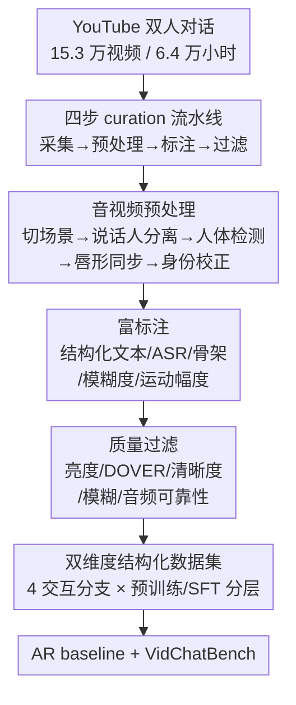

# SpeakerVid-5M: A Large-Scale High-Quality Dataset for Audio-Visual Dyadic Interactive Human Generation

**会议**: ICLR 2026  
**OpenReview**: [https://openreview.net/forum?id=U004uqALWl](https://openreview.net/forum?id=U004uqALWl)  
**代码**: 数据集与处理代码将公开（论文承诺开源）  
**领域**: 人体理解 / 音视频数字人 / 数据集与 Benchmark  
**关键词**: 数字人生成, 双人交互, 音视频对齐, 数据集, 自回归生成

## 一句话总结
针对"主动交互式数字人"这一新兴方向缺乏公开数据的痛点，本文构建了 SpeakerVid-5M——首个面向音视频双人（dyadic）交互数字人生成的大规模高质量数据集（8743 小时、520 万单人 clip、77 万双人对话对），配套提出一个自回归视频对话 baseline 和 VidChatBench 评测基准。

## 研究背景与动机

**领域现状**：随着大规模视频模型的发展，2D 数字人的"驱动 + 渲染"已经做得相当逼真——从早期 GAN 路线（PD-FGC 等）到扩散路线（EMO、OmniHuman-1、MoCha 等），唇形同步、说话头、全身表演的真实感不断刷新 SOTA，已经能支撑自动对口型、数字主播、虚拟演员等工业落地。

**现有痛点**：这些方法本质上都是"被动驱动"——给定音频/文本条件去生成视频，数字人没有"大脑"，不能理解输入、不能主动回应。学术界和工业界更想要的是**主动交互式数字人**：能听懂对方说什么、并自主生成有意义的音视频回应（虚拟助手、电商直播、在线教育都需要）。但训练这种交互式基础模型需要海量专门数据，而**公开的交互式数字人数据集几乎是空白**：现有数据要么规模小质量低（早期说话头/唇读数据），要么太通用质量参差（ACAV-100M），要么干脆不开源（OmniHuman-1 用的数据），即便是新近的 OpenHumanVid、TalkCuts 也只覆盖单人说话头场景、且只部分释放。

**核心矛盾**：双人交互生成（dyadic generation）和传统条件生成是两类任务——传统任务是"音频/文本 → 视频"的模态对齐，而双人交互要求模型**先理解发起者（initiator）的完整多模态内容，再生成应答者（responder）的音频+视频**，对理解和推理能力的要求高一个量级。没有成对的"提问-回应"音视频数据，这条路根本走不通。

**本文目标**：① 造一个大规模、高质量、富标注、音视频严格对齐的双人交互数据集；② 把数据按交互场景和质量两个维度结构化，适配从预训练到 SFT 的不同需求；③ 给出 baseline 方法和标准化评测基准，让后续工作有起跑线。

**切入角度**：从 YouTube 海量真实双人对话视频（访谈、新闻、研讨、综艺、辩论、教育）出发，用一条多模型协同的自动化流水线把"原始长视频"加工成"对齐良好、富标注、按质量分层的 clip"。

**核心 idea**：用"四步 curation 流水线 + 交互类型×数据质量双维度结构化"把 6.4 万小时原始视频提炼成 SpeakerVid-5M，并首次把数字人任务从"条件驱动"推进到"音视频双人交互"。

## 方法详解

### 整体框架

这篇论文的产出有两块：**一个数据集**和**一套配套设施（baseline + benchmark）**。

数据集侧，SpeakerVid-5M 的构建是一条清晰的四步串行流水线：先从 YouTube 人工搜集 15.3 万条双人对话视频（6.4 万小时原始数据）；再经过多步音视频预处理把长视频切成单人 clip 并对齐说话人身份；然后用多模型给每个 clip 打上结构化文本、ASR、骨架、模糊度、运动幅度等富标注；最后用一组质量过滤器筛掉低质数据。产出后，数据沿**两个正交维度**组织：按交互场景分成对话/单人/倾听/多轮四个分支，按数据质量分成大规模预训练子集和精选 SFT 子集。

设施侧，作者在该数据上训练了一个**自回归（AR）音视频对话 baseline**（Qwen2.5-Omni 做多模态理解 + next-chunk 自回归联合生成音视频 token + 空间 transformer + diffusion MLP 精修），并构造了 **VidChatBench**（500 个未见说话人的输入-输出对 + 6 个维度的定制指标）来评测这个新任务。

下面这张图是数据集构建那条主流水线（四步 curation）：

### 关键设计

**1. 四步音视频 curation 流水线：把"脏的长视频"变成"对齐的单人 clip"**

双人交互数据最难的不是"找视频"，而是"把谁在说话、对应哪张脸、音画是否对齐"这些事弄准。本文把构建拆成采集→预处理→标注→过滤四步，核心难点集中在**预处理**：先用 SceneDetect 切场景（丢掉 <3s 的、切开 >14s 的，得到 3–14s 的 clip $S_{sp}$，并记录时序便于后续拼接成长序列）；用 3D-Speaker 做说话人分离，按发言频率和时长选出两个主说话人 $S_{sv}$；用 YOLO 做人体跟踪，按时空框裁出单人 clip $S_{rsp}$；再用 SyncNet 计算 $S_{rsp}$ 与 $S_{sv}$ 的时间重叠段 $S_{ol}$ 上的音画同步置信度，**把置信度最高的人脸框绑定到对应说话人 ID**；最后用 ArcFace 做身份校正——同一原视频里同一说话人 ID 的多个 clip 应当人脸一致，对相似度异常的离群 clip 重新比对、若与别的 ID 更相似就纠正。这一串设计的关键在于"音频侧分离出的说话人 ID"和"视觉侧的人脸框"要靠 SyncNet（音画同步）+ ArcFace（人脸一致性）双重对齐，否则双人场景里很容易张冠李戴。

**2. 富标注：把每个 clip 标到"可细粒度控制生成"的程度**

光有对齐的视频还不够，生成模型需要丰富的条件信号。每个 clip 都配上：用 Qwen2.5-VL 生成的**结构化文本标注**（相机运动、实体列表、身体朝向正/侧、取景半身/全身、详细动作与表情描述），用 Qwen-3 汇总同源视频多 clip 的 ASR 得到对话**主题类别**；**音频标注**（Whisper ASR 转写 + SyncNet 指标 + 3D-Speaker 身份，还额外提供"非目标说话人段替换为静音"的清洗版音频）；用 DWpose 估计的**人体骨架**（脸/手/身，检不到脸的 clip 直接丢）；**模糊度分数**——把脸和手的框裁到 $128\times128$ 后算 Laplacian 方差，值越高越清晰，作者特意把它当条件信号，因为肢体快速运动常带来运动模糊，显式建模能提升这类场景下的生成质量；**运动幅度分数**——用 Qwen2.5-VL 按 1–5 打分（1 极小、5 大幅），而且用**多个不同 persona 的 prompt** 模拟不同标注者视角、剔除离群后取平均，缓解"运动幅度"这种主观量的标注噪声。这套标注把"细粒度可控生成"所需的条件（身份、姿态、清晰度、运动、文本语义）一次性备齐。

**3. 双维度结构化：交互类型 × 数据质量正交切分**

这是数据集"好用"的关键。第一个维度按**交互场景**切成四个分支：**对话分支**（77 万 clip 对 / 1.8K 小时 / 16K 说话人，每个样本是一对"输入-应答"音视频，专门支撑双人交互生成）；**单人分支**（520 万 clip / 8.7K 小时 / 83K 说话人，号称当前最大的说话人数据集）；**倾听分支**（区分"共现倾听"——同屏两人按 SyncNet 分差判定谁在听，和"非共现倾听"——只要 ASR 有效但该人 SyncNet 分低就判为倾听，倾听对由"说话人音轨 + 倾听者静音视频"组成）；**多轮分支**（保留同源视频多 clip 的时序索引，定义对话起始时刻 $x$ 和最大历史长度 $T$，把 $[x-T, x]$ 内的 clip 当作前序轮次，分"上下文多轮"——聚合前序 ASR 当对话上下文，和"序列多轮"——相邻 clip 时间间隔小于阈值 $\delta_t$ 才算同一段连续对话）。第二个维度按**质量分层**：用更严的阈值（手部模糊 >0.5、人脸模糊 >0.7、DOVER >0.6、运动分 >2、ASR 置信度 >−1）筛出 **57.1 万 clip / 1368 小时的高质量 SFT 子集**，剩下的 7375 小时作为大规模预训练子集。两个维度正交，使同一份数据能适配"先大规模预训练再小规模 SFT"的现代训练范式，也能服务说话头、人体动画、多模态对话等多种下游任务。

**4. AR baseline + VidChatBench：给新任务搭起跑线**

为了证明数据可用并提供基线，作者设计了一个自回归 baseline：用 **Qwen2.5-Omni** 的 thinker 对输入音视频做多模态理解，把其隐状态和原始音视频 embedding 一起喂给生成头；视频用 3D-VAE（时间 stride 4、空间 stride 8）编码成 latent patch token，音频用 CosyVoice2 的 tokenizer 编码成离散 token，**一个 latent map + 其对应音频 token 构成一个 chunk**，做 **next-chunk 联合预测**（音视频 token 都注意到所有前序 token 和当前 chunk 内 token）；视觉侧借鉴 MAR/NOVA 用一个**空间 transformer** 做 set-by-set 的逐 token 精修、再用 diffusion MLP 去噪生成精细 latent 供 3D-VAE 解码；训练时给视觉 token **注入随机噪声**以缓解自回归的误差累积。训练分三阶段渐进：视觉预训练（单人数据，ASR+caption 作条件生成视频）→ 音视频联合训练（同时生成视频和音频）→ 高质量双人对话微调。配套的 **VidChatBench** 用 500 个未见说话人的输入-输出对，从六个维度评测：视频质量（FID/FVD/PSNR/SSIM）、身份保持（ArcFace 逐帧与参考图的余弦距离）、对话连贯性（为每个样本造 5 个不同质量候选回应、按排名赋分 [0.2,0.4,0.6,0.8,1.0]，取生成 ASR 与之 CLIP 距离最近候选的分）、音视频一致性（SyncNet 置信度）、情感对齐（Deep3DFaceRecon 提 64 维表情特征算 FID）、音频身份保持（SIM-o 音色相似度）。

### 损失函数 / 训练策略
三阶段渐进训练（视觉预训练 → 音视频联合训练 → 高质量双人对话微调）。视觉目标用 diffusion loss 优化，音频目标用 next-chunk 预测的交叉熵监督。训练阶段对视觉 token 注入随机噪声以抗误差累积。

## 实验关键数据

### 主实验

在 VidChatBench 上对比 Conditioned（文本条件：GT ASR + 详细视频描述）和 Dyadic（直接从发起者音视频生成应答）两种协议，逐步叠加 Audio（联合生成音频）、Spatial（set-by-set 空间 transformer）、Noise（训练噪声注入）三个组件：

| 协议 | 配置 | FID↓ | FVD↓ | PSNR↑ | SSIM↑ | ArcFace↑ | Sync_conf↑ |
|------|------|------|------|-------|-------|----------|-----------|
| Conditioned | base | 56.82 | 55.06 | 15.26 | 0.62 | 0.638 | – |
| Conditioned | +Audio+Spatial+Noise | 34.72 | 30.43 | 17.39 | 0.65 | 0.758 | 2.655 |
| Dyadic | base | 49.97 | 47.23 | 15.74 | 0.62 | 0.637 | – |
| Dyadic | +Audio+Spatial+Noise | **32.35** | **28.82** | **17.55** | **0.66** | **0.772** | **2.698** |

Dyadic 协议（直接用音视频输入）全面优于 Conditioned（用抽象的文本条件），印证"直接音视频输入保留了更细粒度的信息"。

### 消融实验

| 配置（Dyadic） | FID↓ | FVD↓ | ArcFace↑ | 说明 |
|------|------|------|----------|------|
| base | 49.97 | 47.23 | 0.637 | 仅视频生成 |
| +Audio | 49.86 | 36.90 | 0.635 | 联合生成音频，视频质量不退化 |
| +Audio+Spatial | 35.67 | 31.28 | 0.749 | 空间 transformer 大幅提升视觉指标 |
| +Audio+Spatial+Noise | 32.35 | 28.82 | 0.772 | 噪声注入进一步抗误差累积 |

### 关键发现
- **空间 transformer 贡献最大**：从 +Audio 到 +Audio+Spatial，FID 由 49.86 → 35.67、ArcFace 由 0.635 → 0.749，逐 token 精修对视觉质量是质变。
- **联合生成音频不损视频**：加入 Audio 后 FID 几乎不变（49.97→49.86）、FVD 反而下降，说明把音频当额外条件不会拖累视觉保真度。
- **噪声注入有效抗误差累积**：自回归生成易逐帧漂移，训练时注入噪声让 FID 再降到 32.35，验证了这个针对 AR 的稳健性技巧。
- **数据集统计**：93% 视频 ≥1080P、98% >720P；单人分支 520 万 clip / 8.7K 小时，是当前最大说话人数据集；对话分支 77 万对 / 1.8K 小时，首个公开的双人交互资源。

## 亮点与洞察
- **任务定义本身是最大贡献**：把数字人从"条件驱动"推进到"音视频双人交互"，且数据成对收集了"提问"和"回应"两侧——这是端到端训练交互式数字人的前提，填补了公开数据空白。
- **音画对齐靠双重信号兜底**：SyncNet（音画同步）绑定 ID 到人脸框 + ArcFace（人脸一致性）跨 clip 纠错，这套组合拳对双人场景的"谁在说话"判定很关键，可迁移到任何需要 speaker-face 关联的数据清洗。
- **运动幅度的多 persona 标注**：用多个不同 persona 的 prompt 让 MLLM 当"多个标注者"、剔离群取平均，是缓解主观标注噪声的实用 trick，可迁移到任何主观分数标注。
- **模糊度当条件而非只当过滤**：把脸/手的 Laplacian 方差既用于过滤、又显式喂给模型当条件，让模型在运动模糊场景下也能学到合理的清晰度先验。
- **正交双维度结构化**：交互类型 × 质量分层的切法，让一份数据天然适配"预训练 + SFT"现代范式，设计思路可复用到任何大规模多用途数据集。

## 局限与展望
- **baseline 偏初步**：作者明确说这是 AR 范式下的"initial exploration"，绝对指标（FID 32、PSNR 17.5、SyncNet 2.7）距离工业级真实感仍有距离，主要价值在证明数据可用而非刷 SOTA。
- **数据源单一**：全部来自 YouTube 公开视频，受真实对话分布约束（访谈/新闻/综艺为主），极端姿态、强遮挡、多于两人的群体交互覆盖有限。
- **标注依赖现成模型**：结构化文本、运动分、ASR 等都来自 Qwen-VL/Whisper 等模型，会继承这些模型的偏差；motion score 等主观量虽做了去噪但仍有不确定性。
- **伦理与版权**：基于公开 YouTube 数据，隐私、版权、潜在偏见需谨慎对待，仅提供标注与 URL（非原始视频再分发）。
- **改进方向**：扩展到多于两人的群体交互、引入更强的扩散生成头替代 diffusion MLP、把多轮分支真正用于长时记忆对话建模。

## 相关工作与启发
- **vs OpenHumanVid / TalkCuts**：它们规模大但聚焦单人说话头、且只部分释放；本文首次提供公开、大规模、面向**双人交互**的成对音视频数据，并承诺全量开源（含原始数据、标注、处理流水线）。
- **vs OmniHuman-1 用的数据**：后者私有不公开；本文把同量级（百万级 clip、千小时级）的数据公开化，且额外补齐身份、骨架、模糊、运动等富标注。
- **vs ViCo（learning to listen）**：ViCo 只覆盖单人倾听场景；本文的倾听分支区分共现/非共现两类，并把倾听纳入更大的四分支结构。
- **vs BodyofHer（端到端交互 agent）**：BodyofHer 证明了 AR-LLM 范式可做端到端交互式数字人但缺公开数据；本文正好补上数据与 benchmark，本文 baseline 也沿用 AR 范式（Qwen2.5-Omni + next-chunk）。

## 评分
- 新颖性: ⭐⭐⭐⭐⭐ 首个公开的音视频双人交互数字人数据集，明确定义并推进了一个新任务方向。
- 实验充分度: ⭐⭐⭐⭐ 数据统计扎实、消融清晰，但 baseline 偏初步、绝对指标仍有距离。
- 写作质量: ⭐⭐⭐⭐ 流水线与分支结构讲解清楚，图表完整。
- 价值: ⭐⭐⭐⭐⭐ 填补公开数据空白 + 提供 benchmark，对交互式数字人方向是基础设施级贡献。

<!-- RELATED:START -->

## 相关论文

- [\[CVPR 2026\] OpenT2M: No-frill Motion Generation with Open-source, Large-scale, High-quality Data](../../CVPR2026/human_understanding/opent2m_no-frill_motion_generation_with_open-source_large-scale_high-quality_dat.md)
- [\[CVPR 2026\] RoMo: A Large-Scale, Richly Organized Dataset and Semantic Taxonomy for Human Motion Generation](../../CVPR2026/human_understanding/romo_a_large-scale_richly_organized_dataset_and_semantic_taxonomy_for_human_moti.md)
- [\[ICLR 2026\] HUMOF: Human Motion Forecasting in Interactive Social Scenes](humof_human_motion_forecasting_in_interactive_social_scenes.md)
- [\[ICML 2026\] Efficient, Validation-Free Intrinsic Quality Estimation for Large-Scale Face Recognition Datasets](../../ICML2026/human_understanding/efficient_validation-free_intrinsic_quality_estimation_for_large-scale_face_reco.md)
- [\[CVPR 2026\] MimicTalker: A Multimodal Interactive and Memory-Enhanced Framework for Real-Time Dyadic 3D Head Generation](../../CVPR2026/human_understanding/mimictalker_a_multimodal_interactive_and_memory-enhanced_framework_for_real-time.md)

<!-- RELATED:END -->
