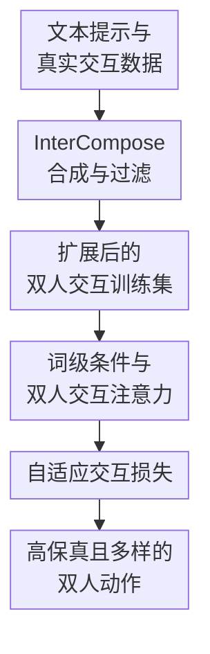

# Text2Interact: High-Fidelity and Diverse Text-to-Two-Person Interaction Generation

**会议**: ICLR2026  
**OpenReview**: [https://openreview.net/forum?id=cthzUgBUn7](https://openreview.net/forum?id=cthzUgBUn7)  
**代码**: https://github.com/Qingxuan-Wu/Text2Interact  
**领域**: 人体理解 / 双人交互动作生成  
**关键词**: 文本到动作生成, 双人交互, 人体动作合成, 细粒度文本条件, 合成数据扩展  

## 一句话总结
Text2Interact 面向文本驱动的双人 3D 交互动作生成，先用 InterCompose 从 LLM 文本和单人动作先验合成高质量交互数据，再用 InterActor 的词级文本条件、双人动作交互注意力和自适应交互损失提升动作真实性、文本对齐和跨分布泛化。

## 研究背景与动机
**领域现状**：文本到人体动作生成已经在单人动作上形成了比较成熟的路线，从 VAE、扩散模型到 masked transformer，都能根据一句文本生成自然的行走、跳跃、挥手等动作。双人交互生成则更难，因为输出不只是两条各自合理的骨架序列，而是两个角色在同一时间和空间里互相回应：谁先发起动作、谁反应、接触发生在哪些身体部位、两个人的位置和节奏是否匹配，都会直接决定结果是否像真实交互。

**现有痛点**：第一类瓶颈来自数据。InterHuman 这类双人交互数据集只有数千条序列，规模远小于 HumanML3D 等单人动作数据，覆盖不了足够多的打斗、舞蹈、协作、扶持、道歉、训练等复杂情境。模型如果只在这些有限样本上学习，很容易在训练分布内还算稳定，一遇到新颖提示词就生成僵硬、重复或语义缺失的动作。

**现有痛点**：第二类瓶颈来自文本建模粒度。双人交互的 caption 往往比单人动作描述更长，里面包含发起者、响应者、动作顺序、接触部位和情绪状态等线索；但很多旧方法把整句文本压成一个句向量，再用 AdaLN 或句级条件注入动作网络。这样做会把“一个人拉绳，另一个人被拉过去，最后前者赢得拔河”这类结构化提示揉成一个整体语义，模型未必知道最后的“赢得拔河”也要在动作末尾体现出来。

**核心矛盾**：双人交互生成同时需要更广的数据覆盖和更细的语义控制。仅靠真实 MoCap 采集成本高、扩展慢；仅靠现有生成模型直接端到端训练，又会受限于稀疏双人数据和粗粒度文本条件。论文的判断是：覆盖度应该借助可扩展的“单人动作先验 + 语言先验”组合获得，而交互忠实度则要靠词级语言监督和接触相关的空间损失来补足。

**本文目标**：作者把问题拆成两个子任务：一是如何在不额外采集大规模双人 MoCap 的情况下，得到多样且可信的双人交互训练样本；二是如何让文本到交互模型真正读懂长 caption 中的角色分工、时序关系和接触线索，而不是只匹配一个模糊的全句语义。

**切入角度**：Text2Interact 的关键观察是，很多双人交互可以被看成“一个人的动作条件 + 另一个人的反应动作”。如果先用强单人动作生成器生成某个角色的动作，再训练一个反应生成模型根据该动作和完整交互文本生成另一个角色，就能复用大规模单人动作先验；同时，用神经评估器过滤低质量样本，可以避免合成数据把噪声也带进训练集。

**核心 idea**：用 InterCompose 扩展双人交互数据覆盖，用 InterActor 在生成时保留词级文本线索并显式监督近距离身体关节对，从而把“可扩展的数据”和“细粒度交互建模”连成一条完整路线。

## 方法详解

### 整体框架
Text2Interact 包含两个互补部分。InterCompose 是离线的数据合成器：它从 LLM 生成的双人交互描述出发，将描述拆成两个单人动作提示，用单人文本到动作模型生成其中一个人的动作，再用反应生成模型补出另一人的动作，并通过文本-动作评估器和分布过滤筛掉不对齐或离真实分布过远的样本。InterActor 是最终的文本到双人交互生成模型：它以完整交互文本为条件，交替更新两个人的动作 token，让每个人既看见词级文本线索，也看见对方动作状态，训练时再用自适应交互损失强调真正发生接触或近距离互动的关节对。

形式上，任务输入是一段文本提示 $c_t$，输出是两个人的动作序列 $X = [x_1, x_2] \in \mathbb{R}^{2 \times T \times N \times 3}$。每个人在每一帧的状态包含世界坐标下的全局关节位置和速度、root 坐标系下的局部旋转 6D 表示，以及脚-地接触标记。这个表示让模型既能评估身体姿态，又能建模两个人在世界空间里的相对位置和接触关系。

### 关键设计
**1. InterCompose 合成与过滤：用单人动作先验扩展双人交互覆盖**

InterCompose 针对的是双人交互数据太少的问题。它不是让 LLM 直接“幻想”动作，也不是把两个随机单人动作粗暴拼在一起，而是先把真实 InterHuman 文本标注成粗粒度 theme 和细粒度 tag，例如 greeting、dancing、conflict，以及 synchronized、disarm、intense 等，然后在 theme-tag 空间里采样新的双人交互描述。这样生成的文本既保持真实数据的风格，又能覆盖原数据中少见的组合。

得到双人文本后，系统再用 LLM 把它拆成两个自洽的单人动作描述。比如“一个人挥拳，另一个人交叉双臂格挡并踢腿反击”会被拆成发起者的挥拳动作和回应者的格挡加踢腿动作。随后，MoMask 这样的强单人文本到动作模型先生成一个人的动作 $x_1$，条件扩散反应模型 $D_\theta$ 再学习 $p_\theta(x_2 \mid x_1, c_t)$，根据第一个人的骨架序列和完整双人文本生成第二个人的反应。这个设定把困难的“从零生成两个人”改成“给定一个人的动作，生成合理反应”，显著降低了学习难度，也能复用单人动作数据中更丰富的身体动态。

合成数据如果不筛选，会带来语义错配和分布外噪声。论文因此训练了一个文本-动作对比评估器，把文本和双人动作投到共享嵌入空间，用余弦相似度筛掉低于阈值 $\delta = 0.58$ 的样本；同时使用保留的真实 InterHuman embedding 作为参考，只保留平均近邻距离落在环带 $r_{\min} \le d(f_\phi(x), E_{real}) \le r_{\max}$ 内的样本。内半径避免留下和真实数据过于相似、没有增量价值的样本，外半径避免保留离真实动作分布太远的异常样本。最后，25,000 条合成候选经过过滤后保留约 1,200 条用于微调；进一步扩展时，额外 25,000 条候选又带来总计 2,500 条过滤样本。

**2. 词级条件与双人交互注意力：让动作 token 看见“谁做什么、何时回应”**

InterActor 针对的是文本条件太粗的问题。旧方法常把一整句交互描述压成句向量，导致模型知道大概是“打斗”或“跳舞”，却未必能区分“一个人先踢、另一个人用前臂挡”与“两个人同时训练踢腿”。Text2Interact 改用 frozen CLIP-ViT-L/14 提取词级 token 序列 $T = \{t^{(1)}, \ldots, t^{(L)}\}$，让每个动作 token 通过 cross-attention 动态关注完整文本中的具体词或短语。

一个 InterActor block 先做 word-level conditioning：单人动作特征作为 query，词级文本 token 作为 key/value，注入“pulls the rope”“eventually wins”“kneels down”这类局部语义；再做 motion-motion interaction：每个人先用 self-attention 整理自己的时间序列，再用 cross-attention 读取对方的动作 token，从而建模推拉、同步、阻挡、搀扶等互相依赖。两个角色交替使用共享模块更新，既保持参数效率，也利用了双人交互的对称性：同一套机制可以描述 A 对 B 的反应，也可以描述 B 对 A 的反应。

这个设计的价值在于，它把长文本里的结构线索保留到了生成过程内部，而不是只在开头给模型一个压缩后的标签。定性结果里，InterActor 能在拔河例子中生成“红色角色最终获胜”的后半段动作，也能在跪下伸手、训练结束鞠躬等场景中更完整地覆盖 caption 的晚期语义，这正是词级条件和双人 cross-attention 共同发挥作用的地方。

**3. 自适应交互损失：把监督重点放在真正相关的身体接触上**

双人交互的关键并不在所有关节两两距离都一样重要。握手时手部距离最关键，格挡时前臂和拳脚关系更关键，搀扶时手臂、腰部和躯干位置更关键；如果像 InterGen 的距离图损失那样对所有跨人关节对使用平权监督，模型会把大量不相关的远距离关节也纳入同等优化，反而稀释了接触区域的训练信号。

Text2Interact 引入自适应交互损失 $L_{AdaInteract}$，用真实关节距离的倒数作为权重，让越接近的跨人关节对受到越强监督：

$$
L_{AdaInteract}=\sum_{i=1}^{N}\sum_{j=1}^{N}\frac{1}{d_{ij}+\epsilon}\lVert d_{ij}-\hat{d}_{ij}\rVert^2
$$

其中 $d_{ij}$ 和 $\hat{d}_{ij}$ 分别是真实与预测的两人关节 $i,j$ 之间距离，$\epsilon=0.1$ 用来避免距离过小时权重爆炸。这个损失并不需要预先知道“这句话里应该接触哪两个关节”，而是从真实动作中的几何近邻自动获得监督重点：真正靠近的手、脚、前臂、躯干会得到更高权重，远离且无关的关节对权重自然降低。配合速度、脚接触、骨长和相对朝向等常规损失，它让生成结果更容易形成可信的物理交互，而不是两个各自合理但彼此穿模或错位的人。

### 一个完整示例
假设输入文本是：“一个人用力把绳子往自己方向拉，另一个人被绳子拽向前，最后第一个人赢得拔河。”InterCompose 在数据合成阶段会先从 theme/tag 中采样出类似“competition / pulling / resisted motion”的交互描述，再拆成两个单人描述：A 是站稳、后仰、双臂拉拽；B 是被拉动、重心前移、逐步失去平衡。MoMask 可以先生成 A 的拉拽动作，反应模型再在 A 的轨迹和完整双人文本条件下生成 B 被拉近的动作；如果生成结果只是在原地挥手，文本-动作相似度会低，可能被过滤掉；如果动作离真实分布太远，例如出现严重扭曲，也会在环带距离过滤中被排除。

训练好的 InterActor 在推理时不再需要先固定某个人的动作，而是同时生成两个人。词级条件让动作 token 能关注“pulls”“being pulled”“eventually”“winner”等词，motion-motion interaction 让 B 的位置变化受 A 的拉拽节奏影响，自适应交互损失则在双手、绳子方向对应的近距离区域给更强监督。最终结果如果表达得好，应该能看到 A 逐渐占据上风、B 被带动靠近，并且末尾动作体现胜负，而不仅是两个人同时做拉伸动作。

### 损失函数 / 训练策略
InterActor 使用 12 个 attention block 和 12 个 word-level conditioning block，二者交错排列。文本编码器采用 frozen CLIP-ViT-L/14，最大文本 token 数为 75；长文本会被截断。扩散过程设置为 1,000 个 denoising step，使用 cosine noise schedule；采样时用 50 步 DDIM，并设置 classifier-free guidance 权重为 3.5。

训练分两阶段。第一阶段只在 InterHuman 训练集上训练 200,000 step，学习标准的双人交互生成能力；优化器为 AdamW，学习率 $5\times10^{-5}$，batch size 为 16，使用 8 张 NVIDIA A100。第二阶段把过滤后的合成数据和 InterHuman 训练集混合，额外微调 50,000 step，学习率降到 $5\times10^{-6}$，主要目标是提升跨分布提示词下的泛化。总损失包含速度损失 $L_{vel}$、脚接触损失 $L_{foot}$、骨长损失 $L_{BL}$、相对朝向损失 $L_{RO}$，以及本文新增的 $L_{AdaInteract}$。

## 实验关键数据

### 主实验
论文在 InterHuman 测试集上比较了单人动作生成扩展方法、早期双人交互方法和最新交互生成模型。Text2Interact 在 R-Precision 三个 rank 上都超过此前最好方法，说明文本-动作匹配更强；FID 略高于 InterMask，但差距只有 0.037，且在置信区间内，作者认为两者运动质量统计上相近。

| 方法 | Top-1 R-Precision↑ | Top-3 R-Precision↑ | FID↓ | MM Dist↓ | Diversity→ | MModality↑ |
|------|-------------------|-------------------|------|----------|------------|------------|
| Ground Truth | 0.452 | 0.701 | 0.273 | 3.755 | 7.948 | - |
| InterGen | 0.371 | 0.624 | 5.918 | 5.108 | 7.387 | 2.141 |
| MoMat-MoGen | 0.449 | 0.666 | 5.674 | 3.790 | 8.021 | 1.295 |
| in2IN | 0.425 | 0.662 | 5.535 | 3.803 | 7.953 | 1.215 |
| InterMask | 0.449 | 0.683 | 5.154 | 3.790 | 7.944 | 1.737 |
| Text2Interact | 0.483 | 0.717 | 5.191 | 3.778 | 7.900 | 1.051 |

主结果最重要的信号是 Top-1 从 InterMask 的 0.449 提升到 0.483，Top-3 从 0.683 提升到 0.717。对交互生成来说，这比单看 FID 更有解释力，因为模型不仅要生成像人的动作，还要把长文本中的时序和角色关系落实到动作里。MM Dist 也从 3.790 降到 3.778，说明文本与动作嵌入距离进一步缩小。

论文还做了 out-of-distribution 文本下的用户研究。19 位评估者比较 InterActor 和 InterMask，结果显示 81.1% 的偏好选择 Text2Interact 的文本-动作一致性，80.0% 的偏好选择其动作质量。这说明 InterCompose 带来的合成数据和 InterActor 的细粒度建模，在标准 embedding 指标之外也改善了人眼感知到的泛化能力。

| 用户研究设置 | 文本-动作一致性偏好 | 动作质量偏好 | 说明 |
|--------------|--------------------|--------------|------|
| InterActor vs InterMask | 81.1% vs 18.9% | 80.0% vs 20.0% | OOD 文本提示下，用户明显偏好本文方法 |
| 无微调 vs 合成数据微调 | 33.7% vs 66.3% | 37.2% vs 62.8% | 过滤合成数据提升泛化和主观质量 |
| 1.2k 合成数据微调 vs 2.5k 合成数据微调 | 30.5% vs 69.5% | 35.8% vs 64.2% | 合成数据规模继续扩大后仍有收益 |

### 消融实验
消融实验分别去掉词级条件模块 WLC、自适应交互损失 AIL 和合成数据微调 FT。结果显示，只用最基础组件时 Top-1 为 0.441、FID 为 6.237；加入词级条件或自适应交互损失后，文本匹配和 FID 都明显改善；完整模型在 FID 上达到 5.191，是表中最好的配置。

| 配置 | Top-1 R-Precision↑ | Top-3 R-Precision↑ | FID↓ | MM Dist↓ | Diversity→ | 说明 |
|------|-------------------|-------------------|------|----------|------------|------|
| 去掉全部本文组件 | 0.441 | 0.681 | 6.237 | 3.781 | 7.959 | 近似基础交互生成器 |
| 去掉 AIL 和 FT | 0.484 | 0.710 | 6.192 | 3.779 | 7.853 | 保留 WLC，文本匹配明显提升但质量不足 |
| 去掉 WLC 和 FT | 0.484 | 0.711 | 5.877 | 3.779 | 7.851 | 保留 AIL，FID 优于基础模型 |
| 去掉 FT | 0.485 | 0.721 | 5.701 | 3.777 | 7.904 | 真实数据训练已很强，合成数据主要补泛化 |
| 完整模型 | 0.483 | 0.717 | 5.191 | 3.778 | 7.900 | FID 最佳，整体最均衡 |

合成数据过滤的消融也很关键。微调前 FID 为 5.701；当过滤环带设为 $0.25 < d < 0.6$ 时，FID 反而变差到 5.981；设为 $0.3 < d < 0.6$ 时回到 5.682；设为 $0.35 < d < 0.6$ 时达到 5.191。这个趋势说明“合成得越多越好”并不成立，必须保留足够新颖但仍贴近真实运动分布的样本，才能真正改善生成质量。

### 关键发现
- 词级文本条件主要提升长交互描述的语义覆盖，尤其是动作顺序和结尾状态；定性对比中，InterActor 能更好表现“最终获胜”“训练结束鞠躬”“跪下伸手”等容易被句级条件遗漏的后段语义。
- 自适应交互损失对动作质量有明显贡献。即使没有合成数据微调，保留 AIL 的配置 FID 为 5.877，优于只保留 WLC 的 6.192，说明近距离关节对监督能帮助模型生成更自然的身体关系。
- 合成数据的收益主要体现在泛化，而不一定在标准 InterHuman embedding 指标上全面变好。论文特别指出，用户研究能捕捉到标准评估器未充分衡量的 pose robustness 和 OOD 文本一致性。
- InterCompose 的过滤不是装饰步骤。未经合理分布过滤的合成动作在用户研究中不如 InterActor 稳定；经过过滤后，InterCompose 合成动作在文本匹配和动作质量上反而能超过 InterActor 生成结果，说明过滤后的合成数据本身质量较高。

## 亮点与洞察
- Text2Interact 最有价值的地方是把双人交互生成的两个瓶颈拆开解决：InterCompose 管数据覆盖，InterActor 管模型对齐。很多论文只改网络结构或只扩数据，这篇把“数据如何来”和“模型如何用”做成闭环。
- InterCompose 的反应生成设定很实用：给定一个人的单人动作，再生成另一个人的响应，比直接从文本同时生成两个人更容易利用已有单人动作模型。这个思路可以迁移到多人动作、人与物体交互，甚至机器人协作中的“给定主动作生成配合动作”。
- 词级 conditioning 是一个看似简单但很对症的设计。双人交互 caption 的信息密度高，句级 embedding 把角色、时序、接触全部混在一起；让 motion token 自己去 attend 到词级 token，更符合“不同身体部位和不同时间段对应不同词”的结构。
- 自适应交互损失的巧妙之处在于不需要人工标注接触部位。它用真实跨人关节距离自动给监督加权，既保留了可微的简单形式，又把优化重点从全局平均距离转向真正发生互动的近邻关节。
- 用户研究设计补上了标准指标的盲区。InterHuman evaluator 由真实训练分布学来，可能低估 OOD 文本下的泛化差异；论文用 LLM 新生成提示词做主观比较，更贴近实际应用中“用户随便输入一句复杂交互”的场景。

## 局限与展望
- 论文明确承认 InterActor 没有显式物理约束，因此仍可能产生漂浮、脚穿地、身体穿插等物理伪影。自适应交互损失能改善近距离关节关系，但它不是完整的物理仿真或接触力模型。
- InterCompose 依赖 LLM 生成文本和拆分单人描述，也依赖 MoMask 的单人动作先验。若 LLM 生成的交互文本带有文化偏见、动作不合理，或单人动作生成器本身覆盖不足，合成数据仍可能把这些偏差传给最终模型。
- 合成数据过滤只保留 25,000 条候选中的约 1,200 条，说明当前生成-过滤效率并不高。后续可以考虑把评估器反馈融入生成过程，而不是先大量生成再离线筛选。
- 模型主要处理两个人的身体动作，不涉及面部、手指细节、物体状态和真实场景约束。对于握手、递物、抢夺、搀扶等需要手部或物体精确接触的任务，当前骨架级动作仍可能不够细。
- 未来一个自然方向是从视频学习交互组合，而不仅从单人动作先验合成。若能从真实视频中抽取双人接触、遮挡和环境关系，Text2Interact 的数据扩展路线会更接近开放世界。

## 相关工作与启发
- **vs InterGen**: InterGen 是扩散式多人体交互生成的重要基线，但其文本条件和距离图监督相对粗粒度。Text2Interact 在它的任务设定上继续推进，用词级条件替代句级压缩，并用自适应距离权重强调真正相关的跨人关节对。
- **vs InterMask**: InterMask 使用 collaborative masked modelling 和时空注意力提升双人生成质量，是本文最强对比对象之一。Text2Interact 的优势在于更细的文本 token 对齐和合成数据扩展，在 R-Precision、用户研究和复杂语义覆盖上更强；但 InterMask 的 FID 略低，说明纯分布质量上两者非常接近。
- **vs in2IN**: in2IN 通过个体信息增强人际交互生成，强调 individual descriptions 的利用。Text2Interact 也拆分单人描述，但它把拆分主要用于 InterCompose 数据合成，并在最终生成器中仍以完整交互文本进行词级建模，路线更偏“用个体描述扩数据，用完整文本控生成”。
- **vs ComMDM**: ComMDM 用桥接网络组合两个单人 motion diffusion prior，证明单人生成先验可以服务双人任务。Text2Interact 更进一步，不只是组合两个单人输出，而是训练条件反应模型并引入神经过滤器，让合成数据可以反过来微调最终交互模型。
- **启发**: 对很多小数据交互任务来说，最现实的策略可能不是等待更大 MoCap 数据集，而是用强单体生成器、LLM 场景描述和任务特定过滤器构造“可控的合成数据飞轮”。关键是必须有足够强的筛选机制，否则合成数据规模只会放大噪声。

## 评分
- 新颖性: ⭐⭐⭐⭐☆ InterCompose 的“单人先验 + 反应生成 + 双阶段过滤”和 InterActor 的词级交互建模组合完整，单个模块不算颠覆，但系统化解决了双人交互生成的关键瓶颈。
- 实验充分度: ⭐⭐⭐⭐⭐ 主实验、消融、过滤分析、定性可视化和多组用户研究都覆盖到了，尤其重视 OOD 文本泛化这一标准指标容易忽略的问题。
- 写作质量: ⭐⭐⭐⭐☆ 论文结构清晰，方法和实验主线明确；不过 InterCompose 中过滤超参数的选择依据仍偏经验，部分实现细节需要读附录才能完全复现。
- 价值: ⭐⭐⭐⭐⭐ 对动画、XR、具身智能和社交动作数据扩展都有直接价值，也给小规模交互数据任务提供了一条很可复用的合成-过滤-微调路线。

<!-- RELATED:START -->

## 相关论文

- [\[ICLR 2026\] ReactDance: Hierarchical Representation for High-Fidelity and Coherent Long-Form Reactive Dance Generation](reactdance_hierarchical_representation_for_high-fidelity_and_coherent_long-form_.md)
- [\[CVPR 2026\] 4DSurf: High-Fidelity Dynamic Scene Surface Reconstruction](../../CVPR2026/human_understanding/textit4dsurf_high-fidelity_dynamic_scene_surface_reconstruction.md)
- [\[CVPR 2026\] Mobile-VTON: High-Fidelity On-Device Virtual Try-On](../../CVPR2026/human_understanding/mobile_vton_ondevice_virtual_tryon.md)
- [\[CVPR 2026\] ReMoGen: Real-time Human Interaction-to-Reaction Generation via Modular Learning from Diverse Data](../../CVPR2026/human_understanding/remogen_real-time_human_interaction-to-reaction_generation_via_modular_learning_.md)
- [\[ICLR 2026\] Motion-Aligned Word Embeddings for Text-to-Motion Generation](motion-aligned_word_embeddings_for_text-to-motion_generation.md)

<!-- RELATED:END -->
