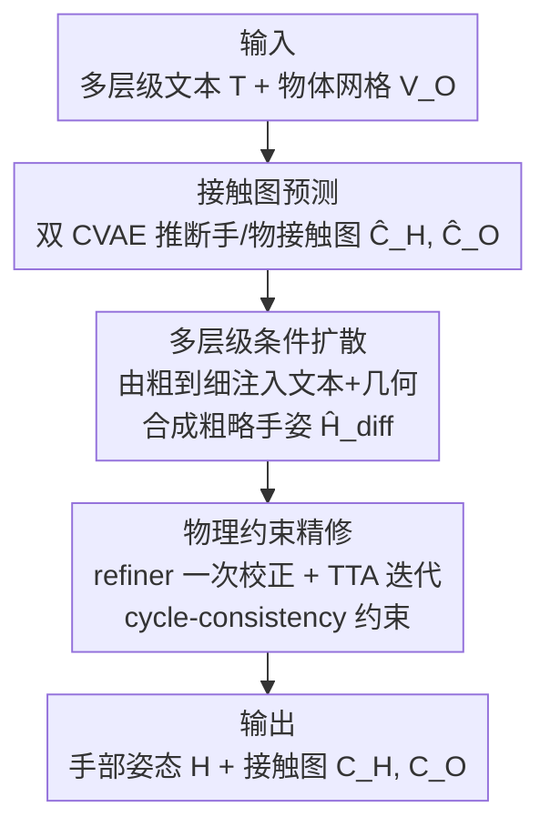

# TOUCH: Text-guided Controllable Generation of Free-Form Hand-Object Interactions

**会议**: ICLR 2026  
**OpenReview**: [https://openreview.net/forum?id=4VW9HVCRw0](https://openreview.net/forum?id=4VW9HVCRw0)  
**项目页**: [https://guangyid.github.io/hoi123touch/](https://guangyid.github.io/hoi123touch/)  
**代码**: 见项目页  
**领域**: 人体理解 / 手物交互生成 / 3D 生成  
**关键词**: 手物交互, 自由形态交互, 接触图, 多层级扩散, 文本控制

## 一句话总结
本文提出"自由形态手物交互（Free-Form HOI）生成"新任务，配套从网络视频自动重建的 in-the-wild 3D 数据集 WildO2，并设计三阶段框架 TOUCH（接触图预测 → 多层级条件扩散 → 物理约束精修），让模型摆脱"稳定抓取"先验，能按细粒度文本指令生成推、戳、转等多样且物理合理的手部姿态。

## 研究背景与动机
**领域现状**：手物交互（HOI）生成是 AR/VR、机器人、具身智能的基础能力。已有工作从"保证物理合理"逐渐发展到"加入语义可控"，但控制信号要么是力闭合（force closure）这类物理约束，要么是"动词-名词"这种粗粒度指令，即便用 LLM 把语言描述写得很详细也一样。

**现有痛点**：这些方法的模型设计和归纳偏置从根上就是为"抓取"服务的——过于笼统的条件天然偏向生成稳定的握持姿态，牺牲了交互多样性。结果是无法刻画日常生活中大量的非抓取交互（push、poke、rotate 等），也缺乏对手部姿态、接触细节、细微语义意图的精细控制。

**核心矛盾**：自由形态交互的根本难点有两个——"生成什么"和"怎么生成"。前者是空间合理性：手部自由度极高，若不靠抓取先验（手掌位置/朝向、接触区域假设）来约束，搜索空间巨大且大量是物理上不可行的姿态；后者是语义可控性：要把细粒度文本精确映射到具体的手部构型和接触区域。而最大的拦路虎是缺数据——现有 3D HOI 数据集几乎都是实验室里的抓取场景、物体种类有限，真实世界大规模 3D 采集又受硬件和遮挡所限。

**本文目标**：定义并解决 Free-Form HOI 生成任务，要求在细粒度意图条件下生成可控、多样、物理合理的交互；同时提供能支撑该任务的 in-the-wild 3D 数据。

**切入角度**：作者提出用"接触关系（contact）"作为约束高维交互空间的强线索——比起规定手掌位置，接触图能更细腻地刻画"哪根手指的哪个部位碰到物体的哪里"，从而把合理姿态从巨大空间里框出来；语义侧则借助 LLM 的先验把文本映射到接触与姿态。数据侧则转向网上海量 2D HOI 视频，自动重建成 3D。

**核心 idea**：以接触图为桥梁、以多层级文本由粗到细地控制扩散过程，再用自监督物理约束精修，把 HOI 生成从"抓取中心"扩展到"自由形态"。

## 方法详解

### 整体框架
给定多层级文本提示 $T$ 和物体网格 $V_O$，TOUCH 要输出手部姿态参数 $H$（MANO）以及手、物两侧的接触图 $C_H, C_O$。整个生成是三阶段串行：先由**接触图预测**根据文本和物体几何推断手/物表面可能的接触区域，作为强空间先验压缩巨大的姿态空间；再由**多层级条件扩散**把由粗到细的文本与几何特征注入 Transformer，合成一个粗略手姿；最后由**物理约束精修**修正全局漂移、消除穿模、贴合接触细节。这套生成框架依赖一个离线构建的数据集 **WildO2**——它本身是本文的核心贡献，从网络视频自动重建出 4,414 条带细粒度语义标注的 3D HOI 样本。

### 关键设计

**1. WildO2 数据集与 O2HOI 配对重建：没有日常 3D HOI 数据，就从网络视频自动造**

自由形态交互的最大障碍是缺 3D 训练数据，而真实场景里手会严重遮挡物体、导致直接重建质量很差。作者的破局点是一个"仅物体帧 → 手物交互帧"（Object-only to HOI, **O2HOI**）配对策略：从 Something-Something V2 里筛出 8k 条单手单物的目标导向片段，每条自动抽出一帧无遮挡的纯物体帧 $I_{ref}$ 和一帧交互帧 $I_{hoi}$；先用 SAM2 在 $I_{ref}$ 上分割出完整物体掩码，再通过稠密匹配模型把掩码迁移到 $I_{hoi}$ 得到 $M_{inpaint}$。这一步绕开了 diffusion inpainting 的几何不一致，也比人工补全可扩展得多。

拿到配对后用三阶段重建：**Stage 1** 用 image-to-3D 从 $I_{ref}$ 重建带纹理的物体网格、用手部重建估初始 MANO 参数；**Stage 2 相机对齐**解决"物体在 $I_{ref}$ 的规范空间、手在 $I_{hoi}$ 的相机空间"的坐标错位，通过可微渲染优化相机投影矩阵与外参，损失先用 mask IoU + Sinkhorn + 边缘惩罚粗对齐，IoU 过阈后再引入尺度不变深度和 RGB 重建损失精修：

$$\min_{K,R,t}\ L_{cam} = L_{mask} + L_{sinkhorn} + L_{edge} + \lambda_{fine}(L_{depth} + L_{rgb})$$

**Stage 3 手物精修**从相机中心沿交互掩码内像素投射射线，射线与手/物几何的交点界定 3D 接触区，再用 2D 证据加 3D 物理约束优化手参数 $L_{align} = L^H_{mask} + L_{j2d} + L_{icp} + L_{phy}$。最终经人工筛检得到 4,414 条样本。数据集还配了多层级标注：模板化短描述 SSC、VLM 生成并人工校验的细粒度描述 DSC、稠密接触图、以及把手网格切成 **17 个部位**（含指甲、指节、掌侧/背侧）的细粒度分割——背侧接触是抓取数据集普遍忽略的，正是自由形态交互所需。

**2. 接触图预测：用接触关系把巨大的姿态空间先框出来**

为生成超越抓取的多样交互，作者先不直接生成手姿，而是用两个独立但结构相似的 CVAE 分别预测物体侧、手侧的二值接触图。物体分支从网格采 $N_O=3000$ 点云、归一化并记录尺度因子 $s_O$，用 PointNet 提几何特征拼成物体条件 $F_O$；手分支从 MANO 零姿态生成 $N_H=778$ 的规范点云，叠加由细粒度文本 $T_{DSC}$ 初始化的手部部位掩码，经 PointNet 得手条件 $F_H$——这样既保留点云拓扑结构，又用文本把注意力引到交互相关的手部区域。两个 CVAE 都以各自几何特征和共享文本特征 $F_{DSC}$（Qwen-7B 经轻量 adapter 提取）为条件，目标是

$$L_{contact} = L_{focal} + L_{dice} + \beta L_{KL}$$

推理时从高斯先验采样并解码出二值接触图 $\hat{C}_O, \hat{C}_H$。先确定"碰哪儿"再生成"怎么摆"，等于给后续高自由度的姿态生成提供了强空间先验，显著降低了不确定性。

**3. 多层级条件扩散：全局由粗、局部由细，分阶段注入控制**

核心是一个基于 Transformer 的 DDPM，但它直接预测去噪后的数据 $\hat{x}_0 = f_\theta(x_t, t, y)$ 而非噪声，用姿态参数上的 L2 损失 $L_{diff} = \mathbb{E}_{t,\epsilon}[\|\hat{x}_0 - x_0\|^2]$ 训练。关键在于"由粗到细"地把条件注入 $N_{inj}=8$ 个 Transformer block：**早期阶段（$i<4$）**只注入全局上下文——物体/手的全局几何特征、尺度、粗粒度文本 $F^{SSC}_{qwen}$，先把整体姿态定下来；**后期阶段（$4\le i<8$）**切到细粒度，注入局部特征——借接触图 $\hat{C}$ 自适应选出接触附近的 $N^O_{loc}=128$ 个物体点和 $N^H_{loc}=64$ 个手点的局部特征 $\tilde{F}^O_{loc}, \tilde{F}^H_{loc}$，配合细粒度文本 $F^{DSC}_{qwen}$ 精修手指等局部动作。每个 block 内，全局条件 $y^i_{glb}$ 用 FiLM 调制主特征，局部条件 $y^i_{loc}$ 经 cross-attention 注入空间线索，二者解耦了"全局语境引导"和"局部几何精修"。训练时对全局条件各分量以 10% 概率随机丢弃，避免过度依赖单一条件。除主损失外还加两个辅助项：全局姿态损失直接监督手的全局旋转 $r_{rot}$ 和平移 $T$（因为 $H$ 里 shape/pose/旋转/平移数值范围悬殊，直接回归易整体漂移），距离图损失监督 21 个手关节到物体表面的距离图 $d_{map}$ 以保证精确接触：

$$L_{total} = L_{diff} + \lambda_{global}(|\hat{r}_{rot}-r^{gt}_{rot}| + |\hat{T}-T^{gt}|) + \lambda_{dmap}|\hat{d}_{map}-d^{gt}_{map}|$$

**4. 物理约束精修：用自监督循环一致性把漂移的手拉回物体表面**

自由形态生成里手经常"够不着"物体（global pose drift），导致根本没接触。作者加一个继承扩散模型 Transformer 架构的轻量 refiner：先一次前向快速校正初始姿态 $\hat{H}_{diff}$ 的全局定位、建立主接触，再做 $N_{tta}$ 次测试时优化（TTA）微调手指落点等局部细节。精修由自监督的**循环一致性损失** $L_{cyc}$ 主导——它要求手上一个接触点经映射 $\Phi$（手→物）找到最近物体点后，再经反向映射 $\Psi$（物→手）应能回到原位，反之亦然，从而压制接触映射本身的歧义：

$$L_{refiner} = L_{phy} + \lambda_{cyc}\big(\mathbb{E}_{P_h\in PC_H}\|\Psi(\Phi(P_h))-P_h\|_1 + \mathbb{E}_{P_o\in PC_O}\|\Phi(\Psi(P_o))-P_o\|_1\big)$$

配合 $L_{phy}$（接触、穿透、解剖约束）共同优化。这一步是把"抓取任务里靠先验白送的接触"在自由形态下显式补回来。

### 损失函数 / 训练策略
模型在 WildO2 上按手部接触类别 4:1 划分（约 3.7k 训练 / 677 测试），对长尾的手部部位标签聚合 10 个低频类后用 7-bit 唯一标签重采样平衡。Adam 优化、学习率 1e-4、batch 128、训练 1000 epoch；训练 refiner 时冻结扩散模型参数。评测分四个维度：接触准确度（IoU、F1）、物理合理性（MPVPE、穿透深度 PD、穿透体积 PV）、多样性（熵、cluster size）、语义一致性（点云 P-FID、VLM 评测、10 人感知打分 PS）。注意作者不用基于物理引擎的稳定性仿真指标，因为自由形态交互范围远超力闭合抓取。

## 实验关键数据

### 主实验
在 WildO2 测试集上与两类代表性 baseline 比较：ContactGen（物体条件、粗手部标签的多层 CVAE）和 Text2HOI（粗文本条件的 Transformer 扩散，去掉时间轴适配本设定）。为公平，两者都额外加了基于优化的后处理来纠正手部漂移。

| 方法 | P-IoU↑ | P-F1↑ | MPVPE↓ | PD↓ | PV↓ | P-FID↓ | VLM↑ | PS↑ |
|------|--------|-------|--------|-----|-----|--------|------|-----|
| ContactGen | 0.620 | 0.730 | 5.46 | 1.296 | 7.37 | 6.08 | 4.8 | 6.3 |
| Text2HOI | 0.711 | 0.795 | 4.69 | 1.239 | 4.93 | 15.72 | 6.5 | 7.5 |
| **Ours** | **0.776** | **0.844** | **2.97** | **0.932** | **2.67** | **4.13** | **7.1** | **8.8** |

TOUCH 在接触准确度、物理合理性、语义一致性上几乎全面领先：MPVPE 从 4.69 降到 2.97，穿透体积 PV 从 4.93 降到 2.67，P-FID 从 Text2HOI 的 15.72 大幅降到 4.13。

### 消融实验
关闭 TTA 后做组件消融（Ours(✗TTA) 为对照基线）：

| 配置 | P-IoU↑ | P-F1↑ | MPVPE↓ | P-FID↓ | 说明 |
|------|--------|-------|--------|--------|------|
| Ours(✗TTA) | 0.728 | 0.805 | 3.00 | 4.84 | 完整模型（关 TTA） |
| ✗ hoc.（去掉接触引导 $M_O,M_H$） | 0.492 | 0.611 | 4.93 | 5.41 | 接触准确度暴跌 |
| ✗ refiner | 0.513 | 0.621 | 5.05 | 5.84 | PD/PV 假性变低（手飘走根本没接触） |
| ✗ $L_{cyc}$ | 0.702 | 0.787 | 3.00 | 5.79 | 接触一致性变差 |
| ✗ mul.（去多层级结构） | 0.525 | 0.631 | 5.00 | 6.84 | 接触准确度大跌 |
| ✗ $T_{DSC}$（去细粒度文本） | 0.698 | 0.784 | 3.02 | 6.09 | 语义保真下降 |
| ✗ $T_{SSC}$（去粗粒度文本） | 0.687 | 0.778 | 2.92 | 5.52 | 同上 |
| CLIP / BERT / MPNet 文本编码器 | 0.713/0.705/0.704 | 0.798/0.790/0.788 | — | 4.84/6.08/6.02 | 均不如 Qwen-7B |

### 关键发现
- **接触引导与多层级结构贡献最大**：去掉接触引导（hoc.）或多层级结构（mul.）后 P-IoU 从 0.728 掉到约 0.49–0.53，是掉点最猛的两项，印证"先定接触、再分层级控制"是骨架。
- **物理指标会骗人**：✗refiner 变体 PD/PV 看着低，其实是手飘离物体、压根没接触，所以作者强调要以接触指标为主、穿透指标只在已接触时才有意义。
- **Qwen-7B 文本编码器更擅长细粒度语义**，优于 CLIP/BERT/MPNet。
- **泛化与可控性**：在 Objaverse 的域外 CAD 模型上仍能生成合理交互；改变接触区域/动词（Push/Lift）能产出多样姿态；模型还隐式学到力度词——"firmly" 比 "gently" 平均接触面积大 22–25%。

## 亮点与洞察
- **O2HOI 配对 + 掩码迁移** 是个很实用的数据工程 trick：用无遮挡帧分割再迁移到遮挡帧，绕开 inpainting 的几何不一致，让"从野外视频自动造 3D HOI 数据"真正可规模化，可迁移到其他遮挡严重的重建任务。
- **以接触图为中间表示** 把"什么是物理合理的交互"显式化，等于在巨大的高自由度空间里先画出靶心，再生成姿态——这是它能跳出抓取先验的关键。
- **由粗到细的分阶段条件注入**（早期全局 FiLM、后期局部 cross-attention）契合扩散去噪从全局到局部的天然节奏，是值得借鉴的条件控制范式。
- **循环一致性自监督** 巧妙地把"接触映射应可逆"作为正则，无需额外标注就压制了手物对应的歧义。

## 局限与展望
- 作者承认框架只处理**静态 HOI 快照**，无法刻画交互的时间动态过程；数据集规模（4.4k）也还有增长空间。
- 不显式建模物理力，力度只能从语义词隐式学到（"firm/gentle"），细粒度力控仍受限。
- 自身观察：整条数据管线依赖多个现成模型（SAM2、image-to-3D、手部重建、Qwen-7B、稠密匹配），重建成功率约 55%（见数据集统计），误差会沿管线传播；接触图为二值、未建模接触强度/方向。
- 改进思路：扩到动态序列（结合视频 + 6-DoF 物体位姿）、把接触图升级为带力度/方向的连续表示。

## 相关工作与启发
- **vs ContactGen**：同样用接触建模 + CVAE，但 ContactGen 只用粗手部标签、面向抓取；本文用细粒度（17 部位）接触 + 多层级文本，能做非抓取的自由形态交互，各项指标显著更优。
- **vs Text2HOI**：都是文本条件的 Transformer 扩散，但 Text2HOI 是粗文本条件、且原本面向时序；本文的多层级（SSC+DSC）由粗到细控制 + 接触先验 + 物理精修，物理合理性和语义保真（P-FID 4.13 vs 15.72）拉开明显差距。
- **vs 模板化/无模板 HOI 重建**：以往野外 3D HOI 重建受限于物体几何多样性和遮挡；本文用 O2HOI 掩码迁移 + image-to-3D 把重建自动化、规模化，作为数据引擎而非终点。

## 评分
- 新颖性: ⭐⭐⭐⭐⭐ 提出自由形态 HOI 新任务、首个野外 3D 日常 HOI 数据集、接触引导+多层级扩散框架，三者成体系
- 实验充分度: ⭐⭐⭐⭐ 主实验+多组消融+文本编码器对比+域外泛化+力度语义分析，但 baseline 仅两个、缺真实场景定量
- 写作质量: ⭐⭐⭐⭐⭐ 任务动机、数据管线、方法三阶段层次清晰，图文配合到位
- 价值: ⭐⭐⭐⭐⭐ 数据集+任务+方法都能成为后续日常 HOI 生成研究的基础资源

<!-- RELATED:START -->

## 相关论文

- [\[ICLR 2026\] SesaHand: Enhancing 3D Hand Reconstruction via Controllable Generation with Semantic and Structural Alignment](sesahand_enhancing_3d_hand_reconstruction_via_controllable_generation_with_seman.md)
- [\[ICLR 2026\] ReactDance: Hierarchical Representation for High-Fidelity and Coherent Long-Form Reactive Dance Generation](reactdance_hierarchical_representation_for_high-fidelity_and_coherent_long-form_.md)
- [\[ICLR 2026\] Human-Object Interaction via Automatically Designed VLM-Guided Motion Policy](human-object_interaction_via_automatically_designed_vlm-guided_motion_policy.md)
- [\[CVPR 2025\] FreeCloth: Free-Form Generation Enhances Challenging Clothed Human Modeling](../../CVPR2025/human_understanding/freecloth_free-form_generation_enhances_challenging_clothed_human_modeling.md)
- [\[CVPR 2026\] Unified Number-Free Text-to-Motion Generation Via Flow Matching](../../CVPR2026/human_understanding/unified_number-free_text-to-motion_generation_via_flow_matching.md)

<!-- RELATED:END -->
