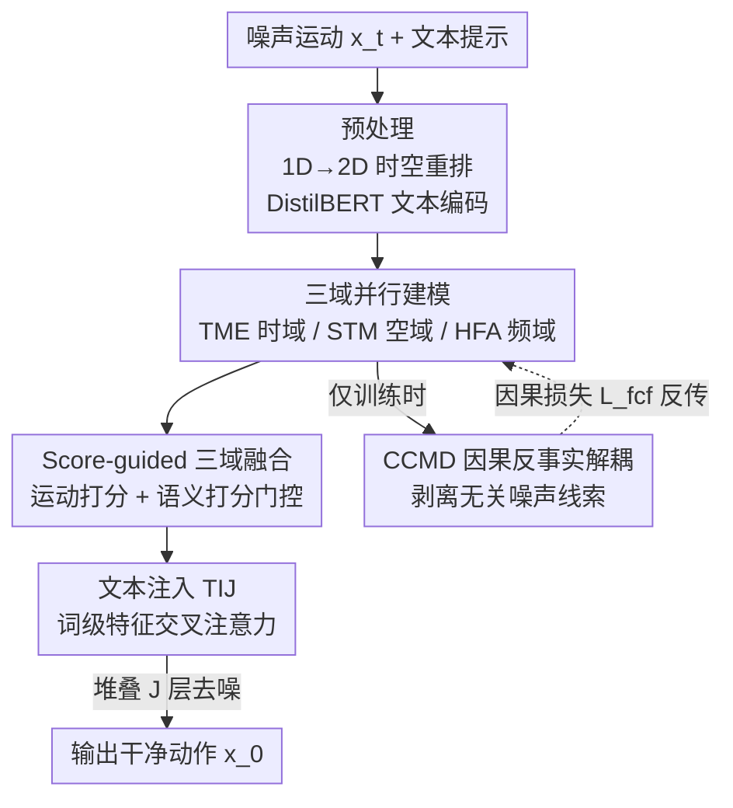

# TriC-Motion: 三域因果建模驱动的文本到动作生成

**会议**: ICLR 2026  
**OpenReview**: [https://openreview.net/forum?id=ROh4oDPVpD](https://openreview.net/forum?id=ROh4oDPVpD)  
**代码**: https://caoyiyang1105.github.io/TriC-Motion/ (有)  
**领域**: 扩散模型 / 文本到动作生成 / 人体理解  
**关键词**: 文本到动作、扩散模型、时-空-频联合建模、因果干预、反事实解耦

## 一句话总结
TriC-Motion 在扩散去噪框架里把人体动作同时放到**时域、空域、频域**三条支路并行建模，再用一个打分门控融合三域信息，并首次引入**因果反事实干预**剥离与动作无关的噪声线索，最终在 HumanML3D 上把 R@1 推到 0.612 的新 SOTA。

## 研究背景与动机

**领域现状**：文本驱动的人体动作生成（text-to-motion）目前主流是扩散类（MDM、MotionLCM 等）和自回归类（T2M-GPT、MoMask 等）两条路线，都以**时域建模**为主——刻画帧间的动态演化、保证序列连贯。后来一批工作进一步加入**空域**先验，比如用图卷积建模关节拓扑（Spatio-Temporal Graph Diffusion）、或用关节 token 注意力（MoGenTS），让生成的姿态在骨架结构上更合理。另一批工作借鉴频谱分析，独立处理**低频/高频**信号：低频管全局运动趋势（走/跑的整体走向），高频管细微的关节抖动（手腕、脚尖的精细动态）。

**现有痛点**：这三个域各自都被验证有用，但**没有一个统一框架把时、空、频三者联合优化**。结果是模型每次只能吃到部分信息——只做时空建模的会丢掉频域的精细动态，只做频域分析的又缺关节拓扑约束，在高动态、复杂的动作（如「先冲刺、突然停、右转、坐下」这种多步指令）上质量明显掉。

**核心矛盾**：把三个域简单堆在一起还有个隐患——**与动作无关的噪声线索会和有益特征纠缠在一起**。在朴素的多域架构里，噪声会跨域累积，越叠越严重，导致动作失真。作者把这归结为模型「分不清哪些是真正驱动动作的内在特征、哪些是混淆性的反事实特征」。

**本文目标**：(1) 设计一个能时-空-频联合建模的扩散框架；(2) 在框架里植入机制，主动把无关噪声从有益贡献中剥离出来。

**切入角度**：从结构因果模型（SCM）的视角看，每个域抽出的特征 $F^i_j$ 其实是内在动作特征 $E^i_j$ 与混淆因子 $C^i_j$ 的纠缠结果，理想情况只想要 $E^i_j \to F^i_j \to x_0$。既然直接删 $C^i_j$ 很难，那就用因果干预 $do(\cdot)$ 把 $C^i_j$ 对 $F^i_j$ 的影响隔离掉。

**核心 idea**：在扩散去噪块里**并行做三域建模 + 打分门控融合**，并用一个**反事实因果干预模块**在训练时暴露并消除无关线索——用三域互补 + 因果净化共同换取更高保真、更对齐文本的动作。

## 方法详解

### 整体框架

TriC-Motion 建立在 MDM 的扩散与采样流程之上，整个网络是堆叠 $J$ 层（论文取 $J=4$）相同的 **TriC-Motion Denoiser Block**。输入是加噪的运动序列 $x_t$ 和文本提示；动作序列先从 1D 时序结构重排成 2D 时空结构 $X \in \mathbb{R}^{N\times M\times D}$（$N$ 下采样帧数、$M$ 关节数、$D$ 特征维），文本侧用预训练 DistilBERT 编码出句级特征 CLS 和词级特征 $\tau$。

每个去噪块内部，运动特征 $X_j$ 被**三个模块并行处理**：时域的 TME、空域的 STM、频域的 HFA，分别产出 $F^{temp}_j$、$F^{spa}_j$、$F^{freq}_j$。三域特征交给 **S-Fus** 模块做打分加权融合得到 $Y_j$，再经 **TIJ** 用交叉注意力把词级文本信息注入（动作做 query、文本做 key/value）。与此同时，**CCMD** 模块在每层对三域特征做因果反事实解耦——但它**只在训练时启用**，推理时不参与。整个 $J$ 层堆叠的过程可写成 $\hat{X} = [\text{TIJ}(\text{S-Fus}(\text{TME}, \text{STM}, \text{HFA}, \text{CLS}), \tau)]\,\|^J_{j=1}$。

### 关键设计

**1. 三域并行建模：让时、空、频在同一去噪块里各管一摊**

这针对「主流方法只吃部分信息」的痛点——TriC-Motion 在每个去噪块里放三条并行支路。**时域 TME** 用一个标准 TransformerEncoderLayer 沿帧维度做注意力，捕捉短程与长程依赖，保证时序连贯：$F^{temp}_j = \text{TransformerEncoderLayer}(X_j)$。**空域 STM** 把每帧骨架看成图（关节为节点、肢段为边），用 3 层 GCN 在关节维度建模拓扑，约束生成姿态的物理合理性：$F^{spa}_j = X_j + [\text{LN}(\text{GELU}(\text{GCN}(X_j)))]\,\|^3$。**频域 HFA** 是最精细的一支：先用离散小波变换 DWT 把序列拆成低频子带 $\hat{S}_{LF}$ 和高频子带 $S_{HF}$，再对低频子带做 FFT。低频支路用两路并行卷积（时间维、关节维）生成 2D 时空注意力矩阵优化全局趋势 $S'_{LF} = S_{LF} + \text{Linear}(S_{LF}\otimes(w_t\otimes w_s))$；高频支路用两个 1D 深度卷积 + 点卷积提取精细局部动态 $S'_{HF} = S_{HF} + \text{GELU}(\text{GN}(f^p(f^d(S_{HF}))))$，最后经 IFFT/IDWT 变换回时空域。三域分工互补：时域管动态演化、空域管拓扑、频域管粗趋势 + 细节。

**2. Score-guided 三域融合：用打分门控代替无脑拼接**

简单把三域特征 concat 起来，等于默认它们对每个场景同等重要，但实际上不同动作对三域的依赖程度不同。S-Fus 用**双分支打分框架**自适应加权：**运动打分** $\text{logits}^i_{mot} = f_{mot}(F^{tri}_j)$ 从三域拼接特征里捕捉跨域相关性；**语义打分** $\text{logits}^i_{sem} = f_{sem}(\text{CAT}(F^i_j, \text{CLS}))$ 借全局语义 token CLS 保证融合时的语义一致。两路 logits 相加后过 softmax 得到域权重 $\alpha_i = \text{Softmax}(\text{logits}^i_{mot} + \text{logits}^i_{sem})$，再加权融合 $Y_j = \text{Linear}(\text{CAT}(X_j, \sum_i \alpha_i F^i_j))$。相比直接拼接，这种按内容打分的门控能在不同动作下动态偏向最有用的那个域，消融里它把 R@1 从 0.592（拼接）拉到 0.607。

**3. CCMD 因果反事实解耦：把无关噪声从有益贡献里"减"出去**

这是全文最核心、也是首次把因果干预引入动作生成的设计，针对「多域噪声累积导致失真」的痛点。CCMD 在每层用对称的轻量双模块——**事实模块**和**反事实模块**——分别从 $F^i_j$ 抽出有益的因果贡献 $E^i_j$ 和混淆因子 $C^i_j$。以事实模块为例，先做注意力门控 $\omega = \text{Sigmoid}(\text{Linear}(\text{ReLU}(\text{Linear}(\text{Pool}(F^i_j)))))$（$\text{Pool} = \text{AvgPool} + \text{MaxPool}$），再 $E^i_j = \text{Linear}(\omega F^i_j)\odot F^i_j$；反事实分支同理得 $C^i_j$。然后做监督式因果干预 $\tilde{F}^i_j = W_{do}E^i_j - W_{do}C^i_j$——本质是把混淆特征**减掉**。训练时用分层因果损失 $L_{fcf} = \sum_j w_j L_{MSE}(TDE_j, x_0)$ 约束干预后的三域特征逼近真值，其中越深的层权重越大（$\{0.1,0.2,0.3,0.4\}$），让深层去噪块更强地抑制混淆因子。由于 CCMD 只在训练时引导梯度、推理零开销，等于「用训练期的因果监督换来推理期更干净的特征」。

### 损失函数 / 训练策略

总损失 $L = L_{simple} + \lambda_{fcf}L_{fcf} + \lambda_p L_p$（$\lambda_{fcf}=1$、$\lambda_p=10$）。其中 $L_{simple} = \mathbb{E}[\|x_0 - f(x_t, t, c)\|^2]$ 是预测干净动作的扩散主目标；$L_{fcf}$ 是上面的分层因果损失；$L_p = \|E(\hat{x}_0) - E(x_0)\|^2_2$ 是用预训练动作编码器 $E$ 在特征空间算的感知损失，提升生成动作的感知质量。扩散步数 50、cosine 噪声调度，$J=4$、$D=256$，base/large 两个变体的时序下采样因子 $s$ 分别取 7 和 4，CFG scale = 4.0，AdamW + 学习率 $1\times10^{-4}$。

## 实验关键数据

### 主实验

HumanML3D（14,616 序列 / 44,970 文本）上，TriC-Motion 在文本对齐相关指标上大幅领先，R@1 与 MM-Dist 超过次优的 SALAD：

| 数据集 | 指标 | 本文 (large) | 次优 (SALAD) | 提升 |
|--------|------|------|----------|------|
| HumanML3D | R@1 ↑ | **0.612** | 0.581 | +0.031 |
| HumanML3D | R@3 ↑ | **0.885** | 0.857 | +0.028 |
| HumanML3D | MM-Dist ↓ | **2.465** | 2.649 | -0.184 |
| HumanML3D | FID ↓ | 0.285 | 0.076 | — |

在更长、更复杂提示的 SnapMoGen（122,565 条描述、平均 48 词）上，R@1 达 0.907，远超次优 MoMask++ 的 0.802，显示对复杂指令的强鲁棒性。

### 消融实验

| 配置 | R@1 ↑ | FID ↓ | MM-Dist ↓ | 说明 |
|------|------|------|---------|------|
| Baseline (MDM) | 0.320 | 0.544 | 5.566 | 起点 |
| TME (2D rep) | 0.470 | 2.110 | 3.293 | 仅时域 |
| TME + STM | 0.570 | 0.611 | 2.617 | 加空域拓扑 |
| TME + HFA | 0.583 | 0.374 | 2.576 | 加频域，FID 降幅最大 |
| TME + STM + HFA | 0.592 | 0.383 | 2.564 | 三域 concat |
| + S-Fus (Full) | **0.607** | 0.347 | 2.463 | 打分融合 |
| w/o CCMD | 0.568 | 0.561 | 2.624 | 去因果干预，R@1 掉 0.039 |

### 关键发现
- **频域 HFA 对保真度（FID）贡献最大**，空域 STM 对语义对齐（R@1、MM-Dist）拉升最猛——两者互补，叠加后进一步提升；说明三域确实各管不同方面。
- **CCMD 必须三域齐上才最有效**：只用在时域 R@1 仅 0.580、加上空域 0.602、三域全开才到 0.607，印证「噪声跨域累积、需要全域净化」的判断。
- **HFA 内部低频 + 高频缺一不可**：去掉 FFT 分支、去掉关节维频率分支、去掉高频带都会掉点，低频管全局趋势、高频管精细动态。
- **因果损失分层权重要递增**：$\{0.1,0.2,0.3,0.4\}$ 优于均匀 $\{0.25\times4\}$ 和只给末层 $\{0,0,0,1\}$，深层块加大权重能更有效抑制混淆因子。
- **用户研究**：38 名参与者打分，文本-动作对齐 4.125、整体质量 3.981，均明显优于 MARDM / MoMask / SALAD。

## 亮点与洞察
- **首次把因果干预引入动作生成**：用「事实-反事实双模块 + 相减」的轻量结构把混淆因子显式减掉，且只在训练时启用、推理零开销，这个「训练期净化、推理期免费」的范式可迁移到其他多模态生成任务。
- **DWT + FFT 混合频域分析**：小波抓局部时频动态、傅里叶抓全局频率模式，再拆低频/高频双支路，是对「频域建模」更细的一种拆法，比单纯低/高频独立分析更充分。
- **打分门控融合**：运动 + 语义双分支打分让模型按内容自适应偏向某个域，比固定权重或拼接更灵活，且把全局语义 CLS 引入融合环节保证一致性。

## 局限与展望
- **FID 反而不是最优**：base 模型 FID 0.347、large 0.285，明显高于 SALAD（0.076）、MoGenTS（0.033）等。论文主打 R-Precision/MM-Dist 的对齐优势，但分布保真度（FID）并未领先，说明三域 + 因果换来的是「更对齐文本」而非「更贴近真实分布」，二者存在取舍。
- **训练成本与模块复杂度**：每个去噪块塞了 TME/STM/HFA/S-Fus/CCMD 五个组件，训练 650K 迭代，结构相对重；CCMD 虽推理免费，但训练期的因果损失和感知损失（需额外预训练动作编码器）增加了训练复杂度。
- **因果建模偏工程化**：所谓「因果干预」实际是事实/反事实特征相减 + MSE 监督，更接近一种受 SCM 启发的特征解耦正则，与严格的因果可识别性还有距离（⚠️ 这是笔者解读，以原文 SCM 论述为准）。

## 相关工作与启发
- **vs MoGenTS / 时空联合方法**：它们做时-空联合建模，本文多加了一条频域支路并用打分门控融合三域，区别在于显式引入频谱分析 + 自适应融合，对高动态动作的细节刻画更强。
- **vs 独立频域分析方法（Li et al. 2024a 等）**：它们独立处理低/高频，本文把频域并入统一的三域框架，并用 DWT+FFT 混合分解，频域只是三域之一而非孤立模块。
- **vs 视觉里的因果方法（causal attention、counterfactual gait）**：那些用在判别/识别任务抑制混淆，本文把反事实干预搬到**扩散生成**的去噪过程中，在生成任务里保留因果贡献、剔除无关线索，是因果在 text-to-motion 上的首次落地。

## 评分
- 新颖性: ⭐⭐⭐⭐⭐ 首次把因果反事实干预引入动作生成，且三域统一框架 + DWT/FFT 混合频域都有新意。
- 实验充分度: ⭐⭐⭐⭐⭐ 两个 benchmark + 多组消融 + 用户研究，三域和 CCMD 的贡献拆解清楚。
- 写作质量: ⭐⭐⭐⭐ 结构清晰、图文齐全，个别模块（CCMD 因果性）的严格性表述偏工程化。
- 价值: ⭐⭐⭐⭐ R@1 显著刷新 SOTA、对齐能力强；但 FID 未领先，落地时需权衡保真度。

<!-- RELATED:START -->

## 相关论文

- [\[ICLR 2026\] Motion-Aligned Word Embeddings for Text-to-Motion Generation](motion-aligned_word_embeddings_for_text-to-motion_generation.md)
- [\[CVPR 2026\] Open the Motion Door: Atomic Motion Decomposition and Recomposition for Open-Vocabulary Motion Generation](../../CVPR2026/human_understanding/open_the_motion_door_atomic_motion_decomposition_and_recomposition_for_open-voca.md)
- [\[ICLR 2026\] Motion-R1: Enhancing Motion Generation with Decomposed Chain-of-Thought and RL Binding](motion-r1_enhancing_motion_generation_with_decomposed_chain-of-thought_and_rl_bi.md)
- [\[CVPR 2026\] Causal Motion Diffusion Models for Autoregressive Motion Generation](../../CVPR2026/human_understanding/causal_motion_diffusion_models_for_autoregressive_motion_generation.md)
- [\[ICLR 2026\] KinemaDiff: Towards Diffusion for Coherent and Physically Plausible Human Motion Prediction](kinemadiff_towards_diffusion_for_coherent_and_physically_plausible_human_motion_.md)

<!-- RELATED:END -->
