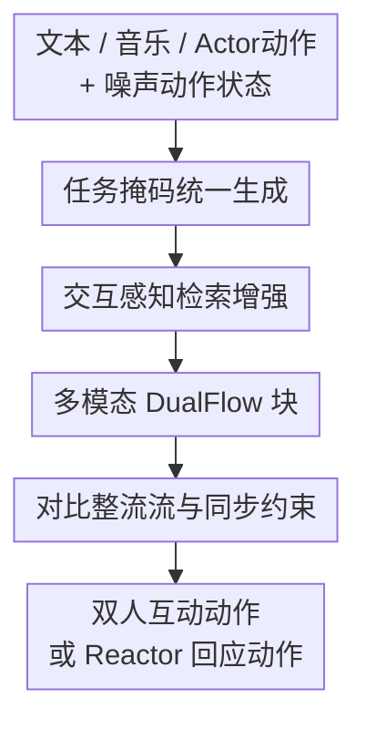

# Unified Multi-Modal Interactive and Reactive 3D Motion Generation via Rectified Flow

**会议**: ICLR2026  
**OpenReview**: [https://openreview.net/forum?id=QaAgHKbJop](https://openreview.net/forum?id=QaAgHKbJop)  
**论文**: [项目页](https://gprerit96.github.io/dualflow-page)  
**代码**: 待开源  
**领域**: 人体理解 / 3D人体动作生成  
**关键词**: 双人动作生成, 反应式动作生成, Rectified Flow, 检索增强生成, 多模态条件  

## 一句话总结
DualFlow 用一个基于 Rectified Flow 的双分支 Transformer 框架，把文本、音乐、演员动作和检索到的双人动作样例统一起来，同时支持双人互动动作生成与 actor-reactor 式反应动作生成，并在 MDD、InterHuman-AS、DD100 上以更少推理步数取得更好的语义对齐、动作质量和双人同步效果。

## 研究背景与动机
**领域现状**：3D 人体动作生成已经从单人 text-to-motion 扩展到多人交互、舞蹈伴随和反应式动作合成。双人场景比单人难得多，因为模型不仅要让每个人的姿态自然，还要让两个人之间的距离、朝向、节奏、接触关系和动作意图互相匹配。实际应用中，这类能力会直接影响虚拟角色、社交机器人、VR/AR 伴侣和游戏 NPC 的真实感。

**现有痛点**：已有方法通常把 interactive motion generation 和 reactive motion generation 分开做。前者从文本或音乐生成一对同步互动的人体动作，后者给定 actor 的动作后生成 reactor 的回应动作；两者在输入、网络结构和训练目标上往往不兼容。另一个问题是条件模态割裂：有的方法只看文本，有的方法只看音乐，有的方法只看 leader/actor 动作，缺少一个能同时利用文本语义、音乐节奏和已有动作上下文的统一模型。

**核心矛盾**：双人动作的关键不只是“生成像人的姿态”，而是“在多模态条件下维持两个人之间的关系”。文本里的 closed hold、triple spin、clockwise rotation 对应空间关系和身体动作，音乐决定节奏和重拍，actor 动作决定 reactor 什么时候跟随、转身或靠近。若模型只把这些条件拼成一个向量，容易出现语义对齐还行但接触错位、节奏脱拍，或者只会反应但不能自由生成双人互动的情况。

**本文目标**：作者希望用一个模型完成两类任务：给定文本和/或音乐时生成完整双人动作；给定 actor 动作加文本/音乐时，只生成 reactor 的回应动作。同时，模型要在较少采样步数下完成推理，并保持动作自然度、语义匹配、音乐节奏对齐和双人同步。

**切入角度**：论文把问题拆成两个互补方向：一方面用 Rectified Flow 替代传统扩散的多步随机去噪，让生成路径从噪声到动作更直、更快；另一方面把双人动作的语义条件显式拆成空间关系、身体动作和节奏，再用检索样例给生成过程提供 interaction-aware 的参考。

**核心 idea**：DualFlow 用“任务掩码 + 多模态双分支块 + 交互感知 RAG + 对比 Rectified Flow”的组合，把互动式和反应式双人 3D 动作生成统一到同一个速度场学习问题里。

## 方法详解

### 整体框架
DualFlow 的输入可以包含文本描述、音乐片段、actor 的历史/当前动作，以及生成过程中的噪声动作状态；输出则根据任务不同而变化：interactive setting 输出 person A 和 person B 的完整双人动作，reactive setting 固定 actor 动作，只生成 reactor 动作。整套方法先把文本、音乐和检索样例编码为多模态条件，再用堆叠的 Multi-Modal DualFlow Blocks 预测 Rectified Flow 的速度场，最后通过 ODE 采样得到干净的 3D 人体动作序列。

模型的一个关键点是“统一但不混淆”。在 interactive 任务中，两个人的分支都参与生成，并通过 Motion Cross-Attention 互相交换信息；在 reactive 任务中，actor 分支作为条件被掩码固定，reactor 分支通过带 Look-Ahead 的因果交叉注意力读取 actor 动作，从而在不完全偷看未来的前提下做自然回应。

从动作表示看，论文沿用 InterGen 风格的 SMPL 运动特征。每一帧包含全局关节位置、全局关节速度、局部 6D 关节旋转和脚接触标记，单人一帧维度为 262；双人动作以 person A 的 root 为全局参考，person B 的位置相对该 root 表示。这让互动关系在同一个坐标系里建模，尤其适合处理两人之间的距离、朝向和接触。

### 关键设计
**1. 任务掩码统一生成：同一套双分支结构同时覆盖互动与反应**

DualFlow 没有为 duet generation 和 reaction generation 训练两套模型，而是在同一个双分支结构里通过输入掩码切换任务。interactive setting 中，person A 和 person B 的带噪动作 $x_a^t, x_b^t$ 都作为待生成变量进入模型，两个分支对称更新，最终同时预测两个人的速度场。reactive setting 中，actor 的动作 $x_a$ 被固定为条件，reactor 的带噪动作 $x_b^t$ 才是生成目标，因此速度场可以写成 $v_\theta(x(t), t, c) = [0; v_{\theta,reactor}(x(t), t, c)]$。

这个设计解决的是任务割裂问题。双人互动生成需要两人共同协同，反应生成需要一人根据另一人的动作做回应；表面上像两种任务，但底层都依赖“跨人关系 + 多模态条件”。DualFlow 把共享部分放进同一套 DualFlow Block，把任务差异交给掩码和注意力模式处理，因此 interactive 数据和 reactive 数据能共同训练一个更通用的双人关系模型。

**2. 交互感知检索增强：把一句动作描述拆成空间、身体和节奏再找样例**

普通文本检索很容易只抓到粗粒度动作词，比如 spin 或 turn，却忽略双人舞里更关键的 closed hold、facing each other、syncopated stepping 等互动细节。DualFlow 用 GPT-4o 把每条文本描述拆成三个 focused descriptions：Spatial Relationship、Body Movement、Rhythm。它们分别对应两人的相对位置/手位、身体部位动作和节奏时序，再用 CLIP-L/14 建立三个文本检索库；音乐侧则用 Jukebox 特征建立音乐检索库。

检索分数不是单纯余弦相似度，而是同时惩罚动作长度不匹配：$s_i^q = \langle f_i^q, f_p^q \rangle \cdot e^{-\lambda |l_i-l_p| / \max\{l_i,l_p\}}$。这样检索到的样例不只是语义相近，也更可能在时间尺度上适合当前片段。四组检索结果 $R_i^S, R_i^B, R_i^R, R_i^M$ 会被投影到动作 latent 空间并拼接成 $z_R$，在每个 DualFlow Block 中通过 Retrieval Cross-Attention 注入生成过程。它本质上给模型提供了“这类双人动作通常长什么样”的可检索先验，而不是让模型只靠参数记忆所有互动关系。

**3. 多模态 DualFlow 块：用时序卷积和多重注意力同时处理节奏、对方动作和检索样例**

每个 DualFlow Block 先用多尺度一维时序卷积捕捉不同时间范围的动作模式，卷积核对应短期接触、转身过渡和更长节奏片段，再用可学习门控权重融合。随后模型依次经过 Self-Attention、Music Cross-Attention、跨人动作注意力和 Retrieval Cross-Attention：Self-Attention 负责单人动作内部的时序连贯，Music Cross-Attention 对齐音乐 latent $z_m$，跨人注意力建模 person A 与 person B 的交互，Retrieval Cross-Attention 从 $z_R$ 中读取检索样例。

interactive 与 reactive 的差异集中体现在跨人注意力。interactive setting 使用 Motion Cross-Attention，让两个待生成分支相互协调；reactive setting 把它换成带 Look-Ahead 的 Causal Cross-Attention，reactor 在第 $i$ 帧只能看 actor 的过去帧和最多 $L$ 个未来帧，即 mask 条件为 $j \leq i + L$。论文实验中 $L=10$，这相当于允许短窗口预判，让 follower 能为即将到来的转身或靠近提前准备，但不会无限制读取整段未来。

**4. 对比整流流与同步约束：让采样路径更快，同时把语义和双人关系拉紧**

DualFlow 的生成主干是 Rectified Flow。给定真实动作 $x_0$ 和噪声 $\epsilon \sim \mathcal{N}(0,I)$，模型沿直线路径构造 $x_t = (1-t)\epsilon + t x_0$，目标速度为 $v_t = x_0 - \epsilon$。训练时网络预测条件速度场 $v_\theta(x_t,t,c)$，并最小化 $L_{flow}=\mathbb{E}\|v_\theta(x_t,t,c)-(x_0-\epsilon)\|_2^2$。相比需要反复随机去噪的扩散模型，这种直线搬运路径更适合少步采样，论文中 20 个 RF steps 就能达到甚至超过 InterGen 50 个 DDIM steps 的质量。

仅有 flow matching 还不够，因为双人动作的“对齐”不完全等价于重建误差。作者加入 triplet contrastive loss，让语义或节奏相近的样本在预测速度空间里更近，差异大的样本更远：$L_{triplet}=\mathbb{E}[\max(0,d(\hat v,v^+)-d(\hat v,v^-)+m)]$，其中 margin $m=0.2$，权重 $\lambda_{triplet}=0.1$。此外，几何损失约束脚接触、速度和骨长，交互损失约束距离图和相对朝向；新增的同步损失 $L_{sync}$ 对跨人关节距离加权，手腕、手部、上肢等在互动中更关键的关节对获得更高权重。这让模型在 close hold、hand-to-hand connection 等场景里更关注两人身体关系，而不仅是逐帧姿态像不像。

### 一个完整示例
假设输入文本是“leader 在 closed hold 中带 follower 做 syncopated natural turn”，同时给定一段带切分节奏的音乐。DualFlow 先把文本拆成三路描述：空间关系可能是“closed position, facing each other, handhold”，身体动作可能是“torso rotation with left leg lead”，节奏可能是“syncopated stepping with rise and fall”。三路文本检索和一路音乐检索各自找到 top-$k$ 的相似双人动作片段，这些片段被编码成 $z_R$。

如果任务是 interactive generation，person A 和 person B 都从噪声动作开始，DualFlow Block 在每一步同时更新两人的 latent：音乐注意力让动作对上节拍，Motion Cross-Attention 让两人的旋转方向和距离变化一致，检索注意力提供 closed hold 和 natural turn 的参考。若任务换成 reactive generation，actor 的动作已经给定，reactor 从噪声开始生成；Causal Cross-Attention 让 reactor 在当前帧读取 actor 的过去和 10 帧短未来，因此 follower 可以在 leader 转身前后完成合理的手位、脚步和朝向响应。

### 损失函数 / 训练策略
总目标由生成、几何和交互三部分组成：$L_{total}=L_{CRF}+\lambda_{geo}L_{geo}+\lambda_{inter}L_{inter}$，其中 $L_{CRF}=L_{flow}+\lambda_{triplet}L_{triplet}$。几何项包括 foot contact、joint velocity、bone length；交互项包括 joint distance map、relative orientation 和同步损失。reactive setting 中，interaction losses 使用 ground-truth actor motion 计算，让 reactor 不仅动作自然，还要和真实 actor 轨迹保持关系一致。

实现上，模型使用 20 个级联 DualFlow Blocks、8 个 attention heads、512 维 latent、1024 维 FFN，Jukebox 音乐特征为 4800 维，CLIP ViT-L/14 文本特征为 768 维。训练使用 Adam，学习率 $2\times10^{-4}$，weight decay $2\times10^{-5}$，batch size 32，训练 5000 epochs；classifier-free guidance 中双模态同时 mask 10%，文本或音乐单独 mask 20%。推理时主要报告 20 步 Rectified Flow 采样。

## 实验关键数据

### 主实验
论文在 MDD、InterHuman-AS 和 DD100 三个双人动作数据集上验证 DualFlow。MDD 覆盖文本 + 音乐条件的 duet dance，InterHuman-AS 偏文本条件的人体交互，DD100 偏音乐/舞蹈反应。评价指标包括 FID、R-Precision、MMDist、Diversity、Multimodality、BED、BAS 和推理时间。

| 数据集 / 任务 | 指标 | DualFlow | 对比方法 | 结论 |
|--------|------|----------|----------|------|
| MDD / Interactive Both | R-Precision@3 ↑ | 0.513 | InterGen(Both) 0.302 | 多模态语义检索对齐明显更强 |
| MDD / Interactive Both | FID ↓ | 0.415 | InterGen(Both) 0.426 | 质量略优，且接近该表最佳 InterGen(Text) 0.405 |
| MDD / Interactive Both | MMDist ↓ | 0.513 | InterGen(Both) 1.532 | 文本/音乐条件和动作特征距离显著降低 |
| MDD / Reactive Both | R-Precision@3 ↑ | 0.471 | DuoLando(Both) 0.219 | reactor 生成更符合条件语义 |
| MDD / Reactive Both | FID ↓ | 0.686 | DuoLando(Both) 0.698 | 生成分布略好 |
| MDD / Reactive Both | MMDist ↓ | 1.056 | DuoLando(Both) 2.113 | 条件对齐大幅改善 |
| InterHuman-AS / Interactive Text | R-Precision@3 ↑ | 0.681 | InterGen 0.624 | 文本语义对齐更好 |
| InterHuman-AS / Reactive Text | R-Precision@3 ↑ | 0.629 | ReGenNet(UC) 0.407 | 反应任务的语义命中率更高 |
| DD100 / Reactive Text | FIDcd ↓ | 5.57 | Duolando 9.97 | 双人协作特征质量更好 |

在 MDD interactive 任务上，DualFlow(Both) 的 R-Precision@3 达到 0.513，而 InterGen(Both) 只有 0.302；MMDist 从 1.532 降到 0.513。reactive 任务上也类似，DualFlow(Both) 在 R-Precision Top-1/2/3、FID、MMDist 上都优于 DuoLando(Both)。这说明统一架构并没有牺牲单任务表现，反而因为共享了双人关系和多模态条件建模能力，在两类任务上都能获益。

| 方法 | 推理步数 | FID 表现 | 10秒序列 AITS | 说明 |
|------|---------|----------|----------------|------|
| InterGen | 50 DDIM steps | 需要 50+ 步达到高质量 | 1.92s | 扩散式多步去噪 |
| DualFlow | 20 RF steps | 20 步即可达到更好 FID | 1.24s | Rectified Flow 直线路径采样 |

效率实验显示，DualFlow 不是简单堆大模型换精度。尽管 DualFlow 因 RAG 和更多注意力层有 456M 参数，高于改造后 InterGen 的 224M，但它在推理步数上明显更少：20 个 RF steps 对比 50 个 DDIM steps，10 秒 30 FPS 序列的平均生成时间从 1.92s 降到 1.24s。

### 消融实验
| 配置 | 关键指标 | 说明 |
|------|---------|------|
| Full DualFlow / MDD Interactive | FID 0.415, MMDist 0.513, R@3 0.513 | 完整模型，使用 Jukebox、RAG、triplet loss 和同步损失 |
| w/o RAG / Interactive | FID 0.622, MMDist 0.626, R@3 0.498 | 去掉检索样例后语义对齐和动作质量都下降 |
| w/o $L_{triplet}$ / Interactive | FID 0.783, MMDist 0.818, R@3 0.412 | 对比项对速度空间的语义结构很关键 |
| w/o $L_{sync}$ / Interactive | FID 0.472, MMDist 0.590, R@3 0.509 | 同步约束主要改善双人关系和质量 |
| Spectral / Interactive | FID 0.647, MMDist 0.633, R@3 0.477 | Mel-spectrogram 不如 Jukebox 高层音乐特征 |
| Full DualFlow / MDD Reactive | FID 0.686, MMDist 1.056, R@3 0.471 | 完整反应式模型 |
| w/o CLA / Reactive | FID 0.849, MMDist 0.831, R@3 0.338 | 去掉 Look-Ahead 因果注意力后语义命中下降明显 |
| w/o $L_{triplet}$ / Reactive | FID 0.885, MMDist 1.328, R@3 0.308 | 对比 Rectified Flow 对 reactive 任务同样重要 |

更细的 RAG 消融也很有信息量。interactive setting 中，$k=5$ 的检索深度效果最好，说明适度多样的参考样例能帮助生成；$k=7$ 反而略退，可能是无关样例开始引入噪声。reactive setting 中，$k=3$ 在 R-Precision 上最强，而 $k=5$ 的 FID 和 MMDist 更好，表明 follower 对 actor 动作的紧密响应不适合过量检索上下文。

### 关键发现
- Rectified Flow 是效率收益的核心来源：论文不是只改网络结构，而是把生成过程从扩散式随机去噪改成近似直线 ODE 运输，因此能用 20 步完成高质量采样。
- RAG 对 interactive 任务更像语义锚点，对 reactive 任务更像辅助先验；当 actor 动作已经很强时，过多检索样例可能带来时间漂移。
- $L_{triplet}$ 的消融下降很明显，说明速度场中的语义邻近关系会影响最终动作是否贴合文本和节奏，而不仅影响 embedding 指标。
- $L_{sync}$ 对 close-contact 双人关系有直接价值，尤其是手、腕、上肢等交互关键关节的距离约束，有助于减少两人动作各自合理但彼此错位的问题。
- 用户研究中，DualFlow 在文本对齐、音乐同步和整体质量上大多优于基线；可视化案例显示 InterGen 容易出现手部翻转、距离拉开、身体穿插或漏掉 follower 内旋等问题。

## 亮点与洞察
- **把任务统一放在速度场里**：interactive 和 reactive 看似输入输出不同，但 DualFlow 把它们都转成“在多模态条件下预测双人动作速度场”。这个抽象很干净，使任务切换主要由掩码和注意力模式控制。
- **RAG 的文本拆解很贴合双人舞语义**：空间关系、身体动作、节奏这三个维度比单句 CLIP 检索更接近舞蹈和互动动作的真实结构。它不是泛泛地“引入检索”，而是把检索键设计成双人互动中最容易出错的部分。
- **Look-Ahead 是反应式动作的现实折中**：完全因果会让 reactor 只能事后跟随，完全看未来又不符合在线反应。有限 $L$ 帧预看模拟了短时预判，在舞蹈伴随、虚拟角色互动中很实用。
- **同步损失把评价关注点拉回两人关系**：许多动作生成模型会过度关注单人姿态自然度，而 DualFlow 的 $L_{sync}$ 明确告诉模型哪些跨人关节关系最重要，这对 handhold、closed position、turn lead 这类场景尤其关键。
- **可迁移到更广义的具身交互生成**：同样的“任务掩码 + 条件检索 + 因果对方注意力”可以用于人-机器人协作、人-物交互动画，甚至多智能体动作规划，只是检索库和同步约束需要换成对应实体关系。

## 局限与展望
- RAG 依赖检索库质量。若文本很抽象、音乐节奏不典型，或者训练集中缺少对应舞种/互动模式，检索到的样例可能语义偏移，从而把生成动作带向错误风格。
- 论文仍会在 close-contact 场景出现轻微手-手、躯干-躯干穿插。当前损失约束了距离和同步，但没有显式物理接触、碰撞避免或力学一致性模型。
- 长序列生成仍可能积累节奏漂移。作者提到检索多在短局部片段上进行，直接生成长动作时全局结构和 beat alignment 可能逐渐变弱。
- 模型规模不小。DualFlow 有 456M 参数，虽然采样步数少，但部署到实时交互系统还需要考虑显存、延迟和流式生成能力。
- LLM 文本拆解引入了外部语义处理环节。论文验证了 30 条样本的拆解一致性，但 rhythm 维度准确率较低，说明在更开放的自然语言输入下仍可能把节奏词补错或过度解释。
- 后续可以加入学习式 reranker、cross-modal retrieval scoring、uncertainty-aware retrieval，以及显式 contact/collision loss；若要面向长舞段，还需要层级时序规划先确定高层节奏和队形，再由 DualFlow 细化局部动作。

## 相关工作与启发
- **vs InterGen**: InterGen 是扩散式多人互动生成，主要面向文本条件的双人交互。DualFlow 保留了双人关系建模的目标，但用 Rectified Flow 降低采样步数，并加入音乐、RAG 和 reactive 任务掩码，因此更适合多模态和任务切换。
- **vs DuoLando**: DuoLando 聚焦舞蹈伴随中的 follower/reactor 生成，擅长给定 leader 和音乐生成跟随者。DualFlow 的优势是 reactive 与 interactive 同框架建模，并能同时利用文本、音乐和检索样例；不足是参数量更大，且 close-contact 物理一致性仍未彻底解决。
- **vs ReGenNet**: ReGenNet 关注人类 action-reaction synthesis，强调根据 actor 行为生成 reaction。DualFlow 在 InterHuman-AS reactive 任务上语义指标更好，主要得益于多模态条件和因果 Look-Ahead 注意力，但在线实时反应的严格因果性还需要更细评估。
- **vs ReMoDiffuse / RAG motion methods**: 既有检索增强动作生成多在单人 text-to-motion 中使用，检索条件也更偏整体句子。DualFlow 的启发是：多人动作的检索 key 应该按关系维度设计，尤其要单独处理空间关系和节奏。
- **vs MDM / MotionDiffuse / MotionLCM**: 这些工作推动了单人动作扩散或快速生成。DualFlow 可以看作把快速 flow/consistency 思路带进双人、多模态、交互式动作生成，但它的核心难点从单人姿态逼真转向跨人关系约束。

## 评分
- 新颖性: ⭐⭐⭐⭐⭐ 首次把互动式与反应式双人 3D 动作、多模态条件、交互感知 RAG 和 Rectified Flow 系统性统一，组合方式很有辨识度。
- 实验充分度: ⭐⭐⭐⭐ 覆盖 MDD、InterHuman-AS、DD100，主实验、效率、用户研究和多组消融都比较完整；但物理接触失败和长序列泛化还可以更深入量化。
- 写作质量: ⭐⭐⭐⭐ 方法图和模块拆解清楚，实验表也充分；不足是部分符号和实现细节略密集，附录里个别维度/参数表述存在小笔误感。
- 价值: ⭐⭐⭐⭐⭐ 对虚拟人、双人舞蹈生成、社交机器人和游戏角色都有直接参考价值，尤其是统一任务建模与交互语义检索这两点很容易启发后续工作。

<!-- RELATED:START -->

## 相关论文

- [\[ECCV 2024\] Large Motion Model for Unified Multi-Modal Motion Generation](../../ECCV2024/human_understanding/large_motion_model_for_unified_multi-modal_motion_generation.md)
- [\[CVPR 2026\] Unified Number-Free Text-to-Motion Generation Via Flow Matching](../../CVPR2026/human_understanding/unified_number-free_text-to-motion_generation_via_flow_matching.md)
- [\[ICLR 2026\] ReactDance: Hierarchical Representation for High-Fidelity and Coherent Long-Form Reactive Dance Generation](reactdance_hierarchical_representation_for_high-fidelity_and_coherent_long-form_.md)
- [\[CVPR 2026\] MMGait: Towards Multi-Modal Gait Recognition](../../CVPR2026/human_understanding/mmgait_multi_modal_gait_recognition.md)
- [\[ICLR 2026\] HUMOF: Human Motion Forecasting in Interactive Social Scenes](humof_human_motion_forecasting_in_interactive_social_scenes.md)

<!-- RELATED:END -->
