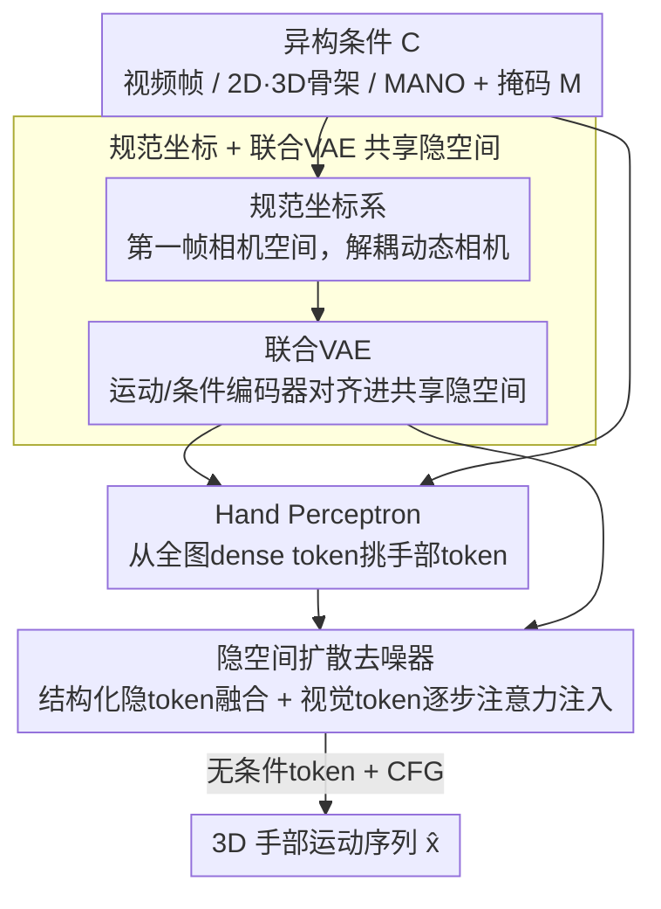

# UniHand: A Unified Model for Diverse Controlled 4D Hand Motion Modeling

**会议**: ICLR 2026  
**OpenReview**: [https://openreview.net/forum?id=upUl6hMYwy](https://openreview.net/forum?id=upUl6hMYwy)  
**代码**: 待确认  
**领域**: 3D视觉 / 人体理解 / 扩散模型  
**关键词**: 4D手部运动, 手部姿态估计, 条件运动生成, 隐空间扩散, 联合VAE

## 一句话总结
UniHand 把"从视频里估计手部姿态"和"在结构化条件下生成手部运动"这两个长期割裂的任务统一成一个**条件运动合成**问题，用一个联合 VAE 把 MANO 参数、2D/3D 骨架对齐进共享隐空间、再用隐空间扩散模型融合多种条件（含一个直接从全图特征里"挑"手部 token 的 hand perceptron），在 DexYCB / HO3D / HOT3D 上即便面对严重遮挡和时序缺帧也拿到 SOTA（DexYCB PA-MPJPE 4.08mm）。

## 研究背景与动机

**领域现状**：4D 手部运动建模（即随时间变化的 3D 手部姿态序列）是 VR、数字人、机器人的关键能力，目前研究被切成两个互不相通的子任务——**估计（Estimation）**从单目/多视角视频里重建出精确手部姿态；**生成（Generation）**则在 2D/3D 骨架、MANO 参数这类结构化条件下，利用生成式先验合成手部姿态、或对残缺序列做补全。

**现有痛点**：估计类方法依赖丰富的视觉输入，但一旦手被遮挡、暂时离开画面、或者帧序列有缺口就会崩；而且它们普遍走"检测—裁剪—逐帧回归"的多阶段流水线，既丢上下文又难做灵活编辑。生成类方法虽然能在结构化条件下补全和编辑，却大多只能吃单一条件、对时序不完整的信号束手无策。

**核心矛盾**：现实场景里的条件信号是**异构且经常残缺**的——视觉输入会被遮挡，2D 骨架会有时序断点，3D 骨架只在编辑时拿得到。但估计和生成被两套专用模型分开建模，导致两个后果：一是无法把这些异构条件灵活地凑在一起用，二是两个任务之间学到的运动先验没法互相迁移。

**本文目标**：用一个统一框架，既能在视觉证据充足时做精确估计，又能在只有结构化条件时做灵活生成，并且能优雅地处理任意条件子集（含缺帧）。

**切入角度**：作者注意到"手部姿态估计"本质上就是"以视觉为条件的运动合成"——只要把视觉观测也当成一类条件信号，估计就是生成的一个特例。于是关键不在于设计两套模型，而在于设计一个能把**所有模态的条件对齐到同一隐空间**、并能逐帧选择性吸收条件的生成器。

**核心 idea**：用一个联合 VAE 把异构结构化信号（MANO / 2D / 3D 骨架）嵌入共享隐空间做对齐，再用隐空间扩散模型把这些隐 token 与"从全图里直接attend 出来的手部视觉 token"一起融合，从而把估计与生成统一成条件运动合成。

## 方法详解

### 整体框架

UniHand 要解决的是"输入一组可能残缺、可能异构的条件信号 $C$（视频帧、2D/3D 骨架、可选 MANO 参数），输出一段长度为 $N$ 的连贯 3D 手部运动序列 $x=\{x_i\}_{i=1}^N$"。每个条件都配一个二值掩码 $m\in\mathbb{R}^N$ 标记它在哪些帧可用，这让模型能逐帧灵活组合任意条件。手部姿态用 MANO 参数化（姿态 $\Theta_i\in\mathbb{R}^{15\times3}$、形状 $\beta_i\in\mathbb{R}^{10}$、全局朝向 $\Phi_i$、根平移 $\Gamma_i$），运动统一表达在**第一帧相机空间定义的规范坐标系**里，从而把手部运动与动态相机解耦，无需相机外参就能在静/动相机下保持一致。

整个 pipeline 分两阶段串行：**阶段一**用联合 VAE（Joint VAE）把运动序列和各类结构化条件**编码进同一个共享隐空间**并做对齐，再用一个自回归解码器把隐 token 重建回运动以保证时序一致；**阶段二**在这个隐空间上训练隐空间扩散模型，结构化条件以隐 token 形式与带噪运动隐直接融合，视觉观测则经冻结视觉骨干 + hand perceptron 抽成每帧一个手部 token、在每一步去噪时通过注意力注入去噪网络。两阶段分开训练。

### 关键设计

**1. 联合 VAE：把异构结构化信号对齐进同一个共享隐空间**

痛点在于：MANO 参数、2D 骨架、3D 骨架是三种长得完全不一样的信号，过去的做法要么各用各的编码器、要么粗暴地拼接，导致扩散模型没法把它们当作"可互换的同类条件"来融合。UniHand 设计了一个联合编码器架构：运动编码器 $E_m$ 把运动序列 $x$ 编码成逐帧隐 token $z=\{z_i\}_{i=1}^N$（每个 $z_i$ 是某帧手部姿态在 $d$ 维隐空间的表示），同时引入一个全局运动 token $g\in\mathbb{R}^d$ 捕获序列级信息——具体是用可学习的分布 token $T_\mu,T_\sigma$ 让编码器预测高斯参数 $(\mu_g,\sigma_g)$，再从中采样 $g$ 并用 KL 散度正则。每个条件编码器 $E_c$ 则把条件 $c$ 编码成 $z_c=E_c(c)\in\mathbb{R}^{N\times d}$，**和运动隐 token 落在同一个隐空间里**，于是生成时这些条件隐可以被直接融合。

这样设计之所以有效，是因为"对齐"逼着隐空间去学习跨模态共享的运动语义，而不是某一种条件的表面特征——消融里把条件编码器换成直接映射的 MLP（w/o. $E_c$），DexYCB PA-MPJPE 从 4.08 退到 5.21，说明这种对齐是后续灵活融合条件的前提。

**2. 自回归解码器：用锚 token + 全局 token 守住时序一致性**

直接在原始运动序列上训扩散容易出现时序抖动，所以 UniHand 在隐空间里建模，但隐空间重建本身也要保证连贯。解码器 $D$ 以**自回归**方式重建运动：每一步预测一个运动片段 $\hat{x}_{i:i+n}$，条件是该段隐 token $z_{i:i+n}$、全局 token $g$、以及一个表示该段初始状态的锚 token $a_i$；预测完后用上一帧的输出线性映射更新锚 token $a_{i+n}=\text{Linear}(\hat{x}_{i+n-1})$，再滚动到下一段。全局 token 提供高层结构上下文，逐帧隐 token 保留细粒度运动细节与条件对齐，锚 token 则把相邻片段在状态上缝合起来。这种"全局 + 逐帧 + 锚点"的三级表示，让隐空间既压缩又能解码出时间上平滑的运动。

**3. Hand Perceptron：从全图 dense token 里直接 attend 出手部线索，甩掉检测裁剪**

视觉是手部估计里信息最丰富的输入，但传统做法围着手裁剪，既丢了环境/交互物体的上下文，又因为裁剪框的相机坐标逐帧变化而破坏时序一致性。UniHand 反其道而行：用冻结的预训练视觉骨干 $E_{vision}$ 处理**整帧**图像，投影成 dense token $v_i\in\mathbb{R}^{h\times w\times d}$，再用一个 hand perceptron 选择性地把手相关的视觉 token 聚合出来。具体是一组可学习的手 token $H=\{H_i\}$ 加一个初始化手部姿态 token $a_1$ 当 query，dense 视觉 token $v$ 当 key/value，做交叉注意力：

$$\text{Attention}(Q,K,V)=\text{Softmax}(QK^T/\sqrt{d_k})V$$

其中 $Q,K$ 都用 **3D RoPE** 沿时间 $N$、高 $h$、宽 $w$ 三个维度分别加旋转位置编码。可学习手 token 负责在每帧聚合目标手的视觉信息，初始化姿态 token 则在画面里有多只手时把注意力锚定到正确的手实例，保证整段序列里"一只手对一个 token"的一致绑定。最终每帧产出一个手部 token $h_i$。这个模块是性能的命门——消融里换成对 dense token 做平均池化（w/o. Hand Perceptron），DexYCB PA-MPJPE 从 4.08 暴涨到 7.81、HOT3D 的 G-MPJPE 从 63.97 飙到 180.59，几乎崩盘。

**4. 多条件融合 + 无条件 token 的 CFG：让任意条件子集都能稳健工作**

两类条件注入方式不同：结构化条件（MANO/2D/3D）已经被联合 VAE 编进共享隐空间，可在去噪时与带噪运动隐**直接融合**；视觉手部 token 则不在隐层融合，而是在**每一步去噪**时通过注意力层注入去噪网络，让模型全程都能 attend 视觉信息。去噪器 $G_\theta$ 采用预测干净隐 $\hat{z}_0=G_\theta(z_t,t,C)$ 的参数化（比预测噪声更利于时序连贯），再据此算反向分布均值。为了支持"任意条件、可能残缺"的场景，作者引入**可学习的无条件 token**做 classifier-free guidance：因为运动隐没有天然的无条件形式 $c_\varnothing$，他们为运动和条件分别准备独立的可学习无条件 token，训练时以概率 $p$ 把某个条件隐 $z_c^t$ 随机替换成其无条件版本。这既让 UniHand 在条件残缺时仍鲁棒，又能在合成时通过 CFG 尺度 $w$ 细粒度调节各条件的影响强度。

### 损失函数 / 训练策略
两阶段分开训练：阶段一训练联合 VAE，损失含 KL 散度（$\mathcal{L}_{KL}$）、重建（$\mathcal{L}_{rec}$）、anchor、latent 等项；阶段二在冻结隐空间上训扩散模型，含 simple diffusion 损失与重建损失。扩散时把时间步 $t$ 注入自适应 LayerNorm 的调制模块（LayerNormZero）。推理用 CFG，训练期以概率 $p$ 丢条件来学无条件 token。

## 实验关键数据

### 主实验

DexYCB 相机坐标系下按遮挡程度分级对比（PA-MPJPE↓ / AUC↑），UniHand 全面超越图像类与视频类基线，且在最严重遮挡下几乎不掉点：

| 方法 | All PA-MPJPE | All AUC | 遮挡75-100% PA-MPJPE | 遮挡75-100% AUC |
|------|------|------|------|------|
| WiLoR（图像类最强） | 5.01 | 0.900 | 5.68 | 0.887 |
| HaWoR（视频类最强） | 4.76 | 0.905 | 5.07 | 0.899 |
| **UniHand** | **4.08** | **0.918** | **4.26** | **0.912** |

HO3D 跨域泛化（含训练时未见的物体交互/严重遮挡）与 HOT3D 世界坐标系（动态相机、自我中心视角）：

| 数据集 | 指标 | 之前最好 | UniHand |
|--------|------|----------|---------|
| HO3D | PA-MPJPE↓ | 7.5 (WiLoR) | **6.7** |
| HO3D | F@15↑ | 0.983 (WiLoR) | **0.988** |
| HOT3D | PA-MPJPE↓ | 5.47 (HaWoR) | **4.76** |
| HOT3D | AccEr↓ | 5.16 (Dyn-HaMR) | **4.93** |

注：在 HOT3D 上 UniHand 的 G-MPJPE（63.97）/ GA-MPJPE（25.24）不如显式用相机轨迹的 HaWoR（47.35 / 18.14），但它**完全不依赖外部 SLAM 或逐序列优化**，仅凭视觉在规范空间建模就拿到可比的全局精度，且 PA-MPJPE 与加速度误差更优。

### 消融实验

DexYCB（相机系）与 HOT3D（世界系）上的组件与条件消融：

| 配置 | DexYCB-All PA-MPJPE | DexYCB-遮挡 PA-MPJPE | HOT3D PA-MPJPE | 说明 |
|------|------|------|------|------|
| w/o. 条件编码器 $E_c$ | 5.21 | 5.56 | 5.92 | 换成 MLP 直接映射，联合 VAE 对齐失效 |
| w/o. 预训练 $E_{vision}$ | 6.52 | 6.71 | 8.73 | 视觉骨干不预训练，线索不可靠 |
| w/o. Hand Perceptron | 7.81 | 8.75 | 12.46 | 换平均池化，崩盘式下降 |
| w/o. 3D RoPE | 4.65 | 4.76 | 4.95 | 换 1D RoPE，明显变差 |
| 仅 $c_{2D}$ | 4.75 | 5.43 | 6.37 | 严重遮挡/动态相机下不可靠 |
| 仅 $c_{vision}$ | 4.24 | 4.27 | 4.52 | PA 好但缺空间约束，G-MPJPE 弱 |
| $c_{vision}+c_{3D}$ | 3.48 | 3.67 | 3.82 | 视觉+3D 结构互补，整体最佳 |
| **Ours ($c_{vision}+c_{2D}$)** | 4.08 | 4.26 | 4.76 | 实用默认（2D 易由检测器获得） |

### 关键发现
- **Hand Perceptron 贡献最大**：去掉它 DexYCB PA-MPJPE 翻近一倍（4.08→7.81）、HOT3D G-MPJPE 翻近三倍，说明"从全图直接 attend 手部 token"远胜"裁剪 + 池化"，是统一框架吃透视觉的关键。
- **条件互补性明显**：单用 2D 骨架在正常场景尚可、但遮挡和动态相机下不可靠；单用视觉 PA 好但全局空间精度弱；$c_{vision}+c_{3D}$ 整体最佳印证视觉证据与 3D 结构线索互补。但 3D 骨架现实里拿不到、主要用于编辑，故默认选实用的 $c_{vision}+c_{2D}$。
- **预训练与 3D RoPE 都有实质增益**：视觉骨干必须预训练才能给 perceptron 提供可靠线索；3D RoPE 比 1D RoPE 更契合"时间×空间"的视觉 token 布局。

## 亮点与洞察
- **"估计 = 以视觉为条件的生成"这一视角转换**最让人"啊哈"：一旦把视觉观测也当条件，两个割裂任务自然合一，省掉了两套专用模型和它们之间的知识壁垒。
- **规范坐标系（第一帧相机空间）**是个低成本高回报的 trick：不用相机外参就把手部运动和动态相机解耦，让同一套表示同时适配静态与动态相机，可迁移到任何"动态相机下重建轨迹"的任务。
- **可学习无条件 token 的 CFG** 解决了"运动隐没有天然无条件形式"这一具体障碍，比生硬置零更合理，且天然支持任意残缺条件子集——这套机制可复用到其他多条件运动/序列生成。
- **Hand Perceptron 的"初始化姿态 token 锚定手实例"**很巧妙：多手场景下用一个 anchor query 保证整段序列一只手对一个 token 的一致绑定，避免 ID 漂移。

## 局限与展望
- 默认 $c_{vision}+c_{2D}$ 配置在 HOT3D 的全局指标（G/GA-MPJPE）仍逊于显式用相机轨迹的方法，规范坐标系虽避开外参，但纯视觉对全局平移的约束偏弱。
- 整套依赖 MANO 参数化与预训练视觉骨干，对非 MANO 拓扑（如戴手套、手物高度粘连）的适配未充分验证。
- 两阶段分开训练（先 VAE 后扩散）简单稳定，但隐空间一旦固定，扩散阶段无法反向优化表示，端到端联合训练或许还有空间。
- 论文未给出推理速度/计算开销的系统对比，"统一且高效"中"高效"的量化证据偏少。

## 相关工作与启发
- **vs HaWoR / Dyn-HaMR（多阶段估计）**：它们靠解耦相机轨迹 + 外部 SLAM / 逐序列优化在世界系重建，UniHand 把估计当条件生成的特例、仅凭视觉在规范空间一次性建模，免 SLAM、免逐序列优化，PA-MPJPE 与加速度误差更优。
- **vs 单条件生成式手部先验（VAE / score-based）**：过去多限于单一条件、对时序缺帧脆弱；UniHand 用联合 VAE 把多模态对齐进共享隐空间 + 扩散融合，能吃任意残缺条件组合。
- **vs HOI 类生成（GraspDiff / MGD / Text2HOI）**：它们依赖物体几何先验和任务专用流水线，适用面窄；UniHand 不绑定物体先验，面向通用 4D 手部运动建模。

## 评分
- 新颖性: ⭐⭐⭐⭐⭐ 首个把 4D 手部估计与生成统一为条件运动合成的框架，视角转换干净有力
- 实验充分度: ⭐⭐⭐⭐☆ 三数据集 + 遮挡分级 + 组件/条件双消融扎实，但缺效率对比与非 MANO 场景验证
- 写作质量: ⭐⭐⭐⭐☆ 动机与方法叙述清晰，部分训练细节散落附录
- 价值: ⭐⭐⭐⭐⭐ 统一框架 + 免 SLAM/裁剪的设计对 VR/数字人/机器人手部建模有直接实用价值

<!-- RELATED:START -->

## 相关论文

- [\[ICLR 2026\] Interaction-aware Representation Modeling With Co-Occurrence Consistency for Egocentric Hand-Object Parsing](interaction-aware_representation_modeling_with_co-occurrence_consistency_for_ego.md)
- [\[ICLR 2026\] CLUTCH: Contextualized Language model for Unlocking Text-Conditioned Hand motion modelling in the wild](clutch_contextualized_language_model_for_unlocking_text-conditioned_hand_motion_.md)
- [\[CVPR 2025\] UniHOPE: A Unified Approach for Hand-Only and Hand-Object Pose Estimation](../../CVPR2025/human_understanding/unihope_a_unified_approach_for_hand-only_and_hand-object_pose_estimation.md)
- [\[ECCV 2024\] Large Motion Model for Unified Multi-Modal Motion Generation](../../ECCV2024/human_understanding/large_motion_model_for_unified_multi-modal_motion_generation.md)
- [\[ICLR 2026\] GenCape: Structure-Inductive Generative Modeling for Category-Agnostic Pose Estimation](gencape_structure-inductive_generative_modeling_for_category-agnostic_pose_estim.md)

<!-- RELATED:END -->
