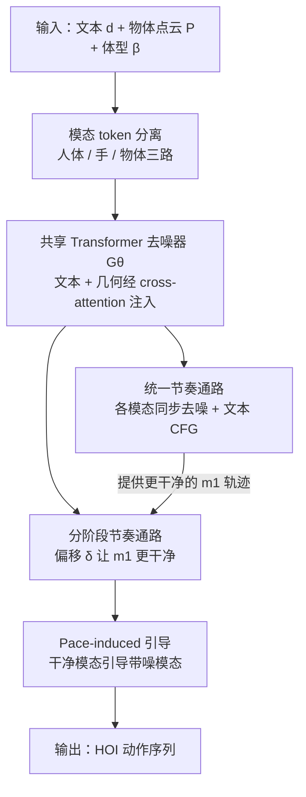

# Unleashing Guidance Without Classifiers for Human-Object Interaction Animation

**会议**: ICLR 2026  
**OpenReview**: [https://openreview.net/forum?id=7lgQernr2Z](https://openreview.net/forum?id=7lgQernr2Z)  
**论文**: [项目主页](http://ziyinwang1.github.io/LIGHT)  
**代码**: 待确认  
**领域**: 人体理解 / 人-物交互动作生成 / 扩散模型  
**关键词**: 人物交互动画, 文本驱动动作生成, 扩散强制, 隐式引导, 接触保真度

## 一句话总结
LIGHT 把扩散模型里"每个 token 可以有自己噪声水平"的扩散强制（diffusion forcing）机制改造成一种**无需分类器的引导方式**：让人体、手、物体各自走不同的去噪节奏，干净的模态通过 cross-attention 引导带噪的模态，从而在不依赖手工接触先验的前提下生成接触更真实的文本驱动人-物交互（HOI）动画。

## 研究背景与动机

**领域现状**：从一段文字（如"举起椅子，把它倒过来放到桌上"）生成人和物体交互的 3D 动作序列，是计算机视觉与图形学里一个重要又困难的问题。近年扩散模型成为主流框架，能从噪声里迭代去噪出合理的 HOI 序列。

**现有痛点**：纯扩散模型在没有物理约束时常出现明显瑕疵——手够不到目标、物体漂浮或穿模、接触随时间不稳定。为了修这些问题，已有工作主要走两条路：一是训练**外部分类器**（接触/可供性回归）来引导去噪，但分类器难设计、容易过拟合到特定先验；二是引入**手工运动学/动力学规则**（用逆运动学强行让手对齐物体，或接物理仿真），但牺牲了通用性、计算还慢。

**核心矛盾**：这些方法的接触质量本质上都来自**数据之外的人为先验**，而不是从数据本身长出来的。一个自然的想法是把 classifier-free guidance（CFG）搬到 HOI 上以减少对外部先验的依赖，但文本 CFG（靠对文本做 dropout）主要改善的是**全局分布对齐**，对 HOI 真正关心的那种**细粒度、持续的接触**几乎没有控制力。

**本文目标**：找到一种**纯数据驱动**的引导信号，既能像接触先验那样提升接触保真度，又不依赖任何手工设计的分类器或规则。

**切入角度**：作者注意到扩散强制允许序列中每个 token 拥有**独立的噪声水平与去噪进度**。如果把人体、手、物体拆成不同模态，让它们以**不同的速度**去噪，那么"更干净的那一路"天然就成了"更带噪那一路"的条件——引导可以直接从**去噪节奏的差异**里涌现出来。

**核心 idea**：用"模态间去噪进度的快慢差（pace-induced guidance）"代替"文本 dropout"来产生引导，把扩散强制原理性地扩展成一个引导框架；再用接触感知的形状增强让这种引导对几何多样性更鲁棒。

## 方法详解

### 整体框架

LIGHT 要解决的任务是：给定文本描述 $d$、物体的标准点云几何 $P$、SMPL-H 体型参数 $\beta$，输出一段 $T$ 帧的序列，同时包含人体动作和物体运动轨迹。每帧 $x_t$ 由四元组刻画：人体关节位置 $j^p \in \mathbb{R}^{T\times52\times3}$、手部旋转角 $j^{rh}\in\mathbb{R}^{T\times30}$、物体平移 $o^t\in\mathbb{R}^{T\times3}$、物体 6D 旋转 $o^r\in\mathbb{R}^{T\times6}$。

整体上它做两件事。**训练时**：把表示拆成人体、手、物体三类模态 token，给每类**独立采样一个噪声水平**，加上模态级与帧级位置编码后，送进一个共享的 Transformer decoder，文本（DistilBERT 编码）和物体几何（BPS 描述子）通过 cross-attention 注入，MLP 头预测干净动作。**推理时**：跑两条耦合的去噪通路——一条"统一节奏"让所有模态同步去噪（带文本 CFG），另一条"分阶段节奏"让某些模态比别的更干净，二者之差产生 pace-induced guidance，最终样本取自分阶段通路。

> 训练阶段还叠加了**接触感知形状谱增强**，把同类别但几何不同的物体替换进训练序列、并保持接触语义不变，让上述引导能利用到一个更强、对几何变化更不敏感的先验（见下文设计 3）。

### 关键设计

**1. 扩散强制的模态级改造：把"各 token 独立噪声"做成 HOI 的引导地基**

扩散强制（Chen et al., 2024）的关键是放宽了标准扩散"所有 token 共用一个噪声水平"的限制，允许每个 token 的噪声水平 $\lambda$ 从 $\{0,1,\dots,K\}$ 里独立取值，对应的加噪为 $x(\lambda)=\langle\sqrt{\bar\alpha(\lambda)},x(0)\rangle+\langle\sqrt{1-\bar\alpha(\lambda)},\epsilon\rangle$（用点积是因为不同 token 噪声不同）。本文把它落到 HOI 上：沿用 Text2HOI 的做法把表示显式拆成人体 $x^b$、手 $x^h$、物体 $x^o$ 三组 token，共 $3\times T$ 个，噪声水平 $\lambda=\{\lambda^b,\lambda^h,\lambda^o\}$。分手单独建模是因为人体（22 关节、大幅运动）和手（30 关节、精细手指动作）特性差异很大，实验里在 GRAB 这类频繁手交互的任务上分开建模明显更好。模型被改成直接预测干净数据 $\tilde x(0)=\mathcal{G}_\theta(x(\lambda),\lambda,d)$ 而非预测噪声，训练目标是重建误差 $\mathcal{L}_{\text{DF}}=\mathbb{E}_{x(0),\lambda}\|\hat x(0)-\mathcal{G}_\theta(x(\lambda),\lambda,d)\|^2$。训练时三类模态的噪声水平各自从 $U\{0,\dots,K\}$ 独立采样（但同一模态内所有帧共享一个噪声水平），这样模型见过各种"谁比谁干净"的异步条件分布，为推理时的灵活引导打下基础。

**2. Pace-induced guidance：用两条节奏通路之差代替文本 dropout**

这是全文核心。CFG 靠"有文本 vs 无文本"两个预测之差来引导，而 LIGHT 改成靠"两种去噪节奏"之差来引导，共两条通路。**统一通路**让所有模态同步去噪，并带常规文本 CFG：$\tilde x_U=\mathcal{G}_\theta(x_U(\lambda),\lambda,d)+\omega_1\big(\mathcal{G}_\theta(x_U(\lambda),\lambda,d)-\mathcal{G}_\theta(x_U(\lambda),\lambda,\varnothing)\big)$，得到一条相对干净的参考轨迹。**分阶段通路**把模态划成互补的两组 $m_1,m_2$（$m_1\cap m_2=\varnothing$，$m_1\cup m_2=\{b,h,o\}$，主文取 $m_1=\{b,h\}$、$m_2=\{o\}$），用偏移向量 $\delta$ 让 $m_1$ 比 $m_2$ 提前去噪：$x_S'=\big(x_U^{m_1}(\lambda^{m_1}-\delta);\,x_S^{m_2}(\lambda^{m_2})\big)$，即把统一通路里已经更干净的 $m_1$ 拼到当前 $m_2$ 上。引导更新在文本 CFG 之外再加一项节奏引导：

$$\tilde x_S=\mathcal{G}_\theta(x_S(\lambda),\lambda,d)+\omega_1\big(\mathcal{G}_\theta(x_S(\lambda),\lambda,d)-\mathcal{G}_\theta(x_S(\lambda),\lambda,\varnothing)\big)+\omega_2\big(\mathcal{G}_\theta(x_S',\lambda',d)-\mathcal{G}_\theta(x_S(\lambda),\lambda,d)\big)$$

其中 $\omega_2$ 控制节奏引导强度。直觉上，干净的 $m_1$（人体+手）通过共享去噪器内部的 cross-attention 去"拉"带噪的 $m_2$（物体），让物体运动与已成形的人体姿态保持接触一致。这套机制有个漂亮的连续谱性质：当节奏滞后 $\delta\to0$ 时退化为联合去噪、无引导；当滞后很大时近似 CFG 里的条件 dropout。作者实验发现，文本硬 dropout 改的是全局分布对齐，而 LIGHT 的软引导更多调整**底层接触细节**——也就是说模型纯从数据里学会了减少接触误差，无需手工先验。

**3. 接触感知形状谱增强：让接触语义不随几何变化而漂移**

LIGHT 只用数据先验，但这不妨碍把人类已知的世界知识（如物理）通过"操纵数据"间接喂进去。作者用一种基于优化的增强：先按 Xie et al. (2024) 训一个对应网络，把源物体表面的点映射到 ShapeNet / Objaverse 里**同类别但几何不同**的新物体表面；再借助这个对应关系把原序列里的物体换成新物体，优化其摆放使得**原来的人-物接触点被保留**（新物体的对应点始终匹配到同一组人体接触）。这样合成出的"同动作、不同几何"样本，教会模型"接触应当对无关的形状变化保持不变"。它把物体库从 217 个扩到 1121 个，形成一个更强、对几何多样性不敏感的先验，正好被异步节奏引导拿去利用，从而显著提升对**训练中未见物体**的泛化。

### 损失函数 / 训练策略

总损失 $\mathcal{L}=\mathcal{L}_{\text{DF}}+\mathcal{L}_{\text{reg}}$，其中 $\mathcal{L}_{\text{DF}}$ 是上面的扩散重建项，$\mathcal{L}_{\text{reg}}$ 含三部分：骨长损失（惩罚肢体长度偏离 GT）、接触损失（让指定人体关节对齐物体上的预期接触区）、速度损失（匹配人/物运动速度）。架构上用 8 层 Transformer decoder、隐维 512、FFN 1024；物体几何用 1024 点的 BPS 描述子（拼接未归一化 + 归一化 BPS，再附一个尺度标量）。推理超参：$\omega_1=0.5$、$\omega_2=3.0$、偏移 $\delta=250$、总去噪步 $K=500$。单张 A100 约 24 小时收敛。

## 实验关键数据

数据集主用 InterAct（Xu et al., 2025a），并在子集 BEHAVE、OMOMO 上消融。评测维度包括真实性/多样性（FID、Diversity）、文本对齐（R-Precision、MM Dist）、物理合理性（自定义的 Foot Skating Ratio 脚滑比、Penetration Ratio 穿模比、Contact Ratio 接触比），以及帧级接触精度 $C_{prec}/C_{rec}/C_{F1}$。

### 主实验

InterAct 上与四个近期 HOI 生成基线对比（R-Precision 用 batch size 256）：

| 方法 | R-Prec Top1↑ | FID↓ | MM Dist↓ | Pene↓ | C_F1→ |
|------|--------------|------|----------|-------|-------|
| Ground Truth | 0.600 | 0.000 | 1.475 | 0.076 | 1.000 |
| HOI-Diff | 0.413 | 0.689 | 3.029 | 0.103 | 0.501 |
| CHOIS | 0.439 | 0.572 | 2.781 | 0.131 | 0.541 |
| InterDiff | 0.501 | 0.215 | 2.461 | 0.116 | 0.584 |
| Text2HOI | 0.428 | 0.331 | 2.665 | 0.105 | 0.532 |
| **LIGHT（无引导）** | 0.395 | 0.196 | 2.885 | 0.121 | 0.599 |
| **LIGHT（有引导）** | 0.421 | **0.148** | 2.756 | 0.132 | **0.627** |

LIGHT 完整版在 FID（0.148，全场最低，逼近 GT 的生成质量）和接触 F1（0.627，最高）上领先，文本对齐（R-Prec、MM Dist）也优于多数基线。值得注意的是，开启引导让 FID 从 0.196→0.148、接触 F1 从 0.599→0.627，印证了节奏引导确实在提升接触保真度。

### 消融实验

**Token 分离策略（Table 2）**：

| hand–body 分离 | human–object 分离 | R-Prec Top1↑ | FID↓ | C_F1→ |
|:---:|:---:|:---:|:---:|:---:|
| ✓ | ✓ | 0.421 | 0.148 | 0.627 |
| – | ✓ | 0.414 | 0.157 | 0.611 |
| ✓ | – | 0.409 | 0.155 | 0.572 |

**数据增强对未见物体的泛化（Table 3，R-Prec batch 256）**：

| 增强 | 未见类型 | R-Prec Top1↑ | FID↓ | C_F1→ |
|:---:|:---:|:---:|:---:|:---:|
| ✗ | 同类内 | 0.216 | 2.151 | 0.809 |
| ✓ | 同类内 | 0.279 | 2.271 | 0.833 |
| ✗ | 跨类别 | 0.022 | 5.078 | 0.351 |
| ✓ | 跨类别 | 0.022 | 4.788 | 0.560 |

### 关键发现

- **同时分离手-身、人-物三路最优**：去掉人-物分离 C_F1 掉到 0.572，说明把物体单列、让它走自己的去噪节奏是引导生效的前提；分手则主要修复抓握时的手指瑕疵（Figure 4）。
- **形状谱增强对泛化贡献巨大**：同类内未见物体 R-Prec 从 0.216→0.279、C_F1 从 0.809→0.833；跨类别这种极难场景，FID 从 5.078→4.788、C_F1 从 0.351→0.560 大幅改善——增强让模型把"接触不随几何变"内化成了能迁移的先验。
- **节奏引导主要改底层接触**：与文本硬 dropout 改全局分布对齐形成互补，定性图（Figure 5）显示开引导后穿模/漂浮明显减少、接触动力学更精确；且在两个未重新训练的新任务上引导依旧带来提升。
- 论文还报告了所有模态划分组合（Appendix Table B）都能不同程度地带来提升，说明引导效果对 $m_1/m_2$ 的具体切法不敏感。

## 亮点与洞察
- **把"去噪进度差"重新诠释成引导信号**：这是最"啊哈"的地方——CFG 靠条件的有无之差，LIGHT 靠同一条件下"谁先去噪干净"之差，等于在扩散强制的连续噪声谱上找到了一个比硬 dropout 更软、更可调的引导维度，且 $\delta\to0$ 退化无引导、$\delta$ 很大近似 CFG，理论上自洽。
- **"接触先验"被拆成了两半各自解决**：节奏引导负责"动态接触一致"，形状谱增强负责"接触语义对几何不变"，二者都不写死任何人-物接触规则，却联合达到了甚至超过手工先验的效果。
- **可迁移性**：pace-induced guidance 本质是"多模态/多组件异步去噪 + 干净路引导带噪路"，原则上可搬到任何能自然拆分模态的扩散生成任务（人-人交互、手-物、音视频对齐等），作者也明确把它定位成扩散强制的一个通用引导扩展。

## 局限与展望
- 跨类别未见物体的绝对指标仍然很低（R-Prec Top1 仅 0.022，几乎贴地），说明对完全陌生几何的泛化依旧是难题，增强只是缓解而非解决。
- 形状谱增强依赖一个额外训练的对应网络和基于优化的摆放，pipeline 较重；增强质量上限受对应网络与同类别物体库覆盖度制约。
- 引导引入了 $\omega_1,\omega_2,\delta$ 三个超参且推理要跑两条耦合通路，计算成本高于单通路扩散；论文未充分讨论这些超参在不同任务上的敏感性与自动选取。
- 仍保留了接触/速度/骨长等正则项作为软约束，严格说并非完全"零先验"，只是把硬性物理规则换成了温和的训练损失。

## 相关工作与启发
- **vs 分类器引导（HOI-Diff / CG-HOI）**：它们训练外部接触/可供性预测器或把接触当多任务来引导，仍嵌入了人为设计的接触-物体关系假设；LIGHT 不对人-物接触做任何假设，引导直接从模态去噪节奏里涌现，避免了额外网络和过拟合先验的风险。
- **vs 运动学/物理约束方法（InterDiff / 物理仿真类）**：它们靠逆运动学或仿真强行修正，牺牲通用性且计算慢；LIGHT 纯数据驱动，把"物理知识"通过数据增强间接注入，保持了生成的灵活性。
- **vs 文本 CFG**：标准文本 CFG 只改善全局分布对齐、管不了持续接触细节；LIGHT 的软引导是对文本 CFG 的补充而非替代（两者在推理中叠加），专门补上接触保真这块短板。

## 评分
- 新颖性: ⭐⭐⭐⭐⭐ 把扩散强制的异步噪声机制重新诠释为无分类器引导，视角新颖且有连续谱理论支撑
- 实验充分度: ⭐⭐⭐⭐ InterAct 主实验 + token 分离/数据增强消融 + 用户研究 + 跨任务泛化，较完整，但跨类别泛化仍弱
- 写作质量: ⭐⭐⭐⭐ 动机推导清晰、把 CFG 与 pace-induced guidance 的关系讲得透；公式密集处稍难读
- 价值: ⭐⭐⭐⭐ 既提供了更好的 HOI 动画方法，又给出一个可能迁移到其他多模态扩散任务的通用引导范式

<!-- RELATED:START -->

## 相关论文

- [\[ICLR 2026\] Human-Object Interaction via Automatically Designed VLM-Guided Motion Policy](human-object_interaction_via_automatically_designed_vlm-guided_motion_policy.md)
- [\[ICLR 2026\] InfBaGel: Human-Object-Scene Interaction Generation with Dynamic Perception and Iterative Refinement](infbagel_human-object-scene_interaction_generation_with_dynamic_perception_and_i.md)
- [\[ICLR 2026\] LINK: Learning Instance-level Knowledge from Vision-Language Models for Human-Object Interaction Detection](link_learning_instance-level_knowledge_from_vision-language_models_for_human-obj.md)
- [\[CVPR 2026\] Decoupled Generative Modeling for Human-Object Interaction Synthesis](../../CVPR2026/human_understanding/decoupled_generative_modeling_for_human-object_interaction_synthesis.md)
- [\[ICLR 2026\] Disentangled Hierarchical VAE for 3D Human-Human Interaction Generation](disentangled_hierarchical_vae_for_3d_human-human_interaction_generation.md)

<!-- RELATED:END -->
