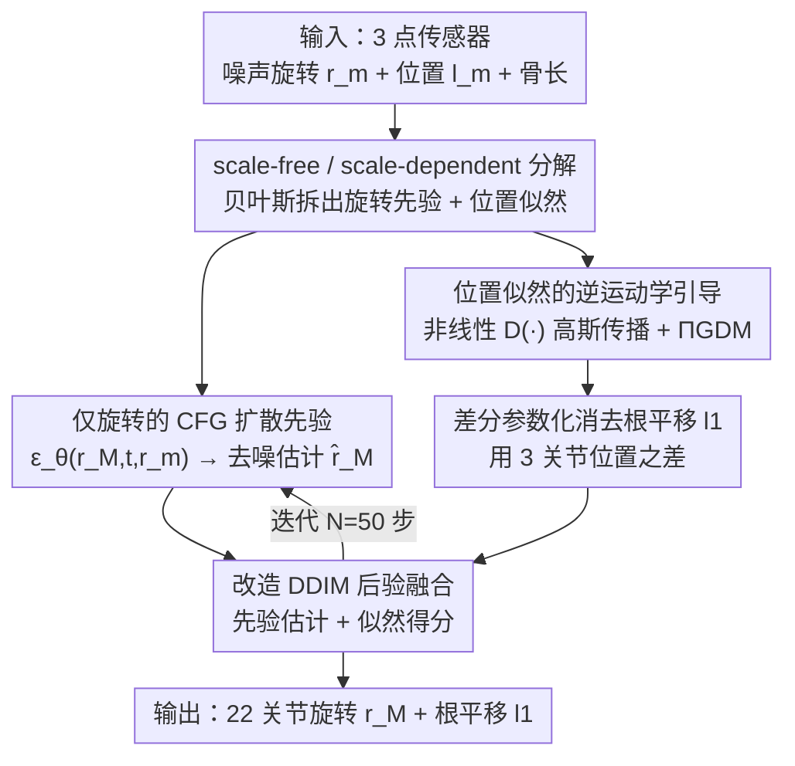

# Zero-Shot Human Pose Estimation Using Diffusion-Based Inverse Solvers

**会议**: ICLR 2026  
**论文**: [OpenReview / ICLR 2026 Conference Paper](https://iclrinpose-crypto.github.io/ICLRInPose/)  
**代码**: https://iclrinpose-crypto.github.io/ICLRInPose/ (有，项目页 + 动画)  
**领域**: 人体理解 / 人体姿态估计 / 扩散模型 / 逆问题求解  
**关键词**: 稀疏传感器姿态估计、扩散逆问题、零样本泛化、逆运动学引导、ΠGDM

## 一句话总结
针对「只戴 VR 头显 + 两个手柄（3 个上半身传感器）就要恢复全身 22 关节姿态」的稀疏姿态估计任务，本文提出 **InPose**：把姿态拆成「与体型无关的旋转（scale-free pose）」和「依赖体型的关节位置（scale-dependent）」两部分，只用旋转去做条件扩散先验、把位置测量当作逆运动学似然项来引导去噪，从而**无需任何微调就能零样本泛化到不同体型的用户**。

## 研究背景与动机

**领域现状**：从极稀疏的可穿戴传感器（头显 + 双手柄，即 head + 两 wrist 共 3 个关节的 ⟨位置, 旋转⟩ 测量）恢复全身姿态，是 VR/AR 化身（avatar）驱动的核心问题。近年最强做法是条件扩散模型，如 BoDiffusion 把全身姿态预测**同时**条件化在传感器的位置 $l_m$ 和旋转 $r_m$ 上，从 3 个点预测全身 22 关节，效果显著优于早期纯神经网络回归。

**现有痛点**：这些条件扩散方法**跨用户泛化极差**。一个在某个体型上训练好的模型，换一个体型不同的人就得重新微调。根因在于：同一个姿态下，两个人的关节**旋转角是一样的**，但因为骨长（bone length）不同，由前向运动学算出的关节**位置 $l_j$ 却不同**（见 $l_j(i) = l_{p_j}(i) + R_{p_j}(i)\cdot b_{j,p_j}$）。模型一旦把「位置」吃进条件里，就把训练用户的体型偏见焊死了。

**核心矛盾**：位置测量 $l_m$ **天然耦合了体型**，而旋转测量 $r_m$ 是 scale-free 的。把位置当作条件输入，等于让模型记住了一个特定体型；想泛化就得在训练时把各种体型一起塞进去（如 Aliakbarian 用 flow 模型联合训练姿态 + 大量骨长），既增加复杂度，又无法覆盖所有体型 outlier（如手特别长的篮球运动员）。

**本文目标**：设计一个**无需对新用户做任何微调/重训**、对体型（包括极端 outlier）都鲁棒的全身姿态估计算法。

**切入角度**：作者的核心观察是——任意全身姿态可分解为「scale-free pose（一个模板人体，按关节角旋转出姿态）」和「scale-dependent 分量（3D 空间里的关节位置）」，二者由前向运动学 + 体型参数连接起来。既然旋转是 scale-free 的，就能**只从旋转估计出一族 scale-free 姿态分布**，再用位置测量去**收紧（sharpen）**这个分布到最能解释测量的那些姿态。这恰好是一个标准的**逆问题（inverse problem）**结构。

**核心 idea**：用贝叶斯拆分把条件得分拆成「旋转先验」+「位置似然」——**只用旋转做 CFG 条件扩散先验，把位置作为伪逆引导（pseudoinverse guidance）的似然项在推理时引导去噪**，让体型信息只进入似然、不污染先验，从而实现零样本泛化。

## 方法详解

### 整体框架
InPose 要解决的是「给定 3 个上半身传感器的噪声 ⟨位置, 旋转⟩，输出全身 22 关节旋转 $r_M$ 和根关节平移 $l_1$」这个欠定（ill-posed）逆问题。整体思路是把全身姿态后验 $p(r_M|y_m)$ 用贝叶斯规则拆成**一个旋转条件先验**和**一个位置似然**两块，分别由「训练好的条件扩散模型」和「推理时的伪逆引导」提供，二者在每个扩散步上融合，迭代去噪出最终姿态序列。

具体地，每个扩散时间步 $t$：① CFG 得分模型 $\epsilon_\theta(r_M^t, t, r_m)$ 仅以旋转 $r_m$ 为条件，给出 scale-free 的条件先验得分，并经 Tweedie 公式得到去噪估计 $\hat r_M^t$；② 用改造过的 ΠGDM 计算位置似然得分 $\nabla_{r_M^t}\log p_t(l_m|r_M^t)$，把体型（骨长 $\kappa$）通过线性测量算子 $A$ 注入，并把姿态「拖动」到使头部位置匹配测量 $l_{head}$；③ 把先验去噪估计与似然得分用改造的 DDIM 融合，得到下一步 $r_M^{t-1}$。整个过程不训练/不微调任何网络权重就完成对新体型的适配。

### 关键设计

**1. scale-free / scale-dependent 分解 + 贝叶斯拆分：把体型偏见从先验里赶出去**

这是 InPose 能零样本泛化的根。痛点在于：位置 $l_m$ 耦合体型，一旦进条件就锁死训练体型。作者把目标得分按贝叶斯规则拆开（假设 $l_m, r_m$ 条件独立）：

$$\nabla_{r_M^t}\log p_t(r_M^t|\{l_m, r_m\}) = \nabla_{r_M^t}\log p_t(r_M^t|r_m) + \nabla_{r_M^t}\log p_t(l_m|r_M^t)$$

第一项 $\nabla_{r_M^t}\log p_t(r_M^t|r_m)$ **只依赖旋转**，是 scale-free 的，可由一个 CFG 条件扩散模型学到；第二项 $\nabla_{r_M^t}\log p_t(l_m|r_M^t)$ 是 **scale-dependent 似然**，可在推理时作为引导项使用、**不需要训练或微调网络**。这样体型信息（藏在骨长里）只通过似然项进入，先验保持对所有用户通用——同一个先验、配上不同用户的骨长，就能解释不同体型，这正是「无需新数据/重训」的来源。

**2. 把位置测量做成逆运动学似然引导：用 ΠGDM + 非线性高斯传播定理**

光有拆分还不够——位置似然 $\nabla_{r_M^t}\log p_t(l_m|r_M^t)$ 不好算，要把关节旋转映射到关节位置，即最小化 $\|l_m - A\circ D(\hat r_M^t)\|^2$，其中 $D(\cdot)$ 把 22 关节的 6D 旋转向量转成旋转矩阵、$A$ 是由骨长决定的线性算子。两个障碍：① $r_M^t$ 本身是噪声估计，不能直接过测量算子；② $D(\cdot)$ 是**非线性**的，把高斯随机变量从它里面传过去会破坏高斯性。

作者借用 ΠGDM（Pseudoinverse-Guidance for Diffusion Models）的思路把 $p_t(x_0|x_t)$ 近似成高斯 $\mathcal{N}(\hat x_t, w_t^2 I)$；再用 **Theorem 1** 证明：只要 score 模型训得好（保证每个关节 6D 表示的两个 3 维子向量单位正交，即 $\|\hat r_j^{t,1:3}\|=\|\hat r_j^{t,4:6}\|=1$、内积为 0），那么经过非线性 $D(\cdot)$ 后仍能近似成高斯 $p_t(D(r_M^0)|r_M^t)\approx\mathcal{N}(D(\hat r_M^t), w_t^2\Sigma_{\hat r_M^t})$，其协方差可由 score 模型算出。于是似然得分写成闭式：

$$\nabla_{r_M^t}\log p_t(l_m|r_M^t) = \Big((l_m - A\cdot D(\hat r_M^t))^\top (w_t^2 A\Sigma_{\hat r_M^t}A^\top + \sigma_l^2 I)^{-1} A\frac{\partial D(\hat r_M^t)}{\partial r_M^t}\Big)^\top$$

线性算子 $A := I_3\otimes\kappa^\top$ 是把骨长 $\kappa$ 通过 Kronecker 积塞进去得到的——**体型正是从这里进入似然、引导去噪向「最能解释该用户测量的姿态」走**。这样位置只起「引导/约束」作用而非「死条件」，避免了对噪声和体型的敏感。

**3. 差分参数化（Differential Parameterization）消去根平移 $l_1$：让线性逆引导成立**

上面的线性算子 $A$（由 Eq.8 推得）只在根关节平移 $l_1=0$ 时才成立，可现实里 $l_1\neq 0$，且 $l_1$ 对每个关节位置都有**可加**贡献（$l_j(i)$ 沿运动学链对 $l_1(i)$ 线性相加）。痛点：根平移破坏了线性逆引导的前提。

作者的处理很直接——**用 3 个被测关节在同一帧位置的两两差值**作为引导信号。因为 $l_1(i)$ 对每个被测关节位置的贡献相同，相减就把它**抵消**了，于是线性逆引导重新成立。代价是：没有了直接的平移引导，**下半身运动**（腿）只能靠扩散先验脑补，估计受限。作为补救，当体型接近默认体型时，可把头部平移当作额外的 CFG 输入（记为 **InPose (head)**），从而恢复对下半身运动的估计能力——论文同时报告了带/不带 head 输入两种设定。

### 损失函数 / 训练策略
训练侧只需训练一个 **CFG-based score 模型** $\epsilon_\theta(r_M^t, t, r_m)$（采用 BoDiffusion 的 DiT denoiser 架构，但只条件化在旋转 $r_m$ 上，而非 BoDiffusion 的旋转+位置），输出全局关节旋转 $r_M$ 的 6D 表示。推理用改造的 ΠGDM + DDIM（Algorithm 1），$N=50$ 步，VP-SDE 调度。关键工程选择：关节旋转一律用 **6D 连续表示** $r_j\in\mathbb{R}^6$（而非旋转矩阵/四元数），因其连续性更利于网络训练、输出 jitter 更低。

## 实验关键数据

数据集为 **AMASS**（SMPL 格式，重采样到 60Hz），训练用默认（平均男性）体型。两套协议：Protocol 1（Transitions + HumanEVA 作测试，其余训练）；Protocol 2（CMU/BMLrub/HDM05 上 90/10 切分）。指标：MPJPE（位置误差 cm）、MPJRE（旋转误差度）、UPE/LPE（上/下半身位置误差 cm）。Baseline：AvatarJLM（纯神经网络）、BoDiffusion(Local/Global)（CFG 扩散，同时条件化位置+旋转）。

### 主实验：变上半身体型（Protocol 1，越低越好）

| 算法 | 默认体型 MPJPE | 默认 MPJRE | 上身×1.4 MPJPE | 上身×1.4 MPJRE | 臂×1.4·躯干×0.7 MPJPE |
|------|------|------|------|------|------|
| AvatarJLM | **4.92** | **4.25** | 26.09 | 7.02 | 18.89 |
| BoDiffusion(Local) | 5.16 | 4.32 | 25.69 | 15.35 | 9.98 |
| BoDiffusion(Global) | 5.97 | 4.97 | 13.40 | 11.48 | 7.61 |
| **InPose** | 7.64 | 6.38 | **9.15** | **6.71** | **6.52** |

读法：默认体型下 baseline 更强（神经网络能学到位置→姿态的复杂非线性映射，且训练/推理体型一致）；但**一旦骨长变化，baseline 被位置输入误导、误差暴涨**（如 AvatarJLM 上身×1.4 时 MPJPE 从 4.92 飙到 26.09），而 InPose 几乎持平（7.64→9.15），在 MPJRE/MPJPE/UPE 上全面反超。论文也指出 InPose 的 **LPE（下半身）在部分情形仍偏高**——这正是「差分参数化消去 $l_1$ 后缺乏下半身平移引导」的代价。Protocol 2 趋势一致（InPose 在变体型下大幅领先）。

### 消融 1：头部平移作为 CFG 输入（Protocol 1，温和体型变化）

| 算法 | 上身×0.85 MPJPE | 上身×1.17 MPJPE | 臂×0.85·躯干×1.17 MPJPE | LPE（上身×0.85） |
|------|------|------|------|------|
| BoDiffusion(Global) | 6.76 | 8.18 | 6.80 | 12.16 |
| InPose | 7.13 | 8.25 | 7.80 | 14.25 |
| **InPose (head)** | **6.08** | **5.92** | **5.71** | **12.06** |

发现：体型变化较温和时，纯 InPose 的 MPJRE 虽稳定却会落后于 baseline；但**加上头部位置作 CFG 输入后（InPose (head)）几乎在所有指标、所有体型变化上反超全部 baseline**，且 LPE 明显改善（14.25→12.06），印证了「补充平移引导能救回下半身运动估计」。

### 消融 2：6D 表示 vs 旋转矩阵（Jitter，越低越好）

| 表示 | Jitter | 说明 |
|------|--------|------|
| RoT-Raw（旋转矩阵直接输出） | 高 | 输出矩阵非酉，抖动大 |
| RoT-Post（对前两列过 $D(\cdot)$ 后处理） | 中 | 正交化后抖动显著下降 |
| 6D（6D UNET 输出） | **低** | 连续表示，mesh 最平滑 |

### 关键发现
- **位置当似然引导 ≠ 位置当条件**：InPose 把位置只用于逆引导，因此对**位置测量噪声**也天然鲁棒——注入高斯噪声后 InPose 误差几乎持平，baseline 则随噪声明显退化（BoDiffusion 输出 jitter 大、姿态出分布）。这对真实可穿戴（手表/手机定位误差大）很关键。
- **零样本曲线几乎水平**：在体型缩放因子从 <1 到 >1 的扫描中，InPose 的 scaled-MPJPE 和 MPJRE 基本是平的，而 baseline 随体型偏离默认值显著恶化。
- **代价集中在下半身**：所有传感器都在上半身 + 差分参数化消掉了根平移，导致腿部（LPE）是 InPose 的相对弱项，需靠 head-CFG 补救。

## 亮点与洞察
- **把「跨体型泛化」从训练问题转成推理时的逆问题**：不再靠「训练时见过更多体型」，而是用贝叶斯拆分把体型隔离进似然项、推理时即插即用任意骨长——思路干净且省去重训，是最「啊哈」的地方。
- **为非线性测量算子补了一条高斯传播定理**：ΠGDM 原本要求线性算子，本文用 Theorem 1 证明 6D→旋转矩阵的非线性 $D(\cdot)$ 仍可近似高斯并给出闭式协方差，把扩散逆求解器的适用范围撑大了一截，这套「让非线性算子也能用伪逆引导」的技巧可迁移到其他带运动学/几何约束的逆问题。
- **差分参数化消平移**是个朴素但有效的 trick：用被测点之差抵消公共加性项，瞬间让线性逆引导重新成立——可复用于任何「公共偏移污染线性约束」的场景。

## 局限与展望
- **下半身/腿部运动估计弱**（作者承认）：差分参数化消去 $l_1$ 后没有直接平移引导，LPE 在多种设定下高于 baseline，下半身严重依赖先验「猜」。
- **默认体型下打不过 baseline**：当训练与推理体型一致时，端到端把位置吃进条件的神经网络反而更准，InPose 的优势只在「体型 mismatch / 有噪声」时才显现。
- **依赖 Theorem 1 的近似与 score 模型质量**：高斯传播近似要求 score 模型严格满足 6D 单位正交约束，若训练不充分该近似可能失真（⚠️ 协方差/定理细节以原文 Appendix A 为准）。
- **仅在 AMASS/SMPL 上验证**：尚未在真实可穿戴硬件采集的 in-the-wild 数据上检验。可改进方向：引入轻量动力学/物理约束补足下半身，或为 $l_1$ 设计非线性引导而非简单消去。

## 相关工作与启发
- **vs BoDiffusion（Castillo 2023）**: 它用 CFG 同时条件化位置+旋转，本文只条件化旋转、把位置降级为似然引导；区别在于「体型是否进先验」。本文优势是零样本跨体型 + 抗噪，劣势是默认体型/下半身略逊。
- **vs Aliakbarian (2022, flow 联合训练)**: 它靠在训练时联合大量骨长来泛化，本文不需要任何体型泛化训练、推理时直接接受任意骨长。优势是无需重训、覆盖 outlier；他们则需枚举体型且不保证覆盖。
- **vs AvatarJLM（Zheng 2023）**: 纯神经网络回归，默认体型最准但体型一变即崩；InPose 用生成式先验 + 逆引导换来了体型鲁棒性。
- **vs 通用扩散逆求解器（ΠGDM / DPS 等）**: 它们针对线性测量算子，本文补上非线性运动学算子的高斯近似，是把扩散逆求解器引入人体姿态领域的一次具体化。

## 评分
- 新颖性: ⭐⭐⭐⭐⭐ 把跨体型泛化重构成扩散逆问题、并为非线性运动学算子证明高斯传播，角度新且自洽。
- 实验充分度: ⭐⭐⭐⭐ 体型缩放/噪声/上身变体/6D 消融都覆盖，但仅限 AMASS 合成体型、无真实硬件数据。
- 写作质量: ⭐⭐⭐⭐ 推导清晰、pipeline 与定理交代到位，部分协方差细节需翻 Appendix。
- 价值: ⭐⭐⭐⭐ 对 VR/AR 化身驱动「一套模型适配所有体型」很实用，下半身弱点限制了即插即用程度。

<!-- RELATED:START -->

## 相关论文

- [\[ICLR 2026\] KinemaDiff: Towards Diffusion for Coherent and Physically Plausible Human Motion Prediction](kinemadiff_towards_diffusion_for_coherent_and_physically_plausible_human_motion_.md)
- [\[ECCV 2024\] MANIKIN: Biomechanically Accurate Neural Inverse Kinematics for Human Motion Estimation](../../ECCV2024/human_understanding/manikin_biomechanically_accurate_neural_inverse_kinematics_for_human_motion_esti.md)
- [\[ICLR 2026\] Pose Prior Learner: Unsupervised Categorical Prior Learning for Pose Estimation](pose_prior_learner_unsupervised_categorical_prior_learning_for_pose_estimation.md)
- [\[ICLR 2026\] From Sparse to Dense: Spatio-Temporal Fusion for Multi-View 3D Human Pose Estimation with DenseWarper](from_sparse_to_dense_spatio-temporal_fusion_for_multi-view_3d_human_pose_estimat.md)
- [\[ICLR 2026\] Inverse Virtual Try-On: Generating Multi-Category Product-Style Images from Clothed Individuals](inverse_virtual_try-on_generating_multi-category_product-style_images_from_cloth.md)

<!-- RELATED:END -->
