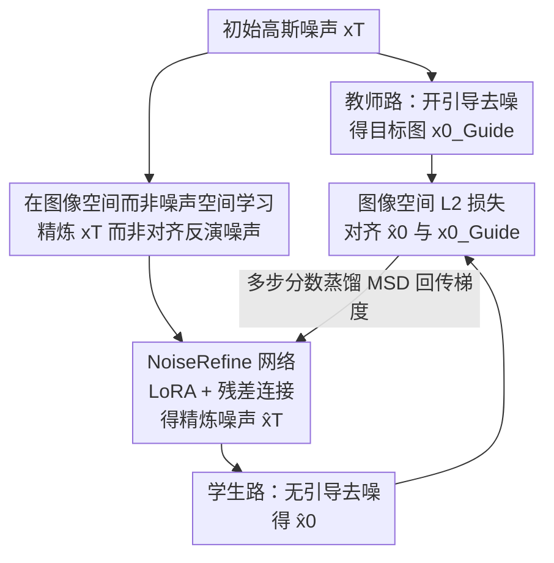

# A Noise is Worth Diffusion Guidance

**会议**: ICLR2026  
**OpenReview**: [https://openreview.net/forum?id=xEWooSOgaz](https://openreview.net/forum?id=xEWooSOgaz)  
**代码**: https://cvlab-kaist.github.io/NoiseRefine （项目页）  
**领域**: 扩散模型 / 图像生成  
**关键词**: 扩散引导, classifier-free guidance, 噪声精炼, 引导蒸馏, 无引导采样

## 一句话总结
这篇论文提出 NoiseRefine：不去改扩散模型本身，而是训一个轻量网络把随机高斯噪声"精炼"成一份结构化噪声，使得**不开任何采样引导**、只跑一遍前向就能生成接近 CFG 引导质量的图像，从而把每步两次前向的引导开销直接省掉。

## 研究背景与动机
**领域现状**：文本到图像扩散模型（SD、SDXL、SiT 等）能出高质量图，但几乎都依赖**采样引导**，其中最常用的是 classifier-free guidance（CFG）。引导的代价是每个去噪步都要算两次预测（条件 + 无条件），把推理成本直接翻倍。

**现有痛点**：主流省引导的办法是**引导蒸馏（guidance distillation）**——训一个学生网络去逼近"带引导的预测"。但这类方法要改去噪网络本身，容易**灾难性遗忘**，而且和下游的领域微调（如二次元、黏土风 LoRA）、时间步蒸馏（few-step 模型）这些技术不兼容：每换一个微调模型就得重新蒸一次。

**核心矛盾**：引导信号一定要"塞进去噪网络"里吗？一旦动了网络，就破坏了模型原有先验、也破坏了与其他即插即用模块的兼容性。

**切入角度**：作者注意到一个被忽视的因素——**初始噪声**。他们做了个分析：拿一份高斯噪声 $x_T$，用引导生成一张好图 $x_0^{\text{Guide}}$，再把这张图**反演（inversion）**回噪声 $x_T^{\text{Guide}}$，发现这个"反演噪声"即使**不开引导**也能复现出类似的好图。进一步统计 10K 对 $(x_T, x_T^{\text{Guide}})$ 发现：两者差异远小于两份随机噪声之间的差异，且差异**集中在低频分量**（见原文 Fig.3）。这说明初始噪声到"无引导好噪声"之间存在一个**结构化、可学习**的映射。

**核心 idea**：把引导**蒸馏进噪声**而不是蒸馏进网络——训一个噪声精炼网络 $g_\phi$ 把高斯噪声映射到"引导精炼噪声"，扩散模型一字不改，推理时只在去噪前加一步噪声精炼即可。

## 方法详解

### 整体框架
NoiseRefine 的训练是一个**师生对齐**框架：同一份高斯噪声 $x_T$ 走两条路。一条路（教师/目标）用原模型 + 引导跑 $N'$ 步去噪，得到高质量图 $x_0^{\text{Guide}}$；另一条路先让噪声精炼网络 $g_\phi$ 把 $x_T$ 精炼成 $\hat x_T$，再用**同一个原模型、不开引导**跑 $N$ 步去噪得到 $\hat x_0$。训练目标是让无引导输出 $\hat x_0$ 逼近带引导目标 $x_0^{\text{Guide}}$，即最小化图像空间的 $L2$ 距离 $d(\hat x_0, x_0^{\text{Guide}})$。注意整个过程**不需要成对图像数据集**——目标图是教师路在线生成的。推理时只需采一份高斯噪声、过一次 $g_\phi$ 得到 $\hat x_T$，然后跑标准无引导去噪。

### 关键设计

**1. 在图像空间而非噪声空间学习：绕开反演误差**

最直觉的做法是直接学"高斯噪声 → 反演噪声"的映射，但反演方法（DDIM inversion 等）本身有近似误差，**理想反演噪声** $x_T^{\text{Guide}\dagger}$（能完美重建引导图的那份噪声）在实践中拿不到，用带误差的反演噪声当监督目标会让结果发糊（原文 Fig.4、Fig.5 上排显示直接学噪声映射得到模糊重建）。作者把优化目标从噪声空间搬到**图像空间**：不再压 $d(x_T, x_T^{\text{Guide}})$，而是压 $d(x_0, x_0^{\text{Guide}})$。这一步靠 Proposition 1 撑腰——假设去噪映射 $\epsilon_\theta^{(t)}$ 关于距离 $d$ 是 Lipschitz 连续的，则存在常数 $\kappa>0$ 使得

$$d(x_T, x_T^{\text{Guide}\dagger}) < \kappa\, d(x_0, x_0^{\text{Guide}}).$$

也就是说**把图像差异压小，就顺带把噪声差异 bound 住了**，而且图像监督避开了不可得的理想反演噪声。表 1 直接对比：噪声空间损失的 PickScore 仅 17.97、CLIPScore 18.39，换成图像空间损失（本文）后涨到 21.62 / 36.43，差距非常大。

**2. NoiseRefine 网络：LoRA + 残差连接，复用扩散先验又不动模型**

精炼网络 $g_\phi$ 的架构可以任选，作者用的是**挂在预训练扩散模型上的轻量 LoRA**。这么做有三个好处：一是 LoRA 能直接借用扩散模型本身对文本/图像的丰富知识，参数高效、收敛快；二是 LoRA 可以**用完即拆**——精炼时挂上、去噪时卸下，省显存且与原 pipeline 无缝衔接，不破坏模型先验，相当于一种 prompt-learning 式的做法、天然不会灾难性遗忘；三是因为只动噪声输入、不碰去噪网络，所以训好的精炼网络能**零样本迁移**到各种微调模型、并和时间步蒸馏模型兼容。结合前面 Fig.3 的观察（高斯噪声与精炼噪声只差结构化低频分量），作者在 $g_\phi$ 里加了**残差连接**，让网络只去预测那份"修正量"而不是整份精炼噪声，更贴合"差异很小且结构化"的先验。

**3. 多步分数蒸馏（MSD）：截断去噪网络梯度，绕开多步反传的高昂代价**

图像空间损失要把梯度从 $\hat x_0$ 一路反传穿过 $N$ 个去噪步（SD 家族通常 20–30 步），算力和显存都爆炸，这也是以往噪声优化方法被迫只能用 one/few-step 模型的瓶颈。标准损失是 $L_{\text{Denoise}}=d\big(D_1(\dots D_T(g_\phi(x_T))), x_0^{\text{Guide}}\big)$，其中单步去噪 $D_t(x)=a_t x_t + b_t \epsilon_\theta^{(t)}(x)$。作者提出 **MSD**：在反传时对每一步的去噪网络做 **stop-gradient（detach）**，即把 $D_t$ 换成

$$F_t(x) = a_t x_t + b_t\, \mathrm{SG}\big(\epsilon_\theta^{(t)}(x)\big),$$

损失变成 $L_{\text{MSD}}=d\big(F_1(\dots F_T(g_\phi(x_T))), x_0^{\text{Guide}}\big)$。这样梯度不再穿过去噪器的 Jacobian，避免了反复穿过同一去噪器导致的梯度爆炸/消失（类似 RNN 长程不稳定），收敛更快、出图更锐、成本大降（原文 Fig.6）。Proposition 2 进一步说明 MSD 梯度与全梯度只差一个常数因子 $k\in(0,1)$：$\nabla_\phi L_{\text{Denoise}} \approx k\,\nabla_\phi L_{\text{MSD}}$，即 MSD 是全梯度目标的良好近似。

### 损失函数 / 训练策略
核心损失就是图像空间 $L2$ 配合 MSD 的 stop-gradient 实现：$L_{\text{MSD}}(g_\phi(x_T),\theta)$。教师路引导可用任意引导或组合——类条件模型（SiT-XL/2）用 CFG，T2I 模型（SD2.1、SDXL）同时用 CFG + perturbed-attention guidance（PAG）。训练 prompt 从 MS-COCO、Pick-a-Pic 采样，**无需配对图像数据**；目标图在线由教师路生成。

## 实验关键数据

### 主实验
在 MS-COCO 30K（T2I）/ ImageNet 50K（SiT）上评测 FID / IS，对比四种设置：高斯噪声无引导（基线）、高斯噪声带引导、引导蒸馏、本文精炼噪声无引导。

| 模型 | 设置 | FID ↓ | IS ↑ |
|------|------|------|------|
| SiT-XL/2 | 高斯+无引导 | 18.43 | 40.00 |
| SiT-XL/2 | 高斯+引导 | 14.20 | 63.99 |
| SiT-XL/2 | 引导蒸馏 | 12.12 | 58.90 |
| SiT-XL/2 | **精炼噪声(本文)·无引导** | **10.80** | 50.59 |
| SD2.1 | 高斯+无引导 | 42.71 | 20.86 |
| SD2.1 | 高斯+引导 | 16.19 | 37.95 |
| SD2.1 | **精炼噪声(本文)·无引导** | **14.62** | 34.90 |
| SDXL | 高斯+无引导 | 63.28 | 17.64 |
| SDXL | 高斯+引导 | 21.20 | 34.60 |
| SDXL | **精炼噪声(本文)·无引导** | 26.22 | 27.63 |

精炼噪声在 SiT、SD2.1 上 **FID 甚至优于带引导采样和引导蒸馏**，且只用单步精炼；SDXL 上略逊于引导但仍远好于无引导高斯基线（63.28 → 26.22）。

### 消融实验

| 配置 | 关键指标 | 说明 |
|------|---------|------|
| 噪声空间损失 | PickScore 17.97 / CLIPScore 18.39 | 直接学噪声映射，受反演误差拖累、出图糊 |
| 图像空间损失（本文） | PickScore 21.62 / CLIPScore 36.43 | 改在图像空间对齐，质量大幅提升 |
| 全梯度反传 vs MSD | MSD 收敛更快、图更锐 | detach 去噪网络梯度，避免多步反传不稳定（Fig.6） |

用户研究（Tab.3）：在图像质量上，精炼噪声无引导 53.96% vs 高斯带引导 46.04%；prompt 一致性 51.76% vs 48.24%——即用户对"精炼噪声无引导"与"高斯带引导"偏好相当甚至略高。

### 关键发现
- **图像空间损失是质量的命门**：换成噪声空间损失后各项指标断崖式下降，反演误差是直接学噪声映射失败的根因。
- **差异是结构化低频**：高斯噪声与反演噪声的差异集中在低频，这一观察直接催生了"残差连接只学修正量"的设计。
- **泛化与兼容性**：在 SD2.1 上训好的精炼网络可**零样本迁移**到二次元/黏土风等微调模型（Tab.4 接近带引导质量），也能套到 SD-Turbo 等时间步蒸馏模型上改善结构连贯性（Fig.8）。

## 亮点与洞察
- **换了优化变量的视角**：以往省引导都盯着"去噪网络"做文章，本文把战场移到"初始噪声"——一个被严重低估的自由度。改噪声不改模型，自然继承了即插即用、不遗忘、可迁移的全部好处。
- **图像空间 vs 噪声空间的取舍很关键**：Proposition 1 用 Lipschitz 把"压图像差异"和"压噪声差异"联系起来，既给了理论保证又绕开了不可得的理想反演噪声，这个 trick 可迁移到其他"噪声/隐变量优化"任务。
- **MSD 让全步扩散模型也能做噪声优化**：detach 去噪器梯度这招把以往只能在 few-step 模型上做的噪声优化推广到 20–30 步的标准 SD 模型，是工程上能落地的关键。

## 局限与展望
- **训练引入了在线引导采样开销**：相比纯引导蒸馏，本文训练时要跑教师路的引导采样，单步训练成本更高（作者在附录做了成本分析），换来的是推理零额外开销与强迁移性。
- **SDXL 上仍逊于引导**：在 SDXL 这种更大模型上 FID 26.22 仍明显高于带引导的 21.20，说明精炼噪声完全替代引导在大模型上还有差距。
- **依赖教师引导的质量上限**：精炼噪声学的是"逼近带引导的输出"，质量天花板被教师引导本身锁死，无法超过引导能达到的效果。
- **MSD 是近似**：Proposition 2 只在温和假设下成立、且差一个常数因子，极端情况下近似误差对收敛的影响未充分刻画。

## 相关工作与启发
- **vs 引导蒸馏（Meng et al. 2023）**：他们把引导信号蒸进**学生去噪网络**，要改模型、易遗忘、每个微调变体都要重蒸；本文把引导蒸进**初始噪声**，模型一字不动，因此能零样本迁移到微调模型并兼容时间步蒸馏。
- **vs 噪声优化（Zhou et al. 2024 等）**：Zhou 等在**噪声空间**用反演噪声当监督来训噪声变换网络、目标是人类偏好对齐；本文用**图像空间损失**、目标是**无引导生成**，且用 MSD 解决了多步反传成本，能直接用在全步扩散模型上。
- **vs CFG / PAG 等引导方法**：这些方法每步要额外算一次降质/扰动预测，开销翻倍且是其机制所必需；本文把这部分代价一次性预付到"噪声精炼"上，推理时彻底省掉每步的第二次前向。

## 评分
- 新颖性: ⭐⭐⭐⭐⭐ "把引导蒸进噪声而非网络"是一个干净且少有人走的方向
- 实验充分度: ⭐⭐⭐⭐ 覆盖 SiT/SD2.1/SDXL 三类模型 + 迁移/蒸馏兼容性，但 SDXL 上仍逊于引导
- 写作质量: ⭐⭐⭐⭐⭐ 动机—分析—方法—证明环环相扣，两条命题清晰支撑设计
- 价值: ⭐⭐⭐⭐ 即插即用、不改模型、可迁移，对部署友好，实用价值高

<!-- RELATED:START -->

## 相关论文

- [\[ICLR 2026\] Mitigating Noise Shift in Denoising Generative Models with Noise Awareness Guidance](mitigating_noise_shift_in_denoising_generative_models_with_noise_awareness_guida.md)
- [\[ICLR 2026\] Deconstructing Guidance: A Semantic Hierarchy for Precise Diffusion Model Editing](deconstructing_guidance_a_semantic_hierarchy_for_precise_diffusion_model_editing.md)
- [\[ICLR 2026\] Stochastic Self-Guidance for Training-Free Enhancement of Diffusion Models](stochastic_self-guidance_for_training-free_enhancement_of_diffusion_models.md)
- [\[ICLR 2026\] Contrastive Diffusion Guidance for Spatial Inverse Problems](contrastive_diffusion_guidance_for_spatial_inverse_problems.md)
- [\[ICLR 2026\] Guidance Watermarking for Diffusion Models](guidance_watermarking_for_diffusion_models.md)

<!-- RELATED:END -->
