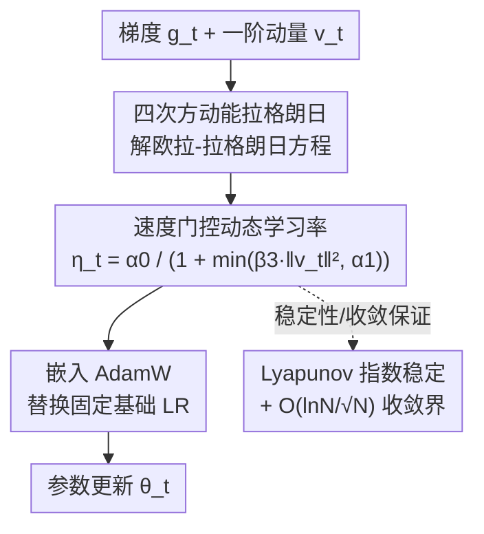

# A Physics-Inspired Optimizer: Velocity Regularized Adam

**会议**: ICLR2026  
**OpenReview**: [https://openreview.net/forum?id=6BhduwrCp3](https://openreview.net/forum?id=6BhduwrCp3)  
**代码**: 待确认  
**领域**: 优化器 / 训练动力学  
**关键词**: 物理启发优化器、速度正则化、稳定边缘、Adam、Lyapunov 稳定性

## 一句话总结
本文提出 VRAdam（Velocity-Regularized Adam），把"四次方动能项"这一物理稳定机制翻译成一个**随速度自动收缩的全局动态学习率** $\eta_t=\alpha_0/(1+\min(\beta_3\|v_t\|^2,\alpha_1))$ 嵌进 AdamW，在权重更新过大时自动减速、抑制稳定边缘附近的震荡，并配上严格的 Lyapunov 稳定性与 $O(\ln N/\sqrt N)$ 收敛证明，在图像分类、语言建模、GFlowNets、GPT-2 预训练与 LLM 微调上普遍优于 AdamW。

## 研究背景与动机
**领域现状**：Adam / AdamW 已是深度网络训练的事实标准，靠的是"动量 + 逐参数二阶矩缩放"。但它的基础学习率 $\eta$ 一旦设定（哪怕配 schedule）在每一步是全局固定的，对超参数敏感、训练动力学常出现不稳定。

**现有痛点**：大量实证发现，神经网络训练往往进入所谓"稳定边缘"（Edge of Stability, EoS）——损失 Hessian 的最大特征值（sharpness）$\lambda_{\max}$ 会稳定在约 $2/\eta$ 这个数值稳定上限附近并卡住，导致损失短期非单调震荡、收敛被拖慢。对 Adam 这类自适应方法，存在对应的"自适应稳定边缘"（AEoS），阈值变成在预条件 Hessian $P_t^{-1}H_t$ 上的约束 $\lambda_{\max}(P_t^{-1}H_t)<\frac{2+2\beta_1}{(1-\beta_1)\eta}$。一旦顶到这个阈值，优化器就在震荡区里反复微调预条件器、最终收敛变慢。

**核心矛盾**：经典优化理论里大学习率收敛快但越界就发散；而 EoS 现象说明真实训练长期停在临界点附近，"快"和"稳"在固定学习率下天然打架——学习率不会因为某一步"冲得太猛"而临时退一步。

**切入角度**：作者从物理出发，把优化轨迹看成粒子在高维损失地形里的运动，不稳定来自"速度过大 / 步长过大"。物理中有一类系统（经典时间晶体、用非相对论量子色动力学 NRQCD 描述的重夸克）因为动能里带**四次方速度项**而格外稳定——这些高阶速度项重塑了能量地形，让稳定构型成为吸引子。作者把这个稳定机制借来当启发。

**核心 idea**：给动能加一个四次方项 $T(v)=\tfrac{m}{2}\|v\|^2+\tfrac{\beta_3}{4}\|v\|^4$，解欧拉-拉格朗日方程后自然冒出一个**随速度增大而变小的有效学习率**，把它当作一个全局标量门控嵌进 AdamW——速度一大就自动减速，从而在 AEoS 附近抑制震荡、加速收敛。

## 方法详解

### 整体框架
VRAdam 的逻辑链是：**物理动能假设 → 解欧拉-拉格朗日方程得到"速度门控" → 把门控嵌进 AdamW → 配套理论保证**。

作者把优化器的全局动量缓冲 $v$ 类比成"重夸克动量"这类稳定系统的速度，假设拉格朗日量
$$L(x,v)=\frac{m}{2}v^2+\frac{\beta_3}{4}v^4-V(x),$$
其中 $V(x)$ 就是神经网络损失地形（$\partial V/\partial x=\nabla L_\text{loss}(x)$）。对它解欧拉-拉格朗日方程 $\frac{d}{dt}\frac{\partial L}{\partial v}-\frac{\partial L}{\partial x}=0$，整理（在 $\dot v$ 与 $v$ 共线的 1 维约化下）得到
$$\dot v=-\nabla L_\text{loss}(x)\big/(m+3\beta_3\|v\|^2),\quad \dot x=v.$$
关键在 $1/(m+3\beta_3\|v\|^2)$ 这一项：速度越大，这个系数越小，等于动态地压低步长。作者不去硬解这个常微分方程（避免选积分器、引入额外耗散），而是把这一项**重参数化并裁剪**成一个动态学习率，直接替换掉 AdamW 里固定的基础学习率。

算法上（Alg. 1），VRAdam 相对 AdamW 只改一行：在算完速度 $v_t$（一阶动量）后，插入
$$\eta_t=\alpha_0\big/\big(1+\min(\beta_3\|v_t\|^2,\alpha_1)\big),$$
然后用这个 $\eta_t$ 去做带权重衰减的更新 $\theta_t=\theta_{t-1}(1-\eta_t\lambda)-\eta_t\,\hat v_t/(\sqrt{\hat m_t}+\epsilon)$。其余（二阶矩 $m_t$、偏差校正、权重衰减）与 AdamW 完全一致，所以是个低开销的"即插即用"修改。

### 关键设计

**1. 四次方动能 → 速度门控学习率：让优化器在冲得太猛时自动减速**

这一设计直接针对"固定学习率在 EoS 附近无法临时退让"的痛点。普通动量对应动能 $\tfrac{m}{2}v^2$，作者额外加一个四次方项 $\tfrac{\beta_3}{4}v^4$，使得解出的运动方程里步长被 $1/(m+3\beta_3\|v\|^2)$ 调制——速度（即近期更新幅度）大时分母大、有效步长小，速度小时步长恢复。落到算法里就是 $\eta_t=\alpha_0/(1+\min(\beta_3\|v_t\|^2,\alpha_1))$：$\beta_3$ 控制速度惩罚强度，$\alpha_0$ 是最大学习率，$\alpha_0/(1+\alpha_1)$ 是最小学习率下限。这里用 $\min(\cdot,\alpha_1)$ 裁剪掉物理推导出的纯 $v^2$ 项，是为了在梯度/速度爆掉时不让学习率被压到 0 而卡死。其有效性在于：它是一个**数据驱动、无需额外反向传播**的自适应机制，实验里观察到 ResNet-32/CIFAR-10 训练前 25 步学习率先动态下降抑制初期震荡、再回升到接近最大值充分利用地形。

**2. 全局标量门控而非逐参数缩放：换来跨方向一致的可证稳定性**

一个容易被忽视但作者花大力气论证的选择：$\eta_t$ 是一个**全局标量**，对所有参数方向同等缩放，而不是像 Adam 预条件那样逐坐标缩放。作者指出逐坐标缩放等价于一个带时变对角矩阵 $D_t$ 的切换线性系统——即便每个固定 $D$ 单独看是 Schur 稳定（谱半径 <1），乘积 $A(D_2)A(D_1)$ 也可能不稳定，因为不同步的收缩方向会旋转、矩阵不对易。换成全局标量 $\eta_t$ 后，在 Hessian 特征基下动力学解耦成一族相同的 $2\times2$ 子系统 $A_h(\eta_t)$，于是可以构造一个**与曲率无关的公共二次 Lyapunov 函数**（CQLF）$V(z)=z^\top Pz$，对任意标量门控序列都成立。同时这个标量门是旋转不变的，不要求预条件器与 Hessian 对易，还给出更新范数的无量纲上界 $\|\theta_t-\theta_{t-1}\|=\eta_t\|v_t\|\le \alpha_0/(2\sqrt{\beta_3})$——速度一飙升就自动远离不稳定、防止步长失控。

**3. 配套的稳定性与收敛理论：把"物理直觉"钉成可证的保证**

作者没有止步于启发式，而是给出两层理论。其一是 AEoS 下的**一致指数稳定性**（Theorem 4.1）：在二次模型 + 动量消融设定下，只要 $\alpha_0 L<B(\beta)=\frac{2(1+\beta)}{1-\beta}$（或裁剪激活时换成 $\eta_{\min}L<B(\beta)$），就存在 $P\succ0$ 使 $V(z_t)\le(1-\epsilon)V(z_{t-1})$，原点是全局一致指数稳定平衡点；并能推广到含解耦权重衰减 $\lambda>m$ 的非凸轨迹（曲率范围 $[-m,L]$）。其二是**非凸随机收敛界**（Theorem 4.2），沿用 Défossez 等对 Adam 的分析，证明在温和假设下 $\mathbb{E}\|\nabla F(\theta_\tau)\|^2$ 以 $O(\ln N/\sqrt N)$ 的速率趋于 0——与 Adam 同阶，说明加了速度门控没有牺牲收敛速度。这两点让"速度正则化"从经验技巧升级为有稳定边界与收敛保证的方法。

### 损失函数 / 训练策略
VRAdam 不改训练目标，只改优化器更新规则；新增超参为 $\alpha_0$（最大 LR）、$\alpha_1$（控制最小 LR 下界）、$\beta_3$（速度惩罚强度），其余沿用 AdamW 的 $\beta_1,\beta_2,\epsilon,\lambda$。实验中图像分类与语言建模的超参用贝叶斯优化以验证损失为目标搜得，GFlowNets 因算力限制随机选取。

## 实验关键数据

### 主实验
覆盖四类任务/架构：CNN 图像分类（CIFAR-10）、Transformer 语言建模（WikiText-2）、GFlowNets（GridWorld 流匹配）、GPT 训练。主要对标 AdamW，并报告 RAdam / SGD+Nesterov / RMSProp。

| 任务（指标=Loss，越低越好） | VRAdam | AdamW | RAdam | SGD+Nesterov | RMSProp |
|--------|------|------|------|------|------|
| WikiText-2 验证 / 测试 | **5.99 / 6.00** | 6.47 / 6.50 | 7.51 / 7.55 | NaN / NaN | NaN / NaN |
| CIFAR-10 验证 / 测试 | **0.476 / 0.469** | 0.522 / 0.565 | 2.300 / 4.005 | 0.625 / 0.620 | 0.801 / 0.813 |
| GridWorld 流匹配 验证 / 测试 | **1.25 / 1.33** | 2.41 / 3.60 | 1.41 / 2.29 | 2.71 / 2.61 | 25.0 / 25.0 |

GPT-2（124M）在 FineWebEdu-10B 上从零预训练约 2 个 epoch：

| 方法 | 单 epoch 训练时间(s) | 验证 Loss |
|------|------|------|
| AdamW | 48549.56 | 3.511 |
| VRAdam | 48522.40 | **3.447** |

两者训练时间几乎相同（额外开销极小），验证损失 VRAdam 更低。

更具挑战的 LLM 微调（指标=PPL，越低越好）：

| 设置 | 模型 / 数据集 | AdamW | VRAdam | Lion |
|------|------|------|------|------|
| 4-bit QLoRA | LLaMA-2-7B / OASST2 | 3.84 | **3.55** | 3.56 |
| 全参微调 | GPT-2 Large(774M) / GSM8K | 4.12 | **3.53** | 3.67 |

GSM8K 上 GPT-2-Large 微调，精确匹配准确率从 AdamW 的 35% 提升到 VRAdam 的 42%（同训练预算）；OASST2 的 QLoRA 设置下，自动指令遵循质量分从 72.3/100 升到 78.5/100。

### 消融实验
论文核心"消融"体现在 ResNet-32/CIFAR-10 的动力学分析（对比 VRAdam vs Adam vs SAM）以及"全局门控 vs 逐参数缩放"的机制对比。

| 对比维度 | 现象 | 说明 |
|------|------|------|
| VRAdam vs Adam/SAM 收敛 | VRAdam 训练损失/准确率收敛更快 | 动态学习率减少 AEoS 震荡 |
| 有效学习率轨迹 | 前 ~25 步先降后升至接近 $\alpha_0$ | 初期抑震、后期充分探索地形 |
| 全局标量门 vs 逐参数 $D_t$ | 逐参数切换可使乘积矩阵失稳 | 全局标量保证 CQLF 收缩 |

### 关键发现
- **速度门控是收益主因**：仅靠"速度越大、学习率越小"这一全局调制，就同时拿到更快收敛与更低终损，且几乎不增加计算开销（GPT-2 训练时间与 AdamW 持平）。
- **稳定性来自"全局标量"而非"逐参数"**：作者明确论证逐坐标缩放因方向旋转/矩阵不对易可能失稳，全局标量门是可证稳定的关键。
- **场景普适但 EoS 机理仍未完全清楚**：从老式 CNN 到 GFlowNets、再到 7B LLM 微调都有提升，但作者承认 EoS 区的泛化机理尚未彻底理解。

## 亮点与洞察
- **把一条物理定律"翻译"成一行代码**：四次方动能这种听起来很玄的物理稳定机制，最终落地成 AdamW 里多算一个 $\eta_t=\alpha_0/(1+\min(\beta_3\|v_t\|^2,\alpha_1))$，可复用性极强——任何基于动量的优化器都能照此加一道速度门。
- **"全局标量 vs 逐参数"的稳定性论证很有教益**：它点破了一个反直觉事实——每步都稳的逐坐标缩放，序列乘起来也可能发散，而看似"更笨"的全局标量反而有公共 Lyapunov 函数保证。这个视角可迁移到分析其他自适应/切换式优化器。
- **理论与启发兼顾**：既给物理直觉，又补上指数稳定与 $O(\ln N/\sqrt N)$ 收敛界，避免了"只有 trick 没有保证"的常见弱点。

## 局限与展望
- 作者承认稳定边缘（EoS）区本身尚未被完全理解，VRAdam 带来的泛化收益的机理性解释仍开放。
- 算力受限：GFlowNets 超参随机选取、部分大规模实验规模有限，超参敏感性（尤其 $\beta_3,\alpha_1$）缺少系统扫描。
- 新增三个超参 $\alpha_0,\alpha_1,\beta_3$ 增加了调参维度；速度裁剪阈值 $\alpha_1$ 的选择对"防卡死 vs 充分减速"的权衡需要经验。
- 改进方向：把速度门控与现有 LR scheduler / warmup 结合、或把"四次方"推广到更一般的高阶动能形式，可能进一步塑形 AEoS 行为。

## 相关工作与启发
- **vs AdamW / RAdam / NAdam / AdaBelief**：这些都在改"逐参数缩放或方差估计"，基础 LR 仍是全局固定值；VRAdam 不动逐参数部分，而是给全局 LR 加一个**随速度自适应**的门，正交于它们的改进。
- **vs SAM（锐度感知最小化）**：SAM 显式找平坦极小但要额外一次前/反向；VRAdam 通过动态学习率在 AEoS 上自然保持较低锐度、收敛更快且无额外梯度计算。
- **vs Lion / Sophia**：Lion 是搜出来的符号动量、Sophia 用对角 Hessian 估计做预条件；VRAdam 走的是"物理拉格朗日 → 速度正则"这条不同的路，实验中在 QLoRA / 全参微调上 PPL 优于 Lion。
- **vs 辛优化（Symplectic / França 等）**：辛方法通过保结构积分器离散连续哈密顿/拉格朗日流；本文有意**避开**显式 ODE 离散，只抽取四次方项当门控嵌进成熟的 AdamW，工程上更省心。

## 评分
- 新颖性: ⭐⭐⭐⭐ 把四次方动能这一物理稳定机制翻译成速度门控学习率，视角新颖且落地干净
- 实验充分度: ⭐⭐⭐⭐ 覆盖 CNN/Transformer/GFlowNet/7B LLM 多任务，但部分超参随机选、敏感性扫描有限
- 写作质量: ⭐⭐⭐⭐ 物理直觉 → 推导 → 算法 → 理论 → 实验链条清晰，稳定性论证尤为扎实
- 价值: ⭐⭐⭐⭐ 低开销即插即用、对 AdamW 普遍小幅领先，对训练动力学研究也有启发

<!-- RELATED:START -->

## 相关论文

- [\[ICLR 2026\] PI-Light: Physics-Inspired Diffusion for Full-Image Relighting](pi-light_physics-inspired_diffusion_for_full-image_relighting.md)
- [\[ICLR 2026\] Terminal Velocity Matching](terminal_velocity_matching.md)
- [\[ICLR 2026\] GenCP: Towards Generative Modeling Paradigm of Coupled Physics](gencp_towards_generative_modeling_paradigm_of_coupled_physics.md)
- [\[ICLR 2026\] Half-order Fine-Tuning for Diffusion Model: A Recursive Likelihood Ratio Optimizer](half-order_fine-tuning_for_diffusion_model_a_recursive_likelihood_ratio_optimize.md)
- [\[ICLR 2026\] FlowAlign: Trajectory-Regularized, Inversion-Free Flow-based Image Editing](flowalign_trajectory-regularized_inversion-free_flow-based_image_editing.md)

<!-- RELATED:END -->
