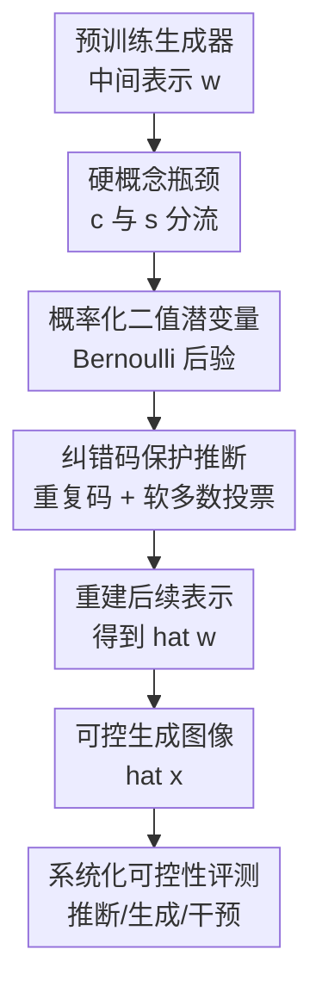

# A Probabilistic Hard Concept Bottleneck for Steerable Generative Models

**会议**: ICLR2026  
**OpenReview**: [https://openreview.net/forum?id=Kcb6WufAco](https://openreview.net/forum?id=Kcb6WufAco)  
**代码**: https://github.com/mariamartinezgarcia/vhcb  
**领域**: 图像生成 / 可控生成 / 可解释生成模型  
**关键词**: 概念瓶颈, 可控生成, 硬概念, 二值VAE, 生成模型评测  

## 一句话总结

这篇论文把生成模型中的概念瓶颈改成一个概率化的硬二值概念层 VHCB，让用户既能从指定概念直接采样生成图像，也能对已有生成结果做概念干预，并在 StyleGAN2 与 DDPM 上系统验证其比软概念瓶颈更可控、更少概念泄漏。

## 研究背景与动机

**领域现状**：可控图像生成通常希望把人类可理解的属性放到生成过程里，例如让人脸图像变成“微笑”“戴眼镜”或“黑发”。概念瓶颈生成模型（Concept Bottleneck Generative Models, CBGMs）就是沿着这个方向发展的：它们在生成器的中间表示 $w$ 和后续生成模块之间插入一个概念层，把中间表示映射为概念 $c$ 与额外的非监督表示 $s$，再由 $(c,s)$ 重建后续生成所需的表示 $\hat{w}$。

**现有痛点**：已有 CBGMs 多数使用软概念概率或概念 embedding。软概率看起来可解释，但每个概率值本身仍是连续实数，模型可能把与目标属性无关的信息偷偷编码进“小数部分”。这就是概念泄漏：表面上用户只改了一个概念，实际模型仍能从软概念里读出额外线索，导致干预不透明、控制不稳定。更糟的是，现有 post-hoc 概念瓶颈方法通常只能在已有图像的中间表示上做概念替换，不能直接从“我指定一组概念”开始采样新图像。

**核心矛盾**：生成模型需要保留足够多的细节才能生成高质量图像，但概念瓶颈又希望概念通道足够离散、干净、可干预。若把所有信息都压到人类概念里，纹理、姿态、光照等无法被完整表达；若放任旁路和软概念过强，概念层又会失去真正的瓶颈作用。

**本文目标**：作者要解决三个具体问题：第一，让概念层从软概率控制变成可直接开关的硬概念；第二，让概念瓶颈本身具备概率生成能力，从而支持指定概念配置的直接生成；第三，建立一套能区分“概念层失效”和“目标概念组合本来就离训练分布太远”的评测流程。

**切入角度**：论文借用了二值离散 VAE 的思想。二值潜变量天然适合表示“概念是否存在”，而 VAE 的概率形式又能从 latent space 直接采样。作者进一步用纠错码保护二值潜变量，缓解离散推断容易出错的问题。

**核心 idea**：用一个带纠错码的概率二值 VAE 层，把生成器中间表示 $w$ 映射到硬概念 $c$ 和二值旁路 $s$，以硬概念减少泄漏、以概率潜空间支持指定概念生成。

## 方法详解

### 整体框架

本文方法叫 Variational Hard Concept Bottleneck（VHCB）。它不是从头训练一个新生成器，而是在 post-hoc 设置下把 VHCB 插入到预训练生成模型的中间位置：预训练生成器先从噪声或扩散状态得到中间表示 $w$，VHCB 将 $w$ 编码为硬概念向量 $c$ 与非监督二值旁路 $s$，再解码回生成器后半段需要的 $\hat{w}$，最后生成图像 $\hat{x}$。

这个框架保留了 CBGMs 的基本形状，但把概念层从“连续软概率”换成“可采样、可纠错、可开关的二值潜变量”。因此它有两种控制模式：给定已有图像时，把某个概念 bit 从 0 改成 1 或从 1 改成 0；没有已有图像时，直接指定一组概念 $c$，再采样旁路 $s$ 来生成满足这些属性的新图像。

### 关键设计

**1. 硬概念瓶颈：把可解释属性变成真正可开关的中间变量**

已有 CB-AE 等方法虽然把中间表示映射到概念空间，但概念通常以 logits 或概率形式存在。概率值 $0.91$ 和 $0.92$ 在人看来都表示“概念存在”，但模型可以利用这些细微差别携带其它图像信息。VHCB 直接建模二值概念 $c \in \{0,1\}^K$，每个 bit 对应一个预定义概念，例如 CelebA-HQ 中的 smiling、black hair、eyeglasses。测试时用户干预概念不再是调连续向量，而是把对应 bit 固定为 0 或 1。

这一步的关键不是“离散化看起来更解释性”这么简单，而是把生成路径里的概念通道收窄到硬二值变量。只要生成器后半段真正依赖 $c$，概念泄漏就更难发生，因为 $c$ 本身没有可供隐藏信息的小数空间。为了不牺牲生成质量，VHCB 仍保留一个非监督旁路 $s \in \{0,1\}^L$，让纹理、姿态、光照、背景等概念集合没有覆盖的因素可以从旁路进入生成过程。

**2. 概率化二值潜变量：让概念瓶颈既能推断也能直接生成**

VHCB 把概念 $c$ 和旁路 $s$ 都看作独立 Bernoulli latent variables。给定中间表示 $w$ 时，编码器产生后验 $q_\eta(c|w)$ 与 $q_\eta(s|w)$；给定指定概念配置时，则可以直接固定或采样 $c$，再从先验采样 $s$，经平滑变换和解码器生成 $\hat{w}$。这使 VHCB 与确定性 CB-AE 的能力边界不同：CB-AE 主要做“已有图像上的概念干预”，VHCB 还能做“从概念配置出发的直接生成”。

由于二值变量不可直接反向传播，作者沿用 Coded DVAE 的重参数化思路，把二值码 $v$ 平滑到 $z \in [0,1]$。对一个 bit，平滑分布写作 $p(z|v=1)=e^{\beta(z-1)}/Z_\beta$，$p(z|v=0)=e^{-\beta z}/Z_\beta$，其中 $Z_\beta=(1-e^{-\beta})/\beta$。直觉上，$v=1$ 时 $z$ 更靠近 1，$v=0$ 时 $z$ 更靠近 0，但二者仍有可微的连续支撑，训练时可以稳定优化。

**3. 纠错码保护推断：用冗余二值码减少离散概念误判**

二值潜变量的好处是干净，代价是单个 bit 错了就会直接改变语义。VHCB 采用 Error-Correcting Code（ECC）来保护概念与旁路：原始 $K$ 维概念 $c$ 被确定性映射成更长的 $K'$ 维编码 $v_c$，旁路 $s$ 也被映射为 $v_s$。论文实际使用的是 uniform repetition code，也就是把每个 bit 重复多次，形成更大的汉明距离。

推断时，编码器先预测冗余 coded bits 的边缘概率，再通过软多数投票把它们还原成原始概念 bit 的概率。这样做的意义在于，若某些重复位被神经网络预测错，整体仍可能回到最近的合法 codeword。对生成控制来说，这相当于给“微笑是否存在”“是否戴眼镜”这类语义开关加了一个抗噪机制，减少中间表示到硬概念映射时的偶然错误。

**4. 系统化可控性评测：把概念推断、直接生成和干预分开检查**

论文的另一个贡献是评测框架。作者不只看生成图像好不好，也不只看概念预测准不准，而是把 CBGMs 应该具备的能力拆成几个任务：概念推断检查 $w \rightarrow c$ 是否准确；disentanglement 检查交换旁路 $s$ 后概念是否保持；direct concept-based generation 检查指定 $c$ 直接生成的图像是否真有这些概念；single concept intervention 检查开关一个目标概念时目标是否改变、非目标是否保持。

特别值得注意的是 minimum Hamming distance intervention。随机改概念可能得到训练数据里几乎不存在的组合，例如同时要求黑发和金发，失败不一定说明概念层差，也可能是目标组合离分布太远。作者因此让目标概念配置尽量接近训练集中常见模式，用最小汉明距离选择目标。这样就能更清楚地区分：失败来自概念瓶颈本身，还是来自数据偏置、概念相关性和预训练生成器的分布限制。

### 一个完整示例

以 CelebA-HQ 上的“激活 mustache”为例，VHCB 先从预训练 StyleGAN2 的 mapping network 得到人脸中间表示 $w$，再推断出该图像的硬概念 $c$ 和旁路 $s$。若原图没有胡子，目标干预就是把 mustache 对应 bit 从 0 改成 1，其余概念 bit 尽量保持不变，旁路 $s$ 也沿用原样以保留身份、姿态和局部外观。

如果概念组合在训练分布中常见，例如“male + mustache + no beard inactive”，VHCB 更容易生成符合目标的图像。但若原图是 female 且 no beard 已经很强，强行激活 mustache 会撞上数据偏置：模型可能同时把性别外观往 male 方向推，或者改变其它关联属性。论文用这个例子说明，可控生成不是只由瓶颈层决定，训练数据中的概念相关性也会决定哪些干预容易、哪些干预天然困难。

### 损失函数 / 训练策略

在 post-hoc 训练中，预训练生成器保持固定。训练样本由生成器自己产生：先采样得到图像 $x_i$，保存对应中间表示 $w_i$，再用监督 ResNet18 或 CLIP zero-shot 分类器给图像打概念伪标签 $p(y_i|x_i)$。VHCB 只学习从 $w$ 到 $(c,s)$ 再回到 $\hat{w}$ 的瓶颈层。

训练目标由四部分组成：

$$
L = \mathbb{E}_{q_\eta(c,s,z|w)} \log p_\theta(w|z)
- D_{SKL}(q_\eta(c|w),p(y|x))
- D_{KL}(q_\eta(s|w)\|p(s))
+ \mathrm{MSE}(x,\hat{x}).
$$

第一项要求解码后的潜表示能重建原始 $w$，否则插入瓶颈会破坏预训练生成器的图像质量。第二项用 symmetric KL，也就是 Jeffreys divergence $D_{SKL}(p,q)=D_{KL}(p\|q)+D_{KL}(q\|p)$，把概念后验对齐到伪标签分布；作者认为它比单向 KL 或 BCE 更能保留分布模式，避免后验塌到均值。第三项约束旁路 $s$ 接近先验，防止旁路吞掉概念信息。最后一项让生成图像 $\hat{x}$ 尽量接近原图像 $x$，保护 post-hoc 插入后的图像质量。

实验中，StyleGAN2 版本把 VHCB 放在 mapping network 和 synthesis network 之间；DDPM 版本尝试把 VHCB 接到 U-Net bottleneck，附录还探索了把 VHCB 输出注入 U-Net 上采样路径多个层级。编码器和解码器都是 4 层 MLP，VHCB 的旁路通常只用 $s \in \{0,1\}^5$，比 CB-AE 的连续 $s \in \mathbb{R}^{40}$ 紧得多。

## 实验关键数据

### 主实验

论文主要比较 VHCB 与 post-hoc CB-AE。核心设置包括 StyleGAN2 on CelebA-HQ、StyleGAN2 on CUB-200-2011，以及 DDPM on CelebA-HQ；概念标签来自 ResNet18 监督分类器或 CLIP zero-shot 分类器。评测指标覆盖概念推断 accuracy、cosine similarity、TV distance，干预时的 target accuracy 与 non-target accuracy，以及图像质量 FID。

| 设置 | 指标 | VHCB | CB-AE | 结论 |
|------|------|------|-------|------|
| CelebA-HQ all, ResNet18 | 概念推断 Acc. | 0.855 | 0.857 | 硬概念不损害概念预测准确率 |
| CelebA-HQ all, ResNet18 | 概念推断 Cosine | 0.804 | 0.763 | VHCB 的软后验更贴近伪标签分布 |
| CelebA-HQ low corr., ResNet18 | disentanglement Acc. | 0.874 | 0.701 | 交换旁路后，VHCB 更能保持概念不变 |
| CelebA-HQ all, CLIP | 概念推断 Acc. | 0.623 | 0.565 | 在 noisy zero-shot 标签下 VHCB 更稳 |

| 设置 | 任务 | VHCB Target Acc. | CB-AE Target Acc. | 观察 |
|------|------|------------------|-------------------|------|
| CelebA-HQ all, ResNet18 | 单概念激活 | 0.170 | 0.105 | 激活稀有概念很难，但 VHCB 更好 |
| CelebA-HQ all, ResNet18 | 单概念去激活 | 0.550 | 0.453 | 去激活更容易，VHCB 仍领先 |
| CelebA-HQ low corr., ResNet18 | 单概念激活 | 0.769 | 0.420 | 低相关概念集上控制能力大幅改善 |
| CelebA-HQ low corr., ResNet18 | 单概念去激活 | 0.765 | 0.554 | VHCB 在目标概念改变上优势明显 |
| CelebA-HQ all, ResNet18 | Hamming 距离干预 | 0.660 | 0.542 | 限制到常见概念模式后成功率提升 |

直接概念生成是 VHCB 独有的能力，因为 CB-AE 没有概率概念生成过程。StyleGAN2 + CelebA-HQ 上，随机概念配置时 all set 的 target accuracy 为 0.551，按训练集中概念模式采样时升到 0.873；low-correlation set 上随机采样为 0.715，模式采样为 0.814。这说明 VHCB 可以从指定概念生成，但是否成功仍强烈依赖目标概念组合是否贴近训练分布。

### 消融实验

| 消融项 | 设置 | 关键指标 | 说明 |
|--------|------|----------|------|
| 概念损失 BCE | CelebA-HQ all, ResNet18 | 激活 0.165 / 去激活 0.555 / Hamming 0.676 | 去激活和 Hamming 略强，但整体不均衡 |
| 概念损失 KL | CelebA-HQ all, ResNet18 | 激活 0.168 / 去激活 0.524 / Hamming 0.669 | 激活接近 VHCB 主设置，去激活较弱 |
| 概念损失 Symm. KL | CelebA-HQ all, ResNet18 | 激活 0.170 / 去激活 0.550 / Hamming 0.660 | 作者选择它作为更均衡的默认概念损失 |
| 旁路 KL 权重 0→40 | CelebA-HQ all, ResNet18 | 概念推断 Acc. 约 0.850-0.856 | 大概念集下旁路正则影响很小 |
| 移除旁路 $s$ | balanced set, ResNet18 | FID 11.016→20.950 | 小概念集下去掉旁路会明显损害图像质量 |
| 移除旁路 $s$ | low corr. set, ResNet18 | FID 11.589→19.501 | 概念集合不完整时，旁路对生成细节很重要 |

### 关键发现

- VHCB 的主要收益不在“概念分类准确率暴涨”，而在干预目标概念时更能真的改变目标属性。CB-AE 有时 non-target accuracy 更高，是因为目标概念本身没改成功，图像几乎不变，非目标自然也保持。
- 数据分布偏置对可控生成影响很大。CelebA-HQ 的 many concepts 是长尾且相关的，激活稀有概念明显难于去激活；把概念集换成 balanced 或 low-correlation 后，两种模型都变好，但 VHCB 提升更明显。
- 直接生成时，按训练集经验模式采样概念比均匀随机采样更可靠。all set 上从 0.551 提升到 0.873，说明 OOD 概念组合是 steerability 的重要瓶颈。
- DDPM 上也能插入 VHCB，但控制更难。bottleneck-only 版本在 Hamming 干预上 target accuracy 很低，多层注入后有所改善，暗示扩散模型需要更仔细设计概念信息如何贯穿 denoising trajectory。

## 亮点与洞察

- **硬概念和概率生成结合得很自然**：硬概念解决泄漏，概率 VAE 解决从概念采样，两者分别对应“可解释控制”和“可生成性”，不是简单把 CBM 搬到生成模型里。
- **旁路 $s$ 的定位很清楚**：作者没有假设人类概念能覆盖所有视觉变化，而是承认概念不完备，并用低维二值旁路吸收残余因素。这个设计比把所有未知信息塞进连续大向量更克制。
- **评测框架比方法本身更可迁移**：target accuracy、non-target accuracy、disentanglement swap、minimum Hamming intervention 这些任务可以直接用于评估其它可控生成方法，尤其适合发现“目标没改但非目标保持很好”的虚假稳健。
- **论文诚实地区分模型能力和数据限制**：很多可控生成失败不是控制器单独造成的，而是训练集概念相关性和预训练生成器偏置共同造成。这个视角对做实际可控编辑很重要。
- **ECC 在概念瓶颈里有启发性**：如果概念层必须离散，推断错误就会变成语义级错误。用冗余码和软多数投票保护概念 bit，是把通信/编码里的可靠性思想迁移到可解释生成的一种漂亮用法。

## 局限与展望

- VHCB 当前仍假设概念相互独立，而实验反复显示概念相关性是可控生成的关键限制。未来可以在概念先验里显式建模相关结构，例如图模型、能量模型或 learned concept prior。
- 概念标签依赖外部分类器或 CLIP 伪标签。若伪标签本身有偏差，VHCB 会继承这些偏差；CUB 上 noisy annotations 和 CLIP 标签下降就说明了这一点。
- 对扩散模型的集成还比较初步。只在 U-Net bottleneck 放瓶颈时，概念信息很难稳定影响整个去噪过程；多层注入虽有改善，但还没有系统探索最佳位置、权重和时间步调度。
- 随机指定概念配置时 FID 和 target accuracy 仍会受 OOD 组合拖累。实际应用中可能需要先检测目标概念组合是否合理，或在用户编辑时给出“该组合可能偏离训练分布”的提示。
- 旁路 $s$ 虽然被压成低维二值变量，但它学到的新概念目前还没有被系统解释。若能进一步把 $s$ 中稳定维度命名或发现为新概念，VHCB 会更接近可解释生成的完整闭环。

## 相关工作与启发

- **vs Concept Bottleneck Models**: 传统 CBM 面向分类，在输入和标签之间放概念层。本文把这个思想扩展到生成模型中间表示，并强调概念不仅要能解释，还要能生成和干预。
- **vs Concept Bottleneck Generative Models / CEM**: CEM 类方法通常需要 in-hoc 联合训练生成模型和概念层，训练成本更高。VHCB 主打 post-hoc 插入预训练生成器，更适合复用已有高质量 StyleGAN2 或 DDPM。
- **vs CB-AE**: CB-AE 也是 post-hoc 概念瓶颈，但使用软概念和确定性自编码器，需要额外 intervention losses 来约束干预效果。VHCB 用硬概念减少泄漏，并用概率潜空间支持直接概念生成。
- **vs 无监督可解释方向发现**: GANSpace、disentangled representation 等方法能找到可控方向，但这些方向不一定与人类预定义概念一一对应。VHCB 则从一开始就把概念变量对齐到可命名属性。
- **启发**: 对任何“用户想直接控制生成内容”的模型，评测时都应同时报告目标是否改变和非目标是否保持；只看编辑后图像是否相似，容易把“根本没编辑成功”误判成稳定控制。

## 评分

- 新颖性: ⭐⭐⭐⭐☆ 把 hard concept、binary VAE、ECC 和 CBGMs 组合得比较新，直接概念生成能力是相对清晰的增量。
- 实验充分度: ⭐⭐⭐⭐☆ 覆盖 StyleGAN2、DDPM、CelebA-HQ、CUB、多种概念集和伪标签来源，附录消融也较完整；但扩散模型部分还偏探索。
- 写作质量: ⭐⭐⭐⭐☆ 方法和评测任务定义清楚，表格信息密集；部分 DDPM 设计细节需要读附录才能完整理解。
- 价值: ⭐⭐⭐⭐☆ 对可解释可控图像生成很有参考价值，尤其是评测框架和硬概念瓶颈设计，可迁移到后续生成模型控制研究。

<!-- RELATED:START -->

## 相关论文

- [\[CVPR 2026\] Interpretable and Steerable Concept Bottleneck Sparse Autoencoders](../../CVPR2026/image_generation/interpretable_and_steerable_concept_bottleneck_sparse_autoencoders.md)
- [\[ICLR 2026\] Conditionally Whitened Generative Models for Probabilistic Time Series Forecasting](conditionally_whitened_generative_models_for_probabilistic_time_series_forecasti.md)
- [\[ICLR 2026\] FastFlow: Accelerating The Generative Flow Matching Models with Bandit Inference](fastflow_accelerating_the_generative_flow_matching_models_with_bandit_inference.md)
- [\[ICLR 2026\] CASteer: Cross-Attention Steering for Controllable Concept Erasure](casteer_cross-attention_steering_for_controllable_concept_erasure.md)
- [\[ICLR 2026\] A Hidden Semantic Bottleneck in Conditional Embeddings of Diffusion Transformers](a_hidden_semantic_bottleneck_in_conditional_embeddings_of_diffusion_transformers.md)

<!-- RELATED:END -->
