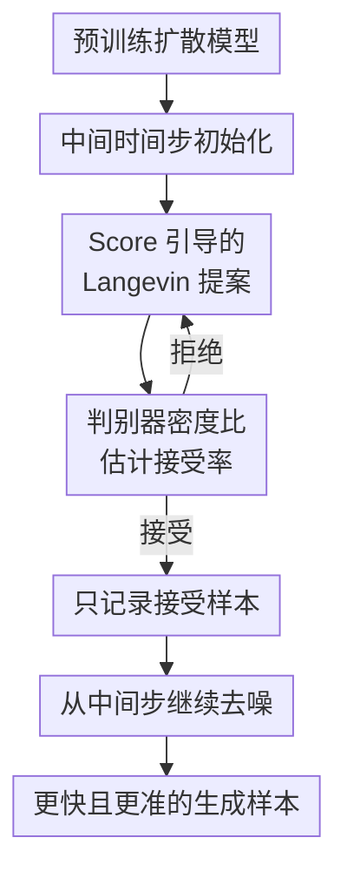

# AC-Sampler: Accelerate and Correct Diffusion Sampling with Metropolis-Hastings Algorithm

**会议**: ICLR2026  
**OpenReview**: [https://openreview.net/forum?id=kWl13kRJTQ](https://openreview.net/forum?id=kWl13kRJTQ)  
**代码**: https://github.com/aailab-kaist/AC-Sampler  
**领域**: 扩散模型 / 图像生成  
**关键词**: 扩散采样, Metropolis-Hastings, MALA, 采样加速, 分布校正

## 一句话总结
AC-Sampler 把扩散模型的生成过程截到中间时间步，用基于 score 的 Langevin proposal 产生候选，再用 Metropolis-Hastings 接受率校正到真实边缘分布，从而在不微调基础模型的前提下同时降低 NFE 并改善 FID。

## 研究背景与动机
**领域现状**：扩散模型已经成为高保真图像生成、视频生成和文生图系统里的主流生成范式。
它们通常从一个简单先验噪声出发，沿着大量反向去噪 transition kernel 一步步走向数据分布。
这种迭代式结构很稳，也让预训练模型、采样器和下游系统之间形成了清晰接口。

**现有痛点**：问题也恰恰来自这条长链。
一方面，每个去噪步都要调用 score network 或 denoiser，NFE 很高，实际服务里生成多张候选图会很慢。
另一方面，预训练扩散模型学到的反向核只是近似真实反向扩散过程；步数越多，近似误差就越容易沿链条累积。
因此，单纯“少走几步”容易破坏质量，单纯“加校正”又往往增加额外计算。

**核心矛盾**：加速方法和校正方法长期被分开处理。
ODE/SDE 高阶求解器、DDIM、DPM-v3 这类方法主要压缩采样步数，但缺少把最终分布拉回真实数据分布的保证。
DG、DiffRS、Restart 等校正方法则关注纠偏，却常常要额外判别器调用、梯度计算或重复前后向采样，反而拖慢生成。

**本文目标**：作者想解决的是一个更具体的问题：能不能直接在扩散链的中间时间步产生多个有效样本，同时保证这些中间样本更接近真实边缘分布？
如果可以，后续只需从该中间步继续去噪到 $t=0$，就能少走从先验到中间步的一大段路径。
同时，中间样本经过 MH 校正后，误差不会只是被“跳步”隐藏，而是真的在分布层面被修正。

**切入角度**：本文把扩散采样重新看成一个在中间噪声分布 $q_\tau$ 上运行的 MCMC 问题。
预训练 score model 已经给出了近似 $\nabla_x \log q_t(x)$ 的方向，因此很自然可以构造 Langevin proposal。
真正难点在于 MH 接受率需要真实边缘密度比 $q_t(\tilde{x}_t) / q_t(x_t)$，而这个密度本身不可直接计算。

**核心 idea**：用“中间时间步的 MALA 提案 + 时间相关判别器估计密度比”替代从纯噪声完整生成，让每个被接受的中间样本既少花去噪步数，又经过 Metropolis-Hastings 校正。

## 方法详解
AC-Sampler 的方法核心可以概括成一句话：先从基础扩散模型走到目标时间步 $\tau$，再在 $q_\tau$ 上跑一条带 MH 校正的 Langevin 链，最后把被接受的中间样本继续去噪成图像。
这不是训练一个新扩散模型，也不是蒸馏采样器；基础 denoiser 保持不变，只额外训练一个时间相关判别器来估计模型边缘分布和真实边缘分布的密度比。

### 整体框架
输入是一个已训练好的扩散模型 $s_\theta(x_t,t)$、目标时间步 $\tau$、MALA 链长度和一个时间相关判别器 $d_\phi(x_t,t)$。
AC-Sampler 先从先验按基础采样器去噪到 $\tau$，得到当前链状态 $x_\tau$；随后反复提出候选 $\tilde{x}_\tau$，计算 MH 接受率，直到接受一个新状态；经过 burn-in 后，把接受的中间样本继续去噪到 $x_0$，得到最终图像。
加速来自“从 $\tau$ 开始复用中间样本，不必每张图都从 $T$ 走完整路径”，校正来自“接受率以真实边缘分布 $q_\tau$ 为目标”。

### 关键设计
**1. 中间时间步初始化：把加速问题变成在 $q_\tau$ 上采样**

传统扩散采样每张图都要从 $x_T$ 一路去噪到 $x_0$，AC-Sampler 则选一个目标时间步 $\tau$，先用基础模型从先验走到 $x_\tau$，然后把这个 $x_\tau$ 当作 MCMC 链的起点。
后续每次得到一个新的被接受状态，都只需要从 $\tau$ 去噪到 $0$，省掉从 $T$ 到 $\tau$ 的重复计算。
这就解释了为什么论文的加速不是“粗暴减少全部步数”，而是把一段昂贵的前缀采样变成多个样本共享的中间链探索。

这个设计成立的前提是：中间状态不能只是模型边缘分布 $p^\theta_\tau$ 的样本，否则模型误差仍然存在。
因此，AC-Sampler 的目标分布不是 $p^\theta_\tau$，而是真实前向扩散边缘 $q_\tau$。
只要 MCMC 链能把中间样本拉向 $q_\tau$，再由基础反向核从 $\tau$ 去噪到 $0$，最终分布就有机会比原始模型分布更接近真实数据分布。

**2. Score 引导的 Langevin 提案：一次 denoiser 调用同时服务探索和去噪**

在目标时间步 $t$，AC-Sampler 使用 Metropolis-adjusted Langevin Algorithm 的 proposal：

$$
p^\theta_{\mathrm{proposal},t}(\cdot \mid x_t)
= \mathcal{N}\left(x_t + \frac{\eta}{2}s_\theta(x_t,t),\eta I\right).
$$

这里 $s_\theta(x_t,t)$ 是预训练扩散模型给出的 score 近似，$\eta$ 是 Langevin 步长。
直觉上，proposal 不再是无方向的随机扰动，而是沿着“更像数据边缘分布”的方向移动一点，再加上高斯噪声保持探索。
论文还按 SNR 自适应设置 $\eta$，因为中间时间步越靠近数据分布，分布越尖锐，步长太大容易拒绝，步长太小又混合太慢。

这个 proposal 的效率点在于它复用扩散模型本来就要算的 score。
同一个 score output 既能构造 Langevin 候选，也能参与后续反向去噪核的均值计算。
因此，相比需要全程调用判别器梯度的校正方法，AC-Sampler 的额外开销更集中在中间链，而不是铺满整个采样轨迹。

**3. 判别器密度比接受率：把不可算的 $q_t$ 比值拆成可估计项**

MH 接受率需要
$q_t(\tilde{x}_t)p( x_t\mid \tilde{x}_t) / (q_t(x_t)p(\tilde{x}_t\mid x_t))$，难点是 $q_t(\tilde{x}_t)/q_t(x_t)$ 不可直接求。
作者的关键推导是：对任意固定的 $x_{t-1}$，真实边缘密度比可以拆成前向转移项、模型反向核项和 likelihood ratio $L_t(x_t)=q_t(x_t)/p^\theta_t(x_t)$。
再把 $x_{t-1}$ 选成两个反向核均值的中点，两个高斯反向核项会因为等距且同方差而抵消。

于是接受率变成三个可处理部分：前向高斯项、判别器给出的 likelihood ratio、proposal 高斯项：

$$
\hat{\alpha}=\min\left(1,
\frac{q_{t|t-1}(\tilde{x}_t \mid \hat{x}_{t-1})}{q_{t|t-1}(x_t \mid \hat{x}_{t-1})}
\cdot \frac{\tilde{L}}{L}
\cdot
\frac{p^\theta_{\mathrm{proposal},t}(x_t\mid\tilde{x}_t)}{p^\theta_{\mathrm{proposal},t}(\tilde{x}_t\mid x_t)}
\right).
$$

其中 $L$ 和 $\tilde{L}$ 来自时间相关判别器。
判别器用二分类目标区分真实前向样本 $q_t$ 和模型边缘样本 $p^\theta_t$；最优判别器满足
$d^*_\phi(x_t,t)=q_t(x_t)/(q_t(x_t)+p^\theta_t(x_t))$，因此 $L_t(x_t)$ 可以由 $d_\phi(x_t,t)/(1-d_\phi(x_t,t))$ 估计。
这一步把原本不可计算的真实边缘密度比，转成了一个相对便宜的判别器估计问题。

**4. 只记录接受样本：为有限预算的生成任务改造 MH 链**

标准 MH 在拒绝 proposal 时会保留原状态作为下一步，这对严格 detailed balance 很重要，但在图像生成的有限样本场景里会带来一个尴尬副作用：同一个连续空间样本被重复记录。
论文指出，真实连续分布里精确重复同一点的概率为零；重复样本更多是拒绝机制的人为痕迹，会损害有限样本的经验分布和多样性。

因此 Algorithm 1 使用 propose-until-accept：不断提出候选，直到某个候选通过接受率检验，只把这个被接受的新状态写入链。
理论部分仍基于标准 MH 给出分布校正保证，实践中则把该变体解释为 Jump Markov chain。
消融结果也支持这个选择：传统保留拒绝状态的 MH 版本在 EDM 27 NFE 设置下 FID 变差到 3.22，而 propose-until-accept 的 AC 版本达到 1.97。

### 一个完整示例
可以把一次文生图系统里的“四张候选图”生成看成 AC-Sampler 的典型使用场景。
基础 SD-v1.5 用 DDIM 采样时，每张图都要完整走 50 次 denoiser 调用；如果用户同一个 prompt 需要四张候选图，前面的高噪声去噪阶段会被重复做四次。

AC-Sampler 先对该 prompt 走到一个中间时间步 $\tau$，得到初始 $x_\tau$。
随后在这个中间噪声层面运行 MALA：当前状态经过 score 引导得到候选 $\tilde{x}_\tau$，判别器估计当前点和候选点的 $q_\tau/p^\theta_\tau$ 比值，结合前向项与 proposal 项算出接受率。
如果拒绝，就继续提新候选；如果接受，就把这个中间样本继续去噪成一张图。
链继续向前探索，产生下一张被接受的中间样本，再去噪成第二张图。

这样得到的多张图不是简单复制同一条采样轨迹的末端，而是在中间分布上经过 MH 校正后的不同状态。
这也解释了为什么它特别适合“每个 prompt 生成多张图再挑选”的真实产品形态：前缀采样被摊薄，候选之间又有分布校正带来的质量收益。

### 损失函数 / 训练策略
基础扩散模型不需要微调，AC-Sampler 只训练一个时间相关判别器 $d_\phi(x_t,t)$。
训练数据一边来自真实数据 $x_0\sim q_0$ 经过前向扩散得到的 $x_t\sim q_t$，另一边来自模型生成样本 $x_0\sim p^\theta_0$ 再前向扩散得到的 $x_t\sim p^\theta_t$。
判别器用带时间权重的 binary cross-entropy：

$$
\mathcal{L}_{\mathrm{BCE}}(\phi)=\int \lambda(t)
\left(
\mathbb{E}_{x_t\sim q_t}[-\log d_\phi(x_t,t)]
+\mathbb{E}_{x_t\sim p^\theta_t}[-\log(1-d_\phi(x_t,t))]
\right)dt.
$$

推理时主要超参数是目标时间步 $\tau$、MALA 链长度和 proposal 的 SNR。
$\tau$ 太靠近数据端时，分布更尖锐，MALA 混合会变难；SNR 太小会让 proposal 变化很小，SNR 太大又可能降低接受率。
论文的超参分析显示，在有限生成预算下，$\tau$ 和 SNR 不是装饰性参数，而是直接决定 FID、NFE 和 Recall 的核心旋钮。

## 实验关键数据

### 主实验
论文在 CIFAR-10、CelebA-HQ 256×256、ImageNet 64×64/256×256 和 Stable Diffusion v1.5 文生图上验证 AC-Sampler。
整体结论是：在多数设置下，AC-Sampler 不仅降低 NFE，还能改善或至少保持 FID、CLIP、Recall 等指标。

| 数据集 / 设置 | 基础方法 | 本文 AC-Sampler | 主要变化 |
|--------|------|------|----------|
| CIFAR-10, EDM Heun | FID 2.01, NFE 35 | FID 1.97, NFE 26.19 | 质量小幅提升，NFE 明显下降 |
| CIFAR-10, EDM Heun 低步数 | FID 3.23, NFE 17 | FID 2.38, NFE 15.81 | 低 NFE 区间收益最明显 |
| CIFAR-10, DG | FID 1.93, NFE 27 | FID 1.84, NFE 26.19 | 可叠加已有校正方法 |
| CIFAR-10, DPM-v3 | FID 12.41, NFE 5 | FID 9.88, NFE 4.78 | 可叠加已有加速方法 |
| CelebA-HQ 256×256, ScoreSDE KAR2 | FID 29.74, NFE 198 | FID 6.60, NFE 98.27 | 高分辨率无条件生成显著改善 |
| ImageNet 256×256, DiT DDPM | FID 2.35, NFE 250 | FID 2.31, NFE 234.38 | 类条件大模型上仍有轻微收益 |
| SD-v1.5, COCO prompts | FID 24.34, NFE 50.00, CLIP 0.3202 | FID 23.16, NFE 45.24, CLIP 0.3210 | 文生图质量与对齐略升，NFE 下降 |

### 消融实验
| 配置 | 关键指标 | 说明 |
|------|---------|------|
| EDM Base | FID 2.05, NFE 27, Recall 0.627 | 未使用 AC 的基础采样器 |
| +AC with conventional MH | FID 3.22, NFE 25.08, Recall 0.580 | 保留拒绝状态导致有限样本经验分布变差 |
| +AC with Algorithm 1 | FID 1.97, NFE 26.19, Recall 0.628 | propose-until-accept 更适合生成任务 |
| 去掉 MH 接受-拒绝 | FID 明显恶化 | 所有 proposal 都接受会破坏目标分布校正 |
| 25-Gaussian toy, DDPM | 平均覆盖 23.5 / 25 个 mode, NFE 1000 | 基础模型存在 mode 覆盖不足 |
| 25-Gaussian toy, +AC | 覆盖 25 / 25 个 mode, NFE 504.5 | 分布校正同时减少采样计算 |

### 关键发现
- MH 校正不是可有可无的“后处理”。去掉接受-拒绝后 FID 明显变差，说明判别器估计的密度比确实在帮助中间样本对齐目标分布。
- AC-Sampler 在低 NFE 区间尤其有价值。EDM 从 17 NFE 的 FID 3.23 改到 AC 的 FID 2.38，同时 NFE 降到 15.81，说明它不是简单地用更少步数换更差质量。
- 它和已有采样器具有正交性。DPM-v3、DG、DDO 等方法前面加 AC 后仍能获得额外收益，说明本文不是替代某个具体 solver，而是一个可插入的中间分布校正框架。
- 额外判别器不会必然拖慢 wall-clock。论文在 RTX 3090 上生成 100 张图，EDM 35 NFE 用时 6.46 秒，AC 版本用时 5.26 秒；低步数设置下也基本持平或更快。
- 样本多样性没有明显牺牲。CIFAR-10 上 Recall 与基础模型相当，toy experiment 还能更完整覆盖 mode，缓解了“MCMC 样本相关性会损害多样性”的担忧。

## 亮点与洞察
- 最巧妙的地方是把扩散模型的中间时间步当作 MCMC 目标分布，而不是只在最终图像空间做校正。
  这样既保留了扩散模型在高维图像空间里的 score 结构，又能自然减少从先验到中间步的重复计算。
- 密度比推导非常关键。作者没有直接假设能得到 $q_t(x)$，而是通过选择反向核均值的中点，让难处理的模型反向核比值抵消，再用判别器估计 $q_t/p^\theta_t$。
- propose-until-accept 是一个很务实的工程判断。它偏离标准 MH 的记录方式，但更符合生成模型有限样本评估的目标：用户要的是若干不同候选图，而不是一条保留拒绝状态的严格链轨迹。
- 论文把“加速”和“校正”放进同一个接受率框架里，而不是把它们做成两个串联 trick。
  这让理论部分可以同时讨论 NFE reduction 和 KL divergence bound，实验也能解释为什么低步数下质量没有崩。
- 这个思路可迁移到其他需要多候选生成的任务，例如视频扩散、3D 生成、分子生成或合成数据筛选。
  只要能构造中间状态的 score proposal，并训练一个区分真实边缘和模型边缘的判别器，就有机会复用同样的校正逻辑。

## 局限与展望
- 需要额外训练时间相关判别器。虽然成本低于重训扩散模型，但在数据管线、存储模型边缘样本、调时间权重 $\lambda(t)$ 上仍有实际负担。
- 理论保证依赖理想化条件，例如最优判别器、足够长的 MALA 链和若干可积性假设；实际系统里链长有限，判别器也会有误差。
- proposal 的超参数敏感性不低。论文表明 $\tau$ 和 SNR 对 FID、NFE、Recall 影响明显，这意味着不同模型、分辨率和条件设置可能都要重新调参。
- 文生图实验的提升幅度相对温和。SD-v1.5 上 FID、CLIP、GenEval 都有改善，但不是质变；更强的现代文生图模型上是否还有同样收益，需要进一步验证。
- 只记录接受样本虽然更适合有限生成，但严格 stationary distribution 分析会更复杂。未来可以把 Jump Markov chain 的理论和扩散中间分布结合得更完整。

## 相关工作与启发
- **vs DDIM / DPM-Solver / DPM-v3**: 这些方法主要通过确定性路径、高阶 ODE solver 或改进时间离散来减少采样步数；AC-Sampler 则在中间时间步上做 MH 校正，目标是同时纠正模型边缘分布误差。
- **vs DLG**: DLG 也从 MCMC 角度加速扩散生成，通过在数据-时间联合空间中寻找低噪声初始化来缩短轨迹；本文更进一步给出 MH 接受率和密度比估计，使中间分布校正有更明确的理论目标。
- **vs DG**: DG 用时间相关判别器指导 score 过程以修正采样，但判别器参与范围更广，且可能需要梯度计算；AC-Sampler 只在 MALA 链里用判别器估计 likelihood ratio，额外 D-NFE 更低。
- **vs DiffRS**: DiffRS 使用 rejection sampling 追求从真实分布采样，但代价可能较高；AC-Sampler 用 MALA proposal 让候选更接近目标，再用 MH 接受率筛选，兼顾探索方向和接受效率。
- **启发**: 如果一个生成过程本身有可解释的中间分布，且已有模型能提供近似 score，那么“中间分布 MCMC 校正”可能比只在最终输出上 rerank 更有原则，也更容易和理论分析连接。

## 评分
- 新颖性: ⭐⭐⭐⭐⭐ 把中间时间步采样、MALA proposal、判别器密度比和 MH 校正组合得很完整，不只是常规采样器调参。
- 实验充分度: ⭐⭐⭐⭐ 覆盖 CIFAR-10、CelebA-HQ、ImageNet 和 SD-v1.5，也有消融、wall-clock 与 toy 分布分析；更强文生图模型上的验证还可以继续补。
- 写作质量: ⭐⭐⭐⭐ 方法主线和理论动机清楚，表格信息密集；部分理论假设和工程变体之间的关系需要读 appendix 才更完整。
- 价值: ⭐⭐⭐⭐⭐ 对需要多候选、高吞吐生成的扩散系统很有实际意义，也给“采样加速必须牺牲校正”这个默认印象提供了一个反例。

<!-- RELATED:START -->

## 相关论文

- [\[ICLR 2026\] Evolutionary Caching to Accelerate Your Off-the-Shelf Diffusion Model](evolutionary_caching_to_accelerate_your_off-the-shelf_diffusion_model.md)
- [\[ICLR 2026\] One Step Further with Monte-Carlo Sampler to Guide Diffusion Better](one_step_further_with_monte-carlo_sampler_to_guide_diffusion_better.md)
- [\[CVPR 2026\] One Algorithm to Align Them All](../../CVPR2026/image_generation/one_algorithm_to_align_them_all.md)
- [\[NeurIPS 2025\] Learnable Sampler Distillation for Discrete Diffusion Models](../../NeurIPS2025/image_generation/learnable_sampler_distillation_for_discrete_diffusion_models.md)
- [\[ICML 2025\] Progressive Tempering Sampler with Diffusion](../../ICML2025/image_generation/progressive_tempering_sampler_with_diffusion.md)

<!-- RELATED:END -->
