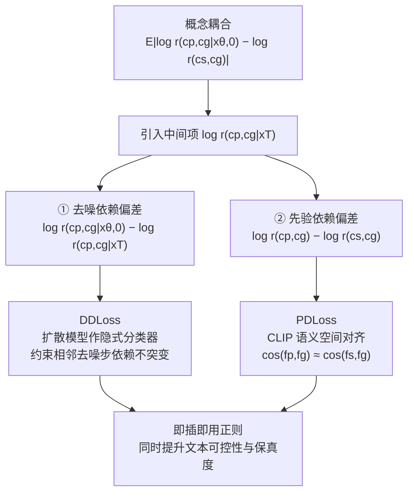

# ACCORD: Alleviating Concept Coupling through Dependence Regularization for Text-to-Image Diffusion Personalization

**会议**: ICLR 2026  
**代码**: [https://github.com/antgroup/ACCORD](https://github.com/antgroup/ACCORD)  
**领域**: 图像生成 / 扩散模型个性化  
**关键词**: 概念耦合, 文生图个性化, 依赖正则化, DreamBooth, 即插即用损失  

## 一句话总结
ACCORD 首次把文生图个性化里的"概念耦合"（主体与上下文被绑死）形式化成一个统计依赖问题，把总依赖偏差拆成"去噪依赖偏差"和"先验依赖偏差"两个可计算的来源，再用两个即插即用的正则化损失（DDLoss + PDLoss）分别消除它们，在主体/风格/人脸个性化上同时提升文本可控性与个性化保真度。

## 研究背景与动机
**领域现状**：文生图个性化（如 DreamBooth、LoRA、IP-Adapter）只需要 3-6 张参考图就能让 T2I 模型学会一个私有概念（自家宠物、特定背包、独特画风）。但参考图数量少、多样性低，往往把目标和它周围反复出现的东西拍在一起。

**现有痛点**：模型会把"主体"和"上下文"建立起虚假关联——论文里的例子是一个"backpack*"始终和一个女孩同框，微调后模型一生成背包就连带把女孩也生出来，直接违背文本提示。已有方法都在间接绕：数据正则（用超类数据集，但会扭曲概念关系）、权重正则（约束参数更新，但会无差别地损害保真度）、损失正则（启发式目标，和底层统计问题没有直接联系）、区域正则（只对空间可分的物体有效，对画风这种全局属性失效）。

**核心矛盾**：这些方法本质上都把概念耦合当成"过拟合的症状"去治，而不是直接建模并最小化定义耦合的那个"非预期统计依赖"，因此始终在"个性化保真度"和"文本可控性"之间被迫做取舍。

**本文目标**：跳出启发式修补，从根因上诊断和治理概念耦合。

**核心 idea**：**[把概念耦合形式化为统计依赖问题]** 用条件依赖系数 $r(c_p, c_g|x) = \frac{p(c_p,c_g|x)}{p(c_p|x)p(c_g|x)}$ 度量个性化目标 $c_p$ 与通用文本条件 $c_g$ 的耦合程度（$r=1$ 即条件独立），把"目标生成图相对超类先验的多余依赖"$E_{x_\theta}[|\log r(c_p,c_g|x_{\theta,0}) - \log r(c_s,c_g)|]$ 作为要最小化的量，再分解成两个可计算的子项分别下手。

## 方法详解

### 整体框架
ACCORD 的出发点是一个分解定理：把"生成图相对超类先验的总依赖偏差"拆成两段——**去噪过程中累积的依赖偏差**（Denoising Dependence Discrepancy）和**学到的概念本身偏离超类带来的先验偏差**（Prior Dependence Discrepancy），中间用纯噪声 $x_T$ 处的依赖系数 $\log r(c_p,c_g)$ 把两段桥接起来。对应这两段，ACCORD 给出两个即插即用损失：DDLoss 借扩散模型当隐式分类器、PDLoss 借 CLIP 当密度比估计器，按个性化设置可单用或合用，不改任何架构与超参。

### 关键设计

**1. 依赖偏差分解定理：把不可计算的目标拆成两个可治的源头。** 直接最小化 $E_{x_\theta}[|\log r(c_p,c_g|x_{\theta,0}) - \log r(c_s,c_g)|]$ 没有闭式表达。论文引入中间项 $\log r(c_p,c_g|x_T)$（$x_T$ 是与条件独立的标准高斯噪声，因此 $\log r(c_p,c_g|x_T)=\log r(c_p,c_g)$），把总偏差分解为 $|\underbrace{\log r(c_p,c_g|x_{\theta,0})-\log r(c_p,c_g|x_T)}_{\text{去噪依赖偏差}} + \underbrace{\log r(c_p,c_g)-\log r(c_s,c_g)}_{\text{先验依赖偏差}}|$。前者刻画去噪过程中被引入的依赖变化，后者刻画学到的概念 $c_p$ 偏离超类 $c_s$ 造成的先验改变。这个分解是整套方法的地基——两个源头各对应一个损失。

**2. Denoising Decouple Loss（DDLoss）：把"端到端依赖差"松弛成"相邻步依赖不突变"。** 去噪依赖偏差连接的是首步和末步，和扩散训练逐步采样时间步的机制不兼容。论文用三角不等式把它上界为相邻步偏差之和 $|\log r(c_p,c_g|x_{\theta,0})-\log r(c_p,c_g|x_T)| \le \sum_t |\log r(c_p,c_g|x_{\theta,t-1})-\log r(c_p,c_g|x_{\theta,t})|$，即"不让主体与任何概念的条件依赖在相邻去噪步之间剧烈变化"。再借 Bayes 定理与噪声潜变量的高斯性，把相邻步依赖差写成闭式：$\log r(c_p,c_g|x_{\theta,t-1})-\log r(c_p,c_g|x_{\theta,t}) = \frac{1}{2\sigma_t^2}[\|U_\theta(x_t,(c_p,c_g),t)-U_\theta(x_{\theta,t},c_p,t)\|^2 + \|U_\theta(x_t,(c_p,c_g),t)-U_\theta(x_{\theta,t},c_g,t)\|^2 - \|U_\theta(x_t,(c_p,c_g),t)-U_\theta(x_{\theta,t},\emptyset,t)\|^2]$。直观说就是：把"联合条件 $(c_p,c_g)$"的预测分别和"单概念 $c_p$""单概念 $c_g$""空条件 $\emptyset$"的预测比距离，用 full-personal、full-text 两个距离减去 full-empty 距离来度量关系是否被改变。最终 $L_{DD}=\sum_t \frac{t}{T}|\cdot|$，用线性时变权重 $t/T$ 让大 $t$ 步贡献更大；实践中用 $x_t$ 近似 $x_{\theta,t}$（无偏估计且训练时单步采样可得），并对单概念与空条件项停梯度以保护模型先验知识。DDLoss 不需要架构改动，对任何微调式个性化方法都能挂上。

**3. Prior Decouple Loss（PDLoss）：当 $c_p$ 可训练时，借 CLIP 把它的关系拉回超类。** 当 $c_p$ 固定且接近 $c_s$ 时，耦合主要来自去噪依赖偏差，单用 DDLoss 即可。但如果把 $c_p$ 训成 CLIP 文本表示或参考图的视觉表示来抓更多细节，$c_p$ 会偏离 $c_s$ 导致先验依赖偏差骤增。先验依赖偏差可等价写成 $\log r(c_p,c_g)-\log r(c_s,c_g)=\log\frac{p(c_g|c_p)}{p(c_g|c_s)}$，但它独立于去噪过程、扩散模型帮不上忙。论文转而利用 CLIP 的语义空间——CLIP 用 InfoNCE 训练，其目标本质是估计密度比，故 $\tau\cos(f_j,f_k)\propto\frac{p(c_j|c_k)}{p(c_j)}$。据此定义 $L_{PD}=E_{c_g}[|\cos(f_p,f_g)-\cos(f_s,f_g)|]\propto E_{c_g}[|\frac{p(c_g|c_p)-p(c_g|c_s)}{p(c_g)}|]$，即在 CLIP 投影空间里让"个性化目标 $f_p$ 与通用文本 $f_g$ 的余弦相似度"逼近"超类 $f_s$ 与 $f_g$ 的余弦相似度"，从而对齐 $p(c_g|c_p)$ 与 $p(c_g|c_s)$。$c_p$ 可来自 CLIP 文本编码器或映射到同一空间的视觉表示，两者都满足应用密度比近似的条件。

## 实验关键数据

### 主实验表格（DreamBench 主体个性化）

| Method | CLIP-T↑ | BLIP-T↑ | CLIP-I↑ | DINO-I↑ | Params. |
|---|---|---|---|---|---|
| DreamBooth (DB) | 30.3 | 40.3 | 74.0 | 69.3 | 819.7 M |
| DB w/ Ours* | 31.3 (+1.0) | 42.1 (+1.8) | 78.6 (+4.6) | 74.4 (+5.1) | 819.7 M |
| CustomDiffusion (CD) | 34.2 | 45.4 | 62.7 | 56.9 | 18.3 M |
| CD w/ Ours* | 34.1 (-0.1) | 46.6 (+1.2) | 71.4 (+8.7) | 65.6 (+8.7) | 18.3 M |
| LoRA (SDXL) | 34.5 | 47.0 | 76.3 | 72.1 | 92.9 M |
| Omnigen (zero-shot) | 35.3 | 47.8 | 73.9 | 68.6 | 3.8 B |
| LoRA w/ Ours* | 35.2 (+0.7) | 47.7 (+0.7) | 77.1 (+0.8) | 72.4 (+0.3) | 92.9 M |

LoRA(SDXL)+ACCORD（93M 可训练参数）在主体与风格上都超过 3.8B 的 Omnigen；CustomDiffusion 挂上后 CLIP-I/DINO-I 暴涨 +8.7，说明显著修复了保真度。

### 消融实验表格（DDLoss/PDLoss across backbones）

| Method | CLIP-T | BLIP-T | CLIP-I | DINO-I |
|---|---|---|---|---|
| VE (SDXL) | 27.1 | 38.4 | 82.8 | 77.6 |
| +PDLoss | 27.8 | 39.5 | 82.9 | 77.4 |
| +DDLoss | 28.0 | 40.0 | 82.6 | 77.9 |
| +PD & DDLoss | 28.3 | 39.8 | 83.1 | 78.1 |
| LoRA (FLUX) | 33.4 | 46.8 | 75.8 | 72.8 |
| +DDLoss | 34.8 | 47.8 | 78.2 | 73.4 |

两个损失各自有效、合用最佳；DDLoss 在 LoRA(FLUX) 上同时拉高文本对齐（+1.4 CLIP-T）和保真度（+2.4 CLIP-I）。

### 关键发现
- **文本可控性与保真度可同时提升**：多数已有方法只能改善一头，ACCORD 在不挂正则数据集、不强约束权重的前提下两头都涨。
- **即插即用、跨骨干通用**：在 SD1.5 / SDXL / FLUX，以及 DreamBooth / LoRA / CustomDiffusion / VisualEncoder / IP-Adapter 上都能挂载；只有当方法不更新个性化嵌入（DreamBooth、LoRA）时只用 DDLoss，否则两个都用。
- **人类偏好对齐客观指标**：1800 份成对人工评测里 ACCORD 普遍被偏好，且客观指标提升越大、主观偏好越强。
- **超越测试时微调**：两个损失在零样本条件控制任务上也有效，说明"解耦"原则的普适性。

## 亮点与洞察
- **首个把概念耦合形式化为统计依赖的工作**：用条件依赖系数 $r$ 把模糊的"主体被上下文绑死"变成可度量、可优化的量，从"治症状"转向"治根因"，这是方法论上的范式转变。
- **分解定理优雅**：用一个与条件独立的高斯噪声 $x_T$ 作桥，把不可计算的总偏差干净地拆成"去噪侧"和"先验侧"，且两侧分别对应扩散模型和 CLIP 这两个现成工具的能力，工程落地自然。
- **DDLoss 把端到端约束松弛成逐步约束**，恰好契合扩散训练单步采样的机制，是理论与训练范式对齐的巧思。

## 局限与展望
- **PDLoss 依赖 CLIP 的密度对齐假设**：把 $\tau\cos(f_p,f_g)$ 当作密度比的代理，CLIP 自身的偏差或语义空间畸变会传导到解耦质量。
- **主要面向测试时微调**：虽然作者展示了对零样本方法的潜在适用性，但核心收益场景仍是需要逐目标微调的设置，存在时间与算力开销。
- **超类 $c_s$ 的选取依赖人工/VLM**：把目标的关系拉回"超类先验"时，超类定义本身就引入了先验假设，对没有清晰超类的抽象概念（某些复合风格）可能不好界定。
- **停梯度与时变权重等是工程经验设计**：$t/T$ 线性权重、对单概念/空条件停梯度等选择缺乏更系统的理论刻画。

## 相关工作与启发
- **数据正则**（DreamBooth、CustomDiffusion）用超类数据集防过拟合，但会扭曲概念关系、损害保真度；ACCORD 把它当作互补——用显式解耦帮正则数据集分清"哪些该个性化"。
- **损失正则**（Facechain-SuDe、ClassDiffusion、CoRe）也是即插即用损失，但目标是启发式的；ACCORD 直接优化统计依赖，因此正则更强、收益更大。Facechain-SuDe 的"扩散模型作隐式分类器"被本文借用并推广。
- **CLIP / InfoNCE 的密度比视角**（Oord et al. 2018）被用来把 CLIP 余弦相似度解释为条件密度比，是 PDLoss 的理论支点——这一视角对"用对比预训练模型做概率对齐"的任务有普遍启发。
- 对后续工作的启发：把"虚假关联/捷径学习"形式化为可优化的统计依赖偏差，并拆解到不同子系统（生成过程 vs 表示先验）分别治理，这套思路可迁移到其他存在数据偏置耦合的生成/判别任务。

## 评分
- **新颖性**: ⭐⭐⭐⭐⭐ 首次把概念耦合形式化为统计依赖问题并给出可计算分解，是真正从根因切入的范式转变。
- **实验充分度**: ⭐⭐⭐⭐ 覆盖主体/风格/人脸三类任务、5+ 骨干、10 个 baseline、1800 份人工评测与消融，较充分；但多为即插即用增量对比。
- **写作质量**: ⭐⭐⭐⭐ 理论推导（3 个定理 + 2 个引理）清晰、图示到位，问题动机讲得透彻。
- **价值**: ⭐⭐⭐⭐ 即插即用、跨骨干通用、同时改善可控性与保真度，对个性化生成社区有直接实用价值。

<!-- RELATED:START -->

## 相关论文

- [\[ICLR 2026\] Continual Unlearning for Text-to-Image Diffusion Models: A Regularization Perspective](continual_unlearning_for_text-to-image_diffusion_models_a_regularization_perspec.md)
- [\[ICLR 2026\] Mod-Adapter: Tuning-Free and Versatile Multi-concept Personalization via Modulation Adapter](mod-adapter_tuning-free_and_versatile_multi-concept_personalization_via_modulati.md)
- [\[CVPR 2026\] Beyond Text Prompts: Precise Concept Erasure through Text–Image Collaboration](../../CVPR2026/image_generation/beyond_text_prompts_precise_concept_erasure_through_text-image_collaboration.md)
- [\[ICLR 2026\] Localized Concept Erasure in Text-to-Image Diffusion Models via High-Level Representation Misdirection](localized_concept_erasure_in_text-to-image_diffusion_models_via_high-level_repre.md)
- [\[NeurIPS 2025\] Enhancing Diffusion Model Guidance through Calibration and Regularization](../../NeurIPS2025/image_generation/enhancing_diffusion_model_guidance_through_calibration_and_regularization.md)

<!-- RELATED:END -->
