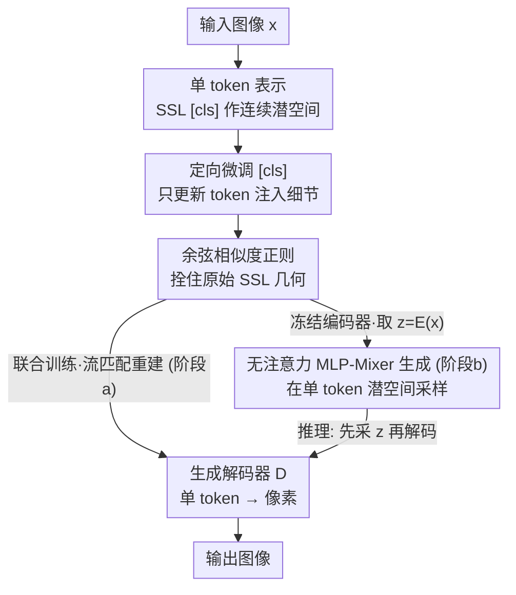

# Adapting Self-Supervised Representations as a Latent Space for Efficient Generation

**会议**: ICLR2026  
**OpenReview**: [https://openreview.net/forum?id=0b6a2SE23v](https://openreview.net/forum?id=0b6a2SE23v)  
**代码**: https://github.com/CompVis/RepTok  
**领域**: 扩散模型 / 高效生成  
**关键词**: 单 token 潜空间, 自监督表示, 流匹配, MLP-Mixer, 文生图

## 一句话总结
RepTok 把预训练自监督 ViT 的 `[cls]` token 微调成「单个连续 token」的潜空间，配一个流匹配解码器就能高保真重建图像，再用一个无注意力的 MLP-Mixer 在这个一维潜空间里做生成，从而在 ImageNet/MS-COCO 上以不到对手 10% 的训练算力拿到有竞争力的 FID。

## 研究背景与动机
**领域现状**：扩散与流匹配模型是当前最强的图像生成框架，但直接在像素空间回归向量场计算量巨大。Latent Diffusion（LDM）用预训练 VAE 先把图像压到低维潜空间，把生成限制在「语义内容」上，大幅降本，已成为图像/音视频生成的事实标准。

**现有痛点**：LDM 的潜空间仍然是一个二维网格（如 $32\times32$），保留了自然图像里大量的空间冗余——网格里很多相邻位置是高度相关甚至重复的，生成模型却要逐格建模它们之间的交互（通常靠注意力），既浪费算力又没必要。两条改进路线各自只走了一半：TiTok 用 transformer 把图像编码成一维离散 token 序列（最少 32 个），打破了网格但仍需多 token 且是离散量化的；REPA 用 SSL 表示去对齐扩散特征来加速收敛，但它只是把 SSL 当成「训练时的引导信号」，生成本身还是跑在二维网格潜空间上。

**核心矛盾**：SSL 模型（DINOv2、MAE、CLIP）的 `[cls]` token 本身就是一个平滑、语义结构良好、几何适合生成的一维表示，但它是为下游分类/对比任务优化的，**只保留高层语义、丢掉了重建所需的低层像素细节**——所以没人敢直接拿它当生成潜空间。一边是「现成的好几何」，一边是「细节不够无法重建」。

**本文目标**：能不能让 SSL 表示从「引导者」升格为「潜空间本体」？具体拆成两问：(1) 怎样以最小代价给 `[cls]` token 补上低层细节、又不破坏它原有的好几何；(2) 在单 token 的极端压缩下，生成阶段还需不需要注意力。

**切入角度**：作者观察到 unCLIP 这类模型能仅凭一个 512 维 CLIP embedding 生成图像变体，说明「极紧凑瓶颈 + 生成解码器」是可行的；变体之所以不稳定，是因为 CLIP 没被训练去保留精确像素位置。那么只要给语义 token「定向注入」少量细节，就有望既能重建又保留语义几何。

**核心 idea**：只微调 SSL 编码器的 `[cls]` token embedding（其余权重全冻结），把它和一个流匹配生成解码器联合训练去做重建；再加一个余弦相似度损失把这个 token 拴在原始 SSL 空间附近。最终用「单个连续 token」当潜空间，生成阶段甚至可以用纯 MLP 架构。

## 方法详解

### 整体框架
RepTok 的输入是一张图像，输出是「能从单个连续 token 重建/生成的图像」。整套流水线分三段：**(a) 编码器-解码器训练**——拿冻结的 SSL ViT 编码器 $\mathcal{E}$，只让 `[cls]` token 可训练，配一个生成解码器 $\mathcal{D}$，用流匹配损失联合训练做重建，把重建所需的低层细节「灌」进这个 token；同时一个余弦损失把它拴在原始 SSL 几何附近。**(b) 潜空间生成训练**——把编码器冻结，对每张图像取出潜表示 $z=\mathcal{E}(x)\in\mathbb{R}^{1\times 768}$，训练一个独立生成模型 $G$（无注意力的 MLP-Mixer）去合成这些 token，类别/文本作为条件。**(c) 推理**——先用 $G$ 采样出一个 token $z$，再用 $\mathcal{D}$ 把它解码回像素空间。

值得注意的是，解码器并非直接在像素空间工作，而是沿用 SiT 的惯例、套在一个预训练 2D SD-VAE 的潜空间里，进一步省算力；条件注入方式借鉴 MMDiT，把潜 token $z$ 和带噪图像 token 拼接。

### 关键设计

**1. 单 token 表示：用 SSL 的 `[cls]` token 当连续潜空间**

针对「二维网格潜空间空间冗余大」这个痛点，RepTok 直接把一张图压成**单个连续向量** $z\in\mathbb{R}^{1\times 768}$，取自 SSL ViT 的 `[cls]` token。`[cls]` token 在 SSL 预训练中被（显式或隐式地）训练去聚合所有 patch 的信息，本身就是图像的全局摘要；用它当潜空间，token 之间不再有网格关系，空间冗余被彻底消除。和 TiTok 等一维分词器相比，关键区别有二：一是**连续**而非离散量化，避免量化误差、让整条管线对扩散训练完全可微；二是压缩更激进——别人用 32~256 个 token，RepTok 只用 1 个，却在 rFID 上仍达到 1.85、与多 token 基线持平甚至更好。

**2. 定向微调 `[cls]` token：用最小改动注入低层细节**

冻结的 SSL `[cls]` token 只有语义、缺低层细节，直接拿来重建会很糊（论文 Figure 5 显示冻结时重建质量很差）；但若放开整个编码器训练，token 又会被拉离原本良好的几何，破坏后续生成的前提。RepTok 的折中是**只更新 `[cls]` token 的 embedding 参数、冻结编码器其余全部权重**。作者发现这一「最小干预」就足以把重建所需的细粒度信息注入 token——在 DINOv2、MAE、CLIP 等多种 backbone 上都能拿到高保真重建。直觉上，编码器主干仍负责提取通用语义特征，而那个被释放的 token 像一个「细节缓冲槽」，专门吸收解码器反传回来的重建信号，既补了细节又不动摇主干学到的几何。

**3. 余弦相似度损失：把 token 拴在 SSL 几何附近，换取可生成性**

只放开 `[cls]` 仍可能在长训练后漂移出去。为此引入余弦对齐项：

$$\mathcal{L}_{\cos}(x) = \lambda\big(1 - \cos(z,\, z_{\text{frozen}})\big),\qquad z_{\text{frozen}} = \mathcal{E}_{\text{frozen}}(x),\; z = \mathcal{E}(x)$$

其中 $z_{\text{frozen}}$ 是冻结 SSL 模型的原始输出，$z$ 是微调后的版本，$\lambda$ 显式控制允许的偏移量：$\lambda$ 越小约束越松（细节多、几何乱），越大越把 token 钉死在源表示上。这正好刻画了一个**重建-生成的 trade-off**——强正则提升生成 gFID 但牺牲像素级 PSNR，轻度正则就能显著改善生成质量。它的作用是保住 SSL 空间「语义相近的图被拉近、相异的被推开」这种平滑低维流形，让潜空间始终适合被生成模型建模，同时还防止 token 在延长训练下漂移。

**4. 无注意力的两阶段生成：冻结编码器即正则，MLP-Mixer 即够用**

第二段把编码器冻结后，作者指出**冻结编码器本身就充当了一种隐式正则**，可替代传统 LDM 的 KL 散度或 VQ 量化——因为冻结编码器的结构性质天然约束了潜表示分布，无需额外 KL/VQ。更关键的观察是：当图像被压成单个 token 后，token 间交互已不存在，注意力失去意义。于是 ImageNet 生成直接用纯 MLP 的 **MLP-Mixer** 当生成器 $G$，把架构复杂度全部转移到了前一阶段的压缩上，却几乎不掉质量。类别条件通过拼接一个可学习的 class embedding 注入，并在训练中随机丢弃以支持 classifier-free guidance（CFG 仅在 $t\in[0.3,0.9]$ 区间施加）。对文生图则保留注意力做文本条件：拼接 4 个可学习 token 到带噪 `[cls]` token，并对冻结语言模型（CLIP/InternVL/Gemma-2B）的输出做交叉注意力——由于潜 token 数极少，注意力的二次方开销几乎可忽略。

### 损失函数 / 训练策略
- **阶段 (a) 重建**：联合优化编码器 `[cls]` 与解码器 $\mathcal{D}$，用流匹配损失 $\mathcal{L} = \mathbb{E}_{t,x_0,x_1}\lVert v_\theta(t, x_t, z) - (x_1 - x_0)\rVert$（线性插值 $x_t = t x_1 + (1-t)x_0$），叠加余弦正则 $\mathcal{L}_{\cos}$；不使用感知损失或对抗损失。解码器在预训练 SD-VAE 的潜空间内工作。
- **阶段 (b) 生成**：编码器冻结，对 $z=\mathcal{E}(x)$ 用流匹配训练 MLP-Mixer 生成器，类别条件 + CFG（随机丢弃）。
- **T2I**：用 COYO 1.2 亿图文对（InternVL3-1B 重新生成 caption），交叉注意力接入冻结语言模型，batch 256 训 200k 步。

## 实验关键数据

### 主实验
ImageNet $256\times256$ 类条件生成，重点是「同等/更好 FID 下大幅省算力」：

| 方法 | # token | 连续? | rFID ↓ | gFID ↓ | 总训练算力 |
|------|---------|-------|--------|--------|-----------|
| LDM | 32×32 | ✓ | 0.90 | 7.76 | — |
| TiTok-S | 128 | ✗ | 1.71 | 1.97 | — |
| FlexTok d18-d28 | 1-256 | ✗ | 1.45 | 1.86 | — |
| SiT-XL/2 +REPA (CFG=1.5) | grid | ✓ | — | 1.42 | 143.9K PFlops |
| **RepTok-L (CFG=1.5)** | **1** | **✓** | **1.85** | **1.88** | **42.1K PFlops** |

RepTok 仅用 1 个连续 token，rFID/gFID 就追平甚至超过多 token 的离散分词器；相对 SiT 等 transformer 扩散基线，总训练算力降一个数量级，论文称仅需 SiT **1.7% 的 FLOPs**、整体训练成本下降 90%+。

### 消融实验

| 配置 | rFID ↓ | PSNR ↑ | gFID ↓ | 说明 |
|------|--------|--------|--------|------|
| w/o prior（随机初始化编码器） | 13.99 | 19.64 | 128.54 | 无语义先验→潜空间杂乱不可生成 |
| CLIP | 13.66 | 14.24 | 30.56 | 可泛化 |
| MAE | 9.09 | 13.79 | 28.48 | 可泛化 |
| DINOv2（主设置） | 7.95 | 14.94 | 20.75 | 最佳 |

另有与纯语义编码方法 RCG 的对比：RepTok FID 1.85 / PSNR 14.94，RCG 3.20 / 9.31——说明单连续 token 比「纯语义码」保留了多得多的信息。

### 关键发现
- **语义先验是命门**：去掉 SSL 先验（随机初始化编码器），即便解码器能靠像素重建把 rFID 压到 13.99，潜空间却完全无结构，gFID 飙到 128.54——生成模型根本抓不住这个分布。语义先验诱导出的平滑低维流形才是能生成的前提。
- **余弦正则是可调旋钮**：$\lambda$ 越大 gFID 越好但 PSNR 越低；轻度正则即可显著改善生成质量，是重建与生成之间的明确 trade-off。
- **单 token 让注意力变多余**：压到 1 token 后纯 MLP-Mixer 就够，CFG 在此设置下收益有限（与 RCG 现象一致）。
- **语言主干可独立扩展**：T2I 中语言模型冻结只做条件，从 CLIP→InternVL→Gemma-2B 一路放大，所有指标稳定提升，却不增加生成模型训练成本；<20 小时 / 4×A100 即达竞争性零样本 COCO 结果。

## 亮点与洞察
- **「引导者」升格为「潜空间本体」**：REPA 只把 SSL 当训练引导，RepTok 直接把 `[cls]` token 当生成潜空间——一个视角的跃迁，省掉了整个二维网格。
- **只动一个 token embedding 的极简手术**：冻结整个 backbone、只放开 `[cls]`，就足够注入重建细节又不破坏几何。这个「定向微调 + 余弦拴绳」的组合，可迁移到任何想「复用预训练表示又要补任务细节」的场景。
- **冻结编码器替代 KL/VQ**：用预训练表示的固有结构当正则，省掉了 LDM 里 KL 散度或向量量化这套约束，是个干净又便宜的替代。
- **把复杂度搬到压缩阶段**：单 token 让生成器退化成纯 MLP，启示「先重压缩、后轻生成」可能是高效扩散的一条新路。

## 局限与展望
- **单 token 的信息上限**：把整张图压成 768 维一个向量，对高分辨率、富纹理或多目标复杂场景，单 token 容量是否够仍存疑（论文主要在 256×256 评测）。
- **重建-生成需手调 trade-off**：余弦权重 $\lambda$ 要在 PSNR 和 gFID 间手动权衡，没有自动机制；不同任务可能要重新调。
- **依赖强 SSL 先验**：消融显示没有语义先验就彻底失败，方法上限被所选 SSL 编码器的几何质量绑死。
- **解码器仍套在 SD-VAE 潜空间**：并非真·端到端单 token→像素，前置 VAE 的重建瓶颈未被消除。
- **改进方向**：自适应 token 数（在单 token 与少量 token 间按图像复杂度伸缩）、把 $\lambda$ 做成可学习/逐样本调度、探索更高分辨率下的容量扩展。

## 相关工作与启发
- **vs REPA**：REPA 在二维网格上把扩散特征对齐到 DINO embedding 来加速训练，生成仍在网格潜空间；RepTok 直接拿 SSL token 当潜空间本体，消除网格冗余、可用纯 MLP 生成，算力低一个数量级。
- **vs TiTok / FlexTok**：它们用一维**离散**多 token 序列（32~256 个）做自回归生成；RepTok 用**单个连续** token，可微、无量化误差，压缩更激进。
- **vs RCG**：RCG 也是「先生成语义表示再搬到像素」的两阶段，但目标是无条件合成、保持表示空间不变（纯语义码）；RepTok 主动往 token 注入低层细节以实现高保真重建，PSNR/FID 都远好于 RCG。
- **vs RAE / SVG**：并行工作用 SSL 特征的**完整空间网格**（高维结构潜空间）；RepTok 只用池化后的单个语义 token、丢弃所有空间 token，压缩程度根本不同；且与 SVG「对齐到 SSL 表示」不同，RepTok 直接把池化语义输出当潜表示本身。
- **vs Diffusion Autoencoder**：后者的潜空间偏语义，重建还需额外的子码 $x_T$（DDIM 反演回噪声）；RepTok 仅凭单个 $z$ 就能忠实重建。

## 评分
- 新颖性: ⭐⭐⭐⭐⭐ 把 SSL `[cls]` token 升格为单 token 连续生成潜空间，视角新且自洽
- 实验充分度: ⭐⭐⭐⭐ ImageNet + T2I + 多 SSL backbone + 余弦权重消融都有，但分辨率与超大规模验证有限
- 写作质量: ⭐⭐⭐⭐⭐ 动机推导清晰，图表（算力对比、插值、trade-off 曲线）有力
- 价值: ⭐⭐⭐⭐⭐ 训练算力降 90%+ 且质量竞争，对高效生成与「复用预训练表示」都有直接启发

<!-- RELATED:START -->

## 相关论文

- [\[ICML 2026\] Evaluating the Representation Space of Diffusion Models via Self-Supervised Principles](../../ICML2026/image_generation/evaluating_the_representation_space_of_diffusion_models_via_self-supervised_prin.md)
- [\[AAAI 2026\] Stabilizing Self-Consuming Diffusion Models with Latent Space Filtering](../../AAAI2026/image_generation/stabilizing_self-consuming_diffusion_models_with_latent_space_filtering.md)
- [\[CVPR 2026\] Self-Evaluation Unlocks Any-Step Text-to-Image Generation](../../CVPR2026/image_generation/self-evaluation_unlocks_any-step_text-to-image_generation.md)
- [\[ICLR 2026\] Stochastic Self-Guidance for Training-Free Enhancement of Diffusion Models](stochastic_self-guidance_for_training-free_enhancement_of_diffusion_models.md)
- [\[ICLR 2026\] COSMO-INR: Complex Sinusoidal Modulation for Implicit Neural Representations](cosmo-inr_complex_sinusoidal_modulation_for_implicit_neural_representations.md)

<!-- RELATED:END -->
