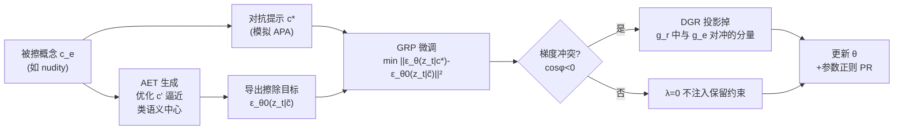

# AEGIS: Adversarial Target-Guided Retention-Data-Free Robust Concept Erasure from Diffusion Models

**会议**: ICLR 2026  
**OpenReview**: [https://openreview.net/forum?id=3y3hnL7KhS](https://openreview.net/forum?id=3y3hnL7KhS)  
**代码**: [https://github.com/Feng-peng-Li/AEGIS](https://github.com/Feng-peng-Li/AEGIS)  
**领域**: 图像生成 / 扩散模型安全 / 概念擦除  
**关键词**: 概念擦除, 扩散模型, 对抗提示攻击, 鲁棒性-保留权衡, 梯度投影  

## 一句话总结
AEGIS 把概念擦除的"擦除目标"从手挑的固定安全词换成迭代优化、逼近被擦概念语义中心的对抗目标 (AET)，再用一个无需保留数据、只在梯度冲突时才投影的梯度校正 (GRP)，同时把对抗提示攻击的成功率压到最低、又几乎不损失生成质量。

## 研究背景与动机
**领域现状**：扩散模型 (DM) 文生图能力强，但训练数据偏差会让模型生成裸露、特定艺术风格、版权对象等不良内容。概念擦除 (concept erasure) 通过微调去噪 UNet 来"删掉"某个概念，已成为获得可靠 DM 的标准手段，主流分为重对齐输出表示的 output-based 和操纵交叉注意力的 attention-based 两类。

**现有痛点**：概念擦除卡在一个**鲁棒性-保留权衡 (robustness-retention trade-off)** 上。鲁棒性指被擦概念不会被语义相关或对抗提示重新激活；保留指无关概念的生成质量不受损。现有方法几乎都是顾此失彼——把单个擦除提示映射到固定安全目标（如 "a photo"）会留下"类级残留"，被对抗提示攻击 (APA) 钻空子；而偏向保留的方案又扛不住自适应对手。

**核心矛盾**：作者把 DM 看作生成式分类器，预测噪声 $\epsilon_\theta(z_t\mid c_e)$ 在末步 $T$ 趋于确定，可视为概念在隐空间的"类原型"。一个概念（如 nudity）和它的同义词（naked/sexual/erotic/impure）会聚成一类 $C_0$。问题在于：如果手挑的擦除实例离 $C_0$ 的**语义中心**太远，仅最大化该实例前后预测噪声的距离，并不能抹掉整个类的信息——残留信息会在接近语义中心的对抗提示下重新泄漏。而要把整个类彻底擦干净，又需要让 $\theta$ 偏离 $\theta_0$ 极大，从而破坏被保留概念。这正是权衡的根源。**核心 idea**：**把擦除目标对齐到语义中心 + 只在真正冲突时做梯度投影**。

**本文目标**：在不依赖额外保留数据集的前提下，同时提升擦除鲁棒性与保留性能，突破现有权衡。

## 方法详解

### 整体框架
AEGIS（Adversarial Erasure with Gradient-Informed Synergy）由两个组件串成一条微调管线：先由 **AET 生成** 合成一个逼近被擦概念语义中心的对抗擦除目标，给擦除方向指路；再由 **GRP 微调** 在最小化"擦除概念预测噪声与 AET 目标差距"的同时，用无数据的参数正则 + 方向性梯度校正守住保留性能。总目标写成一个 min-max：

$$\min_\theta\Big[\max_{\tilde c}\,\mathbb{E}_t\|\epsilon_\theta(z_t\mid c^*)-\epsilon_{\theta_0}(z_t\mid\tilde c)\|_2^2+\lambda\cdot\tfrac{1}{2}\|\theta-\theta_0\|_2^2\Big]$$

其中 $c^*$ 是 $c_e$ 的对抗提示，$\tilde c$ 的目标噪声由 AET $c'$ 导出：$\epsilon_{\theta_0}(z_t\mid\tilde c)=\epsilon_{\theta_0}(z_t)-\eta\big(\epsilon_{\theta_0}(z_t\mid c')-\epsilon_{\theta_0}(z_t)\big)$。

### 关键设计

**1. 对抗擦除目标 AET：让擦除瞄准语义中心而非孤立实例**。动机来自一个诊断实验——作者用三类预测噪声距离 ($d_0$ 衡量基模型内的语义相似度、$d_1$ 衡量擦除前后偏移、$d_2$ 衡量微调模型内原始提示与对抗提示的距离）发现：ESD 擦完 nudity 后，对邻近的 naked ($C_1$) 拉开了 $d_1$，但对 sexual/erotic/impure ($C_2$) 几乎没动，且所有实例的 $d_2$ 都很小——这正是对抗提示能高成功率复活概念的原因。据此提出可学习嵌入 $c'$（长度 $m'=1$，随机初始化），迭代更新使其同时远离更新后的预测又贴近原始类中心：

$$c'^{(k+1)}=c'^{(k)}-\beta\cdot\mathrm{sign}\Big(\nabla\big(\|\epsilon_{\theta_0}(z_t\mid c'^{(k)})-\epsilon_\theta(z_t\mid c_e)\|_2^2+\|\epsilon_{\theta_0}(z_t\mid c'^{(k)})-\epsilon_{\theta_0}(z_t\mid c_e)\|_2^2\big)\Big)$$

把优化好的 $c'$ 喂进 ESD 式目标后，$d_2$ 在整个 $C_0$ 上一致变大，说明类级信息被真正抹掉。为省算力，借鉴 fast adversarial training，把每轮迭代步数压到 1（仅在每个训练 epoch 更新一次 $c'$ 与 $c^*$），在精度和效率间取平衡。

**2. 参数正则 PR：用"贴近原参数"代替保留数据集**。保留损失直接写成逐层的参数偏移惩罚 $L_r=\tfrac{1}{2}\|\theta-\theta_0\|_2^2$，逼模型只在与 $c_e$ 相关的参数上动手、其余尽量不变。这一招换来两个好处：其一，**摆脱对保留数据集的依赖**——原始 SD 在海量高多样数据上训成，任何小规模保留集都无法覆盖全部概念，而保留质量又对数据集选择极敏感，参数正则是数据无关的稳健替代；其二，**避免概念被无意重学**——既然不引入任何保留数据，被擦概念 $c_e$ 的残留信号就不会被重新带回来。

**3. 方向性梯度校正 DGR：只在真冲突时才投影**。作者观察到擦除梯度 $g_e=\nabla_\theta L_e$ 与保留梯度 $g_r=\nabla_\theta L_r$ 在很多迭代里余弦相似度为负——定义当 $\cos\phi<0$ 时发生"梯度冲突"。此时 $g_r$ 含有一个与 $g_e$ 方向相反的平行分量，会拖累擦除收敛。DGR 的处理很克制：当 $\cos\phi\ge 0$ 不冲突时直接令 $\lambda=0$，不注入保留约束以优先擦除；当 $\cos\phi<0$ 时才把 $g_r$ 按 $\tilde g=\lambda g_r,\ \lambda=-\omega\frac{\langle g_e,g_r\rangle}{\|g_r\|_2^2}$ 投影掉对冲分量。其中强度 $\omega\in[0,1]$ 不是定值而是**动态**的：微调早期 $\theta$ 还贴近 $\theta_0$，应让模型先专注拟合擦除任务，故 $\omega$ 从 0 起步、随冲突出现按 $\omega^{(\tau)}=\omega^{(\tau-1)}-\mu\cdot\mathrm{sign}(\nabla\omega^{(\tau)})$ 逐步升到 1，用 sign 抵御梯度噪声。两条定理进一步证明 GRP 既能让擦除损失收敛到驻点（Thm 4.1），又在条件满足时保证投影后的保留损失不劣于不投影（Thm 4.2）。

## 实验关键数据

设置：SD v1.4 / v2.1，Adam，$\alpha=10^{-5}$，batch=1，微调 UNet 1000 epoch，仅用被擦概念提示 + 自动生成的对抗提示/AET；评估三类概念（nudity 敏感、Van Gogh 风格、Church 对象），三种 APA（P4D=ASR1、UnlearnDiffAtk=ASR2、Ring-A-Bell=ASR3），效用用 FID/CLIP。

### 主实验表格（擦除 nudity，SD v1.4，节选）

| 方法 | ASR1↓ | ASR2↓ | ASR3↓ | FID↓ | CLIP↑ |
|------|------|------|------|------|------|
| SD v1.4 (Base) | 100% | 100% | 83.10% | 16.7 | 0.311 |
| ESD | 87.94% | 73.24% | 69.72% | 18.18 | 0.302 |
| AdvUnlearn | 80.14% | 64.79% | 59.86% | 19.34 | 0.290 |
| SalUn | 19.86% | 11.27% | 7.04% | 33.62 | 0.287 |
| STEREO | 45.77% | 14.08% | 7.04% | 18.27 | 0.286 |
| **AEGIS** | **12.06%** | **8.45%** | **3.52%** | 17.43 | 0.303 |

AEGIS 三种攻击的 ASR 全面最低，FID 比强基线 SalUn 改善 16.09，CLIP 维持在 0.303 的高水位。Van Gogh 风格上 ASR2 仅 12%（AdvUnlearn 38%、ESD 36%）；Church 对象上 ASR2 仅 6%、FID 19.06 远好于同等鲁棒的 SH（FID 68.02 已崩）。SD v2.1 上 AEGIS 仍领先（nudity ASR2 26.76% vs 次优 58.45%）。

### 消融实验表格（擦除 nudity，UnlearnDiffAtk 的 ASR）

| 变体 | ASR↓ | FID↓ | CLIP↑ |
|------|------|------|------|
| ESD | 73.24% | 18.18 | 0.302 |
| AdvUnlearn | 64.79% | 19.34 | 0.290 |
| AEGIS w/o AET | 52.11% | 17.54 | 0.305 |
| AEGIS w/o PR | 9.93% | 18.15 | 0.295 |
| AEGIS w/o DGR | 26.24% | 19.84 | 0.284 |
| AEGIS (ω=1 固定) | 14.08% | 17.31 | 0.308 |
| **AEGIS** | **8.45%** | 17.43 | 0.305 |

### 关键发现
- **AET 是鲁棒性主引擎**：去掉 AET 后 ASR 从 8.45% 飙到 52.11%（涨 65.96 个百分点），印证"瞄准语义中心"才是抹掉类级残留的关键。
- **PR 替代保留数据有效**：w/o PR 改用 COCO Object 做保留集，FID/CLIP 反而掉 0.72/0.01，说明小规模保留集不如数据无关的参数正则。
- **DGR 化解冲突**：去掉 DGR 后 ASR 升到 26.24%、FID 也变差 2.41，证明方向性投影确实在平衡擦除与保留。
- **动态 ω 优于固定**：固定 $\omega=1$ 时 ASR 升 5.46 个百分点，渐进升 $\omega$ 才能取得更好的鲁棒-保留平衡。

## 亮点与洞察
- **重新定位了脆弱性的根因**：把"擦不干净"归因于"学习目标选错位置"——目标离类语义中心太近/太远都会留残留，这个诊断框架（$d_0/d_1/d_2$ + 生成式分类器视角）本身就有解释价值。
- **保留无需数据**：用参数空间的 $\|\theta-\theta_0\|^2$ 正则取代保留数据集，既避开数据偏差又防止概念被重学，是一个干净的工程取舍。
- **"克制"的梯度处理**：DGR 不无脑投影，而是只在冲突时动手、且早期弱后期强，配合两条收敛/保留定理，让方法既有直觉又有理论背书。

## 局限与展望
- **绝对鲁棒性仍有限**：nudity 上 ASR 虽降到个位数但非 0，敏感概念在实战中仍可能被更强自适应攻击突破。
- **跨模型迁移性下降**：SD v2.1（OpenCLIP 文本编码器、不同数据）上所有方法擦除效果普遍下滑，作者归因于更纠缠的概念表示，说明方法对底模架构敏感。
- **概念粒度与组合**：实验集中在单概念（nudity/Van Gogh/Church），多概念同时擦除、概念组合泄漏尚未充分验证。
- 作者展望发展更定制化的擦除方案，在更强鲁棒下进一步减小对保留的副作用。

## 相关工作与启发
- **对比 ESD/AdvUnlearn**：ESD 用固定安全目标、AdvUnlearn 把对抗提示塞进目标，两者都受困于权衡；AEGIS 的差异在于"优化目标本身"+"按需投影梯度"。
- **借鉴 adversarial training**：AET/对抗提示的 sign 梯度更新与 fast adversarial training 一脉相承，把对抗鲁棒性思想迁移到擦除目标合成。
- **启发**：把生成模型当分类器、用预测噪声距离刻画概念在隐空间的位置，这套诊断视角可迁移到其他"删除/编辑模型知识"的任务（如 LLM unlearning）；"只在梯度冲突时投影"的思路也可用于多目标微调的通用冲突缓解。

## 评分
- 新颖性: ⭐⭐⭐⭐ — "擦除目标决定鲁棒性"的诊断 + AET 逼近语义中心 + 按需梯度投影，组合新颖且切中权衡根因。
- 实验充分度: ⭐⭐⭐⭐ — 三类概念 ×三种 APA ×两个底模、12 个基线、完整消融与两条定理，覆盖扎实；多概念组合与更强自适应攻击可再补。
- 写作质量: ⭐⭐⭐⭐ — 动机诊断（$d_0/d_1/d_2$）层层递进，方法与定理衔接清晰，图表充分。
- 价值: ⭐⭐⭐⭐ — 直击 T2I 安全落地的核心痛点，无保留数据 + 强鲁棒的组合有实用价值，代码开源。

<!-- RELATED:START -->

## 相关论文

- [\[AAAI 2026\] Mass Concept Erasure in Diffusion Models with Concept Hierarchy](../../AAAI2026/image_generation/mass_concept_erasure_in_diffusion_models_with_concept_hierarchy.md)
- [\[ICLR 2026\] SPEED: Scalable, Precise, and Efficient Concept Erasure for Diffusion Models](speed_scalable_precise_and_efficient_concept_erasure_for_diffusion_models.md)
- [\[CVPR 2026\] Prototype-Guided Concept Erasure in Diffusion Models](../../CVPR2026/image_generation/prototype-guided_concept_erasure_in_diffusion_models.md)
- [\[CVPR 2026\] GrOCE: Graph-Guided Online Concept Erasure for Text-to-Image Diffusion Models](../../CVPR2026/image_generation/groce_graph-guided_online_concept_erasure_for_text-to-image_diffusion_models.md)
- [\[ICLR 2026\] Localized Concept Erasure in Text-to-Image Diffusion Models via High-Level Representation Misdirection](localized_concept_erasure_in_text-to-image_diffusion_models_via_high-level_repre.md)

<!-- RELATED:END -->
