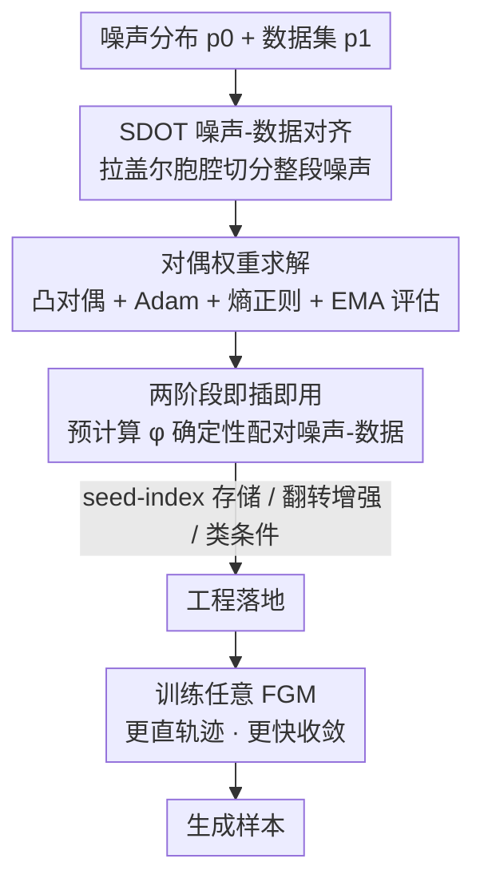

# AlignFlow: Improving Flow-based Generative Models with Semi-Discrete Optimal Transport

**会议**: ICLR2026  
**OpenReview**: [https://openreview.net/forum?id=nTCF3QNsIN](https://openreview.net/forum?id=nTCF3QNsIN)  
**代码**: https://github.com/konglk1203/AlignFlow  
**领域**: 扩散模型 / 流生成模型  
**关键词**: 流生成模型, 最优传输, 半离散最优传输, 噪声-数据对齐, 轨迹拉直

## 一句话总结
AlignFlow 用半离散最优传输（SDOT）在训练前一次性算出"噪声分布 → 全体数据点"的确定性对齐映射，把它当作即插即用的耦合喂给各种流生成模型，以不到 1% 的额外开销让轨迹更直、收敛更快、FID 全面下降。

## 研究背景与动机

**领域现状**：流生成模型（Flow-based Generative Models, FGM，含 Flow Matching、Rectified Flow、shortcut model、MeanFlow 等）通过学习一个时间相关的向量场，把噪声沿 ODE 积分搬运成数据。采样时要数值积分这条 ODE，每步至少一次大网络前向，因此采样成本（用函数求值次数 NFE 衡量）很高——vanilla Flow Matching 常需要 100+ 步。NFE 直接取决于轨迹的"直度"：轨迹越直越好积分，NFE 就越少。

**现有痛点**：FGM 每次训练迭代分三步——采样噪声和数据、构造目标向量场、更新参数。学界在第二步上花了大力气设计各种更直的目标向量场，但第一步里**噪声和数据仍是各自独立采样、随机配对**的。这种独立性已被证明会"先天地"诱导出弯曲轨迹，从而推高采样 NFE。

**核心矛盾**：一个自然的修法是用最优传输（OT）来耦合噪声和数据——OT 理论上给出两分布之间的最短路径，天然对应直的搬运映射。但现有 OT 方案都难以规模化：基于离散 OT 的方法（Tong et al. 2023、Pooladian et al. 2023）只在每个 minibatch 内用 Sinkhorn 估计 OT 计划，受**维度灾难**所困——要准确估计 OT 计划，噪声样本数需随数据维度指数增长，小 batch 估得不准、大 batch 又太贵（$O(B^2\log B)$）；基于连续 OT 的方法（Kornilov et al. 2024）用 ICNN 参数化 Brenier 势函数，引入了额外学习组件和归纳偏置，且学到的传输映射**没有最优性和收敛性保证**。

**切入角度**：作者抓住一个被忽视的事实——训练 FGM 时，数据是**有限的、离散的**经验分布，而噪声是**连续的**先验分布。那么"把连续分布最优地耦合到离散分布"恰好对应一类专门的 OT 问题：半离散最优传输（Semi-Discrete Optimal Transport, SDOT）。SDOT 把噪声空间切分成一组"拉盖尔胞腔"（Laguerre cells），每个胞腔整块映射到一个数据点。

**核心 idea**：用 SDOT 在训练前**显式**算出一个从整段噪声分布到全体数据点的**确定性**映射（作者称之为 Noise–Data Alignment, NDA），作为即插即用的耦合喂给任意 FGM——既继承 OT"最短路径 → 直轨迹"的好处，又因为只对齐到固定的离散数据集而**绕开维度灾难**，还有可证收敛和低成本质量评估。

## 方法详解

### 整体框架

AlignFlow 把"怎么配对噪声和数据"这件事从 FGM 训练循环里**解耦**出来，做成独立的两阶段流程。**第一阶段**：对给定的噪声分布 $p_0$ 和经验数据分布 $p_1=\frac{1}{|I|}\sum_{i\in I}\delta_{x_1^i}$，求解 SDOT 问题，得到一个把噪声映射到数据索引的确定性映射 $\varphi$。**第二阶段**：训练任意标准 FGM，但把原本"独立随机采样 $(x_0,x_1)$"换成"采噪声 $x_0$、用 $\varphi(x_0)$ 取出它对齐到的那个数据点 $x_1$"，其余（插值、目标向量场、loss、更新）完全照旧。因为 NDA 组件与 FGM 训练分离，AlignFlow 是即插即用的，能直接叠加在 Flow Matching、shortcut model、MeanFlow、Live Reflow 等之上。

### 关键设计

**1. 用 SDOT 构造噪声-数据对齐：把整段噪声分布切成拉盖尔胞腔、每块对齐到一个数据点**

这一步直接针对"独立随机配对诱导弯曲轨迹"和"离散 OT 维度灾难"两个痛点。SDOT 求的是连续噪声分布 $p_0$ 到离散数据分布 $p_1$ 之间、以欧氏代价 $c(y_1,y_2)=\|y_1-y_2\|^2$ 为代价的最优传输。它的传输映射可以用一个 $|I|$ 维的**对偶权重** $g=[g_i]_{i\in I}$ 完全表示：给定 $g$，把任一噪声样本映射到数据索引的映射为

$$\varphi(x_0;g):=\arg\min_{i\in I}\; c(x_0,x_1^i)-g_i .$$

几何上，这等价于把噪声空间切成一组拉盖尔胞腔 $L_i(g)=\{x: c(x,y_i)-g_i\le c(x,y_j)-g_j,\,\forall j\}$，每个胞腔整块搬到第 $i$ 个数据点，且该胞腔上噪声密度的积分恰等于该数据点的概率质量 $b_i=1/|I|$。关键在于：因为 $p_1$ 由数据集**完全确定**（不是从分布里采样近似的），SDOT 原则上可以**零估计误差**地算出，从而**绕开维度灾难**——这正是它区别于离散 minibatch OT（用样本近似两端分布、误差随维度指数爆炸）和连续 ICNN OT（引入归纳偏置、无最优性保证）的根本之处。同时它继承了 OT"最短路径"的性质，给 FGM 提供天然更直的搬运方向。

**2. 对偶权重求解：把 SDOT 转成凸对偶问题、用 Adam + 熵正则求解并配 EMA 质量评估**

有了 $\varphi$ 的定义，剩下的核心就是求对偶权重 $g$。SDOT 和一般 OT 一样是最小化问题，但通过对偶可以转成一个**凹**的对偶目标的最大化：

$$E(g):=\sum_{i\in I}\int_{L_i(g)}\big(c(x,y_i)-g_i\big)\,dp_0(x)+\langle g,b\rangle,$$

其梯度有简洁形式 $\nabla E(g)_i=-\int_{L_i(g)}dp_0+b_i$，即"落进胞腔 $i$ 的噪声质量"与"目标质量 $b_i$"之差。作者用 Adam 优化这个目标（Algo. 2）：每轮采一批噪声、按当前 $g$ 算出它们落在哪个胞腔（$\epsilon=0$ 时取 $\arg\min$ 的硬分配，$\epsilon>0$ 时用 $\mathrm{SoftMax}\!\big(-(c-g)/\epsilon\big)$ 的软分配），估出 $\nabla E$ 再做 EMA 平滑后更新 $g$，并对 $g$ 本身也做 EMA。这里两个工程巧思很关键：**熵正则 $\epsilon>0$** 让 SDOT 目标更光滑、加速收敛（$\epsilon=0$ 时达到满意 MRE 需 $O(|I|^3)$ 次迭代，每轮外循环成本 $O(|I|)$、误差按 $O(1/k)$ 下降）；作者还提出一种基于 **EMA 的 MRE 与 $L_1$ 距离估计**，能以低成本评估当前对偶权重质量、方便调超参——因为 SDOT 的好处之一就是解的最优性可以用 $O(|I|)$ 的样本复杂度被估出来。

**3. 两阶段即插即用流程 + 确定性带来的收敛加速**

把第一阶段算好的 $\varphi$ 接进 FGM 就得到完整的 AlignFlow（Algo. 3）：先一次性采够 $M=K\cdot B$ 个噪声、用 $\varphi$ 全部配好数据索引，再进训练循环按常规插值 $x_t=(1-t)x_0+t\,x_1$、算目标向量场、更新参数。之所以非要"确定性映射"而不是一般概率耦合，作者给了两条理由：其一，若 OT 源分布连续，则最优 OT 映射**必然确定**（Peyré et al. Remark 2.24），即确定性是最优性的必要条件，于是作者把"由噪声空间到数据集的确定性映射"正式定义为 NDA（Def. 1）；其二，确定性让噪声-数据匹配**与 batch 大小无关**（batch-invariant）。这第二点直接解释了为什么 AlignFlow 收敛更快：标准随机耦合下，要确定某个 $(x_t,t)$ 处的目标向量场，理论上得对整个数据集做期望 $u=\mathbb{E}_{x_1\sim p_1}\,\mathrm{TargetVectorField}(x_0,x_1)\,p_0(x_0)$；而 AlignFlow 的固定耦合直接给出 $x_1=\varphi(x_0)$，**绕过了这个期望估计**，网络要拟合的目标更干净，因此经验上收敛明显加速。这种 batch 无关性在大模型受显存所限、只能用小 batch 训练时尤其有价值。

**4. 工程落地：seed-index 存储、翻转增强、类条件分别建图**

要让两阶段方案在 ImageNet 规模真正跑起来，作者补了几个务实技巧（Sec. 3.5）。**噪声存储**：第二阶段要预生成海量噪声，全存进内存或磁盘都不现实（ImageNet 隐空间训练 10 个 epoch 的噪声就要 TB 级），于是只存生成每个噪声所用的**随机种子**，把每对配对表示成 `(seed, index)` 元组——依赖 JAX 的"种子→确定性随机矩阵"映射，500 个 epoch 也只需约 1 GB 磁盘。**数据增强**：复杂增强难以纳入 SDOT，但图像生成最有效的增强通常只是随机水平翻转，于是把数据集**重定义为"原图 + 翻转图"的并集**即可优雅处理。**类条件生成**：对每个类别 $c$ 单独算噪声分布 $p_0$ 到该类数据分布 $p_{1,c}$ 的 SDOT 映射，并对每类独立做 Rebalance（处理预采噪声落进各胞腔的数量与目标质量的偏差，Sec. C）。

### 损失函数 / 训练策略
AlignFlow **不改 FGM 的训练目标**——loss 还是各 FGM 原本的损失（如 Flow Matching 的 $\frac{1}{B}\sum_j\|\hat v_j-v_j\|_2^2$），只把第一步采样从"独立配对"换成"SDOT 配对"。所有 FGM 超参数直接沿用原论文配置、不做任何调参。额外成本只来自第一阶段算 SDOT 映射（实测 < 1% 训练时间）和第二阶段生成配对（< 0.1%）。

## 实验关键数据

### 主实验

CIFAR-10 上用 U-Net 在像素空间做无条件生成，对比标准 Minibatch OT（Tong et al. 2023），AlignFlow 在所有 ODE 积分器下 FID-50k 都更低且收敛更快（5 次独立运行平均）：

| ODE 积分器 | Minibatch OT | AlignFlow（本文） |
|------------|--------------|--------------------|
| Euler (100 步) | 4.80 | 4.72 |
| Euler (1000 步) | 3.92 | 3.79 |
| DOPRI5 | 3.82 | 3.71 |

ImageNet256 上用 DiT-B/2 + shortcut 框架，AlignFlow 作为即插即用组件叠加到多种 FGM 上，FID-50k 在 NFE=4 / NFE=1 下普遍大幅下降：

| 算法 | NFE=4（w/o → w/） | NFE=1（w/o → w/） |
|------|---------------------|---------------------|
| Flow Matching | 125.62 → 93.16（↓32.46） | 305.04 → 276.18（↓28.86） |
| Consistency Training | 111.84 → 103.14（↓8.70） | 76.37 → 64.33（↓12.04） |
| Live Reflow | 94.75 → 60.23（↓34.52） | 59.87 → 47.06（↓12.81） |
| Shortcut Models | 33.11 → 30.31（↓2.80） | 46.65 → 43.92（↓2.73） |

### 消融 / 规模化分析

ImageNet256 上用 SiT + MeanFlow 做一步生成（NFE=1），跨四种模型规模 AlignFlow 都稳定提升，且模型越大基线越强、绝对提升越小但依然为正：

| Backbone | 参数量 | w/o AlignFlow | w/ AlignFlow | 差值 |
|----------|--------|---------------|--------------|------|
| SiT-B/4 | 131M | 15.53 | 13.75 | ↓1.78 |
| SiT-B/2 | 131M | 6.17 | 5.60 | ↓0.57 |
| SiT-L/2 | 459M | 3.84 | 3.51 | ↓0.33 |
| SiT-XL/2 | 676M | 3.43 | 3.23 | ↓0.20 |

### 关键发现
- **收敛速度与最终性能同时改善**：三组训练曲线（CIFAR-10 U-Net、DiT-B/2 shortcut、SiT MeanFlow）都显示 w/ AlignFlow 不仅终点 FID 更低，而且在相同训练步数下更早达到目标，验证了"确定性耦合绕过目标向量场期望估计 → 加速收敛"的论断。
- **基线越弱、收益越大**：在 NFE 极少、原本质量很差的设置（如 Flow Matching NFE=4，FID 从 125 降到 93）提升最猛；而已经很强的 shortcut model（FID ~33）提升幅度较小——说明 AlignFlow 主要补的是"轨迹不够直"这一短板。
- **几乎零开销**：第一阶段算 SDOT 映射 < 1% 训练时间、第二阶段配对 < 0.1%，且 500 epoch 配对仅占 ~1 GB 磁盘，对大规模训练几乎无负担。

## 亮点与洞察
- **把"连续→离散"这个被忽视的结构用对了工具**：别人都在"两端都采样"的离散 OT 或"再学一个网络"的连续 OT 里挣扎，作者点破"数据本就是离散、噪声本就是连续"，于是 SDOT 这个现成框架直接给出零估计误差、可证收敛的对齐——这是最让人"啊哈"的地方。
- **确定性 = 最优性必要条件 + batch 无关性**，一个性质同时解释了"为什么效果好"和"为什么对小 batch 大模型友好"，逻辑非常干净。
- **彻底解耦、即插即用**：把耦合从训练循环里搬出来当预处理，意味着任何已有 FGM 几乎不改代码就能受益，迁移成本极低——这种"加一层对齐就涨点"的设计很容易被社区直接采用。
- **`(seed, index)` 存储**是个可复用的小 trick：凡是需要"预生成并复用海量随机量"的训练范式（不限于生成模型），都可以用"只存种子 + 确定性 RNG"把 TB 压到 GB。

## 局限与展望
- **依赖固定的经验数据集**：SDOT 把噪声对齐到**全体固定数据点**，因此复杂数据增强（随机裁剪/旋转）难以纳入——作者只能把增强退化为"翻转图并入数据集"这种能枚举的情形，对增强强度有内在限制。
- **$O(|I|^3)$ 的 SDOT 求解复杂度**随数据集规模上升（虽然每轮外循环只 $O(|I|)$、且熵正则可缓解），超大数据集上第一阶段的实际成本与质量评估仍需更多验证；论文主要在 CIFAR-10 / ImageNet256 隐空间上展示。
- **类条件需逐类建图 + 逐类 Rebalance**，类别极多时第一阶段的管理与开销会线性放大，文中未充分压力测试。
- **提升幅度随模型增大而收窄**（SiT-XL/2 仅 ↓0.20），在已接近 SOTA 的强基线上边际收益有限，长期价值更多体现在少步/弱基线场景。

## 相关工作与启发
- **vs 离散 minibatch OT（Tong et al. 2023 / Pooladian et al. 2023）**：他们在每个 batch 内用 Sinkhorn 估 OT 计划，受维度灾难和 batch 大小双重制约（大 batch 贵、小 batch 不准），且 minibatch OT 计划有偏/失准；AlignFlow 一次性对**整段噪声分布 + 全体数据点**算 SDOT，零估计误差、batch 无关、可证收敛。
- **vs 连续 OT / ICNN（Kornilov et al. 2024）**：他们用 ICNN 参数化 Brenier 势、与 Flow Inversion Map 交替优化，引入归纳偏置且**无最优性与收敛保证**；AlignFlow 不引入额外可学组件，直接解凸对偶、有收敛保证。
- **vs Rectified Flow / Reflow（Liu et al. 2022）**：Reflow 通过"解纠缠交叉轨迹"间接逼近 OT、需要额外训练阶段且规模化非平凡；AlignFlow 把对齐做成廉价预处理，不需重训。
- **与目标向量场类方法（shortcut model / MeanFlow）正交互补**：那些方法改第二步（目标场设计），AlignFlow 改第一步（耦合），实验证明两者叠加仍持续涨点。
- **与蒸馏类方法互补**：蒸馏是在预训练 FGM 之上再加一阶段压 NFE，可与 AlignFlow 叠加使用。

## 评分
- 新颖性: ⭐⭐⭐⭐⭐ 把 SDOT 用于 FGM 耦合、并以"连续-离散结构"绕开维度灾难，视角清新且切中要害。
- 实验充分度: ⭐⭐⭐⭐ 覆盖 CIFAR-10 到 ImageNet256、四类 FGM 与多种模型规模，但数据集仍偏标准、缺更大分辨率/更多模态验证。
- 写作质量: ⭐⭐⭐⭐⭐ 动机推导清晰，理论（维度灾难/确定性必要性）与工程（seed 存储/翻转增强）兼顾，对比表一目了然。
- 价值: ⭐⭐⭐⭐⭐ 即插即用、几乎零开销、普遍涨点，极易被社区直接采用，实用价值高。

<!-- RELATED:START -->

## 相关论文

- [\[ICCV 2025\] The Curse of Conditions: Analyzing and Improving Optimal Transport for Conditional Flow-Based Generation](../../ICCV2025/image_generation/the_curse_of_conditions_analyzing_and_improving_optimal_transport_for_conditiona.md)
- [\[ICLR 2026\] Entering the Era of Discrete Diffusion Models: A Benchmark for Schrödinger Bridges and Entropic Optimal Transport](entering_the_era_of_discrete_diffusion_models_a_benchmark_for_schrödinger_bridge.md)
- [\[ICML 2026\] Pareto-Guided Optimal Transport for Multi-Reward Alignment](../../ICML2026/image_generation/pareto-guided_optimal_transport_for_multi-reward_alignment.md)
- [\[ICLR 2026\] Constantly Improving Image Models Need Constantly Improving Benchmarks](constantly_improving_image_models_need_constantly_improving_benchmarks.md)
- [\[NeurIPS 2025\] On the Relation between Rectified Flows and Optimal Transport](../../NeurIPS2025/image_generation/on_the_relation_between_rectified_flows_and_optimal_transport.md)

<!-- RELATED:END -->
