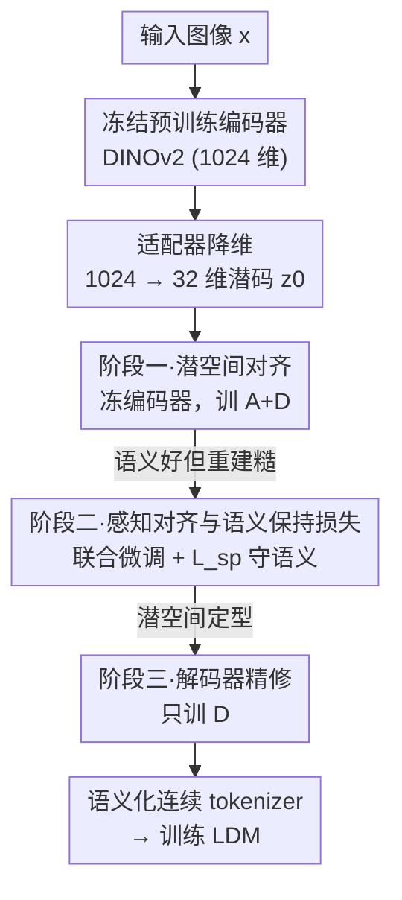

# Aligning Visual Foundation Encoders to Tokenizers for Diffusion Models

**会议**: ICLR2026  
**OpenReview**: [https://openreview.net/forum?id=ajnBafpqmE](https://openreview.net/forum?id=ajnBafpqmE)  
**代码**: [aligntok.github.io](https://aligntok.github.io)  
**领域**: 扩散模型 / 图像生成  
**关键词**: 视觉 tokenizer、预训练编码器对齐、潜空间扩散、DINOv2、语义保持

## 一句话总结
本文提出 AlignTok——不再从零训练 VAE、也不靠语义正则化"逼"编码器学语义，而是把一个已经富含语义的预训练视觉基础编码器（DINOv2）通过三阶段渐进对齐改造成连续 tokenizer，得到既语义结构良好、又能精确重建的潜空间；在 ImageNet 256×256 上让扩散模型仅 64 epoch 就达到 gFID 1.90，收敛速度约为 VA-VAE 的 5 倍。

## 研究背景与动机
**领域现状**：潜空间扩散模型（LDM）的核心部件是连续视觉 tokenizer，它定义了扩散过程所在的潜空间。训练一个 tokenizer 同时要做两件事：编码器要学出一个"对扩散友好"（diffusability）的潜空间，解码器要学会把潜码还原成图像。主流做法是训练一个 VAE，用重建损失（L1 + 感知 + 对抗）加一个权重很小的 KL 正则项来优化。

**现有痛点**：由于 KL 权重很小，训练几乎被重建损失主导，于是两个任务严重**不对称**——解码器的重建学习是直接、强监督的；而编码器的表示学习是间接的，潜空间只是重建的副产品，仅被弱 KL 先验约束。结果潜空间往往被低层细节主导、结构不可预测，扩散友好性差。近期 VA-VAE、MAETok 等"语义正则化"方法（图 1 左）给潜空间加一个损失项，逼它去对齐预训练大编码器的表征，确实改善了扩散友好性；但编码器仍然要在重建目标的竞争下、靠正则化损失**从头学**语义结构，事倍功半。

**核心矛盾**：学语义本身就比学重建难得多。让一个随机初始化的编码器在重建压力下同时挤出语义，两个目标互相拉扯，注定学不好。

**本文目标**：造一个语义 grounding 更强（因而扩散友好性更好）、重建能力又有竞争力的 tokenizer。

**切入角度**：既然预训练基础编码器（DINOv2/SigLIP/MAE）已经天然具备丰富语义，为什么还要从头学？直接把它"对齐"成 tokenizer 即可——第一个任务（学扩散友好潜空间）几乎白送，训练只需聚焦于补上重建能力。

**核心 idea**：用"对齐预训练编码器"取代"从头语义正则化"（图 1 右），并用三阶段渐进流程在补重建能力的同时守住已有语义。

## 方法详解

### 整体框架
AlignTok 的输入是图像 $x$，输出是一个能直接喂给 LDM 的 tokenizer（编码器 $E_p$ + 适配器 $A$ + 解码器 $D$）。整条 pipeline 围绕一个反直觉的判断展开：**语义难学、重建好学**，所以不要让编码器从零学语义，而是拿一个已经会语义的预训练编码器，分三步把它"驯化"成 tokenizer。

具体地，先用一个适配器 $A$ 把预训练编码器输出的高维特征（DINOv2-L/14 是 1024 维）压到扩散模型习惯的低维潜码（默认 $d=32$）：$z_0 = A(E_p(x))$。然后三个阶段依次推进：**阶段一**冻住编码器、只训适配器和解码器，先建立一个语义结构良好但重建粗糙的潜空间；**阶段二**解冻全部组件联合微调以补足低层细节，同时用一个"语义保持损失"防止语义被重建目标冲垮；**阶段三**只精修解码器，在不动潜空间的前提下把重建质量推到最好。三步走完，潜空间既语义丰富、对扩散友好，又保留了精确重建所需的细节。

### 关键设计

**1. 对齐范式：用预训练编码器对齐取代从头语义正则化**

这是全文的灵魂。语义正则化（VA-VAE）让随机初始化的编码器在重建主导的训练里，靠一个额外损失"追"预训练编码器的表征——但编码器要边学重建边学语义，两个目标互相竞争，语义学得吃力。AlignTok 反过来：直接拿一个已经富含语义的 $E_p$ 当起点，于是"学扩散友好潜空间"这第一个任务近乎免费，剩下的训练只需把重建能力补上。作者实验证实，这条路得到的潜空间扩散友好性显著优于正则化路线——同样用 DINOv2、同样训练步数，AlignTok 的线性探测精度与 VA-VAE 相当（35.09% vs 33.57%），但生成质量大幅领先（gFID w/ CFG 2.17 vs 3.16），说明对齐带来的语义组织优势远不止"类别可分"这一点。

**2. 适配器降维：把 1024 维语义特征压到 32 维潜空间**

预训练编码器为表示学习而生，输出维度很高（DINOv2-L/14 是 1024 维），而扩散模型通常在低维（32 或 64）才好优化、噪声调度才有效——这也是 RAE 直接用冻结编码器当 tokenizer 时面临的高维不稳定难题。AlignTok 引入一个轻量适配器 $A$ 做投影 $z_0 = A(E_p(x))$，把高维语义特征压成紧凑潜码。值得注意的是，作者刻意**不加 KL 项**：实验发现 KL 不带来收益，反而施加多余的分布约束、扭曲编码器原有的语义结构。适配器既是降维器，也是后续语义保持损失的施加点（见设计 4）。

**3. 阶段一·潜空间对齐：冻结编码器，先把语义潜空间建起来**

第一阶段的目标是把预训练编码器的语义空间转成一个"可生成"的潜空间。做法很克制：冻住 $E_p$，只用重建损失（式 1 的 $L_{rec} = L_{\ell 1} + w_p L_{perceptual} + w_g L_{GAN}$）训练适配器 $A$ 和解码器 $D$。冻结编码器是为了保证潜空间的语义结构原汁原味、不被重建目标污染。代价是重建质量不高——会出现明显色偏，因为冻结的编码器抓不住精确重建所需的细粒度感知细节（图 3 左橙色点 rFID 偏高）。所以这一步只是打地基，单用阶段一（Stage 1 only）的 rFID 高达 1.63、PSNR 仅 17.34，根本不堪生成之用。

**4. 阶段二·感知对齐与语义保持损失：解开"重建 vs 语义"的灾难性遗忘**

要补重建能力，就必须解冻编码器让它学细节。于是阶段二从阶段一的 checkpoint 出发，用同样的 $L_{rec}$ 联合优化 $E_p, A, D$。重建确实迅速变好（图 3 左绿线），但**灾难性副作用**随之而来：潜空间的语义结构急剧崩塌，线性探测精度断崖式下跌（图 3 右绿线）。本文的关键补丁是一个简单却有效的**语义保持损失**——约束当前阶段产出的潜码不要偏离上一阶段（冻结快照）的潜码，用 L2 实现：

$$L_{sp} = L_{\ell 2}(z_0^*, z_0)$$

其中 $z_0^*$ 是当前正在更新的 $E_p, A$ 产出的潜码、$z_0$ 是上一阶段冻结快照的潜码。该阶段总损失为 $L_{pa} = L_{rec} + w_{sp} L_{sp}$，默认 $w_{sp}=1$。这把"补细节"和"守语义"两件事拆开管理：重建损失负责往潜空间灌低层细节，$L_{sp}$ 像锚一样把语义结构钉住，使蓝线（图 3）既保住语义又拿到接近的重建。消融显示 $w_{sp}$ 是一道清晰的 trade-off——权重为 0 时重建略好（rFID 0.33）但语义崩塌（线性探测 9.50%、gFID 3.05）；权重过大（5 或 10）则生成变好但重建明显掉点；$w_{sp}=1$ 取得最佳平衡。作者还试过把损失直接加在编码器输出（适配器前），结果生成变差，因为放任适配器无约束会丢语义；换成 cosine 损失则与 L2 表现相当。

**5. 阶段三·解码器精修：潜空间冻结后单独把重建拉满**

前两阶段已经把编码器对齐成可用 tokenizer，但解码器可能仍欠拟合——因为整个训练过程潜空间一直在变，解码器是个"追着移动目标跑"的角色。阶段三只更新解码器、冻住其余一切，让它在已定型的潜空间上充分拟合，重建质量进一步提升（图 3 左紫线）。这一步的妙处在于它**不触碰潜空间**，因此甚至可以放到下游生成模型训练之后再做，作为即插即用的重建增强。

### 损失函数 / 训练策略
- **重建损失**（贯穿三阶段）：$L_{rec} = L_{\ell 1}(x,\hat x) + w_p L_{perceptual}(x,\hat x) + w_g L_{GAN}(x,\hat x)$。
- **语义保持损失**（阶段二）：$L_{sp} = L_{\ell 2}(z_0^*, z_0)$，总损失 $L_{pa} = L_{rec} + w_{sp} L_{sp}$，$w_{sp}=1$。
- **不用 KL**：发现 KL 无收益且扭曲语义，故舍弃。
- **训练细节**：ImageNet 下采样因子 $f=16$、潜维 $d=32$、采样步 30；生成模型沿用 VA-VAE 的 LightningDiT（约 673M 参数）；阶段二用 EMA 稳定训练（去掉略掉点）。扩散端用 flow matching：$z_t=(1-t)z_0 + t z_1,\ z_1\sim\mathcal N(0,I)$，预测速度场 $u_t = z_1 - z_0$，损失 $L_{FM}=\mathbb E\|v_\theta(z_t,t)-u_t\|_2^2$。

## 实验关键数据

### 主实验
ImageNet 256×256，80K 训练步、30 采样步，与同维度基线对比（gFID 越低越好）：

| Tokenizer | 编码器 | rFID↓ | 线性探测↑ | gFID 无CFG↓ | gFID 有CFG↓ |
|-----------|--------|-------|-----------|-------------|-------------|
| Vanilla VAE (f16d32) | CNN | 0.26 | 6.04% | 10.17 | 3.31 |
| VA-VAE (f16d32) | CNN | 0.28 | 22.96% | 7.79 | 3.13 |
| VA-VAE† (f16d32) | ViT | 0.37 | 33.57% | 8.21 | 3.16 |
| **AlignTok (f16d32)** | ViT | **0.26** | **35.09%** | **4.05** | **2.17** |
| **AlignTok (f16d64)** | ViT | 0.17 | 46.99% | 5.24 | 2.34 |

收敛速度（图 4 右）：AlignTok 仅需约 60K 步即可达到 VA-VAE 约 300K 步的质量，约 **5× 加速**；系统级 64-epoch 设定下 gFID（有 CFG）1.90 vs VA-VAE 2.11。采样步上，AlignTok 50 步的生成质量已超过 VA-VAE 250 步。文本到图像（LAION，2B 参数 T2I 训 100K 步，COCO Prompt 6K）：AlignTok 在 gFID（30.27 vs 35.78）、HPSv2、PickScore、ImageReward、CLIP/VQA 等指标上全面优于 FLUX VAE，仅 rFID 略逊。

### 消融实验
ImageNet 256×256，80K 步、30 采样步，均不含阶段三，主要对比 Stage 1 + Stage 2：

| 配置 | rFID↓ | 线性探测↑ | gFID↓ | 说明 |
|------|-------|-----------|-------|------|
| $w_{sp}=0$ | 0.33 | 9.50% | 3.05 | 语义崩塌，潜空间退化为低层细节 |
| $w_{sp}=1$ (Stage1+2) | 0.36 | 35.09% | 2.19 | 重建/语义最佳平衡 |
| $w_{sp}=5$ | 0.49 | 40.55% | 2.48 | 语义更强但重建掉点 |
| Applied Pre-Adapter | 0.34 | 15.61% | 2.83 | 损失加在适配器前，生成变差 |
| Cosine Loss | 0.37 | 37.99% | 2.23 | 与 L2 相当 |
| LoRA Fine-Tuning | 1.35 | 18.56% | 2.97 | 低秩更新不足以平衡语义与重建 |
| Stage 1 only | 1.63 | 41.53% | 3.00 | 语义保住但重建极差，不可用 |
| **Full Model（含阶段三）** | **0.26** | 35.09% | **2.17** | 完整三阶段最佳 |

### 关键发现
- **语义保持损失是阶段二的命门**：去掉它（$w_{sp}=0$）线性探测从 35% 崩到 9.5%、gFID 从 2.19 恶化到 3.05，验证"补重建必然冲垮语义"这一灾难性遗忘的存在，以及该损失的有效性。
- **冻结编码器（仅阶段一）不可用**：语义最好（线性探测 41.53%）但重建灾难（rFID 1.63），印证必须解冻微调编码器来补细节。
- **编码器选择**：MAE 重建最强但生成最差（gFID 3.12），DINOv2 取得最佳平衡（gFID 2.19），故默认 DINOv2；SigLIP 2 介于两者之间。
- **更大解码器（351M）反而掉生成**：在 ImageNet 规模上增大解码器容量收益有限，甚至损害生成。

## 亮点与洞察
- **"对齐 vs 正则化"的视角切换**最让人"啊哈"：同样想要语义化潜空间，与其逼随机编码器从头学，不如直接拿现成会语义的编码器来改造——把最难的子任务变成白送，训练只需聚焦剩下的简单子任务。
- **语义保持损失把两个互斥目标解耦**：用上一阶段潜码当锚，让重建损失放手灌细节而不冲垮语义，是一个极简（一行 L2）却切中要害的设计，可迁移到任何"微调会破坏已有结构"的场景。
- **阶段三的解耦性**：精修解码器不动潜空间，意味着它能在下游生成模型训练完之后再补，工程上即插即用。
- **架构极简、可泛化**：不引入额外编码器/解码器、不需图文监督，纯自监督语义保持损失，理论上可对齐任意视觉编码器。

## 局限与展望
- **64 维下重建仍逊于 VA-VAE（CNN）**：作者承认需降低 $w_{sp}$、提高学习率才能追平重建，且会略损生成。
- **大规模仅训 80K 步**：多数 ImageNet 对比在 80K 步下进行，结论未必反映充分收敛后的格局；T2I 也只训到 100K/200K 步。
- **扩展训练需 QKNorm**：延长训练时不加 QKNorm 会 loss 飙升出 NaN，加了又会略降生成质量，说明高语义潜空间的训练稳定性仍需额外手段。
- **与 RAE / REPA-E 互补而非替代**：作者指出可将 RAE 的高通道语义潜空间与本文对齐微调结合，或把 AlignTok 当作 REPA-E 端到端训练的更强初始化——这些组合尚未实验验证。

## 相关工作与启发
- **vs VA-VAE（语义正则化）**：VA-VAE 让随机编码器靠正则化损失追预训练表征，编码器要边学重建边学语义；本文直接对齐预训练编码器，把语义当起点。同维度、同步数下 AlignTok 生成质量与收敛速度全面领先（gFID 2.17 vs 3.16）。
- **vs RAE（直接冻结编码器当 tokenizer）**：RAE 不微调编码器，保住强语义但潜空间高维、扩散难训，还需噪声偏移和加宽扩散头来稳；本文微调编码器并降维，重建保真度大幅提升，作者认为二者可结合。
- **vs REPA-E（端到端联合训练 tokenizer 与扩散）**：REPA-E 联合训练且发现用已有 tokenizer 初始化优于随机；本文只训 tokenizer 本身，可作为 REPA-E 内 VA-VAE 组件的即插即用更强替代。
- **vs 离散 tokenizer 路线（GigaTok 等用预训练编码器做 AR 离散 tokenizer）**：那些工作面向自回归、常需额外架构或图文监督；本文专注连续 tokenizer + 扩散，纯自监督语义保持损失，更简单可扩展。

## 评分
- 新颖性: ⭐⭐⭐⭐⭐ "对齐而非正则化"的视角切换简单却根本，重新定义了语义 tokenizer 的造法。
- 实验充分度: ⭐⭐⭐⭐ ImageNet/LAION 双数据集 + 充分消融，但多数对比限于早期训练步数。
- 写作质量: ⭐⭐⭐⭐⭐ 动机推导清晰，三阶段图文对照，消融逐项解释 trade-off。
- 价值: ⭐⭐⭐⭐⭐ 即插即用替代 VA-VAE/FLUX VAE、约 5× 加速收敛，对扩散 tokenizer 设计有实质影响。

<!-- RELATED:START -->

## 相关论文

- [\[CVPR 2026\] VFM-VAE: Vision Foundation Models Can Be Good Tokenizers for Latent Diffusion Models](../../CVPR2026/image_generation/vfm-vae_vision_foundation_models_can_be_good_tokenizers_for_latent_diffusion_mod.md)
- [\[ICML 2026\] Compression as Adaptation: Implicit Visual Representation with Diffusion Foundation Models](../../ICML2026/image_generation/compression_as_adaptation_implicit_visual_representation_with_diffusion_foundati.md)
- [\[ICLR 2026\] Asynchronous Denoising Diffusion Models for Aligning Text-to-Image Generation](asynchronous_denoising_diffusion_models_for_aligning_text-to-image_generation.md)
- [\[ICLR 2026\] Diffusion Transformers with Representation Autoencoders](diffusion_transformers_with_representation_autoencoders.md)
- [\[ICCV 2025\] Mind the Gap: Aligning Vision Foundation Models to Image Feature Matching](../../ICCV2025/image_generation/mind_the_gap_aligning_vision_foundation_models_to_image_feature_matching.md)

<!-- RELATED:END -->
