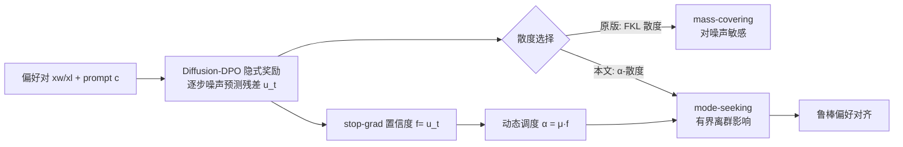

# $\alpha$-DPO: Robust Preference Alignment for Diffusion Models via $\alpha$ Divergence

**会议**: ICLR 2026  
**代码**: [github.com/yangli-lab/Diffusion_alpha-DPO_ICLR2026](https://github.com/yangli-lab/Diffusion_alpha-DPO_ICLR2026)  
**领域**: image_generation  
**关键词**: Diffusion-DPO, 偏好对齐, 噪声鲁棒, α-散度, mode-seeking, 动态调度  

## 一句话总结
本文从分布匹配视角证明 Diffusion-DPO 等价于最小化前向 KL 散度、因而对噪声偏好对天然敏感，提出用 α-散度替换 FKL 并配合动态 α 调度，让扩散模型偏好对齐在标签翻转噪声下显著更鲁棒。

## 研究背景与动机
**领域现状**：扩散模型生成质量已很高，但要让输出契合人类偏好（语义相关、风格、美感）仍需对齐。相比需要单独训练奖励模型、容易 reward hacking 且不稳定的 RLHF，Diffusion-DPO 把奖励隐式重参数化进模型本身，直接在成对偏好数据上端到端微调，更简单稳定，已成为主流方案。

**现有痛点**：DPO 的效果严重依赖偏好数据质量，但真实数据里普遍存在两类噪声——标注错误导致的「误标对」(mislabeled) 和标注者主观分歧导致「赢家/输家其实都行」的「个体偏好对」(individual / "Also OK")。两者本质都是**标签翻转噪声 (label-flipping noise)**。论文实验显示，随着翻转比例升高，DPO 的对齐效果急剧退化。

**核心矛盾**：已有的噪声鲁棒 DPO 变体（cDPO 标签平滑、rDPO 已知噪声率、Hölder-DPO 等）几乎都建立在简化假设上（I.I.D. 翻转、已知噪声率），且都是为自回归大语言模型设计的，无法刻画真实偏好数据的结构化噪声，也没针对扩散模型的马尔可夫链特性。本文作者发现根因更深：**Diffusion-DPO 的优化目标本质等价于最小化前向 KL 散度 (FKL)**，而 FKL 的「mass-covering」特性会强烈惩罚在目标分布概率极低区域的低估，这恰好放大了噪声样本的影响。

**本文目标 / 核心 idea**：要在噪声下做到鲁棒对齐需同时满足两点——(i) **mode-seeking**：优先学习高密度的显著偏好而非覆盖全部支撑；(ii) **有界离群影响**：损失对单个错误样本不敏感。**核心 idea**：用涵盖 FKL 与反向 KL 的更一般的 **α-散度**替换 FKL，通过 α 在 mass-covering 与 mode-seeking 之间连续权衡；再用**动态 α 调度**根据每个样本的隐含置信度自适应地调 α，做到数据感知的噪声容忍。这是首个面向图像生成的噪声鲁棒 DPO 方法。

## 方法详解

### 整体框架
方法分两步推进：先把 Diffusion-DPO 目标改写成「学习偏好分布 $\bar p_\theta$ 向目标偏好分布 $\bar p^*$ 靠拢」的散度最小化问题，并证明它等价于 FKL；再把 FKL 换成 α-散度得到 $\mathcal{L}_{\alpha\text{-DPO}}$，并在训练时按样本置信度动态设定 α。整条链路不引入额外网络或推理开销，只改了损失函数的形状与一个标量调度。

### 关键设计

**1. 把 Diffusion-DPO 还原成 FKL 散度最小化：先定位病根。** 论文先从 RLHF 目标（最大化奖励减去 $\beta$ 倍 KL 正则）出发，写出最优策略 $p^*\propto p_{\mathrm{ref}}\exp(\beta^{-1}r)$，再经 DPO 的重参数化 $r(c,x_0)=\beta\log\frac{p_\theta}{p_{\mathrm{ref}}}+\beta\log Z(c)$ 与 Bradley-Terry 模型得到标准 DPO 损失；扩散模型上则用 ELBO 把不可解的 $p_\theta(x_0|c)$ 替换为全轨迹奖励的逐步形式。关键的一步是定义混合分布 $\bar p_\theta\propto p_\theta^\beta\,p_{\mathrm{ref}}^{1-\beta}$ 与 $\bar p^*\propto p_{\mathrm{ref}}\exp(r)$，从而把整个 Diffusion-DPO 目标改写为 $\mathcal{L}_{\text{DPO-Diffusion}}=\mathbb{E}_x\big[D_{\mathrm{KL}}(\bar p^*\,\|\,\bar p_\theta)\big]$。这一改写说明 DPO 在做的其实是前向 KL 匹配，而 FKL 的 mass-covering 会在 $\bar p^*$ 几乎为零、$\bar p_\theta$ 仍有质量的区域施加重罚——正是噪声偏好对最容易制造的虚假模式，这就解释了「为什么翻转率一高 DPO 就崩」。

**2. 用 α-散度替换 FKL，得到可调权衡的 α-DPO 目标。** α-散度 $D_\alpha(P\|Q)=\frac{1}{\alpha(\alpha-1)}\mathbb{E}_{x\sim Q}\big[(P/Q)^{1-\alpha}-(1-\alpha)P/Q-\alpha\big]$ 是一族连续散度：$\alpha\to 1$ 退化为 FKL $D_{\mathrm{KL}}(P\|Q)$，$\alpha\to 0$ 退化为反向 KL $D_{\mathrm{KL}}(Q\|P)$，$\alpha$ 越小越偏 mode-seeking、越能压制分布尾部的离群点。把目标里的 FKL 换成 $D_\alpha(\bar p^*\|\bar p_\theta)$，并对 partition function 用蒙特卡洛近似（成对数据即 $K=2$），最终损失化简为
$$\mathcal{L}_{\alpha\text{-DPO}}=\mathbb{E}\Big[\tfrac{1}{\alpha(\alpha-1)}\,u\cdot\big(u^{\alpha-1}-(1-\alpha)u^{-1}-\alpha\big)\Big],\quad u=\sigma\!\big(g_\theta(c,x^w)-g_\theta(c,x^l)\big).$$
其中 $g_\theta$ 是 $\log\bar p_\theta-\log p_{\mathrm{ref}}$ 的相对对数比。再沿用 Diffusion-DPO 用 Jensen 不等式 + 前向过程近似反向过程，把 $u$ 落到逐时间步形式 $u_t(\theta)=\sigma\big(-\beta T\omega(\lambda_t)[(\|\epsilon^w-\epsilon_\theta\|^2-\|\epsilon^w-\epsilon_{\mathrm{ref}}\|^2)-(\cdots^l)]\big)$，于是 α-DPO 只是把标准 DPO 的 $\log\sigma$ 损失换成一个由 $\alpha$ 控制形状的损失，实现成本几乎为零。

**3. 动态 α 调度：把样本置信度当隐式偏好分类器来自适应调噪。** 固定 α 无法适配不同噪声水平：$|\alpha|$ 越大对尾部越敏感，最优值依赖数据噪声结构。作者引入辅助指标 $f(x^w,x^l,c)=\text{StopGrad}(u_t(\theta))$（不回传梯度）来量化单样本噪声。通过分析梯度 $\nabla_{u_t}\mathcal{L}_{\alpha\text{-DPO}}=\frac{1}{\alpha-1}(u_t^{\alpha-1}-1)$，在 $0<\alpha<1$、$0<u_t<1$ 下恒为负，说明优化在驱动模型增大 $u_t$（即把赢家排到输家之前），因此 $f$ 天然就是一个「置信分数」：分数高 = 对齐好 = 噪声小。论文进一步用 $f$ 与参考 $\Delta$HPSv2 比对，确认两者强单调相关，证明 $f$ 可作内部置信信号。据此把 α 设为 $\alpha=\mu\, f(x^w,x^l,c)$（$\mu$ 控制尺度）：高置信样本给大 α（更接近常规对齐），低置信（疑似噪声）样本自动调小 α、更偏 mode-seeking 以抗噪。这让鲁棒性随数据质量逐样本自适应，且不增加任何计算成本。

## 实验关键数据

数据集 Pick-a-Pic v2（去掉约 12% 平局后 851,293 对、58,960 prompt），骨干 SD1.5 / SDXL，8×H100，全局 batch 2048。评测指标：CLIP、HPSv2、PickScore (PS)、ImageReward (IR)、Aesthetic (Aes)。基线：DPO、cDPO、rDPO、Hölder-DPO。

### 主实验（合成标签翻转，翻转率 20%，节选 SDXL）

| 指标 | Pretrained | DPO | cDPO | rDPO | H-DPO | **Ours** |
|---|---|---|---|---|---|---|
| CLIP↑ | 0.3240 | 0.3310 | 0.3247 | 0.3278 | 0.3304 | **0.3312** |
| HPSv2↑ | 28.20 | 29.12 | 28.83 | 28.77 | 29.12 | **30.38** |
| PS↑ | 21.99 | 22.27 | 22.14 | 22.17 | 22.29 | **22.50** |
| IR↑ | 0.7234 | 0.9102 | 0.8568 | 0.8519 | 0.9211 | **1.001** |
| Aes↑ | 5.932 | 5.940 | 5.936 | 5.925 | 5.937 | **5.961** |

### 真实数据（Pick-a-Pic v2 直接微调，SDXL Test，节选）

| 指标 | DPO | cDPO | rDPO | H-DPO | **Ours** |
|---|---|---|---|---|---|
| HPSv2↑ | 29.77 | 30.12 | 30.38 | 29.97 | **30.86** |
| IR↑ | 0.9725 | 1.006 | 1.030 | 1.026 | **1.054** |
| HPSv2 bench HPSv2↑ | 30.05 | 30.53 | 30.68 | 30.22 | **31.42** |

### 消融（SDXL，Pick-a-Pic Test）

| 设置 | 变化 | 结论 |
|---|---|---|
| μ ∈ {0.9999,…,0.1} | μ↓ → PS 22.51→22.31，IR 1.054→1.013 | μ 太小过度强调主模、丢细节，对齐精度下降 |
| Fixed-α（关动态调度） | IR 1.054→最高仅 1.019 | 关掉动态 α 性能显著退化 |
| 动态 α 起始步 0→200 | PS 22.51→22.44 | 越晚启动略微变差 |
| β ∈ {2000,…,6000} | 先升后降 | 存在最优 β |

### 关键发现
- **抗噪显著**：翻转率 20% 时对 SDXL 的 winning rate 在 HPSv2 上 82.6%、PickScore 76.6%；即便翻转率 0.4 仍有 HPSv2 70.6%、IR 62.0%，而多数基线在高噪声下跌破 50%。
- rDPO 在合成噪声域表现不错，但本文以明显优势超过它，说明真实「非主流偏好」噪声与简化噪声模型假设不同。
- 动态 α 调度是性能关键组件，移除后退化最明显。

## 亮点与洞察
- **理论定位准**：把 Diffusion-DPO 严格还原成 FKL 散度最小化，直接点明「mass-covering → 噪声敏感」的根因，而非停留在经验层面打补丁。
- **方法极简且零额外成本**：本质只换了损失函数形状 + 一个 stop-grad 标量调度，不引入奖励模型、不加网络、不增推理开销，可直接套到现有 Diffusion-DPO 训练流程。
- **置信度免费来自损失本身**：用 $u_t$ 的 stop-grad 当隐式偏好分类器，并用梯度单调性 + 与 ΔHPSv2 的相关性双重论证其合理性，省去额外噪声检测模型（对比 sample-selection 类方法需要干净数据/多模型）。
- **首个面向扩散模型的噪声鲁棒 DPO**，把 LLM 偏好对齐里的鲁棒性研究迁移并适配到扩散链。

## 局限与展望
- α 调度采用线性映射 $\alpha=\mu f$ 与固定 $\mu$，形式较启发式，未探索更复杂的非线性/可学习调度。
- α-散度限定 $0<\alpha<1$ 区间，没系统讨论 $\alpha<0$ 或 $\alpha>1$ 区域是否有用武之地。
- 评测主要依赖自动指标（CLIP/HPSv2/PS/IR/Aes）与一次人评，缺乏对「过度 mode-seeking 是否牺牲多样性」的量化分析。
- 实验集中在 Pick-a-Pic v2 与 SD1.5/SDXL，未验证在更新的 DiT/Flux 类骨干或更大规模偏好数据上的可扩展性。

## 相关工作与启发
- **扩散偏好对齐**：DDPO/DPOK（RL，易 reward hacking）、D3PO（二元反馈直接微调）、Diffusion-DPO（隐式重参数化奖励），本文指出这类直接微调方法都对数据噪声脆弱。
- **散度视角偏好优化**：AlphaPO 用 α-transform 重塑奖励但保留 KL 结构、FKPD 引入前向 KL 正则提升 mode coverage、Wu 等的 α-DPO 做动态 margin 控制——本文与它们不同，是把 DPO 直接重写成「学习偏好分布↔目标偏好分布」之间的散度最小化并改用 mode-seeking α-散度。
- **鲁棒 DPO**：sample selection（需干净数据/多模型）、ROPO/cDPO（正则/标签平滑）、Robust-DPO（需已知噪声率）、Hölder-DPO（I.I.D. 翻转假设）——均为语言模型设计，本文给扩散链提供了不同视角的启发。

## 评分
- **新颖性**: ⭐⭐⭐⭐ 首个把 Diffusion-DPO 还原为 FKL 并用 α-散度做噪声鲁棒对齐，理论切入干净、动态调度有巧思。
- **实验充分度**: ⭐⭐⭐⭐ 覆盖合成翻转（多噪声率）+ 真实数据 + winning rate + 人评 + 多组消融，双骨干验证；但骨干较经典、多样性维度未量化。
- **写作质量**: ⭐⭐⭐⭐ 动机—理论—方法—实验逻辑连贯，图表清晰，公式推导完整。
- **价值**: ⭐⭐⭐⭐ 零额外成本、可直接落地于现有 DPO 流程，对扩散模型偏好对齐的工程实践有较高实用价值。

<!-- RELATED:START -->

## 相关论文

- [\[ICLR 2026\] Diffusion Blend: Inference-Time Multi-Preference Alignment for Diffusion Models](diffusion_blend_inference-time_multi-preference_alignment_for_diffusion_models.md)
- [\[ICLR 2026\] Reinforcing Diffusion Models by Direct Group Preference Optimization](reinforcing_diffusion_models_by_direct_group_preference_optimization.md)
- [\[ICLR 2026\] PCPO: Proportionate Credit Policy Optimization for Preference Alignment of Image Generation Models](pcpo_proportionate_credit_policy_optimization_for_preference_alignment_of_image_.md)
- [\[ICML 2026\] A Unified Framework for Diffusion Model Unlearning with f-Divergence](../../ICML2026/image_generation/a_unified_framework_for_diffusion_model_unlearning_with_f-divergence.md)
- [\[ICLR 2026\] Towards Better Optimization for Listwise Preference in Diffusion Models](towards_better_optimization_for_listwise_preference_in_diffusion_models.md)

<!-- RELATED:END -->
