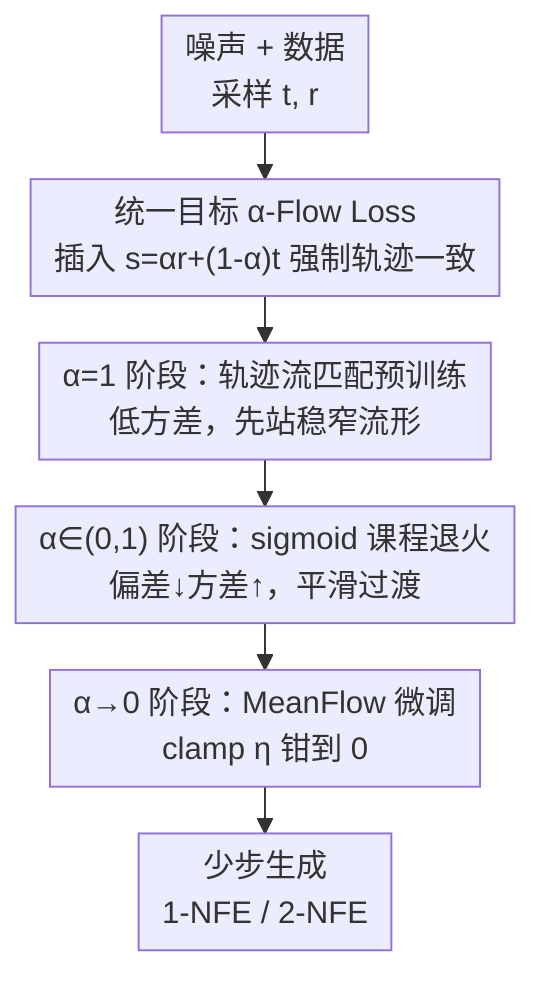

# AlphaFlow: Understanding and Improving MeanFlow Models

**会议**: ICLR2026  
**OpenReview**: [https://openreview.net/forum?id=adacb4JTIv](https://openreview.net/forum?id=adacb4JTIv)  
**代码**: https://github.com/snap-research/alphaflow  
**领域**: 扩散模型 / 少步生成  
**关键词**: MeanFlow, 流匹配, 少步生成, 课程学习, 轨迹一致性

## 一句话总结
本文把 MeanFlow 的训练目标拆解成"轨迹流匹配 + 轨迹一致性"两项、发现二者梯度强负相关导致优化打架，进而提出统一了流匹配 / Shortcut / MeanFlow 的 α-Flow 目标族，用一个把 α 从 1 退火到 0 的课程策略平滑过渡，在 ImageNet-256 上用纯 DiT 从头训练把 1-NFE FID 刷到 2.58、2-NFE 刷到 2.15。

## 研究背景与动机
**领域现状**：扩散模型已是视觉生成的主力范式，但采样慢——生成高保真样本通常要几十上百步去噪。为此社区做了大量"少步生成"工作：早期靠把多步预训练模型蒸馏成少步模型，后来的一致性模型（Consistency Model）实现了从头训练的少步生成。最近的 MeanFlow 把训练稳定性和 classifier-free guidance 整合做得更好，显著缩小了少步和多步从头训练模型之间的差距，成为当前从头训练少步生成的最强框架之一。

**现有痛点**：MeanFlow 实践上很能打，但**没人讲清楚它为什么好**。一个尤其反直觉的现象是：MeanFlow 训练时把 75% 的样本设成 $r=t$ 这个"边界情形"——这正好退化成普通的流匹配监督。我们关心的明明是在 $[r,t]$ 区间上学平均速度好做大跨度采样跳跃，为什么要把大部分算力花在拟合这个边界情形上？这个启发式设定缺乏解释，既挡住了进一步改进，也挡住了设计更强的少步模型。

**核心矛盾**：作者通过代数变形发现，MeanFlow 损失其实可以等价拆成两块——**轨迹流匹配** $L_\text{TFM}$ 与**轨迹一致性** $L_\text{TC}$。梯度分析显示这两块在训练中**强负相关**（余弦相似度常低于 $-0.4$），联合优化时互相拉扯、收敛慢。而那个被诟病的 $r=t$ 流匹配监督（记作 $L_{\text{FM}'}$）恰恰是一剂解药：它是 $L_\text{TFM}$ 的子集、能直接降低 $L_\text{TFM}$，且只在 $L_\text{TC}=0$ 处生效、跟一致性梯度冲突小。代价是 75% 的算力都耗在这个并非主目标的边界监督上。

**本文目标**：能不能在不付出这笔计算开销的前提下，更高效地优化 MeanFlow 目标里的 $L_\text{TFM}$？

**切入角度**：既然 $L_\text{TFM}$ 的最优解流形很窄、$L_\text{TC}$ 的解流形很宽，那就别让它们一上来就硬碰硬。先把模型推到窄的 $L_\text{TFM}$ 流形上站稳，再平滑过渡到完整的 MeanFlow 目标。

**核心 idea**：提出 α-Flow——一个用单一参数 $\alpha$ 统一了轨迹流匹配、Shortcut Model 和 MeanFlow 的目标族，用课程学习把 $\alpha$ 从 1 退火到 0，从"高偏差低方差"的流匹配平滑滑向"低偏差高方差"的 MeanFlow，从而解开两个目标的冲突、换来更好的收敛。

## 方法详解

### 整体框架
α-Flow 不改网络结构（沿用 MeanFlow 的纯 DiT），只换训练目标。核心是定义一个带连续参数 $\alpha\in(0,1]$ 的损失 $L_\alpha$：它在 $t$ 和终点 $r$ 之间插入一个中间时刻 $s=\alpha r+(1-\alpha)t$，强制大跳 $t\to r$ 与"先跳到 $s$ 再续上"保持一致。神奇之处在于这一个 $\alpha$ 把多种已有目标串成一条连续光谱——$\alpha=1$ 是轨迹流匹配、$\alpha=1/2$ 是 Shortcut Model、$\alpha\to0$ 的梯度收敛到 MeanFlow。于是训练就变成沿这条光谱"走一遍"：早期 $\alpha=1$ 用低方差的流匹配快速把噪声到数据的映射建立起来，中期用 sigmoid 调度把 $\alpha$ 从 1 平滑退火到 0，末期 $\alpha\to0$ 专注 MeanFlow 微调。这样既避开了两个目标一开始就梯度打架，又把原本 MeanFlow 要花 75% 算力的边界监督需求大幅压低。

### 关键设计

**1. MeanFlow 目标的可拆解性：把"为什么能 work"讲清楚**

作者先做的不是改方法，而是把 MeanFlow 损失 $L_\text{MF}=\mathbb{E}\big[\|u_\theta(z_t,r,t)-v_t+(t-r)\tfrac{du_{\theta^-}}{dt}\|_2^2\big]$ 通过代数展开等价改写为
$$L_\text{MF}=\underbrace{\mathbb{E}\big[\|u_\theta(z_t,r,t)-v_t\|_2^2\big]}_{\text{轨迹流匹配 }L_\text{TFM}}+\underbrace{\mathbb{E}\big[2(t-r)\,u_\theta^\top\tfrac{du_{\theta^-}}{dt}\big]}_{\text{轨迹一致性 }L_\text{TC}}+C.$$
$L_\text{TFM}$ 就是带了额外输入参数 $r$ 的流匹配；$L_\text{TC}$ 是一个被 $(t-r)$ 重加权、且**没有边界条件**的连续一致性损失。这个拆解一举解释了两件怪事：其一，普通一致性模型不加边界条件会塌缩成平凡解（常数输出），而 MeanFlow 不塌——因为 $L_\text{TFM}$ 隐式地替 $L_\text{TC}$ 提供了边界条件；其二，$L_\text{TC}$ 没有边界约束、解流形极大，优化时会把训练往这个宽流形上拽，分散了对 $L_\text{TFM}$ 那个窄交集的逼近。这是后面所有改进的理论地基。

**2. 梯度冲突诊断：定位 75% 边界监督的真实作用**

有了拆解，作者用 DiT-B/2 在 ImageNet 上训 400K 步实测两项的梯度余弦相似度，发现 $\cos(\nabla L_\text{TFM},\nabla L_\text{TC})$ 在 95% 以上的训练时间里都强负相关（典型 $<-0.4$），证实了"联合优化天然困难"的猜想。进一步对比那个被吐槽的 $r=t$ 流匹配监督 $L_{\text{FM}'}$：它是 $L_\text{TFM}$ 在 $r=t$ 切片上的子集，能直接把 $L_\text{TFM}$ 拉低（图 3b：分 75% 预算给 $L_{\text{FM}'}$ 后 $L_\text{TFM}$ 明显更低）；更关键的是它只在 $L_\text{TC}=0$ 处生效，所以 $\cos(\nabla L_{\text{FM}'},\nabla L_\text{TC})$ 一直高于 $\cos(\nabla L_\text{TFM},\nabla L_\text{TC})$，干扰一致性梯度更少。结论是：$L_{\text{FM}'}$ 是 $L_\text{TFM}$ 的一个**低冲突替身**——这正是 MeanFlow 那个"反直觉的 75% 设定"之所以有效的原因，但它把多数算力花在了非主目标上。

**3. α-Flow 统一目标：用一个参数把多种少步模型串成连续光谱**

α-Flow 损失定义为
$$L_\alpha(\theta)=\mathbb{E}\Big[\alpha^{-1}\big\|u_\theta(z_t,r,t)-\big(\alpha\,\tilde v_{s,t}+(1-\alpha)\,u_{\theta^-}(z_s,r,s)\big)\big\|_2^2\Big],$$
其中 $s=\alpha r+(1-\alpha)t$ 是 $t,r$ 之间按 $\alpha$ 插值的中间时刻，$z_s=z_t+(t-s)\tilde v_{s,t}$，$\tilde v_{s,t}$ 是用来从 $z_t$ 估计 $z_s$ 的"移位速度"。直观上它强制 $t\to r$ 的大跳与经过 $s$ 的两小跳一致。其威力在于统一性定理：取 $\tilde v_{s,t}=v_t$ 时 $\alpha=1$ 给出 $L_\text{TFM}$、$\alpha\to0$ 的梯度收敛到 $\nabla L_\text{MF}$；取 $\tilde v_{s,t}=u_{\theta^-}(z_t,s,t)$ 时 $\alpha=1/2$ 给出 Shortcut Model；若用 $z_0$ 参数化、令 $r\equiv0$，还能涵盖离散/连续一致性训练。收敛性靠对 $u_{\theta^-}(z_s,r,s)$ 在 $s=t$ 处做一阶 Taylor 展开、令 $\alpha\to0$ 消去高阶项得到（并在附录给出 $\|\nabla L_\alpha-\nabla L_\text{MF}\|$ 随 $\alpha$ 线性收敛到 0 的非渐近上界）。这样 $\alpha$ 就成了控制中间时刻 $s$ 在 $(r,t)$ 区间相对位置的统一旋钮，把"看似不同的方法"摆到了同一根轴上。

**4. 课程退火调度 + 钳值：从高偏差低方差平滑滑向低偏差高方差**

有了连续光谱，训练分三阶段走：① **轨迹流匹配预训练（$\alpha=1$）**——低方差目标快速建立可靠的噪声到数据映射，先逼近那条窄的 $L_\text{TFM}$ 流形作为良好初始化；② **α-Flow 过渡（$\alpha\in(0,1)$）**——按 sigmoid 调度把 $\alpha$ 从 1 平滑降到 0，理论上最优解从 $L_\text{TFM}$ 的解平滑挪向 $L_\text{MF}$ 的解，同时梯度方差随 $\alpha$ 减小而增大，相当于把训练从"高偏差低方差"领到"低偏差高方差"，比直接上高方差的 MeanFlow 收敛好得多；③ **MeanFlow 微调（$\alpha\to0$）**——彻底聚焦 MeanFlow 目标，且因前期把 $L_\text{TFM}$ 优化好了，对流匹配监督的依赖大幅下降。调度用 $\alpha=1-\text{Sigmoid}_{k_s\Rightarrow k_e,\gamma,\eta}(k)$，温度 $\gamma=25$；并设钳值 $\eta=5\times10^{-3}$：实验发现固定 $\alpha$ 训练时 1-step 性能随 $\alpha$ 减小先升后降、最优在 $\alpha=5\times10^{-3}$ 附近，故 $\alpha<\eta$ 时直接置 0、$\alpha>1-\eta$ 时置 1（此时 $L_\text{TFM}$ 与 $L_\alpha$ 近似但更高效）。

### 损失函数 / 训练策略
除调度外，几个工程要点：**目标速度** $\tilde v_{s,t}$ 默认取 $v_t$ 且 $\theta^-$ 不用 EMA（消融 Table 5a 支持）；**自适应权重**沿用 MeanFlow 思路并推导出 $L_\alpha$ 对应的等价权重 $\omega=\alpha/(\|\Delta\|_2^2+c)$，$c=10^{-3}$；**CFG** 把 $\tilde v_{s,t}$ 设成条件/无条件预测的加权组合 $w\,v+\kappa\,u_{\theta^-}(\cdot|c)+(1-w-\kappa)\,u_{\theta^-}(\cdot|\varnothing)$；**采样**对 DiT-B/2 用 ODE 采样、对 DiT-XL/2 用一致性采样（大模型收敛更好时一致性采样更优）。$\alpha=0$ 分支用 JVP 算 $du/dt$ 走 MeanFlow，$\alpha>0$ 分支直接用两点估计目标，二者在同一份训练代码里按调度切换。

## 实验关键数据

### 主实验
ImageNet-1K 256×256、纯 DiT 从头训练，1/2-NFE 生成（FID 越低越好）：

| 方法 | 参数量 | Epochs | 1-NFE FID | 2-NFE FID |
|------|--------|--------|-----------|-----------|
| MeanFlow-XL/2 | 676M | 240 | 3.47 | 2.46 |
| FACM-XL/2（复现） | 675M | 240×2 | 6.59 | 4.73 |
| **α-Flow-XL/2** | 676M | 240 | **2.95** | **2.34** |
| **α-Flow-XL/2+** | 676M | 240+60 | **2.58** | **2.15** |

同样 240 epochs 下，α-Flow-XL/2 相对 MeanFlow-XL/2 把 1-NFE FID 提升约 15%、FDD 提升约 12%；α-Flow-XL/2+ 在纯 DiT 从头训练里刷出 1-NFE 2.58、2-NFE 2.15 的新 SOTA。配合类别平衡采样时 2-NFE FID 进一步到 1.95，仅用 FACM 约 23% 的训练 epoch 就超过了它的 2.07。

### 消融实验

| 配置 | 1-NFE FID | 说明 |
|------|-----------|------|
| Constant₀（≈MeanFlow 基线） | 44.4 | 不退火，直接 $\alpha=0$ |
| Sigmoid₀→₄₀₀K（满程退火） | 40.0 | 越长越平滑的过渡越好 |
| Sigmoid₁₅₀K→₂₅₀K | 41.3 | 流匹配预训练越久越好 |
| 流匹配比例 75% + Constant₀ | 43.1 | MeanFlow 式高比例边界监督 |
| 流匹配比例 25% + Sigmoid₀→₄₀₀K | 40.0 | α-Flow 低比例也更好 |

（B/2 规模，数值越低越好）

### 关键发现
- **预训练越久越好**：固定过渡长度、把流匹配预训练起点 $k_s$ 从 0K 推到 150K，各项指标单调改善——印证"早期专注 $L_\text{TFM}$ 比优化 MeanFlow 更划算"，因为两者梯度冲突。
- **过渡越平滑越好**：固定中点在 200K、把过渡总长从 0 拉到 400K，生成质量持续变好，说明"逐步降低目标偏差"是关键。
- **α-Flow 让边界监督需求下降**：在所有流匹配比例下都优于 MeanFlow，且最佳 1-NFE 性能出现在较低的流匹配比例处——不再需要 MeanFlow 那种 75% 的高比例边界监督。
- 方法在 Kinetics-700 视频生成（FVD 评测）上也验证了有效性。

## 亮点与洞察
- **"先解释再改进"的范式**：本文最大的价值不止是涨点，而是把 MeanFlow 这个黑箱拆成 $L_\text{TFM}+L_\text{TC}$ 并用梯度冲突解释清楚"为什么 work / 为什么慢"，改进方案是从解释里自然长出来的——这种思路可迁移到任何"有效但说不清"的训练目标。
- **一个参数统一一族方法**：用 $\alpha$ 把流匹配、Shortcut、MeanFlow（乃至离散/连续 CT）摆到同一根连续轴上，让"在方法之间插值"成为可能；课程退火本质就是沿这根轴走，这个统一视角很有启发性。
- **梯度冲突→课程学习的对应**：把"两目标负相关"翻译成"高偏差低方差 → 低偏差高方差"的课程，并给出方差随 $\alpha$ 单调变化的理论支撑，是把优化困难显式转成训练调度的好例子。

## 局限与展望
- 实验主要在 ImageNet-256（加 Kinetics-700 视频）上，纯 DiT backbone；更大分辨率、文本到图像等更复杂条件下的表现还需验证。
- 调度引入了 $k_s,k_e,\gamma,\eta$ 等超参，虽给了默认值与消融，但最优调度可能随数据/规模变化，需要一定调参成本。
- $\alpha\to0$ 分支依赖 JVP 计算 $du/dt$，在现代框架里的可扩展性/效率仍是潜在工程负担（作者也在相关工作里点到这点）。
- 钳值 $\eta=5\times10^{-3}$ 来自经验最优点，其"先升后降"现象的更深机制尚未完全讲透。

## 相关工作与启发
- **vs MeanFlow**：MeanFlow 靠启发式的 75% 边界流匹配监督稳住训练，但没解释清且耗算力；本文证明它等价于"轨迹流匹配 + 无边界一致性"，并用课程退火在更低流匹配比例下取得更好收敛，相同 epoch 涨点约 15%。
- **vs Shortcut Model**：Shortcut 用"一大跳 = 两小跳"的自一致约束，是 α-Flow 在 $\alpha=1/2$、$\tilde v_{s,t}=u_{\theta^-}$ 时的特例；α-Flow 把它纳入统一框架并允许沿 $\alpha$ 连续移动。
- **vs 一致性模型（CT，离散/连续）**：离散 CT 需要精心设计时间步划分；α-Flow 一旦采好 $t,r$，$s$ 就由固定 $\alpha$ 立即确定，无需复杂分区，且离散 CT 本身是 $r\equiv0$ 的特例。

## 评分
- 新颖性: ⭐⭐⭐⭐⭐ 把 MeanFlow 拆解 + 用单参数统一一族目标 + 课程退火，理论与方法都很扎实。
- 实验充分度: ⭐⭐⭐⭐ ImageNet 多规模 + 视频 + 详尽消融，但任务域偏类条件图像。
- 写作质量: ⭐⭐⭐⭐⭐ "先解释后改进"的叙事清晰，理论与直觉穿插得当。
- 价值: ⭐⭐⭐⭐⭐ 刷新纯 DiT 从头训练少步生成 SOTA，且给出可迁移的分析范式与开源代码。

<!-- RELATED:START -->

## 相关论文

- [\[CVPR 2026\] Understanding, Accelerating, and Improving MeanFlow Training](../../CVPR2026/image_generation/understanding_accelerating_and_improving_meanflow_training.md)
- [\[ICLR 2026\] Decoupled MeanFlow: Turning Flow Models into Flow Maps for Accelerated Sampling](decoupled_meanflow_turning_flow_models_into_flow_maps_for_accelerated_sampling.md)
- [\[ICLR 2026\] Constantly Improving Image Models Need Constantly Improving Benchmarks](constantly_improving_image_models_need_constantly_improving_benchmarks.md)
- [\[AAAI 2026\] MP1: MeanFlow Tames Policy Learning in 1-step for Robotic Manipulation](../../AAAI2026/image_generation/mp1_meanflow_tames_policy_learning_in_1-step_for_robotic_manipulation.md)
- [\[ICLR 2026\] AlignFlow: Improving Flow-based Generative Models with Semi-Discrete Optimal Transport](alignflow_improving_flow-based_generative_models_with_semi-discrete_optimal_tran.md)

<!-- RELATED:END -->
