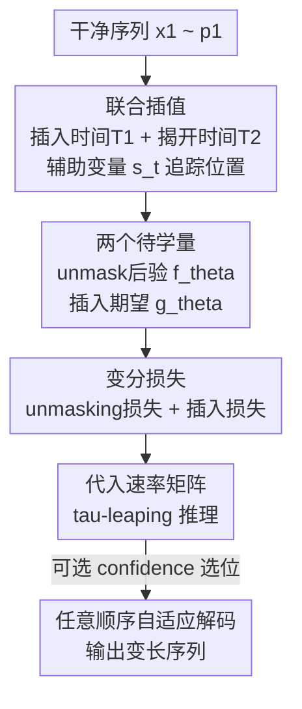

# Any-Order Flexible Length Masked Diffusion

**会议**: ICLR 2026  
**OpenReview**: [https://openreview.net/forum?id=ttuNnMRI6H](https://openreview.net/forum?id=ttuNnMRI6H)  
**代码**: https://github.com/brianlck/FlexMDM  
**领域**: 离散扩散 / 语言模型预训练  
**关键词**: 掩码扩散, 变长生成, 任意顺序, 随机插值, 连续时间马尔可夫链

## 一句话总结
本文提出 FlexMDM，一种能在生成过程中**插入新 token、从而建模变长序列**的掩码扩散模型，它在理论上保留了掩码扩散"任意顺序并行解码"的能力，困惑度与定长掩码扩散持平但长度分布拟合显著更好，并且只需 16 张 H100 三天就能把预训练好的 LLaDA-8B 改造成变长模型，在 GSM8K（58%→67%）和代码填空（52%→65%）上明显提升。

## 研究背景与动机
**领域现状**：在离散域（文本、代码）上做生成式建模，最近两年掩码扩散模型（Masked Diffusion Models, MDM）成了自回归（AR）之外的有力替代。MDM 从一条全是 mask 的序列出发，以**任意顺序、并行**的方式逐步把 mask 还原成真实 token；这种非从左到右的解码方式带来更快的推理，并在规划、推理、代码填空这类"非因果"任务上表现强劲。LLaDA-8B 就是一个已经放出权重的大规模 MDM。

**现有痛点**：MDM 有一个结构性硬伤——它**只能生成定长序列**。因为它的基分布 $p_0$ 是"长度为 $L$ 的全 mask 序列"这个点质量分布，整个去噪过程只是把固定 $L$ 个位置上的 mask 一个个揭开，**位置数从头到尾不变，无法插入新 token**。想生成变长答案只能事先 padding 到一个最大长度、再用辅助 pad token 凑数，这既浪费算力又让长度分布失真。

**核心矛盾**：变长建模与任意顺序解码似乎难以兼得。一个朴素想法是"从干净序列里既删 token 又 mask token"来构造插值过程，但一旦允许插入/删除，**token 的下标就会随插入而漂移**，速率矩阵（rate matrix）变得没法写成闭式，神经网络无从训练。这正是过去 MDM 不敢碰变长的根本原因。

**本文目标**：在保留 MDM 任意顺序生成能力的前提下，让模型能在采样过程中插入 token、从而建模任意长度的数据分布，并且要有理论保证（完美训练下确实采样自真实分布）。

**切入角度**：作者把 MDM 重新放回**随机插值（stochastic interpolant）/ 连续时间马尔可夫链（CTMC）**的框架里看，发现只要给插值过程额外配一个**显式追踪 token 位置的辅助变量**，就能在"下标会漂移"的情况下依然写出闭式速率矩阵。

**核心 idea**：用"先插入 mask、再揭开 mask"两步走的**联合插值（joint interpolant）**取代 MDM 的单一 unmask 过程，模型只需在原有的 unmasking 后验之外，多学一个标量"插入期望"，就能同时获得变长建模与任意顺序解码。

## 方法详解

### 整体框架
FlexMDM 的生成过程是：**从空串出发，一边往序列里插入 mask token、一边把已有的 mask 揭开成真实 token，直到 $t=1$ 得到一条完整的变长序列**（与 MDM 从"定长全 mask"出发、只揭不插形成对照）。

要让这个过程可训练、可采样，作者沿用 MDM 的"插值 + CTMC"配方，但必须解决两个难点：(a) 基分布要好采样；(b) 速率矩阵要有闭式。FlexMDM 用三件事把它串起来：先定义一个**联合插值**描述序列怎么从空串长成数据（含一个追踪位置的辅助变量 $s_t$ 化解下标漂移）；由此推出 CTMC 只需两个量——**unmasking 后验** $f_\theta$ 和**插入期望** $g_\theta$——就能完全刻画；训练时用一个变分损失同时学这两个量，推理时把学到的 $(f_\theta, g_\theta)$ 代入速率矩阵做 $\tau$-leaping 离散模拟，并支持任意顺序的自适应解码。

### 关键设计

**1. 联合插值：用辅助位置变量化解"插入导致下标漂移"**

这是全文的理论基石，针对的正是"既插又删时速率矩阵写不出闭式"这个痛点。MDM 的插值只对定长序列逐坐标独立地采一个揭开时间 $T^i$，$t<T^i$ 时是 mask、$t\ge T^i$ 时是真实 token。FlexMDM 把它扩展成：先采干净序列 $x_1\sim p_1$，再对每个坐标 $i$ 独立采**一对**时间——插入时间 $T_1^i$ 和揭开时间 $T_2^i$（强制 $T_1^i<T_2^i$）：

$$x_t^i=\begin{cases}\text{(空)},& 0<t<T_1^i\\ m,& T_1^i\le t<T_2^i\\ x_1^i,& T_2^i\le t\le 1\end{cases}$$

也就是每个 token 经历"不存在 → mask → 真实"三态。由插入调度 $\alpha_t$ 和揭开调度 $\beta_t$（都满足 $\alpha_0=\beta_0=0,\ \alpha_1=\beta_1=1$）控制速率。关键技巧是引入辅助变量 $s_t=\{i\mid T_1^i\le t\}$，即"到时刻 $t$ 还没被删掉的 token 在原始 $x_1$ 中的下标集合"。有了 $s_t$ 把短序列 $x_t$ 的每个位置映回 $x_1$ 的原始下标，**漂移的下标就被显式记账**，从而能写出闭式速率矩阵。$t=0$ 时所有 token 都被删，$p_0$ 就是空串上的点质量——天然好采样。

**2. 插入期望：在 unmasking 后验之外只多学一个标量**

要刻画 FlexMDM 的 CTMC，作者证明（命题 1）只需两个量：沿用 MDM 的 **unmasking 后验** $f_\theta(x,t)[i]\in\Delta(\Sigma)$——给定当前序列，masked 位置 $i$ 上干净 token 的后验分布；以及全新的**插入期望** $g_\theta(x,t)[i]\in\mathbb{R}_{\ge0}$——预测在相邻 token $x^{i-1}$ 和 $x^i$ 之间**还需要插入多少个 token**（一个标量）。两者由统一的变分损失训练：

$$\mathcal{L}_\theta=-\int_0^1\mathbb{E}\Big[\underbrace{\tfrac{\dot\beta_t}{1-\beta_t}\textstyle\sum_{x_t^i=m}\log f_\theta[i,x_1^{s_t[i]}]}_{\text{unmasking 损失}}+\underbrace{\tfrac{\dot\alpha_t}{1-\alpha_t}\textstyle\sum_i \phi(s_t[i]-s_t[i-1]-1,\ g_\theta[i])}_{\text{插入损失}}\Big]dt$$

其中 $\phi(x,y)=y-x-x\log\frac{x}{y}$ 是标量 Bregman 散度。命题 1 证明这个损失的**唯一最小值**恰好是真实 unmasking 后验和真实插入期望，命题 2 给出对应的速率矩阵（unmask 项把 mask 还原成真实 token，insert 项在两 token 间插入 mask），且满足 Kolmogorov 前向方程；命题给出 $D_{\mathrm{KL}}(p_1\|p_1^\theta)\le\mathcal{L}_\theta$ 的采样保证。设计上的精髓在于：插入期望只是**每个位置一个标量**，比起"建模一整个插入 token 分布"的替代方案训练负担小得多，也正是这一点让它能直接复用 MDM 的预训练权重（设计 4）。

**3. 任意顺序自适应推理：解码位置可以乱序，且仍有采样保证**

定长 MDM 的一大实用优势是推理时可以**自适应地按置信度选位**揭开（而不必严格按训练时的速率矩阵顺序），命题 3 证明 FlexMDM 继承了这个性质：只要 (i) 揭开任意子集位置时所采 token 来自真实 unmasking 后验、(ii) 插入按真实速率矩阵执行，最终就采样自 $p_1$。其背后的技术关键是——**真实 unmasking 后验不依赖揭开调度 $\beta_t$**（附录 E.2.1），所以单个 $f_\theta$ 能学会所有可能路径上的揭开转移，从而支持乱序解码。具体推理用 $\tau$-leaping（化学物理里的离散化方案，对 MDM 优于朴素 Euler）：每个时间窗内并行地对 mask 位置揭开、并按 Poisson 分布（速率由 $g_\theta$ 参数化）采插入数。两种变体：vanilla（严格按速率矩阵 $\tau$-leaping）和 adaptive（按置信度或半自回归的最左优先规则选位），实验显示 adaptive 显著更好。

**4. 从 MDM 一键改造：复用预训练权重低成本上 8B**

因为 FlexMDM 与 MDM **共享 unmasking 后验这一核心组件**，把预训练好的 MDM 改造成 FlexMDM 几乎是"加装"而非"重训"：从 LLaDA-Base 出发，只需 (a) 加时间嵌入层和一个标量 softplus head 来建模插入期望 $g_\theta$，(b) 挂 LoRA adapter，可训练参数仅约 400M。在 OpenWebText 与 Proof-Pile-2 各半的混合语料上，只用约 13.1B token（远小于 LLaDA 预训练的约 1.5T token）、16 张 H100 三天，模型就学会了生成变长句子——这印证了"插入期望只是个小标量"的设计让任务迁移异常高效。

### 损失函数 / 训练策略
训练即最小化上面的变分损失 $\mathcal{L}_\theta$（unmasking 损失 + 插入损失两项）。骨干用 DiT（双向 transformer），接两个输出头：标准后验 head 给 $f_\theta$、标量 softplus head 给 $g_\theta$。插入与揭开调度都取线性 $\alpha_t=\beta_t=t$。由于真实 unmasking 后验与 $\beta_t$ 无关，网络只需条件在 $\alpha_t$ 上（线性下等价于通常的时间嵌入）。

## 实验关键数据

### 主实验
预训练：在按段落切分的 OpenWebText 上从头训练 175M 的 FlexMDM 与 MDM（最大长 1024，500K 步，batch 1024）。

| 评测 | 设置 | FlexMDM | MDM | 说明 |
|--------|------|---------|------|------|
| 生成困惑度 | 随采样步数增加 | 与 MDM 持平 | 基线 | 更复杂的损失没有损害文本流畅度 |
| 长度分布拟合 | 256 步 | 紧贴真实分布 | 1024 步仍失真 | FlexMDM 长度建模保真度显著更高 |

8B 规模：从 LLaDA-Base 改造，IFT 后零样本评测。

| 任务 | 指标 | FlexMDM | LLaDA-Base | 提升 |
|------|------|---------|------------|------|
| GSM8K（数学） | Pass@1 | 67% | 58% | +9 |
| HumanEval 单行填空（代码） | 通过率 | 65% | 52% | +13 |

且随采样步数增加 FlexMDM 持续提升，而 IFT 后的 LLaDA 基本走平——说明 FlexMDM 在"给足算力"时更能受益。

### 消融实验

| 配置 / 任务（41×41 迷宫规划，按子目标数 $K$ 控难度） | 成功率 | 说明 |
|------|---------|------|
| Easy（$K=2$）— FlexMDM | 92.3% | vs MDM 68.4% |
| Medium（$K=7$）— FlexMDM | 90.4% | vs MDM 29.3% |
| Hard（$K=12$）— FlexMDM | 90.0% | vs MDM 24.2%，差距达约 60% |

### 关键发现
- **长度建模是 FlexMDM 最直接的胜场**：MDM 即使 1024 步也无法校准长度分布，FlexMDM 256 步就贴合，根因是它能真正插入 token 而非靠 padding。
- **子目标规划放大了定长的劣势**：迷宫任务要把若干子目标连成可行路径，MDM 必须**事先**把每个子目标钉死在某个位置（先验不可知），FlexMDM 则在子目标间插 mask 再揭开，随 $K$ 增大优势从约 24 个百分点扩大到约 60 个百分点。
- **自适应解码远好于 vanilla**：按置信度乱序揭开（理论由命题 3 保证）显著提升下游性能，这继承自 MDM 但在有插入的情况下证明其正确性相当微妙。

## 亮点与洞察
- **"先插 mask 再揭开"这个两步分解非常巧妙**：它把"变长"这件难事压缩成"每个位置多预测一个标量插入期望"，既保住了闭式速率矩阵，又让预训练 MDM 权重几乎免费迁移——理论优雅与工程廉价罕见地统一。
- **辅助位置变量 $s_t$ 是化解下标漂移的关键 trick**：变长生成的核心障碍是"插入会打乱下标"，作者不回避而是显式记账，这个思路对任何需要"在序列中间增删元素"的离散生成模型都可借鉴。
- **"任意顺序解码与真实后验绑定、与训练调度解绑"的洞察**可复用：正因 unmasking 后验不依赖 $\beta_t$，单个网络才能支持乱序推理——这解释了为什么掩码扩散家族能做自适应解码。
- **把生成范式向"人类怎么写"对齐**：人类写作是插入、修改、重排而非往固定槽位填字，FlexMDM 朝这个方向迈了一步。

## 局限与展望
- **作者承认的局限**：MDM 与 FlexMDM 用不同的训练目标，似然不可直接比较，因此无法给出 validation perplexity 这类常规指标，只能靠生成困惑度和下游任务间接验证；这让"谁更接近真实似然"难以下定论。
- **只插不删**：当前插值是"先插入后揭开"的单向过程，并未建模生成中的**删除/重写**，与摘要里"人类会 revise/reorder"的愿景还有差距。
- **IFT 仍依赖任务特定数据对**：8B 实验在 GSM8K / 代码填空上各自 IFT，作者预期更多样的指令-答案对 + 更多算力能得到更通用的模型，但尚未验证。
- **改进思路**：把删除 token 的能力也纳入联合插值（真正的"任意编辑"扩散），或探索 vanilla 推理的更优离散化以缩小与 adaptive 的差距。

## 相关工作与启发
- **vs MDM / LLaDA（定长掩码扩散）**：它们只能揭开固定 $L$ 个位置、靠 padding 凑变长；FlexMDM 多学一个插入期望即可原生变长，且能把 LLaDA-8B 低成本改造过来，这是最直接的对照。
- **vs 随机插值 / 流匹配（Albergo 等）**：本文把随机插值从连续空间扩展到离散空间并提出"联合插值"，用辅助变量处理变长，是该框架在离散变长生成上的新实例。
- **vs 并行工作 Wu et al. (2025b) / Havasi et al. (2025)**：Wu 引入辅助 expand token、推理时启发式地把每个 expand 换成两个 mask；Havasi 同样基于离散流匹配、理论根基相近。FlexMDM 的差异在于特定的插值选择带来了**有理论保证的任意顺序采样算法**（详见附录 A 对比）。
- **vs 自回归模型**：AR 严格从左到右、长度由生成停止符决定；FlexMDM 任意顺序并行、长度由插入期望动态决定，在非因果任务（规划、填空）上更有结构优势。

## 评分
- 新颖性: ⭐⭐⭐⭐⭐ 首次在保持任意顺序的前提下让掩码扩散原生支持 token 插入与变长，联合插值是扎实的理论贡献。
- 实验充分度: ⭐⭐⭐⭐ 覆盖文本预训练、迷宫规划、8B 数学/代码三类任务，但因目标不同缺常规似然指标、删除能力未验证。
- 写作质量: ⭐⭐⭐⭐⭐ 从 CTMC/插值循序渐进推到 FlexMDM，命题与直觉解释交替，理论叙述清晰。
- 价值: ⭐⭐⭐⭐⭐ 给出可低成本改造现有大 MDM 的变长范式，对离散扩散语言模型方向有实际推动力。

<!-- RELATED:START -->

## 相关论文

- [\[ICLR 2026\] Any-step Generation via N-th Order Recursive Consistent Velocity Field Estimation](any-step_generation_via_n-th_order_recursive_consistent_velocity_field_estimatio.md)
- [\[ICML 2026\] Esoteric Language Models: A Family of Any-Order Diffusion LLMs](../../ICML2026/image_generation/esoteric_language_models_a_family_of_any-order_diffusion_llms.md)
- [\[ICML 2025\] FlexTok: Resampling Images into 1D Token Sequences of Flexible Length](../../ICML2025/image_generation/flextok_resampling_images_into_1d_token_sequences_of_flexible_length.md)
- [\[ICLR 2026\] Partition Generative Modeling: Masked Modeling Without Masks](partition_generative_modeling_masked_modeling_without_masks.md)
- [\[ICLR 2026\] HOG-Diff: Higher-Order Guided Diffusion for Graph Generation](hog-diff_higher-order_guided_diffusion_for_graph_generation.md)

<!-- RELATED:END -->
