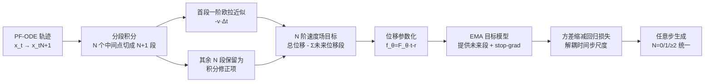

# Any-step Generation via N-th Order Recursive Consistent Velocity Field Estimation

**会议**: ICLR 2026  
**OpenReview**: [https://openreview.net/forum?id=GnawtLKGkP](https://openreview.net/forum?id=GnawtLKGkP)  
**代码**: [https://github.com/LINs-lab/RCGM](https://github.com/LINs-lab/RCGM)  
**领域**: 图像生成 / 少步生成模型  
**关键词**: 一致性模型, MeanFlow, 流匹配, 少步采样, 高阶递归, EMA 稳定性, 扩散 Transformer  

## 一句话总结
本文提出 RCGM，用「N 阶递归速度场估计」把一致性模型、MeanFlow、shortcut 等少步生成方法统一成同一框架的 1 阶特例，并把它推广到 2 阶以上——高阶目标既不需要昂贵的 JVP，又能兼容激进 EMA 平滑，从而稳定地把少步生成训练扩展到 20B 大模型，在 ImageNet 256×256 上 2 步即达 1.48 FID。

## 研究背景与动机
**领域现状**：以一致性模型（CM/sCM）、shortcut、MeanFlow 为代表的少步生成模型（通常 1–8 步）能用极低的采样开销生成高保真样本，已成为部署友好的主流方向。它们的共同思路是让模型学会从任意噪声态一步跳到数据端点，靠「自监督一致性」把多步扩散轨迹压缩进一次或几次前向。

**现有痛点**：作者指出当前 SOTA 少步方法被三类问题困住——（a）训练时需要昂贵的雅可比-向量积（JVP）带来巨大显存和算力开销，还与 Flash-Attention 等架构优化难以兼容；（b）要叠加多个损失、训练辅助模型（如一致性损失 + 对抗损失，或额外的 fake image 生成器），破坏了端到端的简洁性；（c）理论上各自为政——CM、shortcut、MeanFlow 这些高度相关的方法各自独立发展，缺乏共同根基。

**核心矛盾**：作者把这些脆弱性归因到一个被忽视的本质——这些方法本质上都是「**1 阶递归训练目标**」。1 阶递归与 EMA（指数滑动平均）天然冲突：自监督学习本应靠高 EMA 衰减率（如 κ=0.999）提供平滑稳定的回归目标，但 1 阶递归在高 κ 下会严重退化（如 Moons 数据集上 MMD 从 0.0066 飙到 0.2131，ImageNet 上 FID 崩到 294），形成「**EMA 不兼容悖论**」：大 κ 稳但拉胯，小 κ 不崩但没增益。这使得少步训练一旦放大到大模型/大学习率就容易塌缩或爆显存。

**本文目标**：构建一个统一且简洁的框架，既能把现有少步方法纳为特例，又能突破 1 阶限制，从而解锁 EMA 等稳定化技术、摆脱 JVP 和辅助模型，让少步生成稳定扩展到大规模模型。

**核心 idea**：**【从 1 阶递归升到 N 阶递归】** 通过对 PF-ODE 轨迹做**分段积分**，把瞬时速度的学习目标由「一步近似 + 一个未来段」推广为「一步近似 + N 个未来积分修正段」。N 阶目标用更完整的轨迹信息构造稳定的训练信号，从而在高 EMA 下既稳又强，且不增加显存。

## 方法详解

### 整体框架
RCGM 的核心是把生成模型统一为「N 阶递归一致速度场估计」。从 PF-ODE 的精确积分恒等式出发，对从 $x_t$ 到 $x_{t_{N+1}}$ 的轨迹用 $N$ 个中间点分段，把首段用一阶欧拉近似、其余段保留为积分修正项，于是瞬时速度 $\mathrm{d}x_t/\mathrm{d}t$ 就有了一个由「总位移减去 N 个未来位移段」构成的目标。把它写成位移函数 $f_\theta(x_t, r)$（预测从 $x_t$ 到任意未来时刻 $r$ 的位移）的形式，未来段用带 stop-gradient 的 EMA 目标模型估计，就得到一个只需「1 次带梯度前向 + N 次无梯度前向」的统一训练目标。当 $N=0$ 退化为扩散/流匹配，$N=1$ 退化为一致性/shortcut/MeanFlow，$N\ge2$ 即本文主张的高阶新方法。

### 关键设计

**1. 分段积分导出 N 阶递归目标：用未来积分修正一步近似。** 这是全文的理论支点。PF-ODE 给出任意两点间位移的精确积分 $x_{t_{N+1}}-x_t=\sum_{i=0}^{N}\int_{t_i}^{t_{i+1}} v(x_\tau,\tau)\,\mathrm{d}\tau$，作者只把第一段（步长 $\Delta t=t_0-t_1$ 足够小）用一阶 Taylor/欧拉近似为 $-v(x_{t_0},t_0)\Delta t$，其余 $N$ 段原封不动保留。重排后得到瞬时速度的「N 阶递归估计」$\frac{\mathrm{d}x_t}{\mathrm{d}t}\approx\frac{1}{\Delta t}\big[f(x_t,t_{N+1})-\sum_{i=1}^{N} f(x_{t_i},t_{i+1})\big]$。称「递归」是因为 $t$ 处速度依赖同一速度场在未来时刻的积分；「N 阶」指有 $N$ 个积分修正项，比简单一步近似更准。直觉上，1 阶只看一个未来段、误差全压在那一段上；高阶把误差摊到多段，目标更平滑、抗噪声。

**2. 任意步统一训练目标 + EMA 目标模型。** 定义位移函数 $-f_\theta(x_t,r):=x_r-x_t=\int_t^r v\,\mathrm{d}\tau$，把上式整体改写成损失 $L(\theta)=\mathbb{E}\,d\big(\frac{\mathrm{d}x_t}{\mathrm{d}t},\ \frac{1}{\Delta t}[f_\theta(x_t,t_{N+1})-\sum_{i=1}^{N} f_{\theta^-}(x_{t_i},t_{i+1})]\big)$，其中真实速度 $\mathrm{d}x_t/\mathrm{d}t$ 由 PF-ODE 解析已知，$N$ 个未来位移项用目标模型 $f_{\theta^-}$（EMA 或周期拷贝）加 stop-gradient 当固定靶。时间点按层级采样（$t\sim U[0,T]$，$t_1\sim U[0,t)$，依此类推）。关键在于：无论 $N$ 多大，**只需 1 次带梯度前向 + N 次无梯度前向**，不像 JVP 那样翻倍显存，所以能上大模型。$N=0/1$ 分别精确还原扩散/流匹配与一致性/shortcut/MeanFlow，证明它确是一个真正的统一框架。

**3. 高阶破解 EMA 不兼容悖论。** 作者实证发现 1 阶递归与激进 EMA 互斥：$N=1$ 时 κ=0.999 把 FID 推到 294（过度稳定却不收敛），κ=0.9 又只有 31.7（不够稳）；而 $N=2$ 在同样 κ=0.999 下样本质量始终很高（Moons 上 MMD 稳定在 0.0035 左右），高阶让模型既能吃到强 EMA 平滑的稳定性、又不牺牲生成质量。进一步固定高 κ 增大 $N$，性能从 1 阶单调改善到 $N=4$ 达最低 FID，$N>4$ 因高阶速度估计的近似误差累积而回落。综合算力与性能，默认取 $N=2$、$\kappa=0.999$。

**4. 线性传输参数化 + 方差缩减损失。** 实现上采用流匹配常用线性路径 $\alpha(t)=t,\gamma(t)=1-t$，速度恒定，于是位移正比于时间差，参数化为 $f_\theta(x_t,t,r)=F_\theta(x_t,t,r)\cdot(t-r)$，让网络 $F_\theta$ 去逼近平均位移 $(x_t-x_r)/(t-r)$。但 $f_\theta$ 的幅度随 $(t-r)$ 线性放大，会让大时间步主导梯度、造成不稳定。作者借用 sCM 的梯度恒等式 $\nabla_\theta\mathbb{E}[F_\theta^\top y]=\frac12\nabla_\theta\mathbb{E}\|F_\theta-F_{\theta^-}+y\|_2^2$，把目标改写成解耦时间尺度的回归形式 $L(\theta)=\mathbb{E}\|F_\theta(x_t,t,t_{N+1})-F_{\theta^-}(x_t,t,t_{N+1})+\xi\|_2^2$，其中 $\xi$ 打包了未来段位移与真实速度之差。再配合增强目标分数函数（CFG 风格的 guidance）和 $t,r$ 分别时间嵌入，构成稳定可扩展的实际训练流程。

## 实验关键数据

### 主实验表格（ImageNet-1K 类条件少步生成，FID-50K）

| 分辨率 | 方法 | NFE | FID ↓ | #Params | #Epochs |
|---|---|---|---|---|---|
| 256×256 | MeanFlow-XL/2 | 1 | 3.43 | 676M | 240 |
| 256×256 | IMM-XL/2（最优） | 8×2=16 | 1.99 | 675M | 3840 |
| 256×256 | **RCGM ⊕ VA-VAE** | **2** | **1.48** | 675M | 424 |
| 256×256 | RCGM ⊕ SD-VAE | 2 | 1.92 | 675M | 424 |
| 512×512 | sCD-L（蒸馏） | 2 | 2.04 | 778M | 1434 |
| 512×512 | sCD-XXL（蒸馏） | 2 | 1.88 | 1.5B | 921 |
| 512×512 | **RCGM ⊕ DC-AE** | **2** | **1.79** | 675M | 800 |
| 512×512 | RCGM ⊕ SD-VAE | 2 | 2.25 | 675M | 360 |

- 256×256 上 RCGM 用 **2 NFE/1.48 FID** 超过 IMM 的 16 NFE/1.99，采样步数少 8 倍。
- 512×512 上以 **675M** 模型 2 步 1.79 FID 超过 1.5B 的 sCD-XXL（1.88），参数更省、训练 epoch 更少。

### 消融实验表格（256×256，675M DiT，1-NFE，EMA 衰减率 κ 与阶数 N）

| 阶数 N | κ=0.0 | κ=0.9 | κ=0.99 | κ=0.999 |
|---|---|---|---|---|
| 1 阶 | 不收敛 | 31.70 | 稳定但差 | **294.18（崩）** |
| 2 阶 | 不稳定 | 14.94 | 29.13 | 稳定且优 |

| 阶数 N（固定 κ=0.999） | 1 | 2 | 3 | 4 | >4 |
|---|---|---|---|---|---|
| 趋势 | 最差 | 改善 | 更优 | **最低 FID** | 回落 |

### 关键发现
- **EMA 悖论是真的**：1 阶在 κ=0.999 下 FID 崩到 294，2 阶在同条件下健康收敛——这是高阶的核心价值证据。
- **阶数有甜点**：性能从 N=1 单调升到 N=4 后回落，因高阶速度估计误差累积；权衡算力后默认 N=2。
- **可扩展到超大模型**：RCGM 稳定支持 20B 统一多模态模型全参数训练，4 步达 0.86 GenEval（8 步 0.87），而 1 阶方法在同等设置下普遍训练不稳定/塌缩/爆显存。
- **真实应用强**：文生图任务 2-NFE 即 0.85 GenEval，超过此前 SOTA SANA-Sprint 的 0.77。

## 亮点与洞察
- **统一性极强**：一个「N 阶递归」公式把扩散（N=0）、一致性/shortcut/MeanFlow（N=1）干净地纳为特例，再自然推广到 N≥2，理论上把分裂的少步生成版图缝合成一个层级结构（图 3 的 a–e）。
- **诊断出被忽视的根因**：明确指出少步训练脆弱性源自「1 阶递归与 EMA 的不兼容悖论」，并用 Moons 玩具实验 + ImageNet 大规模实验双重佐证，比单纯堆 trick 更有解释力。
- **工程友好**：高阶目标只增加无梯度前向、不增显存，且彻底摆脱 JVP，天然兼容 Flash-Attention，这正是它能上 20B 大模型的现实原因。

## 局限与展望
- **极端 1-NFE 仍是短板**：作者坦承在 1 步、高分辨率下高保真合成仍未解决，1-NFE 的 FID 普遍逊于 2-NFE。
- **缺对抗目标**：推测 1-NFE 短板部分源于没有对抗损失，未来计划把对抗训练整合进 RCGM 以进一步提升感知质量——这也意味着当前的「简洁性」优势在追极致质量时可能要让步。
- **高阶误差累积**：N>4 性能回落说明高阶并非越大越好，阶数选择本身需要调参；层级时间采样与误差累积的理论界尚未充分刻画。

## 相关工作与启发
- **一致性模型谱系**：CM、sCM（连续时间一致性）、shortcut、MeanFlow 是直接被统一的对象；本文把它们的「自递归 + 一步近似」抽象为 1 阶递归，给后续少步方法提供了统一坐标系。
- **统一扩散/流匹配视角**：建立在 Sun et al. (2025, UCGM) 的扩散-流匹配统一框架之上，复用其速度场/分数函数构造与方差缩减梯度恒等式。
- **启发**：把「目标的阶数」当作一个可调维度，是一个很有迁移性的思路——任何依赖自监督递归目标且受 EMA 稳定性困扰的范式（蒸馏、表示学习），都可以问一句「能不能升阶」。

## 评分
- **新颖性**: ⭐⭐⭐⭐⭐ 用分段积分把少步生成统一为 N 阶递归并首次推广到高阶，同时诊断出 EMA 不兼容悖论，视角与机制都新。
- **实验充分度**: ⭐⭐⭐⭐ ImageNet 256/512 多 VAE、κ×N 消融、文生图与 20B 多模态都有覆盖，扎实；但 1-NFE 系统对比与高阶误差的理论分析略欠。
- **写作质量**: ⭐⭐⭐⭐ 从 0/1/N 阶层级讲故事清晰，图 3/图 5 与悖论叙事紧凑；公式较密，初读需对照一致性模型背景。
- **价值**: ⭐⭐⭐⭐⭐ 既给少步生成提供统一理论，又拿出能稳定训练 20B 模型的实用方案，对落地高效高保真生成意义大。

<!-- RELATED:START -->

## 相关论文

- [\[ICLR 2026\] Any-Order Flexible Length Masked Diffusion](any-order_flexible_length_masked_diffusion.md)
- [\[ICLR 2026\] Half-order Fine-Tuning for Diffusion Model: A Recursive Likelihood Ratio Optimizer](half-order_fine-tuning_for_diffusion_model_a_recursive_likelihood_ratio_optimize.md)
- [\[CVPR 2026\] Self-Evaluation Unlocks Any-Step Text-to-Image Generation](../../CVPR2026/image_generation/self-evaluation_unlocks_any-step_text-to-image_generation.md)
- [\[ICLR 2026\] Terminal Velocity Matching](terminal_velocity_matching.md)
- [\[ICLR 2026\] PixNerd: Pixel Neural Field Diffusion](pixnerd_pixel_neural_field_diffusion.md)

<!-- RELATED:END -->
