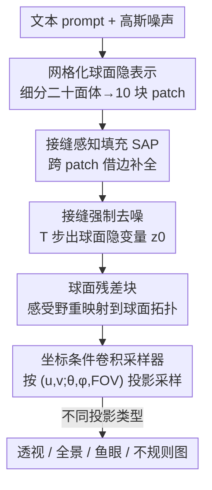

# Arbitrary-Shaped Image Generation via Spherical Neural Field Diffusion

**会议**: ICLR2026  
**OpenReview**: [https://openreview.net/forum?id=UNeL5NdLzc](https://openreview.net/forum?id=UNeL5NdLzc)  
**代码**: https://github.com/xjyjjy/ASIG  
**领域**: 扩散模型 / 图像生成  
**关键词**: 任意形状图像生成、球面神经场、网格化球面隐扩散、视角控制、全景/鱼眼生成

## 一句话总结
ASIG 把整个场景先用"网格化球面隐扩散"在一颗细分二十面体球面上一次性生成出来，再用"球面神经场"按坐标条件从这颗球上任意采样，从而第一次在统一框架内对视角、FOV、分辨率做显式控制，并能无畸变地输出透视、全景、鱼眼乃至不规则形状的图像，质量全面超过各类专用方法。

## 研究背景与动机
**领域现状**：扩散模型（SD、SDXL、DiT）在图像生成上已经非常强，但它们都被钉死在固定网格、固定分辨率、固定视角上。透视图生成方法只能"看正前方"，全景生成方法（MVDiffusion、PanFusion 等）能出全视野图，但被锁死在等距柱状投影（ERP）域、单一中心视角、固定分辨率的矩形网格上。

**现有痛点**：想换个视角、换个 FOV、换个分辨率，现有范式只能靠"投影"事后裁切。而投影会引入畸变和模糊——尤其是 ERP 的非均匀采样，本身就破坏语义和空间一致性。所谓的"任意分辨率扩展"（INFD、Kim&Kim）也只是把同一张图上采样补细节，FOV 和视角根本没变，生成的不是新场景内容。

**核心矛盾**：根本问题在于现有方法把"空间属性"（视角、FOV、分辨率）当成训练数据里隐式相关的统计量去拟合，而没有任何显式的几何表示去承载它们。要在一个平面网格上同时表达"整颗球的场景 + 任意视角的投影"，本质上是矛盾的——平面投影必然有畸变，没有畸变的全局表示又难以直接出图。

**本文目标**：建一个统一框架，能联合控制视角、FOV、分辨率，并在透视/全景/鱼眼等不同形状下都保持高质量。

**切入角度**：作者的关键观察是——如果先在一个**球面**上生成完整场景表示，那么任意视角、任意 FOV、任意分辨率的图像就只是从这颗球上"采样投影"的下游操作，畸变就能被几何性地消除。难点变成：怎么在球面上做扩散（球面不能直接卷积），以及怎么从球面表示按坐标条件无畸变地解码。

**核心 idea**：用"细分二十面体网格化球面隐扩散 + 球面神经场"代替"平面扩散 + 事后投影"，把生成解耦成"先建一颗完整场景球 → 再按坐标采任意区域"两步。

## 方法详解

### 整体框架
ASIG 解决的是"一次生成一颗完整场景球、再按需采任意形状图"。整体分两大阶段：第一阶段是**网格化球面隐扩散**，UNet 吃文本 prompt + 高斯噪声，经过 $T$ 步去噪，产出一个表示在细分二十面体上的球面隐变量 $z_0$；为了让 10 块拼起来的球面 patch 不出现接缝，全程用 Seam-Aware Padding（SAP）做接缝强制。第二阶段是**球面神经场**（SNF），VAE 解码器先吐出多尺度特征，球面残差块对齐球面拓扑做细化，最后一个坐标条件下的卷积采样器，根据 $(u,v;\theta,\phi,\text{FOV})$ 把球面特征映射成指定空间属性下的 RGB。两阶段串起来，就实现了"统一表示 → 任意采样"。

### 关键设计

**1. 网格化球面隐表示：把球面变成能做 2D 卷积的规则网格**

痛点是球面本身没法直接卷积，而 ERP 平铺又有非均匀畸变。作者从正二十面体出发（12 顶点、20 三角面，可两两合并成 10 个菱形面），每次细分把每个面四分并把新顶点重投影回球面；第 $L$ 级细分下每个原始面被分成 $4^L$ 个三角面。每个菱形 patch 展开成矩形网格，按重心采样把每个三角面映射到唯一像素，建立一一对应 $F_L^p \leftrightarrow M^p \in \mathbb{R}^{H_L \times W_L \times d}$，其中分辨率 $(H_L, W_L) = (2^L, 2^L)$，例如 $L=5$ 得 $64\times64$、$L=6$ 得 $128\times128$。这样做的妙处在于：细分级别天然对应扩散 UNet / VAE 的多尺度层级，于是球面表示可以无缝套进标准扩散骨干，且保持了球面邻接关系不丢。

**2. 接缝感知填充（SAP）：让卷积核能跨 patch 边界看到连续球面**

问题在于：每个 patch 只有菱形区域有效，展开成矩形后剩下的格子是零填充。这导致卷积核读不到 patch 边界外的信息（上下文断裂），零填充区还会在相邻 patch 间制造人工接缝。SAP 的做法是利用细分二十面体的连通图，给每个 patch $p_i$ 定义邻居集 $N(p_i) = \{p_{i-2}, p_{i-1}, p_{i+1}, p_{i+2}\}$（索引对 10 取模，尊重 patch 的循环排列），然后把填充区的像素从几何上重映射邻居的有效像素来补：

$$\tilde{M}^{p_i}(u,v) = \begin{cases} M^{p_i}(u,v), & (u,v) \in p_i \text{ 有效区} \\ \Pi_{p_i \leftarrow p_j}\!\left(M^{p_j}(u',v')\right), & (u,v) \in \text{填充区},\ p_j \in N(p_i) \end{cases}$$

其中 $\Pi_{p_i \leftarrow p_j}$ 是沿网格邻接的几何重映射。把 SAP 加到扩散 UNet 和 VAE 解码器的**所有**卷积层后，卷积核就能跨 patch 边界感知连续特征、感受野平滑延展到整张网格，人工接缝被消除，整颗球语义一致。

**3. 接缝强制去噪：把 SAP 贯穿整个采样过程，保证球面隐变量本身就无缝**

只在网络里补边还不够——独立处理各 patch 的去噪会累积不连续。作者在每个时间步都对隐变量做 SAP：$x_t = \text{SeamPad}(z_t; L)$，把 mesh-邻居的边界特征拷进来，再送进 UNet 预测噪声，调度器更新 $z_{t-1} = \text{Step}(z_t, \hat{\epsilon}_t, t)$，循环到 $t=0$ 得到接缝一致的 $z_0$。关键细节是 $\text{SeamPad}(\cdot;L)$ 只改边界格、内部不动，所以既高效又保证语义连续。训练时同样把噪声目标和隐变量都过 SAP（见损失），让训练与推理对齐，从源头杜绝边界伪影。

**4. 球面神经场（SNF）：按坐标条件从球面无畸变采任意区域**

球面隐变量 $z_0$ 直接解码会有畸变、且没有显式空间控制。SNF 由两部分组成。其一是**球面残差块**：对 VAE 解码器的多尺度特征 $D^{(\ell)}(z_0)$，把感受野重映射到二十面体拓扑做几何感知细化，再上采样到统一分辨率、沿通道拼接，$F = \text{Concat}_{\ell \in \{6,7,8,9\}}\big(\text{Upsample}(\text{SphRes}^{(\ell)}(D^{(\ell)}(z_0)))\big)$。其二是**卷积隐采样器**：把多尺度球面特征 $F$ 和 VAE 解码的 RGB $D(z_0)$ 沿通道拼接，给定目标视角 $(\theta,\phi)$ 和 FOV 后，投影函数 $\pi(u,v;\theta,\phi,\text{FOV})$ 把每个输出像素映射到球面隐变量上的对应坐标（投影类型决定是透视/全景/鱼眼），再插值采样并经轻量网络 $f_\theta$ 转成 RGB：

$$I(u,v) = f_\theta\Big(\text{Sample}\big([F, D(z_0)],\ \pi(u,v;\theta,\phi,\text{FOV})\big)\Big),\quad (u,v) \in G.$$

正是这个坐标条件采样，让任意分辨率、任意视角、任意 FOV、任意图像形状都成了对同一颗球的不同"取景"，而不是分别训练的专用模型。

### 损失函数 / 训练策略
训练分两阶段，UNet 和 VAE 权重都从 SDXL 初始化。**阶段一（构建球面神经场）**：冻结 VAE 编码器，端到端训练 SNF；把全景图转成 mesh patch，采任意分辨率的 GT RGB 做监督，用像素损失、感知损失、对抗损失加权 $L = \lambda_1 L_1 + \lambda_p L_{\text{LPIPS}} + \lambda_g L_{\text{GAN}}$。**阶段二（球面隐扩散微调）**：冻结 VAE 编码器，训练 UNet 学反向扩散；关键是把噪声目标 $\epsilon$ 和噪声隐变量 $z_t$ 都过 SAP，使训练目标为 $L_{\text{diff}} = \mathbb{E}_{t,z_0,\epsilon}\big[\|\text{SeamPad}(\epsilon, L) - F_\theta(\text{SeamPad}(z_t, L), t, y)\|_2^2\big]$，让训练与推理的接缝处理一致，防止边界伪影。

## 实验关键数据

数据集用 Matterport3D 的 10,800 张全景图（2,000 测试），文本 prompt 由 BLIP-2 生成。UNet 在 8×A100 上训 100k 步（batch 80，cosine 退火），SNF 训 100k 步（batch 4）。推理用 DDIM 50 步、ε-prediction、CFG（10% 文本 dropout）。

### 主实验
跨透视/全景/鱼眼三种形状全面对比 SOTA（节选关键指标，KID* 单位为 $10^{-2}$）：

| 形状 | 指标 | ASIG（本文） | 次优 | 说明 |
|------|------|------|------|------|
| 透视 | FID↓ | **14.68** | 21.33 (PanFusion) | 大幅领先专用方法 |
| 透视 | CLIP-FID↓ | **3.58** | 5.44 (PanFusion) | — |
| 透视 | MUSIQ↑ | **67.03** | 53.16 (SDXL Pano) | 感知质量最高 |
| 全景 | FID↓ | **25.49** | 28.92 (SMGD) | — |
| 鱼眼 | FID↓ | **10.29** | 17.16 (PanFusion) | 鱼眼提升最显著 |
| 鱼眼 | CLIP-FID↓ | **1.99** | 2.76 (SMGD) | — |

ASIG 在所有指标、所有形状上都拿到最优；鱼眼和透视的增益尤其大，说明"先建球再采样"对非常规形状的优势最明显。

### 消融实验

| 配置 | 关键指标（生成 FID↓ / 重建 PSNR↑） | 说明 |
|------|------|------|
| Full model | 25.49 / 30.07 | 完整模型 |
| w/o 球面残差块 | 27.93 / 28.65 | 去掉后 FID↑、PSNR↓、LPIPS 0.168→0.2205 |
| w/o SAP（在 SNF 中） | 27.69 / 29.17 | 去掉后 FID、KID、CLIP-FID 全面变差 |

跨分辨率全景质量（pFID↓ / KID*↓）显示 ASIG 在 512/1024/1536 三档都明显优于 LTEW-增强的各基线（如 1536 档：本文 16.31/0.74 vs PanFusion+ 25.46/1.04）。

### 关键发现
- **SAP 是命脉**：从扩散 UNet 去掉 SAP，patch 边界会出现肉眼可见的接缝和语义错位（Fig. 6）；从 SNF 去掉 SAP，三项 FID 类指标一致退化——接缝处理在"生成"和"解码"两端都不可省。
- **球面残差块管几何保真**：去掉后 PSNR 掉 1.4 分、LPIPS 明显上升，证明把感受野重映射到二十面体拓扑对抑制球面畸变是必要的。
- **跨分辨率鲁棒**：分辨率越低（512），基线退化越严重，而 ASIG 退化最缓，说明球面神经场的坐标采样比平面上采样更抗分辨率变化。

## 亮点与洞察
- **"先建场景球、再采任意取景"的解耦**很优雅：把视角/FOV/分辨率从"要去拟合的隐式统计量"变成"对统一球面表示的显式采样参数"，一举把多个专用任务（透视、全景、鱼眼、不规则图）统一进一个框架。
- **细分二十面体天然对齐扩散多尺度**：选二十面体而非 ERP，既避免了非均匀畸变，又让细分级别 $L$ 恰好对应 UNet/VAE 的特征分辨率层级，几乎零成本复用 SDXL 骨干——这是个很聪明的工程-几何耦合。
- **接缝问题在训练和推理两端对齐处理**：SAP 不只是推理 trick，而是写进训练目标里（噪声也过 SAP），从原理上保证训练-推理一致，这个思路可迁移到任何"把球面/流形切片成 patch 再卷积"的生成任务。
- 不规则形状图像"自然涌现"：只要联合调 FOV 和分辨率，任意宽高比甚至不规则图都能从同一颗球采出来，不需要额外设计。

## 局限与展望
- **依赖全景数据训练**：方法在 Matterport3D 全景上训练，场景多为室内；虽然展示了室外的域外泛化，但训练域受限于可获取的全景数据集，开放世界泛化能力仍待验证。
- **两阶段训练 + 球面采样开销**：需要分两阶段各训 100k 步、8×A100，且推理时每个目标视角都要做球面投影采样，相比单次平面前向更重。
- **几何依赖单颗场景球**：整个场景被压缩进一颗以单点为中心的球面表示，对需要大范围平移（而非纯旋转视角）的场景，单球表示可能不足以承载视差和遮挡变化。
- 可改进方向：把单球扩成多球/分层球以支持平移视差；或用更轻量的实时采样器替换卷积采样器以加速多视角渲染。

## 相关工作与启发
- **vs 透视图生成（SD / SDXL / DiT）**：它们隐式拟合分辨率/视角/FOV 的相关性、缺乏显式空间控制；ASIG 用球面表示把这些属性显式参数化，并能无畸变换视角，而不只是固定网格出图。
- **vs 全景生成（MVDiffusion / PanFusion / SMGD）**：它们在 ERP 域或拼接域学习，受非均匀畸变和固定中心视角所限，换视角要靠投影引入畸变；ASIG 在无畸变的二十面体球面上生成，任意视角都是直接采样而非二次投影。
- **vs 任意分辨率神经场（INFD / Kim&Kim / LTEW）**：它们把神经场用于固定视角/FOV 下的任意尺度超分，只补细节不出新内容；ASIG 把神经场和球面隐扩散耦合，把"任意分辨率"扩展到"任意视角 + 任意 FOV + 任意形状"，并在跨分辨率全景上 pFID 全面更低。

## 评分
- 新颖性: ⭐⭐⭐⭐⭐ 首个统一控制视角/FOV/分辨率并跨透视/全景/鱼眼的扩散框架，球面网格化隐扩散 + 球面神经场的耦合是真创新。
- 实验充分度: ⭐⭐⭐⭐ 三种形状全面对比 + 跨分辨率 + 三组消融，扎实；但训练数据集较单一（仅 Matterport3D）。
- 写作质量: ⭐⭐⭐⭐ 框架与公式清晰，几何动机讲得透；部分符号（如 patch 邻居索引）需对照图才好懂。
- 价值: ⭐⭐⭐⭐⭐ 把多个专用生成任务统一进一个几何一致的框架，对可控生成和 3D 场景生成都有启发，且开源。

<!-- RELATED:START -->

## 相关论文

- [\[ICLR 2026\] PixNerd: Pixel Neural Field Diffusion](pixnerd_pixel_neural_field_diffusion.md)
- [\[ICLR 2026\] COSMO-INR: Complex Sinusoidal Modulation for Implicit Neural Representations](cosmo-inr_complex_sinusoidal_modulation_for_implicit_neural_representations.md)
- [\[CVPR 2026\] Spherical Leech Quantization for Visual Tokenization and Generation](../../CVPR2026/image_generation/spherical_leech_quantization_for_visual_tokenization_and_generation.md)
- [\[ICLR 2026\] Any-step Generation via N-th Order Recursive Consistent Velocity Field Estimation](any-step_generation_via_n-th_order_recursive_consistent_velocity_field_estimatio.md)
- [\[ICLR 2026\] Interaction Field Matching: Overcoming Limitations of Electrostatic Models](interaction_field_matching_overcoming_limitations_of_electrostatic_models.md)

<!-- RELATED:END -->
