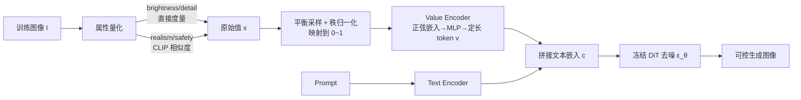

# AttriCtrl: A Generalizable Framework for Controlling Semantic Attribute Intensity in Diffusion Models

**会议**: ICLR 2026  
**代码**: [https://github.com/CD22104/AttriCtrl](https://github.com/CD22104/AttriCtrl)  
**领域**: 图像生成 / 可控扩散  
**关键词**: 扩散模型, 美学属性控制, 连续强度调节, 值编码器, 即插即用适配器  

## 一句话总结
AttriCtrl 通过把"亮度/细节/真实感/安全度"等美学属性统一量化到 $[0,1]$ 标量，再用一个轻量"值编码器"把数值翻译成可注入扩散模型的 token 序列，让用户能像调旋钮一样对单个或多个语义属性做连续、解耦、即插即用的强度控制。

## 研究背景与动机
- **领域现状**: 扩散模型已是图像生成主流，ControlNet、T2I-Adapter、Prompt-to-Prompt 等给了语义内容上的精细控制；美学对齐方向则多用 RL、DPO（DPOK、Diffusion-DPO）或改架构（FreeU）把模型推向"人类偏好"。
- **现有痛点**: 这些方法都在做**全局偏好对齐**，隐含假设存在"唯一最优审美目标"，无法解耦单个属性、也给不了"把图调暗 20%"这种**可分级的连续控制**；而文本编码器天生面向离散 token，对数值不敏感（"darker"/"100% brightness"控制不稳定）。少数插值方法（如 AID 在 attention 上做加权插值）缺乏沿属性流形的显式引导，常产生 halo、结构崩塌等伪影。
- **核心矛盾**: 美学判断是**多维、上下文相关、连续**的，但现有条件机制把它当成离散 token 或单一全局奖励信号，二者无法对齐。
- **本文目标**: 让生成模型能**解耦**各美学属性、把它们理解为**连续值**、并允许用户用数值指令**平滑导航强度**。
- **核心idea**: **【属性量化 + 值编码器】** —— 先用混合策略把具体/抽象属性都映射到统一 $[0,1]$ 尺度，再训练一个冻结主干、即插即用的 value encoder，把标量强度变成语义嵌入注入扩散过程，从而获得解耦、可组合的属性专属控制向量。

## 方法详解

### 整体框架
AttriCtrl 把问题拆成两步：**先量化、再编码注入**。第一步（属性量化）对每张训练图算出 brightness/detail/realism/safety 四个原始分数，并归一化到统一 $[0,1]$ 尺度；第二步（定制美学控制）为每个属性训练一个独立的 value encoder，把归一化标量变成定长 token 序列，沿序列维拼接到文本嵌入 $c$ 后送入冻结的 DiT 主干（基座为 FLUX）。多属性控制则把各自独立训练好的 value encoder 输出在推理时直接拼接组合。

### 关键设计

**1. 混合属性量化：把具体与抽象属性都钉到同一把尺子上。** 论文区分两类属性用两套度量。对**具体属性**走直接度量：亮度取 HSV 的 Value 通道均值除以 255，$x^{\text{Brightness}}_I = \frac{1}{H\cdot W}\sum_{i,j} \frac{v_{i,j}}{255}$；细节用灰度直方图的香农熵 $x^{\text{Detail}}_I = -\sum_{k} p_k \log p_k$ 作为纹理丰富度代理（作者验证其优于频域分析）。对**抽象属性**走 CLIP 跨模态相似度：真实感用正负 prompt 对比 $x^{\text{Realism}}_I = \text{sim}(e_I, e_{\text{pos}}) - \text{sim}(e_I, e_{\text{neg}})$（正例"真实照片"、负例"卡通插画"）；安全度则借 Stable Diffusion 内置 safety checker 的不安全概念嵌入 $e_s$，定义 $x^{\text{Safety}}_I = -(\text{sim}(e_I, e_s) - t)$，阈值 $t=0.19$ 与 checker 默认边界一致，取负号让方向与其它属性一致（值越大越安全）。

**2. 平衡采样 + 秩归一化：让训练分布均匀、跨属性可比。** 直接用原始值训练会遇到分布失衡和不同属性量纲不一致两个问题。作者先把每个属性的经验值域分成 10 个等宽 bin，对欠采样 bin 有放回过采样、对过采样 bin 随机下采样，得到更均匀又保序的样本；再做**秩归一化** $x^{\text{norm}}_i = \frac{\text{rank}(x_i)-0.5}{n} \in [0,1]$，把任意属性的原始分数都摊到统一 $[0,1]$ 上。这一步是多属性能联合控制的前提——所有属性在同一刻度上才谈得上"组合调节"。

**3. 值编码器：把一个标量"撑开"成一串可被自注意力处理的 token。** 这是框架的核心创新。归一化标量 $x^{\text{norm}}_i$ 先过**正弦嵌入**（沿用扩散模型 timestep 编码，其平滑插值特性天然适合把连续值变成结构化高维向量），再经两层 SiLU MLP 得到隐表示，然后**复制扩展成定长序列**（实验取 32 个 token）并叠加可学习的位置嵌入得到 $v$。把单个标量撑成序列是关键：它让自注意力能像处理文本 token 一样以分布式、关系化的方式解读强度值，且位置嵌入赋予每个 token 不同功能角色，比单条 conditioning 向量更具表达力。最终 $v$ 沿序列维拼到文本嵌入 $c$，训练目标即标准去噪损失 $L(\theta) = \mathbb{E}\big[\|\varepsilon - \hat{\varepsilon}_\theta(z_t, c, v, t)\|_2^2\big]$，主干全程冻结。

**4. 模块化多属性组合：独立训练、推理时拼接。** 若把多属性数据合并联合训练，会因属性间数据失衡而损害稳定性与收敛。作者改走模块化路线：每个属性在自己的单属性数据上**独立训练**一个 value encoder，推理时把各编码器输出的嵌入按序拼接再附到文本嵌入后。这样既复用了独立编码器的可组合性，又把属性间相互干扰降到最低，实现真正即插即用、可与 ControlNet/EliGen 等框架叠加的灵活控制。

## 实验关键数据

基座 FLUX，训练语料 EliGen 采样 155K 图文对，验证用 GenEval（553 prompt × 8 seed），控制精度用目标与生成属性强度的平均绝对差 AvgDiff $\downarrow$ 衡量；4×A100，1024×1024、30 步去噪。

### 主实验表格（单属性控制精度 AvgDiff ↓ + 用户偏好 ↑）

| 方法 | Bright. | Detail | Realism | Avg AvgDiff↓ | 用户偏好 Avg↑ |
|---|---|---|---|---|---|
| Kontext（prompt 指令） | 0.294 | 0.420 | 0.270 | 0.328 | 0.011 |
| W-Emb（加权嵌入） | 0.327 | 0.436 | 0.271 | 0.345 | 0.018 |
| AID-in（attn 内插值） | 0.214 | 0.361 | 0.227 | 0.267 | 0.072 |
| AID-out（attn 输出插值） | 0.214 | 0.361 | 0.227 | 0.267 | 0.056 |
| **Ours (AttriCtrl)** | **0.141** | **0.191** | **0.192** | **0.175** | **0.842** |

AttriCtrl 在三个属性上 AvgDiff 全面最低，用户研究（10 人 ×100 组对比，双盲）中被压倒性偏好（84.2% vs 次优 AID 的 7.2%）。

### 安全控制实验（I2P 数据集，移除率 RR ↑）

| 方法 | NP | SLD | ESD | **Ours** |
|---|---|---|---|---|
| RR (%) | 11.6 | 32.6 | 53.9 | **57.7** |

将安全度作为一个属性（目标强度固定为 1 强制抑制）即超过专门的概念擦除方法 ESD/SLD/NP。

### 关键发现
- **必须显式训练"中间强度"**：基线只学端点内容、缺乏分级概念，故 AvgDiff 普遍 >0.21；AttriCtrl 让模型建立连续的渐变认知，控制更准且过渡平滑无伪影。
- **AID 插值的代价**：缺乏沿属性流形的显式引导，中间步会出现 halo、结构崩塌、属性纠缠。
- **多属性轻微耦合**：realism 高的图 detail 也会略升，作者归因于训练数据本身（写实图天然纹理更多）。
- **强兼容性**：可无缝接入 ControlNet 与 EliGen，做美学过渡时不破坏底层内容与结构。

## 亮点与洞察
- **把"调旋钮"做成范式**：value encoder 把任意标量属性映射成 token 序列，作者明确指出可推广到 object count、尺寸比、色温、运动模糊等任何标量条件，指向"调音台式"组合控制的生成系统。
- **量化策略接地气**：具体属性用 HSV/熵这种零成本经典度量、抽象属性借现成 CLIP 与 SD safety checker，不需额外标注与奖励模型，工程上极轻。
- **"安全也是一个属性"**：把内容安全统一进同一连续控制框架，目标值拉满即超过专门的擦除方法，思路新颖。
- **冻结主干 + 模块化**：每个属性独立训练再拼接，避免联合训练失衡，天然支持即插即用与可组合。

## 局限与展望
- **强语义修饰词会干扰**：当 prompt 含"hyper-realistic hyperlapse lighting"这类强属性修饰时控制精度下降，作者留作"自然语言语义 × 标量控制"交互的未来工作。
- **属性间存在耦合**：realism 与 detail 的相关性来自数据偏置，尚未完全解耦。
- **抽象属性依赖代理度量**：构图、色调、叙事连贯等主观概念缺乏稳健 proxy metric，是推广到更丰富属性的关键瓶颈。
- **量化口径较简单**：亮度用 HSV 均值、细节用全局熵，可能无法捕捉局部结构复杂度（熵对噪声敏感）。

## 相关工作与启发
- **可控生成**：Prompt-to-Prompt、P+ 操纵 cross-attention；InstructPix2Pix/EMU-Edit/OmniGen 做指令编辑；ControlNet/T2I-Adapter 用轻量旁路模块——AttriCtrl 与后者同属"冻结主干 + 适配器"哲学，但补上了**数值化连续强度**这块空白。
- **美学建模/对齐**：DPOK、Diffusion-DPO 做偏好对齐，FreeU 改 U-Net；本文批判其"全局单一目标"假设，主张显式解耦。
- **插值控制**：AID 在 attention 上插值但缺流形引导；AttriCtrl 用学习到的连续轨迹替代端点插值，更稳更准。
- **启发**：把"连续标量 → token 序列 → 注入冻结主干"这套范式，可迁移到任何需要可分级控制的条件生成场景（如布局、几何、物理属性），是构建组合式可控生成系统的一块通用积木。

## 评分
- **新颖性**: ⭐⭐⭐⭐ —— "把标量属性撑成 token 序列做连续控制"+"安全度作为可调属性"的组合视角新颖，虽量化手段多为现成工具，但 framing 与可组合性有清晰价值。
- **实验充分度**: ⭐⭐⭐⭐ —— 覆盖单/多属性、用户研究、安全擦除对比、ControlNet/EliGen 兼容性，AvgDiff 指标设计合理；但基座单一（仅 FLUX）、对比方法多为自构基线（无现成强 baseline）。
- **写作质量**: ⭐⭐⭐⭐ —— 动机、矛盾、方法层次清晰，公式与图示到位，可读性好。
- **价值**: ⭐⭐⭐⭐ —— 即插即用、冻结主干、可组合，工程落地性强，对"精细可控创作"场景有直接实用价值。

<!-- RELATED:START -->

## 相关论文

- [\[ICLR 2026\] CREPE: Controlling Diffusion with Replica Exchange](crepe_controlling_diffusion_with_replica_exchange.md)
- [\[CVPR 2026\] SegQuant: A Semantics-Aware and Generalizable Quantization Framework for Diffusion Models](../../CVPR2026/image_generation/segquant_a_semantics-aware_and_generalizable_quantization_framework_for_diffusio.md)
- [\[ICLR 2026\] GeoDiv: Framework for Measuring Geographical Diversity in Text-to-Image Models](geodiv_framework_for_measuring_geographical_diversity_in_text-to-image_models.md)
- [\[ICML 2026\] RAIGen: Rare Attribute Identification in Text-to-Image Generative Models](../../ICML2026/image_generation/raigen_rare_attribute_identification_in_text-to-image_generative_models.md)
- [\[ICLR 2026\] A Hidden Semantic Bottleneck in Conditional Embeddings of Diffusion Transformers](a_hidden_semantic_bottleneck_in_conditional_embeddings_of_diffusion_transformers.md)

<!-- RELATED:END -->
