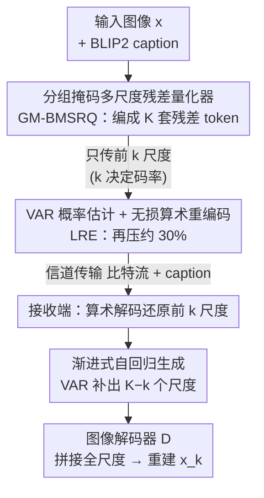

# Autoregressive-based Progressive Coding for Ultra-Low Bitrate Image Compression

**会议**: ICLR 2026  
**OpenReview**: [https://openreview.net/forum?id=FXu4G5T5QZ](https://openreview.net/forum?id=FXu4G5T5QZ)  
**代码**: https://github.com/Joanna-0421/ARPC  
**领域**: 图像压缩 / 图像恢复 / 视觉自回归  
**关键词**: 超低比特率压缩, 视觉自回归(VAR), 渐进式编码, 残差量化, 无损熵编码

## 一句话总结
ARPC 把视觉自回归模型 VAR 的「下一尺度预测」拿来做超低比特率图像压缩：编码端用多尺度残差量化器把图像拆成 K 套从粗到细的离散 token，只传前 k 套、其余由 VAR 自回归生成补齐，从而单模型就能连续调码率；再用 VAR 当概率估计器做无损算术编码、用分组掩码量化器进一步省比特，在 <0.05 bpp 下感知质量超过 13 个扩散/token 基线，解码还快 2∼6×。

## 研究背景与动机
**领域现状**：超低比特率（ultra-low bitrate，常 <0.05 bpp）图像压缩这两年被生成模型主导。GAN 和扩散模型靠强大的内容生成与纹理补全能力，在码率-失真-感知（rate-distortion-perception）目标下保住人眼可感的细节，其中扩散方案（PerCo、DiffEIC、DiffPC 等）感知质量已全面压过 GAN。

**现有痛点**：扩散类方法有三个老大难。其一**码率适应性差**：绝大多数走「一个码率训一个模型」（one-model-per-rate），真实动态传输环境里没法平滑切码率。其二**编解码复杂度高**：即便近期用预训练扩散 + 反向信道编码（reverse channel coding）做渐进编码，扩散固有的多步迭代去噪仍带来不可避免的高延迟。其三**依赖共享随机性**：反向信道编码要求收发双方共享同一份随机数，这在现实里并不总能满足。

**核心矛盾**：扩散模型天然是「一次性从噪声还原整张图」的连续生成器，它既不是天生的分层渐进结构，又因连续隐空间而依赖共享随机性。要的是「先传关键、后补细节」的可分层、可截断、且不依赖随机性的离散表示——这正是扩散范式不擅长的。

**本文目标**：用单个模型支持任意码率（渐进可截断）、解码要快、且不需要共享随机性。

**切入角度**：作者注意到视觉自回归模型 VAR 的「下一尺度预测」用多尺度残差量化器把图像编成离散的、层级化的视觉 token，再从粗到细自回归地逐尺度预测。第一关键洞察是：这种 coarse-to-fine 范式天然就等于完美的码率适应——先传布局这类粗但关键的信息，再逐步叠加细纹理。相比扩散，VAR 还多两个好处：生成更快、收发双方无需共享随机性（因为隐空间已离散化）。

**核心 idea**：把图像压缩重写成 VAR 的自回归生成过程——「只传前 k 个尺度的 token、剩下 K−k 个尺度让 VAR 自己生成」，截断 k 的位置就是码率旋钮；再把 VAR 复用成熵编码的概率估计器、并用分组掩码压紧早期尺度，把压缩比榨到极致。

## 方法详解

### 整体框架
ARPC 是一个建立在「下一尺度预测」VAR 之上的渐进式图像压缩框架。编码端把输入图像 $x$ 经图像编码器得到特征图 $F\in\mathbb{R}^{h\times w\times c}$，再用按位多尺度残差量化器（bitwise multi-scale residual quantizer）量化成 $K$ 个分辨率由小到大的残差 token 图 $(R_1,\dots,R_K)$；其中按位量化把每个 $c$ 维向量映射成 $c$ 位二进制码（正为 1、否则为 0），$r_{i,j}=\frac{1}{\sqrt c}\,\mathrm{sign}(r_{i,j})$，于是 token 天然就是比特流。早期尺度承载布局、颜色等结构信息，越往后越补细节，累积重建 $F_k=\sum_{i=1}^k \mathrm{upsample}(R_i)$ 随 $k$ 增大逐渐逼近 $F$。

发送时**只传前 $k$ 个尺度的 token**（外加一句 BLIP2 生成的图像 caption 作全局语义上下文），码率由 $k$ 决定；接收端拿到 $R_{\le k}$ 当前缀，用 VAR 经 $K-k$ 步自回归把缺的 $\hat R_{>k}$ 生成出来，全部尺度上采样到同分辨率拼接后送图像解码器 $D$ 得重建 $x_k=D(R_1,\dots,R_k,\hat R_{k+1},\dots,\hat R_K)$。在这条主干上再叠两层提压缩比的设计：用 VAR 当概率估计器对传输的 token 做无损算术编码（LRE），以及用分组掩码量化器（GM-BMSRQ）把早期尺度压进更小的特征空间；训练时还用尺度随机丢弃（SRD）增强早期尺度的语义承载力。

### 关键设计

**1. 渐进式自回归编解码框架：把「传前 k 尺度、生成剩余尺度」当码率旋钮**

这一设计直接打掉扩散类「一码率一模型」和「依赖共享随机性」两大痛点。机制上，按位多尺度残差量化器把图像编成 $K$ 套从粗到细的离散 token，发送端只挑前 $k$ 套传输，接收端把它们当前缀、由 VAR 做 $K-k$ 步自回归预测补全 $\hat R_{>k}$——解压被自然地写成了 VAR 的生成过程。截断点 $k$ 越大码率越高、质量越好，所以**单个模型靠改 $k$ 就能覆盖连续码率**，无需重训。为何有效：作者给出失真上界定理 3.1，证明只传前 $k$ 尺度的重建失真 $\mathbb E[D_k]$ 被两项控制——$\mathbb E[D_k]\le \mathbb E[D_K]+C\cdot\mathbb E_{R_{\le k}}\big[D_{\mathrm{KL}}(p(R_{>k}|R_{\le k})\,\|\,p_\theta(R_{>k}|R_{\le k}))\big]$，即「全 token 重建误差」加「VAR 预测分布与真实分布的 KL」。这把训练干净地拆成两阶段：先训编/解码器+量化器压第一项，再训 VAR 压 KL 项。又因隐空间已离散化，收发双方不必共享随机数。

**2. 分组掩码多尺度残差量化器（GM-BMSRQ）：按尺度内容自适应砍通道**

这一设计针对「早期尺度本就低频、却仍占满 $c$ 比特」的浪费。作者先观察到 $K$ 个尺度有清晰层级、可粗分三组：前 4 个尺度是大色块（确定宏观配色），中间 5 个尺度勾出物体轮廓但边缘还糊，最后 4 个尺度才补精细纹理。既然早期尺度是低频、信息可压进更小空间，受乘积量化（product quantization）启发，GM-BMSRQ 对早期组按通道维度上掩码：第一组掩掉后 $c/2$ 个通道（置 -1 设为 inactive bit）、第二组掩掉后 $c/4$ 个通道，从而**同时在分辨率和通道两个维度压紧前两组**，只在该承载细节的后期尺度才放开全部比特。实现上三组通道维分别配成 8、12、16。这等于按每个尺度的内容量自适应分配比特，超低码率下进一步省下传输量而几乎不掉质量。

**3. VAR 概率估计 + 无损算术重编码（LRE）：把生成模型复用成熵编码器**

这一设计冲着「按位 token 的比特并非均匀分布、可再压」去。以往（如 PerCo）假设 token 索引服从均匀分布做熵编码，但按位量化的索引 $y_k(i,j)=\sum_{n=0}^{c-1}\mathbb 1_{R_k(i,j,n)>0}\,2^n$ 每一位都承载语义、依赖上文，并不是 0/1 各半。关键观察是：VAR 的训练目标本就是「在给定前序尺度条件下精确预测这个分布」——它的 $c$ 个二元分类器给出 $p_k(i,j)\in\mathbb R^{c\times 2}$，恰好是高精度的概率估计。于是把 VAR 当概率估计器，按自回归顺序（从 `<SOS>` 预测 $p_1$ 编 $y_1$，再条件于前序尺度逐尺度编下去）配算术编码做无损重压。解压分两段：先复现同样的概率预测 + 算术解码无损还原前 $k$ 尺度，再用 classifier-free guidance 生成后 $K-k$ 尺度。实测仅此一项就再降约 30% 码率而画质几乎无损。

**4. 尺度随机丢弃（SRD）：逼早期尺度多扛语义**

这一设计补的是超低码率下的致命问题：已有工作指出图像语义集中在最后几个尺度，若只传前几个尺度，接收端拿到的有效信息太少、重建质量崩。SRD 在第一阶段训练时以概率 0.2、从第 4 个尺度起随机丢弃后续尺度，强迫网络把更多语义压进早期尺度的 token。这样在只传前几尺度的超低码率下，仍能保住基本结构、配色乃至屋顶花纹这类细节——是个纯训练侧、零推理开销的鲁棒性增强。

### 损失函数 / 训练策略
两阶段训练对应定理 3.1 的两项。**第一阶段**训图像编码器、解码器与 GM-BMSRQ 量化器，最小化全 token 重建失真：$\mathcal L_{\text{first}}=\mathcal L_{\text{rec}}+\mathcal L_{\text{per}}+\mathcal L_{\text{dis}}+\mathcal L_{\text{commit}}+\mathcal L_{\text{entropy}}$（$L1$ 重建 + 感知 + 判别器 + 隐空间 commit + 按位量化熵损失），先在 256×256 上训 500k 步，再在 256/512/1024 混分辨率上训 300k 步，SRD 概率 0.2、从第 4 尺度起。**第二阶段**冻结编/解码器，用 **Infinity-2B** 当 VAR，以最小化 $\mathcal L_{\text{VAR}}=-\sum_{i=1}^K \log p_\theta(R_i|R_{<i})$ 微调 20k 步（AdamW，batch 64，lr $6\times10^{-5}$，1024×1024，InternVL 2.0 重写 caption），全程 8× H20。

## 实验关键数据

### 主实验
- **数据**：训练用 Coyo-700M 经多级清洗（>1024² 分辨率、OCR 去字、InternVL 2.0 重写 caption）得 5M 高质图；评测在 DIV2K-val（100 张）与 CLIC2020（428 张），中心裁到 1024×1024，caption 由 BLIP2 生成。
- **基线/指标**：对比 13 个 SOTA（VAE 类 ELIC/MS-ILLM、扩散类 DiffEIC/DiffPC/RDEIC/ResULIC/StableCodec/OSCAR、渐进扩散 DiffC、token 类 VQGAN/GLC/DLF），6 个感知指标（LPIPS、DISTS、PIEAPP、CLIP Score、FID、KID）。
- **结论**：在所有数据集、几乎所有码率下感知指标领先，FID/KID 上对全部基线优势尤其明显（统计保真度强）；对渐进式扩散 DiffC 全码率胜出且无需共享随机性。

下表为 CLIC2020（1024×1024）上的推理效率与 BD-rate（以 ARPC 为参照 0）：

| 方法 | 步数 | 编码(s) | 解码(s) | BD-rate(%) | FID | DISTS | PIEAPP |
|------|------|---------|---------|-----------|-----|-------|--------|
| PerCo | 20 | 0.20 | 10.25 | 1167.35 | 882.09 | 2744.75 | — |
| DiffEIC | 50 | 0.65 | 15.98 | 681.76 | 139.64 | 100.75 | — |
| DiffPC | 50 | 0.17 | 23.66 | 93.90 | 20.49 | 16.52 | — |
| RDEIC | 6 | 0.31 | 4.18 | 523.52 | 1469.67 | 761.27 | — |
| StableCodec | 1 | 0.42 | 1.11 | 0.1547 | 6.99 | 254.42 | — |
| DiffC | — | 3.63∼45.22 | 13.63∼37.25 | 674.37 | 59.62 | 117.11 | — |
| **ARPC** | 13 | 1.8∼6.2 | 5.39 | **0** | **0** | **0** | — |
| ARPC (w/o LRE) | 13 | 0.20 | 5.39 | 34.64 | 34.58 | 34.38 | — |

> 表中 FID/DISTS 等列为按对应指标算的 BD-rate（相对 ARPC 的百分比，越大越差）。解码上 ARPC 仅 5.39s，比 PerCo 快约一倍、比 DiffC 快 2∼6×；解码步数固定 13，时延确定（不像 DiffC 是一段可变区间）。编码时延随码率上升（要为前 k 尺度预测概率做算术编码），但低码率下 token 少、开销极小。

### 消融实验

| 配置 | 影响 | 说明 |
|------|------|------|
| Full ARPC | — | 完整模型 |
| w/o LRE | 码率 ↑ ~30% | 去掉算术编码、直接传 GM-BMSRQ 二进制码；画质几乎不变，但编码时间从变长降到仅 0.2s（无需自回归概率预测） |
| w/o SRD | 低码率感知指标显著变差 | 去掉尺度随机丢弃后，<0.01 bpp 下结构/配色都难保，高码率细节也变糊 |
| w/o GM-BMSRQ | 码率明显 ↑ | 把 BMSRQ 通道固定 16 不做分组掩码，超低码率下比特数明显上升 |

### 关键发现
- **LRE 是「免费午餐」**：仅靠把 VAR 当概率估计器做无损算术编码就再省约 30% 码率且不掉画质；代价是编码时延（低码率下仍很小）。
- **SRD 决定超低码率下限**：语义本集中在末尾尺度，不靠 SRD 把语义往前压，只传前几尺度时接收端几乎拿不到有用信息。
- **GM-BMSRQ 在 ultra-low bitrate 段收益最大**：早期尺度是低频信息，掩通道几乎不损质量却显著降比特。
- **优于 token 类基线的根因**：ARPC 用更大的码本覆盖更全图像特征、靠传不同数量的尺度（而非缩小码本词表）来控码率，再加 VAR 精确预测索引分布提压缩比。

## 亮点与洞察
- **范式迁移很漂亮**：把「下一尺度预测」的 coarse-to-fine 直接等价成「渐进可截断的码率旋钮」，一个 idea 同时解掉码率适应、解码慢、依赖共享随机性三件事——这种「重述任务而非堆模块」的视角值得借鉴。
- **一物三用的 VAR**：同一个 VAR 既是缺失尺度的生成器、又是熵编码的概率估计器，把生成先验和熵建模统一在一个模型里，省掉了独立熵模型。
- **可迁移 trick**：GM-BMSRQ 的「按内容/频率分组掩通道」可搬到其他多尺度离散表示压缩；SRD 这种「随机丢后段、逼前段扛语义」的训练法对任何分层渐进表示都可能涨低码率鲁棒性。
- **理论兜底**：定理 3.1 把失真上界拆成「重建误差 + KL」，干净地解释了为什么要两阶段训练，而不是经验式拼损失。

## 局限与展望
- **依赖大体量 VAR 先验**：第二阶段直接用 Infinity-2B，解码 5.39s 虽快过多数扩散法，但相对一步扩散（StableCodec 1.11s）仍慢，且 2B 模型对端侧部署不友好。
- **编码时延随码率变动**：高码率下要为更多尺度做自回归概率预测，编码可达 6.2s，对实时/对称编解码场景不算理想。
- **评测偏感知质量**：6 个指标都偏感知/统计保真，没系统报 PSNR 等失真指标，对「保真优先」场景的适用性需进一步看。
- **caption 依赖外部模型**：需 BLIP2/InternVL 生成 caption 当语义条件，caption 质量与额外比特开销对极端低码率的影响值得单独评估。

## 相关工作与启发
- **vs 扩散渐进编码 DiffC**：DiffC 靠传扩散过程的「损坏中间版本」+ 反向信道编码做渐进压缩，需共享随机性、且时延是一段可变区间；ARPC 用离散尺度截断做渐进，无需共享随机性、解码步数与时延固定，且全码率指标更好。
- **vs token 类（PerCo/OSCAR/VQGAN）**：它们为保低码率往往用很小词表（如 256），覆盖不了复杂图像特征；ARPC 靠传不同数量尺度而非缩词表来控码率，码本更大、配 VAR 精确估计索引分布，复杂图上语义/细节保持明显更好。
- **vs VAE 类（ELIC/MS-ILLM）**：纯 MSE/率失真优化在低码率会过度平滑、统计保真低；ARPC 走率-失真-感知路线，FID/KID 大幅领先。
- **承接 Infinity / VAR**：方法骨架直接站在 VAR（首个在质量/速度/扩展性上超过扩散 Transformer 的视觉自回归）与 Infinity（按位建模 BSQ）的肩膀上，是把这套生成范式首次系统用于图像压缩任务。

## 评分
- 新颖性: ⭐⭐⭐⭐⭐ 首个把「下一尺度预测」VAR 系统用于超低码率压缩，并一举解掉码率适应/解码慢/共享随机性三难。
- 实验充分度: ⭐⭐⭐⭐⭐ 13 基线 ×6 感知指标 ×2 数据集，含效率/BD-rate 与三项消融，证据链完整。
- 写作质量: ⭐⭐⭐⭐ 框架与失真上界讲得清楚；个别符号/图注（如 BD-rate 列含义）需对照原文。
- 价值: ⭐⭐⭐⭐⭐ 给生成式压缩开了一条「自回归 + 渐进可截断」的新路线，单模型多码率且解码更快，实用性强。

<!-- RELATED:START -->

## 相关论文

- [\[NeurIPS 2025\] FocalCodec: Low-Bitrate Speech Coding via Focal Modulation Networks](../../NeurIPS2025/image_generation/focalcodec_low-bitrate_speech_coding_via_focal_modulation_networks.md)
- [\[ICLR 2026\] Latent Wavelet Diffusion for Ultra-High-Resolution Image Synthesis](latent_wavelet_diffusion_for_ultra_high-resolution_image_synthesis.md)
- [\[ICLR 2026\] Autoregressive Image Generation with Randomized Parallel Decoding](autoregressive_image_generation_with_randomized_parallel_decoding.md)
- [\[ICLR 2026\] From Parameters to Behaviors: Unsupervised Compression of the Policy Space](from_parameters_to_behaviors_unsupervised_compression_of_the_policy_space.md)
- [\[ICLR 2026\] NextStep-1: Toward Autoregressive Image Generation with Continuous Tokens at Scale](nextstep-1_toward_autoregressive_image_generation_with_continuous_tokens_at_scal.md)

<!-- RELATED:END -->
