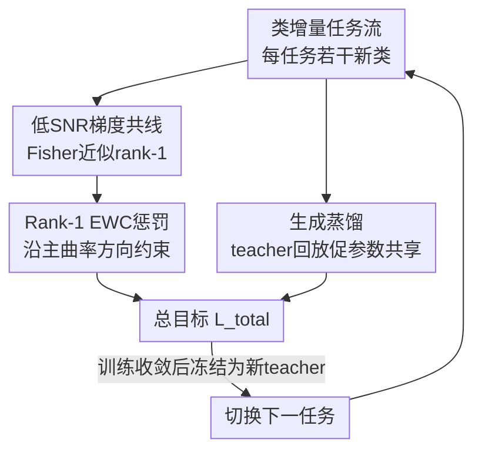

# Avoid Catastrophic Forgetting with Rank-1 Fisher from Diffusion Models

**会议**: ICLR 2026  
**OpenReview**: [https://openreview.net/forum?id=zCZcbRsc4g](https://openreview.net/forum?id=zCZcbRsc4g)  
**代码**: https://github.com/Teachable-AI-Lab/iclr2026-rank1-fisher  
**领域**: 扩散模型 / 持续学习  
**关键词**: 灾难性遗忘, 弹性权重巩固, Fisher信息矩阵, 扩散模型, 类增量生成

## 一句话总结
本文发现扩散模型在低信噪比时间步上的逐样本梯度近似共线，导致经验 Fisher 信息矩阵实质上是 rank-1 的，于是提出一个和对角近似一样廉价、却能抓住主曲率方向的 rank-1 EWC 惩罚，再配合生成蒸馏，在类增量图像生成任务上几乎消除了遗忘。

## 研究背景与动机
**领域现状**：持续学习要在不回看全部历史数据的前提下，让模型在一串任务上连续训练，核心难题是「灾难性遗忘」——学新任务时旧任务性能急剧下滑。对抗遗忘的两条主流路线是弹性权重巩固（EWC）和生成回放（generative replay）：EWC 用一个以 Fisher 信息矩阵加权的二次惩罚把参数「钉」在旧任务重要的方向上；生成回放则维护一个生成器，不断采样旧任务的伪样本陪着新任务一起训练。对扩散模型来说，回放尤其自然，因为它本身就能生成高质量样本。

**现有痛点**：两条路线各有硬伤。回放继承了生成器的缺陷，而且当生成器自己也在持续更新时，反向去噪过程会随任务漂移，放大分布偏移（distributional drift）。EWC 在实践中几乎都用**对角 Fisher 近似**，它忽略了参数间的互相关；本文进一步指出，对角近似在扩散模型的低 SNR 区几乎抓不到任何曲率——它对真 Fisher 的相对 Frobenius 误差在所有时间步上都接近 1.0。

**核心矛盾**：EWC 隐含假设各任务共享一个最优解（quadratic 惩罚才能把模型拉到对所有任务都好的区域），但在过参数化模型里不同任务常落进互不相交的盆地；而对角 Fisher 又把 EWC 仅有的曲率信息也丢掉了。于是「回放促进参数共享」和「EWC 约束漂移」本该互补的两件事，因为 Fisher 估得太差而无法发挥。

**切入角度**：作者去研究扩散模型的**梯度几何**。出发观察是：扩散模型在信噪比 $\text{SNR}=\sqrt{\bar\alpha_t}/(1-\bar\alpha_t)$ 较低（即靠后的时间步）时有一个可解析的梯度结构——随着模型收敛，逐样本梯度 $g$ 会和它们的均值 $\mu=\mathbb{E}[g]$ 近似共线，从而让经验 Fisher $F=\mathbb{E}[gg^\top]\approx\alpha\,\mu\mu^\top$ 实质上变成 rank-1，且方向就是平均梯度。

**核心 idea**：既然主曲率方向能从模型梯度里「免费」拿到，就用 rank-1 Fisher 替换对角 Fisher 构造 EWC 惩罚（成本不变、信息更准），再用生成蒸馏补上 EWC 所需的「跨任务参数共享」前提，让回放和 EWC 真正互补。

## 方法详解

### 整体框架
方法要解决的是「在一串类增量任务上训练同一个扩散生成模型而不遗忘旧类」。整体流程围绕一次任务切换展开：先在当前任务上正常训练扩散模型；训练到收敛后，从模型梯度里估出当前任务的 rank-1 Fisher（一个平均梯度方向 $\mu$ 加一个标量系数 $c^\star$）；进入下一任务时，损失里同时挂上两项约束——基于 rank-1 Fisher 的 EWC 惩罚（把参数沿主敏感方向钉向旧任务最优），以及用上一任务冻结模型当 teacher 的生成蒸馏（在回放样本上对齐去噪行为，把模型拉向各任务共享的参数区域）。两项合成总目标，训练完成后冻结成新 teacher，循环到下一个任务。

### 关键设计

**1. 低 SNR 下扩散 Fisher 近似 rank-1：把主曲率方向从梯度里「免费」拿出来**

这是全文的理论基石，针对的是「对角 Fisher 抓不到扩散模型曲率」这个痛点。作者从去噪分数匹配视角写出逐样本损失 $L_{\text{DSM}}(\theta;x_t)=\frac{1-\bar\alpha_t}{2}\lVert s_\theta(x_t,t)-s_t^\star(x_t)\rVert_2^2$，再分两步推。命题 1：由 Tweedie 公式可证，当 SNR 降低时真分数 $s_t^\star(x_t)\approx -x_t/(1-\bar\alpha_t)$，即去噪网络退化成一个**带缩放的恒等映射**。命题 2（配合假设 1：$s_\theta(x_t,t)\approx A_\theta x_t$ 是线性算子）：把线性形式代回梯度可得

$$g(\theta;x_t)=(1-\bar\alpha_t)\lVert x_t\rVert^2\,(A_\theta-\gamma_t I)=c(x_t)\,v,$$

其中 $c(x_t)$ 是只依赖输入的标量、$v=A_\theta-\gamma_t I$ 是不依赖 $x_t$ 的参数空间向量。也就是说所有逐样本梯度都是同一个方向 $v$ 的缩放，彼此共线、也和均值 $\mu$ 共线。代入经验 Fisher 就得到定理 1：$F_t(\theta)\approx\mathbb{E}[c^2(x_t)]\,\mu_t\mu_t^\top$，近似 rank-1，特征向量是 $\mu_t$、特征值是 $\mu_t^\top F_t\mu_t/\lVert\mu_t\rVert^4$。实证上，MNIST 小扩散模型的 Fisher 前两个特征值之比 $\lambda_2/\lambda_1$ 在 $t=700$ 低至 0.022，rank-1 重构对真 Fisher 的相对误差在中后段时间步明显低于对角近似（后者恒在 ~1.0）；不同时间步的 $\mu_t$ 还高度对齐，所以可以 Monte-Carlo 抽时间步、用一份平均梯度近似而不必逐时间步建 Fisher。为什么有效：它抓住的恰是被对角近似丢掉的离对角主曲率，而代价只是算一次平均梯度，和对角一样廉价。

**2. Rank-1 EWC 惩罚：用平均梯度方向重写巩固项**

有了 rank-1 结构就能绕开「构造完整 Fisher 矩阵不现实」的障碍。记 $\mu=\mathbb{E}[g]$，把 rank-1 Fisher 代进标准 EWC，标量系数取 $c^\star=\mu^\top F\mu/\lVert\mu\rVert^4=\mathbb{E}[(\mu^\top g)^2]/\lVert\mu\rVert^4$，得到惩罚

$$L_{\text{Rank-1}}(\theta)=L_T(\theta)+\frac{\lambda}{2}\sum_{k=1}^{T-1}c_k^\star\big(\mu_k^\top(\theta-\theta_k^\star)\big)^2.$$

直观上，它只惩罚参数沿「主敏感方向 $\mu_k$」的偏移——把 $(\theta-\theta_k^\star)$ 投影到平均梯度方向上再平方。和对角 EWC 逐坐标独立加权不同，这一项显式地沿真 Fisher 的主特征方向约束，因而在低 SNR 区能保住远比对角更多的曲率信息，却同样只需要梯度、不需要存或求逆任何矩阵。期望 $\mu$ 在训练时按扩散的联合采样过程估：抽 $x_0\sim p_{\text{data}}$、抽时间步 $t$、构造 $x_t$、求 $g(\theta;x_t,t)$，对 $x_0,t$ 取平均，等于把各时间步梯度平均，进一步稀释了最早几步可能残留的高秩结构。

**3. 生成蒸馏促进跨任务参数共享：补上 EWC 的共享最优假设**

EWC 只有在各任务最优解落在同一参数子空间时才好用；过参数化模型里任务盆地常互不相交，单靠 EWC 会失效——这正是消融里「无生成蒸馏的 EWC 遗忘居高不下」的根源。作者为此加一项生成蒸馏（沿用 Masip et al. 2025）：保留上一任务的冻结 teacher $\varepsilon_{\theta_{T-1}^\star}$，从它采样回放输入 $\tilde x$，让当前模型在这些样本上对齐 teacher 的去噪预测，

$$L_{\text{GD}}(\theta)=\mathbb{E}_{\tilde x\sim\tilde{\mathcal D}}\Big[\tfrac{1}{2}\lVert\varepsilon_\theta(\tilde x)-\varepsilon_{\theta_{T-1}^\star}(\tilde x)\rVert_2^2\Big].$$

它的作用是把 $\varepsilon_\theta$ 拉回到与旧任务行为兼容的输入流形上，从而把梯度下降引向与旧最优重叠的区域，**人为制造出 EWC 假设的那个共享最优**。总目标即 $L_{\text{total}}(\theta)=L_{\text{Rank-1}}(\theta)+L_{\text{GD}}(\theta)$：回放负责让任务间共享参数支撑，rank-1 EWC 负责约束回放带来的残余漂移，二者互补。

### 损失函数 / 训练策略
总损失为 $L_{\text{total}}=L_{\text{Rank-1}}+L_{\text{GD}}$。去噪骨干用 HuggingFace 的标签条件 UNet（4 个 ResNet block，首个下采样块 128 通道、其余 256），采样用 DDIM（50 采样步、1000 噪声步）。所有任务 EWC 惩罚权重 $\lambda=15000$；ImageNet-1k 每类回放 1300 张、其余数据集每类 5000 张；Adam，学习率 $2\times10^{-4}$，batch 128，ImageNet-1k 每任务 100 epoch、其余 200 epoch。

## 实验关键数据

### 主实验
类增量设置：MNIST / FMNIST / CIFAR-10 各切 5 任务（每任务 2 类），ImageNet-1k（下采样到 $3\times32\times32$）切 20 任务（每任务 50 类，模拟长程）。指标为末任务平均 FID（AFID↓）与最终平均遗忘 $F=\frac{1}{T}\sum_k\big(\text{FID}_k(m_T)-\text{FID}_k(m_k)\big)$（↓）。3 个随机种子。

| 方法 | MNIST AFID/F | FMNIST AFID/F | CIFAR-10 AFID/F | ImageNet-1k AFID/F |
|------|------|------|------|------|
| Non-continual（上界） | 2.6 / – | 5.7 / – | 23.3 / – | 11.7 / – |
| GD（仅生成蒸馏） | 10.1 / 2.3 | 19.1 / 3.9 | 61.2 / 16.6 | 69.0 / 46.2 |
| Diag（对角EWC+GD） | 14.3 / 5.2 | 27.7 / 9.1 | 72.6 / 17.9 | 73.8 / 25.8 |
| **Rank-1（本文，+GD）** | **7.6 / 0.6** | **15.4 / 0.9** | **50.5 / 7.4** | **48.5 / 15.2** |

本文在四个数据集上的 AFID 与遗忘全面领先：MNIST/FMNIST 遗忘近乎归零（$F=0.6,0.9$），长程 ImageNet-1k 遗忘相对「仅 GD」减半还多（15.2 vs 46.2），生成质量也大幅逼近非持续学习上界。

### 消融实验
| 配置 | MNIST AFID/F | ImageNet-1k AFID/F | 说明 |
|------|------|------|------|
| Diag w/o GD | 62.2 / 51.1 | 86.1 / 34.2 | 对角EWC单用 |
| Rank-1 w/o GD | 65.2 / 58.3 | 74.3 / 41.3 | rank-1 EWC单用 |
| GD | 10.1 / 2.3 | 69.0 / 46.2 | 仅生成蒸馏 |
| Diag（+GD） | 14.3 / 5.2 | 73.8 / 25.8 | 对角EWC补曲率有限 |
| Rank-1（+GD，full） | 7.6 / 0.6 | 48.5 / 15.2 | 完整方法 |

### 关键发现
- **EWC 单用会失效，必须配回放**：无生成蒸馏时无论对角还是 rank-1，遗忘都极高（MNIST 上 $F>50$），印证「任务最优盆地不相交、EWC 把模型拉向旧最优却离开新最优」；加上生成蒸馏制造共享最优后，rank-1 EWC 才显出互补价值。
- **rank-1 比对角更会「补曲率」**：对角 EWC+GD 相对「仅 GD」改善有限、有时甚至变差（MNIST AFID 14.3 vs 10.1），因为对角近似几乎没抓到扩散模型的曲率；rank-1+GD 则在所有数据集上进一步降 AFID、降遗忘。
- **长程任务收益最大**：ImageNet-1k 是 20 任务最长程设定，rank-1 把遗忘从 46.2 砍到 15.2，说明越长的任务序列、漂移累积越严重，准确的曲率约束越关键。

## 亮点与洞察
- **把「估 Fisher」从负担变成免费午餐**：通常做 EWC 要专门跑一遍数据估 Fisher，本文证明扩散模型在低 SNR 区的平均梯度本身就是 Fisher 主特征向量，连额外前向都省了——这是「分析模型固有梯度几何」带来的实打实工程红利。
- **理论结论可证伪、有边界**：作者在附录用 VAE（MSE+KL 目标）做对照，rank-1 主特征值只解释 ~50% 方差，把 KL 降权 $10^{-3}$ 后升到 ~85%，而纯 MSE 的 DDPM 高达 ~99%。这把「rank-1 来自 MSE 主导的自编码 regime」说清楚了，也提醒该结论不能无条件迁到非 MSE 目标。
- **可迁移的 trick**：跨时间步 $\mu_t$ 高度对齐 → 可 Monte-Carlo 抽时间步用单份平均梯度近似，省掉逐时间步建 Fisher，这个「方向稳定性」观察对任何想在扩散上加梯度正则的工作都有用。

## 局限与展望
- 作者承认核心贡献偏「分析扩散梯度几何」，假设 1（去噪网络近似线性 $s_\theta\approx A_\theta x_t$）目前缺乏大规模非线性架构上的严格证明，只能靠 UNet 跳连「更可能落在 PCA 子空间」来直觉支撑，未来需跨多种架构（跳连、注意力、L2 正则）系统验证假设何时成立。
- 实验规模偏小：数据集最大到下采样 $32\times32$ ImageNet-1k，UNet 也不大，rank-1 结论在高分辨率、大模型、文本条件扩散上是否依然成立未验证。
- 方法本质仍依赖生成蒸馏制造共享最优，rank-1 EWC 单用几乎无效；若回放质量差或 teacher 漂移严重，整个框架的上限会受限。可探索把 rank-1 思想推广到非 MSE 目标（如 VAE/一致性模型）或免回放设定。

## 相关工作与启发
- **vs 对角 Fisher EWC（Kirkpatrick et al. 2017）**：经典 EWC 逐坐标独立加权、忽略互相关，本文证明扩散 Fisher 曲率几乎全在离对角项上，对角近似误差恒 ~1.0；rank-1 用平均梯度方向单向约束，成本相同却抓住主曲率。
- **vs 生成回放 / 生成蒸馏（Shin et al. 2017；Masip et al. 2025）**：纯回放/蒸馏只「拉模型向旧行为靠」、不约束参数漂移；本文把生成蒸馏当作制造共享最优的手段，再叠 rank-1 EWC 约束漂移，二者职责互补而非替代。
- **vs DDGR/SDDGR 等扩散回放（Gao et al. 2023；Kim et al. 2024）**：它们聚焦用扩散生成器合成旧任务样本做下游（检测、分割）回放，本文不改回放机制，而是从扩散自身的梯度几何里挖出一个更好的正则项，角度正交、可叠加。

## 评分
- 新颖性: ⭐⭐⭐⭐⭐ 把扩散低 SNR 梯度共线 → rank-1 Fisher 的几何洞察落到 EWC 上，理论与方法都新。
- 实验充分度: ⭐⭐⭐⭐ 四数据集含长程 ImageNet-1k、消融完整且有 VAE 对照，但规模偏小、分辨率低。
- 写作质量: ⭐⭐⭐⭐⭐ 理论推导清晰，命题—定理—实证—方法层层递进，互补性论证到位。
- 价值: ⭐⭐⭐⭐ 给扩散持续学习提供一个几乎零成本的强正则，思路可迁移到其他扩散正则场景。

<!-- RELATED:START -->

## 相关论文

- [\[CVPR 2026\] Low-Rank Residual Diffusion Models](../../CVPR2026/image_generation/low-rank_residual_diffusion_models.md)
- [\[ICML 2025\] IntLoRA: Integral Low-rank Adaptation of Quantized Diffusion Models](../../ICML2025/image_generation/intlora_integral_low-rank_adaptation_of_quantized_diffusion_models.md)
- [\[ICLR 2026\] D-AR: Diffusion via Autoregressive Models](d-ar_diffusion_via_autoregressive_models.md)
- [\[ECCV 2024\] Diffusion-Driven Data Replay: A Novel Approach to Combat Forgetting in Federated Class Continual Learning](../../ECCV2024/image_generation/diffusion-driven_data_replay_a_novel_approach_to_combat_forgetting_in_federated_.md)
- [\[ICLR 2026\] Why Adversarially Train Diffusion Models?](why_adversarially_train_diffusion_models.md)

<!-- RELATED:END -->
