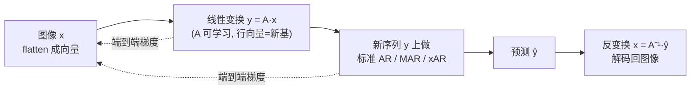

# BAR: Refactor the Basis of Autoregressive Visual Generation

**会议**: ICLR 2026  
**OpenReview**: [https://openreview.net/forum?id=2m9XQq4Dc3](https://openreview.net/forum?id=2m9XQq4Dc3)  
**代码**: 待确认  
**领域**: 图像生成 / 自回归视觉生成  
**关键词**: Autoregressive Generation, Basis Transform, Next-Basis Prediction, Learnable Token Order, ImageNet  

## 一句话总结
BAR 把自回归图像生成里"token 序列"这件事抽象成"图像向量在一组基向量上的投影"，用一个可端到端学习的线性变换矩阵 $A$ 统一了 VAR/xAR/RAR/PAR/FAR 等一众手工设计的预测单元与顺序，并让模型自己学出最优的基，在 ImageNet-256 上把 FID 刷到 1.15。

## 研究背景与动机
- **领域现状**：自回归（AR）模型把图像 flatten 成 1D token 序列、按 row-major 光栅扫描顺序逐个预测下一个 token，在图像生成上已能超越扩散模型。为了适配图像的 2D 结构，近期一批工作改造了"预测单元"和"预测顺序"：VAR 改成 coarse-to-fine 的 next-scale 预测，MAR 把单向因果改成双向注意力，xAR 把相邻 token 打包成 cell，RAR 随机置换顺序再退火回正常序，PAR 并行预测弱依赖 token，FAR 在频域从低频到高频生成。
- **现有痛点**：这些改进都**严重依赖人为归纳偏置**——VAR 信"由粗到细"的人类感知先验，FAR 信"频域层级"先验，xAR 信"局部相邻成组"先验。各自的先验不同，导致结论彼此分歧、互相矛盾。
- **核心矛盾**：这些方法**缺一个统一的数学框架和形式化基础**，每种设计都是 ad hoc 的经验选择（PAR 按位置分组、RAR 随机置换、xAR 经验性地用 cell），既无法解释彼此关系，也无法判断哪种 token 单元/顺序才是真正最优的，更没法跳出手工设计去搜索新的策略。
- **本文目标**：用一个统一框架把所有"重排/重组/重混 token 序列"的 AR 变体都装进去，并把"怎么排"这件事从人手里交给模型去端到端地学。
- **核心 idea（Basis Autoregressive）**：把每个 token $x_k$ 看成整张图像向量 $x$ 在某个**基向量 $e_k$（子空间）上的投影**；于是"换一种 token 单元/顺序"等价于"对图像做一次线性变换 $y=Ax$ 换一组基"。$A$ 的行向量就是新基，**所有先前方法都只是 $A$ 的某种特定形式**；而 BAR 把 $A$ 设成可学习参数，用 AR 目标端到端优化，自动发现超越手工先验的最优基。

## 方法详解

### 整体框架
把图像编码成 2D 特征网格后 flatten 成向量 $x\in\mathbb{R}^N$，标准 AR 等价于在标准正交基 $\{e_k\}$（one-hot）张成的子空间上逐个预测投影。BAR 在前面插入一次可学习的线性变换 $y=Ax$，把序列搬到新空间 $S'$ 里做标准 AR，预测完再用 $x=A^{-1}y$ 变回去。$A$ 的行向量 $\{a_k\}$ 构成新基，整套训练里 $A$ 作为可学习参数和 AR Transformer 一起优化，并辅以"残差目标 + 正交正则"保证基有序且变换可逆。

### 关键设计

**1. 统一框架：token 即投影，AR 变体即矩阵 $A$ 的特例。** BAR 的根基是把"图像建模"重新表述成线性空间里的投影问题。整张图像是向量 $x\in\mathbb{R}^N$（暂略去通道维，因为变换可在每个通道独立施加），标准 AR 把空间 $S=\mathbb{R}^N$ 切成子空间 $S_k=\mathrm{span}(e_k)$，逐步确定 $x$ 在各 $S_k$ 上的投影——这正是逐 token 预测。BAR 引入满秩变换 $y=Ax$（$A=\{a_1,\dots,a_N\}^\top$），把序列投到新子空间 $S'_k=\mathrm{span}(a_k)$ 上预测。妙处在于：以前所有"手工花样"都能写成 $A$ 的具体形式——VAR 的 $a_k$ 是不同分辨率的平均池化（多尺度变换）、xAR 是把相邻 token 重排重组的选择矩阵、RAR 是随机置换矩阵 $P_\pi$ 退火到 $I$、FAR 是不同截止频率的低通滤波器、TiTok 是把长序列压成 $M\ll N$ 的抽象矩阵 $A\in\mathbb{R}^{M\times N}$。一个框架收编了五六种各执一词的方法，并指明它们本质都是"re-mix / re-order / re-group"。

**2. 可学习正交变换：把"怎么排"交给端到端优化。** 既然 $A$ 能描述所有手工设计，那就不该手工指定，而该学出来。为了在不失一般性的前提下缩小搜索空间，BAR 做三步收窄：略去通道维只在序列维操作；限定 $A$ 为方阵 $\mathbb{R}^{N\times N}$（不改序列长度，是对现有 AR 的最小改动）；进一步聚焦**正交矩阵**——因为正交变换保持欧氏范数 $\|y\|_2\equiv\|x\|_2$，这对训练稳定极为友好。关键的理论保证是两条等价命题：在变换后序列 $y$ 上跑 MAR/xAR 的损失，**恒等于**在原序列 $x$ 上跑对应损失（$L_{\text{BAR}}(y)=L_{\text{MAR}}^{\text{ref}}$）。证明的核心是变换后噪声 $\epsilon'=A\epsilon$ 在正交 $A$ 下仍是协方差为 $I$ 的 i.i.d. 高斯（$\Sigma_{\epsilon'}=E[(A\epsilon)(A\epsilon)^\top]=I$），于是连续 AR 的去噪/flow 目标在新空间里形式不变。这说明：只优化网络参数时 BAR 和 MAR 性能相同，但**一旦把 $A$ 也放开来学，就能拿到额外增益**——增益完全来自"学到的基"而非改了损失。

**3. 残差目标：让早期基承载更多信息、自发涌现 coarse-to-fine。** 仅有 $L_{\text{BAR}}$ 不够，因为 AR 的序列特性要求**前面的 token 尽量多地恢复图像**。BAR 把目标改写为 $L_{\text{BAR}}=\frac{\bar\alpha_t}{1-\bar\alpha_t}\|x-A^\top\hat y\|_2^2$，再在此基础上提出残差目标：

$$L_{\text{residual BAR}}(y)=\frac{\bar\alpha_t}{1-\bar\alpha_t}\sum_{k=1}^{N}\bigl\|x-A^\top\tilde y_k\bigr\|_2^2,\quad \tilde y_k:=\hat y^\top\Bigl(\sum_{l=1}^{k}e_l\Bigr)$$

其中 $\tilde y_k$ 是预测序列 $\hat y$ 的前 $k$ 个 token（其余置零）。直觉是：第一个 token $y_1$ 要最大化对 $x$ 的恢复，后续 $y_k$ 要最大化对残差 $x-A^\top\tilde y_{k-1}$ 的恢复——这和 VAR/RQ-VAE 的逐级残差量化精神相通，但 BAR 是**自适应学出来的、引入更少先验**。可视化证实早期基确实编码了人脸轮廓/全局结构、后期基趋于随机细节，生成过程也呈现自发的由粗到细。

**4. 正交正则与投影：保证 $A$ 真的可逆、训练得动。** 由于假设 $A$ 正交，实现上必须强约束。BAR 用正则项 $L_{\text{reg}}=\|A^\top A-I\|_2^2$，并配合**正交 Procrustes 投影**：对 $A$ 做 SVD 得 $USV^\top$，再把奇异值钳到 $(1-\delta,1+\delta)$（$\delta=0$ 为 hard 投影、$\delta\in(0,1)$ 为 soft 投影），令 $A=US_\delta V^\top$。消融显示**单靠正则太弱、hard 投影又限制了更新方向**，soft 投影（$\delta=0.5$）最好。初始化上，恒等矩阵 $I$（对应 vanilla AR）作为起点效果最佳，随机正交初始化也优于 baseline。

## 实验关键数据

### 主实验表格（ImageNet 256×256 条件生成，部分对比）

| 类型 | 模型 | FID↓ | IS↑ | Pre.↑ | Rec.↑ | Time↓ | #Param↓ |
|------|------|------|------|-------|-------|--------|---------|
| Diff. | DiT | 2.27 | 278.2 | 0.83 | 0.57 | 11.97 | 675M |
| Diff. | REPA | 1.42 | 305.7 | 0.80 | 0.65 | 11.97 | 675M |
| AR | VAR | 1.73 | 350.2 | 0.82 | 0.60 | 0.27 | 2.0B |
| AR | MAR | 1.55 | 303.7 | 0.81 | 0.62 | 28.24 | 943M |
| AR | RAR | 1.48 | 326.0 | 0.80 | 0.63 | - | 1.5B |
| AR | xAR | 1.24 | 301.6 | 0.83 | 0.64 | 0.68 | 1.1B |
| AR | **BAR-B (ours)** | 1.56 | 292.4 | 0.83 | 0.63 | **0.08** | **172M** |
| AR | **BAR-L (ours)** | 1.21 | 301.1 | 0.84 | 0.64 | 0.27 | 608M |
| AR | **BAR-H (ours)** | **1.15** | 327.1 | 0.86 | 0.68 | 0.68 | 1.1B |

BAR-B 仅 172M 参数、0.08s/张，FID 1.56 即已超越 MAR(943M)；BAR-H 取得 SOTA FID 1.15。

### 消融实验表格

不同架构上加 BAR 的增益（ImageNet 256）：

| 模型 | FID↓ | +BAR FID↓ |
|------|------|-----------|
| MAR-B | 2.31 | 2.18 |
| MAR-L | 1.78 | 1.56 |
| MAR-H | 1.55 | 1.49 |
| xAR-B | 1.72 | 1.63 |
| xAR-L | 1.28 | 1.24 |
| xAR-H | 1.24 | 1.15 |

关键组件消融（基于 xAR-B，baseline FID 1.72）：

| 维度 | 设置 | FID↓ |
|------|------|------|
| 初始化 | Identity / Orthogonal | 1.63 / 1.66 |
| 正交投影 | None / Hard / Soft(δ=0.5) | 1.70 / 1.66 / 1.63 |
| 训练目标 | $L_{\text{BAR}}$ / $L_{\text{residual BAR}}$ | 1.64 / 1.63 |

### 关键发现
- **即插即用**：BAR 套到 MAR/xAR 的 B/L/H 各档都能稳定降 FID，证明它正交于具体 AR 架构与模型规模。
- **更小更快**：得益于学到的高效基，BAR 在参数量和推理时间上都显著占优（172M、0.08s/张）。
- **可视化解释力强**：学到的早期基在像素空间 FFHQ 上清晰呈现人脸形状、潜空间 FFHQ 则较不连续（解释了 AR 为何在 tokenized 图像上奏效）；ImageNet 早期基有结构、后期偏随机——超出任何手工设计。
- **泛化到 512 分辨率与文生图**：ImageNet-512 上对 MAR/xAR baseline 都有可观提升；文生图（JourneyDB 训练）比 FAR 高 1.36 FID、GenEval 0.39 优于 0.37。

## 亮点与洞察
- **把工程花样升维成数学问题**：用"基向量投影 + 线性变换 $A$"一举统一了 VAR/xAR/RAR/PAR/FAR/TiTok/FractalGen，是少见的"先建框架、再证特例、最后放开学"的漂亮叙事。
- **等价性证明是关键支点**：先证明"换基不改损失"，把性能增益干净地归因于"学到的基"，逻辑上排除了"是不是改了 loss 才好"的质疑。
- **学出来的基带来可解释性**：早期基对应全局/轮廓、晚期对应细节，自发涌现 coarse-to-fine，反过来印证了 VAR 等手工先验"方向对但不必手工"。

## 局限与展望
- **限定在正交方阵**：为了可逆性和稳定性，把 $A$ 收窄到正交方阵，放弃了改变序列长度（如 TiTok 式压缩）或非正交变换可能带来的更大表达空间。
- **离散 AR 仅作框架讨论**：等价性证明和主实验都集中在连续 AR（MAR/xAR），离散 VQ-AR 上的学习算法只作为特例讨论、未充分实验。
- **$A$ 的开销与可扩展性**：$A\in\mathbb{R}^{N\times N}$ 随序列长度平方增长，超长序列/超高分辨率下 SVD 投影与矩阵存储的代价未深入分析。
- **展望**：放开非正交/非方阵约束、把可学习基与 tokenizer 联合训练、迁移到视频与多模态生成，都是自然的延伸方向。

## 相关工作与启发
- **AR 顺序/单元改造谱系**：VAR（next-scale）、MAR（双向 + diffusion loss）、xAR（next-X / cell）、RAR（随机置换退火）、PAR（并行弱依赖）、FAR（频域）——BAR 把它们全部形式化为 $A$ 的特例，是这条线的"统一者"。
- **残差/层级量化**：与 RQ-VAE、FractalGen 的逐级残差思想相通，但 BAR 用可学习目标替代手工层级。
- **启发**：当一个领域里冒出一堆"各执一词的经验设计"时，往往意味着缺一个把它们统一起来的数学框架；找到那个框架（这里是线性空间的基变换）后，就能把"人来设计"替换成"端到端地学"，既统一了认知又拿到了性能。

## 评分
- **新颖性**: ⭐⭐⭐⭐⭐ 把 AR 的 token 单元/顺序统一为基变换 $A$ 并端到端学习，视角极具原创性，干净地收编了一整个子方向。
- **实验充分度**: ⭐⭐⭐⭐ ImageNet-256/512、文生图、跨架构（MAR/xAR ×3 档）、四组消融 + 基可视化都齐全；离散 AR 实验稍欠。
- **写作质量**: ⭐⭐⭐⭐⭐ 框架—特例—等价性证明—残差目标层层递进，数学叙事清晰，图示到位。
- **价值**: ⭐⭐⭐⭐⭐ 既给出 SOTA（FID 1.15）又即插即用、参数/速度俱优，对自回归视觉生成有方向性的统一与推动价值。

<!-- RELATED:START -->

## 相关论文

- [\[ICLR 2026\] SSG: Scaled Spatial Guidance for Multi-Scale Visual Autoregressive Generation](ssg_scaled_spatial_guidance_for_multi-scale_visual_autoregressive_generation.md)
- [\[ICLR 2026\] Next Visual Granularity Generation](next_visual_granularity_generation.md)
- [\[ICCV 2025\] Randomized Autoregressive Visual Generation](../../ICCV2025/image_generation/randomized_autoregressive_visual_generation.md)
- [\[ICLR 2026\] GoT-R1: Unleashing Reasoning Capability of Autoregressive Visual Generation with Reinforcement Learning](got-r1_unleashing_reasoning_capability_of_autoregressive_visual_generation_with_.md)
- [\[ICLR 2026\] Visual Autoregressive Modeling for Instruction-Guided Image Editing](visual_autoregressive_modeling_for_instruction-guided_image_editing.md)

<!-- RELATED:END -->
