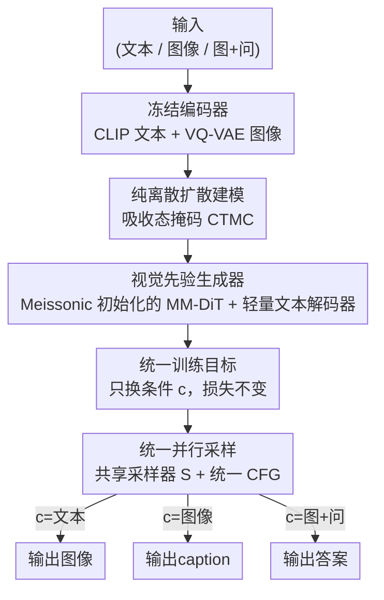

# Beyond Text-to-Image: Liberating Generation with a Unified Discrete Diffusion Model

**会议**: ICLR2026  
**OpenReview**: [https://openreview.net/forum?id=pG0WTde3pR](https://openreview.net/forum?id=pG0WTde3pR)  
**代码**: https://github.com/M-E-AGI-Lab/Muddit （模型权重 https://huggingface.co/MeissonFlow/Muddit）  
**领域**: 统一生成 / 离散扩散 / 多模态  
**关键词**: 统一生成模型、离散扩散、视觉先验、并行解码、MaskGIT

## 一句话总结
Muddit 把文本和图像放进同一套吸收态（掩码）离散扩散框架里，用一个从文生图模型 Meissonic 初始化的 MM-DiT 当共享生成器，只换条件信号 $c$ 就能并行完成文生图、图生文、VQA 三类任务，用 1B 参数在质量和效率上追平甚至超过大得多的自回归统一模型。

## 研究背景与动机
**领域现状**：统一生成模型想用一套架构和一种解码范式处理跨模态任务（文生图、图生文）。目前主流走两条路：一是自回归（AR）路线，把图像和文本都切成离散 token 序列、按光栅顺序逐个生成（Chameleon、LWM、Transfusion 等）；二是把 AR 和扩散"粘"在一起的混合架构，文本用 AR、图像用连续扩散。

**现有痛点**：AR 路线在图像上极慢——生成一张图要逐个预测上千个 token，计算开销巨大，而且强加的光栅顺序和图像本身的二维空间结构对不上，既限制了速度/质量的折中，也很难做 inpainting 这类灵活条件生成。混合"胶水"架构看似统一，实则在训练和推理管线里塞进了一堆特殊 token 和模板，文本与图像两套建模原理之间的鸿沟反而让系统更复杂。再往前一步的 D-DiT 想统一到扩散框架下，但图像仍用连续扩散、文本用离散扩散，两种生成原理的根本错配让它"统一"的说法站不住脚。

**核心矛盾**：真正的统一需要文本和图像共享**同一种生成原理**，但已有的纯离散统一尝试（UniDisc）虽然原理统一、能并行细化 token，质量却很差——连早期的 Stable Diffusion v1.5 都比不过，也做不了 VQA 这类视觉-语言推理。作者把症结归为"缺乏强先验知识"：UniDisc 从零训练，没有任何模块携带丰富先验，于是卡在泛化和扩展的瓶颈上。

**本文目标**：找一条既保持**原理统一**（纯离散扩散，两模态共用一套腐蚀过程和目标）、又**质量过硬**（不从零训）的路。

**切入角度**：作者注意到 MaskGIT 风格的文生图模型（Meissonic）本质就是离散扩散，且已经在高分辨率文生图上训练得很充分，携带了丰富的"视觉先验"。与其像并发工作那样在语言模型先验（预训练 dLLM）上接图像，不如反过来——**以图像生成先验为根基**，再补一个轻量文本解码器，把语言能力"长"上去。

**核心 idea**：用一个纯离散扩散的 MM-DiT，从文生图骨干初始化拿到强视觉先验，配一个轻量文本解码器，让同一套掩码扩散同时建模文本和图像；切换任务时只改条件 $c$，损失、解码、引导全都不变。

## 方法详解

### 整体框架
Muddit 的核心主张是：文本和图像可以共用**完全相同**的离散扩散腐蚀过程与训练目标，区别只在于"喂给生成器的条件是什么"。它把一个样本看成 one-hot 向量 $x\in\{1,\dots,N\}$——对文本 $N$ 是词表大小，对图像 $N$ 是 VQ 码本里的离散 token 数。前向过程是一条吸收态的连续时间马尔可夫链（CTMC）：每个 token 都可能跳到专门的掩码 token $m$ 上、一旦跳过去就再也回不来；反向过程就是训练模型把被掩掉的位置预测回干净 token。因为腐蚀调度和目标对任意离散字母表都一样，同一个扩散骨干天然能统一文本和图像。

架构上有六个部件：文本编码器 $E_{txt}$（冻结的 CLIP）、图像编码器 $E_{img}$（冻结的 VQ-VAE）、Transformer 生成器 $G$（一个 MM-DiT，沿用 FLUX 的双流/单流设计）、采样器 $S$、文本解码器 $D_{txt}$（一个轻量线性头）、图像解码器 $D_{img}$（VQ-VAE 解码）。关键在于 $G$ 用 **Meissonic** 的预训练权重初始化，把高分辨率文生图练出来的空间结构和语义关联直接搬过来。训练时随机掩掉某一个模态的 token，让 MM-DiT 用重加权交叉熵把它们预测回来；推理时从全掩码序列出发，迭代 $T$ 步把掩码位置逐渐填满。三类任务（T2I / I2T / VQA）共用同一个 $G$ 和同一个 $S$，唯一变化是条件来源 $c$。

### 关键设计

**1. 纯离散扩散统一文本与图像：让两模态共享同一种生成原理**

针对"AR 慢且顺序错配、混合架构是假统一、连续+离散错配"这三个痛点，Muddit 把两模态都收进吸收态（absorbing-state / 掩码）离散扩散。前向把 token 按概率掩掉，边缘分布写成 $q(x_t\mid x)=\text{Cat}\big(x_t\mid \alpha_t x+(1-\alpha_t)m\big)$，其中 $\alpha_t\in[0,1]$ 是"存活概率"（到时刻 $t$ 还没被掩的概率），$m$ 是吸收态掩码 token。反向后验有解析形式：若 $x_t$ 已经是真实 token 就保持不变，若 $x_t=m$ 则在掩码和干净 token 之间按存活概率做凸组合。训练用一个掩码预测器 $x_\theta(x_t,\alpha_t)\approx x$，对应连续时间负 ELBO

$$L_{\text{NELBO}}=\mathbb{E}_{q(x_t\mid x)}\Big[\int_0^1 \frac{\alpha_t'}{1-\alpha_t}\log\big(x_\theta(x_t,\alpha_t)\cdot x\big)\,dt\Big].$$

因为这套腐蚀调度和目标对任意离散字母表 $X$ 都成立，文本和图像就真正落到了**同一个生成原理**上——而不是 D-DiT 那样图像连续、文本离散的拼接，也不是 AR+扩散的胶水。这是 Muddit 敢称"真正统一"的根。

**2. 视觉先验初始化 + 轻量文本解码器：用文生图骨干补上 UniDisc 缺的先验**

UniDisc 原理对了但质量差，根因是从零训、没有先验。Muddit 直接把生成器 $G$（MM-DiT）用 Meissonic 的预训练权重初始化——Meissonic 是 MaskGIT 风格的高分辨率文生图模型，本身就是离散扩散，所以权重无缝迁移、还自带丰富的空间结构和图文语义关联。这个视觉先验显著提升了样本质量、也加快了多模态设定下的收敛。语言侧则只加一个**轻量线性头** $D_{txt}$ 当文本解码器：CLIP 给出文本 token 嵌入，MM-DiT 在共享空间预测干净 token，再由 $D_{txt}$ 映射回文本。有意思的是作者发现，新加的 `<mask>` 嵌入即使不训练也能在训练中被预测成连贯句子，所以干脆把它冻结。整套做法把"图像生成先验"当主干、把语言能力当轻量增量长上去，正好和并发工作"以语言模型先验为主干再接图像"反着走。

**3. 统一训练目标——只换条件、不换损失：让文生图与图生文共享一套参数**

要让一个参数集同时服务两个生成方向，关键是别给每个方向单独设计损失。Muddit 让 $c$ 表示跨模态条件（生成图像时是文本嵌入、生成 caption 时是图像嵌入），两个方向共用同一条连续时间负 ELBO

$$L_{\text{unified}}=\mathbb{E}_{q(x_t\mid x)}\Big[\int_0^1 \frac{\alpha_t'}{1-\alpha_t}\log\big(G(x_t,\alpha_t,c)\cdot x\big)\,dt\Big].$$

从"文本→图像"切到"图像→文本"，**只改条件信号 $c$，损失本身一字不动**。这种对称性让两个方向的优化完全一致，从而能用一套参数联合训练。掩码比例 $\gamma_t=1-\alpha_t$ 不像 BERT 用固定 15%（那适合补全、不适合生成），而是要求 $\gamma_t$ 在 $[0,1]$ 上连续、单调递减、边界 $\gamma_0\to0$（干净）、$\gamma_1\to1$（全掩），作者采用余弦调度、从截断的反余弦分布采时间步：$\gamma_t=\tfrac{2}{\pi}\big(1-(1-t)^2\big)^{-1/2}$。消融显示联合训练至关重要——只训图生文会让 GenEval 从 61.6 暴跌到 28.3。

**4. 统一并行采样 + 统一 CFG：一个采样器、一套引导覆盖三类任务**

推理时用反向后验作采样器

$$S(G,x_t,t)=p_\theta(x_s\mid x_t),\quad x_t\ne m\text{ 保持},\ \ x_t=m\text{ 时按 } (1-\alpha_s)m+\frac{(\alpha_s-\alpha_t)G(x_t,\alpha_t,c)}{1-\alpha_t}.$$

从全掩码序列出发，每步预测一部分掩码 token 并更新，迭代直到全部恢复。和 AR 必须学固定顺序的 $P(x_i\mid x_{<i})$ 不同，随机变比例掩码让模型学的是 $P(x_i\mid x_\Lambda)$（$\Lambda$ 是任意已观测子集），这正是**并行采样**能多 token 同时预测的前提。三类任务的差别只在 $c$：T2I 用 $c=E_{txt}(\text{prompt})$；I2T 用 $c=E_{img}(I)$；VQA 把图像和问题拼起来 $c=[E_{img}(I),E_{txt}(q)]$、在问题末尾追加掩码 token 当答案位预测。连分类器无关引导（CFG）都用同一条规则 $l\leftarrow G(z,\alpha,c)+\lambda\big(G(z,\alpha,c)-G(z,\alpha,c_{\text{neg}})\big)$，跟模态无关。损失、解码调度、引导算子在三个场景里完全一致——只有条件变，这才是"genuinely unified"。

### 损失函数 / 训练策略
两阶段训练，都用上面的统一目标 $L_{\text{unified}}$。**阶段一·预训练**：8M 图文对（用 Qwen2.5-VL-3B 重新打 caption 以提升一致性），文本截断到 77 token、图像 512×512，每个 batch 文生图和图生文各半，跑 100K 步。**阶段二·指令微调**：1M 指令样本（LLaVA-Instruct-150K、ALLaVA、SA-1B、VQAv2 训练集），只掩答案部分，再配 1M 高质量图文对支撑 VQA 与图像生成的多任务训练。学习率恒定 $1\times10^{-4}$、权重衰减 $1\times10^{-2}$、有效 batch 1024、16 张 H100 训 5 天。推理沿用 Meissonic 默认配置：余弦掩码调度、64 采样步，T2I 的 CFG=9.0、I2T 的 CFG=1.5。

## 实验关键数据

### 主实验
文生图在 GenEval 上评测（512×512，SFT 后）：

| 模型 | 架构（文/图） | 参数(B) | Overall ↑ | Two Obj. | Counting |
|------|------|------|------|------|------|
| Meissonic (1024) | -/离散扩散 | 1 | 0.54 | 0.66 | 0.42 |
| Monetico (512) | -/离散扩散 | 1 | 0.44 | 0.48 | 0.26 |
| UniDisc (512) | 离散/离散 | 1.4 | 0.42 | 0.47 | 0.15 |
| SD 3 | -/扩散 | 2 | 0.62 | 0.74 | 0.63 |
| D-DiT | 离散/扩散 | 2 | 0.65 | 0.80 | 0.54 |
| **Muddit (512)** | 离散/离散 | **1** | **0.61** | 0.72 | 0.54 |

Muddit 以 1B 参数拿到 0.61 的 Overall，明显超过同为离散扩散的 Meissonic（0.54）、Monetico（0.44）和 UniDisc（0.42），逼近 2B 的 SD 3（0.62）。

图生文 / VQA（多模态基准）：

| 模型 | 参数(B) | CIDEr ↑ | VQAv2 ↑ | MME ↑ | GQA ↑ |
|------|------|------|------|------|------|
| Show-O (512) | 1.3 | - | 69.4 | 1097.2 | 58.0 |
| D-DiT (512) | 2 | 56.2 | 60.1 | 1124.7 | 59.2 |
| UniDisc | 1.4 | 46.8 | - | - | - |
| **Muddit (512)** | **1** | **59.9** | **68.2** | 1107.4 | 57.5 |
| **Muddit (1024)** | 1 | 60.1 | 70.2 | 1139.2 | 57.8 |

CIDEr 59.9 超过扩散基线 D-DiT（56.2），VQAv2 68.2% 优于 Show-O 和 D-DiT；1024 版进一步提到 CIDEr 60.1 / VQAv2 70.2。

### 消融实验

| 配置 | GenEval | MS-COCO | VQAv2 | 说明 |
|------|------|------|------|------|
| 联合训练 | 61.6 | 59.9 | 68.2 | 完整模型 |
| 仅 T2I | 59.3 | - | - | GenEval 掉 2.3 |
| 仅 I2T | 28.3 | 60.1 | 69.1 | GenEval 暴跌一半多 |
| 文本损失权重=0.6 | 61.6 | 59.9 | 68.2 | 最佳折中 |
| 文本损失权重=1.0 | 58.3 | 59.4 | 69.2 | 生成质量被拖累 |
| 采样步 T=8 | 51.6 | 43.6 | 53.9 | 步数太少质量差 |
| 采样步 T=32 | 61.9 | 59.7 | 65.4 | 性能拐点 |
| 采样步 T=64 | 61.1 | 59.9 | 68.2 | VQA 仍在涨 |

### 关键发现
- **联合训练不可拆**：只训 I2T 会让 GenEval 从 61.6 跌到 28.3（两倍多），说明把两个方向的目标拆开会严重破坏跨模态整合，统一优化是保住多模态一致性的关键。
- **文本损失权重要平衡**：约 0.6 时 GenEval 和 CIDEr 同时见顶；权重过大（1.0）虽让 VQAv2 继续小涨，却拖累生成质量——判别任务偏好更重的文本监督，生成任务需要视觉与文本信号的均衡。
- **采样步数 32 是甜点**：GenEval 和 CIDEr 在 T=8→32 大幅提升、之后收益递减；VQAv2 这类判别任务对步数不敏感，更少步就够，体现了并行解码在效率上的余地。

## 亮点与洞察
- **"以视觉先验为根，长出语言能力"的反向思路**：并发统一模型大多拿预训练 dLLM 当语言先验主干再接图像，Muddit 反过来从文生图骨干 Meissonic 初始化、只补一个线性文本头——既继承了图像质量、又把语言能力以极低成本补齐，1B 参数就能对打大得多的 AR 模型。
- **"只换条件不换损失"的极简统一**：把多任务统一压缩成"换 $c$"这一个动作，损失/解码/CFG 全复用，是这篇最干净利落的设计；它说明只要生成原理真正统一（纯离散扩散），多任务统一可以不靠任何特殊 token 或模板拼接。
- **冻结 `<mask>` 嵌入的小发现**：新加的掩码嵌入不训练就能被预测成连贯句子，于是直接冻结——一个省事又不掉点的工程细节，可迁移到其他要给已有词表追加特殊 token 的离散扩散场景。
- **并行解码的效率本钱**：学 $P(x_i\mid x_\Lambda)$ 而非 AR 的固定顺序 $P(x_i\mid x_{<i})$，让多 token 同时预测成为可能，这是离散扩散相对 AR 统一模型在推理速度上的结构性优势。

## 局限与展望
- **依赖外部强骨干**：质量很大程度建立在 Meissonic 这个现成文生图先验上，方法本身的"统一框架"贡献与"借来的视觉先验"贡献不容易拆开评估；换一个更弱的初始化能否仍然 work 未充分验证。
- **判别基准仍有差距**：在 MME、GQA、MMMU 等纯多模态理解基准上，Muddit 离 InternVL-2.0、LLaVA-Next 这类大模型还有明显差距（如 MME 1139 vs InternVL 1648），统一模型在"理解"上仍弱于专精的大 VLM。
- **图生文质量参差**：论文展示的 caption 里能看到重复词、口吃式描述（"water water""model model"），说明轻量文本解码器在长文本生成上还不够稳。
- **改进方向**：把骨干从 1B 往上扩、或换更强的多模态视觉先验；探索更激进的并行采样以兑现离散扩散的速度优势；在指令微调阶段引入更强的语言侧监督来压住 caption 的重复问题。

## 相关工作与启发
- **vs UniDisc**：两者都是纯离散扩散统一多模态，原理一致；区别在 UniDisc 从零训、无先验导致质量差（GenEval 0.42、连 SD1.5 都比不过、不支持 VQA），Muddit 用 Meissonic 视觉先验初始化把质量拉到 0.61 并支持 VQA——证明"原理统一"和"质量过硬"可以兼得，缺的只是先验。
- **vs D-DiT**：D-DiT 想统一到扩散框架，但图像用连续扩散、文本用离散扩散，生成原理错配；Muddit 两模态全离散，是更彻底的统一，且在 GenEval（0.61 vs 0.65 但参数仅一半）和 CIDEr（59.9 vs 56.2）上更高效。
- **vs Show-O / Chameleon / Transfusion 等 AR 统一模型**：它们文本侧用 AR、解码慢且顺序与图像空间结构错配；Muddit 用并行离散扩散，1B 参数即可在多个基准上与 1.3B~8B 的 AR 模型竞争，体现纯离散扩散作为统一骨干的可扩展潜力。

## 评分
- 新颖性: ⭐⭐⭐⭐ 首个带视觉先验的纯离散扩散统一模型，"只换条件不换损失"的统一范式干净
- 实验充分度: ⭐⭐⭐⭐ 覆盖 T2I/I2T/VQA 三任务 + 联合训练/损失权重/步数三组消融，但理解类大基准对比偏弱
- 写作质量: ⭐⭐⭐⭐ 动机的"两朵乌云"叙事清晰，公式推导完整
- 价值: ⭐⭐⭐⭐ 为统一生成给出一条"纯离散扩散 + 视觉先验"的可扩展新路径，开源权重和代码

<!-- RELATED:START -->

## 相关论文

- [\[ICLR 2026\] Continuously Augmented Discrete Diffusion model for Categorical Generative Modeling](continuously_augmented_discrete_diffusion_model_for_categorical_generative_model.md)
- [\[ICLR 2026\] Improving Discrete Diffusion Unmasking Policies Beyond Explicit Reference Policies (UPO)](improving_discrete_diffusion_unmasking_policies_beyond_explicit_reference_polici.md)
- [\[ICLR 2026\] Consolidating Reinforcement Learning for Multimodal Discrete Diffusion Models](consolidating_reinforcement_learning_for_multimodal_discrete_diffusion_models.md)
- [\[ICCV 2025\] UniVG: A Generalist Diffusion Model for Unified Image Generation and Editing](../../ICCV2025/image_generation/univg_a_generalist_diffusion_model_for_unified_image_generation_and_editing.md)
- [\[ICLR 2026\] ReDDiT: Rehashing Noise for Discrete Visual Generation](reddit_rehashing_noise_for_discrete_visual_generation.md)

<!-- RELATED:END -->
