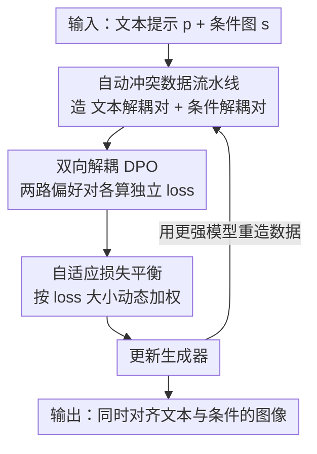

# BideDPO: Conditional Image Generation with Simultaneous Text and Condition Alignment

**会议**: ICLR2026  
**OpenReview**: [https://openreview.net/forum?id=DNBlGOsIxn](https://openreview.net/forum?id=DNBlGOsIxn)  
**代码**: [项目页 limuloo.github.io/BideDPO](https://limuloo.github.io/BideDPO/)  
**领域**: 扩散模型 / 条件图像生成 / 偏好优化  
**关键词**: 条件图像生成, DPO, 梯度解耦, 自适应损失平衡, 偏好数据

## 一句话总结
当文本提示和条件图（深度图/边缘图等）相互冲突时，现有可控生成模型只能二选一；本文提出双向解耦的 DPO 框架 BideDPO，把"对齐文本"和"对齐条件"拆成两组独立偏好对、用自适应损失平衡动态加权、再配上一条全自动构造"冲突感知偏好数据"的流水线和迭代自增强循环，在自建的 DualAlign 基准上把文本成功率最多提升 35%+ 的同时还改善了条件保真度。

## 研究背景与动机
**领域现状**：条件图像生成（ControlNet 系列、FLUX-Depth/Canny、Union-Pro2 等）在文生图基础上额外注入结构、空间或风格先验，已广泛用于设计、数字艺术等场景。它的标准玩法是把编码后的条件图和待生成图特征在输入通道拼接，端到端训练整网，让模型既听文本又听条件。

**现有痛点**：真实使用里，文本和条件经常**打架**，而现有模型无法在二者间做细腻权衡。作者明确归纳出两类冲突：其一是**输入级冲突（Input-Level Conflict）**——条件图自带强语义且和文本矛盾，比如条件是真狗的深度结构、文本却要"五只乐高积木狗"，默认设置下模型几乎照抄条件、无视文本；调低条件强度虽然更听文本，却又丢了空间/结构一致性。其二是**模型偏置冲突（Model-Bias Conflict）**——即便条件和文本本身兼容，模型学到的生成偏置也会压过文本，比如文本要"玉石质感的狗"，模型却固执地输出真狗皮毛纹理。

**核心矛盾**：这类冲突没有"唯一正确答案"，需要逐例做权衡（case-by-case trade-off），而标准监督微调（SFT）只能塞给模型一个固定的"标准答案"，天然不擅长表达这种偏好式权衡。偏好优化（DPO）看似对症，但直接套用到这个任务上又有两个硬伤：① **朴素 DPO 做不到双约束平衡**——每个样本只用一组偏好对（正样本两约束都满足、负样本都不满足），文本与条件的学习信号**耦合在同一个梯度里**，强信号会淹没弱信号，模型往往倒向条件、放弃文本；② **没有解耦的、冲突感知的偏好数据**——业界没有为条件生成、尤其是"文本与条件冲突"场景准备的 DPO 数据集。

**本文目标**：让一个可控生成模型在文本与条件冲突时，能同时尽量满足两边，而不是塌缩到单一约束。

**切入角度**：既然问题根源是"两路学习信号在一个梯度里互相干扰"，那就**从根上把两路信号拆开**——分别为"对齐文本"和"对齐条件"构造各自独立的偏好对，让每个目标都拿到一个干净、专属的梯度方向。

**核心 idea**：用"双向解耦的偏好对 + 自适应损失平衡 + 自动造冲突数据 + 迭代自增强"替换朴素 DPO 的单组耦合偏好对，从而在多约束冲突下同时对齐文本和条件。

## 方法详解

### 整体框架
BideDPO 的输入是一个文本提示 $p$ 和一张结构条件图 $s$（深度/Canny/软边缘/风格等），输出是一张**同时满足文本和条件**的图像。它把这件事拆成三个互相咬合的部件：先用一条**自动数据流水线**为每个样本造出两组"解耦、冲突感知"的偏好对（一组只考验文本对齐、一组只考验条件对齐）；再用**双向解耦 DPO 算法**把这两组偏好对喂进训练，使文本梯度和条件梯度各走各路、互不吞噬；其间由**自适应损失平衡**根据两路 loss 的当前大小动态分配权重，防止训练倒向某一边；最后因为造数据用的就是当前模型本身，整个过程被嵌进一个**迭代优化循环**——模型变强→造出更好的数据→再训出更强的模型，自我强化。下图给出自上而下的流向：

### 关键设计

**1. 双向解耦 DPO：把纠缠在一起的文本/条件梯度拆成两路**

针对"朴素 DPO 梯度纠缠、弱约束被淹没"这个根本痛点。先把文本和条件打包成复合上下文 $c=(p,s)$，并假设整体偏好分由文本分量和条件分量线性组合：$f(x,c;\omega)=\varepsilon_{\text{text}}f_{\text{text}}+\varepsilon_{\text{cond}}f_{\text{cond}}$。朴素 DPO 对一组耦合偏好对求导后，梯度里两个目标项相加共享一个 sigmoid 因子（见原文 Eq. 3-4），一旦某个目标梯度远强于另一个，弱目标就会被掩盖、甚至在冲突时被推向反方向。BideDPO 的做法是**每个样本造两组独立偏好对**：文本对 $(x_T^+, x_T^-, c_0)$ 中两张图对条件 $s_0$ 的贴合度相近、但只有 $x_T^+$ 听文本；条件对 $(x_C^+, x_C^-, c_1)$ 中两张图都听文本、但 $x_C^+$ 比 $x_C^-$ 更贴合条件 $s_1$。于是文本 loss 和条件 loss 各自独立计算：
$$\mathcal{L}_{\text{text}}=-\log\sigma\big(f_{\text{text}}(x_T^+,c_0)-f_{\text{text}}(x_T^-,c_0)\big),\quad \mathcal{L}_{\text{cond}}=-\log\sigma\big(f_{\text{cond}}(x_C^+,c_1)-f_{\text{cond}}(x_C^-,c_1)\big).$$
这样最终梯度是两项**完全解耦的求和**（原文 Eq. 9），每个目标都拿到一个不被对方"吞掉"的专属优化信号——这正是它能同时改善两边的关键，而不是像朴素 DPO 那样一边倒。

**2. 自适应损失平衡（ALB）：按 loss 大小动态分配权重，谁落后补谁**

解耦只是让两路梯度不再互相吞噬，但两个目标的 loss 量级可能差很多，若直接相加仍会被大的那个主导。ALB 用一个简单却有效的规则：权重正比于各自当前 loss 占比，且用停止梯度算子 $\text{sg}(\cdot)$ 把权重当作常数、不参与反传以保证稳定：
$$w_{\text{text}}=\text{sg}\!\left(\frac{\mathcal{L}_{\text{text}}}{\mathcal{L}_{\text{text}}+\mathcal{L}_{\text{cond}}}\right),\quad w_{\text{cond}}=\text{sg}(1-w_{\text{text}}),$$
总损失 $\mathcal{L}=w_{\text{text}}\mathcal{L}_{\text{text}}+w_{\text{cond}}\mathcal{L}_{\text{cond}}$。直觉是哪个目标当前更"差"（loss 更大），就给它更大权重去补齐，从而让两边均衡推进、避免塌缩到单约束。消融里去掉 ALB 后文本成功率从 0.84 掉到 0.78，证明它对平衡至关重要。在扩散模型上，奖励被定义为相对参考网络的去噪误差降幅 $r(x_t,c,\epsilon;\omega)=\|\epsilon-\epsilon_{\text{ref}}\|^2-\|\epsilon-\epsilon_\omega\|^2$，文本对和条件对各算一个奖励差 $R_T,R_C$，再由 $w_{\text{text}},w_{\text{cond}}$ 自适应加权成最终 BideDPO 损失。

**3. 自动构造解耦、冲突感知的偏好数据：先无数据，就让模型自己造**

这一设计针对"业界没有条件生成 DPO 数据、尤其缺冲突样本"的空白。流水线分三步全自动跑：① 用 LLM 生成一个简单的 Source Prompt 和一个更细致的 Target Prompt $p$，再用 Source Prompt 产出初始条件图 $s_0$——这样造出的 $s_0$ 与 $p$ 天然容易撞上输入级或模型偏置冲突；② 造**文本解耦对** $(x_T^+, x_T^-, p, s_0)$：两张图都贴合 $s_0$，正样本 $x_T^+$ 由 Target Prompt 生成且经 VLM 验证文本对齐（作为高质量锚点），负样本 $x_T^-$ 由 Source Prompt 生成、故缺乏对 Target Prompt 的文本对齐；③ 造**条件解耦对** $(x_C^+, x_C^-, p, s_1)$：两张图都听 $p$，把锚点 $x_T^+$ 直接当正样本 $x_C^+$，并从它身上抽出一张严格对齐的新条件图 $s_1$，再生成一张对 $s_1$ 贴合度更松、但语义仍合 $p$ 的负样本 $x_C^-$。整条流水线用 VLM（如 GPT-4.5、Qwen2.5-VL）做质量校验，从而系统化地把"文本对齐"和"条件对齐"两个维度**隔离开**来分别考核，且能轻松迁到风格-文本对齐等其他任务。

**4. 迭代优化：生成器造数据、数据训生成器，自我强化的闭环**

因为偏好数据是用当前生成器本身造的，整个框架天然支持迭代精炼。从初始生成器 $G_0$ 出发，用流水线造数据并以 BideDPO 训练得到更强的 $G_1$；再用 $G_1$ 造质量更高的数据训出 $G_2$……如此交替，形成"数据质量↑↔生成器能力↑"的自增强螺旋。实验显示第 3 轮迭代达到最佳（文本成功率 0.84→0.88、SGMSE 也下降），且即便只迭代一轮也已显著超越基线，说明这是个可按预算停的渐进过程而非必须跑满。

### 一个完整示例
以"五只乐高积木狗"为例走一遍：条件图 $s_0$ 是一只真狗的深度结构，文本 $p$ 要的是乐高质感——典型输入级冲突。数据流水线先用 Source Prompt（"狗"）+ $s_0$ 生成一张缺乏"乐高"语义的图当文本负样本 $x_T^-$，再用 Target Prompt（"乐高狗"）生成并经 VLM 确认文本达标的 $x_T^+$ 当正锚点；接着从 $x_T^+$ 抽出严格对齐的新条件 $s_1$，造一张条件贴合更松的 $x_C^-$。训练时，文本对推动模型把"乐高质感"学进去（文本 loss 大就被 ALB 加权补齐），条件对维持空间结构忠实于深度图，两路梯度互不干扰。一轮训完后生成器已能输出"乐高材质 + 真狗姿态结构"兼顾的图，再把它放回流水线造更干净的数据，迭代到第 3 轮收敛。

### 损失函数 / 训练策略
基座为 FLUX 及其条件变体（FLUX-Depth/Canny、Union-Pro2）。每轮生成 5,000 个样本；先用全部正样本做 SFT（Prodigy 优化器，学习率 1.0，5,000 步），再从 SFT 模型出发做 DPO/BideDPO（AdamW，学习率 4e-5，权重衰减 0.01，额外 2,000 步）。全部用 LoRA（rank=256）微调。损失即第 1、2 点中由 $w_{\text{text}},w_{\text{cond}}$ 自适应加权的解耦 DPO 目标。

## 实验关键数据

### 主实验
自建 **DualAlign 基准**评估文本-条件冲突下的双对齐能力，覆盖深度/Canny/软边缘/风格四类条件，每类 100 例（测试集物体、场景、描述与训练集不重叠）。指标含成功率 SR（Qwen2.5-VL-72B 判文本是否达标）、CLIP Score、衡量条件保真的 MSE/F1/SSIM，以及把文本失败纳入惩罚的语义引导版 SGMSE/SGF1/SGSSIM。下表为深度条件结果（↑越高越好的 SR/CLIP，↓越低越好的 MSE/SGMSE）：

| 方法（深度条件） | SR↑ | MSE↓ | SGMSE↓ | CLIP↑ |
|--------|------|------|--------|-------|
| Union-Pro2 | 0.49 | 177.0 | 272.4 | 0.2748 |
| Union-Pro2 + SFT | 0.70 | 262.2 | 332.5 | 0.2915 |
| Union-Pro2 + DPO | 0.71 | 168.3 | 219.9 | 0.2860 |
| **Union-Pro2 + Ours** | **0.84** | **164.0** | **195.7** | 0.2924 |
| FLUX-Depth | 0.76 | 233.6 | 282.8 | 0.2899 |
| FLUX-Depth + DPO | 0.89 | 171.9 | 195.0 | 0.2974 |
| **FLUX-Depth + Ours** | **0.91** | **145.9** | **164.4** | **0.2982** |

Canny 条件下，Union-Pro2 的 SR 从 0.34→0.68（+34%）、FLUX-Canny 从 0.33→0.73（+40%，甚至超过原始 T2I FLUX 的文本对齐）；软边缘条件下也同步改善。COCO 鲁棒性测试（训练未用过的数据集）上，本文方法相对原模型仍有提升（如 canny 条件 +15% 级别），说明没有损害基座的通用能力。注意：以上主结果均**未开启迭代优化**。

### 消融实验

| 配置 | SR↑ | MSE↓ | SGMSE↓ | CLIP↑ | 说明 |
|------|------|------|--------|-------|------|
| Iter=3 (Ours) | **0.88** | 159.6 | **190.3** | **0.2957** | 迭代 3 轮，最优 |
| Iter=1 | 0.84 | 164.0 | 195.7 | 0.2924 | 单轮已显著超基线 |
| w/o ALB | 0.78 | 157.7 | 205.2 | 0.2862 | 去掉自适应损失平衡，SR 掉 6 个点 |
| Text. Only | 0.88 | 258.9 | 287.7 | 0.2947 | 只用文本偏好对，条件 MSE 暴涨 |
| Cond. Only | 0.59 | 153.7 | 218.7 | 0.2753 | 只用条件偏好对，文本 SR 崩到 0.59 |

### 关键发现
- **解耦是双对齐的前提**：Text Only 文本好（SR 0.88）但条件 MSE 飙到 258.9；Cond Only 条件好（MSE 153.7）但文本 SR 崩到 0.59——只有把两路偏好对都用上才能两边兼顾，印证了"梯度纠缠"才是朴素 DPO 的病根。
- **ALB 贡献明确**：去掉自适应损失平衡 SR 从 0.84 掉到 0.78，且 SGMSE 反而变差，说明动态加权确实在防止训练倒向单约束。
- **迭代收益递减且会过拟**：第 3 轮最优，第 4 轮 SR、MSE 反而回落，迭代不是越多越好。
- **DPO 系优于 SFT**：SFT 虽提升文本 SR，但常以牺牲条件保真为代价（如 Union-Pro2+SFT 的 MSE 262 远高于 +Ours 的 164）。

## 亮点与洞察
- **把"梯度纠缠"作为一类病因点名**：作者没有停在"模型听条件不听文本"的现象，而是定位到朴素 DPO 单组耦合偏好对导致的梯度互相吞噬，再用"拆成两组解耦偏好对"对症下药——这个从现象到优化动力学的归因很有说服力。
- **解耦偏好对的构造很巧**：文本对固定条件、只变文本对齐；条件对固定文本、只变条件对齐，且把文本正锚点 $x_T^+$ 复用为条件对正样本 $x_C^+$，省了一次生成又保证两组对在同一锚点上对齐，可迁移到风格-文本等其他双约束任务。
- **自造数据 + 自迭代闭环**：偏好数据来自模型自身，使"训练→造更好数据→再训"形成自然的自增强循环，无需人工标注偏好，工程上很实用。
- **SGMSE/SGF1/SGSSIM 这类语义引导指标**：把"文本失败就翻倍惩罚 MSE / F1 置零"的思路值得借鉴——单看条件保真会奖励那些"完美抄条件但无视文本"的退化解，语义门控指标堵住了这个漏洞。

## 局限与展望
- **依赖 VLM 质检的数据质量天花板**：整条流水线的正负样本筛选靠 VLM（GPT-4.5、Qwen2.5-VL）判定，VLM 的误判会直接污染偏好数据，作者未充分分析其错误率对训练的影响。
- **评测偏自动指标**：成功率由 VLM 判定、缺少大规模人评，自动判定与人类偏好的一致性存疑。
- **迭代成本与过拟合**：每轮造 5,000 样本 + 两阶段训练，迭代多轮成本不低，且第 4 轮已出现性能回落，最优迭代数需要按经验调。
- **冲突场景偏合成**：DualAlign 基准用与训练同源的流水线构造，虽做了物体/场景不重叠，但仍是合成冲突，真实用户 prompt 的分布覆盖度未知。

## 相关工作与启发
- **vs 朴素 Diffusion-DPO**：二者都用 DPO 对齐扩散模型偏好，但 Diffusion-DPO 用单组耦合偏好对，在多约束冲突下梯度纠缠、倒向强约束；BideDPO 把偏好对双向解耦 + 自适应平衡，提供每个目标专属的清晰梯度，这是它能同时对齐文本和条件的根本区别。
- **vs ControlNet++ / Union-Pro2 / FLUX-Depth 等可控生成**：这些方法解决"如何注入条件"，但默认设置下文本与条件冲突时只能偏向条件；BideDPO 不改架构，而是作为后训练方法，专门解决"冲突时怎么权衡"，可叠加在它们之上。
- **vs SFT**：SFT 给模型一个固定标准答案，无法表达逐例权衡的偏好，且常牺牲条件保真；本文用偏好优化保留了"哪个更好"的相对判断，在相同正样本下显著优于 SFT。

## 评分
- 新颖性: ⭐⭐⭐⭐⭐ 首次形式化"文本-条件对齐冲突"并提出双向解耦 DPO + 冲突感知数据流水线，问题定义和方法都有原创性。
- 实验充分度: ⭐⭐⭐⭐ 覆盖深度/Canny/软边缘/风格四模态 + COCO 鲁棒性 + 完整消融，但缺人评、VLM 判定一致性未验证。
- 写作质量: ⭐⭐⭐⭐⭐ 从现象到优化动力学的归因清晰，图示（两类冲突、解耦对、迭代循环）很到位。
- 价值: ⭐⭐⭐⭐⭐ 即插即用的后训练方法，解决可控生成的实际痛点，且可迁移到其他双约束任务。

<!-- RELATED:START -->

## 相关论文

- [\[CVPR 2026\] DynFusion: Rethinking Condition Fusion for Adaptive Multi-Conditional Text-to-Image Generation](../../CVPR2026/image_generation/dynfusion_rethinking_condition_fusion_for_adaptive_multi-conditional_text-to-ima.md)
- [\[ICLR 2026\] Condition Errors Refinement in Autoregressive Image Generation with Diffusion Loss](condition_errors_refinement_in_autoregressive_image_generation_with_diffusion_lo.md)
- [\[ICLR 2026\] Condition Matters in Full-head 3D GANs](condition_matters_in_full-head_3d_gans.md)
- [\[ICLR 2026\] Beyond Text-to-Image: Liberating Generation with a Unified Discrete Diffusion Model](beyond_text-to-image_liberating_generation_with_a_unified_discrete_diffusion_mod.md)
- [\[ICLR 2026\] CreatiDesign: A Unified Multi-Conditional Diffusion Transformer for Creative Graphic Design](creatidesign_a_unified_multi-conditional_diffusion_transformer_for_creative_grap.md)

<!-- RELATED:END -->
