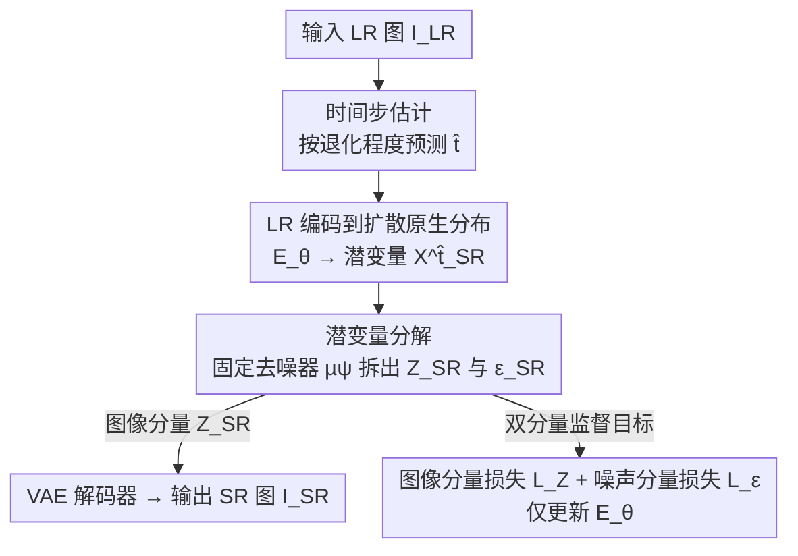

# Bridging the Distribution Gap to Harness Pretrained Diffusion Priors for Super-Resolution

**会议**: ICLR2026  
**OpenReview**: [https://openreview.net/forum?id=66Ad0i78lW](https://openreview.net/forum?id=66Ad0i78lW)  
**代码**: 待确认  
**领域**: 图像超分辨 / 图像恢复 / 扩散模型  
**关键词**: 超分辨率, 预训练扩散先验, 分布匹配, 单步扩散, 时间步估计

## 一句话总结
DM-SR 不动预训练扩散模型一根毫毛，只训练一个图像编码器，把低分辨率图直接"翻译"到扩散模型熟悉的"含噪图像"分布上，再用固定去噪器一步生成超分结果，从而在单步扩散下取得当前最佳的感知质量。

## 研究背景与动机

**领域现状**：扩散模型凭借强大的生成先验，近年被大量用于单图超分辨（SISR）。主流做法是把低分辨率（LR）图当作条件（ControlNet 式），从纯高斯噪声起步、多步去噪生成高分辨率（HR）图，如 StableSR、SeeSR 等。

**现有痛点**：这条路有两类毛病。其一，多步从纯噪声起步的方案计算开销大、会冗余地"重新生成"LR 里本就存在的信息，且对初始噪声敏感；其二，为压到单步，OSEDiff/SinSR 等用蒸馏把扩散知识灌进一个 SR 网络，但**微调去噪器本身会损伤它原有的生成先验**，导致感知质量反而下降。InvSR 则干脆不训去噪器、直接预测噪声，但它假设"加噪后的 HR 与 LR 不可区分"——这个假设在小时间步下并不成立：时间步小的时候原始信号保留得多，加噪 HR 和加噪 LR 的分布其实差得很远。

**核心矛盾**：扩散模型是在"自然图像 + 高斯噪声"的分布上训练的，而 LR 图来自一个**完全不同的退化分布**。要想直接喂给预训练去噪器，要么改模型（伤先验），要么硬套不成立的假设（掉质量）。两边都不讨好，根因是**没人去正面弥合这道分布鸿沟**。

**本文目标**：在完全不修改预训练扩散模型的前提下，让 LR 图也能被它直接处理，同时把扩散过程压到单步。

**切入角度**：作者提出一个朴素却关键的反问——既然预训练扩散模型本就擅长对"含噪图像分布"的样本去噪，那为什么不**直接把 LR 图变换到这个分布里**？与其逼模型去适应 LR，不如逼 LR 去适应模型。

**核心 idea**：只训练一个图像编码器，把 LR 图映射成"图像分量 + 噪声分量"的混合潜变量，使其落在预训练扩散模型某个时间步所熟悉的分布上；并根据每张图的退化程度自适应地预测该用哪个时间步，从而单步还原出高感知质量的 HR 图。

## 方法详解

### 整体框架

DM-SR（Distribution-Matching Super-Resolution）的全过程可以这样鸟瞰：给定一张 LR 图 $I_{LR}$，先由一个**时间步估计器** $T$ 根据其退化程度预测一个合适的时间步 $\hat{t}$；再由**图像编码器** $E_\theta$ 把 $I_{LR}$ 和 $\hat{t}$ 一起编码成潜变量 $X^{\hat{t}}_{SR}$，目标是让它对齐"加噪 HR 潜变量"$X^{\hat{t}}_{HR}$ 的分布；接着借助**固定不动**的预训练去噪器 $\mu_\psi$ 把 $X^{\hat{t}}_{SR}$ 分解成图像分量 $Z_{SR}$ 与噪声分量 $\epsilon_{SR}$；最后把 $Z_{SR}$ 送进预训练 VAE 解码器得到最终 SR 图 $I_{SR}$。整个推理只需扩散去噪器跑一步。训练时也只更新编码器 $E_\theta$（及其内含的时间步估计器），扩散去噪器 $\mu_\psi$ 和 VAE 全程冻结。

### 关键设计

**1. 时间步估计：让噪声水平随退化程度自适应，而非一刀切**

扩散模型在不同时间步上"熟悉"的图像-噪声配比是不同的：加噪 HR 潜变量满足 $X^{t}_{HR}=\sqrt{\bar\alpha_t}\,X^{0}_{HR}+\sqrt{1-\bar\alpha_t}\,\epsilon$，时间步 $t$ 越小保留的原始信号越多、越大则越接近纯噪声。InvSR 给所有样本套同一个固定时间步，这正是它假设"加噪 HR≈加噪 LR"会失效的地方。DM-SR 的做法是：退化轻的图配小时间步（多保留内容），退化重的图配大时间步（让生成先验多介入、多"创作"）。怎么量化退化程度？作者用 $I_{LR}$ 与对应 $I_{HR}$ 之间归一化到 $[0,500]$ 的 LPIPS 分数当作真值时间步 $t$，训练一个时间步估计器 $T$ 去回归它。之所以选 LPIPS 而非像素距离或 SSIM，是因为消融（表 5）显示 LPIPS 作监督信号给出最好的感知结果——它更贴合"人眼可感知的退化"。一个有意思的实验现象（表 3）是：在固定时间步里，**大时间步普遍比小时间步效果更好**，因为小时间步会保留过多 LR 内容、反而和真实 HR 分布对不上；而自适应预测的 $\hat{t}$ 又稳压所有固定值。

**2. LR 编码到扩散原生分布：把"翻译"工作全压到一个编码器上**

这一步是全文唯一被训练的网络。编码器 $E_\theta$ 接收 $I_{LR}$ 和预测时间步 $\hat{t}$，在**潜空间**（沿用 Stable Diffusion 降算力的思路）里把 LR 图映射成潜变量 $X^{\hat{t}}_{SR}$，目标分布是同一时间步下的加噪 HR 潜变量 $X^{\hat{t}}_{HR}$（其中 $X^{0}_{HR}$ 由预训练 VAE 编码 $I_{HR}$ 得到，再按上面的加噪公式得到 $X^{\hat{t}}_{HR}$）。架构上 $E_\theta$ 直接用预训练 VAE 编码器初始化，并仿照 ControlNet：把 $\hat{t}$ 派生的特征经单层线性映射注入到每个中间层，从而让编码结果随时间步条件而变。关键点在于——所有"弥合分布鸿沟"的活儿都交给这个轻量编码器，预训练去噪器原封不动，生成先验因此被**完整保留**，这正是它区别于"微调去噪器伤先验"那一派方法的根本。

**3. 潜变量分解：用固定去噪器把混合潜变量拆成图像与噪声两半，好做监督**

编码器吐出的 $X^{\hat{t}}_{SR}$ 理应对齐 $X^{\hat{t}}_{HR}$，可后者依赖随机采样的噪声 $\epsilon$，直接逐元素监督并不稳。作者的巧办法是：借**固定**的预训练去噪器 $\mu_\psi$ 把 $X^{\hat{t}}_{SR}$ 显式分解成图像分量 $Z_{SR}$ 和噪声分量 $\epsilon_{SR}$：

$$\epsilon_{SR}=\mu_\psi\!\left(X^{\hat{t}}_{SR},\hat{t}\right),\qquad Z_{SR}=\frac{1}{\sqrt{\bar\alpha_{\hat{t}}}}\left(X^{\hat{t}}_{SR}-\sqrt{1-\bar\alpha_{\hat{t}}}\,\epsilon_{SR}\right).$$

这里的假设是：去噪器估出来的就是噪声分量 $\epsilon_{SR}$，剩下那部分对应一张真实图像的潜表示 $Z_{SR}$（文本条件用固定提示词"High-quality, photo-realistic, ..."）。分解之后，就能对 $Z_{SR}$ 和 $\epsilon_{SR}$ **分别施加更有针对性的监督**，再让二者组合回 $X^{\hat{t}}_{SR}$ 去对齐 $X^{\hat{t}}_{HR}$ 的分布。推理阶段，只需把 $Z_{SR}$ 交给 VAE 解码器即得 $I_{SR}$，全程去噪器只前向一次。

**4. 双分量监督目标：图像分量求"像 HR"，噪声分量求"能还原 HR"**

针对分解出的两半，作者各设计一组损失，融成总损失 $L_{tot}=L_Z+L_\epsilon$。

对**图像分量** $Z_{SR}$，用 HR 潜变量 $X^{0}_{HR}$ 做监督，组合了 L1、感知、对抗、分布匹配四项：$L_Z=\lambda_{L1}L_{L1}+\lambda_{per}L_{per}+\lambda_{adv}L_{adv}+\lambda_{dm}L_{dm}$（权重 $1.0/2.0/0.1/0.5$）。其中两点值得拎出来：① 对抗损失里的判别器 $D_\phi$ 不是简单地分"HR vs SR"，而是仿 ControlNet 把 $I_{LR}$ 当条件输入，去判别 $Z_{SR}$ 还是真潜变量 $X^{0}_{HR}$——这样判别器不仅评"真不真"，还评"和输入 LR 对不对得上"，专治 $Z_{SR}$"看着真实但内容跑偏"的毛病；② 分布匹配损失 $L_{dm}$ 借鉴扩散蒸馏（DMD），给 $Z_{SR}$ 和 $X^{0}_{HR}$ 加同一随机噪声后，要求固定去噪器 $\mu_\psi$ 对两者预测出一致的得分函数，期望跨 $\hat{t}\in[1,500]$ 取，从分布层面把 $Z_{SR}$ 往 $X^{0}_{HR}$ 拉。

对**噪声分量** $\epsilon_{SR}$，则希望它是"最优噪声"——即加到 $X^{0}_{HR}$ 上再过去噪器能重建出原 HR：

$$L_\epsilon=\mathbb{E}\left[\,\big\lVert \mu_\psi(\sqrt{\bar\alpha_t}X^{0}_{HR}+\sqrt{1-\bar\alpha_t}\,\epsilon_{SR},\hat{t})-\epsilon_{SR}\big\rVert\,\right].$$

这条约束让噪声分量也携带与输入相关的语义信息，而不只是随机噪声。一个有趣的副产物（图 4）是：尽管从未显式约束 $\epsilon_{SR}$ 服从高斯，它最终自然地近似高斯分布。

### 损失函数 / 训练策略

总损失即 $L_{tot}=L_Z+L_\epsilon$，只反传梯度到编码器 $E_\theta$，去噪器 $\mu_\psi$ 与判别器 $D_\phi$ 在对应更新中均冻结。去噪器选用单步高效的 **SD-Turbo**；编码器用预训练 VAE 编码器初始化。训练数据为 DF2K + LSDIR，LR/HR patch 取 $512\times512\times3$，batch size 16，LR 由 4× 下采样后双三次上采样得到（沿用 ResShift 流程）；AdamW 优化 300k 步，初始学习率 $1\times10^{-4}$，每 100k 步减半。

## 实验关键数据

### 主实验

在合成（ImageNet）与真实退化（DRealSR / RealSR / RealSet80）基准上做 ×4 超分，主打无参考感知指标。下表摘 ImageNet 与 RealSet80：

| 数据集 | 方法 | CLIP-IQA↑ | TOPIQ(NR)↑ | MANIQA↑ | MUSIQ↑ |
|--------|------|-----------|------------|---------|--------|
| ImageNet | InvSR-1 | 0.711 | 0.630 | 0.469 | 72.382 |
| ImageNet | **DM-SR-1** | **0.785** | **0.712** | **0.633** | **73.856** |
| RealSet80 | InvSR-1 | 0.727 | 0.623 | 0.466 | 69.798 |
| RealSet80 | **DM-SR-1** | **0.797** | **0.707** | **0.600** | **70.616** |

DM-SR 在感知指标上全面领先既有单步扩散方法（SinSR/OSEDiff/InvSR）和 50 步的 StableSR。效率上（RealSR，A100，128² 上采样）DM-SR 可训练参数 34.16M、运行时仅 92ms，是扩散类里**最快**的，远低于 StableSR-50 的 3460ms。代价是参考指标（PSNR/SSIM/LPIPS）不拔尖——属于感知-失真权衡里偏感知的一侧。

### 消融实验

| 配置 | LIQE↑ | CLIP-IQA↑ | TOPIQ(NR)↑ | MUSIQ↑ | 说明 |
|------|-------|-----------|-----------|--------|------|
| 仅 $L_{L1}+L_{per}$ | 3.643 | 0.726 | 0.575 | 64.153 | 基线 |
| +$L_{adv}$ | 4.579 | 0.779 | 0.694 | 69.947 | 对抗损失增益最大 |
| +$L_{dm}$ | 4.171 | 0.756 | 0.614 | 69.089 | 单加增益有限 |
| +$L_\epsilon$ | 4.195 | 0.756 | 0.615 | 69.189 | 单加增益有限 |
| 全部（DM-SR） | **4.652** | **0.797** | **0.707** | **70.616** | 三项协同最优 |

时间步真值的消融（表 5）显示 LPIPS 优于像素距离与 SSIM；自适应 $\hat{t}$（表 3）优于任何固定时间步；时间步真值用"在 $\hat{t}\!-\!1,\hat{t},\hat{t}\!+\!1$ 里选最小 $\lVert Z_{SR}-X^0_{HR}\rVert$"的方案会梯度不稳、坍缩到单一时间步。

### 关键发现
- **对抗损失贡献最大**：在 L1+感知基线上加 $L_{adv}$ 就把感知指标拉起来一大截，$L_{dm}$/$L_\epsilon$ 单独加只有边际提升，但三者同时启用才到最优，说明它们互补、有协同。
- **步数不是越多越好**：1/2/5 步质量相近，10 步反而最差——因为底座 SD-Turbo 擅长少步去噪，迭代过多会过度平滑。
- **文本提示有上限收益**：用 LLaVA 提取输入特定提示词（表 7）比固定提示词略好；因为去噪器没被微调，测试时换提示词无需重训。

## 亮点与洞察
- **"让数据迁就模型"而非"让模型迁就数据"**：核心反转是不碰预训练扩散模型，只训一个编码器把 LR 搬进模型的原生分布，生成先验因此零损耗——这个思路可迁移到去模糊、去噪等其它"分布不匹配"的恢复任务。
- **借固定去噪器做潜变量分解**：用冻结的 $\mu_\psi$ 把混合潜变量拆成图像/噪声两半，避开了"随机噪声无法逐元素监督"的难题，是很可复用的工程技巧。
- **退化程度→时间步的自适应映射**：把"图有多糊"量化成 LPIPS 再回归成时间步，等于让模型自己决定"该让生成先验介入多少"，比一刀切的固定时间步合理得多。
- **噪声分量自发高斯化**：从未显式约束却近似高斯，侧面印证了"最优噪声"假设的合理性。

## 局限与展望
- **失真指标不拔尖**（作者承认）：偏向感知质量会带来与输入的细微偏差，如图 5 把灰色瞳孔生成成黑色。作者指出可通过语义级颜色对齐、或用输入特定文本提示来缓解（图 5g 指定瞳孔颜色后明显改善）。
- **时间步真值的形式仍待优化**：LPIPS 只是当前最好的选择之一，作者明确表示可能存在更优的时间步监督定义，留作未来工作。
- **依赖 SD-Turbo 的少步特性**：方法效果与底座绑定较紧，换到非蒸馏扩散底座、或步数放大时行为可能不同（10 步即过平滑）。
- **固定提示词留性能在桌上**：输入特定提示词能进一步提升，但需要额外的 caption 模型（LLaVA），实际部署有取舍。

## 相关工作与启发
- **vs StableSR / SeeSR（ControlNet 微调派）**：它们微调少量层、从纯噪声多步起步；DM-SR 不微调去噪器、单步、直接把 LR 映入原生分布，先验保留更完整、更快。
- **vs OSEDiff / SinSR（蒸馏单步派）**：它们把扩散知识蒸进一个从扩散底座微调来的 SR 网络，微调会损伤生成先验；DM-SR 只训外挂编码器、去噪器零改动，感知质量更高。
- **vs InvSR（噪声预测派）**：InvSR 假设"加噪 HR≈加噪 LR"并套固定时间步，小时间步下假设失效；DM-SR 用自适应时间步 + 显式分布匹配，正面修掉了这个假设漏洞。

## 评分
- 新颖性: ⭐⭐⭐⭐⭐ "让 LR 迁就模型"的视角反转 + 固定去噪器做潜变量分解，简洁而有效
- 实验充分度: ⭐⭐⭐⭐ 多基准、多指标、消融完整，但失真指标偏弱、缺与更多最新方法的横评
- 写作质量: ⭐⭐⭐⭐ 动机推导清晰，公式与图配合到位
- 价值: ⭐⭐⭐⭐ 单步高感知质量超分，且"编码器搬分布"范式可外推到其它恢复任务

<!-- RELATED:START -->

## 相关论文

- [\[CVPR 2025\] FaithDiff: Unleashing Diffusion Priors for Faithful Image Super-Resolution](../../CVPR2025/image_generation/faithdiff_unleashing_diffusion_priors_for_faithful_image_super-resolution.md)
- [\[CVPR 2026\] Bridging Fidelity-Reality with Controllable One-Step Diffusion for Image Super-Resolution](../../CVPR2026/image_generation/bridging_fidelity-reality_with_controllable_one-step_diffusion_for_image_super-r.md)
- [\[ICLR 2026\] Bridging Generalization Gap of Heterogeneous Federated Clients Using Generative Models](bridging_generalization_gap_of_heterogeneous_federated_clients_using_generative_.md)
- [\[ECCV 2024\] XPSR: Cross-modal Priors for Diffusion-based Image Super-Resolution](../../ECCV2024/image_generation/xpsr_crossmodal_priors_for_diffusionbased_image_superresolut.md)
- [\[ICLR 2026\] Decoupled DMD: CFG Augmentation as the Spear, Distribution Matching as the Shield](decoupled_dmd_cfg_augmentation_as_the_spear_distribution_matching_as_the_shield.md)

<!-- RELATED:END -->
